# chatGPT 加 NebulaGraph 预测 2022 世界杯冠军球队


> 一次利用 chatGPT 给出数据抓取代码，借助 NebulaGraph 图数据库与图算法预测体育赛事的尝试。

<!--more-->

<!--

> chatGPT and Nebulagraph Predict Fifa World Cup

[TOC]

-->

## 蹭热度

最近因为世界杯进行时，被这篇 [Cambridge Intelligence](https://cambridge-intelligence.com/fifa-world-cup-2022-prediction/) 的文章启发（仅仅利用有限的信息量和条件，借助图算法的方法做合理的冠军预测），讨论到也可以试着用 NebulaGraph 玩玩冠军预测，还能顺道科普一波图库技术和图算法。

本来想着几个小时撸出来一个方案，被数据集的收集劝退了，我是是在懒得去 [wikepedia](https://en.wikipedia.org/wiki/2022_FIFA_World_Cup_squads) 里抓取出来需要的数据，索性就按下放了几天。

同时，另一个热潮是最近 OpenAI 发布了 chatGPT 服务，它可以实现各种语言可是实现的复杂任务设计包括：

- 随时帮你实现一段什么样的代码
- 模拟成任意一个 prompt 界面：shell、python、virtual machine、甚至你创造的语言
- 假设、带入你给定的人设，和你聊天
- 写诗歌、rap、散文
- 找出一段代码的 bug
- 解释一段复杂的正则表达式的含义

chatGPT 的上下文能力、理解力到的前所未有的程度以至于所有人都在讨论新的工作方式：如何掌握让机器帮助我们完成任务。

所以，当我试过让 chatGPT 帮我写复杂的图数据库查询语句、解释复杂图查询语句的含义、解释一大段 *Bison* 代码含义之后我才意识到：为什么不让 chatGPT 帮我写好抓取数据的代码呢？

## 抓取数据

我真试了一下，结果是：完全可以，而且似乎真的很容易。

整个过程基本上我像是一个代码考试的面试官、或者是一个产品经理，提出我的需求，chatGPT 给出代码的实现。我们再试着跑起来代码，找到代码中不合理的地方，指出来、给出建议，chatGPT 就真的能理解我指出的点，并给出相应的修正，像是：

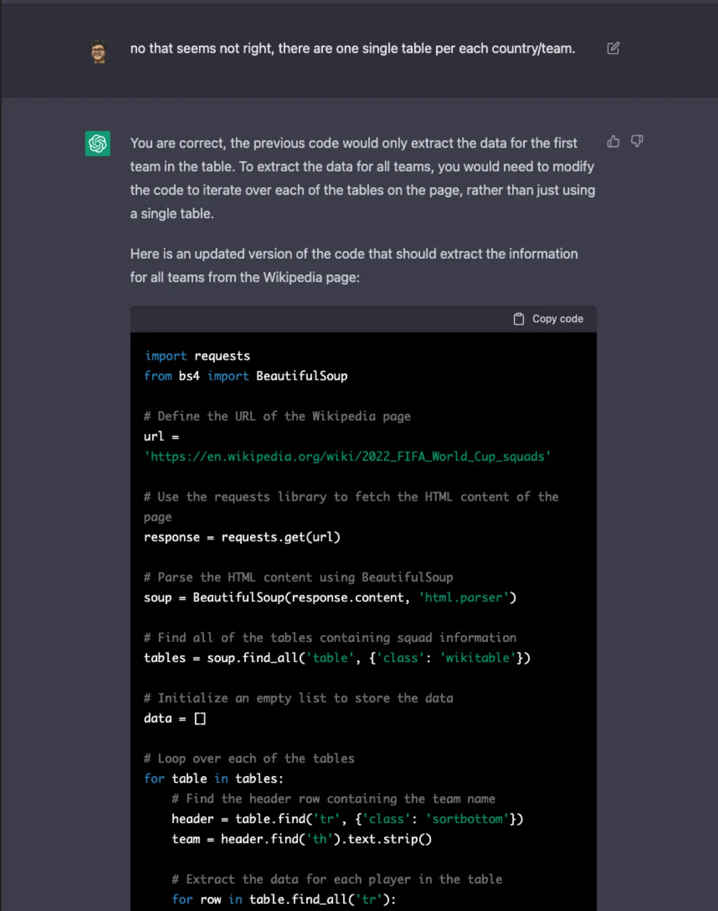

这一全过程我就不在这里列出来了，不过我把生成的代码和整个讨论的过程都分享在[这里](https://gist.github.com/wey-gu/78cb28bee130966e7d6e9d573b51deff)，感兴趣的同学可以去看看。

最终生成的数据是一个 CSV 文件：

- 代码生成的文件 [world_cup_squads.csv](https://github.com/siwei-io/talks/files/10152775/world_cup_squads.csv)

- 手动修改、分开了生日和年龄的列 [world_cup_squads_v0.csv](https://github.com/siwei-io/talks/files/10152923/world_cup_squads.csv)

  它像这样，包含的信息有：球队、小组、编号、位置、球员名字、生日、年龄、参加国际比赛场次、进球数、服役俱乐部。

```CSV
Team,Group,No.,Pos.,Player,DOB,Age,Caps,Goals,Club
Ecuador,A,1,1GK,Hernán Galíndez,(1987-03-30)30 March 1987,35,12,0,Aucas
Ecuador,A,2,2DF,Félix Torres,(1997-01-11)11 January 1997,25,17,2,Santos Laguna
Ecuador,A,3,2DF,Piero Hincapié,(2002-01-09)9 January 2002,20,21,1,Bayer Leverkusen
Ecuador,A,4,2DF,Robert Arboleda,(1991-10-22)22 October 1991,31,33,2,São Paulo
Ecuador,A,5,3MF,José Cifuentes,(1999-03-12)12 March 1999,23,11,0,Los Angeles FC
```

- 手动删除了 CSV 表头 [world_cup_squads_no_headers.csv](https://github.com/siwei-io/talks/files/10152974/world_cup_squads_no_headers.csv)

## 图方法预测2022世界杯

### 图建模

> 前提，本文使用 NebulaGraph 和 NebulaGraph Explorer，你可以在阿里云上免费申请半个月的试用，入口链接是👉🏻 http://c.nxw.so/d52oz ，不要被这个陌生的短链接域名吓到，它只是帮助我们统计有多少同学通过这里访问到 https://market.aliyun.com 而已。

图建模（Graph Modeling）是把真实世界信息以”点-->边“的图形式去抽象与表示。

这里，我们根据公共领域能够容易获得信息、把它映射成如下的点与边：

点：

- player（球员）
- team（球队）
- group（小组）
- club（俱乐部）

边：

- groupedin（球队属于哪一小组）
- belongto（队员属于国家队）
- serve（队员在俱乐部服役）

而队员的年龄、参加国际场次（caps）、进球数（goals）则很自然作为 player 这一类点的属性。

下图是这个 schema 在 NebulaGraph Studio/Explorer（后边称 Studio/Explorer） 中的截图：

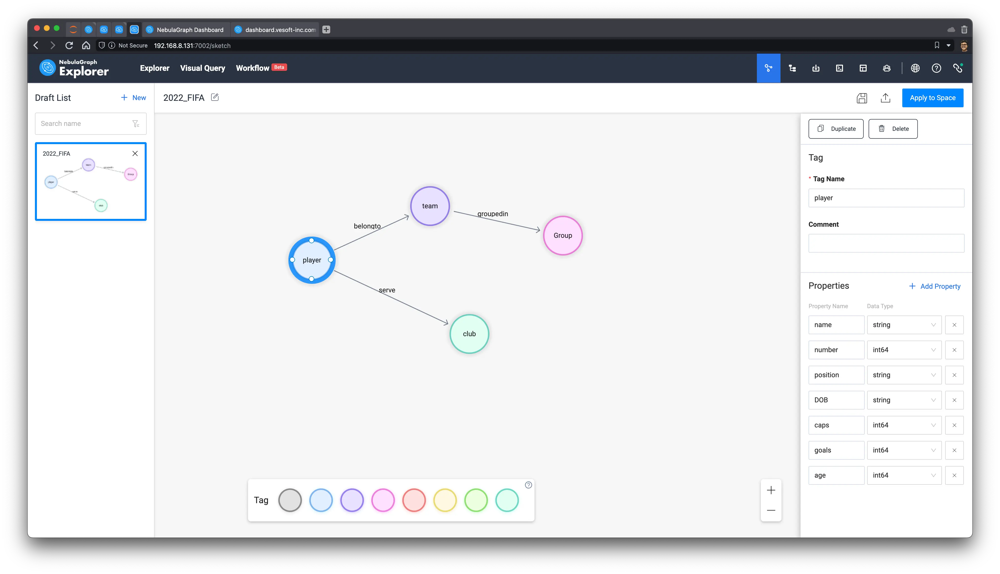

然后，我们可以在右上角把它保存，创建一个新的图空间，应用这个图建模到图空间里。

> 注：参考文档 https://docs.nebula-graph.com.cn/3.3.0/nebula-explorer/db-management/draft/

### 导入数据进 NebulaGraph

有了图建模，我们可以把之前的 CSV 文件（无表头版本）上传到 Studio 或者 Explorer 里，通过点、选关联不同的列到点边中的 vid 和属性：

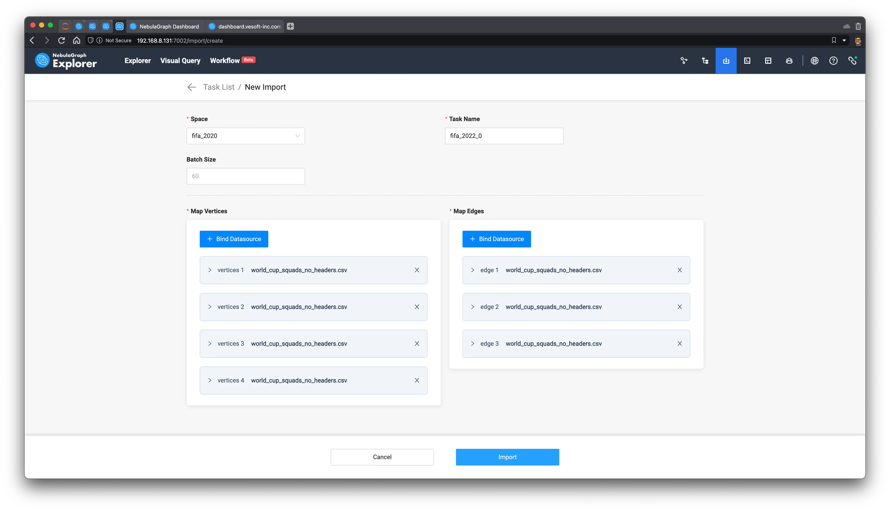

之后点击导入，就把整个图导入到 NebulaGraph 了，成功之后，我们还得到了整个csv --> Nebula Importer 的关联配置文件：[nebula_importer_config_fifa.yml](https://github.com/siwei-io/talks/files/10164014/config_fifa.yml.txt)，你可以直接拖拽整个配置，不用自己去配置它了。

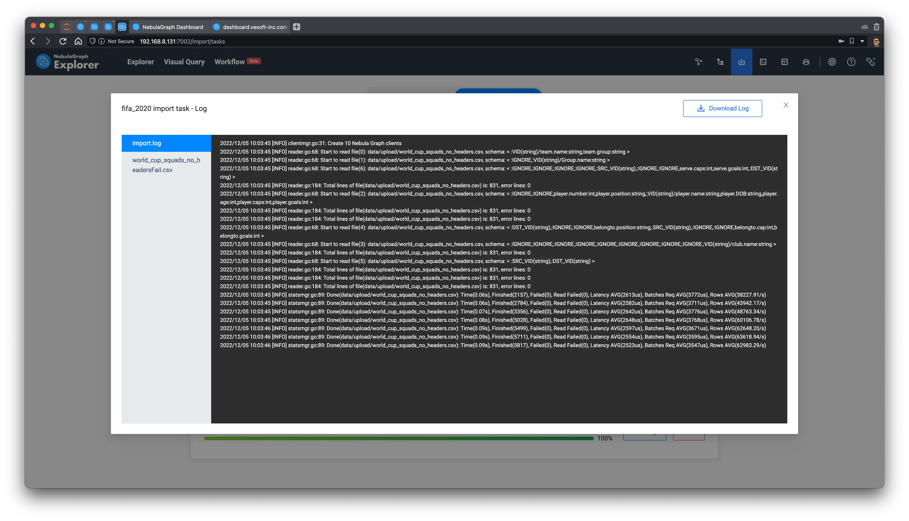

> 注：参考文档 https://docs.nebula-graph.com.cn/3.3.0/nebula-explorer/db-management/11.import-data/

导入之后，我们可以在 schema 界面里查看数据统计，我们可以看到有 831 名球员参加了 2022 卡塔尔世界杯，他们服役在 295 个不同的俱乐部：

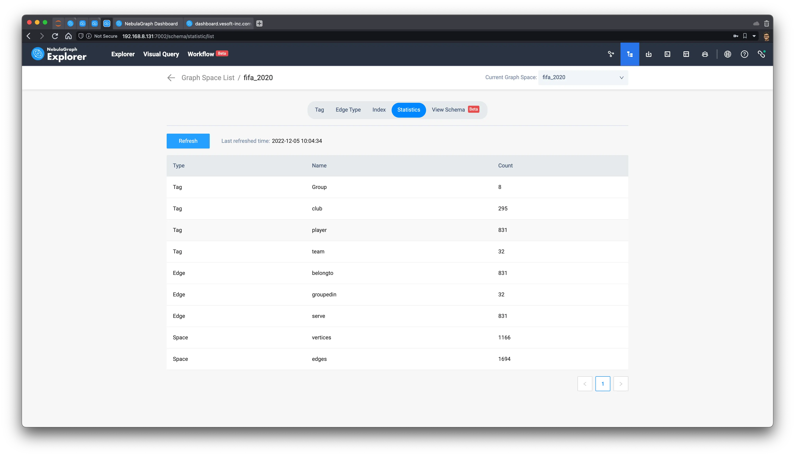

> 注：参考文档 https://docs.nebula-graph.com.cn/3.3.0/nebula-explorer/db-management/10.create-schema/#_6

### 探索数据

#### 查询数据

下面，我们试着把所有的数据展示出来看看吧，首先，借助 NebulaGraph Explorer，我用拖拽的方式画出来任意类型的点（TAG）和任意类型点（TAG）之间的边，这里我们知道所有的点都是至少包含在一个边里的，所以不会漏掉任何孤立的点。

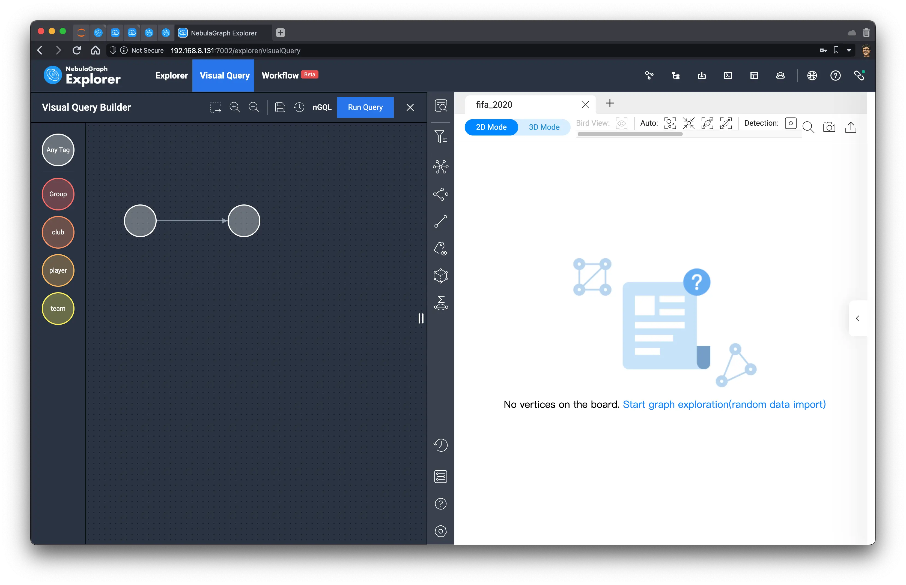

让它帮我生成查询的语句，这里，它默认 LIMIT 100 了，我们手动改大一些（ LIMIT 10000），让它在 Console 里执行。

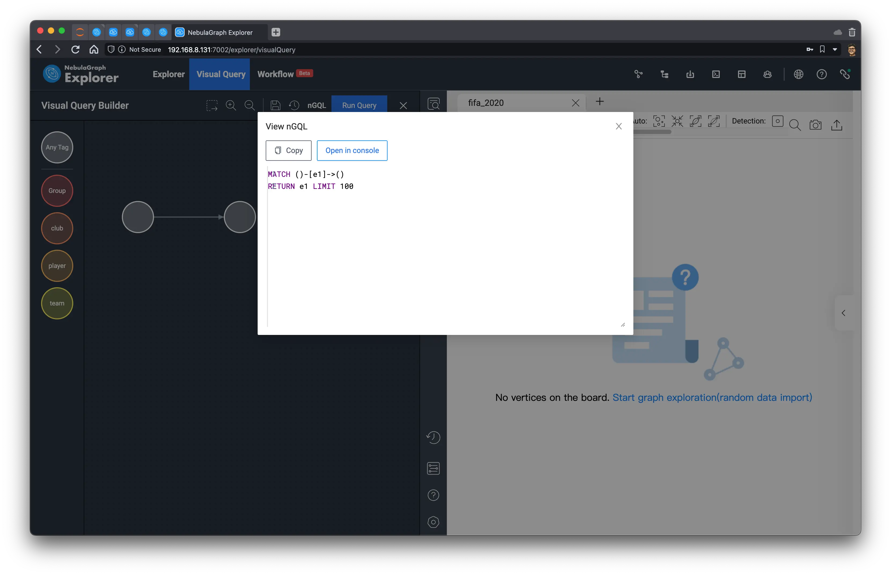

#### 初步观察数据

结果渲染出来是这样子，可以看到它天然形成了一簇一簇的模式。

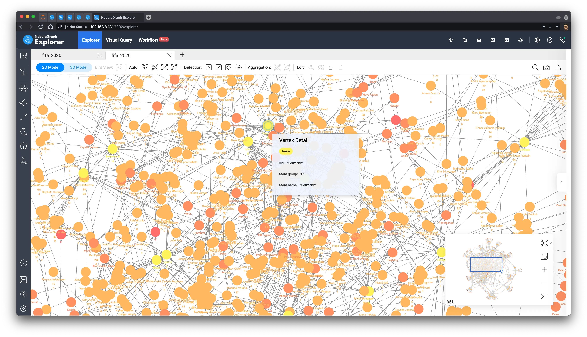

这些外围、形成的簇多是一些由非传统意义上的有全球影响力的俱乐部，和非传统的足球厉害的国家队的球员组成，因为通常这些俱乐部只有一两个球员，而且他们还集中在一个国家队、地区，所以没有和很多其他球员、国家队产生连接。

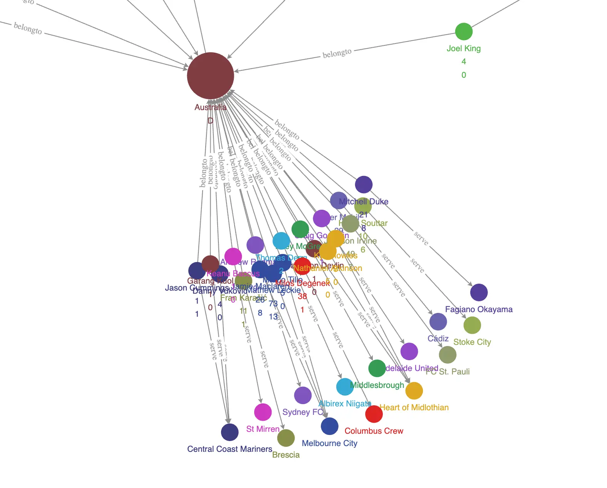

#### 图算法辅助分析

在我点击了 Explorer 中的两个按钮之后（详细参考后边的文档链接），在浏览器里，我们可以看到整个图已经变成：

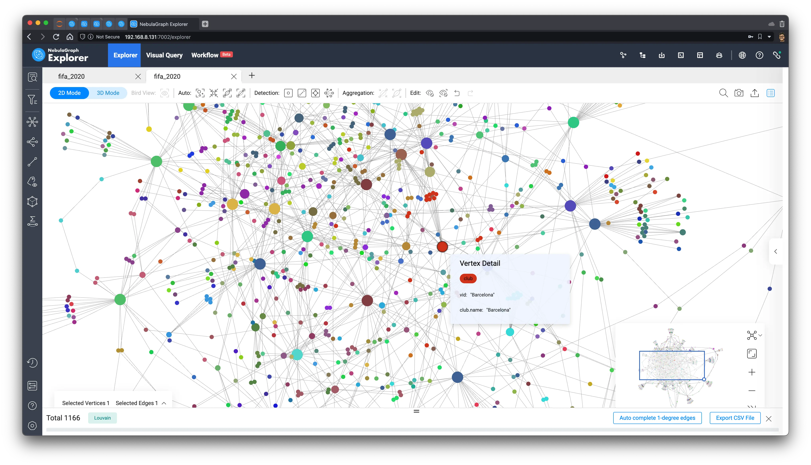

> 注：这部分功能可以参考文档 https://docs.nebula-graph.com.cn/3.3.0/nebula-explorer/graph-explorer/graph-algorithm/

这里，利用到了两个图算法来分析这里的洞察：

1. 利用点的出入度，改变他们的显示大小突出重要程度
2. 利用 Louvain 算法区分点的社区分割

可以看到红色的大点是鼎鼎大名的巴塞罗那，而它的球员们也被红色标记了。

### 预测冠军算法

为了能充分利用图的魔法（与图上的隐含条件、信息），我的思路是选择一种利用链接进行节点重要程度分析的图算法，找出拥有更高重要性的点，对他们全局迭代、排序，从而获得前几名的国家队排名。

这些方法其实就体现在厉害的球员同时拥有更大的社区、连接度，同时，为了增加传统强队之间的区分度，我准备把出场率、进球数的信息也考虑进来。

最终，我的算法是：

- 取出所有的 (球员)-服役->(俱乐部) 的关系，过滤其中进球数过少、单场进球过少的球员（以平衡一些弱队的老球员带来的过大影响）
- 从所有过滤之后的球员中向外探索，获得国家队
- 在以上的子图上运行 Betweenness Centrality 算法，计算节点重要度评分

#### 算法过程

首先，我们取出所有进球数超过 10，场均进球超过 0.2 的 (球员)-服役->(俱乐部) 的子图：

```cypher
MATCH ()-[e]->()
WITH e LIMIT 10000
WITH e AS e WHERE e.goals > 10 AND toFloat(e.goals)/e.caps > 0.2
RETURN e
```

> 注：为了方便，我把进球数和出场数也作为了 serve 边上的属性了。

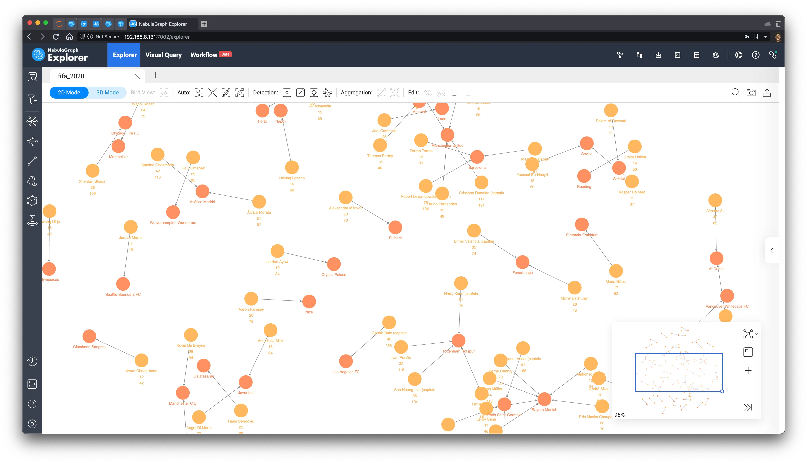

然后，我们全选图上的所有点，点击左边的工具栏，选择出方向的 `belongto` 边，向外进行图拓展（遍历），同时选择将拓展得到的新点标记为旗帜的 icon：

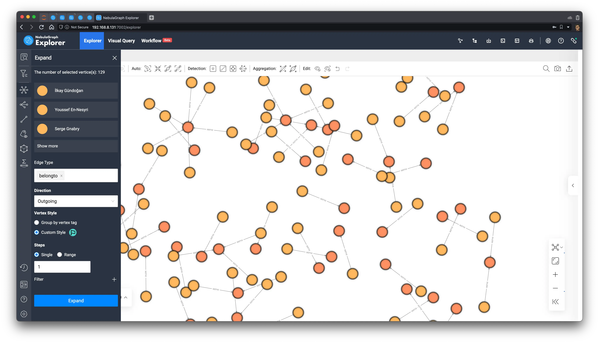

现在，我们获得了最终的子图，我们利用工具栏里的浏览器内的图算法功能，执行 BNC（Betweenness Centrality）

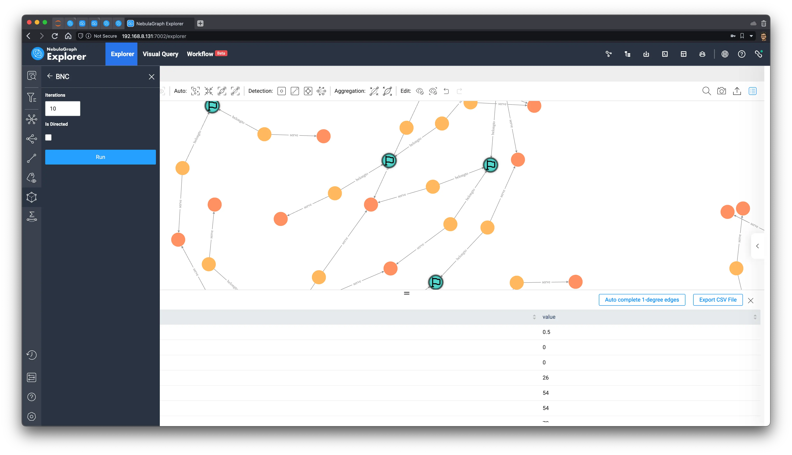

然后，这个子图变成了这样子：

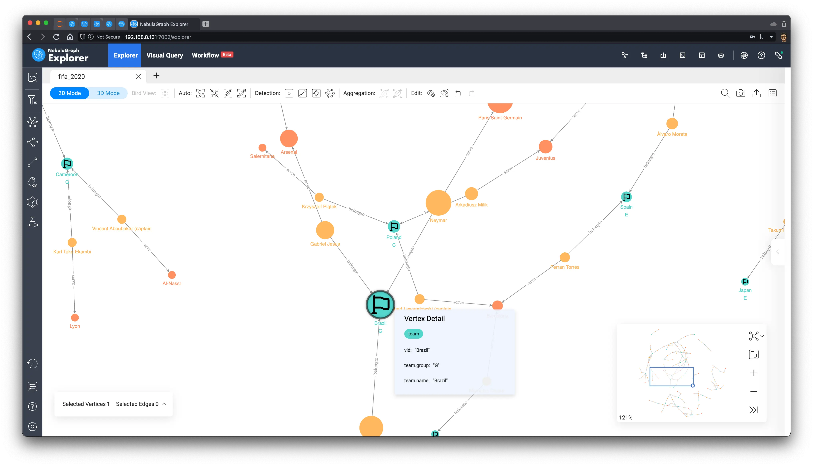

## 预测结果

最终，我们根据 Betweenness Centrality 的值，排序，可以得到最终的获胜球队应该是：巴西 🇧🇷！

其次是比利时、德国、英格兰、法国、阿根廷，让我们等两个礼拜回来看看预测结果是否准确吧 :D。

注：排序数据（其中还有非参赛球队的点）

| Vertex                    | **Betweenness Centrality** |
| ------------------------- | -------------------------- |
| **Brazil**🇧🇷              | 3499                       |
| **Paris Saint-Germain**   | 3073.3333333333300         |
| **Neymar**                | 3000                       |
| **Tottenham Hotspur**     | 2740                       |
| **Belgium**🇧🇪             | 2587.833333333330          |
| **Richarlison**           | 2541                       |
| **Kevin De Bruyne**       | 2184                       |
| **Manchester City**       | 2125                       |
| **İlkay Gündoğan**        | 2064                       |
| **Germany**🇩🇪             | 2046                       |
| **Harry Kane (captain**   | 1869                       |
| **England**🏴󠁧󠁢󠁥󠁮󠁧󠁿              | 1864                       |
| **France**🇫🇷              | 1858.6666666666700         |
| **Argentina**🇦🇷           | 1834.6666666666700         |
| **Bayern Munich**         | 1567                       |
| **Kylian Mbappé**         | 1535.3333333333300         |
| **Lionel Messi (captain** | 1535.3333333333300         |
| **Gabriel Jesus**         | 1344                       |


> 题图：这个文章的图也是用 OpenAI DALL-E 2 生成，并用 DALL-E 2 Outpainting 扩充的，[原图](https://user-images.githubusercontent.com/1651790/205881462-ff007725-e270-4b1e-9062-7702f01021c1.png)。

