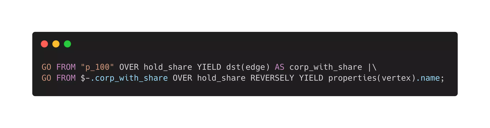
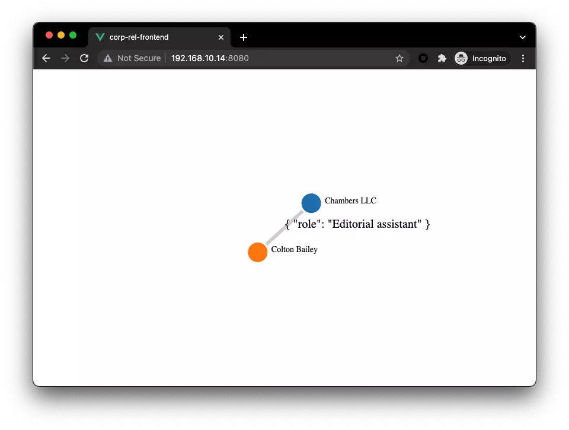

# 从零到一：如何构建一个企业股权图谱系统？


> 如何构建一个具有股权分析的图谱与线上系统呢？本文里，我将利用图数据库从零到一带你构建一个简易版的股权穿透图谱系统。

<!--more-->

我们知道无论是监管部门、企业还是个人，我们有需求针对一个企业、法人做一些背景调查，这些调查可以是法律诉讼、公开持股、企业任职等等多种多样的信息。这些背景信息可以辅助我们做商业上的重要决策，规避风险：比如根据公司的股权关系，了解是否存在利益冲突比如是否选择与一家公司进行商业往来。

为了满足这样的关系分析需求的时候，我们往往面临一些挑战，比如：

- 如何将这些数据的关联关系体现在系统之中？使得它们可以被挖掘、利用
- 多种异构数据、数据源之间的关系可能随着业务的发展引申出更多的变化，在表结构数据库中，这意味着 Schema 变更
- 分析系统需要尽可能实时获取需要的查询结果，这通常涉及到多跳关系查询
- 领域专家能否快速灵活、可视化获取分享信息

那么如何构建这样一个系统解决以上挑战呢？

## 数据存在哪里？

> 前提：数据集准备，为了更好的给大家演示解决这个问题，我写了一个轮子能随机生成股权结构相关的数据，生成的数据的例子在[这里](https://github.com/wey-gu/nebula-shareholding-example/tree/main/data_sample)。
>
> 这里，我们有[法人](https://github.com/wey-gu/nebula-shareholding-example/blob/main/data_sample/person.csv)、[公司](https://github.com/wey-gu/nebula-shareholding-example/blob/main/data_sample/corp.csv)的数据，更有[公司与子公司之间的关系](https://github.com/wey-gu/nebula-shareholding-example/blob/main/data_sample/corp_rel.csv)，[公司持有公司股份](https://github.com/wey-gu/nebula-shareholding-example/blob/main/data_sample/corp_share.csv)，[法人任职公司](https://github.com/wey-gu/nebula-shareholding-example/blob/main/data_sample/person_corp_role.csv)，[法人持有公司股份](https://github.com/wey-gu/nebula-shareholding-example/blob/main/data_sample/person_corp_share.csv)和[法人之间亲密度](https://github.com/wey-gu/nebula-shareholding-example/blob/main/data_sample/person_rel.csv)的关系数据。

数据存在哪里？这是一个关键的问题，这里我们剧透一下，答案是：图数据库。然后我们再简单解释一下为什么这样一个股权图谱系统跑在图数据库上是更好的。

在这样一个简单的数据模型之下，我们可以很直接的在关系型数据库中这么建模：


而这么建模的问题在于：这种逻辑关联的方式使得无论数据的关联关系查询表达、存储、还是引入新的关联关系都不是很高效。

- *查询表达不高效*是因为关系型数据库是面向表结构设计的，这决定了关系查询要写嵌套的 JOIN。
- *存储不高效*是因为表结构被设计的模式是面向数据记录，而非数据之间的关系关系：我们虽然习惯了将数据中实体（比如法人）和实体关联（比如持有股权 `hold_sharing_relationship`）以另外一个表中的记录来表达、存储起来，这逻辑上完全行得通，但是到了多跳、大量需要请求数据关系跳转的情况下，这样跨表 JOIN 的代价就成为了瓶颈。

当一个通用系统无法满足不可忽视的具体需求的时候，一个新的系统就会诞生，这就是图数据库，针对这样的场景，图数据库很自然地特别针对关联关系场景去设计整个数据库：

- 面向关联关系表达的语义。
  - 我列举了一个等价的一跳查询在表结构数据库与图数据库中，查询语句的区别。大家应该可以看出“找到所有服役过和球员 Tim 曾服役的球队的球员”这样的查询表达可以在图数据库如何自然表达，这仅仅是一条查询的区别，如果是多跳的话，他们的复杂度区分还会更明显一些。
- 将关联关系存储为物理连接，从而使得跳转查询代价最小。
  - 图数据之中，从点拓展（找到一个或者多个关系的另一头）出去的代价是非常小的，这因为图数据库是一个专有的系统，得益于它主要关心“图”结构的设计，查找确定的实体（比如和一个法人 A ）所有关联（可能是任职、亲戚、持有、等等关系）其他所有实体（公司、法人）这个查找的代价是 O(1) 的，因为它们在图数据库的数据机构里是真的链接在一起的。
  - 大家可以从下表第三列的一个参考数据一窥图数据库在这种查询下的优势，这种优势在多跳高并发情况下的区别是“能”与”不能“作为线上系统的区别，是“实时”与“离线”的区别。

- 建模符合直觉。
  - 大家在下表第二列中可以对比我们本文中进行的股权分析数据在两种数据库之中的建模的区别，尤其是在关心关联关系的场景下，我们可以感受到属性图的模型建立是很符合人类大脑直觉的，而这和大脑之中[神经元](https://zh.wikipedia.org/zh/%E7%A5%9E%E7%B6%93%E5%85%83)的结构可能也有一些关系。

> 表格——表结构数据库与图数据库的比较：

| 表结构数据库                             | 图数据库（属性图）                             |
| ---------------------------------------- | ---------------------------------------------- |
|  |                |
|    |  |
| 4 跳查询时延 1544 秒                     | 4 跳查询时延 1.36 秒                           |

所以，在本教程里，我们将利用图数据库来进行数据存储。

## 数据建模

前便在讨论数据存在哪里的时候，我们已经揭示了在图数据库中建模的方式：本质上，我们在这张图中，将会有两种实体：

- 人
- 公司

四种关系：

- `人` –`作为亲人`–>`人`
- `人` –`作为角色`–> `公司`
- `人` 或者 `公司` –`持有股份`–> `公司`
- `公司` –`作为子机构`–> `公司`

这里边，实体与关系本身都可以包涵更多的信息，这些信息在图数据库里就是实体、关系自身的属性。如下图表示：

- `人`的属性包括 `name`，`age`
- `公司`的属性包括 `name`，`location`
- `持有股份` 这个关系有属性 `share`(份额)
- `任职`这个关系有属性 `role`，`level`


## 数据入库

本教程中，我们使用的图数据库叫做 Nebula Graph（星云图数据库），它是一个以 Apache 2.0 许可证开源的分布式图数据库。

> Nebula Graph in Github: https://github.com/vesoft-inc/nebula

在 Nebula Graph 之中导入数据，有很多不同定位的工具可供选项，大家可以在[这篇文档](https://docs.nebula-graph.com.cn/2.6.1/20.appendix/write-tools/)和[这个视频](https://www.siwei.io/sketches/nebula-data-import-options/)了解更多数据导入工具选型的信息。

在我们的教程之中，我们使用 nebula-importer 来完成这个工作（这其实不是唯一的选择）。

> 本章节假设了您已经部署了一个 Nebula Graph 集群，您可以参考[这个文档](https://docs.nebula-graph.com.cn/2.6.1/4.deployment-and-installation/2.compile-and-install-nebula-graph/3.deploy-nebula-graph-with-docker-compose/)利用 Docker 很方便地部署，也可以利用 [Nebula-UP](https://siwei.io/nebula-up/)，在一个 Linux 机器上同时启动一个 Nebula Graph 核心和它的可视化图探索工具 [Nebula Graph Studio](https://docs.nebula-graph.com.cn/2.6.1/nebula-studio/about-studio/st-ug-what-is-graph-studio/)。
>
> 本文假设我们使用 Nebula-UP 来部署集群，它非常简单，只需要一行：
>
> ```bash
> curl -fsSL nebula-up.siwei.io/install.sh | bash
> ```
>
> 详细信息可以参考 [Nebula-UP](https://siwei.io/nebula-up/)。

前边我们也提到了，我们引用的数据集是作者生成的，生成器（可以按需生成任意规模随机数据集）代码和一份示例的数据在 GitHub 上：

> 数据集生成器：https://github.com/wey-gu/nebula-shareholding-example
>
> 示例数据：https://github.com/wey-gu/nebula-shareholding-example/tree/main/data_sample

另外，我还准备好了一份 nebula-importer 的配置文件，在同一个 repo 之下的[这里](https://github.com/wey-gu/nebula-shareholding-example/blob/main/nebula-importer.yaml)。

这里，只需要执行如下命令行就可以开始数据导入了：

> 注意，在写本文的时候，nebula 的新版本是 2.6.1，这里对应的 nebula-importer 是 v2.6.0，如果您出现导入错误可能是版本不匹配，可以相应调整下边命令中的版本号。

```bash
git clone https://github.com/wey-gu/nebula-shareholding-example
cp -r data_sample /tmp/data
cp nebula-importer.yaml /tmp/data/
docker run --rm -ti \
    --network=nebula-docker-compose_nebula-net \
    -v /tmp/data:/root \
    vesoft/nebula-importer:v2.6.0 \
    --config /root/nebula-importer.yaml
```

> 你知道吗？TL;DR
>
> 实际上，这份 importer 的[配置](https://github.com/wey-gu/nebula-shareholding-example/blob/main/nebula-importer.yaml)里帮我们做了 Nebula Graph 之中的图建模的操作，它们的指令在下边，我们不需要手动去执行了。

```sql
CREATE SPACE IF NOT EXISTS shareholding(partition_num=5, replica_factor=1, vid_type=FIXED_STRING(10));
USE shareholding;
CREATE TAG person(name string);
CREATE TAG corp(name string);
CREATE TAG INDEX person_name on person(name(20));
CREATE TAG INDEX corp_name on corp(name(20));
CREATE EDGE role_as(role string);
CREATE EDGE is_branch_of();
CREATE EDGE hold_share(share float);
CREATE EDGE reletive_with(degree int);
```


## 图库中查询数据

> Tips: 你知道吗，你也可以无需部署安装，通过 [Nebula-Playground](https://nebula-graph.com.cn/demo/) 之中，找到股权穿透来在线访问同一份数据集。

我们可以借助  [Nebula Graph Studio](https://docs.nebula-graph.com.cn/2.6.1/nebula-studio/about-studio/st-ug-what-is-graph-studio/) 来访问数据，访问我们部署 Nebula-UP 的服务器地址的 7001 端口就可以了：

假设服务器地址为 `192.168.8.127`，则有：

- Nebula Studio 地址：`192.168.8.127:7001`
- Nebula Graph 地址：`192.168.8.127:9669`
- 默认用户名：`root`
- 默认密码：`nebula`

访问 Nebula Studio：


选择图空间: Shareholding


之后，我们就可以在里边探索比如一个公司的三跳以内的股权穿透，具体的操作可以参考：[股权穿透在线 Playground 的介绍](https://nebula-graph.com.cn/demo/shared-holding/)：


## 构建一个图谱系统

> 这部分的代码开源在 GitHub 上：
>
> https://github.com/wey-gu/nebula-corp-rel-search
>
> 本项目的 Demo 也在 PyCon China 2021 上的演讲中有过展示：[视频地址](https://www.bilibili.com/video/BV12u411o7Y6)

在此基础之上，我们可以构建一个提供给终端用户来使用的股权查询系统了，我们已经有了图数据库作为这个图谱的存储引擎，理论上，如果业务允许，我们可以直接使用或者封装 Nebula Graph Studio 来提供服务，这完全是可行也是合规的，不过，有一些情况下，我们需要自己去实现界面、或者我们需要封装出一个 API 给上游（多端）提供图谱查询的功能。

为此，我为大家写了一个简单的实例项目，提供这样的服务，他的架构也很直接：

- 前端接受用户要查询的穿透法人、公司，按需发请求给后端，并用 D3.js 将返回结果渲染为关系图
- 后端接受前端的 API 请求，将请求转换为 Graph DB 的查询，并返回前端期待的结果

```asciiarmor
  ┌───────────────┬───────────────┐
  │               │  Frontend     │
  │               │               │
  │    ┌──────────▼──────────┐    │
  │    │ Vue.JS              │    │
  │    │ D3.JS               │    │
  │    └──────────┬──────────┘    │
  │               │  Backend      │
  │    ┌──────────┴──────────┐    │
  │    │ Flask               │    │
  │    │ Nebula-Python       │    │
  │    └──────────┬──────────┘    │
  │               │  Graph Query  │
  │    ┌──────────▼──────────┐    │
  │    │ Graph Database      │    │
  │    └─────────────────────┘    │
  │                               │
  └───────────────────────────────┘
```


### 后端服务-->图数据库

> 详细的数据格式分析大家可以参考[这里](https://github.com/wey-gu/nebula-corp-rel-search#data-from-backend-side)

#### 查询语句

我们假设用户请求的实体是 `c_132` ，那么请求 1 到 3 步的关系穿透的语法是：

```cypher
MATCH p=(v)-[e:hold_share|:is_branch_of|:reletive_with|:role_as*1..3]-(v2) \
WHERE id(v) IN ["c_132"] RETURN p LIMIT 100
```

这里边 `()`包裹的是图之中的点，而`[]` 包裹的则是点之间的关系：边，所以：

 `(v)-[e:hold_share|:is_branch_of|:reletive_with|:role_as*1..3]-(v2)` 之中的：

`(v)-[xxxxxxxxxxxxxxxxxxxxxxxxxxxxxxxxxxxxxxxxxxxxxxxxxxxxxxx]-(v2)`应该比较好理解，意思是从 `v` 到`v2` 做拓展。

现在我们介绍中间`[]`包裹的部分，这里，它的语义是：经由四种类型的边（`:`之后的是边的类型，`|`代表或者）通过可变的跳数：`*1..3` （一跳到三跳）。

所以，简单来说整理看开，我们的拓展的路径是：从点 `v` 开始，经由四种关系一到三跳拓展到点`v2`，返回整个拓展路径 `p`，限制 100 个路径结果，其中 `v` 是 `c_132`。

#### Nebula Python Client/ SDK

我们已经知道了查询语句的语法，那么就只需要在后端程序里根据请求、通过图数据库的客户端来发出查询请求，并处理返回结构就好了。在今天的例子中，我选择使用 Python 来实现后端的逻辑，所以我用了 Nebula-python 这个库，它是 Nebula 的 Python Client。

> 你知道么？截至到现在，Nebula 在 GitHub 上有 Java，GO，Python，C++，Spark，Flink，Rust（未GA），NodeJS（未GA） 的客户端支持，更多的语言的客户端也会慢慢被发布哦。

下边是一个 Python Client 执行一个查询并返回结果的例子，值得注意的是，在我实现这个代码的时候，Nebula Python 尚未支持返回 JSON （通过`session.execute_json()`）结果，如果你要实现自己的代码，我非常推荐试试 JSON 哈，就可以不用从对象中一点点取数据了，不过借助 iPython/IDLE 这种 `REPL`，快速了解返回对象的结构也没有那么麻烦。

```python
$ python3 -m pip install nebula2-python==2.5.0 # 注意这里我引用旧的记录，它是 2.5.0，
$ ipython
In [1]: from nebula2.gclient.net import ConnectionPool
In [2]: from nebula2.Config import Config
In [3]: config = Config()
   ...: config.max_connection_pool_size = 10
   ...: # init connection pool
   ...: connection_pool = ConnectionPool()
   ...: # if the given servers are ok, return true, else return false
   ...: ok = connection_pool.init([('192.168.8.137', 9669)], config)
   ...: session = connection_pool.get_session('root', 'nebula')
[2021-10-13 13:44:24,242]:Get connection to ('192.168.8.137', 9669)

In [4]: resp = session.execute("use shareholding")
In [5]: query = '''
   ...: MATCH p=(v)-[e:hold_share|:is_branch_of|:reletive_with|:role_as*1..3]-(v2) \
   ...: WHERE id(v) IN ["c_132"] RETURN p LIMIT 100
   ...: '''
In [6]: resp = session.execute(query) # Note: after nebula graph 2.6.0, we could use execute_json as well

In [7]: resp.col_size()
Out[7]: 1

In [9]: resp.row_size()
Out[10]: 100
```

我们往下分析看看，我们知道这个请求本质上结果是路径，它有一个 `.nodes()` 方法和 `.relationships()`方法来获得路径上的点和边：

```python
In [11]: p=resp.row_values(22)[0].as_path()

In [12]: p.nodes()
Out[12]:
[("c_132" :corp{name: "Chambers LLC"}),
 ("p_4000" :person{name: "Colton Bailey"})]

In [13]: p.relationships()
Out[13]: [("p_4000")-[:role_as@0{role: "Editorial assistant"}]->("c_132")]
```

对于边来说有这些方法 `.edge_name()`, `.properties()`, `.start_vertex_id()`, `.end_vertex_id()`，这里 edge_name 是获得边的类型。

```python
In [14]: rel=p.relationships()[0]

In [15]: rel
Out[15]: ("p_4000")-[:role_as@0{role: "Editorial assistant"}]->("c_132")

In [16]: rel.edge_name()
Out[16]: 'role_as'

In [17]: rel.properties()
Out[17]: {'role': "Editorial assistant"}

In [18]: rel.start_vertex_id()
Out[18]: "p_4000"

In [19]: rel.end_vertex_id()
Out[19]: "c_132"
```

对于点来说，可以用到这些方法 `.tags()`, `properties`, `get_id()`，这里边 tags 是获得点的类型，它在 Nebula 里叫标签`tag`。

这些概念可以在[文档里](https://docs.nebula-graph.com.cn/2.6.1/1.introduction/2.data-model/)获得更详细的解释。

```python
In [20]: node=p.nodes()[0]

In [21]: node.tags()
Out[21]: ['corp']

In [22]: node.properties('corp')
Out[22]: {'name': "Chambers LLC"}

In [23]: node.get_id()
Out[23]: "c_132"
```

### 前端渲染点边为图

> 详细的分析大家也可以参考[这里](https://github.com/wey-gu/nebula-corp-rel-search#data-visualization)

为了方便实现，我们采用了 Vue.js 和 [vue-network-d3](https://github.com/ChenCyl/vue-network-d3)（D3 的 Vue Binding）。

通过 vue-network-d3 的抽象，能看出来喂给他这样的数据，就可以把点边信息渲染成很好看的图

```
nodes: [
        {"id": "c_132", "name": "Chambers LLC", "tag": "corp"},
        {"id": "p_4000", "name": "Colton Bailey", "tag": "person"}],
relationships: [
        {"source": "p_4000", "target": "c_132", "properties": { "role": "Editorial assistant" }, "edge": "role_as"}]
```



### 前端<--后端

> 详细信息可以参考[这里](https://github.com/wey-gu/nebula-corp-rel-search#the-data-construction-in-back-end)

我们从 D3 的初步研究上可以知道，后端只需要返回如下的 JSON 格式数据就好了

Nodes:

```json
[{"id": "c_132", "name": "Chambers LLC", "tag": "corp"},
 {"id": "p_4000", "name": "Colton Bailey", "tag": "person"}]
```

Relationships:

```json
[{"source": "p_4000", "target": "c_132", "properties": { "role": "Editorial assistant" }, "edge": "role_as"},
 {"source": "p_1039", "target": "c_132", "properties": { "share": "3.0" }, "edge": "hold_share"}]
```

于是，，结合前边我们用 iPython 分析 Python 返回结果看，这个逻辑大概是：

```python
def make_graph_response(resp) -> dict:
    nodes, relationships = list(), list()
    for row_index in range(resp.row_size()):
        path = resp.row_values(row_index)[0].as_path()
        _nodes = [
            {
                "id": node.get_id(), "tag": node.tags()[0],
                "name": node.properties(node.tags()[0]).get("name", "")
                }
                for node in path.nodes()
        ]
        nodes.extend(_nodes)
        _relationships = [
            {
                "source": rel.start_vertex_id(),
                "target": rel.end_vertex_id(),
                "properties": rel.properties(),
                "edge": rel.edge_name()
                }
                for rel in path.relationships()
        ]
        relationships.extend(_relationships)
    return {"nodes": nodes, "relationships": relationships}
```

前端到后端的通信是 HTTP ，所以我们可以借助 Flask，把这个函数封装成一个 RESTful API：

前端程序通过 HTTP POST 到 `/api`

> 参考[这里](https://github.com/wey-gu/nebula-corp-rel-search#the-flask-app)

```python
from flask import Flask, jsonify, request


app = Flask(__name__)


@app.route("/")
def root():
    return "Hey There?"


@app.route("/api", methods=["POST"])
def api():
    request_data = request.get_json()
    entity = request_data.get("entity", "")
    if entity:
        resp = query_shareholding(entity)
        data = make_graph_response(resp)
    else:
        data = dict() # tbd
    return jsonify(data)


def parse_nebula_graphd_endpoint():
    ng_endpoints_str = os.environ.get(
        'NG_ENDPOINTS', '127.0.0.1:9669,').split(",")
    ng_endpoints = []
    for endpoint in ng_endpoints_str:
        if endpoint:
            parts = endpoint.split(":")  # we dont consider IPv6 now
            ng_endpoints.append((parts[0], int(parts[1])))
    return ng_endpoints

def query_shareholding(entity):
    query_string = (
        f"USE shareholding; "
        f"MATCH p=(v)-[e:hold_share|:is_branch_of|:reletive_with|:role_as*1..3]-(v2) "
        f"WHERE id(v) IN ['{ entity }'] RETURN p LIMIT 100"
    )
    session = connection_pool.get_session('root', 'nebula')
    resp = session.execute(query_string)
    return resp
```

这个请求的结果则是前边前端期待的 JSON，像这样：

```bash
curl --header "Content-Type: application/json" \
     --request POST \
     --data '{"entity": "c_132"}' \
     http://192.168.10.14:5000/api | jq

{
  "nodes": [
    {
      "id": "c_132",
      "name": "\"Chambers LLC\"",
      "tag": "corp"
    },
    {
      "id": "c_245",
      "name": "\"Thompson-King\"",
      "tag": "corp"
    },
    {
      "id": "c_132",
      "name": "\"Chambers LLC\"",
      "tag": "corp"
    },
...
    }
  ],
  "relationships": [
    {
      "edge": "hold_share",
      "properties": "{'share': 0.0}",
      "source": "c_245",
      "target": "c_132"
    {
      "edge": "hold_share",
      "properties": "{'share': 9.0}",
      "source": "p_1767",
      "target": "c_132"
    },
    {
      "edge": "hold_share",
      "properties": "{'share': 11.0}",
      "source": "p_1997",
      "target": "c_132"
    },
...
    },
    {
      "edge": "reletive_with",
      "properties": "{'degree': 51}",
      "source": "p_7283",
      "target": "p_4723"
    }
  ]
}
```

### 放到一起

项目的代码都在 GitHub 上，最后其实只有一两百行的代码，把所有东西拼起来之后的代码是：

```shell
├── README.md         # You could find Design Logs here
├── corp-rel-backend
│   └── app.py        # Flask App to handle Requst and calls GDB
├── corp-rel-frontend
│   └── src
│       ├── App.vue
│       └── main.js   # Vue App to call Flask App and Renders Graph
└── requirements.txt
```

### 最终效果

我们做出来了一个简陋但是足够具有参考性的小系统，它接受一个用户输入的实体的 ID，再回车之后：

- 前端程序把请求发给后端
- 后端拼接 Nebula Graph 的查询语句，通过 Nebula Python 客户端请求 Nebula Graph
- Nebula Graph 接受请求做出穿透查询，返回结构给后端
- 后端将结果构建成前端 D3 接受的格式，传给前端
- 前端接收到图结构的数据，渲染股权穿透的数据如下：


<video width="800" controls>
  <source src="demo.mov" type="video/mp4"> 
</video>

## 总结

现在，我们知道得益于图数据库的设计，在它上边构建一个方便的股权分析系统非常自然、高效，我们或者利用图数据库的图探索可视化能力、或者自己搭建，可以为用户提供非常高效、直观的多跳股权穿透分析。

如果你想了解更多关于分布式图数据库的知识，欢迎关注 Nebula Graph 这个开源项目，它已经被国内很多团队、公司认可选为图时代数据技术存储层的利器，大家可以访问[这里](https://nebula-graph.com.cn/cases)，或者[这里](https://nebula-graph.com.cn/posts/)，了解更多相关的分享和文章。

未来，我会给大家分享更多图数据库相关的文章、视频和开源示例项目思路分享和教程，欢迎大家关注我的网站: siwei.io。


> 题图版权：[fabioha](https://unsplash.com/photos/oyXis2kALVg) 


