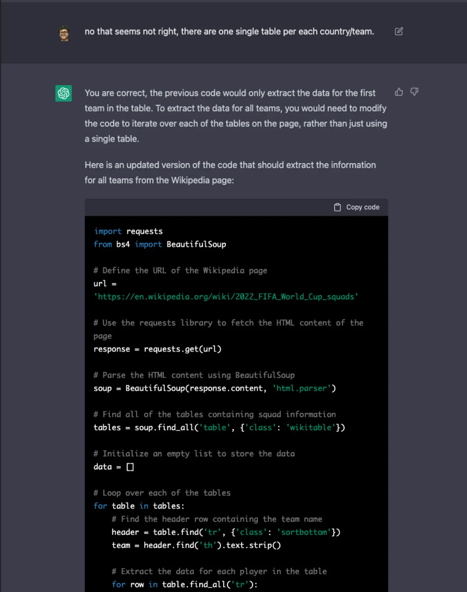
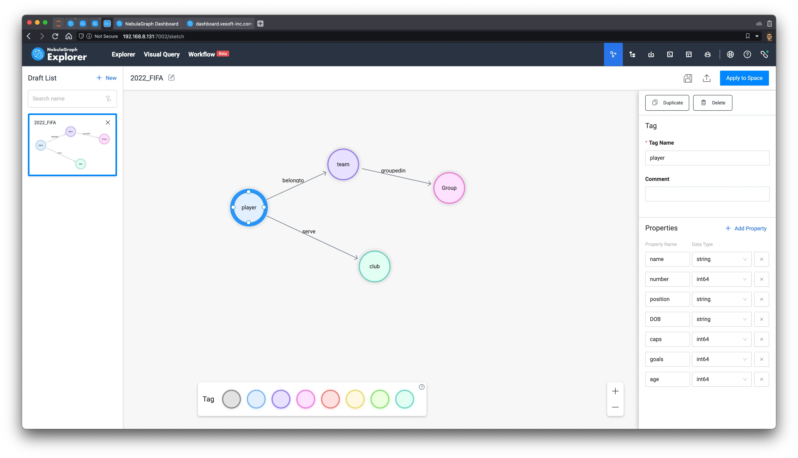
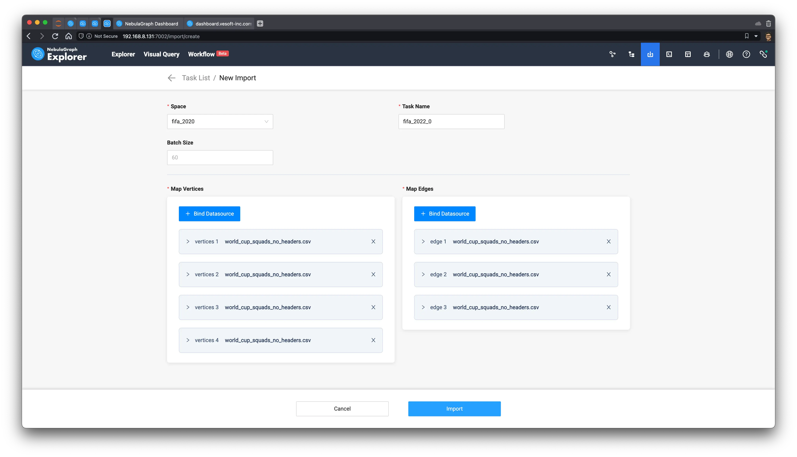
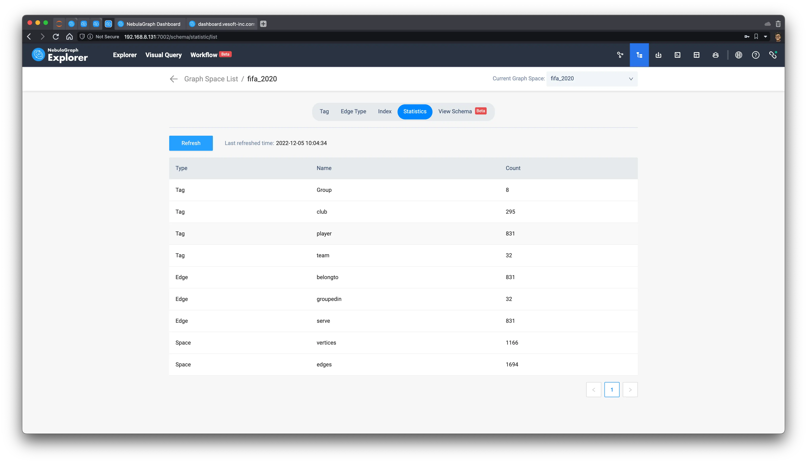
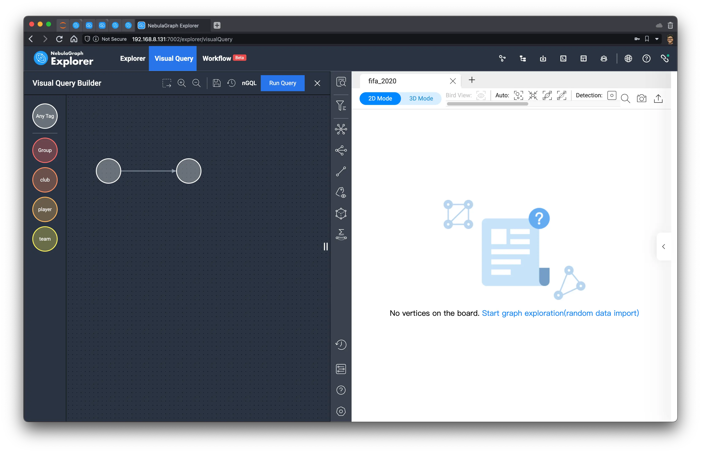
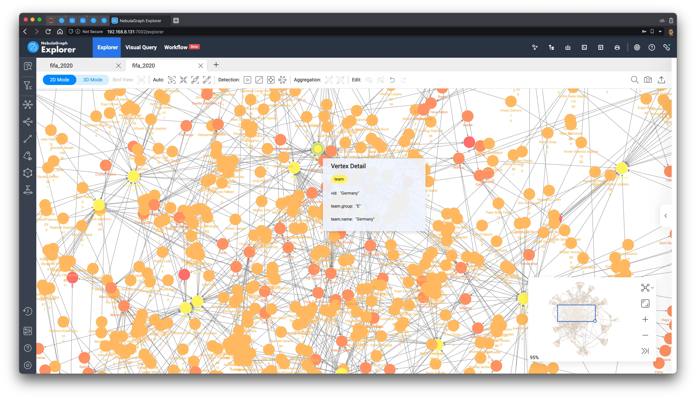
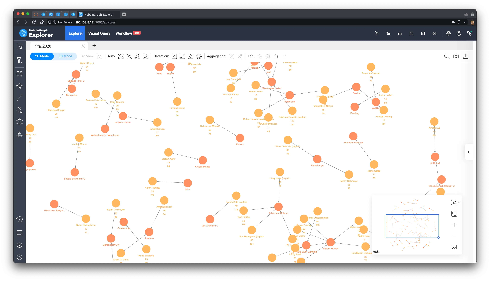
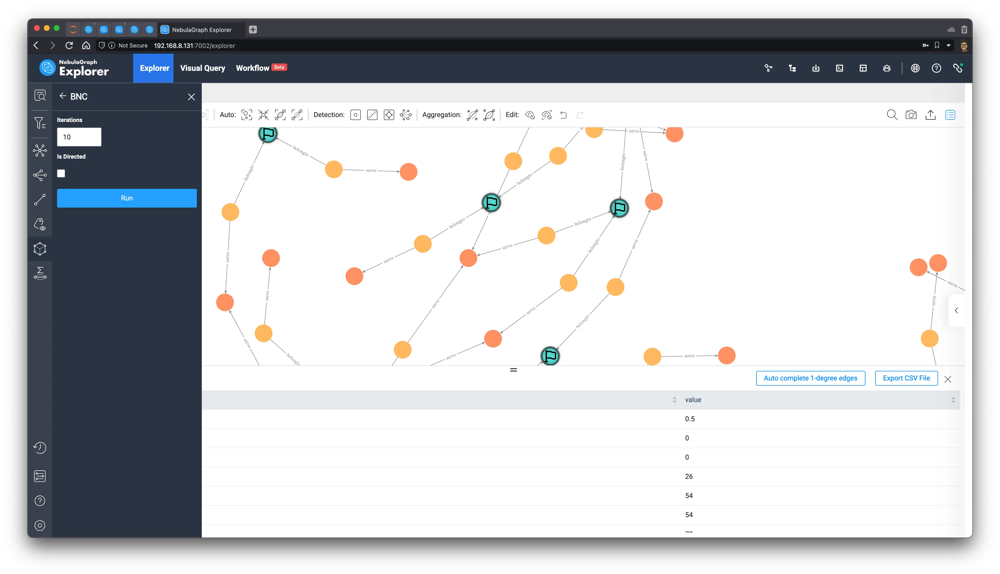
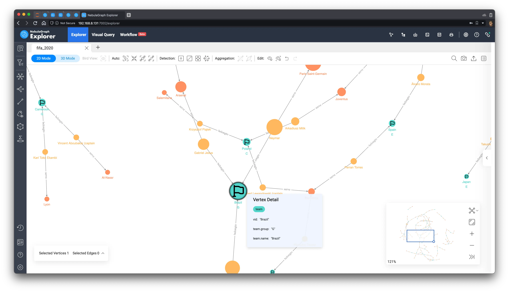

# Use ChatGPT and Nebulagraph to Predict Fifa World Cup


> An attempt to use ChatGPT to generate code for a data scraper to predict sports events with the help of the NebulaGraph graph database and graph algorithms.

> This post was initially published in https://www.nebula-graph.io/posts/predict-fifa-world-cup-with-chatgpt-and-nebulagraph

<!--more-->

<!--

> ChatGPT and Nebulagraph Predict Fifa World Cup

[TOC]

-->

## The Hype

In the hype for FIFA 2022 World Cup, when I saw [a blog post from Cambridge Intelligence](https://cambridge-intelligence.com/fifa-world-cup-2022-prediction/), where they leveraged limited information and correlations among players, teams, and clubs to predict the final winner team, I always would like to try similar things with NebulaGraph to share the ideas of graph algorithm to extract hidden information from the overall connections in a graph in the community.

The initial attempt was to make it done in like 2 hours, but I noticed the dataset need to be parsed carefully from [Wikipedia](https://en.wikipedia.org/wiki/2022_FIFA_World_Cup_squads) and I happened to be not good at doing this job, so I put the idea on hold for a couple of days.

In the meantime, another hype, the OpenAI ChatGPT was announced, as I had been a user of DALL-E 2 already(to generate feature images of my blog posts), I gave it a try very quickly, too. And I witnessed how other guys(via Twitter, blogs, hacker news) tried to convince ChatGPT to do so many things that are hard to believe they could do:

- Help to implement a piece of code at any time
- Simulate any prompt interface: shell, python, virtual machine, or even a language you create
- Act out almost any given persona, and chat with you
- Write poetry, rap, prose
- Find a bug in a piece of code
- Explain the meaning of a complex regular expression/Open Cypher Query

ChatGPT's ability to contextualize and understand has never been greater before, so much so that everyone is talking about a new way of working: how to master asking/convincing/triggering machines to help us do our jobs, better and faster.

> I commented on this tweet, where they taught ChatGPT how to draw and render basic SVGs, then they started to ask him/her to draw any other complex things just after him/her learned in one second, that it's just like Kame-sennin(human) teaches Sun Wukong kung fu as a young **Saiyan**.
>
> Be sure to check this Twitter thread, it's really interesting!
>
> 

<!--

https://twitter.com/brdskggs/status/1599533975357095936

-->

So, after trying to get ChatGPT to help me write complex graph database query statements, explain the meaning of complex graph query statements, and explain the meaning of a large chunk of Bison code, and he/she had done them WELL, I realized: why not let ChatGPT write the code that extracts the data for me?

## Grabbing data

I really tried it and the result is... good enough.

The whole process was basically like a coding interviewer, or a product manager, presenting my requirements, and ChatGPT giving me the code implementation. I then try to run the code, find the things that don't make sense in the code, point them out, and give suggestions, and ChatGPT really understands the points I point out and makes the appropriate corrections, like:



I won't list this whole process, but I share the generated code and the whole discussion [here](https://gist.github.com/wey-gu/78cb28bee130966e7d6e9d573b51deff).

The final generated data is a CSV file.

- Raw version [world_cup_squads.csv](https://github.com/siwei-io/talks/files/10152775/world_cup_squads.csv)

- Manually modified, separated columns for birthday and age [world_cup_squads_v0.csv](https://github.com/siwei-io/talks/files/10152923/world_cup_squads.csv)

  It contains information/columns of team, group, number, position, player name, birthday, age, number of international matches played, number of goals scored, and club served.

```CSV
Team,Group,No.,Pos.,Player,DOB,Age,Caps,Goals,Club
Ecuador,A,1,1GK,Hernán Galíndez,(1987-03-30)30 March 1987,35,12,0,Aucas
Ecuador,A,2,2DF,Félix Torres,(1997-01-11)11 January 1997,25,17,2,Santos Laguna
Ecuador,A,3,2DF,Piero Hincapié,(2002-01-09)9 January 2002,20,21,1,Bayer Leverkusen
Ecuador,A,4,2DF,Robert Arboleda,(1991-10-22)22 October 1991,31,33,2,São Paulo
Ecuador,A,5,3MF,José Cifuentes,(1999-03-12)12 March 1999,23,11,0,Los Angeles FC
```

- Final version with header removed [world_cup_squads_no_headers.csv](https://github.com/siwei-io/talks/files/10152974/world_cup_squads_no_headers.csv)


## Graph algorithm to predict the 2022 World Cup

With the help of ChatGPT, I could finally try to predict the winner of the game with Graph Magic, before that, I need to map the data into the graph view.

If you don't care about the process, just go to the [predicted result](#Result) directly.


### Graph modeling

> Prerequisites: This article uses [NebulaGraph](https://github.com/vesoft-inc/nebula)(Open-Source) and [NebulaGraph Explorer](https://docs.nebula-graph.io/3.3.0/nebula-explorer/about-explorer/ex-ug-what-is-explorer/)(Proprietary), which you can request a trial of on [AWS](https://go.aws/3VZay2I).

Graph Modeling is the abstraction and representation of real-world information in the form of a "vertex-> edge" graph, in our case, we will project the information parsed from Wikipedia as:

Vertices:

- player
- team
- group
- club

Edges:

- groupedin (the team belongs to which group)
- belongto (players belong to the national team)
- serve (players serve in the club)

The age of the players, the number of international caps, and the number of goals scored are naturally fit as properties for the player tag(type of vertex).

The following is a screenshot of this schema in NebulaGraph Explorer (will just call it Explorer later).



Then, we can click the save icon in the upper right corner and the button: `Apply to Space`  to actually create a graph space with the defined schema

> Note: Refer to the document https://docs.nebula-graph.io/3.3.0/nebula-explorer/db-management/draft/

### Ingesting into NebulaGraph

With the graph modeling, we can upload the [CSV file](https://github.com/siwei-io/talks/files/10152974/world_cup_squads_no_headers.csv) (the no-header version) into Explorer, by pointing and selecting the vid and properties that map the different columns to the vertices and edges.



Click Import, we then import the whole graph to NebulaGraph, and after it succeeded, we could also get the whole CSV --> Nebula Importer configuration file: [nebula_importer_config_fifa.yml](https://github.com/siwei-io/talks/files/10164014/config _fifa.yml.txt), so that you reuse it in the future whenever to re-import the same data or share it with others.


> Note: Refer to the document https://docs.nebula-graph.io/3.3.0/nebula-explorer/db-management/11.import-data/

After importing, we can view the statistics on the schema view page, which will show us that 831 players participated in the 2022 Qatar World Cup, serving in 295 different clubs.



> Note: refer to the documentation: https://docs.nebula-graph.io/3.3.0/nebula-explorer/db-management/10.create-schema/#view_statistics

### Explore the graph

Let's see what insights we could get from the information/ knowledge in form of a graph.

#### Querying the data

We could start by showing all the data and see what we will get.

First, with the help of NebulaGraph Explorer, I simply did drag and drop to draw any type of vertex type (TAG) and any type of edge between vertex types (TAG), here we know that all the vertices are connected with others, so no isolated vertices will be missed by this query pattern:



Let it generate the query statement for me. Here, it defaults to `LIMIT 100`, so let's change it to something larger (LIMIT 10000) and let it execute in the Console.


#### Initial observation

The result renders out like this, and you can see that it naturally forms a pattern of clusters.



These peripheral clusters are mostly made up of players from clubs that are not traditionally strong ones (now we learned that they could win, though, who knows!), and many of those clubs have only one or two players and yet concentrated in one national team or region, so they are kind of isolated from other clusters.


#### Graph algorithm based analysis

After I clicked on the two buttons(Sized by Degrees, Colored by Louvain Algorithm) in Explorer (refer to the [document](https://docs.nebula-graph.com.cn/3.3.0/nebula-explorer/graph-explorer/graph-algorithm/) for details), in the browser, we can see that the entire graph has become something like this:


Here, two graph algorithms are utilized to analyze the insights here.

1. change the display size of vertices to highlight importance using their degrees
2. using Louvain's algorithm to distinguish the community of the vertices

You can see that the big red circle is the famous Barcelona, and its players are marked in red, too.

### Winner Prediction Algorithm

In order to be able to make full use of the graph magic(with the implied conditions, and information on the graph), my idea([stolen/inspired from this post](https://cambridge-intelligence.com/fifa-world-cup-2022-prediction/)) is to choose a graph algorithm that considers edges for node importance analysis, to find out the vertices that have higher importance, iterate and rank them globally, and thus get the top team rankings.

These methods actually reflect the fact that awesome players have greater community, and connectivity at the same time, and at the same time, to increase the differentiation between traditionally strong teams, I am going to take into account the information of appearances and goals scored.

Ultimately, my algorithm is.

- Take all the `(player)-serve->(club)` relationships and filter them for players with too few goals and too few goals per game (to balance out the disproportionate impact of older players from some weaker teams)
- Explore outwards from all filtered players to get national teams
- Run the Betweenness Centrality algorithm on the above subgraph to calculate the node importance scores

> Note, [Betweenness Centrality](https://en.wikipedia.org/wiki/Betweenness_centrality) is an algorithm to measure how a node is important in sense of bridging other nodes in the graph.

### Process of the Prediction

首先，我们取出所有进球数超过 10，场均进球超过 0.2 的 (球员)-服役->(俱乐部) 的子图：

First, we take out the subgraph in the pattern of `(player)-serve->(club)` for those who have scored more than 10 goals and have an average of more than 0.2 goals per game.

```cypher
MATCH ()-[e]->()
WITH e LIMIT 10000
WITH e AS e WHERE e.goals > 10 AND toFloat(e.goals)/e.caps > 0.2
RETURN e
```

> Note: For convenience, I have included the number of goals and caps as properties in the serve edge, too.



Then, we select all the vertices on the graph, in the left toolbar, select the `belongto` edge of the outgoing direction, expand the graph outwards (traverse), and select the icon that marks the newly expanded vertices as flags.


Now that we have the final subgraph, we use the graph algorithm function within the browser to execute BNC (Betweenness Centrality):



The graph canvas then looks like this:



## Result

In the end, we sorted according to the value of Betweenness Centrality to get the final winning team: Brazil! 🇧🇷, followed by Belgium, Germany, England, France, and Argentina, so let's wait two weeks to come back and see if the prediction is accurate :D.

The sorted data is as follows:

| Vertex                    | **Betweenness Centrality** |
| ------------------------- | -------------------------- |
| **Brazil**🇧🇷              | 3499                       |
| **Paris Saint-Germain**   | 3073.3333333333300         |
| **Neymar**                | 3000                       |
| **Tottenham Hotspur**     | 2740                       |
| **Belgium**🇧🇪             | 2587.833333333330          |
| **Richarlison**           | 2541                       |
| **Kevin De Bruyne**       | 2184                       |
| **Manchester City**       | 2125                       |
| **İlkay Gündoğan**        | 2064                       |
| **Germany**🇩🇪             | 2046                       |
| **Harry Kane (captain**   | 1869                       |
| **England**🏴󠁧󠁢󠁥󠁮󠁧󠁿              | 1864                       |
| **France**🇫🇷              | 1858.6666666666700         |
| **Argentina**🇦🇷           | 1834.6666666666700         |
| **Bayern Munich**         | 1567                       |
| **Kylian Mbappé**         | 1535.3333333333300         |
| **Lionel Messi (captain** | 1535.3333333333300         |
| **Gabriel Jesus**         | 1344                       |

> Feature Image Credit: The image was also generated with OpenAI, through the DALL-E 2 model & DALL-E 2 Outpainting, see the [original image](https://user-images.githubusercontent.com/1651790/205881462-ff007725-e270-4b1e-9062-7702f01021c1.png).

