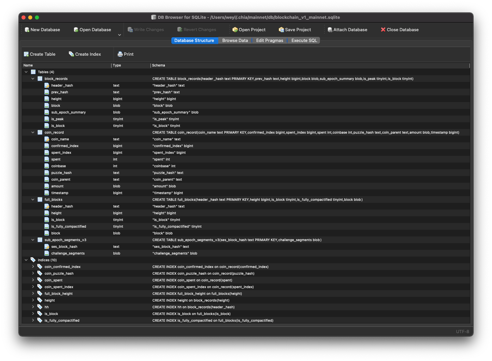
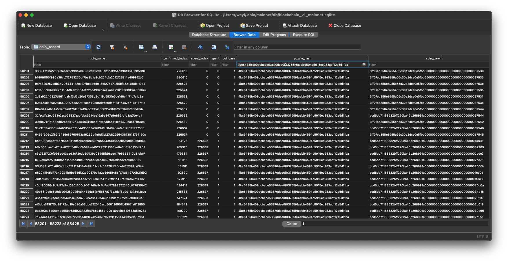
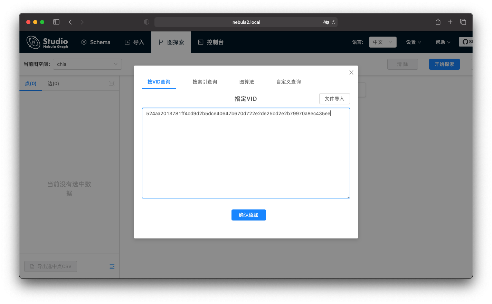
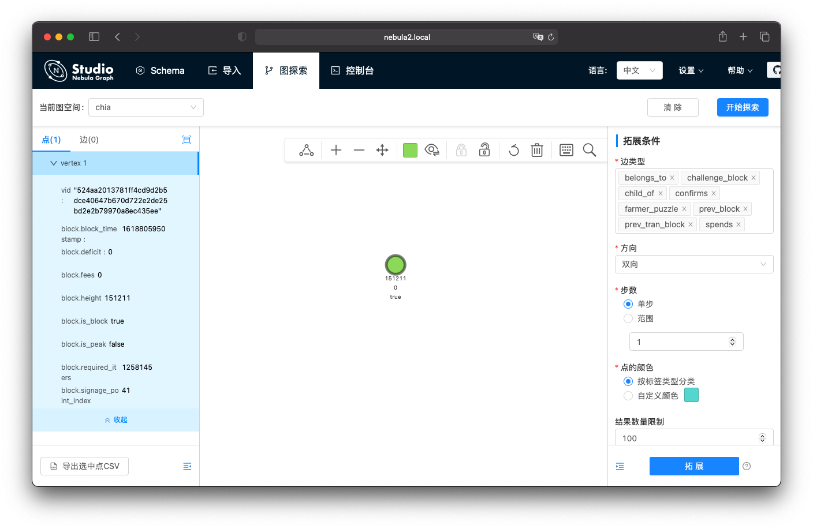
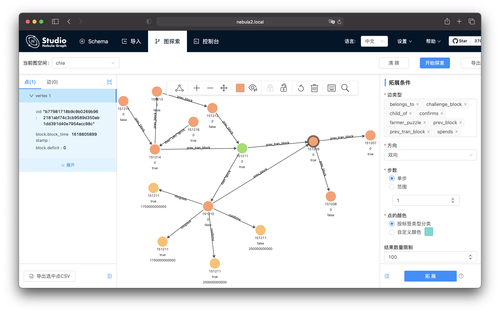
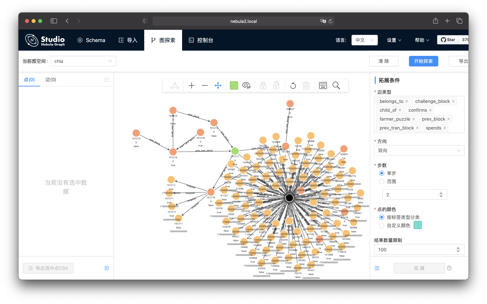
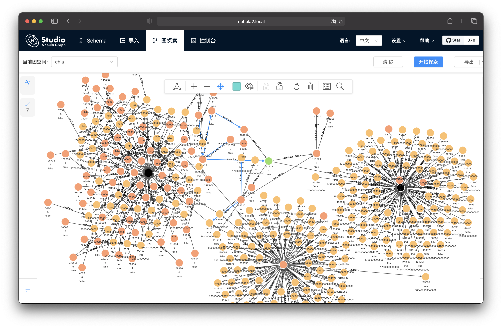

# Explore Chia Network in a Visualized Way


> 本文分析了 Chia Network 的全链数据，并做了将全链数据导入图数据库：Nebula Graph 之中的尝试，从而可视化地探索了 Chia 图中数据之间的关联关系。

## 1. What is Chia Network?

Chia Network 是由 BitTorrent 的作者 Bram Cohen 的团队在 2017 年创建的区块链项目。

### 1.1 Why yet another Blockchain? 为什么再搞一个区块链?

Chia 用了全新的中本聪共识算法，这个算法通过不允许并行计算，让挖矿（Proof of Work）所需算力和能耗降到非常低，这使得超大组织、玩家没法像在其他的区块链项目那样有算力的绝对优势，也一定程度上规避了能源的浪费。

### 1.2 How Can I access Chia Network? 如何连接Chia?

我们可以通过 Chia Network 的客户端来访问它，这个客户端是 Electron + Python 的程序，天然跨平台，既有 GUI 又有 CLI 的方式。

#### 安装

只需要按照官方的 Guide 来下载安装就好， https://github.com/Chia-Network/chia-blockchain/wiki/INSTALL，我在 M1 Mac 下安装的时候脚本出了点小问题，大概是因为拉取二进制 wheel 文件网络出问题走到了编译 wheel的逻辑，而那里是依赖 `cargo`的，如果大家遇到了这个问题，可以提前手动安装一下 rust，或者 cherry-pick 我的这个 [PR](https://github.com/Chia-Network/chia-blockchain/pull/3789) 。

#### 运行

- 按照官方 guide，比如 macOS 来说，最后一步执行`npm run electron &` 就是运行它的GUI客户端。
- 如果大家像我一样喜欢 CLI，直接在执行完 `. ./activate` 之后就可以 `chia --help`了哈☺，里边有只启动部分服务的方式（相比 GUI 启动所有来说)。

在运行之后，如果你的网络不是多层 NAT 的那种，理论上您可以连到 `mainnet` 并且自动和主链同步数据了，如果您是第二次运行，连接主链，一开始可能有一阵子同步的`block` 数是不变的，也没有 `peer` 连过来，不必惊慌，等一下就好了。

> Tips:
>
> - 第一次连到 Chia Network 的同学们，客户端会自动生成一个钱包，及的保存那一串词，它们就是你的私钥哦。
> - 万一，如果真的连不上的话，可能需要在路由上配置，[UPnP](https://www.homenethowto.com/ports-and-nat/upnp-automatic-port-forward/)，防火墙要允许 8444。

#### 访问 Chia 的数据

Chia 的客户端把数据存在了几个 SQLite 数据库里，它们的路径是我们安装客户端的用户的家目录：`~/.chia/mainnet`

下边就是运行起来 Chia 之后生成的主要的两个数据库的二进制文件：

```
~/.chia/mainnet/db 
❯ ll -h
total 4350416
-rw-r--r--  1 weyl  staff   2.0G May  6 12:06 blockchain_v1_mainnet.sqlite
-rw-r--r--  1 weyl  staff    64K May  6 11:17 blockchain_v1_mainnet.sqlite-shm
-rw-r--r--  1 weyl  staff    20M May  6 12:10 blockchain_v1_mainnet.sqlite-wal
-rw-r--r--  1 weyl  staff   1.8M May  6 11:46 peer_table_node.sqlite
-rw-r--r--  1 weyl  staff    32K May  5 17:30 peer_table_node.sqlite-shm
-rw-r--r--  1 weyl  staff   5.4M May  6 11:46 peer_table_node.sqlite-wal

~/.chia/mainnet/wallet/db
❯ ll -h 
total 3055848
-rw-r--r--  1 weyl  staff   1.4G May  7 15:32 blockchain_wallet_v1_mainnet_903996200.sqlite
-rw-r--r--  1 weyl  staff    32K May  7 15:24 blockchain_wallet_v1_mainnet_903996200.sqlite-shm
-rw-r--r--  1 weyl  staff   4.0M May  7 15:32 blockchain_wallet_v1_mainnet_903996200.sqlite-wal
-rw-r--r--  1 weyl  staff    16K May  7 15:24 wallet_peers.sqlite
```

然后，我们可以先用 SQLite Browser，一个 SQlite 数据库（文件）的浏览器来看看它。

SQlite 浏览器的官网是 https://sqlitebrowser.org/ 。在下载，安装之后，我们可以通过点击 `Open Database/打开数据库` 选择浏览上边列出来的两个 `.sqlite` 扩展名的数据库文件。

打开数据库之后，我们可以选择第一个标签 `Database Schema` 来看看表的结构。



我们还能像类似于 Excel 一样去看表的数据，还可以 Filter/过滤、Sort/排序任意列。



下一部分，我们来简单看看表里的数据。

> Tips:
>
> - 这里边，`~/.chia/mainnet/wallet` 和裸目录 `~/.chia/mainnet ` 下边的 `db` 里分别都有表文件，他们的信息是有重复的，大家可以分别打开看看哦，即使是相同的表的名字，比如 `block_record` 内里的信息也略有差别，如果大家知道为什么有这样的差别，欢迎浏览告诉大家哈，可能要仔细研究一下客户端、钱包等代码才行，幸运的是，它们相对比较好阅读，是 Python 写的： https://github.com/Chia-Network/chia-blockchain 。

## 2. Inspect the Chia Network, 分析 Chia 的数据

如果大家仔细看了上边表结构定义的截图，就能注意到一些表的主要信息是嵌套二进制 KV Byte，所以只从 SQLite 并不能看到所有 Chia 的数据，所以我们需要（用一个编程语言来）读取表里的 Byte。

幸运的是，这件事儿因为 Chia 是开源的，而且是 Python 的代码，使得我们可以直接交互式的做。

我花了一点点时间在 Chia 客户端代码里找到了需要的封装类，借助它，可以比较方便的分析 Chia 客户端在本地的全链数据。

如果您不感兴趣细节，可以直接看我分析的结论。

结论之后，我也给大家演示一下是怎么读取它们的。

### 2.0 TL;DR, 结论

我们可以从表中读取到区块链记录（Block Record ），Chia 币记录（Coin Record）。

从区块记录中，我们可以看到关键的涉及交易的信息：

- 关联的 Coin ，关联的 Puzzle（地址），Coin 的值(Amount)

从币记录中，我们可以看到关键的涉及区块的信息：

- 生成这个 Coin 所在区块链里的索引高度（Confirmed Index）
- 如果这个记录是花费 Coin 的，花费它的索引高度（Spent Index）

```asciiarmor
                                                   ┌──────────────────────┐
┌────────────────────────────────────────┐         │                      │
│                                        │         │    Coin Record       │
│   Block Record                         │         │                      │
│                                        │         │     Coin Name        │
│    Height ◄────────────────────────────┼─┐       │                      │
│                                        │ │     ┌─┼───► Puzzle           │
│    Header                              │ │     │ │                      │
│                                        │ │     ├─┼───► Coin Parent      │
│    Prev Header                         │ │     │ │                      │
│                                        │ │     ├─┼───► Amount           │
│    Block Body                          │ │     │ │                      │
│      farmer_puzzle_hash                │ │     │ │     Time Stamp       │
│      fees                              │ │     │ │                      │
│      pool_puzzle_hash                  │ └─────┼─┼─┬─  Confirmed Index  │
│      prev_transaction_block_hash       │       │ │ │                    │
│      prev_transaction_block_height     │       │ │ └─  Spent Index      │
│      transactions_info  ───────────────┼───────┘ │                      │
│ ┌─── is_transaction_block              │         │     Coinbase         │
│ │    sub_epoch_summary ────────────────┼───────┐ │                      │
│ │                                      │       │ └─ ────────────────────┘
│ │  is Peak                             │       │
│ └──is Block                            │       │ ┌─────────────────────┐
│                                        │       │ │                     │
└────────────────────────────────────────┘       └─┼─► Sub Epoch Segment │
                                                   │                     │
                                                   └─────────────────────┘
```


### 2.1 Preperation, 准备

因为安装客户端之后，我们本地实际上已经有了相关的 Python 环境和依赖，只需要在里边跑起来就好。

```bash
# 注意，我们要 cd 到之前安装客户端时候克隆的仓库。
cd chia-blockchain
# source activate 脚本来切换到仓库安装时候创建的 Python 虚拟环境，并进到 IPython 里。
source venv/bin/activate && pip install ipython && ipython
```

然后试着导入客户端里边带有的 Python 的 Chia 的封装类试试看。

```python
In [1]: import sqlite3
   ...: from chia.consensus.block_record import BlockRecord
# 导入成功，没有报错
In [2]: !pwd
# 我的安装克隆目录
/Users/weyl/chia-blockchain
```

恭喜你做好了准备，我们看看 Block Record 里都有什么。

### Block Record Chain，区块记录

在上一步的 `IPython` 窗口下。

```python
# 注意，这里的路径的前缀是我们自己的家目录，不同操作系统，不同的用户都会有所不同。
chia_db_path = "/Users/weyl/.chia/mainnet/db/blockchain_v1_mainnet.sqlite"

cur = con.cursor()
# 这里我们取第 201645 高的区块
rows = list(cur.execute('SELECT * FROM block_records WHERE height = 201645'))
# 这里 0 表示 SELECT 结果的第一行，3 表示在 BlockRecord 这个表里边，Block 的二进制 BLOB 是第四列，参考本章底部的表定义部分
block_records_201645 = BlockRecord.from_bytes(rows[0][3])
dir(block_records_201645)
# 可以查看一些属性 is_transaction_block，timestamp，reward_claims_incorporated
In [174]: block_records_201645.is_transaction_block
Out[174]: True

In [182]: from datetime import datetime
In [183]: datetime.fromtimestamp(block_records_201645.timestamp)
Out[183]: datetime.datetime(2021, 4, 29, 10, 8, 1)

In [190]: block_records_201645.reward_claims_incorporated[0].to_json_dict()
Out[190]:
{'parent_coin_info': '0xccd5bb71183532bff220ba46c268991a000000000000000000000000000313ab',
 'puzzle_hash': '0xbbb014f41d88c74b78501b36e4863d3382bfda9ae3c4d30a1b6df72b962502b6',
 'amount': 1750000000000}

# 可以快速 print 看大部分信息
print(block_records_201645)
```

`block_records_201645` 的打印结果如下。

> 这里我截断了一些数据

```json
{'challenge_block_info_hash': '0x4a562f1ffa7a06fe76b1df74dbdd6bdcfbf63139a6f1fc3291c606d7c976abf6',
 'challenge_vdf_output': {'data': '0x0200a6b38d6b58d17129d71737088772561f22a44ef302fe45a70a763b878f998abfe35946df720bcb5d78e214b667bce801d597b46c867928c4b8926c342375a961f36cd63ec698bc25e5ce48c45d9a2074eded0e42d24dd1b50a59e699f671f0900100'},
 'deficit': 16,
 'farmer_puzzle_hash': '0x4bc6435b409bcbabe53870dae0f03755f6aabb4594c5915ec983acf12a5d1fba',
 'fees': 0,
 'finished_challenge_slot_hashes': ['0x2b1a7b4859a8d3597b8e6cbe3b27ab97212be8b19e6867f2a4d0eef26c36340f'],
 'finished_infused_challenge_slot_hashes': ['0xd0185a6493b10d84e696c6fc55ec1920e8a96791a604dedfe77635da460f354d'],
 'finished_reward_slot_hashes': ['0xe2bcbf560471131a7fb87ffe3f9ddde03166a9b0092a50f1ed1599715857c365'],
 'header_hash': '0x2791729e1c914f9c3908a0ad895b5846c86fc4e207cc463820123e9a299c39f3',
 'height': 201645,
 'infused_challenge_vdf_output': None,
 'overflow': True,
 'pool_puzzle_hash': '0x4bc6435b409bcbabe53870dae0f03755f6aabb4594c5915ec983acf12a5d1fba',
 'prev_hash': '0xf126ecf64473beb9ae5b84137788100feb9d731c604877c0744cdc6025f4cbeb',
 'prev_transaction_block_hash': '0x7103fe2f1aa96998f9ccf6fc98561b64c5f7a98cf942335c4c927fb2eaa9325a',
 'prev_transaction_block_height': 201643,
 'required_iters': 95752,
 'reward_claims_incorporated': [{'amount': 1750000000000,
                                 'parent_coin_info': '0xccd5bb71183532bff220ba46c268991a000000000000000000000000000313ab',
                                 'puzzle_hash': '0xbbb014f41d88c74b78501b36e4863d3382bfda9ae3c4d30a1b6df72b962502b6'},
                                {'amount': 250000000000,
                                 'parent_coin_info': '0x3ff07eb358e8255a65c30a2dce0e5fbb000000000000000000000000000313ab',
                                 'puzzle_hash': '0xbbb014f41d88c74b78501b36e4863d3382bfda9ae3c4d30a1b6df72b962502b6'},
                                {'amount': 1750000000000,
                                 'parent_coin_info': '0xccd5bb71183532bff220ba46c268991a000000000000000000000000000313aa',
                                 'puzzle_hash': '0x4bc6435b409bcbabe53870dae0f03755f6aabb4594c5915ec983acf12a5d1fba'},
                                {'amount': 250000000000,
                                 'parent_coin_info': '0x3ff07eb358e8255a65c30a2dce0e5fbb000000000000000000000000000313a8',
                                 'puzzle_hash': '0xcf178071f6aa6cb1c92f00943424bcc8cb774449bd60058fc08e9894f49a1ca4'}],
 'reward_infusion_new_challenge': '0x660886f4ab030c07755f53362ae4253dfa93ea853cbc321218f58f159c75adaa',
 'signage_point_index': 63,
 'sub_epoch_summary_included': None,
 'sub_slot_iters': 99614720,
 'timestamp': 1619662081,
 'total_iters': 660123219464,
 'weight': 4121254}
```

另外，我们取的这个表的定义如下。

```mysql
CREATE TABLE block_records(
  header_hash text PRIMARY KEY, 
  prev_hash text, 
  height bigint,
  block blob, #<----
  sub_epoch_summary blob, 
  is_peak tinyint, 
  is_block tinyint)
```


### Coin Record Chain，Chia 币记录

类似的，我们可以获取一个 Coin 的记录，这里边，从表的定义可以看到，唯一二进制（不能直接从数据库查询中被人读懂）的字段就是是币值，不存在嵌套的结构，所以也并不需要封装的类才能看清楚里边的信息。

```mysql
CREATE TABLE coin_record(
  coin_name text PRIMARY KEY,
  confirmed_index bigint,
  spent_index bigint,
  spent int,
  coinbase int,
  puzzle_hash text,
  coin_parent text,
  amount blob,
  timestamp bigint)
```

这里值得注意的信息主要是 `spent_index` 和 `confirmed_index`。

```python
from chia.util.ints import uint64

chia_db_path = "/Users/weyl/.chia/mainnet/db/blockchain_v1_mainnet.sqlite"
con = sqlite3.connect(chia_db_path)
cur = con.cursor()
rows = list(cur.execute('SELECT * FROM coin_record WHERE confirmed_index = 201645'))
coin_amount = uint64.from_bytes(rows[0][7])

In [201]: rows[0]
Out[201]:
('cf35da0f595b49dde626d676b511ee62bce886f2216751aa51bb8ff851563d35', # coin_name
 201645, # confirmed_index
 0, # spent_index，这里没有spent，所以值无效
 0, # spent，其实是 bool
 1, # coinbase，bool
 'bbb014f41d88c74b78501b36e4863d3382bfda9ae3c4d30a1b6df72b962502b6', # puzzle_hash 对应到地址
 'ccd5bb71183532bff220ba46c268991a000000000000000000000000000313ab',
 b'\x00\x00\x01\x97t \xdc\x00', # uint64
 1619662081)
```


### Puzzles/ Address，地址

我们可以把 Chia 中的 Puzzle 理解成为交易中的地址，为了方便使用，通常会把 Puzzle 的 hash 用[bech32m](https://github.com/bitcoin/bips/blob/master/bip-0173.mediawiki) 转换成地址。

> Tips:
>
> 这里有一个在线双向转换的在线工具推荐一下: https://www.chiaexplorer.com/tools/address-puzzlehash-converter

## 3. How to explore Chia Network? 如何探索 Chia 链

随着我们之前分析的信息，自然地，我们可以把 Chia 区块链中的信息取出来，用图（Graph）来表示，这里的图并不是（Graphic）图形、图画的意思，是数学、图论中的图。

在图的语境下，最主要的两个元素就是顶点（Vertex）和边（Edge）。

顶点表示一个实体，而边表示实体之间的某种关系，这种关系可以是对等的（无方向的）也可以是有方向的。

这里我们可以把这里的信息抽象映射到如图的图模型里：

- Block 顶点
- Coin 顶点
- Puzzle 顶点
- spends 边（Block 到 Coin）
- confirms 边 （Block 到 Coin）
- belongs_to 边（Coin 到 Puzzle）


这里，我们应用的图是一种叫做属性图的形式，除了点和边的关系之外。这两种实体（点、边）还有其他信息只和它们的一个实例相关，所以再定义为顶点、边就不是很适合，这些信息就作为点、边的属性（preperty）存在。

这种为了处理实体之间关联、涉及实体、关联的属性信息的，也就是"属性图"的存储信息的方式在计算机领域越来越流行，甚至有专门为此结构而原生开发的数据库——图数据库（Graph Database）。

这里，我们用的就是一个叫做 Nebula Graph 的图数据库，它是一个现代的、为超大规模分部署架构设计的、原生存储、查询、计算图数据的项目，更棒的是，它是产生于社区的开源产品。

> Tips:
>
> **安装 Nebula Graph**
>
> 一般来说，面向超大规模数据的分布式系统，天然的都是不容易轻量部署的，大家如果第一次使用的话可以试试我写的一个叫做 nebula-up 的小工具，可以一行指令部署一个用来试用、学习的 Nebula Graph 集群，地址在这里： https://github.com/wey-gu/nebula-up/ 。

### 3.1 Import the Chia to a Graph Database, Nebula Graph 导入 Chia 数据到图数据库

我们分两步走，第一步这把 Chia Network 数据转换成 CSV 文件，第二步使用 Nebula 的 [Nebula-Importer](https://github.com/vesoft-inc/nebula-importer/) 把数据导入 Nebula Graph。

#### 3.1.1 Data conversion 数据转换

这部分的代码我开源在这里了:

https://github.com/wey-gu/nebula-chia

使用它只需要在 Chia Network 的 python venv 下安装它:

```bash
python3 -m pip install nebula-chia
```

然后调用 `ChaiBatchConvertor` 就可以在当前目录下生成两个 CSV 文件。

这里边有一些可以配置的参数，具体可以参考代码 `nebulachia/convertor.py`

```python
from nebulachia.convertor import ChiaBatchConvertor
c = ChaiBatchConvertor(
    block_record_limit=0, coin_record_limit=0, write_batch_size=10000)
c.convert_block_record()
c.convert_coin_record()
```

生成的文件：

```bash
$ ls -lth

-rw-r--r--   1 weyl  staff   173M May 19 13:01 coin_record.csv
-rw-r--r--   1 weyl  staff    77M May 19 12:59 block_record.csv
```

这里边字段的含义和类型，可以参考代码中 `block_record_row` 和 `coin_record_row` 的 `__doc__`

```python
In [466]: print(c.coin_record_row.__doc__)

        Parse row and return a CSV block coin row list.

        CREATE TABLE coin_record(
          coin_name text PRIMARY KEY,
          confirmed_index bigint,
          spent_index bigint,
          spent int,
          coinbase int,
          puzzle_hash text,
          coin_parent text,
          amount blob,
          timestamp bigint)

        Coin Record CSV Head:
            0         1(int)          2(int)      3(bool)
            coin_name|confirmed_index|spent_index|spent|

            4(bool)  5           6           7(int)
            coinbase|puzzle_hash|coin_parent|amount|

            8(timestamp)
            timestamp|

            9              10
            confirmed_hash|spent_hash

In [467]: print(c.block_record_row.__doc__)

        Parse row and return a CSV block record row list.

        CREATE TABLE block_records(
          header_hash text PRIMARY KEY,
          prev_hash text,
          height bigint,
          block blob,
          sub_epoch_summary blob,
          is_peak tinyint,
          is_block tinyint)

        Block Record CSV Head:
            0           1         2(int) 3(bool) 4(bool)
            header_hash|prev_hash|height|is_peak|is_block|

            5(int)
            deficit|

            6
            challenge_block_info_hash|

            7
            farmer_puzzle_hash|

            8(int)
            fees|

            9
            prev_transaction_block_hash|

            10
            prev_transaction_block_height|

            11             12(int)
            required_iters|signage_point_index|

            13(timestamp)
            timestamp
```


#### 3.1.1 Data import 数据导入

有了 CSV 文件，我们可以借助 [Nebula-Importer](https://github.com/vesoft-inc/nebula-importer/) 导入数据到图数据库中。

这里，我们写好了 nebula-importer 的配置文件，其中包涵了如下信息:

- 在 Nebula Graph 中创建需要的数据模型 Schema，这和我们前边做的图映射的信息是等价的
- 描述 CSV 文件之中的 Column 的数据到图模型（点，边，点或边的属性）映射关系


```bash
# 这里，我的 csv 文件和 配置文件都放在 /home/wei.gu/chia 之下
# 我使用 docker-compose 默认配置部署的 Nebula Graph,
# 它创建了叫 nebula-docker-compose_nebula-net 的 docker 网络
docker run --rm -ti \
    --network=nebula-docker-compose_nebula-net \
    -v /home/wei.gu/chia/nebula-chia.yaml:/root/nebula-chia.yaml \
    -v /home/wei.gu/chia:/root \
    vesoft/nebula-importer:v2 \
    --config /root/nebula-chia.yaml
```

这里我展示一个导入的结果示例，我在单机部署的 Nebula Graph 里导入了我一两周之前取的全量 Chia Network 数据的结果。

```bash
...
2021/05/19 09:55:09 [INFO] reader.go:180: Total lines of file(/root/coin_record.csv) is: 547557, error lines: 0
2021/05/19 09:55:09 [INFO] statsmgr.go:61: Done(/root/coin_record.csv): Time(4385.88s), Finished(4512927), Failed(0), Latency AVG(1305us), Batches Req AVG(2015us), Rows AVG(1028.42/s)
2021/05/19 09:55:10 --- END OF NEBULA IMPORTER ---
```


### 3.2 Explore the Chia Graph 探索 Chia 的数据

#### Graph DB Queries

导入 Chia 链的网络到 Nebula Graph 之后，我们可以在里边快速查询数据之间的关联。

比如这个查询表示从区块 `524aa2013781ff4cd9d2b5dc...` 查起，经过三种边 `farmer_puzzle, spends, confirms` 双向遍历的结果。

```sql
GO 5 STEPS FROM \
   "524aa2013781ff4cd9d2b5dce40647b670d722e2de25bd2e2b79970a8ec435ee" \
   OVER farmer_puzzle,spends,confirms BIDIRECT
...
Got 419437 rows (time spent 735120/1170946 us)

Wed, 19 May 2021 10:11:28 UTC
```

再比如，计算一个 Puzzle 地址上的余额（所有 coin 的总价值）比如这个puzzle `bbe39134ccc32c08fdeff...`

```sql
GO 1 STEP FROM "bbe39134ccc32c08fdeff4d2c19d1d1f4f7e48cdaf79d37397bc3136ce9b3cb7" \
   OVER belongs_to REVERSELY \
   YIELD CASE $$.coin.is_spent \
         WHEN true THEN $$.coin.amount \
         WHEN false THEN -$$.coin.amount \
         END AS Amount | YIELD sum($-.Amount)
```

#### The Visulized way with Nebula Studio

Nebula Graph 为我们提供了图形化界面，有了它，我们可以用更符合人脑的方式地查看 Chia Network 中的数据。

比如，我们还是回到上边的那个区块，从这里查询。



我们就获得了这个 block 类型的一个点/ vertex。我们可以从他开始进一步探索，先鼠标单击这个点，在拓展条件里把方向选择双向，默认的边类型是所有的边类型，这样我们就可以把所有 `步数`内相关联的数据一下子全都找出来。

选择好拓展条件之后，点击拓展就可以。



这里，我们选择了步数为 `1`，点击拓展（或者双击要拓展的点），之后，我们可以快速双击其他的点继续拓展，这是我鼠标点了几次之后看到的样子：



我们接下来再试试拓展的步数为 `2`，点击拓展（或者双击要拓展的点），看起来找到了有意思的信息。

我们看到了一个有很多边的黑色的点。



通过查看这个点和我们开始查看的 block 之间的边，我们知道这个点正是 farm 这个 block 的地址，这个地址下边有非常多的 coin。


这只是一个开始，有了这个导入到 Nebula Graph 图数据的基础，我们可以做很多有意思的分析和洞察，大家可以自己试试看，得到更有意思的结果分享给其他同学。


## 4. Summary 总结

这篇文章里，在我们简单介绍了 Chia Network 之后，我们首次的带大家一起从安装一个 Chia 终端，到分析终端同步到本地的 Chia 全网数据，借助于 Chia 终端开源的 Python 代码库，我们分析了全网数据里的重要信息。

之后，我们开源了一个小工具 Nebula-Chia，有了它，就可以把 Chia 的全网数据转换成 CSV 格式，这样，就可以借助 nebula-importer 把所有的数据导入到一个先进的图数据库（Nebula Graph）中。

Nebula Graph 的项目地址是 https://github.com/vesoft-inc/nebula-graph

Nebula-Chia 我也开源在 https://github.com/wey-gu/nebula-chia

在图数据库中，我们展示了做基本 Query 的例子和借助图数据库自带的可视化工具，我们可以轻易地获取 Chia 全网数据之间关联关系，有了这个作为基础，这些数据中洞察的潜力和可以尝试的有意思事情可以比较直观和高效地进一步探索了！

是不是很酷？




## 5. References

- https://www.chia.net/faq/
- https://chialisp.com/docs/
- https://www.chiaexplorer.com/chia-coins
- https://docs.google.com/document/d/1tmRIb7lgi4QfKkNaxuKOBHRmwbVlGL4f7EsBDr_5xZE
- https://github.com/sipa/bech32/tree/master/ref/python
- https://github.com/Chia-Network/chia-blockchain/blob/main/README.md
- https://www.chia.net/assets/ChiaGreenPaper.pdf
- https://docs.nebula-graph.com.cn

> Banner Picture Credit: [Icons8 Team](https://unsplash.com/photos/Ph5_4TnXXYE?utm_source=unsplash&utm_medium=referral&utm_content=creditShareLink) 

