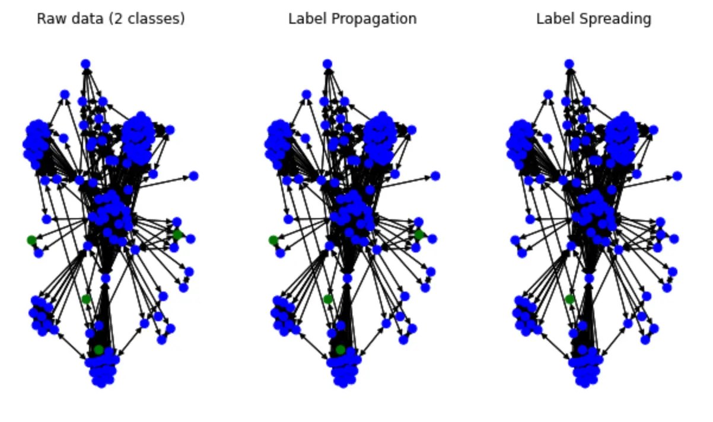

# Fraud Detection with NebulaGraph GraphDatabase in action


> This is a review of Fraud Detection methods based on graph algorithms, graph databases, machine learning, and graph neural networks on NebulaGraph, and in addition to an introduction to the basic methodological ideas, I've also got a Playground you can run. it's worth mentioning that this is the first time I've introduced you to the Nebula-DGL project 😁.

<!--more-->

<!--

[TOC]

-->

## Fraud detection methods based on graph database

### Graph Modeling

We started the modeling with the existing historical data, annotated information oriented to the relationship of the property graph. The data source could be the transaction event records, user data, and risk control annotations in the banking, e-commerce, or insurance industries in multiple table structures.

The modeling process is to abstract the entities we care about, the relationships between them, and the meaningful properties attached to both entities and relationships.

In general, persons, corporate entities, phone numbers, addresses, devices (e.g., terminal devices, network addresses, WiFi SSIDs to which terminal devices are connected, etc.), and orders are entities we started with to consider, and other information such as is_risky label, and information about persons and corporate entities (occupation, income, education, etc.) are modeled as properties of entities.

The model looks like this and the corresponding dataset could be generated with [fraud-detection-datagen](https://github.com/wey-gu/fraud-detection-datagen), with which you could generate dataset in any expected scale and community sturcture.


### Fraud detection with Graph Query

<!--

有了一张囊括了人、公司、历史贷款申请记录、电话、线上申请网络设备的图谱，我们可以挖掘一些有意思的信息。

-->

With a graph that encompasses persons, companies, historical loan application records, phone calls, and online applications for web-based devices, we can uncover some interesting information with certain graph queries directly.

<!--

事实上，很多值得被发现、并有效阻止从而止损的骗保行为是具有群体聚集性的。比如欺诈团伙可能是一小批人（比如3到5人）有组织地收集更大规模的身份证信息（比如30张），同时发起多个金融机构大量贷款，然后在放款后选择丢弃这批留下了违约记录的身份证，再进一步选择下一批身份证信息如法炮制。

-->

In fact, many frauds are clusterred in nature. For example, a fraud ring may be a small group of people (e.g., 3 to 5 people) who collect ID information on a larger scale (e.g., 30) in an organized manner, initiate a large number of loans from multiple financial institutions at the same time, and then choose to discard the batch of IDs that have left a record of default after they have been disbursed, and then further choose the next batch of ID information as they have done.

<!--

这种团伙作案的方式因为利用了大量新的身份信息，完全利用历史记录去黑名单规避风险的方式是无效的。不过，借助于关联关系的视角，这些模式是一定程度上可以被及时识别出来的。

-->

Due to the group of frauds keeps utilizing new identity information, it's hard to detect with historical records based blacklist mechanism. However, with the help of the patterns being queried in graph, such case could be resovled in real-time.

<!--

这些模式可以被识别出的规律我把它分成两种：

-->

These patterns can be categorised into two types:

<!--

一种是风控专家可以直接用某种模式来描述的，例如：和已经被标注为高风险的实体有直接或者间接的关联关系（新订单申请人使用了和过往高风险记录相同的网络设备），这种模式对应到图谱中，通过一个图查询就可以实时给出结果。

另一种是隐含在数据的关联关系背后，需要通过图算法挖掘得出的一些风险提示，例如：尽管给定的实体与有限的标注高风险实体没有匹配的关联，但是它在图中形成了聚集性可能提示我们这可能是一个尚未得手的进行中的团伙贷款诈骗的其中一次申请，这种情况可以通过定期在历史数据中批量执行社区发现算法得出，并在高聚集社区中利用中心性算法给出核心实体，一并提示给风险专家进行后续评估和风险标注。

-->

- One is that which can be directly described by the risk control expert in terms of some pattern, e.g., a direct or indirect association with an entity that has been marked as high risk (new order applicants use the same network devices as past high risk records), and this pattern corresponds to the graph, which gives results in real time through a graph query.

- Another type of association is implicitly behind the correlation of the data, which needs to be mined by graph algorithms for some risk hints, e.g., although a given entity has no matching association with a limited number of labeled high-risk entities, the aggregation it forms in the graph may suggest that this may be one of the applications of an ongoing gang loan fraud that has not yet succeeded, which can be derived by periodically batching in the historical data This situation can be derived by periodically performing community discovery algorithms in bulk in historical data, and using centrality algorithms in highly aggregated communities to give core entities that are prompted to risk experts for subsequent evaluation and risk labeling.

#### Fraud detection based on expert graph pattern matching

Before we get started, let's prepare for a NebulaGraph playground with the above graph dataset being loaded:

> Nebula Graph Playground setup, based on  https://github.com/wey-gu/nebula-up/

```bash
curl -fsSL nebula-up.siwei.io/install.sh | bash
```

Load graph dataset

```bash
# clone dataset genarator repo
git clone https://github.com/wey-gu/fraud-detection-datagen.git
cp -r data_sample_numerical_vertex_id data
# remove table head
sed -i '1d' data/*.csv
# load dataset to nebulagraph
docker run --rm -ti \
    --network=nebula-net \
    -v ${PWD}:/root/ \
    -v ${PWD}/data/:/data \
    vesoft/nebula-importer:v3.1.0 \
    --config /root/nebula_graph_importer.yaml
```

With such a mapping, risk control experts can explore the relationships between entities on-demand in a visual exploration tool that maps the corresponding risk patterns:


In this screenshot of rendered query, we can clearly see a risk pattern for a group-controlled device that can be given to a graph database developer and abstracted into NebulaGraph database statements that can be queried by anyone or certain application in real-time fashion:

```cypher
## Query started from a person for given transaction
MATCH (n) WHERE id(n) == "200000010265"
OPTIONAL MATCH p_shared_d=(n)-[:used_device]->(d)<-[:used_device]-(:applicant)-[:with_phone_num]->(pn:phone_num)<-[e:with_phone_num]-(:applicant)
RETURN p_shared_d
```

Then we could create an API based on queries like the following, which returns `count(e)` as a metrics.

```cypher
## group controlled device metric
MATCH (n) WHERE id(n) == "200000010265"
OPTIONAL MATCH p_shared_d=(n)-[:used_device]->(d)<-[:used_device]-(:applicant)-[:with_phone_num]->(pn:phone_num)<-[e:with_phone_num]-(:applicant)
RETURN count(e)
```

In this way, we can build an online risk control system that uses limited labeled data and expert resources to more efficiently control the risk of gang fraud.

Another example of leveraging labeled high-risk vertices could be like querying the count of ones whose `is_risky` flag is True:

```cypher
MATCH p_=(p:applicant)-[*1..2]-(p2:applicant) WHERE id(p)=="200000014810" AND p2.applicant.is_risky == "True" RETURN p_ LIMIT 100
```


And the metric would be like:

```cypher
MATCH (p:applicant)-[*1..2]-(p2:applicant) WHERE id(p)=="200000014810" AND p2.applicant.is_risky == "True" RETURN count(p2)
```

However, in real world, most of our labeled data is still too expensive to obtain, so is there any way to more effectively use the limited risk labeling and graph structure to predict the risk?

The answer is yes.

### Expand labels in Graph

<!--

Xiaojin Z. 和 Zoubin G. 在论文：[Learning from Labeled and Unlabeled Data with Label Propagation](http://mlg.eng.cam.ac.uk/zoubin/papers/CMU-CALD-02-107.pdf) （CMU-CALD-02-107）中，利用标签传播（Label Propagation）算法来把有限的标注信息在图上通过关联关系传播到更多实体中。

-->

In the paper: [Learning from Labeled and Unlabeled Data with Label Propagation](http://mlg.eng.cam.ac.uk/zoubin/papers/CMU-CALD-02-107.pdf) (CMU-CALD-02-107) by Xiaojin Z. and Zoubin G., the Label Propagation algorithm is used to propagate limited labeled information on the graph to more entities through the edges.

In this way, we can easily "propagate" more labeled information with a limited number of high-risk annotations in the graphs we build. These extended labeles can, on the one hand, give more results in real-time graph queries and, on the other hand, serve as important input for risk control experts to help advance anti-fraud investigation actions.

In general, we can scan the graph data offline periodically, expand and update the labels by the graph algorithm, and then write the valid updated labels back to the graph.

> Note that there is a similar method, SIGNDiffusion, for those who are interested.

#### Try expanding labels in graph 

Here is an example that works.

In this example, I use the public Yelp dataset. This data will not only be used in this example, but also in the later cases in the GNN method, so you can be patient and import the data into NebulaGraph.

Load dataset into NebulaGraph

> More details in: https://github.com/wey-gu/nebulagraph-yelp-frauddetection

```bash
git clone https://github.com/wey-gu/nebulagraph-yelp-frauddetection
cd nebulagraph-yelp-frauddetection
python3 -m pip install -r requirements.txt
# download and process dataset
python3 data_download.py

# load it into NebulaGraph
docker run --rm -ti \
    --network=nebula-net \
    -v ${PWD}/yelp_nebulagraph_importer.yaml:/root/importer.yaml \
    -v ${PWD}/data:/root \
    vesoft/nebula-importer:v3.1.0 \
    --config /root/importer.yaml
```

After it's done, we could see the data stats:

```bash
~/.nebula-up/console.sh -e "USE yelp; SHOW STATS"
```

It should look like:

```bash
(root@nebula) [(none)]> USE yelp; SHOW STATS
+---------+---------------------------------------+---------+
| Type    | Name                                  | Count   |
+---------+---------------------------------------+---------+
| "Tag"   | "review"                              | 45954   |
| "Edge"  | "shares_restaurant_in_one_month_with" | 1147232 |
| "Edge"  | "shares_restaurant_rating_with"       | 6805486 |
| "Edge"  | "shares_user_with"                    | 98630   |
| "Space" | "vertices"                            | 45954   |
| "Space" | "edges"                               | 8051348 |
+---------+---------------------------------------+---------+
Got 6 rows (time spent 1911/4488 us)
```

Currently, the general LPA tag propagation algorithm is used for community detection and few implementations are used for tag expansion (only SK-Learn has this implementation), here, we refer to the implementation given by [Thibaud M](https://datascience.stackexchange.com/users/77683/ thibaud-m) for the implementation given.

> The orginal talks could be referred: https://datascience.stackexchange.com/a/55720/138720

To make this algorithm run faster, a subgraph is taken from the NebulaGraph and an expansion of the labeling is done on this small subgraph:

> First, we start a Playground for Jupyter.
>
> More details in: https://github.com/wey-gu/nebula-dgl.

```bash
git clone https://github.com/wey-gu/nebula-dgl.git
cd nebula-dgl
# run the Jupyter Notebook
docker run -it --name dgl -p 8888:8888 --network nebula-net \
    -v "$PWD":/home/jovyan/work jupyter/datascience-notebook \
    start-notebook.sh --NotebookApp.token='nebulagraph'
```

visit http://localhost:8888/lab/tree/work?token=nebulagraph

Install depednecies(they will be used in GNN examples, too)

```python
!python3 -m pip install git+https://github.com/vesoft-inc/nebula-python.git@8c328c534413b04ccecfd42e64ce6491e09c6ca8
!python3 -m pip install .
```

Then, let's sample a subgraph, starting from the vertex with ID `2048`, to get all vertecies in two steps:

```python
import torch
import json
from torch import tensor
from dgl import DGLHeteroGraph, heterograph

from nebula3.gclient.net import ConnectionPool
from nebula3.Config import Config

config = Config()
config.max_connection_pool_size = 2
connection_pool = ConnectionPool()
connection_pool.init([('graphd', 9669)], config)

vertex_id = 2048
client = connection_pool.get_session('root', 'nebula')
r = client.execute_json(
    "USE yelp;"
    f"GET SUBGRAPH WITH PROP 2 STEPS FROM {vertex_id} YIELD VERTICES AS nodes, EDGES AS relationships;")

r = json.loads(r)
data = r.get('results', [{}])[0].get('data')
columns = r.get('results', [{}])[0].get('columns')

# create node and nodedata
node_id_map = {} # key: vertex id in NebulaGraph, value: node id in dgl_graph
node_idx = 0
features = [[] for _ in range(32)] + [[]]
for i in range(len(data)):
    for index, node in enumerate(data[i]['meta'][0]):
        nodeid = data[i]['meta'][0][index]['id']
        if nodeid not in node_id_map:
            node_id_map[nodeid] = node_idx
            node_idx += 1
            for f in range(32):
                features[f].append(data[i]['row'][0][index][f"review.f{f}"])
            features[32].append(data[i]['row'][0][index]['review.is_fraud'])

rur_start, rur_end, rsr_start, rsr_end, rtr_start, rtr_end = [], [], [], [], [], []
for i in range(len(data)):
    for edge in data[i]['meta'][1]:
        edge = edge['id']
        if edge['name'] == 'shares_user_with':
            rur_start.append(node_id_map[edge['src']])
            rur_end.append(node_id_map[edge['dst']])
        elif edge['name'] == 'shares_restaurant_rating_with':
            rsr_start.append(node_id_map[edge['src']])
            rsr_end.append(node_id_map[edge['dst']])
        elif edge['name'] == 'shares_restaurant_in_one_month_with':
            rtr_start.append(node_id_map[edge['src']])
            rtr_end.append(node_id_map[edge['dst']])

data_dict = {}
if rur_start:
    data_dict[('review', 'shares_user_with', 'review')] = tensor(rur_start), tensor(rur_end)
if rsr_start:
    data_dict[('review', 'shares_restaurant_rating_with', 'review')] = tensor(rsr_start), tensor(rsr_end)
if rtr_start:
    data_dict[('review', 'shares_restaurant_in_one_month_with', 'review')] = tensor(rtr_start), tensor(rtr_end)
# construct a dgl_graph, ref: https://docs.dgl.ai/en/0.9.x/generated/dgl.heterograph.html

dgl_graph: DGLHeteroGraph = heterograph(data_dict)

# load node features to dgl_graph
dgl_graph.ndata['label'] = tensor(features[32])

# heterogeneous graph to heterogeneous graph, keep ndata and edata
import dgl
hg = dgl.to_homogeneous(dgl_graph, ndata=['label'])
```

Then, let's apply the Label Spreading algorithm mentioned above to this subgraph:

```python
from abc import abstractmethod
import torch

class BaseLabelPropagation:
    """Base class for label propagation models.
    
    Parameters
    ----------
    adj_matrix: torch.FloatTensor
        Adjacency matrix of the graph.
    """
    def __init__(self, adj_matrix):
        self.norm_adj_matrix = self._normalize(adj_matrix)
        self.n_nodes = adj_matrix.size(0)
        self.one_hot_labels = None 
        self.n_classes = None
        self.labeled_mask = None
        self.predictions = None

    @staticmethod
    @abstractmethod
    def _normalize(adj_matrix):
        raise NotImplementedError("_normalize must be implemented")

    @abstractmethod
    def _propagate(self):
        raise NotImplementedError("_propagate must be implemented")

    def _one_hot_encode(self, labels):
        # Get the number of classes
        classes = torch.unique(labels)
        classes = classes[classes != -1]
        self.n_classes = classes.size(0)

        # One-hot encode labeled data instances and zero rows corresponding to unlabeled instances
        unlabeled_mask = (labels == -1)
        labels = labels.clone()  # defensive copying
        labels[unlabeled_mask] = 0
        self.one_hot_labels = torch.zeros((self.n_nodes, self.n_classes), dtype=torch.float)
        self.one_hot_labels = self.one_hot_labels.scatter(1, labels.unsqueeze(1), 1)
        self.one_hot_labels[unlabeled_mask, 0] = 0

        self.labeled_mask = ~unlabeled_mask

    def fit(self, labels, max_iter, tol):
        """Fits a semi-supervised learning label propagation model.
        
        labels: torch.LongTensor
            Tensor of size n_nodes indicating the class number of each node.
            Unlabeled nodes are denoted with -1.
        max_iter: int
            Maximum number of iterations allowed.
        tol: float
            Convergence tolerance: threshold to consider the system at steady state.
        """
        self._one_hot_encode(labels)

        self.predictions = self.one_hot_labels.clone()
        prev_predictions = torch.zeros((self.n_nodes, self.n_classes), dtype=torch.float)

        for i in range(max_iter):
            # Stop iterations if the system is considered at a steady state
            variation = torch.abs(self.predictions - prev_predictions).sum().item()
            
            if variation < tol:
                print(f"The method stopped after {i} iterations, variation={variation:.4f}.")
                break

            prev_predictions = self.predictions
            self._propagate()

    def predict(self):
        return self.predictions

    def predict_classes(self):
        return self.predictions.max(dim=1).indices

class LabelPropagation(BaseLabelPropagation):
    def __init__(self, adj_matrix):
        super().__init__(adj_matrix)

    @staticmethod
    def _normalize(adj_matrix):
        """Computes D^-1 * W"""
        degs = adj_matrix.sum(dim=1)
        degs[degs == 0] = 1  # avoid division by 0 error
        return adj_matrix / degs[:, None]

    def _propagate(self):
        self.predictions = torch.matmul(self.norm_adj_matrix, self.predictions)

        # Put back already known labels
        self.predictions[self.labeled_mask] = self.one_hot_labels[self.labeled_mask]

    def fit(self, labels, max_iter=1000, tol=1e-3):
        super().fit(labels, max_iter, tol)

class LabelSpreading(BaseLabelPropagation):
    def __init__(self, adj_matrix):
        super().__init__(adj_matrix)
        self.alpha = None

    @staticmethod
    def _normalize(adj_matrix):
        """Computes D^-1/2 * W * D^-1/2"""
        degs = adj_matrix.sum(dim=1)
        norm = torch.pow(degs, -0.5)
        norm[torch.isinf(norm)] = 1
        return adj_matrix * norm[:, None] * norm[None, :]

    def _propagate(self):
        self.predictions = (
            self.alpha * torch.matmul(self.norm_adj_matrix, self.predictions)
            + (1 - self.alpha) * self.one_hot_labels
        )
    
    def fit(self, labels, max_iter=1000, tol=1e-3, alpha=0.5):
        """
        Parameters
        ----------
        alpha: float
            Clamping factor.
        """
        self.alpha = alpha
        super().fit(labels, max_iter, tol)
        
import pandas as pd
import numpy as np
import networkx as nx
import matplotlib.pyplot as plt

nx_hg = hg.to_networkx()
adj_matrix = nx.adjacency_matrix(nx_hg).toarray()
labels = hg.ndata['label']
# Create input tensors
adj_matrix_t = torch.FloatTensor(adj_matrix)
labels_t = torch.LongTensor(labels)

# Learn with Label Propagation
label_propagation = LabelPropagation(adj_matrix_t)
print("Label Propagation: ", end="")
label_propagation.fit(labels_t)
label_propagation_output_labels = label_propagation.predict_classes()

# Learn with Label Spreading
label_spreading = LabelSpreading(adj_matrix_t)
print("Label Spreading: ", end="")
label_spreading.fit(labels_t, alpha=0.8)
label_spreading_output_labels = label_spreading.predict_classes()
```

Let's render label spread in color:

```python
color_map = {0: "blue", 1: "green"}
input_labels_colors = [color_map[int(l)] for l in labels]
lprop_labels_colors = [color_map[int(l)] for l in label_propagation_output_labels.numpy()]
lspread_labels_colors = [color_map[int(l)] for l in label_spreading_output_labels.numpy()]

plt.figure(figsize=(14, 6))
ax1 = plt.subplot(1, 4, 1)
ax2 = plt.subplot(1, 4, 2)
ax3 = plt.subplot(1, 4, 3)

ax1.title.set_text("Raw data (2 classes)")
ax2.title.set_text("Label Propagation")
ax3.title.set_text("Label Spreading")

pos = nx.spring_layout(nx_hg)
nx.draw(nx_hg, ax=ax1, pos=pos, node_color=input_labels_colors, node_size=50)
nx.draw(nx_hg, ax=ax2, pos=pos, node_color=lprop_labels_colors, node_size=50)
nx.draw(nx_hg, ax=ax3, pos=pos, node_color=lspread_labels_colors, node_size=50)

# Legend
ax4 = plt.subplot(1, 4, 4)
ax4.axis("off")
legend_colors = ["orange", "blue", "green", "red", "cyan"]
legend_labels = ["unlabeled", "class 0", "class 1", "class 2", "class 3"]
dummy_legend = [ax4.plot([], [], ls='-', c=c)[0] for c in legend_colors]
plt.legend(dummy_legend, legend_labels)

plt.show()
```

It looks like this:



We could see some of the label was spread(color change).

### Machine Learning with Graph Features

<!--

在风控领域开始利用图的思想和能力之前，已经有很多利用机器学习的分类算法基于历史数据预测高风险行为的方法了，这些方法把记录中领域专家认为有关的信息（例如：年龄、学历、收入）作为特征，历史标注信息作为标签去训练风险预测模型。

那么读到的这里，我们是否会想到在这些方法的基础之上，如果把基于图结构的属性也考虑进来，作为特征去训练的模型可能更有效呢？答案也是肯定的，已经有很多论文和工程实践揭示这样的模型比未考虑图特征的算法更加有效：这些被尝试有效的图结构特征可能是实体的 PageRank 值、Degree 值或者是某一个社区发现算法得出的社区 id。

在生产上，我们可以定期从图谱中获得实时的全图信息，在图计算平台中分析运算获得所需特征，经过预定的数据管道，导入机器学习模型中周期获得新的风险提示，并将部分结果写回图谱方便其他系统和专家抽取、参考。

-->

Before the field of risk control started to leverage the methods of the graph, there have been many approaches to predict high-risk behavior based on historical data using machine learning classification algorithms that use information in records that domain experts consider relevant (e.g., age, education, income) as features and historical label information to train risk prediction models.

So reading this, does it occur to us that on top of these methods, models trained as features might be more effective if attributes based on graph structure were also taken into account?

The answer is also yes, and there have been many papers and engineering practices revealing that such models are more effective than algorithms that do not consider graph features: these graph structure features that are tried to be effective could be PageRank values of entities, Degree values, or community ids derived from one of the community discovery algorithms.

In production, we can periodically obtain real-time full graph information from the graph, analyze it in a graph computing platform to obtain the required features, go through a predefined data pipeline, import it into a machine learning model cycle to obtain new risk cues, and write some of the results back to the graph for easy extraction and reference by other systems and experts.

#### Example of ML with Graph Features

<!--

这里，端到端机器学习的方法我就不演示了，就是常见的分类方法，在此之上，我们可以在数据中通过图算法获得一些新的属性，这些属性再处理一下作为新的特征。我只演示一个社区发现的方法，我们可以对全图跑一个 Louvain，得出不同节点的社区归属，然后把社区的值当做一个分类处理成为数值的特征。

这个例子里我们还用 https://github.com/wey-gu/fraud-detection-datagen 这个数据，在此基础上，这个例子我用到了 [Nebula-Algorithm](https://github.com/vesoft-inc/nebula-algorithm/) 这个项目，它是一个 Spark 应用，可以在 NebulaGraph 图库上运行很多常用的图算法。

-->

Here, I will not demonstrate the end-to-end machine learning example, which is a common classification approach, on top of which we can get some new properties in the data by graph algorithms, which are then processed as new features. I will only demonstrate a community discovery method where we can run a Louvain on the full graph, derive the community identity of different nodes, and then process the community values as a classification into numerical features.

In this example we also use the data from https://github.com/wey-gu/fraud-detection-datagen, on top of which I used [NebulaGraph-Algorithm](https://github.com/vesoft-inc/nebula-algorithm) project, a Spark application that runs many common graph algorithms on the NebulaGraph graph database.

First, let's set up a NebulaGraph cluster with Spark and NebulaGraph Algorithm, in one-liner thanks to Nebula-UP

```bash
curl -fsSL nebula-up.siwei.io/all-in-one.sh | bash -s -- v3 spark
```

After it's done, as I had put needed configuration files inside Nebula-UP, we could call the Louvain algorithm with:

```bash
cd ~/.nebula-up/nebula-up/spark && ls -l

docker exec -it sparkmaster /spark/bin/spark-submit \
    --master "local" --conf spark.rpc.askTimeout=6000s \
    --class com.vesoft.nebula.algorithm.Main \
    --driver-memory 4g /root/download/nebula-algo.jar \
    -p /root/louvain.conf
```

And the result will be stored in sparkmaster container, under path `/output`

```bash
# docker exec -it sparkmaster bash
ls -l /output
```

After that, we can do some pre-processing on this Louvain's graph algorithm features and start the traditional model training.

### The Graph Neural Network approach

<!--

然而，前边这些基于图特征的方法的问题在于：

1. 图特征并不能把关联关系，数据的局部性充分反映到我们的模型、方法里；
2. 图的特征工程是很昂贵、繁琐的。

在最近几年的成果中，基于 GNN 的方法通过将图结构与属性信息进行嵌入表示，使得我们能在不进行图特征抽取、特征工程、专家与工程方法的数据标注的情况下，得到相比于基于传统图特征的机器学习更好的效果。有意思的是，现在正是这些方法快速被发现、演进的时期，基于图的深度学习是之前几年最热门的机器学习研究方向之一。

同时，图深度学习的一些方法可以做到 Inductive Learning——模型可以在新的点、边上进行推理，这样，配合图数据库上线上的子图查询能力，在线实时的风险预测也变得很简单可行了。

-->

However, the problem with these previous graph feature-based approaches is that

1. graph features do not fully reflect the correlations and the locality nature of the data, into our models/ methods.
2. graph feature engineering could be expensive and cumbersome.

In recent years, GNN-based approaches have enabled us to get better results than traditional graph feature-based machine learning by embedding graph structure and attribute information into the representation without graph feature extraction, feature engineering, and data annotation by experts and engineering methods. Interestingly, this is the period when these methods are rapidly being discovered and evolving, and graph-based deep learning is one of the hottest machine learning research directions in the previous years.

At the same time, some methods of graph deep learning can do Inductive Learning - models can inference/reason on new points and edges, so that, together with the ability to query subgraphs on the graph database online, online real-time risk prediction becomes simple and feasible.

#### Example of GNN fraud detection system

<!--

利用 GNN 的方法中，图数据库并不是必须的，数据的存储可以在其他几种常见的介质之中，但是图库能够最大化助益模型训练、模型更新、线上结果的更新。当我们把图数据库作为数据的单一数据来源（single source of truth）的时候，所有的基于线上、离线、图谱的方法可以很容易被集成起来，从而组合所有方法的优势与结果，做出更有效的欺诈检测复合系统。

在这个示例中我们一样分为：**数据处理**、**模型训练**、**构建检测系统**这几部分。

-->

The storage of data can be in several other common media, but the graph database can maximize the benefit of model training, model updating, and online results updating. When we use the graph database as the single source of truth for the data, all online, offline, and graph-based approaches can be easily integrated to combine the advantages and results of all approaches to make a more effective composite system for fraud detection.

In this example we are divided into the same parts: **Data processing**, **Model training**, **Building an online detection system**.

> Note, I will use Deep Graph library(DGL), NebulaGraph and the bridge between them: Nebula-DGL.
>
> - DGL: https://www.dgl.ai/
> - Nebula-DGL: https://github.com/wey-gu/nebula-dgl, and yes, I am the author of this project :).

##### Dataset

In this case, the dataset we use is Yelp-Fraud, who comes from the paper [Enhancing Graph Neural Network-based Fraud Detectors against Camouflaged Fraudsters](https:// paperswithcode.com/paper/enhancing-graph-neural-network-based-fraud).

There is one type of vertex in this diagram and three types of edges.

- Top points: reviews from restaurants, hotels in Yelp with two types of attributes.
  - Each review has a label labeled whether it is a false or fraudulent review
  - 32 numeric attributes that have been processed
- Edge: the association between the three types of reviews
  - R-U-R: two reviews issued by the same user shares_user_with
  - R-S-R: two reviews by the same restaurant with the same rating (rating can be 1 to 5) shares_restaurant_rating_with
  - R-T-R: two ratings are from the same restaurant in the same month of submission shares_restaurant_in_one_month_with

Before we start, it's asumed this grpah is already loaded into NebulaGraph.

> To load yelp dataset into NeublaGraph, in short, you just do:
>
> ```bash
> # Deploy NebulaGraph
> curl -fsSL nebula-up.siwei.io/install.sh | bash
> 
> # Clone the datadownloader repo
> git clone https://github.com/wey-gu/nebulagraph-yelp-frauddetection && cd nebulagraph-yelp-frauddetection
> 
> # Install dep
> python3 -m pip install -r requirements.txt
> python3 data_download.py
> 
> # load it into NebulaGraph
> docker run --rm -ti \
>  --network=nebula-net \
>  -v ${PWD}/yelp_nebulagraph_importer.yaml:/root/importer.yaml \
>  -v ${PWD}/data:/root \
>  vesoft/nebula-importer:v3.1.0 \
>  --config /root/importer.yaml
> ```
>
> More detilas in: https://github.com/wey-gu/nebulagraph-yelp-frauddetection

##### Data Processing

<!--

这部分的任务是将图谱中和风险相关子图的拓扑结构表示和其中有关的特征（属性）进行工程处理，序列化成为 DGL 的图对象。

DGL 本身支持从点、边列表（edgelist）形式 CSV 文件，或者从 NetworkX 和 SciPy 的序列化稀疏的邻接矩阵（adjacency matrix）的数据来构造它的图对象，我们可以把原始的图数据或者图库中的数据全量导出为这些形式，不过在真实的例子中图库中的数据是实时变化的，能够直接在 NebulaGraph 中的子图上做 GNN 训练一般来说是更理想。得益于 Nebula-DGL 这个库，做这件事儿是很自然的。

> 注，DGL 外部数据员导入文档：https://docs.dgl.ai/guide/graph-external.html

现在我们开始这个数据的导入，在这之前，我先介绍一下 Nebula-DGL。

Nebula-DGL 可以根据给定的映射和转换规则（YAML 格式），将 NebulaGraph 中的顶点、边，和它们的属性按照规则处理成为点、边、和其中的标注（Label）与特征（Feature），从而构造为 DGL 的图对象。这其中，值得一提的是属性到特征的转换。我们知道，特征可能是某一个属性的值、一个或者多个属性的值做一定的数学变换、亦或是字符型的属性按照枚举规则输出为数字。相应的，Nebula-DGL 在规则中，我们都可以针对这几种情况利用 `filter` 进行表达：

- 特征直接选取属性的值：

-->

The task of this part is to engineer the topological representation of the risk-related subgraphs of the graph and the related features (attributes) in them, and serialize them into graph objects of the DGL.

DGL itself supports constructing its graph objects from CSV files in the form of point and edge lists (edgelist), or from data in the serialized sparse adjacency matrix of NetworkX and SciPy, and we can export the raw graph data or the full amount of data in the graph library to these forms. However, in the real case the data in the library is changing in real time and it is generally better to do GNN training directly on the subgraphs in NebulaGraph. Thanks to the Nebula-DGL library, this is a natural thing to do.

> Note, the DGL external datamaster import documentation: https://docs.dgl.ai/guide/graph-external.html

Now let's start this data import, before that I'll introduce Nebula-DGL.

Nebula-DGL can construct graph objects as DGL by processing vertices, edges, and their properties in NebulaGraph into vertecies, edges, and their labels and features according to the given mapping and transformation rules (YAML format). Among them, it is worth mentioning the property-to-feature conversion.

As we know, a feature can be:

- The value of a property
- The value of one or more properties with certain mathematical transformations
- The output of a character property as a number according to enumeration rules

Thus, they can be expressed in the Nebula-DGL API using `filter` for each of these cases, and let's see how this could be done in examples:

- Featre extracted directly from value of vertex/edge property

In this example, the edge type `follow` will be extracted, where the property `degree`'s value will be treated as a feature directly, and its expression in Nebula-DGL is:

```yaml
edge_types:
  - name: follow
    start_vertex_tag: player
    end_vertex_tag: player
    features:
      - name: degree
        properties:
          - name: degree
            type: int
            nullable: False
        filter:
          type: value
```

- Feature comes from mathematical transformations of properties

In this example, we take the two properties in the `serve` edge and process `(end_year - start_year) / 30` to become a feature called `service_time`.

```yaml
edge_types:
  - name: serve
    start_vertex_tag: player
    end_vertex_tag: team
    features:
      - name: service_time
        properties:
          - name: start_year
            type: int
            nullable: False
          - name: end_year
            type: int
            nullable: False
        # The variable was mapped by order of properties
        filter:
          type: function
          function: "lambda start_year, end_year: (end_year - start_year) / 30"
```

- Enumerated property values into numeric features

In this example, we enumerate the `name` perperty in the `team` vertex, based on the whether they are east cost or west coast.

```yaml
vertex_tags:
  - name: team
    features:
      - name: coast
        properties:
          - name: name
            type: str
            nullable: False
        filter:
          # 0 stand for the east coast, 1 stand for the west coast
          type: enumeration
          enumeration:
            Celtics: 0
            Nets: 0
            Nuggets: 1
            Timberwolves: 1
            Thunder: 1
# ... not showing all teams here
```

Now we could see the trasforming API of Neubla-DGL is quite straightforward, and you could see full examples with details in https://github.com/wey-gu/nebula-dgl/tree/main/example.

With this transforming API being undsood, let's started to process the Yelp dataset:

First, let's define this transforming rule, where, we transform TAG: review and all three EDGE Types, with their properties values directly transforming into features:

`nebulagraph_yelp_dgl_mapper.yaml`

```yaml
---
# If vertex id is string-typed, remap_vertex_id must be true.
remap_vertex_id: True
space: yelp
# str or int
vertex_id_type: int
vertex_tags:
  - name: review
    label:
      name: is_fraud
      properties:
        - name: is_fraud
          type: int
          nullable: False
      filter:
        type: value
    features:
      - name: f0
        properties:
          - name: f0
            type: float
            nullable: False
        filter:
          type: value
      - name: f1
        properties:
          - name: f1
            type: float
            nullable: False
        filter:
          type: value
# ...
      - name: f31
        properties:
          - name: f31
            type: float
            nullable: False
        filter:
          type: value
edge_types:
  - name: shares_user_with
    start_vertex_tag: review
    end_vertex_tag: review
  - name: shares_restaurant_rating_with
    start_vertex_tag: review
    end_vertex_tag: review
  - name: shares_restaurant_in_one_month_with
    start_vertex_tag: review
    end_vertex_tag: review
```

Then, after nebula-dgl being installed, we could construct a DGL `DGLHeteroGraph` in these following lines:

```python
from nebula_dgl import NebulaLoader


nebula_config = {
    "graph_hosts": [
                ('graphd', 9669),
                ('graphd1', 9669),
                ('graphd2', 9669)
            ],
    "nebula_user": "root",
    "nebula_password": "nebula",
}

# load feature_mapper from yaml file
with open('nebulagraph_yelp_dgl_mapper.yaml', 'r') as f:
    feature_mapper = yaml.safe_load(f)

nebula_loader = NebulaLoader(nebula_config, feature_mapper)
g = nebula_loader.load()

g = g.to('cpu')
device = torch.device('cpu')
```

##### Model Training

<!--

这里，我用 [GraphSAGE](https://cs.stanford.edu/people/jure/pubs/graphsage-nips17.pdf) 算法的点分类（Node Classification）方法来举例，GraphSAGE 的原始版本是一个归纳学习（Inductive Learning）的算法，这里，归纳学习区别于它的反面： Transductive Learning ，可以把新的数据用在完全旧的图之上习得的模型，这样训练出来的模型可以进行线上增量数据的欺诈检测（而不是需要重新加载为全图训练才可以）。

-->

Here, I use the Node Classification method of the [GraphSAGE](https://cs.stanford.edu/people/jure/pubs/graphsage-nips17.pdf) algorithm as an example, the original version of GraphSAGE is an Inductive Learning algorithm. 

An Inductive Learning algorithm, which is distinguished from its opposite: Transductive Learning, means that new data can be used on top of a completely old graph to acquire a model so that the trained model can be used for online incremental data fraud detection (instead of needing to be reloaded to the full graph for training).


Model training system (left).

- Input: A historical transaction graph with fraud annotation
- Output: A GraphSAGE DGL model 

Online inference system (right).

- Model: GraphSAGE-based training based on historical transaction graphs with fraud annotations

- Input: A new transaction

- Output: Whether the transaction is suspected of being fraudulent

**Dataset split**

<!--

机器学习训练的过程需要在已经有的数据、信息中分割出用来训练、验证和测试的子集，他们可以是不相交的整体数据的真子集也可以彼此有重叠，在实际的情况中，有时候我们对数据的标注常常是不充分的，所以按照标注的比例去分割数据可能更有意义一些，下边的例子是我按照点上是否标注欺诈为标准去分割数据集。

这里边有两个地方值得注意：

1. `train_test_split` 中的 `stratify=g.ndata['is_fraud']` 代表保持 `is_fraud` 的值的分布去分割，符合我们前边提到的思想。
2. 我们分割的是 `idx` 索引，这样，可以最终获得三个集合的索引，供训练、验证和测试时候使用。同时我们还把对应集合 mask 放到图对象 `g` 里边去了。

-->

The process of machine learning training requires partitioning the already available data, information for training, validation and testing subsets, they can be either disjoint true subsets of the overall data or overlap each other.

In practice, sometimes our labeling of data is often inadequate, so it may make more sense to partition the data according to the proportion of labeling, the following example I segmented the dataset according to whether the vertices are labeled with fraud or not.

There are two points worth noting here.

1. `stratify=g.ndata['is_fraud']` in `train_test_split` represents to keep the distribution of the values of `is_fraud` to split, which is in line with the idea we mentioned above.
2. we split the `idx` index, so that we can end up with three sets of indexes for training, validation and testing. At the same time, we also put the corresponding set of masks into the graph object `g`.

```python
# Split the graph into train, validation, and test sets

import pandas as pd
import numpy as np
from sklearn.model_selection import train_test_split

# features are g.ndata['f0'], g.ndata['f1'], g.ndata['f2'], ... g.ndata['f31']
# label is in g.ndata['is_fraud']

# concatenate all features
features = []
for i in range(32):
    features.append(g.ndata['f' + str(i)])

g.ndata['feat'] = torch.stack(features, dim=1)
g.ndata['label'] = g.ndata['is_fraud']
# numpy array as an index of range n

idx = torch.tensor(np.arange(g.number_of_nodes()), device=device, dtype=torch.int64)

# split based on value distribution of label: the property "is_fraud", which is a binary variable.
X_train_and_val_idx, X_test_idx, y_train_and_val, y_test = train_test_split(
    idx, g.ndata['is_fraud'], test_size=0.2, random_state=42, stratify=g.ndata['is_fraud'])

# split train and val
X_train_idx, X_val_idx, y_train, y_val = train_test_split(
    X_train_and_val_idx, y_train_and_val, test_size=0.2, random_state=42, stratify=y_train_and_val)

# list of index to mask
train_mask = torch.zeros(g.number_of_nodes(), dtype=torch.bool)
train_mask[X_train_idx] = True

val_mask = torch.zeros(g.number_of_nodes(), dtype=torch.bool)
val_mask[X_val_idx] = True

test_mask = torch.zeros(g.number_of_nodes(), dtype=torch.bool)
test_mask[X_test_idx] = True

g.ndata['train_mask'] = train_mask
g.ndata['val_mask'] = val_mask
g.ndata['test_mask'] = test_mask
```

**Heterogeneous graph to Homogeneous graph**

<!--

GraphSAGE 是针对同构图，且边无 feature 的算法，而我们当下的 Yelp 图谱是异构的：一类点、三类边。那么，如何才能用 GraphSAGE 去建模 Yelp 图谱呢？

我们除了选择用针对异构图的 Inductive Learning 方法之外，还可想办法把同构图转换成异构图。为了在转换中不丢失重要的边类型信息，我们可以把边类型变成数值。

这里我给了一维的 edge feature，当然（3-1）二维也是可以的。

-->

GraphSAGE is an algorithm for Homogeneous graphs with no feature on edges, while our current Yelp graph is Heterogeneous: one type of vertex(TAG) and three types of edges. So, how can we use GraphSAGE to model Yelp graphs?

Instead of finding another Inductive Learning to supports heterogeneous graphs, I actually find a way to convert homogeneous graph into a heterogeneous one. In order not to lose important edge type information in the conversion, we can make the edge type numeric.

Here I have given a one-dimensional edge feature, but of course (3-1) two-dimensional is also possible.

```python
# shares_restaurant_in_one_month_with: 1, b"001"
# shares_restaurant_rating_with: 2, b"010"
# shares_user_with: 4, b"100"
```

> Note: we could directly parse 3-type of edges mapped to [0, 1, 2] from `hg.edata['_TYPE']`, referring to   https://docs.dgl.ai/en/0.9.x/generated/dgl.to_homogeneous.html, while I chose not to do so due to 0 cannot be appied to edge weight(it will end up 0 value in message passsing for this 0 type).

```python
# three types of edges
In [1]: g.etypes
Out[1]:
['shares_restaurant_in_one_month_with',
 'shares_restaurant_rating_with',
 'shares_user_with']

In [2]:
g.edges['shares_restaurant_in_one_month_with'].data['he'] = torch.ones(
    g.number_of_edges('shares_restaurant_in_one_month_with'), dtype=torch.int64)
g.edges['shares_restaurant_rating_with'].data['he'] = torch.full(
    (g.number_of_edges('shares_restaurant_rating_with'),), 2, dtype=torch.int64)
g.edges['shares_user_with'].data['he'] = torch.full(
    (g.number_of_edges('shares_user_with'),), 4, dtype=torch.int64)

In [3]: g.edata['he']
Out[3]:
{('review',
  'shares_restaurant_in_one_month_with',
  'review'): tensor([1, 1, 1,  ..., 1, 1, 1]),
 ('review',
  'shares_restaurant_rating_with',
  'review'): tensor([2, 2, 2,  ..., 2, 2, 2]),
 ('review', 'shares_user_with', 'review'): tensor([4, 4, 4,  ..., 4, 4, 4])}

```

> ref: https://discuss.dgl.ai/t/how-to-convert-from-a-heterogeneous-graph-to-a-homogeneous-graph-with-data/2764

Then transform it to a homogeneous graph, with `he` as kept edata

```python
hg = dgl.to_homogeneous(g, edata=['he'], ndata=['feat', 'label', 'train_mask', 'val_mask', 'test_mask'])
```

> ref: https://docs.dgl.ai/en/latest/guide/graph-heterogeneous.html?highlight=to_homogeneous#converting-heterogeneous-graphs-to-homogeneous-graphs

The vanilla GraphSAGE implementation in dgl doesn't consider edge feature, thus I override/changed that message passing part of code, which will be revealed later.

> Ref
>
> - https://discuss.dgl.ai/t/frequently-asked-questions-faq/1681 （Question 13）
> - https://discuss.dgl.ai/t/using-node-and-edge-features-in-message-passing/762

**Code of model training**

We could refer to the dgl example of graphsage: https://github.com/dmlc/dgl/tree/master/examples/pytorch/graphsage.

As our graph comes with edge feature(due to the conversion), we could modify GraphSAGE in two ways:

a. Considering edge features, for example, if mean aggreation is used, change could be:

```diff
  graph.update_all(msg_fn, fn.mean('m', 'neigh'))
+ graph.update_all(fn.copy_e('he', 'm'), fn.mean('m', 'neigh'))
- h_neigh = graph.dstdata['neigh']
+ h_neigh = torch.cat((graph.dstdata['neigh'], graph.dstdata['neigh_e'].reshape(-1, 1)), 1)
```

Note that, apart from the above change, the feature dimension should be taken care, too.

b. Treate edge feature as edge weight:

```diff
- graph.update_all(msg_fn, fn.mean('m', 'neigh'))
+ # consdier datatype with different weight, g.edata['he'] as weight here
+ g.update_all(fn.u_mul_e('h', 'he', 'm'), fn.mean('m', 'h'))
```

Here, I'll do it in b. as weight, with mean aggration:

Override the `SAGEConv`：

> With only the Message Passing part changed.

```python
from dgl import function as fn
from dgl.utils import check_eq_shape, expand_as_pair

class SAGEConv(dglnn.SAGEConv):
    def forward(self, graph, feat, edge_weight=None):
        r"""

        Description
        -----------
        Compute GraphSAGE layer.

        Parameters
        ----------
        graph : DGLGraph
            The graph.
        feat : torch.Tensor or pair of torch.Tensor
            If a torch.Tensor is given, it represents the input feature of shape
            :math:`(N, D_{in})`
            where :math:`D_{in}` is size of input feature, :math:`N` is the number of nodes.
            If a pair of torch.Tensor is given, the pair must contain two tensors of shape
            :math:`(N_{in}, D_{in_{src}})` and :math:`(N_{out}, D_{in_{dst}})`.
        edge_weight : torch.Tensor, optional
            Optional tensor on the edge. If given, the convolution will weight
            with regard to the message.

        Returns
        -------
        torch.Tensor
            The output feature of shape :math:`(N_{dst}, D_{out})`
            where :math:`N_{dst}` is the number of destination nodes in the input graph,
            :math:`D_{out}` is the size of the output feature.
        """
        self._compatibility_check()
        with graph.local_scope():
            if isinstance(feat, tuple):
                feat_src = self.feat_drop(feat[0])
                feat_dst = self.feat_drop(feat[1])
            else:
                feat_src = feat_dst = self.feat_drop(feat)
                if graph.is_block:
                    feat_dst = feat_src[:graph.number_of_dst_nodes()]
            msg_fn = fn.copy_src('h', 'm')
            if edge_weight is not None:
                assert edge_weight.shape[0] == graph.number_of_edges()
                graph.edata['_edge_weight'] = edge_weight
                msg_fn = fn.u_mul_e('h', '_edge_weight', 'm')

            h_self = feat_dst

            # Handle the case of graphs without edges
            if graph.number_of_edges() == 0:
                graph.dstdata['neigh'] = torch.zeros(
                    feat_dst.shape[0], self._in_src_feats).to(feat_dst)

            # Determine whether to apply linear transformation before message passing A(XW)
            lin_before_mp = self._in_src_feats > self._out_feats

            # Message Passing
            if self._aggre_type == 'mean':
                graph.srcdata['h'] = self.fc_neigh(feat_src) if lin_before_mp else feat_src
                # graph.update_all(msg_fn, fn.mean('m', 'neigh'))
                #########################################################################
                # consdier datatype with different weight, g.edata['he'] as weight here
                g.update_all(fn.u_mul_e('h', 'he', 'm'), fn.mean('m', 'h'))
                #########################################################################
                h_neigh = graph.dstdata['neigh']
                if not lin_before_mp:
                    h_neigh = self.fc_neigh(h_neigh)
            elif self._aggre_type == 'gcn':
                check_eq_shape(feat)
                graph.srcdata['h'] = self.fc_neigh(feat_src) if lin_before_mp else feat_src
                if isinstance(feat, tuple):  # heterogeneous
                    graph.dstdata['h'] = self.fc_neigh(feat_dst) if lin_before_mp else feat_dst
                else:
                    if graph.is_block:
                        graph.dstdata['h'] = graph.srcdata['h'][:graph.num_dst_nodes()]
                    else:
                        graph.dstdata['h'] = graph.srcdata['h']
                graph.update_all(msg_fn, fn.sum('m', 'neigh'))
                graph.update_all(fn.copy_e('he', 'm'), fn.sum('m', 'neigh'))
                # divide in_degrees
                degs = graph.in_degrees().to(feat_dst)
                h_neigh = (graph.dstdata['neigh'] + graph.dstdata['h']) / (degs.unsqueeze(-1) + 1)
                if not lin_before_mp:
                    h_neigh = self.fc_neigh(h_neigh)
            elif self._aggre_type == 'pool':
                graph.srcdata['h'] = F.relu(self.fc_pool(feat_src))
                graph.update_all(msg_fn, fn.max('m', 'neigh'))
                graph.update_all(fn.copy_e('he', 'm'), fn.max('m', 'neigh'))
                h_neigh = self.fc_neigh(graph.dstdata['neigh'])
            elif self._aggre_type == 'lstm':
                graph.srcdata['h'] = feat_src
                graph.update_all(msg_fn, self._lstm_reducer)
                h_neigh = self.fc_neigh(graph.dstdata['neigh'])
            else:
                raise KeyError('Aggregator type {} not recognized.'.format(self._aggre_type))

            # GraphSAGE GCN does not require fc_self.
            if self._aggre_type == 'gcn':
                rst = h_neigh
            else:
                rst = self.fc_self(h_self) + h_neigh

            # bias term
            if self.bias is not None:
                rst = rst + self.bias

            # activation
            if self.activation is not None:
                rst = self.activation(rst)
            # normalization
            if self.norm is not None:
                rst = self.norm(rst)
            return rst
```

Define the model structure

```python
class SAGE(nn.Module):
    def __init__(self, in_size, hid_size, out_size):
        super().__init__()
        self.layers = nn.ModuleList()
        # three-layer GraphSAGE-mean
        self.layers.append(dglnn.SAGEConv(in_size, hid_size, 'mean'))
        self.layers.append(dglnn.SAGEConv(hid_size, hid_size, 'mean'))
        self.layers.append(dglnn.SAGEConv(hid_size, out_size, 'mean'))
        self.dropout = nn.Dropout(0.5)
        self.hid_size = hid_size
        self.out_size = out_size

    def forward(self, blocks, x):
        h = x
        for l, (layer, block) in enumerate(zip(self.layers, blocks)):
            h = layer(block, h)
            if l != len(self.layers) - 1:
                h = F.relu(h)
                h = self.dropout(h)
        return h

    def inference(self, g, device, batch_size):
        """Conduct layer-wise inference to get all the node embeddings."""
        feat = g.ndata['feat']
        sampler = MultiLayerFullNeighborSampler(1, prefetch_node_feats=['feat'])
        dataloader = DataLoader(
                g, torch.arange(g.num_nodes()).to(g.device), sampler, device=device,
                batch_size=batch_size, shuffle=False, drop_last=False,
                num_workers=0)
        buffer_device = torch.device('cpu')
        pin_memory = (buffer_device != device)

        for l, layer in enumerate(self.layers):
            y = torch.empty(
                g.num_nodes(), self.hid_size if l != len(self.layers) - 1 else self.out_size,
                device=buffer_device, pin_memory=pin_memory)
            feat = feat.to(device)
            for input_nodes, output_nodes, blocks in tqdm.tqdm(dataloader):
                x = feat[input_nodes]
                h = layer(blocks[0], x) # len(blocks) = 1
                if l != len(self.layers) - 1:
                    h = F.relu(h)
                    h = self.dropout(h)
                # by design, our output nodes are contiguous
                y[output_nodes[0]:output_nodes[-1]+1] = h.to(buffer_device)
            feat = y
        return y
```

The train, infer function:

```python
def evaluate(model, graph, dataloader):
    model.eval()
    ys = []
    y_hats = []
    for it, (input_nodes, output_nodes, blocks) in enumerate(dataloader):
        with torch.no_grad():
            x = blocks[0].srcdata['feat']
            ys.append(blocks[-1].dstdata['label'])
            y_hats.append(model(blocks, x))
    return MF.accuracy(torch.cat(y_hats), torch.cat(ys))

def layerwise_infer(device, graph, nid, model, batch_size):
    model.eval()
    with torch.no_grad():
        pred = model.inference(graph, device, batch_size) # pred in buffer_device
        pred = pred[nid]
        label = graph.ndata['label'][nid].to(pred.device)
        return MF.accuracy(pred, label)

def train(device, g, model, train_idx, val_idx):
    # create sampler & dataloader
    sampler = NeighborSampler([10, 10, 10],  # fanout for [layer-0, layer-1, layer-2]
                              prefetch_node_feats=['feat'],
                              prefetch_labels=['label'])
    use_uva = False
    train_dataloader = DataLoader(g, train_idx, sampler, device=device,
                                  batch_size=1024, shuffle=True,
                                  drop_last=False, num_workers=0,
                                  use_uva=use_uva)

    val_dataloader = DataLoader(g, val_idx, sampler, device=device,
                                batch_size=1024, shuffle=True,
                                drop_last=False, num_workers=0,
                                use_uva=use_uva)

    opt = torch.optim.Adam(model.parameters(), lr=1e-3, weight_decay=5e-4)
    
    for epoch in range(10):
        model.train()
        total_loss = 0
        for it, (input_nodes, output_nodes, blocks) in enumerate(train_dataloader):
            x = blocks[0].srcdata['feat']
            y = blocks[-1].dstdata['label']
            y_hat = model(blocks, x)
            loss = F.cross_entropy(y_hat, y)
            opt.zero_grad()
            loss.backward()
            opt.step()
            total_loss += loss.item()
        acc = evaluate(model, g, val_dataloader)
        print("Epoch {:05d} | Loss {:.4f} | Accuracy {:.4f} "
              .format(epoch, total_loss / (it+1), acc.item()))
```

Load graph from NebulaGraph into DGL

```python
from nebula_dgl import NebulaLoader

nebula_config = {
    "graph_hosts": [
                ('graphd', 9669),
                ('graphd1', 9669),
                ('graphd2', 9669)
            ],
    "nebula_user": "root",
    "nebula_password": "nebula",
}

with open('nebulagraph_yelp_dgl_mapper.yaml', 'r') as f:
     feature_mapper = yaml.safe_load(f)

nebula_loader = NebulaLoader(nebula_config, feature_mapper)

g = nebula_loader.load() # This will take you some time

# We use CPU as a poor guy
g = g.to('cpu')
device = torch.device('cpu')
```

Split dataset into training, validation and test sets, and convert it into homo graph.

```python
# Split the graph into train, validation and test sets

import pandas as pd
import numpy as np
from sklearn.model_selection import train_test_split

# features are g.ndata['f0'], g.ndata['f1'], g.ndata['f2'], ... g.ndata['f31']
# label is in g.ndata['is_fraud']

# concatenate all features
features = []
for i in range(32):
    features.append(g.ndata['f'+str(i)])

g.ndata['feat'] = torch.stack(features, dim=1)
g.ndata['label'] = g.ndata['is_fraud']
# numpy array as index of range n

idx = torch.tensor(np.arange(g.number_of_nodes()), device=device, dtype=torch.int64)
# features.append(idx)
# concatenate one dim with index of node
# feature_and_idx = torch.stack(features, dim=1)

# split based on value distribution of label: the property "is_fraud", which is a binary variable.
X_train_and_val_idx, X_test_idx, y_train_and_val, y_test = train_test_split(
    idx, g.ndata['is_fraud'], test_size=0.2, random_state=42, stratify=g.ndata['is_fraud'])

# split train and val
X_train_idx, X_val_idx, y_train, y_val = train_test_split(
    X_train_and_val_idx, y_train_and_val, test_size=0.2, random_state=42, stratify=y_train_and_val)

# list of index to mask
train_mask = torch.zeros(g.number_of_nodes(), dtype=torch.bool)
train_mask[X_train_idx] = True

val_mask = torch.zeros(g.number_of_nodes(), dtype=torch.bool)
val_mask[X_val_idx] = True

test_mask = torch.zeros(g.number_of_nodes(), dtype=torch.bool)
test_mask[X_test_idx] = True

g.ndata['train_mask'] = train_mask
g.ndata['val_mask'] = val_mask
g.ndata['test_mask'] = test_mask

# shares_restaurant_in_one_month_with: 1, b"001"
# shares_restaurant_rating_with: 2, b"010"
# shares_user_with: 4, b"100"
# set edata of shares_restaurant_in_one_month_with to n of 1 tensor array
g.edges['shares_restaurant_in_one_month_with'].data['he'] = torch.ones(
    g.number_of_edges('shares_restaurant_in_one_month_with'), dtype=torch.float32)
g.edges['shares_restaurant_rating_with'].data['he'] = torch.full(
    (g.number_of_edges('shares_restaurant_rating_with'),), 2, dtype=torch.float32)
g.edges['shares_user_with'].data['he'] = torch.full(
    (g.number_of_edges('shares_user_with'),), 4, dtype=torch.float32)

# heterogeneous graph to heterogeneous graph, keep ndata and edata
hg = dgl.to_homogeneous(g, edata=['he'], ndata=['feat', 'label', 'train_mask', 'val_mask', 'test_mask'])
```

Train and test the model

```python
# create GraphSAGE model
in_size = hg.ndata['feat'].shape[1]
out_size = 2
model = SAGE(in_size, 256, out_size).to(device)

# model training
print('Training...')
train(device, hg, model, X_train_idx, X_val_idx)

# test the model
print('Testing...')

acc = layerwise_infer(device, hg, X_test_idx, model, batch_size=4096)
print("Test Accuracy {:.4f}".format(acc.item()))

# 运行结果
# Test Accuracy 0.9996
```

After we have a trained model, it could be serialized as a file, and when needed, it could be loaded and used as a PyTorch model in your inference service.

```python
# save model
torch.save(model.state_dict(), "fraud_d.model")

# load model
device = torch.device('cpu')
model = SAGE(32, 256, 2).to(device)
model.load_state_dict(torch.load("fraud_d.model"))
```

Then, let's see how do make this model work in an online fraud detection system.

##### Inference API

As mentioned earlier, GraphSAGE is the simplest model to support Inductive Learning, thus our training inference process above is actually not yet the same as our test and training graphs, although the indexes of the training points are labeled, the whole graph is actually used as input.

In order to do Inductive Learning we just need to divide the training and testing into two non-intersecting subgraphs for training and final testing.

```python
# Inductive Learning, our test dataset are new nodes and new edges
hg_train = hg.subgraph(torch.cat([X_train_idx, X_val_idx]))

# model training
print('Training...')
train(device, hg_train, model, torch.arange(X_train_idx.shape[0]), torch.arange(X_train_idx.shape[0], hg_train.num_nodes()))

# test the model
print('Testing...')

hg_test = hg.subgraph(torch.cat([X_test_idx]))

sg_X_test_idx = torch.arange(hg_test.num_nodes())

acc = layerwise_infer(device, hg_test, sg_X_test_idx, model, batch_size=4096)
print("Test Accuracy {:.4f}".format(acc.item()))

# Result
# Test Accuracy 0.9990
```

As you can see, in our code above, the graph used for testing and the graph used for training are two completely different sets of data, which allows our online system to be data that we haven't encountered before at all.

Thus, we can simply write the data for a new incoming transaction request into NebulaGraph and then get a small subgraph that the online system can return from that point, and use it as input to the model inference to get the labels of the subgraph!

**A new trasnaction request**：

Remember the flowchart of an online inference system with GNN?

```asciiarmor
      ┌─────────────────────┐                          ┌─────────────────┐      
      │                     │                          │                 │
─────▶│ Transaction Record  ├──────2. Fraud Risk ─────▶│  Inference API  │◀────┐
      │                     │◀────Prediction with ─────┤                 │     │
      │                     │        Sub Graph         │                 │     │
      └─────────────────────┘                          └─────────────────┘     │
           │           ▲                                        │              │
           │           │                                        │              │
       0. Insert   1. Get New                              3.req: Node         │
         Record    Record Sub                            Classification        │
           │         Graph                                      │              │
           ▼           │                                        │              │
┌──────────────────────┴─────────────────┐ ┌────────────────────┘      3.resp: │
│┌──────────────────────────────────────┐│ │                          Predicted│
││   Graph of Historical Transactions   ││ │                             Risk  │
│└──────────────────────────────────────┘│ │                                   │
│                   .─.              .   │ │                                   │
│                  (   )◀───────────( )  │ │                                   │
│                   `─'              '   │ │      ┌──────────────────────┐     │
│  .       .─.       ╲             ◁     │ │      │ GNN Model Λ          │     │
│ ( )◀────(   )       ╲           ╱      │ │  ┌───┴─┐        ╱ ╲      ┌──┴──┐  │
│  '       `─'         ╲       . ╱       │ │  ├─────┤       ╱   ╲     ├─────┤  │
│  ╲       ◀            ╲     ( )        │ └─▶├─────┼─────▶▕     ─────├─────┤──┘
│   ╲  .  ╱              ◁     '         │    ├─────┤       ╲   ╱     ├─────┤   
│    ◀( )╱               .─.         .─. │    └───┬─┘        ╲ ╱      └──┬──┘   
│      '                (   )◀──────(   )│        │           V          │      
│                        `─'         `─' │        └──────────────────────┘      
└────────────────────────────────────────┘        
```

Now, assume a new transaction request comes to the system, and corresponding relations has been already written to the graph database, we could randomly find one review to simulate that:

```cypher
MATCH (n:review) RETURN n LIMIT 1
```

```sql
+----------------------------------------------------------------------------------------------------------------------------------------------------------------------------------------------------------------------------------------------------------------------------------------------------------------------------------------------------------------------------------------------------------------------------------------------------------------------------------------------------------------------------------------------------------------------------------------------------------------------------------------------------------------------------------------------------------------------------------------------------------------------------------------------------------------------------------------+
| n                                                                                                                                                                                                                                                                                                                                                                                                                                                                                                                                                                                                                                                                                                                                                                                                                                      |
+----------------------------------------------------------------------------------------------------------------------------------------------------------------------------------------------------------------------------------------------------------------------------------------------------------------------------------------------------------------------------------------------------------------------------------------------------------------------------------------------------------------------------------------------------------------------------------------------------------------------------------------------------------------------------------------------------------------------------------------------------------------------------------------------------------------------------------------+
| (2048 :review{f0: 0.0, f1: 0.08034700155258179, f10: 0.3952670097351074, f11: 0.18671999871730804, f12: 0.2836120128631592, f13: 0.2843089997768402, f14: 0.38148200511932373, f15: 0.3816460072994232, f16: 0.9999740123748779, f17: 0.6430919766426086, f18: 0.9999740123748779, f19: 0.5051100254058838, f2: 0.12382200360298157, f20: 0.4940490126609802, f21: 0.7766339778900146, f22: 0.7705119848251343, f23: 0.9480599761009216, f24: 0.4032529890537262, f25: 0.12437800318002701, f26: 0.3184080123901367, f27: 0.5223879814147949, f28: 0.4278610050678253, f29: 0.343284010887146, f3: 0.42868199944496155, f30: 0.37313398718833923, f31: 0.328357994556427, f4: 0.9999849796295166, f5: 0.9999849796295166, f6: 0.9999849796295166, f7: 0.4850809872150421, f8: 0.454602986574173, f9: 0.8863419890403748, is_fraud: 0}) |
+----------------------------------------------------------------------------------------------------------------------------------------------------------------------------------------------------------------------------------------------------------------------------------------------------------------------------------------------------------------------------------------------------------------------------------------------------------------------------------------------------------------------------------------------------------------------------------------------------------------------------------------------------------------------------------------------------------------------------------------------------------------------------------------------------------------------------------------+
```

好，它是 2048 这个点。它的下一步是 `1. Get New Record Subgraph` 我们来获取它的子图：

OK, it's the vertex with ID `2048`, the next step in the flowchart is `1. Get New Record Subgraph` , and it's equivalent to this query:

```SQL
GET SUBGRAPH WITH PROP FROM 2048 YIELD VERTICES AS nodes, EDGES AS relationships;
```

If we render the result in NebulaGraph Studio or NebulaGraph Explorer, it looks like this:


Below is the code for the SUBGRAPH fetching, the input is vertex_id, and output is a dgl graph, which will be sent to the inference API.

```python
# get SUBGRAPH of one node

import json
from torch import tensor
from dgl import DGLHeteroGraph, heterograph

from nebula3.gclient.net import ConnectionPool
from nebula3.Config import Config

config = Config()
config.max_connection_pool_size = 2
connection_pool = ConnectionPool()
connection_pool.init([('graphd', 9669)], config)

vertex_id = 2048
client = connection_pool.get_session('root', 'nebula')
r = client.execute_json(
    "USE yelp;"
    f"GET SUBGRAPH WITH PROP 2 STEPS FROM {vertex_id} YIELD VERTICES AS nodes, EDGES AS relationships;")

r = json.loads(r)
data = r.get('results', [{}])[0].get('data')
```

And Nebula-Python was used here, and we are leveraging `execute_json` to execute the GET SUBGRAPH query and get the subgraph in JSON.

Then, we will construct it as a DGL Graph Object:

```python
# create node and nodedata
node_id_map = {} # key: vertex id in NebulaGraph, value: node id in dgl_graph
node_idx = 0
features = [[] for _ in range(32)] + [[]]
for i in range(len(data)):
    for index, node in enumerate(data[i]['meta'][0]):
        nodeid = data[i]['meta'][0][index]['id']
        if nodeid not in node_id_map:
            node_id_map[nodeid] = node_idx
            node_idx += 1
            for f in range(32):
                features[f].append(data[i]['row'][0][index][f"review.f{f}"])
            features[32].append(data[i]['row'][0][index]['review.is_fraud'])


"""
- R-U-R: shares_user_with
- R-S-R: shares_restaurant_rating_with
- R-T-R: shares_restaurant_in_one_month_with
"""
rur_start, rur_end, rsr_start, rsr_end, rtr_start, rtr_end = [], [], [], [], [], []
for i in range(len(data)):
    for edge in data[i]['meta'][1]:
        edge = edge['id']
        if edge['name'] == 'shares_user_with':
            rur_start.append(node_id_map[edge['src']])
            rur_end.append(node_id_map[edge['dst']])
        elif edge['name'] == 'shares_restaurant_rating_with':
            rsr_start.append(node_id_map[edge['src']])
            rsr_end.append(node_id_map[edge['dst']])
        elif edge['name'] == 'shares_restaurant_in_one_month_with':
            rtr_start.append(node_id_map[edge['src']])
            rtr_end.append(node_id_map[edge['dst']])

data_dict = {}
if rur_start:
    data_dict[('review', 'shares_user_with', 'review')] = tensor(rur_start), tensor(rur_end)
if rsr_start:
    data_dict[('review', 'shares_restaurant_rating_with', 'review')] = tensor(rsr_start), tensor(rsr_end)
if rtr_start:
    data_dict[('review', 'shares_restaurant_in_one_month_with', 'review')] = tensor(rtr_start), tensor(rtr_end)

# construct a dgl_graph
dgl_graph: DGLHeteroGraph = heterograph(data_dict)
```

In fact, we just construct it following https://docs.dgl.ai/en/0.9.x/generated/dgl.heterograph.html, which leverages `heterograph()` to create a dgl graph object from a data_dict. And `node_id_map` is the map between Vertex_id in NebulaGraph and the node_id in this object.

Finally, we load node features into the graph object, too.

```python
# load node features to dgl_graph
for i in range(32):
    dgl_graph.ndata[f"f{i}"] = tensor(features[i])
dgl_graph.ndata['label'] = tensor(features[32])
```

Before the inferring call, we still need to convert it into homo graph, as we had done before during the training.

```python
import torch


# to homogeneous graph
features = []
for i in range(32):
    features.append(dgl_graph.ndata[f"f{i}"])

dgl_graph.ndata['feat'] = torch.stack(features, dim=1)

dgl_graph.edges['shares_restaurant_in_one_month_with'].data['he'] = torch.ones(
    dgl_graph.number_of_edges('shares_restaurant_in_one_month_with'), dtype=torch.float32)
dgl_graph.edges['shares_restaurant_rating_with'].data['he'] = torch.full(
    (dgl_graph.number_of_edges('shares_restaurant_rating_with'),), 2, dtype=torch.float32)
dgl_graph.edges['shares_user_with'].data['he'] = torch.full(
    (dgl_graph.number_of_edges('shares_user_with'),), 4, dtype=torch.float32)


# heterogeneous graph to heterogeneous graph, keep ndata and edata
import dgl
hg = dgl.to_homogeneous(dgl_graph, edata=['he'], ndata=['feat', 'label'])
```

And here is the inference API:

```python
def do_inference(device, graph, node_idx, model, batch_size):
    model.eval()
    with torch.no_grad():
        pred = model.inference(graph, device, batch_size) # pred in buffer_device
        return pred[node_idx]
```

Let's try calling it with this new vertex's subgraph:

```python
node_idx = node_id_map[vertex_id]
batch_size = 4096

result = do_inference(device, hg, node_idx, model, batch_size)
```

And see its performance:

```python
def test_inference(device, graph, nid, model, batch_size):
    model.eval()
    with torch.no_grad():
        pred = model.inference(graph, device, batch_size) # pred in buffer_device
        pred = pred[nid]
        label = graph.ndata['label'][nid].to(pred.device)
        return MF.accuracy(pred, label)

node_idx = torch.tensor(list(node_id_map.values()))
acc = test_inference(device, hg, node_idx, model, batch_size=4096)
print("Test Accuracy {:.4f}".format(acc.item()))
```

Result:

```python
In [307]: def test_inference(device, graph, nid, model, batch_size):
     ...:     model.eval()
     ...:     with torch.no_grad():
     ...:         pred = model.inference(graph, device, batch_size) # pred in buffer
     ...: _device
     ...:         pred = pred[nid]
     ...:         label = graph.ndata['label'][nid].to(pred.device)
     ...:         return MF.accuracy(pred, label)
     ...:
     ...: node_idx = torch.tensor(list(node_id_map.values()))
     ...: acc = test_inference(device, hg, node_idx, model, batch_size=4096)
     ...: print("Test Accuracy {:.4f}".format(acc.item()))
     ...:
100%|████████████████████████████████████████████████| 1/1 [00:00<00:00, 130.31it/s]
100%|████████████████████████████████████████████████| 1/1 [00:00<00:00, 152.29it/s]
100%|████████████████████████████████████████████████| 1/1 [00:00<00:00, 173.55it/s]
Test Accuracy 0.9688
```

The whole example code, including a frontend is [here](https://github.com/wey-gu/NebulaGraph-Fraud-Detection-GNN) in the github, and this is a video demo:

<video width="800" controls>
  <source src="https://user-images.githubusercontent.com/1651790/182651965-d489a218-36a6-40c9-9fab-ba288e8d959a.mov" type="video/mp4"> 
</video>


### Conclusion


<!--

总结起来，欺诈检测的方法有：

- 在一个交易历史、风控的图谱上，通过图模式查询直接获得风险提示
- 定期利用图算法扩充风险标注，写回图库
- 定期计算图谱中的图特征，和其他特征一起用传统机器学习方法离线预测风险
- 将图谱中的属性处理成为点、边特征，用图神经网络方法离线预测风险，部分可以 Inductive Learning 的方法结合图库可以实现在线风险预测

-->

To summarize, fraud detection with NebulaGraph Graph Database could be done:

- With graph queries to get risk metrics from graph database
- With risky label being expanded by graph algorithms and written back to graph database
- With ML methods including graph features being fetched from graph database
- Process the property in the graph into the node and edge features to predict risk offline using GNN methods, some of which can be combined with the graph database to achieve online risk prediction by Inductive Learning methods

> Feature Image credit goes to https://unsplash.com/photos/BW0vK-FA3eg

