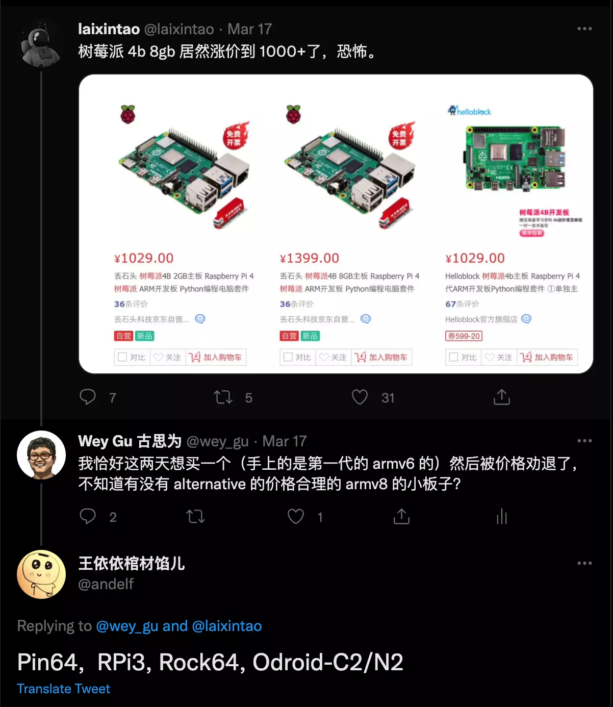
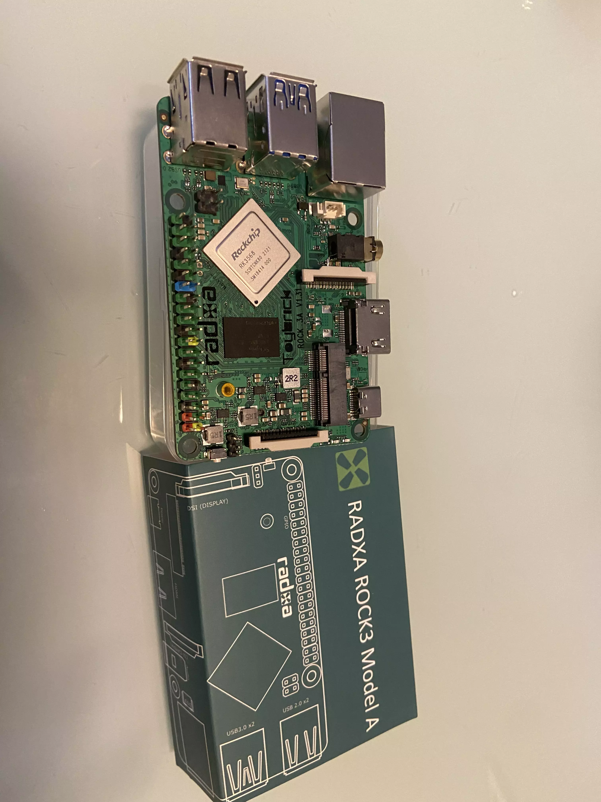
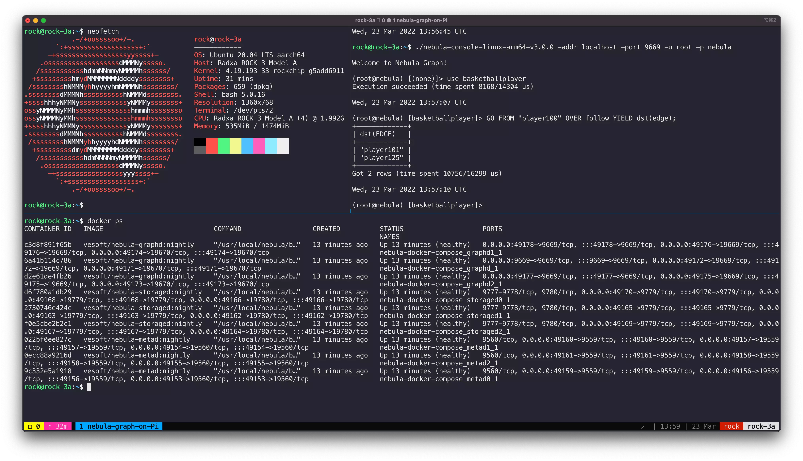

# Nebula Graph on Pi


> With the ARM64 Docker Image of Nebula Graph, it's actually quite easy to run it on SBC/Respberry Pi!

<!--more-->

## Background

Recently, after Yee from Nebula Graph Community fixed ARM build on [nebula-third-party#37](https://github.com/vesoft-inc/nebula-third-party/pull/37), we could play with Nebula Graph on M1 Chip Macbook. While, I didn't get the chance to run it on a SBC/Pi.

A couple of weeks before, in a twitter thread with [@laixintao](https://twitter.com/laixintao) and [@andelf](https://twitter.com/andelf/status/1504295476958404608) I decided to purchase a [Rock Pi 3A](https://wiki.radxa.com/Rock3/):



And it looks nice!(Even come with a NPU inside)



## The Guide of running Nebula Graph on a Pi SBC

> Actually, since v3.0.0, Nebula comes with a [standalone version](https://docs.nebula-graph.io/3.0.1/4.deployment-and-installation/standalone-deployment/), which suits the deep edge deployment more, but today, I will only setup the cluster version as the Docker Image is out of box to be used. I will share more on standalone version in upcoming weeks.

I put the Ubuntu Server installation steps in the appendix, and now I assumed we already have an ARM64 Linux up and running on a Pi SBC.

### Step 0, Install Docker-Compose on Pi

I am using debian/ubuntu here, while it should be the same for other distros, referring to https://docs.docker.com/engine/install/.

```bash
sudo apt-get update
sudo apt-get install \
    ca-certificates \
    curl \
    gnupg \
    lsb-release

echo \
  "deb [arch=$(dpkg --print-architecture) signed-by=/usr/share/keyrings/docker-archive-keyring.gpg] https://download.docker.com/linux/ubuntu \
  $(lsb_release -cs) stable" | sudo tee /etc/apt/sources.list.d/docker.list > /dev/null

sudo apt-get update
sudo apt-get install docker-ce docker-ce-cli containerd.io

# follow https://docs.docker.com/engine/install/linux-postinstall/
sudo groupadd docker
sudo usermod -aG docker $USER
exit
# login again
newgrp docker
```

After Docker being installed, we install compose here, there could be issues encounterred from the Docker website on Compose installation. While, due to compose is just a python package, let's do it via python3-pip install:

```bash
sudo apt-get install -y python3 python3-pip
sudo pip3 install docker-compose
```

### Step 1, bootstrap Nebula Graph Cluster on Pi

We clone the compose file for nebula cluster first:

```bash
git clone https://github.com/vesoft-inc/nebula-docker-compose.git && cd nebula-docker-compose
docker-compose up -d
```

Then, let's download the client: nebula-console, and connect to the GraphD service:

```bash
wget https://github.com/vesoft-inc/nebula-console/releases/download/v3.0.0/nebula-console-linux-arm64-v3.0.0
chmod +x nebula-console-linux-arm64-v3.0.0

./nebula-console-linux-arm64-v3.0.0 -addr localhost -port 9669 -u root -p nebula
```

Activate the storageD services:

```bash
ADD HOSTS "storaged0":9779,"storaged1":9779,"storaged2":9779;
SHOW HOSTS;
```

### Step 2, Play Nebula Graph on Pi

WIth the `SHOW HOSTS` we should see StorageD services are all ONLINE, then we could run this from the console session to load the test dataset.

> Referennce: https://docs.nebula-graph.io/3.0.1/nebula-console/#import_a_testing_dataset

```bash
$:play basketballplayer;
```

The test data will be loaded in around 1 minute. Then, we could query something like:

```bash
USE basketballplayer;

GO FROM "player100" OVER follow YIELD dst(edge);
```

Check this out and...

Happy Graphing!




## Appendix: Installing Ubuntu Server on Rock Pi 3A SBC

- Get the image from https://wiki.radxa.com/Rock3/downloads decompressing the file into `.img`

- Write the image to a micro SD card with [etcher]( https://www.balena.io/etcher/)
- Boot it!


> feature image credit: [@_louisreed](https://unsplash.com/@_louisreed)

