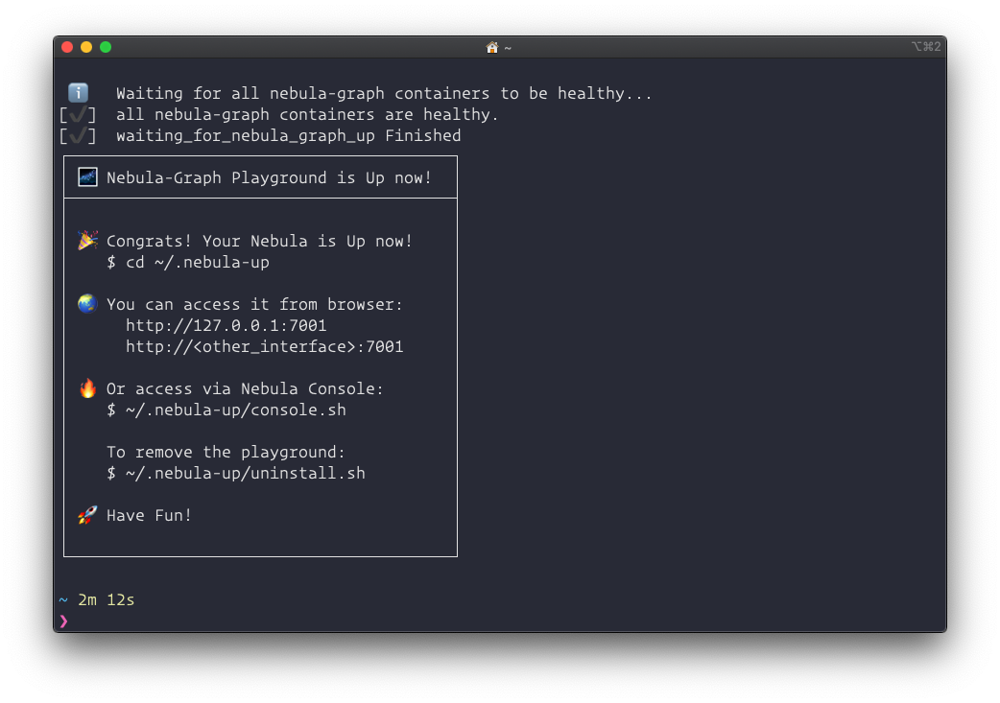

# Nebula-Up, oneliner installer for Nebula Graph Playground


> Update: the All-in-one mode is introduced! Check [here](#all-in-one-mode) and try it!

<!--more-->

[](https://asciinema.org/a/407151 "Nebula Up Demo")

`Nebula-Up` is PoC utility to enable developer to bootstrap an nebula-graph cluster with nebula-graph-studio(Web UI) + nebula-graph-console(Command UI) ready out of box in an oneliner run. All required packages will handled with `nebula-up` as well, including Docker on Linux(Ubuntu/CentOS), Docker Desktop on macOS(including both Intel and M1 chip based), and Docker Desktop Windows.

Also, it's optimized to leverage China Repo Mirrors(docker, brew, gitee, etc...) in case needed enable a smooth deployment for both Mainland China users and others.

macOS and Linux with Shell:

```bash
curl -fsSL nebula-up.siwei.io/install.sh | bash
```


Note: you could specify the version of Nebula Graph like:

```bash
curl -fsSL nebula-up.siwei.io/install.sh | bash -s -- v2.6
```

## All-in-one mode

With all-in-one mode, you could play with many Nebula Tools in one command, too:


Supported tools:
- [x] Nebula Dashboard
- [x] Nebula Graph Studio
- [x] Nebula Graph Console
- [x] Nebula BR(backup & restore)
- [x] Nebula Graph Spark utils
  - [x] Nebula Graph Spark Connector/PySpark
  - [x] Nebula Graph Algorithm
  - [x] Nebula Graph Exchange
- [ ] Nebula Graph Importer
- [ ] Nebula Graph Fulltext Search
- [ ] Nebula Bench

### Install all in one
```bash
# Install Nebula Core with all-in-one mode
curl -fsSL nebula-up.siwei.io/all-in-one.sh | bash
```

### Install Nebula Core and One of the coponent:
```bash
# Install Core with Backup and Restore with MinIO
curl -fsSL nebula-up.siwei.io/all-in-one.sh | bash -s -- v3 br
# Install Core with Spark Connector, Nebula Algorithm, Nebula Exchange
curl -fsSL nebula-up.siwei.io/all-in-one.sh | bash -s -- v3 spark
# Install Core with Dashboard
curl -fsSL nebula-up.siwei.io/all-in-one.sh | bash -s -- v3 dashboard
```

### How to play with all-in-one mode:

#### Console and Basketballplayer Dataset Loading
Then you could call Nebula Console like:
```bash
# Connect to nebula with console
~/.nebula-up/console.sh
# Execute queryies like
~/.nebula-up/console.sh -e "SHOW HOSTS"
# Load the sample dataset
~/.nebula-up/load-basketballplayer-dataset.sh
# Make a Graph Query the sample dataset
~/.nebula-up/console.sh -e 'USE basketballplayer; FIND ALL PATH FROM "player100" TO "team204" OVER * WHERE follow.degree is EMPTY or follow.degree >=0 YIELD path AS p;'
```
#### Monitor the whole cluster with Nebula Dashboard

Visit http://127.0.0.1:7003 with user: `root`, password: `nebula`.

> Note, thanks to the sponsorship of Microsoft, we have a demo site of Nebula-UP on Azure: you could visit the dashboard here: http://nebula-demo.siwei.io:7003 .
#### Access Nebula Graph Studio

Visit http://127.0.0.1:7001 with user: `root`, password: `nebula`, host: `graphd:9669`(for non-all-in-one case, this should be `<host-ip>:9669`).

> Note, thanks to the sponsorship of Microsoft, we have a demo site of Nebula-UP on Azure: you could visit the studio here: http://nebula-demo.siwei.io:7001 .

#### Query Data with Nebula Spark Connector in PySpark Shell

Or play in PySpark like:
```bash
~/.nebula-up/nebula-pyspark.sh

# call Nebula Spark Connector Reader
df = spark.read.format(
  "com.vesoft.nebula.connector.NebulaDataSource").option(
    "type", "vertex").option(
    "spaceName", "basketballplayer").option(
    "label", "player").option(
    "returnCols", "name,age").option(
    "metaAddress", "metad0:9559").option(
    "partitionNumber", 1).load()

# show the dataframe with limit 2
df.show(n=2)
```

The output may look like:

```python
      ____              __
     / __/__  ___ _____/ /__
    _\ \/ _ \/ _ `/ __/  '_/
   /__ / .__/\_,_/_/ /_/\_\   version 2.4.5
      /_/

Using Python version 2.7.16 (default, Jan 14 2020 07:22:06)
SparkSession available as 'spark'.
>>> df = spark.read.format(
...   "com.vesoft.nebula.connector.NebulaDataSource").option(
...     "type", "vertex").option(
...     "spaceName", "basketballplayer").option(
...     "label", "player").option(
...     "returnCols", "name,age").option(
...     "metaAddress", "metad0:9559").option(
...     "partitionNumber", 1).load()
>>> df.show(n=2)
+---------+--------------+---+
|_vertexId|          name|age|
+---------+--------------+---+
|player105|   Danny Green| 31|
|player109|Tiago Splitter| 34|
+---------+--------------+---+
only showing top 2 rows
```

#### Run Nebula Exchange

Or run an example Nebula Exchange job to import data from CSV file:
```bash
~/.nebula-up/nebula-exchange-example.sh
```
You could check the example configuration file in `~/.nebula-up/nebula-up/spark/exchange.conf`

#### Run Nebula Graph Algorithm

> Reference: https://github.com/wey-gu/nebula-livejournal

Load LiveJournal dataset with Nebula Importer:

```bash
~/.nebula-up/load-LiveJournal-dataset.sh
```

Run Nebula Algorithm like:

```bash
~/.nebula-up/nebula-algo-pagerank-example.sh
```


#### Try Backup and Restore with MinIO as Storage

```bash
# Create a full backup to MinIO(Be sure to run load-basketballplayer-dataset.sh before doing so)
~/.nebula-up/nebula-br-backup-full.sh
# Show all backups
~/.nebula-up/nebula-br-show.sh
# Restore to a backup named BACKUP_2022_05_08_11_38_08
~/.nebula-up/nebula-br-restore-full.sh BACKUP_2022_05_08_11_38_08
```

Note, you could also browser files in MinIO with from http://127.0.0.1:9001 with user: `minioadmin`, password: `minioadmin`.

> Note, thanks to the sponsorship of Microsoft, we have a demo site of Nebula-UP on Azure: you could visit the MinIO site here: http://nebula-demo.siwei.io:9001 .

--------------------------------------------

~~Windows with PowerShell~~(Working In Progress):

```powershell
iwr nebula-up.siwei.io/install.ps1 -useb | iex
```

TBD:
- [ ] Finished Windows(Docker Desktop instead of the WSL 1&2 in initial phase) part, leveraging chocolatey package manager as homebrew was used in macOS
- [ ] Fully optimized for CN users, for now, git/apt/yum repo were not optimised, newly installed docker repo, brew repo were automatically optimised for CN internet access
- [ ] Packaging similar content into homebrew/chocolatey?
- [ ] CI/UT


