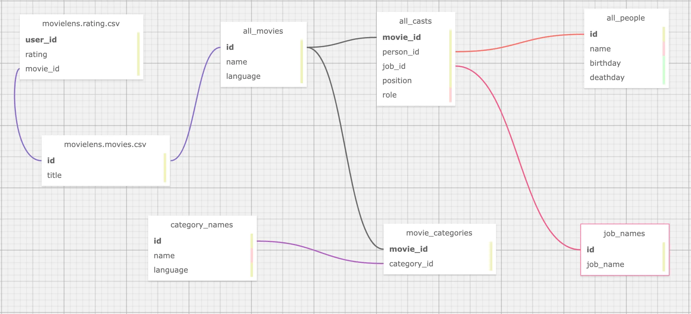

# Tabular Data ETL to NebulaGraph with dbt


> How could we model data in Tabular sources and ETL it to NebulaGraph? This article demonstrates an end-to-end example of doing so with dbt.

<!--more-->

<!--

[TOC]

-->

## Task

Imagine we are building a Knowledge Graph for a content provider web service with NebulaGraph, thus leveraging it to support a Knowledge Base QA system, Recommendation System, and Reasoning system.

The knowledge information persisted in different data sources from some Service APIs, Databases, Data Warehouses, or even some files in S3.

We need to:

- Analyze data to extract needed knowledge
- Model the Graph based on relationships we care
- Extract the relationships and ingest them to NebulaGraph

## Data Analysis

Assume that we are fetching data from [OMDB](https://www.omdb.org/en/us/content/Help:DataDownload) and [MovieLens](https://grouplens.org/datasets/movielens/).

OMDB is an open movie database, we now think of it as one of our services, and we can get the following information.

- Movies
- Classification of movies
- The crew in the movie (director, action director, actors, post-production, etc.)
- Movie covers, promos, etc.

MovieLens is an open dataset, we consider it as the user data of our services, the information we can obtain is:

- Users
- Movies
- User interaction on movie ratings


## Graph Modeling

We were building this Graph for a recommendation system and talked about some basic methods in [this](siwei.io/recommendation-system-with-graphdb/) article, which:

In the Content-Base Filter method(CBF), the relationship of user-> movie, movie-> category, movie-> actor, and movie-> director are concerned.

And the collaborative filtering approach is concerned with the relationship between the user and -> movie.

The recommendation reasoning service is concerned with all the above relationships.

To summarize, we need the following edges:

- watched(rate(double))
- with_genre
- directed_by
- acted_by

Accordingly, the vertex types will be:

- user(user_id)
- movie(name)
- person(name, birthdate)
- genre(name)


## Data Transform

With the source date finalized, let's see how they could be mapped and transformed into the graph.

### From OMDB

First, there is the data in OMDB, which consists of many tables, such as the table `all_movies`, which stores all the movies and their names in different languages.

| movie_id | name                           | language_iso_639_1 | official_translation |
| -------- | ------------------------------ | ------------------ | -------------------- |
| 1        | Cowboy Bebop                   | de                 | 1                    |
| 1        | Cowboy Bebop                   | en                 | 1                    |
| 2        | Ariel - Abgebrannt in Helsinki | de                 | 0                    |
| 3        | Shadows in Paradise            | en                 | 0                    |
| 3        | Im Schatten des Paradieses     | de                 | 0                    |
| 3        | Schatten im Paradies           | de                 | 1                    |

And the `all_casts` table holds all roles in the film industry.

| movie_id | person_id | job_id | role           | position |
| -------- | --------- | ------ | -------------- | -------- |
| 11       | 1         | 21     |                | 1        |
| 11       | 1         | 13     |                | 1        |
| 11       | 2         | 15     | Luke Skywalker | 1        |
| 11       | 3         | 15     | Han Solo       | 3        |
| 11       | 4         | 15     | Leia Organa    | 2        |

But the name and other information of each person here, as well as the position he/she holds in the film, are in separate tables.

- `job_names`

  For example, 1 stands for writer, and 2 stands for producer. Interestingly, like movie id and name, job_id to name is a one-to-many relationship, because the data in OMDB is multilingual.

| job_id | name                      | language_iso_639_1 |
| ------ | ------------------------- | ------------------ |
| 1      | Autoren                   | de                 |
| 1      | Writing Department        | en                 |
| 1      | Departamento de redacción | es                 |
| 1      | Département écriture      | fr                 |
| 1      | Scenariusz                | pl                 |
| 2      | Produzenten               | de                 |
| 2      | Production Department     | en                 |

- `all_people`

| id   | name            | birthday   | deathday   | gender |
| ---- | --------------- | ---------- | ---------- | ------ |
| 1    | George Lucas    | 1944-05-14 | \N         | 0      |
| 2    | Mark Hamill     | 1951-09-25 | \N         | 0      |
| 3    | Harrison Ford   | 1942-07-13 | \N         | 0      |
| 4    | Carrie Fisher   | 1956-10-21 | 2016-12-27 | 1      |
| 5    | Peter Cushing   | 1913-05-26 | 1994-08-11 | 0      |
| 6    | Anthony Daniels | 1946-02-21 | \N         | 0      |

This is a typical case in RDBMS where the data source is a table structure, so for the relationship `movie <-[directed_by]-(person)`, it involves four tables `all_movies`, `all_casts`, `all_people`, `job_names`:

- directed_by
  - Starting from person_id in all_casts
  - To movie_id in all_casts
    - Where job_id is "director" in job_names
- movie
  - person_id in all_casts
  - Name from all_movies by id, language is "en"
- person
  - movie_id in all_casts
  - Name, birthday in all_people

Till now, all tables we cared about in OMDB are:


### From MovieLens dataset

While the above is just about one data source, in real scenarios, we also need to collect and aggregate data from other sources. For example, now also need to extract knowledge from the MovieLens dataset.

Here, the only relationship we utilize is `user -> movie`.

- `movies.csv`

| movieId | title                    | genres    |
| ------- | ------------------------ | --------- |
| 1       | Toy Story (1995)         | Adventure |
| 2       | Jumanji (1995)           | Adventure |
| 3       | Grumpier Old Men (1995)  | Comedy    |
| 4       | Waiting to Exhale (1995) | Comedy    |

- `ratings.csv`

| userId | movieId | rating | timestamp |
| ------ | ------- | ------ | --------- |
| 1      | 1       | 4      | 964982703 |
| 1      | 3       | 4      | 964981247 |
| 1      | 6       | 4      | 964982224 |

From the preview of the data in the two tables, naturally, we need one type of relationship: `watched` and vertex: `user`:

- watched
  - Starting from the userId in `ratings.csv`
  - To movieId in `ratings.csv`
  - With rating from rating in `ratings.csv`
- user
  - With userId from `ratings.csv`

However, you must have noticed that movieId in the MovieLens dataset and movie id in OMDB are two different systems, if we need to associate them, we need to convert movieId in MovieLens to movie id in OMDB, and the condition of association between them is a movie title.

However, by observation, we know that:

1. the titles in OMDB movies are multilingual
2. the titles in MovieLens have the year information like `(1995)` at the end of the title

So our conclusion is

- watched
  - Starting from the userId in `ratings.csv`
  - To movieId in `ratings.csv`
    - Get the movie title with movieId from `movies.csv` and find its movie_id from OMDB
      - Where we should match the title in language: English with the suffix of the year being removed
  - With rating from rating in `ratings.csv`
- user
  - With userId from `ratings.csv`

Now the modeling puts the two tables like this figure:



### Graph Modeling (Property Graph)

To summarize, we need to aggregate different tables (or CSV files in table form) from multiple data sources, such that the correspondence is shown in the figure: where the blue dashed line indicates the source of data information for the vertices in the graph, and the pink dashed line indicates the source of edge information.


Then, we have to format the ids of individuals in different tables, for example, user_id, which is a self-incrementing number that we want to convert to a globally unique vertex_id. A convenient way to do this is to add a string prefix to the existing id, such as `u_`.

Eventually, for the relationship `user -[watched]-> movie`, we can process the table structure data as follows.

| user_id | rating | title                              | omdb_movie_id |
| ------- | ------ | ---------------------------------- | ------------- |
| u_1     | 5      | Seven (a.k.a. Se7en)               | 807           |
| u_1     | 5      | Star Wars: Episode IV - A New Hope | 11            |
| u_1     | 5      | Star Wars: Episode IV - A New Hope | 10            |
| u_1     | 4      | Mask, The                          | 832           |
| u_1     | 3      | Mrs. Doubtfire                     | 832           |

Where, in each row, three variables exist to construct the graph structure:

- `user` vertex id
- `movie` vertex id
- the rating value as the property of the `watched` edge


## Tooling
At this point, we have completed the data analysis and graph modeling design, before we start the "extract correlations, import graph database", let's introduce the tools we will use.

"Extracting relationships" can be simply considered as Extract and Transform in ETL, which is essentially the engineering of data mapping and transformation, and there are many different tools and open-source projects available on the market. Here we use one of my personal favorite tools: dbt.

### dbt

dbt is an open-source data conversion tool with a very mature community and ecology, which can perform efficient, controlled, and high-quality data conversion work in most of the mainstream data warehouses, whether it is for ad-hoc tasks or complex orchestration, dbt can be very competent.

One of the features of dbt is that it uses a SQL-like language to describe the rules of data transformation. With GitOps, it is very elegant to collaborate and maintain complex data processing operations in large data teams. And the built-in data testing capabilities allow you to control the quality of your data and make it reproducible and controllable.

dbt not only has many integrated subprojects but also can be combined with many other excellent open source projects (meltano, AirFlow, Amundsen, Superset, etc.) to form a set of modern data infrastructure systems, feel free to check my previous article: data lineage and metadata governance reference architecture https://siwei.io/en/data-lineage-oss-ref-solution, where the whole solution looks like:


In short, dbt is a command line tool written in python, and we can create a project folder, which contains a YAML formatted configuration file, to specify where the source information for the data transformation is and where the target is (where the processed data is stored, maybe Postgres, Big Query, Spark, etc.). In the data source, we use the YAML file along with the `.SQL` file to describe the information about "what data to fetch from, how to do the transformation, and what to output".


You can see that the information in the models/example is the core data transformation rules, and all the other data is metadata related to this transformation. DataOps.

> Notes.
>
> You can refer to the dbt documentation to get a hands-on understanding of it: https://docs.getdbt.com/docs/get-started/getting-started-dbt-core

### NebulaGraph data ingestion

After processing the data by dbt, we can get intermediate data that maps directly to different types of vertices, edges, and table structures of their attributes, either in the form of CSV files, tables in DWs, or even data frames in Spark, and there are different options for importing them into NebulaGraph, of which NebulaGraph Exchange, Nebula-Importer, and Nebula-Spark-Connector can be used to import the data.

> Notes.
>
> You can learn more about the different tools for NebulaGraph data import at https://siwei.io/en/sketches/nebula-data-import-options to know how to choose one of them c.

Here, I will use the simplest one, Nebula-Importer, as an example.

Nebula-Importer is an open-source tool written in Golang that compiles into a single file binary, it gets the correspondence of vertices and edges from a given CSV file to a NebulaGraph for reading and importing via a preconfigured YAML format file.

> Notes.
>
> Nebula-Importer code: https://github.com/vesoft-inc/nebula-importer/
>
> Nebula-Importer documentation: https://docs.nebula-graph.io/master/nebula-importer/use-importer/


## dbt + Nebula-Importer in Actions

Now let's use dbt + Nebula-Importer to end-to-end demonstrate how to extract, transform and import multiple data sources into NebulaGraph, the whole project code has been open-sourced, the repository is at https://github.com/wey-gu/movie-recommendation-dataset, feel free to check for details there.

The whole process is as follows.

- Preprocess and import raw data into the data warehouse(EL)
- Use dbt to transform the data (Transform), and export it to CSV files
- Import CSV into NebulaGraph using Nebula Importer (L)


### Preparing the dbt environment

dbt is a python project, we install dbt and dbt-postgres in a virtual python3 environment.

### Setup env with dbt

dbt is written in python, we could install it in a python virtual env, together with dbt-Postgres, as we will use Postgres as the DW in this sample project.

```bash
python3 -m venv .venv
source .venv/bin/activate
pip install dbt-postgres
```

Create a dbt project:

```bash
dbt init dbt_project
cd dbt_project
```

Let's see the files in this project:

```bash
$ tree .
.
|-- README.md                      # README of the project
|-- analyses
|-- dbt_project.yml                # dbt project conf
|-- macros
|-- models                         # transforms
|   \-- example
|       |-- my_first_dbt_model.sql # meta data to describe transform rules from the source data with SELECT
|       |-- my_second_dbt_model.sql
|       \-- schema.yml             # the meta data of the rules
|-- seeds                          # for CSV-file data sources
|-- snapshots
\-- tests

7 directories, 5 files
```

Finally, let's bootstrap a Postgress as the DW, if you already have one, you may skip this step, please ensure the configurations and dbt-plugins are aligned if you chose to use your own DW.

```bash
docker run --rm --name postgres \
    -e POSTGRES_PASSWORD=nebula \
    -e POSTGRES_USER=nebula \
    -e POSTGRES_DB=warehouse -d \
    -p 5432:5432 postgres
```

### Data download and preprocess

Let's create a folder named `raw_data` and change the directory to it.

```bash
mkdir -p raw_data
cd raw_data
```

And we assumed it was under our dbt project:

```bash
tree ..
..
|-- README.md
|-- analyses
|-- dbt_project.yml
|-- macros
|-- models
|   \-- example
|       |-- my_first_dbt_model.sql
|       |-- my_second_dbt_model.sql
|       \-- schema.yml
|-- raw_data                       # <--- newly created data
|-- seeds
|-- snapshots
\-- tests

8 directories, 5 files
```

Download and decompress the OMDB data:

```bash
wget www.omdb.org/data/all_people.csv.bz2
wget www.omdb.org/data/all_people_aliases.csv.bz2
wget www.omdb.org/data/people_links.csv.bz2
wget www.omdb.org/data/all_casts.csv.bz2
wget www.omdb.org/data/job_names.csv.bz2
wget www.omdb.org/data/all_characters.csv.bz2
wget www.omdb.org/data/movie_categories.csv.bz2
wget www.omdb.org/data/movie_keywords.csv.bz2
wget www.omdb.org/data/category_names.csv.bz2
wget www.omdb.org/data/all_categories.csv.bz2
wget www.omdb.org/data/all_movie_aliases_iso.csv.bz2
bunzip2 *.bz2
```

Then for the MovieLens dataset:

```bash
wget https://files.grouplens.org/datasets/movielens/ml-latest-small.zip
unzip ml-latest-small.zip
rm *.zip
```

Before we do the Transform with dbt, we do some simple preprocess and then put them under `seeds`:

```bash
grep -v '\\"' raw_data/all_movie_aliases_iso.csv > seeds/all_movie_aliases_iso.csv
grep -v '\\"' raw_data/all_casts.csv > seeds/all_casts.csv
grep -v '\\"' raw_data/all_characters.csv > seeds/all_characters.csv
grep -v '\\"' raw_data/all_people.csv > seeds/all_people.csv
grep -v '\\"' raw_data/category_names.csv > seeds/category_names.csv
grep -v '\\"' raw_data/job_names.csv > seeds/job_names.csv
cp raw_data/movie_categories.csv seeds/movie_categories.csv
cp raw_data/movie_keywords.csv seeds/movie_keywords.csv
cp raw_data/all_categories.csv seeds/all_categories.csv
cp raw_data/ml-latest-small/ratings.csv seeds/movielens_ratings.csv
cp raw_data/ml-latest-small/movies.csv seeds/movielens_movies.csv
```

With the above files being placed, we could load them into DW in one command:

> Refer to the documentation of dbt `seeds` https://docs.getdbt.com/docs/build/seeds

```bash
dbt seed
```

It may take a while if you like me are using a local Postgres, and it should be faster in production-level cases (i.e. load to Big Query from the file in Cloud Storage), it should be like this:

```bash
$ dbt seed
05:58:27  Running with dbt=1.3.0
05:58:27  Found 2 models, 4 tests, 0 snapshots, 0 analyses, 289 macros, 0 operations, 11 seed files, 0 sources, 0 exposures, 0 metrics
05:58:28  
05:58:28  Concurrency: 8 threads (target='dev')
05:58:28  
05:58:28  1 of 11 START seed file public.all_casts ....................................... [RUN]
...
07:10:11  1 of 11 OK loaded seed file public.all_casts ................................... [INSERT 1082228 in 4303.78s]
07:10:11  
07:10:11  Finished running 11 seeds in 1 hours 11 minutes and 43.93 seconds (4303.93s).
07:10:11  
07:10:11  Completed successfully
07:10:11  
07:10:11  Done. PASS=11 WARN=0 ERROR=0 SKIP=0 TOTAL=11
```

### Compose the Transform model

We create transform under `models`:

```bash
mkdir models/movie_recommedation
touch models/movie_recommedation/user_watched_movies.sql
touch models/movie_recommedation/schema.yml
```

The files are like this:

```bash
$ tree models
models
\-- movie_recommedation
    |-- user_watched_movies.sql
    \-- schema.yml
```

Now there is only one transform rule under this model: to handle the edge of `user_watched_movies` in the `user_watched_movies.sql`

As we planned to output three columns: user_id, movie_id, rating, thus the `schema.yml` is like:

```yaml
version: 2

models:
  - name: user_watched_movies
    description: "The edges between users and movies they have watched"
    columns:
      - name: user_id
        description: "user id"
        tests:
          - not_null
      - name: movie_id
        description: "movie id"
        tests:
          - not_null
      - name: rating
        description: "rating given by user to movie"
        tests:
          - not_null
```

Please be noted the `tests` are about the validation and constraint of the data, with which, we could control the data quality quite easily. And here `not_null` ensures there is no NULL if tests are performed.

Then, let's compose the `user_watched_movies.sql`:

```sql
{{ config(materialized='table') }}

/*
 JOIN the movieielens_ratings table with the movieielens_movies table, and removing the movie title tailing the year of release
 */
WITH user_watched_movies AS(
    SELECT moveielens_ratings."userId",
        moveielens_ratings."movieId",
        moveielens_ratings.rating,
        REGEXP_REPLACE(moveielens_movies.title, ' \(\d{4}\)$', '') AS title,
        moveielens_movies.genres AS movielens_genres
    FROM moveielens_ratings
        JOIN moveielens_movies ON moveielens_movies."movieId" = moveielens_ratings."movieId"
)
/* 
 JOIN user_watched_movies table with all_movie_aliase_iso table where language is English
 the join condition is the movie title
 */
SELECT concat('u_',user_watched_movies."userId") AS user_id,
    user_watched_movies.rating,
    user_watched_movies.title,
    all_movie_aliases_iso."movie_id" AS OMDB_movie_id,
    user_watched_movies.movielens_genres
FROM user_watched_movies
    JOIN all_movie_aliases_iso ON user_watched_movies.title LIKE CONCAT(all_movie_aliases_iso.name, '%')
    AND all_movie_aliases_iso.language_iso_639_1 = 'en'
```

And what this SQL does is the part marked by the green circle:

- Select the user id, movie id, rating, and movie title (remove the year part) from `moveielens_ratings` and save it as the intermediate table of `user_watched_movies`
   - movie title is `JOIN`ed from `moveielens_movies`, obtained by the same matching condition as `movie_id`
- Select user id (prefix `u_`), rating, title, OMDB_movie_id from `user_watched_movies`
   - OMDB_movie_id is `JOIN`ed from `all_movie_aliases_iso`, obtained by matching the Chinese and English titles of OMDB movies with similar movie names
   - output the final fields


> Tips: we could add `LIMIT` to debug the SQL query fast from a Postgres Console

Then we could run it from dbt to transform and test the rule:

```bash
dbt run -m user_watched_movies
```

After that, we should be able to see a table after the Transform in Postgres (DW).

Similarly, following the same method for all other parts of the Transform rules, we could have other models:

```bash
$ tree models
models
\-- movie_recommedation
    |-- acted_by.sql
    |-- directed_by.sql
    |-- genres.sql
    |-- movies.sql
    |-- people.sql
    |-- schema.yml
    |-- user_watched_movies.sql
    \-- with_genre.sql
```

Then run them all:

```bash
dbt run -m acted_by
dbt run -m directed_by
dbt run -m with_genre
dbt run -m people
dbt run -m genres
dbt run -m movies
```

### Export data to CSV

NebulaGraph Exchange itself supports directly importing many data sources (Postgres, Clickhouse, MySQL, Hive, etc.) into NebulaGraph, but in this example, the amount of data we process is very small for NebulaGraph, so we just go with the most lightweight one: Nebula-Importer. Nebula-Importer can only CSV files, so we are doing so.

First, we enter the Postgres console and execute the `COPY` command

> Refer to Postgres documentation: https://www.postgresql.org/docs/current/sql-copy.html

```sql
COPY acted_by TO '/tmp/acted_by.csv'  WITH DELIMITER ',' CSV HEADER;
COPY directed_by TO '/tmp/directed_by.csv'  WITH DELIMITER ',' CSV HEADER;
COPY with_genre TO '/tmp/with_genre.csv'  WITH DELIMITER ',' CSV HEADER;
COPY people TO '/tmp/people.csv'  WITH DELIMITER ',' CSV HEADER;
COPY movies TO '/tmp/movies.csv'  WITH DELIMITER ',' CSV HEADER;
COPY genres TO '/tmp/genres.csv'  WITH DELIMITER ',' CSV HEADER;
-- for user_watched_movies, we don't output HEADER, as we will parse it in importer in a no-header way.
COPY user_watched_movies TO '/tmp/user_watched_movies.csv'  WITH DELIMITER ',' CSV;
```

Then copy the CSV files into `to_nebulagraph`

```bash
mkdir -p to_nebulagraph
docker cp postgres:/tmp/. to_nebulagraph/
```

### Ingest data into NebulaGraph

#### Bootstrap a NebulaGraph cluster

We can use Nebula-Up to have a NebulaGraph playground cluster with the oneliner.

> Note:
>
> - Nebula-UP: https://github.com/wey-gu/nebula-up
>
> - Dataset repository: https://github.com/wey-gu/movie-recommendation-dataset

```bash
curl -fsSL nebula-up.siwei.io/install.sh | bash
```

#### Define the Data Schema


First, we need to create a graph space, and then create tag(type of vertex) and edge type on it:

Access the Nebula-Console(CLI client for NebulaGraph):

```bash
~/.nebula-up/console.sh
```

Run the following DDL(Data Definition Language):

```sql
CREATE SPACE moviegraph(partition_num=10,replica_factor=1,vid_type=fixed_string(32));
:sleep 20
USE moviegraph;
CREATE TAG person(name string, birthdate string);
CREATE TAG movie(name string);
CREATE TAG genre(name string);
CREATE TAG user(user_id string);
CREATE EDGE acted_by();
CREATE EDGE directed_by();
CREATE EDGE with_genre();
CREATE EDGE watched(rate float);
exit
```

#### Create a Nebula-Importer conf file

This conf is a YAML file that describes the correspondence between the CSV file and the vertex or edge data in the cluster.

Please refer to the document: https://docs.nebula-graph.io/master/nebula-importer/use-importer/ for details.

I already created one for it, which can be downloaded at https://github.com/wey-gu/movie-recommendation-dataset/blob/main/nebula-importer.yaml.

Here, we will directly download the configuration file.

> Note that this file should not be part of the dbt project file.:

```bash
cd ..
wget https://raw.githubusercontent.com/wey-gu/movie-recommendation-dataset/main/nebula-importer.yaml
```

#### Ingesting the data

Let's use the Nebula-Importer in docker to avoid any installation:

```bash
docker run --rm -ti \
    --network=nebula-net \
    -v ${PWD}:/root/ \
    -v ${PWD}/dbt_project/to_nebulagraph/:/data \
    vesoft/nebula-importer:v3.2.0 \
    --config /root/nebula-importer.yaml
```
After it's executed, all data are in NebulaGraph, and we could check the data from Nebula-Console:

First, access the console again:

```bash
~/.nebula-up/console.sh
```

Enter the graph space and execute `SHOW STATS`

```SQL
USE moviegraph;
SHOW STATS;
```

The result should be like this:

```SQL
(root@nebula) [moviegraph]> SHOW STATS;
+---------+---------------+---------+
| Type    | Name          | Count   |
+---------+---------------+---------+
| "Tag"   | "genre"       | 14397   |
| "Tag"   | "movie"       | 20701   |
| "Tag"   | "person"      | 263907  |
| "Tag"   | "user"        | 610     |
| "Edge"  | "acted_by"    | 673763  |
| "Edge"  | "directed_by" | 101949  |
| "Edge"  | "watched"     | 31781   |
| "Edge"  | "with_genre"  | 194009  |
| "Space" | "vertices"    | 299615  |
| "Space" | "edges"       | 1001502 |
+---------+---------------+---------+
Got 10 rows (time spent 1693/15136 us)
```

With Nebula-Studio, we can also explore this graph in the visual interface, for example, by executing this query, we could see the reason why it recommended the movie with id 1891 to the user with id u_124.

```SQL
FIND NOLOOP PATH FROM "u_124" TO "1891" over * BIDIRECT UPTO 4 STEPS yield path as `p` | LIMIT 20
```

The result could be: Most of the cast and crew of the once-favorite Star Wars movies are also involved in this and the same "Oscar-winning" and "classic" movie.


> In another article, I used the same graph to demonstrate the application of more graph databases and graph algorithms in recommendation systems. If you are interested, please read https://siwei.io/recommendation-system-with-graphdb/.


## Summary

When we plan to leverage graph databases for massive data to transform knowledge and analyze insights, the first step is often to transform, process, and model multiple data sources into graph data. For beginners who have no idea where to start, a feasible idea is to start from all relevant information, picture the most concerning relationship, and then list the vertices that can be obtained and the required properties attached. After determining the initial modeling, you can use the ETL tool to clean the original data, ETL into table structure which will be mapped to the graph, and finally, use the import tool to import NebulaGraph for further model iterations.

With the help of dbt, we can version control, test, iterate our modeling and data transformation, and gradually evolve and enrich the constructed knowledge graph with grace.

> Feature image credit: [Claudio](https://unsplash.com/photos/Bu4lHKIHr-E)

