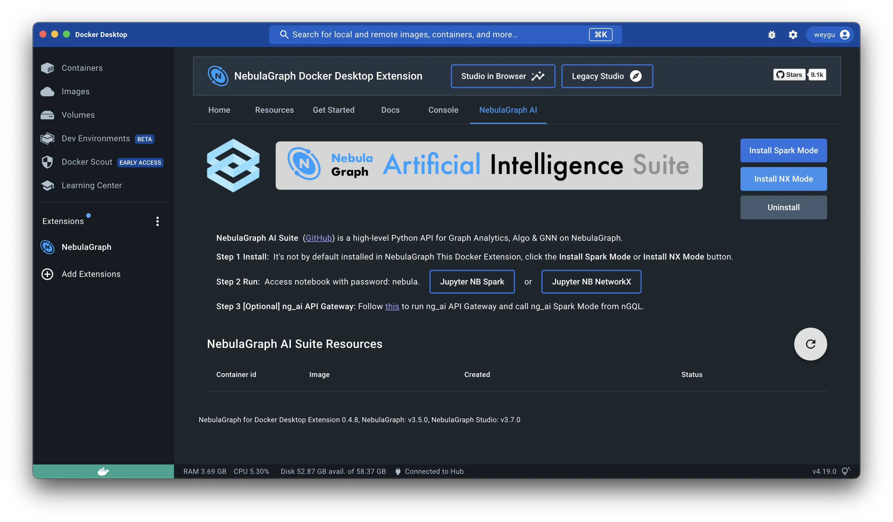
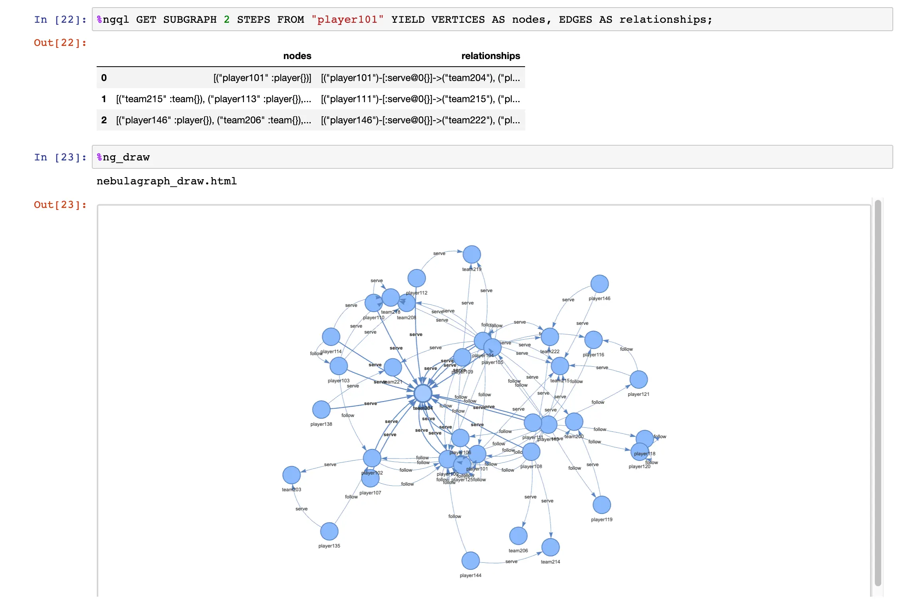
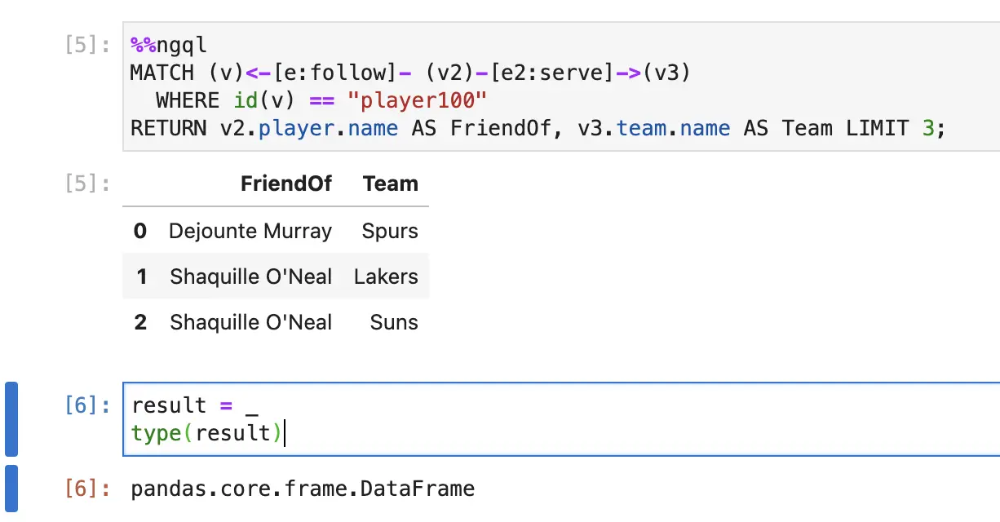
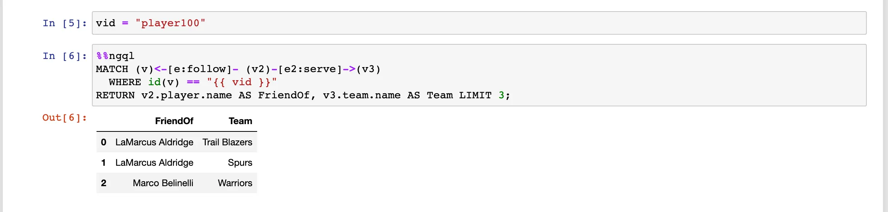

# NebulaGraph in Jupyter Notebook


> Introduce the brand new `ipython-ngql` python package that enhances your ability to connect to NebulaGraph from your Jupyter Notebook or iPython. Now we can do`%ngql MATCH p=(n:player)->() RETURN p`  to query from Jupyter Notebook and `%ng_draw` to render the result.

<!--more-->

[Chinese version](https://www.siwei.io/nebulagraph-in-jupyter-notebook/)

## Installation

Just do `%pip install ipython-ngql` from  Jupyter Notebook and load it up via `%load_ext ngql`:

```python
%pip install ipython-ngql
%load_ext ngql
```

Then, connect the NebulaGraph with a line like this:

```python
%ngql --address 127.0.0.1 --port 9669 --user root --password nebula
```

When connected, the cell will have an output of `SHOW SPACES`.

> 💡 Note, you could install NebulaGraph dev env from [Docker Desktop Extension Marketplace](https://hub.docker.com/extensions/weygu/nebulagraph-dd-ext) and literally have it ready [with one click](https://www.docker.com/blog/distributed-cloud-native-graph-database-nebulagraph-docker-extension/). Then, within the extension, go to "NebulaGraph AI" and click  **Install NX Mode** to install NebulaGraph + Jupyter Notebook local dev env.
>
> 

## Query NebulaGraph

We could then do one-liner query with `%ngql` or multi-line query with `%%ngql`.

### One-liner query

For instance:

```
%ngql USE basketballplayer;
%ngql MATCH (v:player{name:"Tim Duncan"})-->(v2:player) RETURN v2.player.name AS Name;
```

### Multi-line query

For instance

```python
%%ngql
ADD HOSTS "storaged3":9779,"storaged4":9779;
SHOW HOSTS;
```

## Draw the result

After any query result, we could render it visually with `%ng_draw`:

```python
# one query
%ngql GET SUBGRAPH 2 STEPS FROM "player101" YIELD VERTICES AS nodes, EDGES AS relationships;
%ng_draw

# another query
%ngql match p=(:player)-[]->() return p LIMIT 5
%ng_draw
```

And it'll look like:



And the renderred result will be in [a single-file html](https://github.com/wey-gu/ipython-ngql/blob/main/examples/nebulagraph_draw_match.html), which could be embeded in web pages like:

<iframe src="nebulagraph_draw_match.html" style="height:500px;width:800px" title="Graph"></iframe>

## Other functionality

We could query  `%ngql help`  to know more details of options for ipython-ngql. Here also introudce you some small features.

### Get the pandas df query result

The result could be read from `_` like:




### Play with ResultSet result instead

By default, the return result is pandas df, but we could configure it as `raw` to enable debugging for Python NebulaGraph Application code on query result handling, like:

```python
In [1] : %config IPythonNGQL.ngql_result_style="raw"

In [2] : %%ngql USE pokemon_club;
    ...: GO FROM "Tom" OVER owns_pokemon YIELD owns_pokemon._dst as pokemon_id
    ...: | GO FROM $-.pokemon_id OVER owns_pokemon REVERSELY YIELD owns_pokemon._dst AS Trainer_Name;
    ...:
    ...:
Out[3]:
ResultSet(ExecutionResponse(
    error_code=0,
    latency_in_us=3270,
    data=DataSet(
        column_names=[b'Trainer_Name'],
        rows=[Row(
            values=[Value(
                sVal=b'Tom')]),
...
        Row(
            values=[Value(
                sVal=b'Wey')])]),
    space_name=b'pokemon_club'))

In [4]: r = _

In [5]: r.column_values(key='Trainer_Name')[0].cast()
Out[5]: 'Tom'
```


### Query Template

Besides, I brought the template support in [Jinja2](https://jinja.palletsprojects.com/), thus we could do varibales like `{{ variable }}` :



## Future

I am planning to add more options on the `%ng_draw` in the future, and it's always welcome for your help to contribute more from https://github.com/wey-gu/ipython-ngql.

