# Social Network with NebulaGraph


> How NebulaGraph helps build social network systems.

<!--more-->

<!--

[TOC]

-->

This blog was origianlly posted on [NebulaGraph Blog](https://www.nebula-graph.io/posts/social-networks-with-graph-database-1).

Social networks are no stranger to everyone, whether it's Facebook, Twitter, Youtube, or services such as Yelp, Quora, Reddit, etc., the essence of their users has formed social networks.

In a social network system, we can use a graph database to represent users and their connection relationships. Graph databases allow efficient querying of relationships between users, making various business implementations on social networks based on connection findings, statistics, and analysis feasible and efficient.

For example, graph databases can be used to identify "influential users" in a network, to recommend new connections (friendships, content of interest) based on commonalities between users, or to find different groups of people and communities in a community to profile users. Graph databases are ideal for social networking systems where user relationships are constantly changing because they can support complex multi-hop queries and also real-time writes and updates.

## Graph Modeling

To showcase the SNS graph use cases, I'll build most of the examples on a typically small social network, I started by adding extra data on top of the NebulaGraph default dataset, basketballplayer:

Three new tags of vertices:

- address
- place
- post

Five new types of edges:

- created_post
- commented_at
- lived_in
- belong_to

It looks like this:

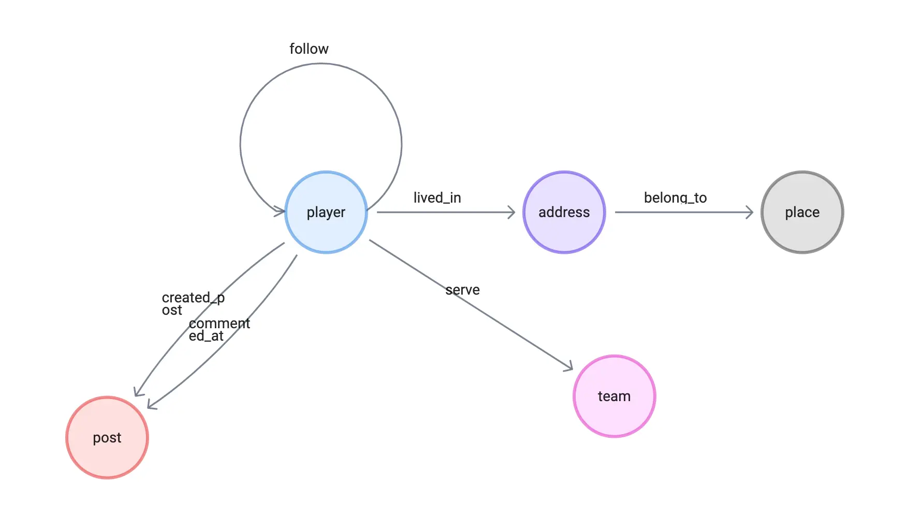

## Importing the data

### Load the default dataset

- In the Command Line Console, we could just execute:play basketballplayer` to load the default dataset.

- Or, if we do so from NebulaGraph Studio/Explorer, just click the Download from the Demos in the welcome page:

  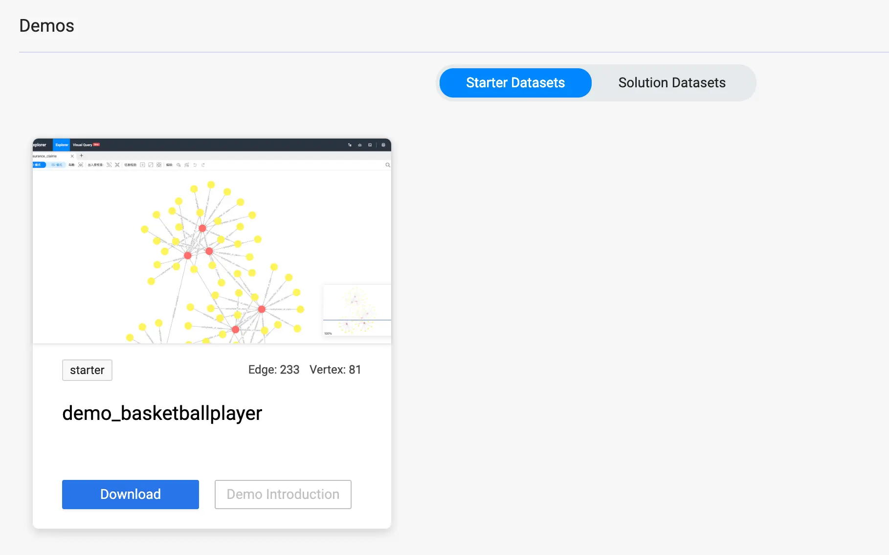

### Add the SNS Graph schema

First the DDL for those new tags and edges:

```sql
CREATE TAG IF NOT EXISTS post(title string NOT NULL);
CREATE EDGE created_post(post_time timestamp);
CREATE EDGE commented_at(post_time timestamp);
CREATE TAG address(address string NOT NULL, `geo_point` geography(point));
CREATE TAG place(name string NOT NULL, `geo_point` geography(point));
CREATE EDGE belong_to();
CREATE EDGE lived_in();
```

### Load the data

Then we load the DML part, to insert vertices and edges:

```sql
INSERT VERTEX post(title) values \
    "post1":("a beautify flower"), "post2":("my first bike"), "post3":("I can swim"), \
    "post4":("I love you, Dad"), "post5":("I hate coriander"), "post6":("my best friend, tom"), \
    "post7":("my best friend, jerry"), "post8":("Frank, the cat"), "post9":("sushi rocks"), \
    "post10":("I love you, Mom"), "post11":("Let's have a party!");

INSERT EDGE created_post(post_time) values \
    "player100"->"post1":(timestamp("2019-01-01 00:30:06")), \
    "player111"->"post2":(timestamp("2016-11-23 10:04:50")), \
    "player101"->"post3":(timestamp("2019-11-11 10:44:06")), \
    "player103"->"post4":(timestamp("2014-12-01 20:45:11")), \
    "player102"->"post5":(timestamp("2015-03-01 00:30:06")), \
    "player104"->"post6":(timestamp("2017-09-21 23:30:06")), \
    "player125"->"post7":(timestamp("2018-01-01 00:44:23")), \
    "player106"->"post8":(timestamp("2019-01-01 00:30:06")), \
    "player117"->"post9":(timestamp("2022-01-01 22:23:30")), \
    "player108"->"post10":(timestamp("2011-01-01 10:00:30")), \
    "player100"->"post11":(timestamp("2021-11-01 11:10:30"));

INSERT EDGE commented_at(post_time) values \
    "player105"->"post1":(timestamp("2019-01-02 00:30:06")), \
    "player109"->"post1":(timestamp("2016-11-24 10:04:50")), \
    "player113"->"post3":(timestamp("2019-11-13 10:44:06")), \
    "player101"->"post4":(timestamp("2014-12-04 20:45:11")), \
    "player102"->"post1":(timestamp("2015-03-03 00:30:06")), \
    "player103"->"post1":(timestamp("2017-09-23 23:30:06")), \
    "player102"->"post7":(timestamp("2018-01-04 00:44:23")), \
    "player101"->"post8":(timestamp("2019-01-04 00:30:06")), \
    "player106"->"post9":(timestamp("2022-01-02 22:23:30")), \
    "player105"->"post10":(timestamp("2011-01-11 10:00:30")), \
    "player130"->"post1":(timestamp("2019-01-02 00:30:06")), \
    "player131"->"post2":(timestamp("2016-11-24 10:04:50")), \
    "player131"->"post3":(timestamp("2019-11-13 10:44:06")), \
    "player133"->"post4":(timestamp("2014-12-04 20:45:11")), \
    "player132"->"post5":(timestamp("2015-03-03 00:30:06")), \
    "player134"->"post6":(timestamp("2017-09-23 23:30:06")), \
    "player135"->"post7":(timestamp("2018-01-04 00:44:23")), \
    "player136"->"post8":(timestamp("2019-01-04 00:30:06")), \
    "player137"->"post9":(timestamp("2022-01-02 22:23:30")), \
    "player138"->"post10":(timestamp("2011-01-11 10:00:30")), \
    "player141"->"post1":(timestamp("2019-01-03 00:30:06")), \
    "player142"->"post2":(timestamp("2016-11-25 10:04:50")), \
    "player143"->"post3":(timestamp("2019-11-14 10:44:06")), \
    "player144"->"post4":(timestamp("2014-12-05 20:45:11")), \
    "player145"->"post5":(timestamp("2015-03-04 00:30:06")), \
    "player146"->"post6":(timestamp("2017-09-24 23:30:06")), \
    "player147"->"post7":(timestamp("2018-01-05 00:44:23")), \
    "player148"->"post8":(timestamp("2019-01-05 00:30:06")), \
    "player139"->"post9":(timestamp("2022-01-03 22:23:30")), \
    "player140"->"post10":(timestamp("2011-01-12 10:01:30")), \
    "player141"->"post1":(timestamp("2019-01-04 00:34:06")), \
    "player102"->"post2":(timestamp("2016-11-26 10:06:50")), \
    "player103"->"post3":(timestamp("2019-11-15 10:45:06")), \
    "player104"->"post4":(timestamp("2014-12-06 20:47:11")), \
    "player105"->"post5":(timestamp("2015-03-05 00:32:06")), \
    "player106"->"post6":(timestamp("2017-09-25 23:31:06")), \
    "player107"->"post7":(timestamp("2018-01-06 00:46:23")), \
    "player118"->"post8":(timestamp("2019-01-06 00:35:06")), \
    "player119"->"post9":(timestamp("2022-01-04 22:26:30")), \
    "player110"->"post10":(timestamp("2011-01-15 10:00:30")), \
    "player111"->"post1":(timestamp("2019-01-06 00:30:06")), \
    "player104"->"post11":(timestamp("2022-01-15 10:00:30")), \
    "player125"->"post11":(timestamp("2022-02-15 10:00:30")), \
    "player113"->"post11":(timestamp("2022-03-15 10:00:30")), \
    "player102"->"post11":(timestamp("2022-04-15 10:00:30")), \
    "player108"->"post11":(timestamp("2022-05-15 10:00:30"));

INSERT VERTEX `address` (`address`, `geo_point`) VALUES \
    "addr_0":("Brittany Forge Apt. 718 East Eric  WV 97881", ST_Point(1,2)),\
    "addr_1":("Richard Curve Kingstad  AZ 05660", ST_Point(3,4)),\
    "addr_2":("Schmidt Key Lake Charles  AL 36174", ST_Point(13.13,-87.65)),\
    "addr_3":("5 Joanna Key Suite 704 Frankshire  OK 03035", ST_Point(5,6)),\
    "addr_4":("1 Payne Circle Mitchellfort  LA 73053", ST_Point(7,8)),\
    "addr_5":("2 Klein Mission New Annetteton  HI 05775", ST_Point(9,10)),\
    "addr_6":("1 Vanessa Stravenue Suite 184 Baileyville  NY 46381", ST_Point(11,12)),\
    "addr_7":("John Garden Port John  LA 54602", ST_Point(13,14)),\
    "addr_8":("11 Webb Groves Tiffanyside  MN 14566", ST_Point(15,16)),\
    "addr_9":("70 Robinson Locks Suite 113 East Veronica  ND 87845", ST_Point(17,18)),\
    "addr_10":("24 Mcknight Port Apt. 028 Sarahborough  MD 38195", ST_Point(19,20)),\
    "addr_11":("0337 Mason Corner Apt. 900 Toddmouth  FL 61464", ST_Point(21,22)),\
    "addr_12":("7 Davis Station Apt. 691 Pittmanfort  HI 29746", ST_Point(23,24)),\
    "addr_13":("1 Southport Street Apt. 098 Westport  KY 85907", ST_Point(120.12,30.16)),\
    "addr_14":("Weber Unions Eddieland  MT 64619", ST_Point(25,26)),\
    "addr_15":("1 Amanda Freeway Lisaland  NJ 94933", ST_Point(27,28)),\
    "addr_16":("2 Klein HI 05775", ST_Point(9,10)),\
    "addr_17":("Schmidt Key Lake Charles AL 13617", ST_Point(13.12, -87.60)),\
    "addr_18":("Rodriguez Track East Connorfort  NC 63144", ST_Point(29,30));

INSERT VERTEX `place` (`name`, `geo_point`) VALUES \
    "WV":("West Virginia", ST_Point(1,2.5)),\
    "AZ":("Arizona", ST_Point(3,4.5)),\
    "AL":("Alabama", ST_Point(13.13,-87)),\
    "OK":("Oklahoma", ST_Point(5,6.1)),\
    "LA":("Louisiana", ST_Point(7,8.1)),\
    "HI":("Hawaii", ST_Point(9,10.1)),\
    "NY":("New York", ST_Point(11,12.1)),\
    "MN":("Minnesota", ST_Point(15,16.1)),\
    "ND":("North Dakota", ST_Point(17,18.1)),\
    "FL":("Florida", ST_Point(21,22.1)),\
    "KY":("Kentucky", ST_Point(120.12,30)),\
    "MT":("Montana", ST_Point(25,26.1)),\
    "NJ":("New Jersey", ST_Point(27,28.1)),\
    "NC":("North Carolina", ST_Point(29,30.1));

INSERT EDGE `belong_to`() VALUES \
    "addr_0"->"WV":(),\
    "addr_1"->"AZ":(),\
    "addr_2"->"AL":(),\
    "addr_3"->"OK":(),\
    "addr_4"->"LA":(),\
    "addr_5"->"HI":(),\
    "addr_6"->"NY":(),\
    "addr_7"->"LA":(),\
    "addr_8"->"MN":(),\
    "addr_9"->"ND":(),\
    "addr_10"->"MD":(),\
    "addr_11"->"FL":(),\
    "addr_12"->"HI":(),\
    "addr_13"->"KY":(),\
    "addr_14"->"MT":(),\
    "addr_15"->"NJ":(),\
    "addr_16"->"HI":(),\
    "addr_17"->"AL":(),\
    "addr_18"->"NC":();

INSERT EDGE `lived_in`() VALUES \
    "player100"->"addr_4":(),\
    "player101"->"addr_7":(),\
    "player102"->"addr_2":(),\
    "player103"->"addr_3":(),\
    "player104"->"addr_0":(),\
    "player105"->"addr_5":(),\
    "player106"->"addr_6":(),\
    "player107"->"addr_1":(),\
    "player108"->"addr_8":(),\
    "player109"->"addr_9":(),\
    "player110"->"addr_10":(),\
    "player111"->"addr_11":(),\
    "player112"->"addr_12":(),\
    "player113"->"addr_13":(),\
    "player114"->"addr_14":(),\
    "player115"->"addr_15":(),\
    "player116"->"addr_16":(),\
    "player117"->"addr_17":(),\
    "player118"->"addr_18":();
```

### First glance at the data

Let's start with the stats of the data.

```sql
[basketballplayer]> SUBMIT JOB STATS;

+------------+
| New Job Id |
+------------+
| 10         |
+------------+
[basketballplayer]> SHOW STATS;
+---------+----------------+-------+
| Type    | Name           | Count |
+---------+----------------+-------+
| "Tag"   | "address"      | 19    |
| "Tag"   | "place"        | 14    |
| "Tag"   | "player"       | 51    |
| "Tag"   | "post"         | 10    |
| "Tag"   | "team"         | 30    |
| "Edge"  | "belong_to"    | 19    |
| "Edge"  | "commented_at" | 40    |
| "Edge"  | "created_post" | 10    |
| "Edge"  | "follow"       | 81    |
| "Edge"  | "lived_in"     | 19    |
| "Edge"  | "serve"        | 152   |
| "Space" | "vertices"     | 124   |
| "Space" | "edges"        | 321   |
+---------+----------------+-------+
Got 13 rows (time spent 1038/51372 us)
```

We could get all of the data:

```sql
MATCH ()-[e]->() RETURN e LIMIT 10000
```

As the data volume is quite small, we could render them all in the canvas of NebulaGraph Explorer:

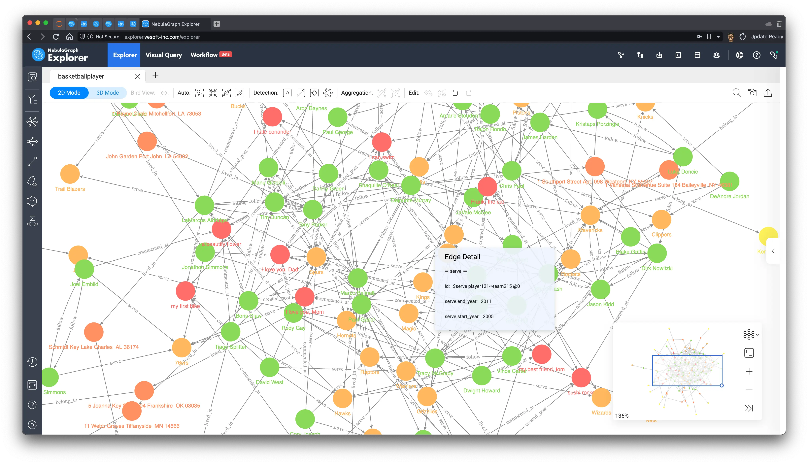

## Identifying key people

Identifying influencers in social networks involves using a variety of metrics and methods to identify individuals who have a lot of influence in a given network. This is useful for many business scenarios, such as for marketing or researching the spread of information in a network.

There are many ways to identify them, and the specific methods and information, relationships, and perspectives considered also depend on the type of these key individuals, and the purpose of acquiring them.

Some common methods include looking at the number of followers a person has or the amount of content consumed, their reader engagement on their posts, videos, and the reach of their content (retweets, citations). These methods are also doable on the graph but are rather mundane, so I won't give examples. Here, we can try to derive these key people on the graph using graph algorithms that evaluate and calculate the importance of nodes.

### PageRank

PageRank is a very classic graph algorithm that iterates through the number of relationships between points on a graph to get a score (Rank) for each point. It was originally proposed by Google founders Larry Page and Sergey Brin and used in the early Google search engine to sort search results, where Page can be a pun on Larry Page's last name and Web Page.

PageRank has long been abandoned as too simple in modern, complex search engines, but it still shines in other graph-structured web scenarios, where we can roughly assume that all links are of similar importance and run the algorithm to find those key users in social networks.

In NebulaGraph, we can use NebulaGraph Algorithm, NebulaGraph Analytics to run PageRank on large full graphs, while in the daily analysis, validation, and design phases, we don't need to run results on full data, but on very small subgraphs (up to tens of thousands), we can easily run various graph algorithms in the browser to derive methods that can be used for production.

Today, we will use the built-in in-browser graph algorithm function of NebulaGraph Explorer to execute PageRank (the specific method is omitted here, you can refer to the [documentation](https://docs.nebula-graph.io/3.3.0/nebula-explorer/graph-explorer/graph-algorithm/ ), but it's really just a matter of mouse clicks).

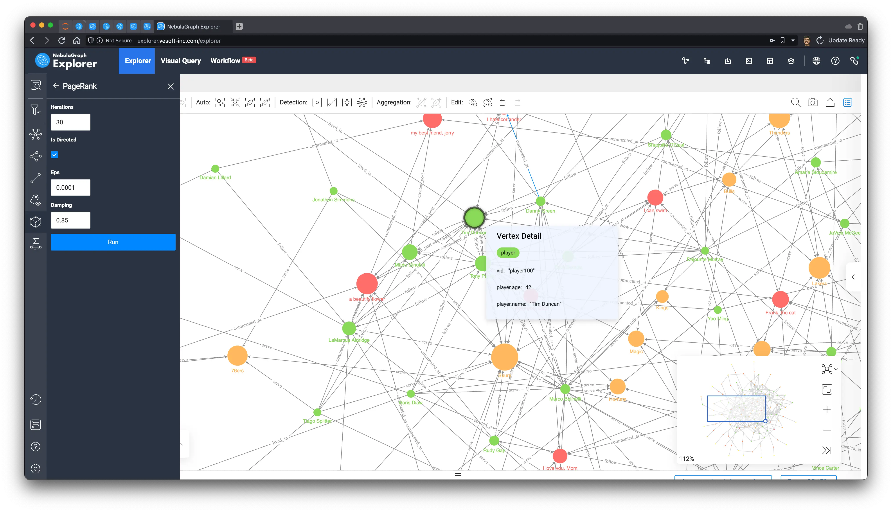

We can see from the above that among all the green players (people) after PageRank calculation, "player.name: Tim Duncan" is the largest one, and the relationship associated with it does seem to be quite a lot, so we select him on the graph, then right-click to invert, select all the points except Tim Duncan, use the backspace key to delete all the other points, and then explore 1 to 5 steps in both directions with him as the starting point. In one step, we get Tim Duncan's subgraph.

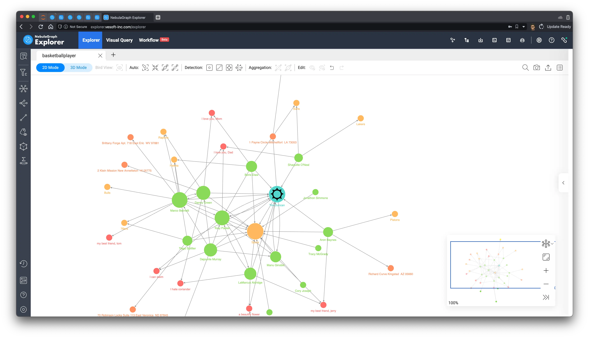

As you can see from the subgraphs, Tim Duncan is associated with a very large number of other players, while some other very popular players have served with him in the very popular Spurs team, which confirms the way PageRank is evaluated.

Now let's see if the algorithm will come to the same conclusion for the other dimensions of determination.

### Betweenness Centrality

As you can see from the subgraphs, Tim Duncan is associated with a very large number of other players, while some other very popular players have served with him in the very popular Spurs team, which confirms the way PageRank is evaluated.

Now let's see if the algorithm will come to the same conclusion for the other dimensions of determination.

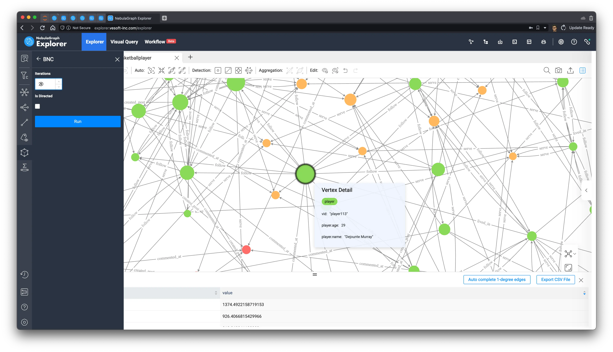

From its five-hop subgraph, it can be seen that unlike the star-shape of the key figure Tim Duncan obtained from PageRank before, Dejounte Murray's subgraph shows clusters, where it is sensory, intuitive to imagine that Dejounte Murray is really on the necessary path of the minimal path between many nodes, while Tim Duncan seems to be associated with more important connecters.

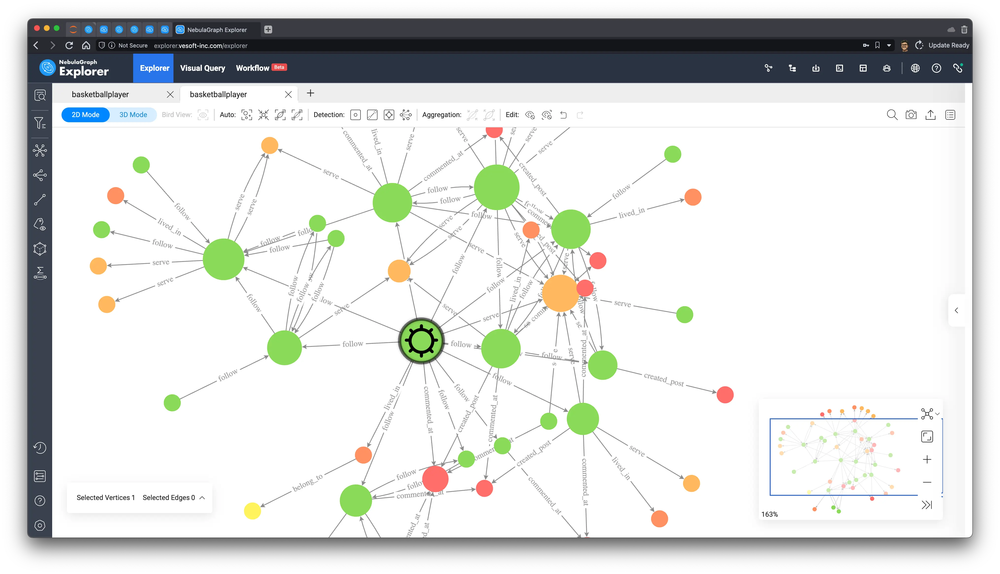

In practical application scenarios, we usually have to understand the definitions in different ways, experiment with different execution results, and analyze to find the structural features that affect the key people we care about, and use them to choose different algorithms for different needs.

## Detect communities and clusters

Community detection in social networks is a technique to discover community structure by analyzing social relationships. A community structure is a set of nodes that are closely connected to each other in a social network, graph, and these nodes usually have similar characteristics or interests. For example, a community structure may manifest itself as a group of users who are clustered together based on common topics or interests.

The purpose of community detection is to identify the boundaries of different communities and determine the nodes in each community by analyzing the social network. This process can be done by using various algorithms such as label propagation algorithm, weakly connected component algorithm and Louvain algorithm. By discovering the community structure, we can better understand the structure and characteristics of social networks, and help social network service providers to better infer and predict behaviors in social networks, and help in good social network governance, advertisement placement, marketing, etc.

Since our dataset is fake-generated, the results I get under different algorithms do not show the real meaning, so this chapter just shows the results after community identification using several graph algorithms, in real-world cases, we should also use domain knowledge or other technical means on top of that to collaboratively give the portraits and labels of different groups and communities.

Effect of label propagation algorithm.

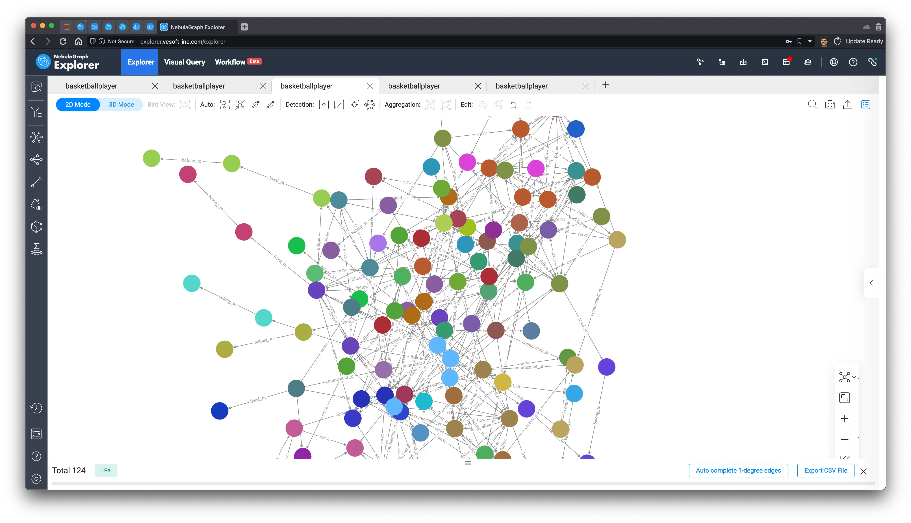


Louvain algorithm:

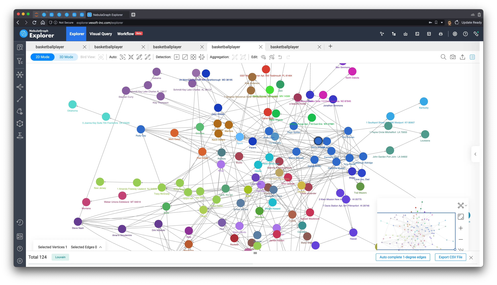

WCC algorithm:

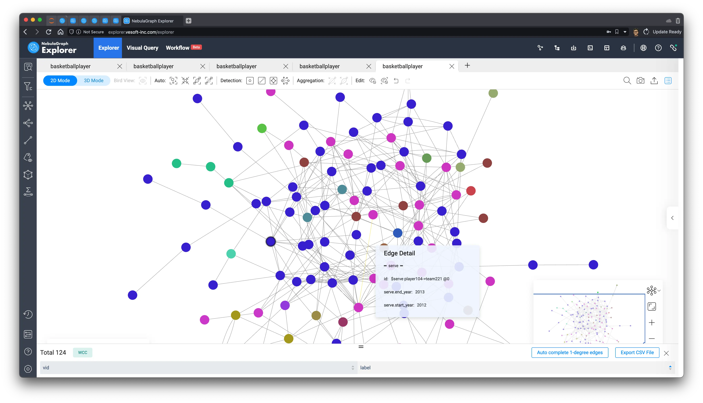

In later sections, we could in better chance verify these algorithms again on smaller and simpler subgraphs, with somewhat more interpretable results.

## Friend Closeness

With the community detection algorithm, it is actually possible to obtain friends with similar interests and close associations to some extent, in a global calculation. So how do we get the other close friends of a given user? We can get this information by counting the number of friends this user has in common with him in order to get this information!

Let's take "Tim Duncan" for example, we know that his two-degree friends (friends of friends: `(:player{name: "Tim Duncan"})-[:follow]-(f:player)-[:follow]-(fof:player)`) are also his friends: Mutual Friend, then it is reasonable to believe that those who have more friends in common with Tim Duncan may have a higher closeness to him.

```cypher
MATCH (start:`player`{name: "Tim Duncan"})-[:`follow`]-(f:`player`)-[:`follow`]-(fof:`player`),
(start:`player`)-[:`follow`]-(fof:`player`)
RETURN fof.`player`.name, count(DISTINCT f) AS NrOfMutualF ORDER BY NrOfMutualF DESC;
```

This query shows that "Tony Parker" and Tim have 5 friends in common and are the closest.

| fof.player.name   | NrOfMutualF |
| :---------------- | :---------- |
| Tony Parker       | 5           |
| Dejounte Murray   | 4           |
| Manu Ginobili     | 3           |
| Marco Belinelli   | 3           |
| Danny Green       | 2           |
| Boris Diaw        | 1           |
| LaMarcus Aldridge | 1           |
| Tiago Splitter    | 1           |

Here, let's verify this result through visualization!

First, let's see who the common friends (f:) are for each of the friends.

```cypher
MATCH (start:player{name: "Tim Duncan"})-[:`follow`]-(f:player)-[:`follow`]-(fof:player),
(start:player)-[:`follow`]-(fof:player)
RETURN fof.player.name, collect(DISTINCT f.player.name);
```

The result:

| fof.player.name   | collect(distinct f.player.name)                              |
| :---------------- | :----------------------------------------------------------- |
| Boris Diaw        | ["Tony Parker"]                                              |
| Manu Ginobili     | ["Dejounte Murray", "Tiago Splitter", "Tony Parker"]         |
| LaMarcus Aldridge | ["Tony Parker"]                                              |
| Tiago Splitter    | ["Manu Ginobili"]                                            |
| Tony Parker       | ["Dejounte Murray", "Boris Diaw", "Manu Ginobili", "Marco Belinelli", "LaMarcus Aldridge"] |
| Dejounte Murray   | ["Danny Green", "Tony Parker", "Manu Ginobili", "Marco Belinelli"] |
| Danny Green       | ["Dejounte Murray", "Marco Belinelli"]                       |
| Marco Belinelli   | ["Dejounte Murray", "Danny Green", "Tony Parker"]            |

 Then we visualize the result on Explorer.

- First, let's find out all of Tim's 2-degree friend paths

```cypher
MATCH p=(start:player{name: "Tim Duncan"})-[:`follow`]-(f:player)-[:follow]-(fof:player)
RETURN p
```

- Then we render the node size by degree in which we select Tim and Tony and find all paths between them for follow type edge, bidirectional, up to 2 hops:

We can see that they are the closest of friends to each other and that their mutual friends are also in the paths.

`["Dejounte Murray", "Boris Diaw", "Manu Ginobili", "Marco Belinelli", "LaMarcus Aldridge"]`

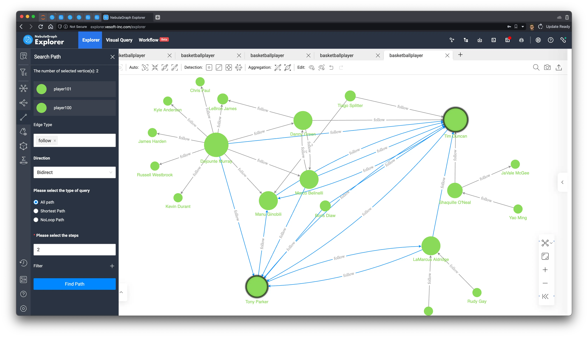

### Small groups in your friends

At this point, as mentioned earlier, the non-authenticity of this dataset itself makes the results of the community discovery algorithm unable to get the insightful connotation of it. Now we can follow this small subgraph to see how groups and communities can be distinguished among Tim's friends.

- Weakly connected components can split Tim's friends into two or three parts that are not connected to each other, which is very much in line with the intuitive understanding and definition of connected components.

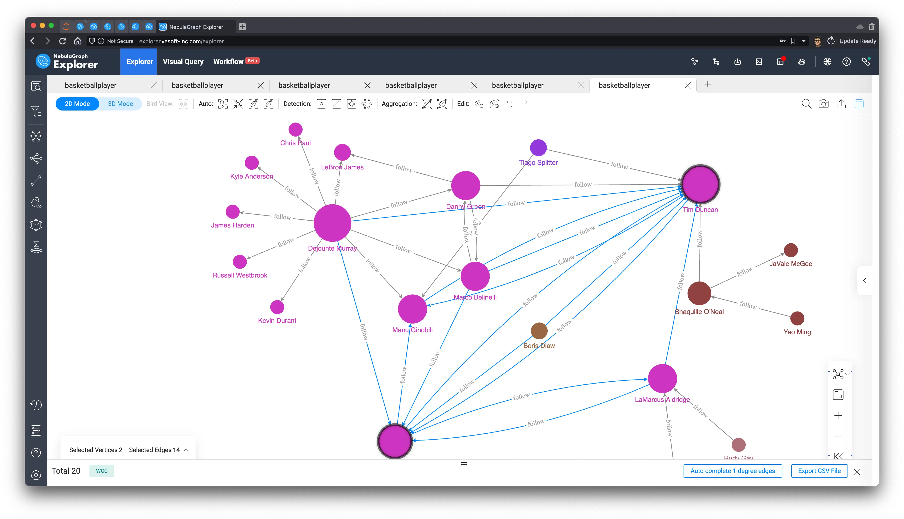

- Label propagation, we can control the number of iterations on-demand to delineate different degrees of division by random propagation, which results in a certain degree of differentiation.

  20 iterations

  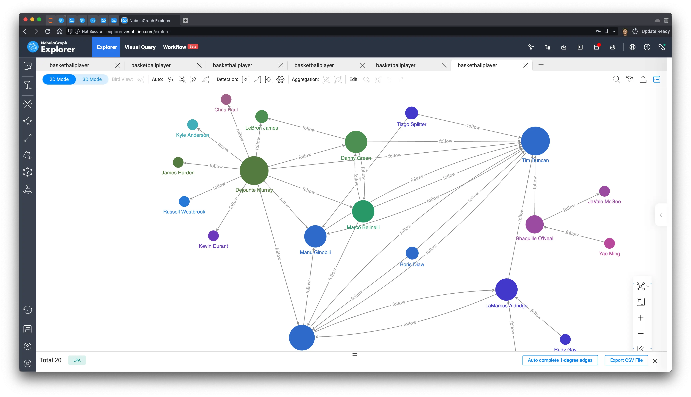

  1000 iterations

  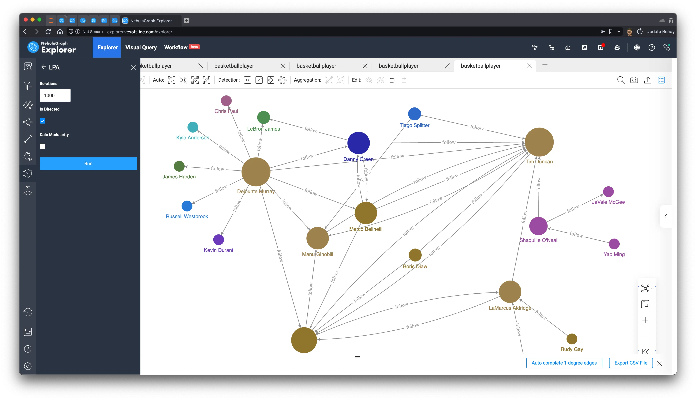

- Louvain, a more efficient and stable algorithm, basically under this subgraph we can get a very intuitive division with a very small number of iterations.

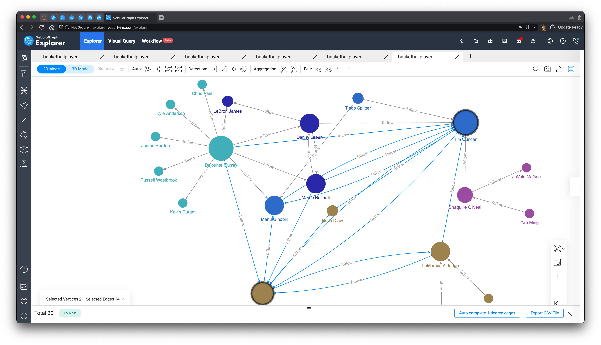

## New friend recommendation

Following the previous idea of 2-degree friends (friends of friends), we can easily add those 2-degree friends who are not yet friends as recommended friends, and the sorting rule is the number of friends they have in common with each other:

```cypher
MATCH (start:player{name: "Tim Duncan"})-[:`follow`]-(f:player)-[:`follow`]-(fof:player)
WHERE NOT (start:player)-[:`follow`]-(fof:player) AND fof != start
RETURN fof.player.name, count(DISTINCT f) AS NrOfMutualF ORDER BY NrOfMutualF DESC;
```

| fof.player.name   | NrOfMutualF |
| :---------------- | :---------- |
| LeBron James      | 2           |
| James Harden      | 1           |
| Chris Paul        | 1           |
| Yao Ming          | 1           |
| Damian Lillard    | 1           |
| JaVale McGee      | 1           |
| Kevin Durant      | 1           |
| Kyle Anderson     | 1           |
| Rudy Gay          | 1           |
| Russell Westbrook | 1           |

Obviously, LeBron is the most recommended! And look at who these mutual friends are.

| fof.player.name   | collect(distinct f.player.name)    |
| :---------------- | :--------------------------------- |
| James Harden      | ["Dejounte Murray"]                |
| LeBron James      | ["Danny Green", "Dejounte Murray"] |
| Chris Paul        | ["Dejounte Murray"]                |
| Yao Ming          | ["Shaquille O'Neal"]               |
| Damian Lillard    | ["LaMarcus Aldridge"]              |
| JaVale McGee      | ["Shaquille O'Neal"]               |
| Kevin Durant      | ["Dejounte Murray"]                |
| Kyle Anderson     | ["Dejounte Murray"]                |
| Rudy Gay          | ["LaMarcus Aldridge"]              |
| Russell Westbrook | ["Dejounte Murray"]                |

同样，我们在刚才的子图里找找 LeBron James 吧！我们把它俩之间的两步、双向路径找出来，果然只会经过 `["Danny Green", "Dejounte Murray"]` 并且，没有直接的连接：

Again, let's look for LeBron James in the subgraph we just created! And find the two-step, two-way path between them, and sure enough, it only goes through `["Danny Green", "Dejounte Murray"]` and, without a direct connection.

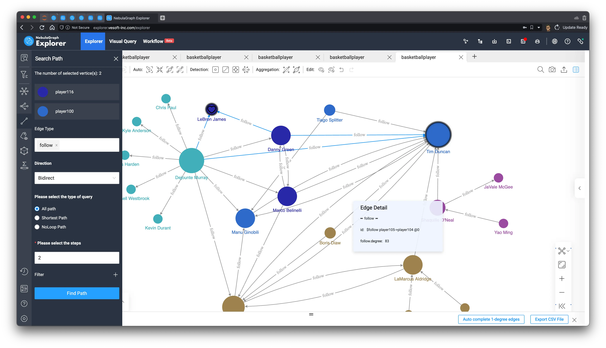

Now, the system could send reminders to both sides: "HEY, maybe you two should make new friends!"

## Common Neighbor

Finding common neighbors is a very common graph database query, and its scenarios may bring different scenarios depending on different neighbor relationships and node types. The common buddy in the first two scenarios is essentially a common neighbor between two points, and directly querying such a relationship is very simple with OpenCypher.

### A common neighbor between two vertices

For example, this expression can query the commonality, intersection between two users, the result may be common teams, places visited, interests, common participation in post replies, etc.:.

```cypher
MATCH p = (`v0`)--()--(`v1`)
WHERE id(`v0`) == "player100" AND id(`v1`) == "player104"
RETURN p
```

And after limiting the type of edge, this query is limited to the common friend query.

```cypher
MATCH p = (v0)--(:`follow`)--(v1)
WHERE id(v0) == "player100" AND id(v1) == "player104"
RETURN p
```

### Common neighbors among multiple vertices: content notification

Below, we give a multi-nodes common neighbor scenario where we trigger from a post, find out all the users who have interacted on this post, and find the common neighbors in this group.

What is the use of this common neighbor? Naturally, if this common neighbor has not yet had any interaction with this article, we can recommend this article to him.

The implementation of this query is interesting.

- The first MATCH is to find the total number of people who left comments and authors on all post11 articles
- After the second MATCH, we find the number of friends of the interacting users who have participated in the article that is exactly equal to the number of users who have participated in the article, and they are actually the common friends of all the participating users.

```cypher
MATCH (blog:post)<-[e]-(:player) WHERE id(blog) == "post11"
WITH blog, count(e) AS invoved_user_count
MATCH (blog:post)<-[]-(users:player)-[:`follow`]-(common_neighbor:player)
WITH toSet(collect(users)) AS users, common_neighbor, invoved_user_count
WHERE size(users) == invoved_user_count
RETURN common_neighbor
```

And that person is . . Tony!

```cypher
+-----------------------------------------------------+
| common_neighbor                                     |
+-----------------------------------------------------+
| ("player101" :player{age: 36, name: "Tony Parker"}) |
+-----------------------------------------------------+
```

And we can easily verify it in the visualization of the query:

```cypher
MATCH p=(blog:post)<-[]-(users:player)-[:`follow`]-(common_neighbor:player)
WHERE id(blog) == "post11"
RETURN p
```

Rendering this query, and then looking for two-way, two-hop queries between the article called "Let's have a party!" and Tony's comments, posts, and followers, we can see that all the people involved in the article are, without exception, Tony's friends, and only Tony himself has not yet left a comment on the article!

And how can a party be without Tony? Is it his surprise birthday party, Opps, shouldn't we tell him, or?

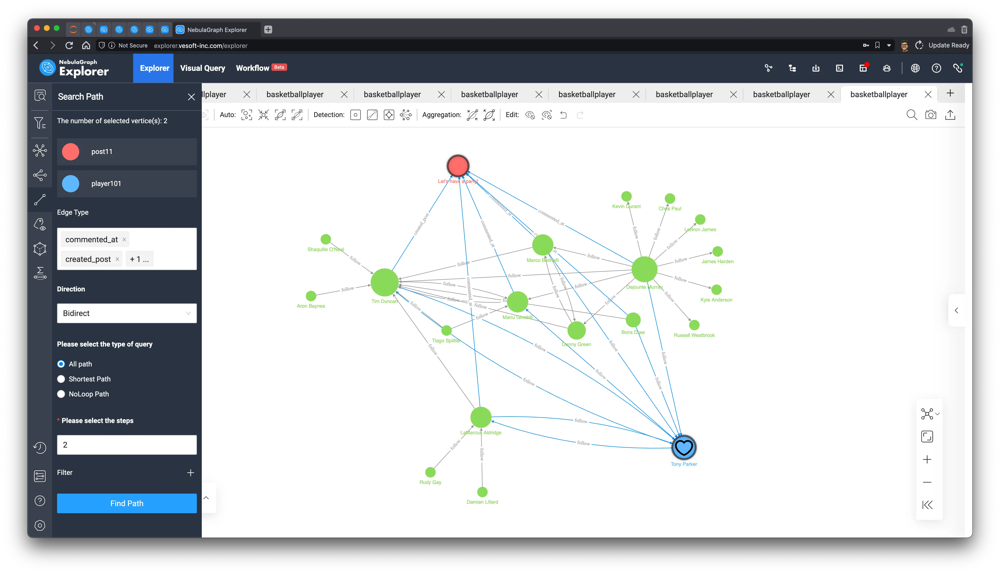


## Feed Generation

I have previously written about the implementation of recommendation systems based on graph technology, in which I described that content filtering and sorting methods in modern recommendation systems can be performed on graphs. It is also highly time-sensitive. The feed generation in a SNS is quite similar but slightly different.

### Content with friend engagement

The simplest and most straightforward definition of content generation may be the facebook feed of content created and engaged by people you follow.

- Content created by friends within a certain period of time
- the content of friends' comments within a certain time frame

We can use OpenCypher to express this query for the stream of information with user id player100.

```cypher
MATCH (feed_owner:player)-[:`follow`]-(friend:player) WHERE id(feed_owner) == "player100"
OPTIONAL MATCH (friend:player)-[newly_commented:commented_at]->(:post)<-[:created_post]-(feed_owner:player)
    WHERE newly_commented.post_time > timestamp("2010-01-01 00:00:00")
OPTIONAL MATCH (friend:player)-[newly_created:created_post]->(po:post)
    WHERE newly_created.post_time > timestamp("2010-01-01 00:00:00")
WITH DISTINCT friend,
    collect(DISTINCT po.post.title) + collect("comment of " + dst(newly_commented))
        AS feeds WHERE size(feeds) > 0
RETURN friend.player.name, feeds
```

| friend.player.name | feeds                                                        |
| :----------------- | :----------------------------------------------------------- |
| Boris Diaw         | ["I love you, Mom", "comment of post11"]                     |
| Marco Belinelli    | ["my best friend, tom", "comment of post11"]                 |
| Danny Green        | ["comment of post1"]                                         |
| Tiago Splitter     | ["comment of post1"]                                         |
| Dejounte Murray    | ["comment of post11"]                                        |
| Tony Parker        | ["I can swim"]                                               |
| LaMarcus Aldridge  | ["I hate coriander", "comment of post11", "comment of post1"] |
| Manu Ginobili      | ["my best friend, jerry", "comment of post11", "comment of post11"] |

So, we can send these comments, articles to the user's feed.

Let's also see what they look like on the graph, we output all the paths we queried:

```cypher
MATCH p=(feed_owner:player)-[:`follow`]-(friend:player) WHERE id(feed_owner) == "player100"
OPTIONAL MATCH p_comment=(friend:player)-[newly_commented:commented_at]->(:post)<-[:created_post]-(feed_owner:player)
    WHERE newly_commented.post_time > timestamp("2010-01-01 00:00:00")
OPTIONAL MATCH p_post=(friend:player)-[newly_created:created_post]->(po:post)
    WHERE newly_created.post_time > timestamp("2010-01-01 00:00:00")
RETURN p, p_comment, p_post
```

Rendering on Explorer and selecting the "Neural Network" layout, you can clearly see the pink article nodes and the edges representing the comments.

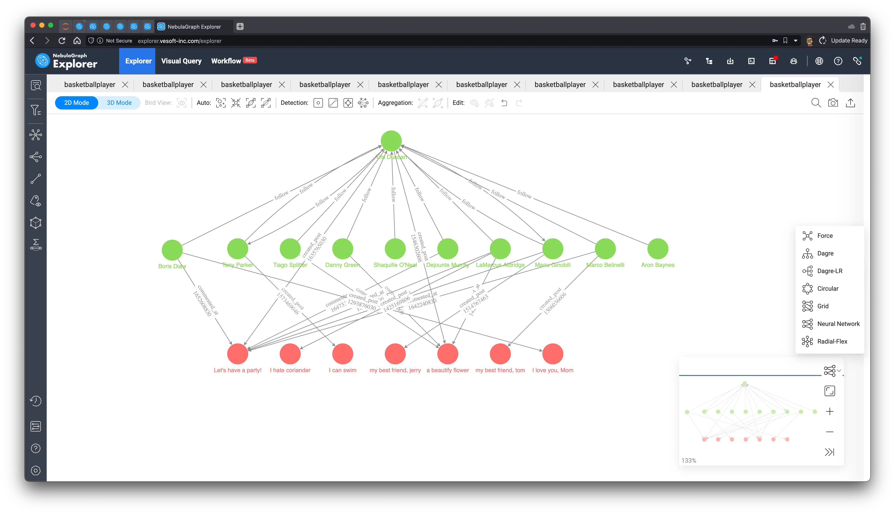

### Content of nearby friends

Let's go a step further and take geographic information(GeoSpatial) into account to get content related to friends whose addresses have a latitude and longitude less than a certain distance.

Here, we use NebulaGraph's GeoSpatial geography function, the constraint `ST_Distance(home.address.geo_point, friend_addr.address.geo_point) AS distance WHERE distance < 1000000` helps us express the distance limit.

```cypher
MATCH (home:address)-[:lived_in]-(feed_owner:player)-[:`follow`]-(friend:player)-[:lived_in]-(friend_addr:address)
    WHERE id(feed_owner) == "player100"
WITH feed_owner, friend, ST_Distance(home.address.geo_point, friend_addr.address.geo_point) AS distance WHERE distance < 1000000

OPTIONAL MATCH (friend:player)-[newly_commented:commented_at]->(:post)<-[:created_post]-(feed_owner:player)
    WHERE newly_commented.post_time > timestamp("2010-01-01 00:00:00")
OPTIONAL MATCH (friend:player)-[newly_created:created_post]->(po:post)
    WHERE newly_created.post_time > timestamp("2010-01-01 00:00:00")
WITH DISTINCT friend,
    collect(DISTINCT po.post.title) + collect("comment of " + dst(newly_commented))
        AS feeds WHERE size(feeds) > 0
RETURN friend.player.name, feeds
```

| friend.player.name | feeds                                        |
| :----------------- | :------------------------------------------- |
| Marco Belinelli    | ["my best friend, tom", "comment of post11"] |
| Tony Parker        | ["I can swim"]                               |
| Danny Green        | ["comment of post1"]                         |

At this point, you can also see the relationship between addresses and their latitude and longitude information from the visualization of this result.

I manually arranged the nodes of the addresses on the graph according to their latitude and longitude and saw that the address (7, 8) of Tim(player100), the owner of this feed, is exactly in the middle of other friends' addresses.

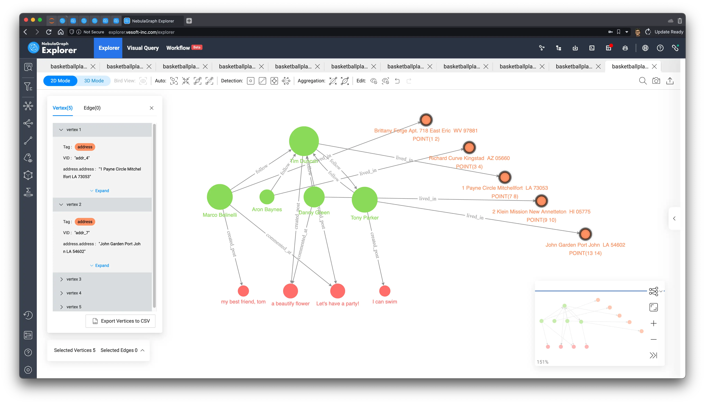

## Spatio-temporal relationship tracking

Spatio-temporal relationship tracking is a typical application that uses graph traversal to make the most of complicated and messy information in scenarios such as public safety, logistics, and epidemic prevention and control. When we build such a graph, we often need only simple graph queries to gain very useful insights. In this section, I'll give an example of this application scenario.

### Dataset

For this purpose, I created a fake dataset by which to build a spatio-temporal relationship graph. The dataset generation program and a file that can be used directly are placed on GitHub at https://github.com/wey-gu/covid-track-graph-datagen.

It models the data as follows.


We could get the data ready in three lines in any Linux System:

```bash
# Install NebulaGraph + NebulaGraph Studio
curl -fsSL nebula-up.siwei.io/install.sh | bash -s -- v3
# Clone the dataset
git clone https://github.com/wey-gu/covid-track-graph-datagen && cd covid-track-graph-datagen
# Load the dataset into NebulaGraph
docker run --rm -ti \
    --network=nebula-net \
    -v ${PWD}/:/root \
    vesoft/nebula-importer:v3.2.0 \
    --config /root/nebula-importer-config.yaml
```

Then we could inspect the data from console:

```bash
~/.nebula-up/console.sh
# access console, and sse the covid_trace graph space
USE covid_trace;
# check stats
SHOW STATS
```

Results:

```bash
(root@nebula) [covid_trace]> SHOW STATS
+---------+------------+--------+
| Type    | Name       | Count  |
+---------+------------+--------+
| "Tag"   | "人"       | 10000  |
| "Tag"   | "地址"     | 1000   |
| "Tag"   | "城市"     | 341    |
| "Tag"   | "村镇"     | 42950  |
| "Tag"   | "省份"     | 32     |
| "Tag"   | "联系方式" | 0      |
| "Tag"   | "行政区"   | 3134   |
| "Tag"   | "街道"     | 667911 |
| "Edge"  | "住址"     | 0      |
| "Edge"  | "到访"     | 19986  |
| "Edge"  | "同住"     | 19998  |
| "Edge"  | "属于"     | 715336 |
| "Space" | "vertices" | 725368 |
| "Space" | "edges"    | 755320 |
+---------+------------+--------+
Got 14 rows (time spent 1087/46271 us)
```

### Connections between two

This could be done with `FIND PATH`

```cypher
# SHORTEST
FIND SHORTEST PATH FROM "p_100" TO "p_101" OVER * BIDIRECT YIELD PATH AS paths

# ALL PATH
FIND ALL PATH FROM "p_100" TO "p_101" OVER * BIDIRECT YIELD PATH AS paths | LIMIT 10
```

SHORTEST Path result:

| paths                                                        |
| :----------------------------------------------------------- |
| <("p_100")<-[:同住@0 {}]-("p_2136")<-[:同住@0 {}]-("p_3708")-[:到访@0 {}]->("a_125")<-[:到访@0 {}]-("p_101")> |

ALL Path result:

| paths                                                        |
| :----------------------------------------------------------- |
| <("p_100")<-[:同住@0 {}]-("p_2136")<-[:同住@0 {}]-("p_3708")-[:到访@0 {}]->("a_125")<-[:到访@0 {}]-("p_101")> |
| <("p_100")-[:到访@0 {}]->("a_328")<-[:到访@0 {}]-("p_6976")<-[:同住@0 {}]-("p_261")-[:到访@0 {}]->("a_352")<-[:到访@0 {}]-("p_101")> |
| <("p_100")-[:同住@0 {}]->("p_8709")-[:同住@0 {}]->("p_9315")-[:同住@0 {}]->("p_261")-[:到访@0 {}]->("a_352")<-[:到访@0 {}]-("p_101")> |
| <("p_100")-[:到访@0 {}]->("a_328")<-[:到访@0 {}]-("p_6311")-[:同住@0 {}]->("p_3941")-[:到访@0 {}]->("a_345")<-[:到访@0 {}]-("p_101")> |
| <("p_100")-[:到访@0 {}]->("a_328")<-[:到访@0 {}]-("p_5046")-[:同住@0 {}]->("p_3993")-[:到访@0 {}]->("a_144")<-[:到访@0 {}]-("p_101")> |
| <("p_100")-[:同住@0 {}]->("p_3457")-[:到访@0 {}]->("a_199")<-[:到访@0 {}]-("p_6771")-[:到访@0 {}]->("a_458")<-[:到访@0 {}]-("p_101")> |
| <("p_100")<-[:同住@0 {}]-("p_1462")-[:到访@0 {}]->("a_922")<-[:到访@0 {}]-("p_5869")-[:到访@0 {}]->("a_345")<-[:到访@0 {}]-("p_101")> |
| <("p_100")<-[:同住@0 {}]-("p_9489")-[:到访@0 {}]->("a_985")<-[:到访@0 {}]-("p_2733")-[:到访@0 {}]->("a_458")<-[:到访@0 {}]-("p_101")> |
| <("p_100")<-[:同住@0 {}]-("p_9489")-[:到访@0 {}]->("a_905")<-[:到访@0 {}]-("p_2733")-[:到访@0 {}]->("a_458")<-[:到访@0 {}]-("p_101")> |
| <("p_100")-[:到访@0 {}]->("a_89")<-[:到访@0 {}]-("p_1333")<-[:同住@0 {}]-("p_1683")-[:到访@0 {}]->("a_345")<-[:到访@0 {}]-("p_101")> |

We render all the paths visually, mark the two people at the starting node and end end, and check their shortest paths in between, and the inextricable relationship between them is clear at a glance, whether it is for business insight, public safety or epidemic prevention and control purposes, with this information, the corresponding work can progress downward like a tiger.


Of course, on a real world system, it may be that we only need to care about the proximity of the association between two users:

```cypher
FIND SHORTEST PATH FROM "p_100" TO "p_101" OVER * BIDIRECT YIELD PATH AS paths |
    YIELD collect(length($-.paths)) AS len | YIELD coalesce($-.len[0], -1) AS len
```

In the result we only care about the length of the shortest path between them as: 4.

| len  |
| :--- |
| 4    |

### Temporal intersection of people

Further we can use graph semantics to outline any patterns with temporal and spatial information that we want to identify and query them in real time in the graph, e.g. for a given person whose id is p_101, we differ all the people who have temporal and spatial intersection with him at a given time, which means that those people also stay and visit a place within the time period in which p_101 visits those places.

```cypher
MATCH (p:person)-[`visit0`:visited]->(`addr`:address)<-[`visit1`:visited]-(p1:person)
    WHERE id(p) == "p_101" AND `visit0`.`start_time` < `visit1`.`end_time`
    RETURN `addr`.address.`name`, collect(p1.person.`name`)
```

我们得到了在每一个到访地点的时空相交人列表如下：

We obtained the following list of temporal intersection people at each visited location.

| addr.address.name    | collect(p1.person.name)                                      |
| :------------------- | :----------------------------------------------------------- |
| 闵行仇路q座 255960   | ["徐畅", "王佳", "曾亮", "姜桂香", "邵秀英", "韦婷婷", "陶玉", "马坤", "黄想", "张秀芳", "颜桂芳", "张洋"] |
| 丰都北京路J座 725701 | ["陈春梅", "施婷婷", "井成", "范文", "王楠", "尚明", "薛秀珍", "宋金凤", "杨雪", "邓丽华", "李杨", "温佳", "叶玉", "周明", "王桂珍", "段玉华", "金成", "黄鑫", "邬兵", "魏柳", "王兰英", "杨柳"] |
| 普陀潜江路P座 210730 | ["储平", "洪红霞", "沈玉英", "王洁", "董玉英", "邓凤英", "谢海燕", "梁雷", "张畅", "任玉兰", "贾宇", "汪成", "孙琴", "纪红梅", "王欣", "陈兵", "张成", "王东", "谷霞", "林成"] |
| 普陀武街f座 706352   | ["邢成", "张建军", "张鑫", "戴涛", "蔡洋", "汪燕", "尹亮", "何利", "何玉", "周波", "金秀珍", "杨波", "张帅", "周柳", "马云", "张建华", "王丽丽", "陈丽", "万萍"] |
| 城东贵阳街O座 110567 | ["李洁", "陈静", "王建国", "方淑华", "古想", "漆萍", "詹桂花", "王成", "李慧", "孙娜", "马伟", "谢杰", "王鹏", "鞠桂英", "莫桂英", "汪雷", "黄彬", "李玉梅", "祝红梅"] |

Now, let's visualize this result on a graph:

```cypher
MATCH (p:person)-[`visit0`:visited]->(`addr`:address)<-[`visit1`:visited]-(p1:person)
    WHERE id(p) == "p_101" AND `visit0`.`start_time` < `visit1`.`end_time`
    RETURN paths;
```

In the result, we marked p_101 as a different icon, and identified the gathering community with the label propagation algorithm, isn't a graph worth a thousand words?

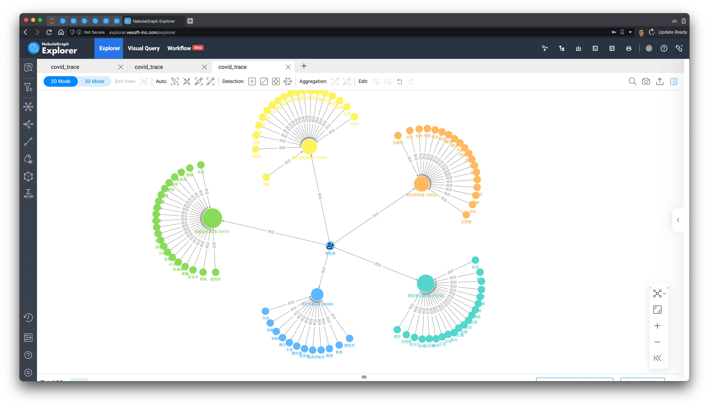

### Most recently visited provinces

Finally, we then use a simple query pattern to express all the provinces a person has visited in a given time, say from a point in time:

```cypher
MATCH (p:person)-[visit:visted]->(`addr`:address)-[:belong_to*5]-(prov:province)
    WHERE id(p) == "p_101" AND visit.start_time > 1625469000
    RETURN prov.province.name, collect(addr.address.name);
```

Result:

| prov.province.name | collect(addr.address.name) |
| :----------------- | :------------------------- |
| 四川省             | ["闵行仇路q座 255960"]     |
| 山东省             | ["城东贵阳街O座 110567"]   |
| 云南省             | ["丰都北京路J座 725701"]   |
| 福建省             | ["普陀潜江路P座 210730"]   |
| 内蒙古自治区       | ["普陀武街f座 706352"]     |

The usual rules, let's look at the results on the graph, this time, we choose Dagre-LR layout rendering, and the result looks like:

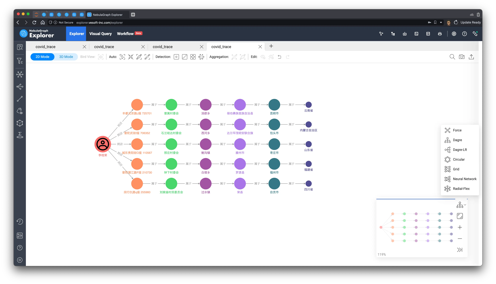

## Recap

We have given quite a few examples of applications in social networks, including

- Finding key people
- Identifying clusters of people, communities
- Determining the closeness between two users
- Recommending new friends
- Pinpointing important content using common neighbors
- Push information flow based on friend relationship and geographic location
- Use spatio-temporal relationship mapping to query the relationship between people, get the people who intersected in time and space, and the provinces visited

As a natural graph structure, social networks are well suited to use graph technology to store, query, compute, analyze and visualize to solve various problems on them. We hope you can have a preliminary understanding of the graph technology in SNS through this post.

> Feature image credit: [Ryoji](https://unsplash.com/photos/IBaVuZsJJTo)


