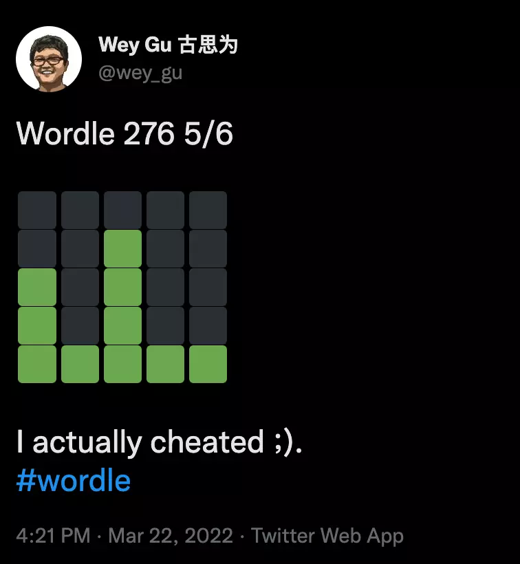
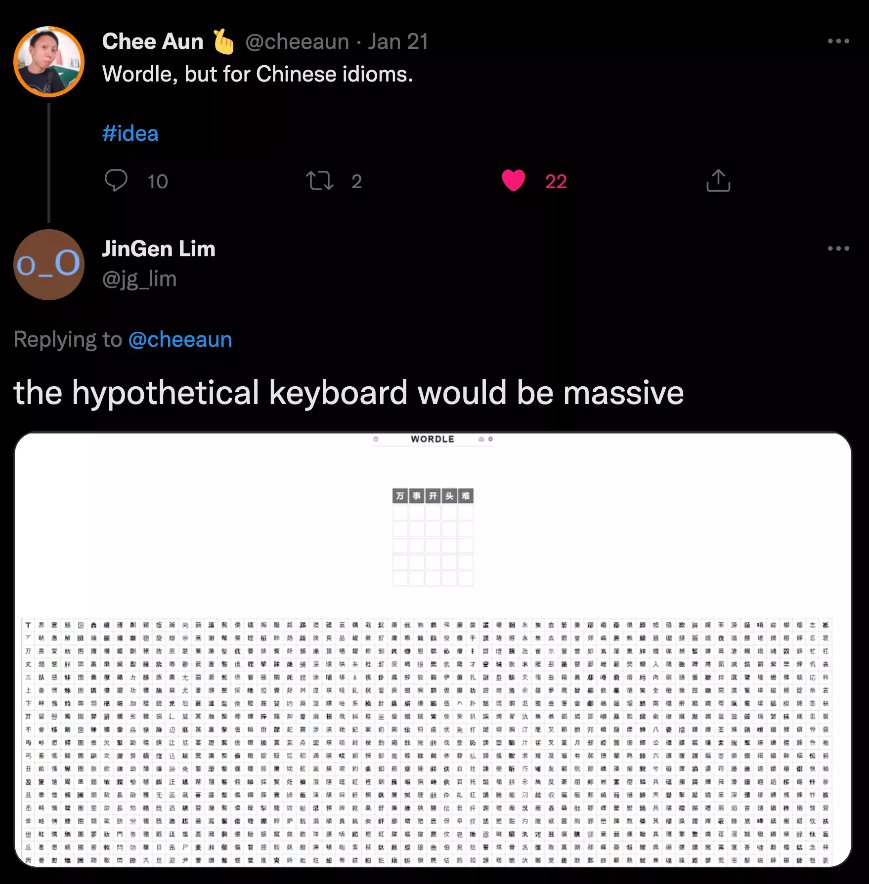

# What happens to Wordle and Chinese idiom Knowledge Graph?


> Could I create something between the human brain and the game-cheater/ruiner to make it more of fun? With Knowledge Graph?

<!--more-->

## Background

You may have seen tweets like this in past months, where the color dots in emoji was shared in SNS randomly.

> Feel free to [Google Wordle](https://www.google.com/search?q=wordle) first if you don't know its meaning yet.



## Wordle Solver

For all magics being used to solve wordle, I am impressed by [Grant Sanderson](https://www.3blue1brown.com/about), who explained us the information theory when solving wordle, [in an elegent and delightful way](https://www.3blue1brown.com/lessons/wordle).

## Chinese wordle: `handle`

I am not going create yet another wordle-solver today, instead, it's more about an intresting variant of wordle.

To truly enjoy the fun of wordle, mostly we should be a native speaker, and it is not surprising that there is a [Spanish wordle](https://twitter.com/search?q=wordle%20es) out there, and still tweets on wordle(es) are being shared literially every second now.

While for non alphabetic languages like Chineses, do we have the luck to have fun with wordling? The answer is yes, while it's a bit different.

For the reason [Chinese charactors](https://en.wikipedia.org/wiki/Chinese_characters), also called Hanzi or Han chactors are in from of [Logogram](https://en.wikipedia.org/wiki/Logogram), each charactor in Chinese is made up of radicals in quite different forms, each Chinese word can be 2/3/4 charactors. Most of the crossword games in Chinese are idiom, proverb or ancient poetry based: the slot to be filled are one Chinese.


ref: [Chinese idiom puzzle](https://chinese.stackexchange.com/questions/42416/chinese-idiom-puzzle-14-%E4%B8%AD%E6%96%87%E5%A1%AB%E5%AD%97%E9%81%8A%E6%88%B2)


Thus, a wordle but in Chinese idiom will be quite strange, or even hilarious as [Chee](https://cheeaun.com/blog/2022/02/chengyu-wordle-is-not-a-love-story/) and JinGen discussed in this [tweet thread](https://twitter.com/jg_lim/status/1484506430711697412), where you could see the candidate characters are counted in thousands: there is no chance to guess the idiom in 10 attempts!




As one of the fun on playing wordle could be the feedback loop of `guess --> result` in limited attempts, while the scale of Chinese Charactor had pushed the Chinese wordle variant creators leveraging other aspects of the charactor: pronunciation.

Each charactor in Chinease is monosyllabic without exceptions, and when it comes to its pronunciation, they are all made up from two parts(initial and final, and they could be [written in roman letters](https://en.wikipedia.org/wiki/Pinyin)), which comes in tens level of possbilities.

There are bounch of Chinese wordle varients asking player to guess idiom leveraging pinyin:

- https://pinyincaichengyu.com/
- https://cheeaun.github.io/chengyu-wordle/
- https://apps.apple.com/cn/app/id1606194420

While, to me, a native Chinese speaker, it's either too hard to play with condtions of pronunciation parts(pinyin) or too easy to guess on given around 20 Chinese charactors. Then, the varient stands out here is the "[handle/汉兜](handle/汉兜)"(Hanzi-Wordle) created by [Antfu](https://antfu.me/).

"Handle" introduced the tones with genius to add an extra dimension of all charactors per each guess attempt, which helped player to have more information on filtering the knowledge in the brain.

> Note, for each Chinese charactor, there will be a tone in 1 of [4 tones](https://en.wikipedia.org/wiki/Four_tones_(Middle_Chinese)) in its pronunciation.


Let's see what it's like to play the "Handle":

- There will be 4 Chinese Charactors to be filled in 10 times of guess
- Not only the charactor self will be colored in result:
  - For example in first line, the green "门" in position 2 is correct whereas in second line, the orange "仓" is corret while the possition should be all but not the first slot.
- There will be extra hints on:
  - Pinyin parts for both part1(initial) and part2(final)
    - In third line of the boxes, the green "qiao" refers to the first charactor is ponouced in "qiao" with initial:"q" and final:"iao", although we filled the wrong charactor in the writing dimension.
    - In third line, the orange "uo" refers to there is one chacarctor in other poisition with the final part of the pinyin as "uo".
  - Tones of the charactor:
    - In third line, the green "-" stands for the third charactor is in tone-1.


## The Chinese Wordle Helper

As a non-native English speaker, the way I was playing wordle is to ~~cheating~~ relying on helpers:

After knowing on the third letter to be "O", I googled and got this: [5-letter-words-with-o-in-the-middle](https://uppolice.org/5-letter-words-with-o-in-the-middle/) and do the searching 😁.


The way to play with helpers works for me to have fun yet not ruin it by an automated cheat resolver(it's only simulating my brain as a native-speaker!), so that I could somehow experience the same as Millions of people out there without cheating.

While for Chinese "Handle" players, from my perspective, it's still a bit harder(to find answers in 10 guesses), and the way my wife and I were playing "Handle" when lining up at the restaurant door ended up googling: idiom list with word 'foo', yet still having a lot of fun.


## Chinese idiom Knowledge Graph

Could I create something between the human brain and the game-cheater/ruiner to make it more of fun?

The answer is yes: a game extension as a secondary brain. For this helper/secondary brain, the solution for "handle" differenciates from the English wordle, unlike the auto-solver, similar algorithms could help on both cases:

- In wordle(English), player searches in their brain or from a helper like the web page: [5-letter-words-with-o-in-the-middle](https://uppolice.org/5-letter-words-with-o-in-the-middle/).

- In handle(Chinese), it's harder to be searching based on hints like tones/initial parts of pinyin in fulltext webpage searching anymore, the reason hehind is that the multidimensional filter condtions are not indexed by normal webpages. As I mentioned, the key of the helper to be leveraged to (not ruining the game) is to be the extension of the brain, then the question is: how does our brain work on handling the knowledge of "handle"(yes, I was preparing for this pun for so long!)?

Thus, why not do it in a graph/neural network way? And here we go, let's create a knowledge graph of Chinese idiom and see how it goes with the "handle" game.

### TL;DR

It's indeed entertaining to me, and I could write Graph Queries[*] by hand or via Visualization tools[**] to help explore things in this graph, because ~~I can~~ we're doing the "thinking" process the similar way in our own brain, but not so well-informed.

- *

  ```cypher
  # There is one Character not in 1st position, with tone-4, final part as "ai", but is not "爱"
  MATCH (char0:character)<-[with_char_0:with_character]-(x:idiom)-[with_pinyin_0:with_pinyin]->(pinyin_0:character_pinyin)-[:with_pinyin_part]->(final_part_0:pinyin_part{part_type: "final"})
  WHERE id(final_part_0) == "ai" AND pinyin_0.character_pinyin.tone == 4 AND with_pinyin_0.position != 0 AND with_char_0.position != 0 AND id(char0) != "爱"
  
  # There is one Character in tone-1 not in 2nd position
  MATCH (x:idiom) -[with_pinyin_1:with_pinyin]->(pinyin_1:character_pinyin)
  WHERE pinyin_1.character_pinyin.tone == 1 AND with_pinyin_1.position != 1
  
  # There is one Character with final part as "ing", not in 4th position
  MATCH (x:idiom) -[with_pinyin_2:with_pinyin]->(:character_pinyin)-[:with_pinyin_part]->(final_part_2:pinyin_part{part_type: "final"})
  WHERE id(final_part_2) == "ing" AND with_pinyin_2.position != 3
  
  # The 4th Character is tone-2
  MATCH (x:idiom) -[with_pinyin_3:with_pinyin]->(pinyin_3:character_pinyin)
  WHERE pinyin_3.character_pinyin.tone == 2 AND with_pinyin_3.position == 3
  
  RETURN x, count(x) as c ORDER BY c DESC
  ```

  

- **


### The long version of playing with Knowledge Graph

If you are intrested in how you could do it from your side, here are some details. Before getting started, if you would like to hands-on do it, please refer to appendix chapter on getting your own Nebula Graph Database cluster ready, which are a couple of lines commands to be run.

#### Play Handle with Knowledge Graph

So, if we visit the "handle" game 👉🏻 https://handle.antfu.me/. We could start with one guess i.e. "爱憎分明".

We will get hint of the first guess as:


Not bad, we have three of the charactor with informative hints!

- There is one Character not in 1st position, with tone-4, final part as "ai", but is not "爱"
- There is one Character in tone-1 not in 2nd position
- There is one Character with final part as "ing", not in 4th position
- The 4th Character is tone-2

Then we just query it from Nebula Graph:

```cypher
# There is one Character not in 1st position, with tone-4, final part as "ai", but is not "爱"
MATCH (char0:character)<-[with_char_0:with_character]-(x:idiom)-[with_pinyin_0:with_pinyin]->(pinyin_0:character_pinyin)-[:with_pinyin_part]->(final_part_0:pinyin_part{part_type: "final"})
WHERE id(final_part_0) == "ai" AND pinyin_0.character_pinyin.tone == 4 AND with_pinyin_0.position != 0 AND with_char_0.position != 0 AND id(char0) != "爱"

# There is one Character in tone-1 not in 2nd position
MATCH (x:idiom) -[with_pinyin_1:with_pinyin]->(pinyin_1:character_pinyin)
WHERE pinyin_1.character_pinyin.tone == 1 AND with_pinyin_1.position != 1

# There is one Character with final part as "ing", not in 4th position
MATCH (x:idiom) -[with_pinyin_2:with_pinyin]->(:character_pinyin)-[:with_pinyin_part]->(final_part_2:pinyin_part{part_type: "final"})
WHERE id(final_part_2) == "ing" AND with_pinyin_2.position != 3

# The 4th Character is tone-2
MATCH (x:idiom) -[with_pinyin_3:with_pinyin]->(pinyin_3:character_pinyin)
WHERE pinyin_3.character_pinyin.tone == 2 AND with_pinyin_3.position == 3

RETURN x, count(x) as c ORDER BY c DESC
```

And there are 7 results left in this single guess for us!

```json
("惊愚骇俗" :idiom{pinyin: "['jing1', 'yu2', 'hai4', 'su2']"})
("惊世骇俗" :idiom{pinyin: "['jing1', 'shi4', 'hai4', 'su2']"})
("惊见骇闻" :idiom{pinyin: "['jing1', 'jian4', 'hai4', 'wen2']"})
("沽名卖直" :idiom{pinyin: "['gu1', 'ming2', 'mai4', 'zhi2']"})
("惊心骇神" :idiom{pinyin: "['jing1', 'xin1', 'hai4', 'shen2']"})
("荆棘载途" :idiom{pinyin: "['jing1', 'ji2', 'zai4', 'tu2']"})
("出卖灵魂" :idiom{pinyin: "['chu1', 'mai4', 'ling2', 'hun2']"})
```

And as a Chinese native speaker, the common one would be "惊世骇俗", and let's give a try!


#### The Visualization of the Query

We could modify our query to make every part of the subquery returned, thus, they could also be renderred visually:

```cypher
# There is one Character not in 1st position, with tone-4, final part as "ai", but is not "爱"
MATCH p0=(char0:character)<-[with_char_0:with_character]-(x:idiom)-[with_pinyin_0:with_pinyin]->(pinyin_0:character_pinyin)-[:with_pinyin_part]->(final_part_0:pinyin_part{part_type: "final"})
WHERE id(final_part_0) == "ai" AND pinyin_0.character_pinyin.tone == 4 AND with_pinyin_0.position != 0 AND with_char_0.position != 0 AND id(char0) != "爱"

# There is one Character in tone-1 not in 2nd position
MATCH p1=(x:idiom) -[with_pinyin_1:with_pinyin]->(pinyin_1:character_pinyin)
WHERE pinyin_1.character_pinyin.tone == 1 AND with_pinyin_1.position != 1

# There is one Character with final part as "ing", not in 4th position
MATCH p2=(x:idiom) -[with_pinyin_2:with_pinyin]->(:character_pinyin)-[:with_pinyin_part]->(final_part_2:pinyin_part{part_type: "final"})
WHERE id(final_part_2) == "ing" AND with_pinyin_2.position != 3

# The 4th Character is tone-2
MATCH p3=(x:idiom) -[with_pinyin_3:with_pinyin]->(pinyin_3:character_pinyin)
WHERE pinyin_3.character_pinyin.tone == 2 AND with_pinyin_3.position == 3

RETURN p0,p1,p2,p3
```

And then we query it in Nebula-Studio-Console, and click "View Subgraphs" to see how the searching was done like it was in our own brains:


## What's Next

If you happened to get hands dirty(or being intrested to) on Graph Database, you could checkout the [Nebula Graph](https://github.com/vesoft-inc/nebula) project now and its [Docs](https://docs.nebula-graph.io/) to have more fun of it! Also, [here](https://nebula-graph.io/demo/) are some only playgrounds if you prefer to try it without deployment on your own envrioment.

If you are intrested in the `MATCH` query syntax and would like to actually do exersices with each daily handle challenge, check below Documents:

- MATCH https://docs.nebula-graph.io/3.0.1/3.ngql-guide/7.general-query-statements/2.match/
- Graph Patterns https://docs.nebula-graph.io/3.0.1/3.ngql-guide/1.nGQL-overview/3.graph-patterns/
- nGQL command cheatsheet https://docs.nebula-graph.io/3.0.1/2.quick-start/6.cheatsheet-for-ngql/

Happy Graphing!


## Appendix: Setting up the Knowledge Graph

I put the code and process here: https://github.com/wey-gu/chinese-graph, feel free to check that out.

### Build the Knowledge Graph

The process would be:

- Modeling the Knowledge
- Preprocessing the data
- ETL data to a Graph Database: Nebula Graph
- Have fun on Nebula Graph

### Modeling the Knowledge Graph

For Graph Modeling, it's actually quite straight forward, the mind model for me was to put the knowledge I cares as vertcies and connect them with their relationships first.

You will come back to iterate or optimize the modeling when you are actually playing with the data afterwards, thus, if you could imagine how the graph will be queried in the first place, the graph modeling could be adopted accordingly. Otherwise, don't over design it, just do it the intuitive way.

Here, I put the vertices with properties as:

- idiom
- character
- pinyin
  - tone
- pinyin_part
  - type

The edges with properteis as:

- with_character
- with_pinyin
- with_pinyin_part


### Deploy Nebula Graph

> With [Nebula-UP](https://github.com/wey-gu/nebula-up/), it's an onliner call

```bash
curl -fsSL nebula-up.siwei.io/install.sh | bash -s -- v3.0.0
```

### Load data

```bash
# clone the code for data genration and data loading
git clone https://github.com/wey-gu/chinese-graph.git && cd chinese-graph

python3 graph_data_generator.py # generate data

# load data with Nebula-Importer
docker run --rm -ti \
    --network=nebula-docker-compose_nebula-net \
    -v ${PWD}/importer_conf.yaml:/root/importer_conf.yaml \
    -v ${PWD}/output:/root \
    vesoft/nebula-importer:v3.0.0 \
    --config /root/importer_conf.yaml
```


