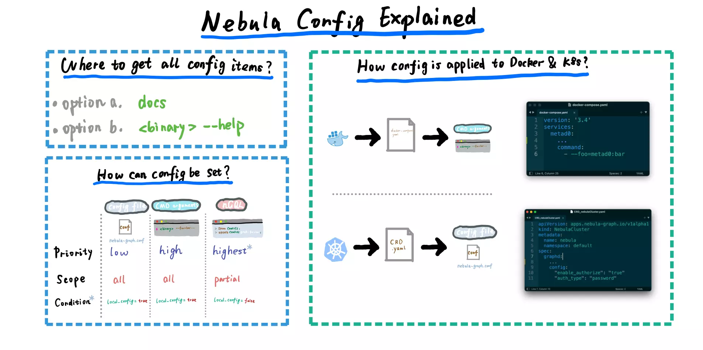

# Nebula Config Explained

<!--more-->

> Nebula Graph config explained

This note explained nebula graph configurations:

- Intro [00:00](https://www.youtube.com/watch?v=jW-Ij3S7Efo&list=PLt6F0VdE9EzFjNb9RSqmtqVWfj9hG_Q4G&index=8&t=0s) 
- Nebula Graph Config Explained [0:16](https://www.youtube.com/watch?v=jW-Ij3S7Efo&list=PLt6F0VdE9EzFjNb9RSqmtqVWfj9hG_Q4G&index=8&t=16s)
- How about Configurations in Nebula Graph Deployed with Docker? [03:01](https://www.youtube.com/watch?v=jW-Ij3S7Efo&list=PLt6F0VdE9EzFjNb9RSqmtqVWfj9hG_Q4G&index=8&t=181s)
- What about Nebula Graph in K8s Operator Deployment case? [03:55](https://www.youtube.com/watch?v=jW-Ij3S7Efo&list=PLt6F0VdE9EzFjNb9RSqmtqVWfj9hG_Q4G&index=8&t=235s)
- Should we use Local-Config or Not?(spoiler: Yes!) [05:03](https://www.youtube.com/watch?v=jW-Ij3S7Efo&list=PLt6F0VdE9EzFjNb9RSqmtqVWfj9hG_Q4G&index=8&t=303s)
- Outra [05:27](https://www.youtube.com/watch?v=jW-Ij3S7Efo&list=PLt6F0VdE9EzFjNb9RSqmtqVWfj9hG_Q4G&index=8&t=327s)

## Bilibili

> 上传中...

## Youtube



