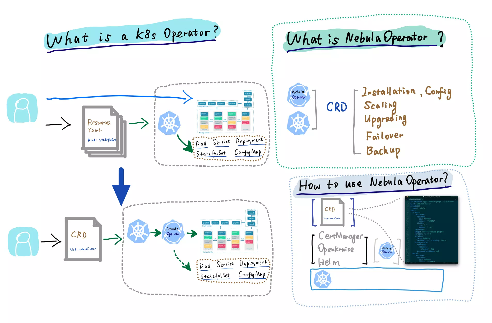

# Nebula Operator Explained

<!--more-->

> Nebula Graph operator explained

This note explained nebula graph's K8s Operator:

- Intro [00:00](https://www.youtube.com/watch?v=WBuyvyuO_ZA&t=0s) 
- Nebula K8s Operator Explained [0:25](https://www.youtube.com/watch?v=WBuyvyuO_ZA&t=25s) 
- How do we use Nebula Operator? [02:23](https://www.youtube.com/watch?v=WBuyvyuO_ZA&t=143s)
- What is the difference between the Operator based Nebula Graph Cluster and the binary-based one? [03:50](https://www.youtube.com/watch?v=WBuyvyuO_ZA&t=230s)
- How about the Performance impact when it comes to K8s-Operator deployment? [04:55](https://www.youtube.com/watch?v=WBuyvyuO_ZA&t=295s)
- What is the easiest way to try out the nebula operator? [06:04](https://www.youtube.com/watch?v=WBuyvyuO_ZA&t=364s)
- Outra [07:30](https://www.youtube.com/watch?v=WBuyvyuO_ZA&t=450s)

ref: https://github.com/vesoft-inc/nebula-operator

## Bilibili

> 上传中...

## Youtube



