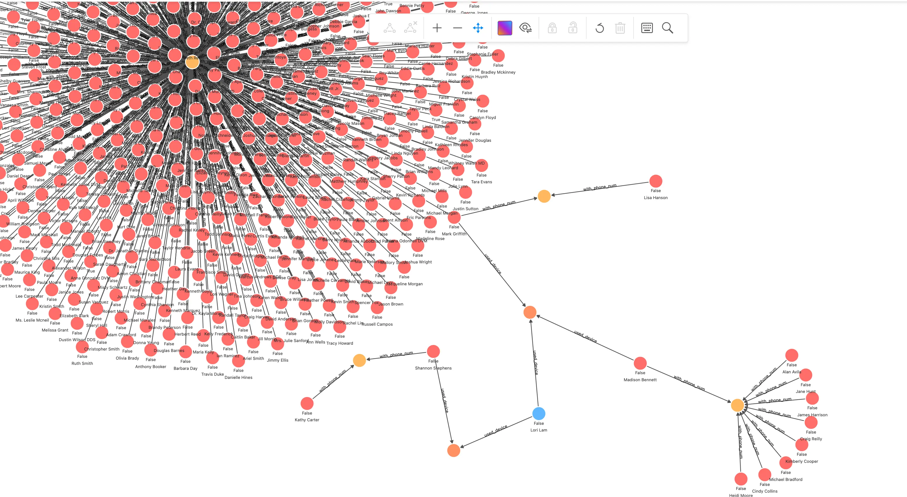
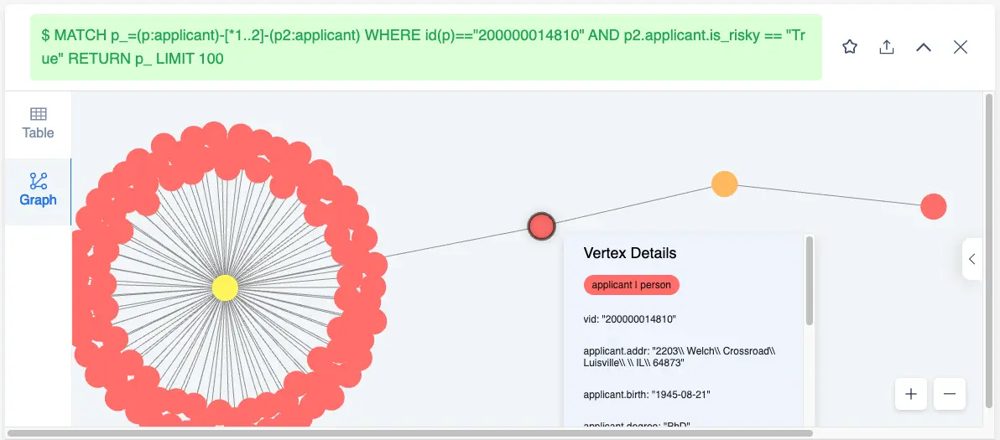
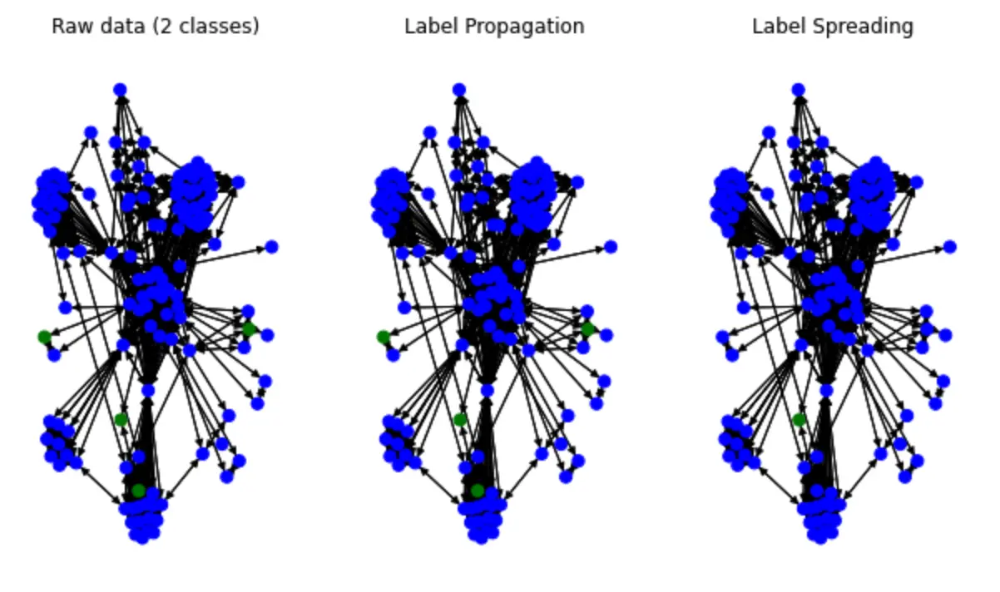
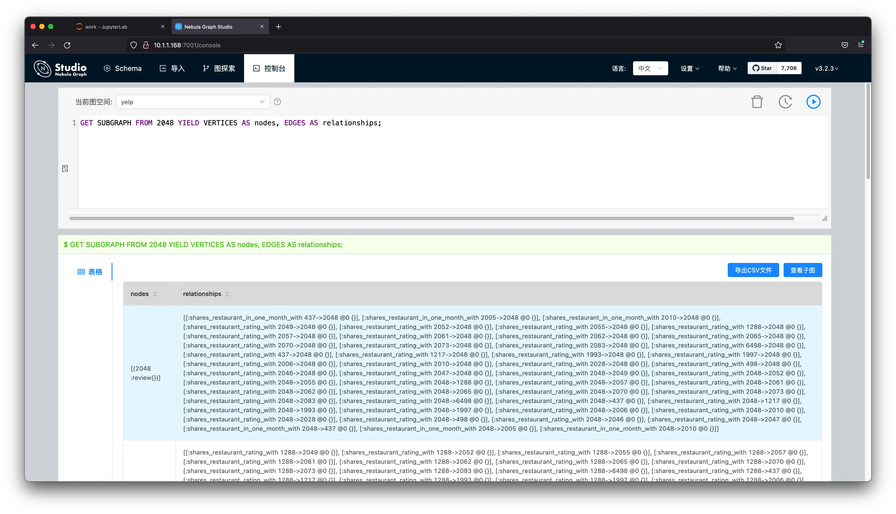
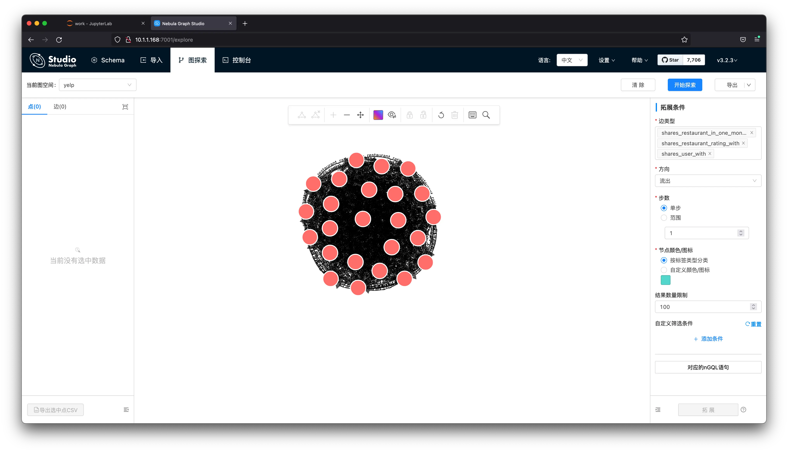

# 基于 NebulaGraph 图数据库的欺诈检测方法与代码示例


> 本文是一个基于 NebulaGraph 上图算法、图数据库、机器学习、GNN 的 Fraud Detection 方法综述，除了基本方法思想的介绍之外，我还给大家弄了可以跑的 Playground。

> 值得一提的是，这还我第一次给大家介绍 Nebula-DGL 这个项目 😁。

<!--more-->

<!--

[TOC]

-->

## 基于图数据库的欺诈检测方法

### 建立图谱

首先，对现有的历史数据、标注信息面向关联关系进行属性图建模。这种原始数据是多个表结构中的银行、电子商务或者保险行业里的交易事件记录、用户数据和风控标注，而建模过程就是抽象出我们关心的实体、实体间的关联关系、和其中有意义的属性。

一般来说，自然人、公司实体、电话号码、地址、设备（比如终端设备、网络地址、终端设备所连接的 WiFi SSID 等）、订单都是实体本身，其他信息比如风险标注（是否高风险、风险描述等）、自然人和公司实体的信息（职业、收入、学历等）都作为实体的属性来建模。

下图是一个可以参考的贷款反欺诈的示例建模，它来自一份作者开源的图结构数据生成项目。

> 注，你可以访问 https://github.com/wey-gu/fraud-detection-datagen 获取这个开源的数据生成器代码和一份示例的数据。


### 图数据库查询识别风险

有了一张囊括了人、公司、历史贷款申请记录、电话、线上申请网络设备的图谱，我们可以挖掘一些有意思的信息。

事实上，很多值得被发现、并有效阻止从而止损的骗保行为是具有群体聚集性的。比如欺诈团伙可能是一小批人（比如3到5人）有组织地收集更大规模的身份证信息（比如30张），同时发起多个金融机构大量贷款，然后在放款后选择丢弃这批留下了违约记录的身份证，再进一步选择下一批身份证信息如法炮制。

这种团伙作案的方式因为利用了大量新的身份信息，完全利用历史记录去黑名单规避风险的方式是无效的。不过，借助于关联关系的视角，这些模式是一定程度上可以被及时识别出来的。

这些可以被识别出的规律我把它分成两种：

一种是风控专家可以直接用某种模式来描述的，例如：和已经被标注为高风险的实体有直接或者间接的关联关系（新订单申请人使用了和过往高风险记录相同的网络设备），这种模式对应到图谱中，通过一个图查询就可以实时给出结果。

另一种是隐含在数据的关联关系背后，需要通过图算法挖掘得出的一些风险提示，例如：尽管给定的实体与有限的标注高风险实体没有匹配的关联，但是它在图中形成了聚集性可能提示我们这可能是一个尚未得手的进行中的团伙贷款诈骗的其中一次申请，这种情况可以通过定期在历史数据中批量执行社区发现算法得出，并在高聚集社区中利用中心性算法给出核心实体，一并提示给风险专家进行后续评估和风险标注。

#### 基于图谱与专家图模式匹配的欺诈检测示例

在开始之前，我们利用 Nebula-UP 来一键部署一套 NebulaGraph 图数据库：

> 更多请参考 https://github.com/wey-gu/nebula-up/

```bash
curl -fsSL nebula-up.siwei.io/install.sh | bash
```

首先，我们把前边建模的图谱加载到 NebulaGraph 里：

```bash
# 克隆数据集代码仓库
git clone https://github.com/wey-gu/fraud-detection-datagen.git
cp -r data_sample_numerical_vertex_id data
# 去掉表头
sed -i '1d' data/*.csv
docker run --rm -ti \
    --network=nebula-net \
    -v ${PWD}:/root/ \
    -v ${PWD}/data/:/data \
    vesoft/nebula-importer:v3.1.0 \
    --config /root/nebula_graph_importer.yaml
```

有了这样一个图谱，风控专家可以在可视化探索工具中按需探索实体之间的关系，绘制相应的风险模式：



在这个探索截图里，我们可以明显看到一个群控设备的风险模式，这个模式可以被交给图数据库开发者，抽象成可以被风控应用定期、实时查询的语句：

```cypher
## 针对一笔交易申请关联查询
MATCH (n) WHERE id(n) == "200000010265"
OPTIONAL MATCH p_shared_d=(n)-[:`used_device`]->(d)<-[:`used_device`]-(:`applicant`)-[:`with_phone_num`]->(pn:phone_num)<-[e:`with_phone_num`]-(:`applicant`)
RETURN p_shared_d
```

我们可以很容易在此模型之上，通过修改返回的关联设备计数，作为意向指标查询的判断 API：

```cypher
## 群控指标
MATCH (n) WHERE id(n) == "200000010265"
OPTIONAL MATCH p_shared_d=(n)-[:`used_device`]->(d)<-[:`used_device`]-(:`applicant`)-[:`with_phone_num`]->(pn:phone_num)<-[e:`with_phone_num`]-(:`applicant`)
RETURN count(e)
```

如此，我们可以建立一个相对有效的风控系统，利用有限的标注数据和专家资源，去更高效控制团伙欺诈作案风险。

另一个利用标注风险节点的查询是找到相关联节点高风险属性的数量：

```cypher
MATCH p_=(p:`applicant`)-[*1..2]-(p2:`applicant`) WHERE id(p)=="200000014810" AND p2.`applicant`.is_risky == "True" RETURN p_ LIMIT 100
```

可以从这个路径查询看到 `200000014810` 的相连接的申请人中有不少是高风险的（也能看出聚集的 device）。



如此，我们可以定义相连高风险点数量为一个指标：

```cypher
MATCH (p:`applicant`)-[*1..2]-(p2:`applicant`) WHERE id(p)=="200000014810" AND p2.`applicant`.is_risky == "True" RETURN count(p2)
```

然而，在现实情况下，我们的大多数标注数据的获取还是过于昂贵，那么有没有什么方法是更有效利用有限的风险标注和图结构，来预测出风险呢？

### 利用图扩充标注

答案是肯定的， Xiaojin Z. 和 Zoubin G. 在论文：[Learning from Labeled and Unlabeled Data with Label Propagation](http://mlg.eng.cam.ac.uk/zoubin/papers/CMU-CALD-02-107.pdf) （CMU-CALD-02-107）中，利用标签传播（Label Propagation）算法来把有限的标注信息在图上通过关联关系传播到更多实体中。

这样，在我们建立的图谱中，我们可以很容易地借助有限的高风险标注，去“传播”产生更多的标注信息。这些扩展出来的标注信息一方面可以在实时的图查询中给出更多的结果，另一方面，它还能作为风控专家重要的输入信息，帮助推进反欺诈调查行动的开展。

一般来说，我们可以通过定期离线地全图扫描数据，通过图算法扩充、更新标注，再将有效的更新标注写回到图谱之中。

> 注，类似的方法还有 SIGNDiffusion，感兴趣的同学可以去了解一下。

#### 图算法扩充欺诈风险标注的示例

下面，我给出一个可以跑通的案例：

这个例子中，我用到了 Yelp 这个欺诈识别的经典数据，这份数据不只会用在这个例子中，后边 GNN 方法中的案例我也会用到它，所以大家可以耐心把数据导入 NebulaGraph。

导入数据到图库

> 生成导入的方法在这里，https://github.com/wey-gu/nebulagraph-yelp-frauddetection

```bash
cd ~
git clone https://github.com/wey-gu/nebulagraph-yelp-frauddetection
cd nebulagraph-yelp-frauddetection
python3 -m pip install -r requirements.txt
python3 data_download.py

# 导入图库
docker run --rm -ti \
    --network=nebula-net \
    -v ${PWD}/yelp_nebulagraph_importer.yaml:/root/importer.yaml \
    -v ${PWD}/data:/root \
    vesoft/nebula-importer:v3.1.0 \
    --config /root/importer.yaml
```

结束之后，我们可以看一下图上的统计：

```bash
~/.nebula-up/console.sh -e "USE yelp; SHOW STATS"
```

然后，我们可以看到：

```bash
(root@nebula) [(none)]> USE yelp; SHOW STATS
+---------+---------------------------------------+---------+
| Type    | Name                                  | Count   |
+---------+---------------------------------------+---------+
| "Tag"   | "review"                              | 45954   |
| "Edge"  | "shares_restaurant_in_one_month_with" | 1147232 |
| "Edge"  | "shares_restaurant_rating_with"       | 6805486 |
| "Edge"  | "shares_user_with"                    | 98630   |
| "Space" | "vertices"                            | 45954   |
| "Space" | "edges"                               | 8051348 |
+---------+---------------------------------------+---------+
Got 6 rows (time spent 1911/4488 us)
```

目前，市面上的 LPA 标签传播算法都是用来做社区检测的，很少有实现是用来做标签拓展的（只有 SK-Learn 中有这个实现），这里，我们参考 [Thibaud M](https://datascience.stackexchange.com/users/77683/thibaud-m) 给出来的实现。

> 原始的讨论参考：https://datascience.stackexchange.com/a/55720/138720

为了让这个算法跑的快一点，会从 NebulaGraph 里取一个点的子图，在这个小的子图上做标注的扩充：

首先，我们启动一个 Jupyter 的 Playground，

> 参考 https://github.com/wey-gu/nebula-dgl 中的 Playground 过程：

```bash
git clone https://github.com/wey-gu/nebula-dgl.git
cd nebula-dgl
# 运行 Jupyter Notebook
docker run -it --name dgl -p 8888:8888 --network nebula-net \
    -v "$PWD":/home/jovyan/work jupyter/datascience-notebook \
    start-notebook.sh --NotebookApp.token='nebulagraph'
```

访问：http://localhost:8888/lab/tree/work?token=nebulagraph

安装依赖（这些依赖在后边的 GNN 例子中也会被用到）

```python
!python3 -m pip install git+https://github.com/vesoft-inc/nebula-python.git@8c328c534413b04ccecfd42e64ce6491e09c6ca8
!python3 -m pip install .
```

然后，我们从图中读取一个子图，从 `2048` 这个点开始探索两步内的所有边。

```python
import torch
import json
from torch import tensor
from dgl import DGLHeteroGraph, heterograph

from nebula3.gclient.net import ConnectionPool
from nebula3.Config import Config

config = Config()
config.max_connection_pool_size = 2
connection_pool = ConnectionPool()
connection_pool.init([('graphd', 9669)], config)

vertex_id = 2048
client = connection_pool.get_session('root', 'nebula')
r = client.execute_json(
    "USE yelp;"
    f"GET SUBGRAPH WITH PROP 2 STEPS FROM {vertex_id} YIELD VERTICES AS nodes, EDGES AS relationships;")

r = json.loads(r)
data = r.get('results', [{}])[0].get('data')
columns = r.get('results', [{}])[0].get('columns')

# create node and nodedata
node_id_map = {} # key: vertex id in NebulaGraph, value: node id in dgl_graph
node_idx = 0
features = [[] for _ in range(32)] + [[]]
for i in range(len(data)):
    for index, node in enumerate(data[i]['meta'][0]):
        nodeid = data[i]['meta'][0][index]['id']
        if nodeid not in node_id_map:
            node_id_map[nodeid] = node_idx
            node_idx += 1
            for f in range(32):
                features[f].append(data[i]['row'][0][index][f"review.f{f}"])
            features[32].append(data[i]['row'][0][index]['review.is_fraud'])

rur_start, rur_end, rsr_start, rsr_end, rtr_start, rtr_end = [], [], [], [], [], []
for i in range(len(data)):
    for edge in data[i]['meta'][1]:
        edge = edge['id']
        if edge['name'] == 'shares_user_with':
            rur_start.append(node_id_map[edge['src']])
            rur_end.append(node_id_map[edge['dst']])
        elif edge['name'] == 'shares_restaurant_rating_with':
            rsr_start.append(node_id_map[edge['src']])
            rsr_end.append(node_id_map[edge['dst']])
        elif edge['name'] == 'shares_restaurant_in_one_month_with':
            rtr_start.append(node_id_map[edge['src']])
            rtr_end.append(node_id_map[edge['dst']])

data_dict = {}
if rur_start:
    data_dict[('review', 'shares_user_with', 'review')] = tensor(rur_start), tensor(rur_end)
if rsr_start:
    data_dict[('review', 'shares_restaurant_rating_with', 'review')] = tensor(rsr_start), tensor(rsr_end)
if rtr_start:
    data_dict[('review', 'shares_restaurant_in_one_month_with', 'review')] = tensor(rtr_start), tensor(rtr_end)
# construct a dgl_graph, ref: https://docs.dgl.ai/en/0.9.x/generated/dgl.heterograph.html

dgl_graph: DGLHeteroGraph = heterograph(data_dict)

# load node features to dgl_graph
dgl_graph.ndata['label'] = tensor(features[32])

# heterogeneous graph to heterogeneous graph, keep ndata and edata
import dgl
hg = dgl.to_homogeneous(dgl_graph, ndata=['label'])
```

然后，我们用上边提到的 Torch Label Spreading 实现，应用到我们的图上。

```python
from abc import abstractmethod
import torch

class BaseLabelPropagation:
    """Base class for label propagation models.
    
    Parameters
    ----------
    adj_matrix: torch.FloatTensor
        Adjacency matrix of the graph.
    """
    def __init__(self, adj_matrix):
        self.norm_adj_matrix = self._normalize(adj_matrix)
        self.n_nodes = adj_matrix.size(0)
        self.one_hot_labels = None 
        self.n_classes = None
        self.labeled_mask = None
        self.predictions = None

    @staticmethod
    @abstractmethod
    def _normalize(adj_matrix):
        raise NotImplementedError("_normalize must be implemented")

    @abstractmethod
    def _propagate(self):
        raise NotImplementedError("_propagate must be implemented")

    def _one_hot_encode(self, labels):
        # Get the number of classes
        classes = torch.unique(labels)
        classes = classes[classes != -1]
        self.n_classes = classes.size(0)

        # One-hot encode labeled data instances and zero rows corresponding to unlabeled instances
        unlabeled_mask = (labels == -1)
        labels = labels.clone()  # defensive copying
        labels[unlabeled_mask] = 0
        self.one_hot_labels = torch.zeros((self.n_nodes, self.n_classes), dtype=torch.float)
        self.one_hot_labels = self.one_hot_labels.scatter(1, labels.unsqueeze(1), 1)
        self.one_hot_labels[unlabeled_mask, 0] = 0

        self.labeled_mask = ~unlabeled_mask

    def fit(self, labels, max_iter, tol):
        """Fits a semi-supervised learning label propagation model.
        
        labels: torch.LongTensor
            Tensor of size n_nodes indicating the class number of each node.
            Unlabeled nodes are denoted with -1.
        max_iter: int
            Maximum number of iterations allowed.
        tol: float
            Convergence tolerance: threshold to consider the system at steady state.
        """
        self._one_hot_encode(labels)

        self.predictions = self.one_hot_labels.clone()
        prev_predictions = torch.zeros((self.n_nodes, self.n_classes), dtype=torch.float)

        for i in range(max_iter):
            # Stop iterations if the system is considered at a steady state
            variation = torch.abs(self.predictions - prev_predictions).sum().item()
            
            if variation < tol:
                print(f"The method stopped after {i} iterations, variation={variation:.4f}.")
                break

            prev_predictions = self.predictions
            self._propagate()

    def predict(self):
        return self.predictions

    def predict_classes(self):
        return self.predictions.max(dim=1).indices

class LabelPropagation(BaseLabelPropagation):
    def __init__(self, adj_matrix):
        super().__init__(adj_matrix)

    @staticmethod
    def _normalize(adj_matrix):
        """Computes D^-1 * W"""
        degs = adj_matrix.sum(dim=1)
        degs[degs == 0] = 1  # avoid division by 0 error
        return adj_matrix / degs[:, None]

    def _propagate(self):
        self.predictions = torch.matmul(self.norm_adj_matrix, self.predictions)

        # Put back already known labels
        self.predictions[self.labeled_mask] = self.one_hot_labels[self.labeled_mask]

    def fit(self, labels, max_iter=1000, tol=1e-3):
        super().fit(labels, max_iter, tol)

class LabelSpreading(BaseLabelPropagation):
    def __init__(self, adj_matrix):
        super().__init__(adj_matrix)
        self.alpha = None

    @staticmethod
    def _normalize(adj_matrix):
        """Computes D^-1/2 * W * D^-1/2"""
        degs = adj_matrix.sum(dim=1)
        norm = torch.pow(degs, -0.5)
        norm[torch.isinf(norm)] = 1
        return adj_matrix * norm[:, None] * norm[None, :]

    def _propagate(self):
        self.predictions = (
            self.alpha * torch.matmul(self.norm_adj_matrix, self.predictions)
            + (1 - self.alpha) * self.one_hot_labels
        )
    
    def fit(self, labels, max_iter=1000, tol=1e-3, alpha=0.5):
        """
        Parameters
        ----------
        alpha: float
            Clamping factor.
        """
        self.alpha = alpha
        super().fit(labels, max_iter, tol)
        
import pandas as pd
import numpy as np
import networkx as nx
import matplotlib.pyplot as plt

nx_hg = hg.to_networkx()
adj_matrix = nx.adjacency_matrix(nx_hg).toarray()
labels = hg.ndata['label']
# Create input tensors
adj_matrix_t = torch.FloatTensor(adj_matrix)
labels_t = torch.LongTensor(labels)

# Learn with Label Propagation
label_propagation = LabelPropagation(adj_matrix_t)
print("Label Propagation: ", end="")
label_propagation.fit(labels_t)
label_propagation_output_labels = label_propagation.predict_classes()

# Learn with Label Spreading
label_spreading = LabelSpreading(adj_matrix_t)
print("Label Spreading: ", end="")
label_spreading.fit(labels_t, alpha=0.8)
label_spreading_output_labels = label_spreading.predict_classes()
```

现在咱们看看染色的传播效果：

```python
color_map = {0: "blue", 1: "green"}
input_labels_colors = [color_map[int(l)] for l in labels]
lprop_labels_colors = [color_map[int(l)] for l in label_propagation_output_labels.numpy()]
lspread_labels_colors = [color_map[int(l)] for l in label_spreading_output_labels.numpy()]

plt.figure(figsize=(14, 6))
ax1 = plt.subplot(1, 4, 1)
ax2 = plt.subplot(1, 4, 2)
ax3 = plt.subplot(1, 4, 3)

ax1.title.set_text("Raw data (2 classes)")
ax2.title.set_text("Label Propagation")
ax3.title.set_text("Label Spreading")

pos = nx.spring_layout(nx_hg)
nx.draw(nx_hg, ax=ax1, pos=pos, node_color=input_labels_colors, node_size=50)
nx.draw(nx_hg, ax=ax2, pos=pos, node_color=lprop_labels_colors, node_size=50)
nx.draw(nx_hg, ax=ax3, pos=pos, node_color=lspread_labels_colors, node_size=50)

# Legend
ax4 = plt.subplot(1, 4, 4)
ax4.axis("off")
legend_colors = ["orange", "blue", "green", "red", "cyan"]
legend_labels = ["unlabeled", "class 0", "class 1", "class 2", "class 3"]
dummy_legend = [ax4.plot([], [], ls='-', c=c)[0] for c in legend_colors]
plt.legend(dummy_legend, legend_labels)

plt.show()
```

可以看到最后画出来的结果：



可以看到有一些蓝色标签被 Spread 开了，实际上我的这个例子的效果并不理想（因为这个例子李，绿色的才是重要的标签），不过我给的子图实在是太小了，也本不应该奢求有好的结果，只是为了个大家演示一下这个方法。


### 带有图特征的机器学习

在风控领域开始利用图的思想和能力之前，已经有很多利用机器学习的分类算法基于历史数据预测高风险行为的方法了，这些方法把记录中领域专家认为有关的信息（例如：年龄、学历、收入）作为特征，历史标注信息作为标签去训练风险预测模型。

那么读到的这里，我们是否会想到在这些方法的基础之上，如果把基于图结构的属性也考虑进来，作为特征去训练的模型可能更有效呢？答案也是肯定的，已经有很多论文和工程实践揭示这样的模型比未考虑图特征的算法更加有效：这些被尝试有效的图结构特征可能是实体的 PageRank 值、Degree 值或者是某一个社区发现算法得出的社区 id。

在生产上，我们可以定期从图谱中获得实时的全图信息，在图计算平台中分析运算获得所需特征，经过预定的数据管道，导入机器学习模型中周期获得新的风险提示，并将部分结果写回图谱方便其他系统和专家抽取、参考。

#### 带有图特征的机器学习欺诈检测示例

这里，机器学习的方法我就不演示了，就是常见的分类方法，在此之上，我们可以在数据中通过图算法获得一些新的属性，这些属性再处理一下作为新的特征。我只演示一个社区发现的方法，我们可以对全图跑一个 Louvain，得出不同节点的社区归属，然后把社区的值当做一个分类处理成为数值的特征。

这个例子里我们还用 https://github.com/wey-gu/fraud-detection-datagen 这个数据，在此基础上，这个例子我用到了 [Nebula-Algorithm](https://github.com/vesoft-inc/nebula-algorithm/) 这个项目，它是一个 Spark 应用，可以在 NebulaGraph 图库上运行很多常用的图算法。

首先，我们部署 Spark 和 Nebula Algorithm，还是利用 Nebula-UP，一键部署：

```bash
curl -fsSL nebula-up.siwei.io/all-in-one.sh | bash -s -- v3 spark
```

集群起来之后，因为需要的配置文件我已经放在了 Nebula-UP 内部，我们只需要一行就可以运行算法啦！

```bash
cd ~/.nebula-up/nebula-up/spark && ls -l

docker exec -it sparkmaster /spark/bin/spark-submit \
    --master "local" --conf spark.rpc.askTimeout=6000s \
    --class com.vesoft.nebula.algorithm.Main \
    --driver-memory 4g /root/download/nebula-algo.jar \
    -p /root/louvain.conf
```

而最终的结果就在 sparkmaster 容器内的 `/output` 里：

```bash
# docker exec -it sparkmaster bash
ls -l /output
```

之后，我们可以对这个 Louvain 的图特征做一些处理，并开始传统的模型训练了。

### 图神经网络的方法

然而，这些图特征的方法的问题在于：

1. 图特征并不能把关联关系，数据的局部性充分反映到我们的模型、方法里；
2. 图的特征工程是很昂贵、繁琐的。

在最近几年的成果中，基于 GNN 的方法通过将图结构与属性信息进行嵌入表示，使得我们能在不进行图特征抽取、特征工程、专家与工程方法的数据标注的情况下，得到相比于基于传统图特征的机器学习更好的效果。有意思的是，现在正是这些方法快速被发现、演进的时期，基于图的深度学习是之前几年最热门的机器学习研究方向之一。

同时，图深度学习的一些方法可以做到 Inductive Learning——模型可以在新的点、边上进行推理，这样，配合图数据库上线上的子图查询能力，在线实时的风险预测也变得很简单可行了。

#### 基于图表示的图神经网络欺诈检测系统示例

利用 GNN 的方法中，图数据库并不是必须的，数据的存储可以在其他几种常见的介质之中，但是图库能够最大化助益模型训练、模型更新、线上结果的更新。当我们把图数据库作为数据的单一数据来源（single source of truth）的时候，所有的基于线上、离线、图谱的方法可以很容易被集成起来，从而组合所有方法的优势与结果，做出更有效的欺诈检测复合系统。

在这个示例中我们一样分为：**数据处理**、**模型训练**、**构建检测系统**这几部分。

> 注，这里，我们使用的的工具为 Deep Graph library（DGL），NebulaGraph 图数据库和他们之间的桥梁，Nebula-DGL。
>
> - DGL: https://www.dgl.ai/
> - Nebula-DGL: https://github.com/wey-gu/nebula-dgl 我也是这个库的作者 😁

##### 数据集

本例中，我们使用的数据集是 Yelp-Fraud，他直接来自于论文 [Enhancing Graph Neural Network-based Fraud Detectors against Camouflaged Fraudsters](https://paperswithcode.com/paper/enhancing-graph-neural-network-based-fraud)。

这个图中有一种点，三种关系：

- 顶点：来自 Yelp 中的餐厅、酒店的评价，有两类属性：
  - 每一个评价中有被标注了的是否是虚假、欺诈评价的标签
  - 32 个已经被处理过的数字型属性
- 边：三类评价之间的关联关系
  - R-U-R：两个评价由同一个用户发出 shares_user_with
  - R-S-R：两个评价是同餐厅同评分（评分可以是1到5） shares_restaurant_rating_with
  - R-T-R：两个评价是同餐厅同提交月份 shares_restaurant_in_one_month_with

在开始之前，我们假设这个图已经在我们的 NebulaGraph 里边了。

> 注，我已经帮大家提前做好了将这张图导入 NebulaGraph 的工作，长话短说就是：
>
> ```bash
> # 部署 NebulaGraph
> curl -fsSL nebula-up.siwei.io/install.sh | bash
> 
> # 拉取这个数据的 Repo
> git clone https://github.com/wey-gu/nebulagraph-yelp-frauddetection && cd nebulagraph-yelp-frauddetection
> 
> # 安装依赖，执行数据下载生成
> python3 -m pip install -r requirements.txt
> python3 data_download.py
> 
> # 导入到 NebulaGraph
> docker run --rm -ti \
>  --network=nebula-net \
>  -v ${PWD}/yelp_nebulagraph_importer.yaml:/root/importer.yaml \
>  -v ${PWD}/data:/root \
>  vesoft/nebula-importer:v3.1.0 \
>  --config /root/importer.yaml
> ```
>
> 详情参考：https://github.com/wey-gu/nebulagraph-yelp-frauddetection

##### 数据处理

这部分的任务是将图谱中和风险相关子图的拓扑结构表示和其中有关的特征（属性）进行工程处理，序列化成为 DGL 的图对象。

DGL 本身支持从点、边列表（edgelist）形式 CSV 文件，或者从 NetworkX 和 SciPy 的序列化稀疏的邻接矩阵（adjacency matrix）的数据来构造它的图对象，我们可以把原始的图数据或者图库中的数据全量导出为这些形式，不过在真实的例子中图库中的数据是实时变化的，能够直接在 NebulaGraph 中的子图上做 GNN 训练一般来说是更理想。得益于 Nebula-DGL 这个库，做这件事儿是很自然的。

> 注，DGL 外部数据员导入文档：https://docs.dgl.ai/guide/graph-external.html

现在我们开始这个数据的导入，在这之前，我先介绍一下 Nebula-DGL。

Nebula-DGL 可以根据给定的映射和转换规则（YAML 格式），将 NebulaGraph 中的顶点、边，和它们的属性按照规则处理成为点、边、和其中的标注（Label）与特征（Feature），从而构造为 DGL 的图对象。这其中，值得一提的是属性到特征的转换。我们知道，特征可能是某一个属性的值、一个或者多个属性的值做一定的数学变换、亦或是字符型的属性按照枚举规则输出为数字。相应的，Nebula-DGL 在规则中，我们都可以针对这几种情况利用 `filter` 进行表达：

- 特征直接选取属性的值：

这个例子里，NebulaGraph 图中 `follow` 这个边将被抽取，边上的属性 `degree` 的值将直接被作为名为 `degree` 的特征。

```yaml
edge_types:
  - name: follow
    start_vertex_tag: player
    end_vertex_tag: player
    features:
      - name: degree
        properties:
          - name: degree
            type: int
            nullable: False
        filter:
          type: value
```

- 特征从属性中经过数学变换

这个例子中，我们把 `serve` 边之中的两个属性进行 `(end_year - start_year) / 30` 的处理，变为 `service_time` 这样的一个特征。

```yaml
edge_types:
  - name: serve
    start_vertex_tag: player
    end_vertex_tag: team
    features:
      - name: service_time
        properties:
          - name: start_year
            type: int
            nullable: False
          - name: end_year
            type: int
            nullable: False
        # The variable was mapped by order of properties
        filter:
          type: function
          function: "lambda start_year, end_year: (end_year - start_year) / 30"
```

- 枚举属性值为数字特征

这个例子中，我们把 `team` 顶点中的 `name` 属性进行枚举，根据这个对于是西岸还是东岸：

```yaml
vertex_tags:
  - name: team
    features:
      - name: coast
        properties:
          - name: name
            type: str
            nullable: False
        filter:
          # 0 stand for the east coast, 1 stand for the west coast
          type: enumeration
          enumeration:
            Celtics: 0
            Nets: 0
            Nuggets: 1
            Timberwolves: 1
            Thunder: 1
# ... not showing all teams here
```

可以看到这个转换规则非常简单直接，大家也可以参考 Nebula-DGL 的完整例子了解全部细节 https://github.com/wey-gu/nebula-dgl/tree/main/example。而有上边数据处理规则的了解之后，我们可以开始处理这个 Yelp 图数据了。

首先，定义如下规则，这里，我们把顶点 review 和三种边都对应过来了，同时，review 上的属性也按照原本的值对应了过来：

`nebulagraph_yelp_dgl_mapper.yaml`

```yaml
---
# If vertex id is string-typed, remap_vertex_id must be true.
remap_vertex_id: True
space: yelp
# str or int
vertex_id_type: int
vertex_tags:
  - name: review
    label:
      name: is_fraud
      properties:
        - name: is_fraud
          type: int
          nullable: False
      filter:
        type: value
    features:
      - name: f0
        properties:
          - name: f0
            type: float
            nullable: False
        filter:
          type: value
      - name: f1
        properties:
          - name: f1
            type: float
            nullable: False
        filter:
          type: value
# ...
      - name: f31
        properties:
          - name: f31
            type: float
            nullable: False
        filter:
          type: value
edge_types:
  - name: shares_user_with
    start_vertex_tag: review
    end_vertex_tag: review
  - name: shares_restaurant_rating_with
    start_vertex_tag: review
    end_vertex_tag: review
  - name: shares_restaurant_in_one_month_with
    start_vertex_tag: review
    end_vertex_tag: review

```

然后，我们在安装好 Nebula-DGL 之后只需要这几行代码就可以将 NebulaGraph 中的这张图构造为 DGL 的 `DGLHeteroGraph` 图对象：

```python
from nebula_dgl import NebulaLoader


nebula_config = {
    "graph_hosts": [
                ('graphd', 9669),
                ('graphd1', 9669),
                ('graphd2', 9669)
            ],
    "nebula_user": "root",
    "nebula_password": "nebula",
}

# load feature_mapper from yaml file
with open('nebulagraph_yelp_dgl_mapper.yaml', 'r') as f:
    feature_mapper = yaml.safe_load(f)

nebula_loader = NebulaLoader(nebula_config, feature_mapper)
g = nebula_loader.load()

g = g.to('cpu')
device = torch.device('cpu')
```

##### 模型训练

这里，我用 [GraphSAGE](https://cs.stanford.edu/people/jure/pubs/graphsage-nips17.pdf) 算法的点分类（Node Classification）方法来举例，GraphSAGE 的原始版本是一个归纳学习（Inductive Learning）的算法，这里，归纳学习区别于它的反面： Transductive Learning ，可以把新的数据用在完全旧的图之上习得的模型，这样训练出来的模型可以进行线上增量数据的欺诈检测（而不是需要重新加载为全图训练才可以）。


模型训练系统（左边）：

- 输入：带有欺诈标注的历史交易图谱
- 输出：一个 GraphSAGE 的 DGL 模型 

线上推理系统（右边）：

- 模型：基于带有欺诈标注的历史交易图谱基于 GraphSAGE 训练

- 输入：一笔新的交易

- 输出：这笔交易是否涉嫌欺诈

**分割数据集**

机器学习训练的过程需要在已经有的数据、信息中分割出用来训练、验证和测试的子集，他们可以是不相交的整体数据的真子集也可以彼此有重叠，在实际的情况中，有时候我们对数据的标注常常是不充分的，所以按照标注的比例去分割数据可能更有意义一些，下边的例子是我按照点上是否标注欺诈为标准去分割数据集。

这里边有两个地方值得注意：

1. `train_test_split` 中的 `stratify=g.ndata['is_fraud']` 代表保持 `is_fraud` 的值的分布去分割，符合我们前边提到的思想。
2. 我们分割的是 `idx` 索引，这样，可以最终获得三个集合的索引，供训练、验证和测试时候使用。同时我们还把对应集合 mask 放到图对象 `g` 里边去了。

```python
# Split the graph into train, validation, and test sets

import pandas as pd
import numpy as np
from sklearn.model_selection import train_test_split

# features are g.ndata['f0'], g.ndata['f1'], g.ndata['f2'], ... g.ndata['f31']
# label is in g.ndata['is_fraud']

# concatenate all features
features = []
for i in range(32):
    features.append(g.ndata['f' + str(i)])

g.ndata['feat'] = torch.stack(features, dim=1)
g.ndata['label'] = g.ndata['is_fraud']
# numpy array as an index of range n

idx = torch.tensor(np.arange(g.number_of_nodes()), device=device, dtype=torch.int64)

# split based on value distribution of label: the property "is_fraud", which is a binary variable.
X_train_and_val_idx, X_test_idx, y_train_and_val, y_test = train_test_split(
    idx, g.ndata['is_fraud'], test_size=0.2, random_state=42, stratify=g.ndata['is_fraud'])

# split train and val
X_train_idx, X_val_idx, y_train, y_val = train_test_split(
    X_train_and_val_idx, y_train_and_val, test_size=0.2, random_state=42, stratify=y_train_and_val)

# list of index to mask
train_mask = torch.zeros(g.number_of_nodes(), dtype=torch.bool)
train_mask[X_train_idx] = True

val_mask = torch.zeros(g.number_of_nodes(), dtype=torch.bool)
val_mask[X_val_idx] = True

test_mask = torch.zeros(g.number_of_nodes(), dtype=torch.bool)
test_mask[X_test_idx] = True

g.ndata['train_mask'] = train_mask
g.ndata['val_mask'] = val_mask
g.ndata['test_mask'] = test_mask
```

**异构图转换为同构图**

GraphSAGE 是针对同构图，且边无 feature 的算法，而我们当下的 Yelp 图谱是异构的：一类点、三类边。那么，如何才能用 GraphSAGE 去建模 Yelp 图谱呢？

我们除了选择用其他针对异构图的 Inductive Learning 方法之外，还可想办法把同构图转换成异构图。为了在转换中不丢失重要的边类型信息，我们可以把边类型变成数值。

这里我给了一维的 edge feature，当然（3-1）二维也是可以的。

```python
# shares_restaurant_in_one_month_with: 1, b"001"
# shares_restaurant_rating_with: 2, b"010"
# shares_user_with: 4, b"100"
```

> 注：其实如果想用 0, 1, 2 这样的分布，转换到同构图之后的 `hg.edata['_TYPE']` 也是可以直接拿来用的，详见 https://docs.dgl.ai/en/0.9.x/generated/dgl.to_homogeneous.html 中的例子。

代码如下：

```python
# three types of edges
In [1]: g.etypes
Out[1]:
['shares_restaurant_in_one_month_with',
 'shares_restaurant_rating_with',
 'shares_user_with']

In [2]:
g.edges['shares_restaurant_in_one_month_with'].data['he'] = torch.ones(
    g.number_of_edges('shares_restaurant_in_one_month_with'), dtype=torch.int64)
g.edges['shares_restaurant_rating_with'].data['he'] = torch.full(
    (g.number_of_edges('shares_restaurant_rating_with'),), 2, dtype=torch.int64)
g.edges['shares_user_with'].data['he'] = torch.full(
    (g.number_of_edges('shares_user_with'),), 4, dtype=torch.int64)

In [3]: g.edata['he']
Out[3]:
{('review',
  'shares_restaurant_in_one_month_with',
  'review'): tensor([1, 1, 1,  ..., 1, 1, 1]),
 ('review',
  'shares_restaurant_rating_with',
  'review'): tensor([2, 2, 2,  ..., 2, 2, 2]),
 ('review', 'shares_user_with', 'review'): tensor([4, 4, 4,  ..., 4, 4, 4])}

```

> 参考：https://discuss.dgl.ai/t/how-to-convert-from-a-heterogeneous-graph-to-a-homogeneous-graph-with-data/2764

然后将它转换为同构图，把 `he` 作为要保留的 edata：

```python
hg = dgl.to_homogeneous(g, edata=['he'], ndata=['feat', 'label', 'train_mask', 'val_mask', 'test_mask'])
```

> 参考：https://docs.dgl.ai/en/latest/guide/graph-heterogeneous.html?highlight=to_homogeneous#converting-heterogeneous-graphs-to-homogeneous-graphs

默认的 GraphSAGE 实现是没考虑 edge feature 的，我们要修改消息传递的步骤，在后边会涉及到这部分的实操。

> 参考：
>
> - https://discuss.dgl.ai/t/frequently-asked-questions-faq/1681 （问题13）
> - https://discuss.dgl.ai/t/using-node-and-edge-features-in-message-passing/762

**模型训练代码**

DGL 官方给出了例子在：https://github.com/dmlc/dgl/tree/master/examples/pytorch/graphsage，我在测试的时候还修复了一个小 bug。

因为我们处理过的同构图里是带有 edge feature 的，不能照搬官方的 GraphSAGE 例子代码，我们有两种方法来处理它：

a. 可以稍微改动一下 `SAGEConv`消息传递的部分，以 mean 聚合的方式为例：

```diff
  graph.update_all(msg_fn, fn.mean('m', 'neigh'))
+ graph.update_all(fn.copy_e('he', 'm'), fn.mean('m', 'neigh'))
- h_neigh = graph.dstdata['neigh']
+ h_neigh = torch.cat((graph.dstdata['neigh'], graph.dstdata['neigh_e'].reshape(-1, 1)), 1)
```

这个处理中，除了上边消息传递部分增加 edge feature 之外，还需要注意 feature 维度的处理。

b. 把边参数作为边权重 ，以 mean 聚合为例：

```diff
- graph.update_all(msg_fn, fn.mean('m', 'neigh'))
+ # consdier datatype with different weight, g.edata['he'] as weight here
+ g.update_all(fn.u_mul_e('h', 'he', 'm'), fn.mean('m', 'h'))
```

下边，我们以把边的类型作为权重的方式，`mean`作为聚合的情况为例来实操：

我们来继承，并覆盖`SAGEConv`：

> 我们其实只是修改了 Message Passing 的部分。

```python
from dgl import function as fn
from dgl.utils import check_eq_shape, expand_as_pair

class SAGEConv(dglnn.SAGEConv):
    def forward(self, graph, feat, edge_weight=None):
        r"""

        Description
        -----------
        Compute GraphSAGE layer.

        Parameters
        ----------
        graph : DGLGraph
            The graph.
        feat : torch.Tensor or pair of torch.Tensor
            If a torch.Tensor is given, it represents the input feature of shape
            :math:`(N, D_{in})`
            where :math:`D_{in}` is size of input feature, :math:`N` is the number of nodes.
            If a pair of torch.Tensor is given, the pair must contain two tensors of shape
            :math:`(N_{in}, D_{in_{src}})` and :math:`(N_{out}, D_{in_{dst}})`.
        edge_weight : torch.Tensor, optional
            Optional tensor on the edge. If given, the convolution will weight
            with regard to the message.

        Returns
        -------
        torch.Tensor
            The output feature of shape :math:`(N_{dst}, D_{out})`
            where :math:`N_{dst}` is the number of destination nodes in the input graph,
            :math:`D_{out}` is the size of the output feature.
        """
        self._compatibility_check()
        with graph.local_scope():
            if isinstance(feat, tuple):
                feat_src = self.feat_drop(feat[0])
                feat_dst = self.feat_drop(feat[1])
            else:
                feat_src = feat_dst = self.feat_drop(feat)
                if graph.is_block:
                    feat_dst = feat_src[:graph.number_of_dst_nodes()]
            msg_fn = fn.copy_src('h', 'm')
            if edge_weight is not None:
                assert edge_weight.shape[0] == graph.number_of_edges()
                graph.edata['_edge_weight'] = edge_weight
                msg_fn = fn.u_mul_e('h', '_edge_weight', 'm')

            h_self = feat_dst

            # Handle the case of graphs without edges
            if graph.number_of_edges() == 0:
                graph.dstdata['neigh'] = torch.zeros(
                    feat_dst.shape[0], self._in_src_feats).to(feat_dst)

            # Determine whether to apply linear transformation before message passing A(XW)
            lin_before_mp = self._in_src_feats > self._out_feats

            # Message Passing
            if self._aggre_type == 'mean':
                graph.srcdata['h'] = self.fc_neigh(feat_src) if lin_before_mp else feat_src
                # graph.update_all(msg_fn, fn.mean('m', 'neigh'))
                #########################################################################
                # consdier datatype with different weight, g.edata['he'] as weight here
                g.update_all(fn.u_mul_e('h', 'he', 'm'), fn.mean('m', 'h'))
                #########################################################################
                h_neigh = graph.dstdata['neigh']
                if not lin_before_mp:
                    h_neigh = self.fc_neigh(h_neigh)
            elif self._aggre_type == 'gcn':
                check_eq_shape(feat)
                graph.srcdata['h'] = self.fc_neigh(feat_src) if lin_before_mp else feat_src
                if isinstance(feat, tuple):  # heterogeneous
                    graph.dstdata['h'] = self.fc_neigh(feat_dst) if lin_before_mp else feat_dst
                else:
                    if graph.is_block:
                        graph.dstdata['h'] = graph.srcdata['h'][:graph.num_dst_nodes()]
                    else:
                        graph.dstdata['h'] = graph.srcdata['h']
                graph.update_all(msg_fn, fn.sum('m', 'neigh'))
                graph.update_all(fn.copy_e('he', 'm'), fn.sum('m', 'neigh'))
                # divide in_degrees
                degs = graph.in_degrees().to(feat_dst)
                h_neigh = (graph.dstdata['neigh'] + graph.dstdata['h']) / (degs.unsqueeze(-1) + 1)
                if not lin_before_mp:
                    h_neigh = self.fc_neigh(h_neigh)
            elif self._aggre_type == 'pool':
                graph.srcdata['h'] = F.relu(self.fc_pool(feat_src))
                graph.update_all(msg_fn, fn.max('m', 'neigh'))
                graph.update_all(fn.copy_e('he', 'm'), fn.max('m', 'neigh'))
                h_neigh = self.fc_neigh(graph.dstdata['neigh'])
            elif self._aggre_type == 'lstm':
                graph.srcdata['h'] = feat_src
                graph.update_all(msg_fn, self._lstm_reducer)
                h_neigh = self.fc_neigh(graph.dstdata['neigh'])
            else:
                raise KeyError('Aggregator type {} not recognized.'.format(self._aggre_type))

            # GraphSAGE GCN does not require fc_self.
            if self._aggre_type == 'gcn':
                rst = h_neigh
            else:
                rst = self.fc_self(h_self) + h_neigh

            # bias term
            if self.bias is not None:
                rst = rst + self.bias

            # activation
            if self.activation is not None:
                rst = self.activation(rst)
            # normalization
            if self.norm is not None:
                rst = self.norm(rst)
            return rst
```

定义模型

```python
class SAGE(nn.Module):
    def __init__(self, in_size, hid_size, out_size):
        super().__init__()
        self.layers = nn.ModuleList()
        # three-layer GraphSAGE-mean
        self.layers.append(dglnn.SAGEConv(in_size, hid_size, 'mean'))
        self.layers.append(dglnn.SAGEConv(hid_size, hid_size, 'mean'))
        self.layers.append(dglnn.SAGEConv(hid_size, out_size, 'mean'))
        self.dropout = nn.Dropout(0.5)
        self.hid_size = hid_size
        self.out_size = out_size

    def forward(self, blocks, x):
        h = x
        for l, (layer, block) in enumerate(zip(self.layers, blocks)):
            h = layer(block, h)
            if l != len(self.layers) - 1:
                h = F.relu(h)
                h = self.dropout(h)
        return h

    def inference(self, g, device, batch_size):
        """Conduct layer-wise inference to get all the node embeddings."""
        feat = g.ndata['feat']
        sampler = MultiLayerFullNeighborSampler(1, prefetch_node_feats=['feat'])
        dataloader = DataLoader(
                g, torch.arange(g.num_nodes()).to(g.device), sampler, device=device,
                batch_size=batch_size, shuffle=False, drop_last=False,
                num_workers=0)
        buffer_device = torch.device('cpu')
        pin_memory = (buffer_device != device)

        for l, layer in enumerate(self.layers):
            y = torch.empty(
                g.num_nodes(), self.hid_size if l != len(self.layers) - 1 else self.out_size,
                device=buffer_device, pin_memory=pin_memory)
            feat = feat.to(device)
            for input_nodes, output_nodes, blocks in tqdm.tqdm(dataloader):
                x = feat[input_nodes]
                h = layer(blocks[0], x) # len(blocks) = 1
                if l != len(self.layers) - 1:
                    h = F.relu(h)
                    h = self.dropout(h)
                # by design, our output nodes are contiguous
                y[output_nodes[0]:output_nodes[-1]+1] = h.to(buffer_device)
            feat = y
        return y
```

定义训练、推理的函数

```python
def evaluate(model, graph, dataloader):
    model.eval()
    ys = []
    y_hats = []
    for it, (input_nodes, output_nodes, blocks) in enumerate(dataloader):
        with torch.no_grad():
            x = blocks[0].srcdata['feat']
            ys.append(blocks[-1].dstdata['label'])
            y_hats.append(model(blocks, x))
    return MF.accuracy(torch.cat(y_hats), torch.cat(ys))

def layerwise_infer(device, graph, nid, model, batch_size):
    model.eval()
    with torch.no_grad():
        pred = model.inference(graph, device, batch_size) # pred in buffer_device
        pred = pred[nid]
        label = graph.ndata['label'][nid].to(pred.device)
        return MF.accuracy(pred, label)

def train(device, g, model, train_idx, val_idx):
    # create sampler & dataloader
    sampler = NeighborSampler([10, 10, 10],  # fanout for [layer-0, layer-1, layer-2]
                              prefetch_node_feats=['feat'],
                              prefetch_labels=['label'])
    use_uva = False
    train_dataloader = DataLoader(g, train_idx, sampler, device=device,
                                  batch_size=1024, shuffle=True,
                                  drop_last=False, num_workers=0,
                                  use_uva=use_uva)

    val_dataloader = DataLoader(g, val_idx, sampler, device=device,
                                batch_size=1024, shuffle=True,
                                drop_last=False, num_workers=0,
                                use_uva=use_uva)

    opt = torch.optim.Adam(model.parameters(), lr=1e-3, weight_decay=5e-4)
    
    for epoch in range(10):
        model.train()
        total_loss = 0
        for it, (input_nodes, output_nodes, blocks) in enumerate(train_dataloader):
            x = blocks[0].srcdata['feat']
            y = blocks[-1].dstdata['label']
            y_hat = model(blocks, x)
            loss = F.cross_entropy(y_hat, y)
            opt.zero_grad()
            loss.backward()
            opt.step()
            total_loss += loss.item()
        acc = evaluate(model, g, val_dataloader)
        print("Epoch {:05d} | Loss {:.4f} | Accuracy {:.4f} "
              .format(epoch, total_loss / (it+1), acc.item()))
```

从 NebulaGraph 中加载图到 DGL，得到的是一个异构图（一类点、三类边）

```python
from nebula_dgl import NebulaLoader

nebula_config = {
    "graph_hosts": [
                ('graphd', 9669),
                ('graphd1', 9669),
                ('graphd2', 9669)
            ],
    "nebula_user": "root",
    "nebula_password": "nebula",
}

with open('nebulagraph_yelp_dgl_mapper.yaml', 'r') as f:
     feature_mapper = yaml.safe_load(f)

nebula_loader = NebulaLoader(nebula_config, feature_mapper)

g = nebula_loader.load() # This will take you some time

# 作为穷人，我们用 CPU
g = g.to('cpu')
device = torch.device('cpu')
```

分出训练、验证、测试集，然后转换成同构图。

```python
# Split the graph into train, validation and test sets

import pandas as pd
import numpy as np
from sklearn.model_selection import train_test_split

# features are g.ndata['f0'], g.ndata['f1'], g.ndata['f2'], ... g.ndata['f31']
# label is in g.ndata['is_fraud']

# concatenate all features
features = []
for i in range(32):
    features.append(g.ndata['f'+str(i)])

g.ndata['feat'] = torch.stack(features, dim=1)
g.ndata['label'] = g.ndata['is_fraud']
# numpy array as index of range n

idx = torch.tensor(np.arange(g.number_of_nodes()), device=device, dtype=torch.int64)
# features.append(idx)
# concatenate one dim with index of node
# feature_and_idx = torch.stack(features, dim=1)

# split based on value distribution of label: the property "is_fraud", which is a binary variable.
X_train_and_val_idx, X_test_idx, y_train_and_val, y_test = train_test_split(
    idx, g.ndata['is_fraud'], test_size=0.2, random_state=42, stratify=g.ndata['is_fraud'])

# split train and val
X_train_idx, X_val_idx, y_train, y_val = train_test_split(
    X_train_and_val_idx, y_train_and_val, test_size=0.2, random_state=42, stratify=y_train_and_val)

# list of index to mask
train_mask = torch.zeros(g.number_of_nodes(), dtype=torch.bool)
train_mask[X_train_idx] = True

val_mask = torch.zeros(g.number_of_nodes(), dtype=torch.bool)
val_mask[X_val_idx] = True

test_mask = torch.zeros(g.number_of_nodes(), dtype=torch.bool)
test_mask[X_test_idx] = True

g.ndata['train_mask'] = train_mask
g.ndata['val_mask'] = val_mask
g.ndata['test_mask'] = test_mask

# shares_restaurant_in_one_month_with: 1, b"001"
# shares_restaurant_rating_with: 2, b"010"
# shares_user_with: 4, b"100"
# set edata of shares_restaurant_in_one_month_with to n of 1 tensor array
g.edges['shares_restaurant_in_one_month_with'].data['he'] = torch.ones(
    g.number_of_edges('shares_restaurant_in_one_month_with'), dtype=torch.float32)
g.edges['shares_restaurant_rating_with'].data['he'] = torch.full(
    (g.number_of_edges('shares_restaurant_rating_with'),), 2, dtype=torch.float32)
g.edges['shares_user_with'].data['he'] = torch.full(
    (g.number_of_edges('shares_user_with'),), 4, dtype=torch.float32)

# heterogeneous graph to heterogeneous graph, keep ndata and edata
hg = dgl.to_homogeneous(g, edata=['he'], ndata=['feat', 'label', 'train_mask', 'val_mask', 'test_mask'])
```

训练、测试模型！

```python
# create GraphSAGE model
in_size = hg.ndata['feat'].shape[1]
out_size = 2
model = SAGE(in_size, 256, out_size).to(device)

# model training
print('Training...')
train(device, hg, model, X_train_idx, X_val_idx)

# test the model
print('Testing...')

acc = layerwise_infer(device, hg, X_test_idx, model, batch_size=4096)
print("Test Accuracy {:.4f}".format(acc.item()))

# 运行结果
# Test Accuracy 0.9996
```

有了模型之后，我们可以把它序列化成文件，在需要的时候，只需要把模型的形式和这个序列化文件再加载成一个 pyTorch 就可以用它进行推理了。

```python
# save model
torch.save(model.state_dict(), "fraud_d.model")

# load model
device = torch.device('cpu')
model = SAGE(32, 256, 2).to(device)
model.load_state_dict(torch.load("fraud_d.model"))
```

最后，我们如何把模型放到我们的线上欺诈检测系统里呢？

##### 推理接口

前边提到过， GraphSAGE 是最简单的支持 Inductive Learning 的模型，而上边我们的训练推理过程实际上还不是这样的我们的测试和训练的图是同一张，虽然标注了训练的点的索引，但实际上是整张图作为输入的。为了做到Inductive Learning 我们只需要把训练和测试分成两个无交集的子图来做训练和最终测试：

```python
# Inductive Learning, our test dataset are new nodes and new edges
hg_train = hg.subgraph(torch.cat([X_train_idx, X_val_idx]))

# model training
print('Training...')
train(device, hg_train, model, torch.arange(X_train_idx.shape[0]), torch.arange(X_train_idx.shape[0], hg_train.num_nodes()))

# test the model
print('Testing...')

hg_test = hg.subgraph(torch.cat([X_test_idx]))

sg_X_test_idx = torch.arange(hg_test.num_nodes())

acc = layerwise_infer(device, hg_test, sg_X_test_idx, model, batch_size=4096)
print("Test Accuracy {:.4f}".format(acc.item()))

# 运行结果
# Test Accuracy 0.9990
```

可以看到，我们上边的代码里，测试所用到的图和训练的图是完全不同的两组数据，这使得我们的线上系统可以是之前完全没有遇到的数据，我们只要把对新来的一个交易请求数据写进 NebulaGraph，然后再从这个点获取一个线上系统可以返回的小子图，就可以把它作为模型推理的输入，获得子图的标签了！

**新的交易请求**：

还记得我们前边画的线上推理系统的流程图么？

```asciiarmor
      ┌─────────────────────┐                          ┌─────────────────┐      
      │                     │                          │                 │
─────▶│ Transaction Record  ├──────2. Fraud Risk ─────▶│  Inference API  │◀────┐
      │                     │◀────Prediction with ─────┤                 │     │
      │                     │        Sub Graph         │                 │     │
      └─────────────────────┘                          └─────────────────┘     │
           │           ▲                                        │              │
           │           │                                        │              │
       0. Insert   1. Get New                              3.req: Node         │
         Record    Record Sub                            Classification        │
           │         Graph                                      │              │
           ▼           │                                        │              │
┌──────────────────────┴─────────────────┐ ┌────────────────────┘      3.resp: │
│┌──────────────────────────────────────┐│ │                          Predicted│
││   Graph of Historical Transactions   ││ │                             Risk  │
│└──────────────────────────────────────┘│ │                                   │
│                   .─.              .   │ │                                   │
│                  (   )◀───────────( )  │ │                                   │
│                   `─'              '   │ │      ┌──────────────────────┐     │
│  .       .─.       ╲             ◁     │ │      │ GNN Model Λ          │     │
│ ( )◀────(   )       ╲           ╱      │ │  ┌───┴─┐        ╱ ╲      ┌──┴──┐  │
│  '       `─'         ╲       . ╱       │ │  ├─────┤       ╱   ╲     ├─────┤  │
│  ╲       ◀            ╲     ( )        │ └─▶├─────┼─────▶▕     ─────├─────┤──┘
│   ╲  .  ╱              ◁     '         │    ├─────┤       ╲   ╱     ├─────┤   
│    ◀( )╱               .─.         .─. │    └───┬─┘        ╲ ╱      └──┬──┘   
│      '                (   )◀──────(   )│        │           V          │      
│                        `─'         `─' │        └──────────────────────┘      
└────────────────────────────────────────┘        
```

现在，我们假设这个新的交易请求已经发起了，这条交易记录已经被更新在图谱里了，咱们随便取一个点作为这样的请求吧

```cypher
MATCH (n:`review`) RETURN n LIMIT 1
```

```cypher
+----------------------------------------------------------------------------------------------------------------------------------------------------------------------------------------------------------------------------------------------------------------------------------------------------------------------------------------------------------------------------------------------------------------------------------------------------------------------------------------------------------------------------------------------------------------------------------------------------------------------------------------------------------------------------------------------------------------------------------------------------------------------------------------------------------------------------------------+
| n                                                                                                                                                                                                                                                                                                                                                                                                                                                                                                                                                                                                                                                                                                                                                                                                                                      |
+----------------------------------------------------------------------------------------------------------------------------------------------------------------------------------------------------------------------------------------------------------------------------------------------------------------------------------------------------------------------------------------------------------------------------------------------------------------------------------------------------------------------------------------------------------------------------------------------------------------------------------------------------------------------------------------------------------------------------------------------------------------------------------------------------------------------------------------+
| (2048 :review{f0: 0.0, f1: 0.08034700155258179, f10: 0.3952670097351074, f11: 0.18671999871730804, f12: 0.2836120128631592, f13: 0.2843089997768402, f14: 0.38148200511932373, f15: 0.3816460072994232, f16: 0.9999740123748779, f17: 0.6430919766426086, f18: 0.9999740123748779, f19: 0.5051100254058838, f2: 0.12382200360298157, f20: 0.4940490126609802, f21: 0.7766339778900146, f22: 0.7705119848251343, f23: 0.9480599761009216, f24: 0.4032529890537262, f25: 0.12437800318002701, f26: 0.3184080123901367, f27: 0.5223879814147949, f28: 0.4278610050678253, f29: 0.343284010887146, f3: 0.42868199944496155, f30: 0.37313398718833923, f31: 0.328357994556427, f4: 0.9999849796295166, f5: 0.9999849796295166, f6: 0.9999849796295166, f7: 0.4850809872150421, f8: 0.454602986574173, f9: 0.8863419890403748, is_fraud: 0}) |
+----------------------------------------------------------------------------------------------------------------------------------------------------------------------------------------------------------------------------------------------------------------------------------------------------------------------------------------------------------------------------------------------------------------------------------------------------------------------------------------------------------------------------------------------------------------------------------------------------------------------------------------------------------------------------------------------------------------------------------------------------------------------------------------------------------------------------------------+
```

好，它是 2048 这个点。它的下一步是 `1. Get New Record Subgraph` 我们来获取它的子图：

```SQL
GET SUBGRAPH WITH PROP FROM 2048 YIELD VERTICES AS nodes, EDGES AS relationships;
```

可以看到返回的结果其实还是很多的，不过对于 NebulaGraph 来说，这个子图结果返回是在 10 ms 左右获取的，这里我就不贴出来了，如果我们在 NebulaGraph Studio 或者 Explorer 中可以把结果渲染出来（可视化展示的 Query 可以去掉 `WITH PROP` ，可以给浏览器省点内存），结果就更容易让人脑理解了：





现在我们就来实现这一步的代码吧，它的输入是点的 id：`vertex_id`。输出是一个 `dgl_graph`，用来传给推理接口。

```python
# get SUBGRAPH of one node

import json
from torch import tensor
from dgl import DGLHeteroGraph, heterograph

from nebula3.gclient.net import ConnectionPool
from nebula3.Config import Config

config = Config()
config.max_connection_pool_size = 2
connection_pool = ConnectionPool()
connection_pool.init([('graphd', 9669)], config)

vertex_id = 2048
client = connection_pool.get_session('root', 'nebula')
r = client.execute_json(
    "USE yelp;"
    f"GET SUBGRAPH WITH PROP 2 STEPS FROM {vertex_id} YIELD VERTICES AS nodes, EDGES AS relationships;")

r = json.loads(r)
data = r.get('results', [{}])[0].get('data')
```

这里我用到了 Nebula-Python 这个 NebulaGraph 的 Python SDK/Client，通过 `execute_json` 执行获得了这个交易的子图。下一步，咱们需要把它构造成一个 `dgl_graph`：

```python
# create node and nodedata
node_id_map = {} # key: vertex id in NebulaGraph, value: node id in dgl_graph
node_idx = 0
features = [[] for _ in range(32)] + [[]]
for i in range(len(data)):
    for index, node in enumerate(data[i]['meta'][0]):
        nodeid = data[i]['meta'][0][index]['id']
        if nodeid not in node_id_map:
            node_id_map[nodeid] = node_idx
            node_idx += 1
            for f in range(32):
                features[f].append(data[i]['row'][0][index][f"review.f{f}"])
            features[32].append(data[i]['row'][0][index]['review.is_fraud'])


"""
- R-U-R：两个评价由同一个用户发出 shares_user_with
- R-S-R：两个评价是同餐厅同评分（评分可以是1到5） shares_restaurant_rating_with
- R-T-R：两个评价是同餐厅同提交月份 shares_restaurant_in_one_month_with
"""
rur_start, rur_end, rsr_start, rsr_end, rtr_start, rtr_end = [], [], [], [], [], []
for i in range(len(data)):
    for edge in data[i]['meta'][1]:
        edge = edge['id']
        if edge['name'] == 'shares_user_with':
            rur_start.append(node_id_map[edge['src']])
            rur_end.append(node_id_map[edge['dst']])
        elif edge['name'] == 'shares_restaurant_rating_with':
            rsr_start.append(node_id_map[edge['src']])
            rsr_end.append(node_id_map[edge['dst']])
        elif edge['name'] == 'shares_restaurant_in_one_month_with':
            rtr_start.append(node_id_map[edge['src']])
            rtr_end.append(node_id_map[edge['dst']])

data_dict = {}
if rur_start:
    data_dict[('review', 'shares_user_with', 'review')] = tensor(rur_start), tensor(rur_end)
if rsr_start:
    data_dict[('review', 'shares_restaurant_rating_with', 'review')] = tensor(rsr_start), tensor(rsr_end)
if rtr_start:
    data_dict[('review', 'shares_restaurant_in_one_month_with', 'review')] = tensor(rtr_start), tensor(rtr_end)

# construct a dgl_graph
dgl_graph: DGLHeteroGraph = heterograph(data_dict)
```

实际上我就是按照 DGL 文档：https://docs.dgl.ai/en/0.9.x/generated/dgl.heterograph.html，中的方式去构造 `data_dict`，然后用 `heterograph()` 就把结果转换为想要的 dgl_graph 了，其中 `node_id_map` 是 NebulaGraph 之中 Vertex_ID 到这个对象中 node_id 的字典。

最后，我们再把 node feature 也加载进去。

```python
# load node features to dgl_graph
for i in range(32):
    dgl_graph.ndata[f"f{i}"] = tensor(features[i])
dgl_graph.ndata['label'] = tensor(features[32])
```

在开始推理之前，我们还需要把它转换成同构图，和前边完全一样：

```python
import torch


# to homogeneous graph
features = []
for i in range(32):
    features.append(dgl_graph.ndata[f"f{i}"])

dgl_graph.ndata['feat'] = torch.stack(features, dim=1)

dgl_graph.edges['shares_restaurant_in_one_month_with'].data['he'] = torch.ones(
    dgl_graph.number_of_edges('shares_restaurant_in_one_month_with'), dtype=torch.float32)
dgl_graph.edges['shares_restaurant_rating_with'].data['he'] = torch.full(
    (dgl_graph.number_of_edges('shares_restaurant_rating_with'),), 2, dtype=torch.float32)
dgl_graph.edges['shares_user_with'].data['he'] = torch.full(
    (dgl_graph.number_of_edges('shares_user_with'),), 4, dtype=torch.float32)


# heterogeneous graph to heterogeneous graph, keep ndata and edata
import dgl
hg = dgl.to_homogeneous(dgl_graph, edata=['he'], ndata=['feat', 'label'])
```

最后，我们的推理接口就是：

```python
def do_inference(device, graph, node_idx, model, batch_size):
    model.eval()
    with torch.no_grad():
        pred = model.inference(graph, device, batch_size) # pred in buffer_device
        return pred[node_idx]
```

我们可以调用一个一下试试推理我们这个新的点：

```python
node_idx = node_id_map[vertex_id]
batch_size = 4096

result = do_inference(device, hg, node_idx, model, batch_size)
```

当然，我们也能在这个小子图上计算他的正确率：

```python
def test_inference(device, graph, nid, model, batch_size):
    model.eval()
    with torch.no_grad():
        pred = model.inference(graph, device, batch_size) # pred in buffer_device
        pred = pred[nid]
        label = graph.ndata['label'][nid].to(pred.device)
        return MF.accuracy(pred, label)

node_idx = torch.tensor(list(node_id_map.values()))
acc = test_inference(device, hg, node_idx, model, batch_size=4096)
print("Test Accuracy {:.4f}".format(acc.item()))
```

输出结果：

```python
In [307]: def test_inference(device, graph, nid, model, batch_size):
     ...:     model.eval()
     ...:     with torch.no_grad():
     ...:         pred = model.inference(graph, device, batch_size) # pred in buffer
     ...: _device
     ...:         pred = pred[nid]
     ...:         label = graph.ndata['label'][nid].to(pred.device)
     ...:         return MF.accuracy(pred, label)
     ...:
     ...: node_idx = torch.tensor(list(node_id_map.values()))
     ...: acc = test_inference(device, hg, node_idx, model, batch_size=4096)
     ...: print("Test Accuracy {:.4f}".format(acc.item()))
     ...:
100%|████████████████████████████████████████████████| 1/1 [00:00<00:00, 130.31it/s]
100%|████████████████████████████████████████████████| 1/1 [00:00<00:00, 152.29it/s]
100%|████████████████████████████████████████████████| 1/1 [00:00<00:00, 173.55it/s]
Test Accuracy 0.9688
```

这个示例项目的代码在：[github.com/wey-gu/NebulaGraph-Fraud-Detection-GNN](https://github.com/wey-gu/NebulaGraph-Fraud-Detection-GNN) ，如有问题欢迎留言、ISSUE。

### 总结

总结起来，欺诈检测的方法有：

- 在一个交易历史、风控的图谱上，通过图模式查询直接获得风险提示
- 定期利用图算法扩充风险标注，写回图库
- 定期计算图谱中的图特征，和其他特征一起用传统机器学习方法离线预测风险
- 将图谱中的属性处理成为点、边特征，用图神经网络方法离线预测风险，部分可以 Inductive Learning 的方法结合图库可以实现在线风险预测

> Feature Image credit goes to https://unsplash.com/photos/BW0vK-FA3eg

