# Fusion Graphrag 2025

## Fusion GraphRAG：终极 RAG 方案

> 本文分享我们团队在 GraphRAG 领域的探索与实践历程，介绍一下 FusionGraphRAG。

<!--more-->

本文将分享我们团队在 GraphRAG 领域的探索与实践历程。GraphRAG 是检索增强生成（RAG）技术的高级技术之一，旨在解决传统 RAG 的局限性。上周，我在 Twitter 上分享了[关于 GraphRAG Indexing 模型蒸馏训练](https://x.com/wey_gu/status/1892828461322162223)的工作，收获了诸多积极反馈。本文应朋友们建议整理而成，涵盖我们自 2023 年 6 月以来在 GraphRAG 基础研究上的进展，以及对高级 RAG 和 Fusion GraphRAG 的理解与实践。

### RAG 与 GraphRAG 的缘起

#### RAG：检索增强生成

过去两年来，生成式 AI 和大语言模型的飞速发展堪称人类技术史上的重要里程碑。它们赋予计算机前所未有的上下文学习和推理能力，使得许多专属人类的复杂任务得以自动化甚至超越。然而，如何高效利用这些模型完成具体任务，成为技术落地的关键。

RAG（Retrieval Augmented Generation，检索增强生成）作为一种基础范式应运而生。其核心在于通过“检索”（Retrieval）增强“生成”（Generation）：  

- **生成**：将任务描述和领域知识（即提示词）输入大语言模型，生成相应的回答。  
- **检索增强**：利用检索技术为模型提供高度相关的上下文知识，从而提升生成质量。

在 RAG 中，检索环节至关重要。根据应用场景的不同，RAG 可分为两类：  

1. **面向公共检索系统**：如 Google 或学术搜索引擎，依赖大模型调用外部 API，适用于通用知识获取。市面上的代表性产品包括 Perplexity Search 和 DeepSeek。  
2. **面向私有领域知识**：如企业内部的研发文档或研究报告，需结合智能文档处理（IDP）、知识索引（Index）和知识管理系统。此类场景对检索技术的精准性和深度提出了更高要求。

#### 朴素的 RAG

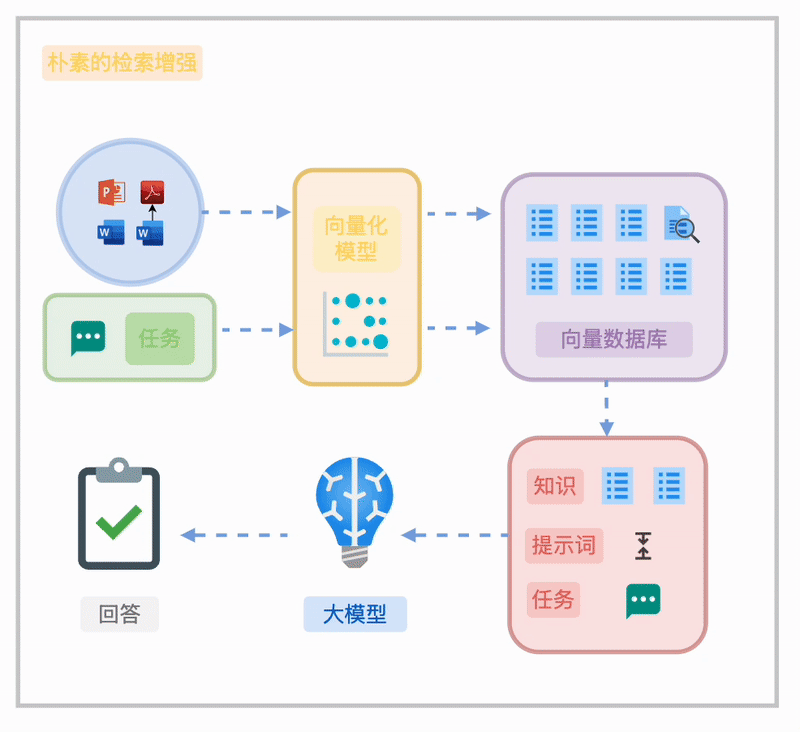

对于非结构化或半结构化知识，朴素 RAG 的典型流程包括：

- 将文档分割成块（Chunk）。   
- 通过向量化嵌入（Embedding）构建语义索引，或结合 BM25 全文索引实现检索。   
- 在任务执行时，基于任务需求直接检索或通过检索重写（如 HyDE）优化结果。 

然而，这种方法在知识组织上的局限性使其难以满足企业级需求，具体挑战将在下文详述。

#### RAG 的挑战

朴素 RAG 在实际应用中面临以下难题：  

- **大海捞针**：分块假设知识分布均匀，但某些关键信息可能被稀释在无关内容中，导致召回失败。  
- **穿针引线**：线性分割破坏了知识间的关联，难以还原全局上下文。  
- **宏观问题**：基于分片和关键词的索引无法有效应对全局性问题，如“哪些话题最具创新性”。  
- **文档理解不足**：缺乏智能文档处理时，公式、表格等复杂信息无法被正确解析和索引，影响回答质量。

#### 高级 RAG

做好 RAG 并非一蹴而就，而是一个持续探索的过程。本质上，我们需要将对应用特点、RAG 技术特性以及知识本身的深刻理解，融入到 RAG 流水线的设计之中。

下图展示了一个近期发布的高级 RAG 总结性工作的简化图例：[一个高级 RAG](https://github.com/bRAGAI/bRAG-langchain/raw/main/assets/img/rag-architecture.png)

可见，在现代高级的 RAG 方法中，数据持久化层包含 "Graph DB"（即图数据库，一种以图结构——“节点”和“边”为中心的数据库），而图数据库也正是本文主题 GraphRAG 的重要基础设施。

现代图数据库能够以高效、可扩展的方式驱动多租户、超大数据规模、高并发场景下复杂关联关系（图数据）的持久化、查询、访问和计算。它是高级 RAG 系统、智能体记忆系统（Agent Memory）的重要骨干基础设施，如下图所示。面向关联关系的图状结构，与我们梳理知识的脑图、甚至大脑中的神经元结构都非常相似。这种并非偶然的结构相似性，正是高级 RAG 知识索引解决朴素 RAG 方法挑战的关键。

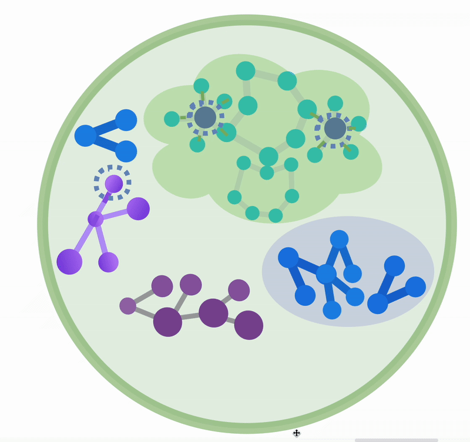

常见的高级 RAG 方法，在特别的索引结构上，包括树状索引（Tree-RAG）、分层检索（Raptor）和图状索引（GraphRAG），其中 GraphRAG 是我们文章的重点。

#### GraphRAG

GraphRAG 这个方法最初是我们在 2023 年 8、9 月份开始，在 LlamaIndex 社区上持续做的一些工作和两次[公开的 Webinar](https://bit.ly/graph-rag-workshop) 上提出，并给出了开源的实现和可复现的效果比较试验。

在最初的 GraphRAG 参考实践中，我们给出了索引期基于大模型的同构图谱抽取的实现和查询区基于实体、关系语义的捞取与可配置的子图查询的知识召回，并比较了基于 Text-to-Query 方法的一些效果比较与结合方案的实现。现在，为了区隔之后 Graph-based RAG 方法的演进，我们把最初的 GraphRAG 叫做 SubGraph RAG。

在当时的 workshop 上，我们分享过的两个观点是

- 在与知识打交道的过程中，只用分片处理的方法、绕过 Graph（Knowledge Graph）一定是不够的，这也是我们做 GraphRAG 探索的初衷
- 这个 GraphRAG 的方法仅仅是一个开始，我们在不断探索更多在 Graph 之上的探索、推理的策略

随后，我们和 [Researcher: Diego](https://www.linkedin.com/feed/update/urn:li:activity:7198589556848263168/) 一起讨论，做了图索引之上 Chain of Exploration 的工作，并在 PyCon China 2023 上第一次给出了做了 Chain of Exploration 的分享。

之后，我们看到了非常多的 GraphRAG 相关工作被发表，比如 [MIT 材料科学的两篇](https://arxiv.org/abs/2310.10445) 利用我们的工作的 MechGPT、海马体 RAG 利用 pagerank 权重的工作 [HippoRAG](https://arxiv.org/abs/2405.14831)、[LinkedIn 的利用 半结构化数据图建模的 RAG工作](https://arxiv.org/abs/2404.17723)都非常有启发性。

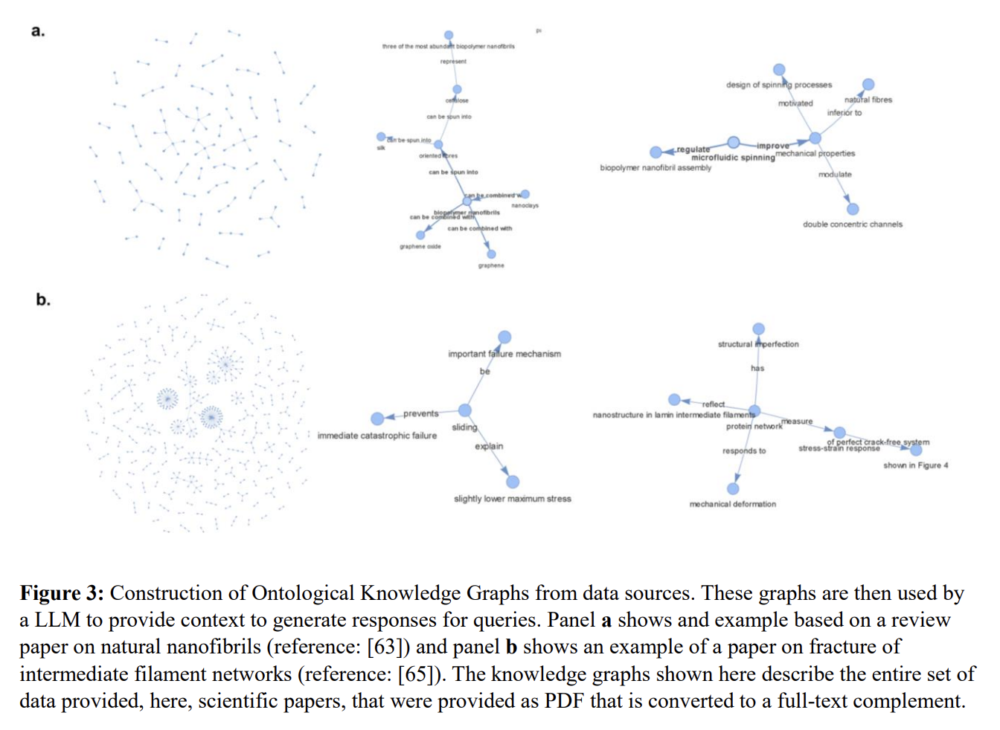

当然，最让我们兴奋的工作是微软的 [GraphRAG: From Local to Global](https://arxiv.org/html/2404.16130) 工作，他们充分探索了基于大模型抽取的知识图谱索引之上利用社区发现算法得到分级聚集结构下的全局性摘要，这些摘要是没有偏见的保有原始知识中天然聚集性质、重要性质的脉络知识，在回答带有宏观全局性的问题中效果非常好。

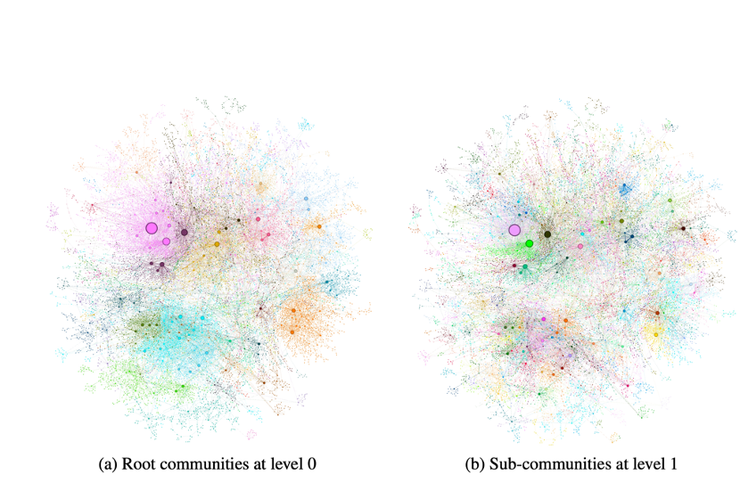

我们从这些后续的工作中受益匪浅，在与我们的客户 Graph based RAG 落地工作中，不断打磨、探索、累积了很多各个环节的优化、方法、策略。最终形成了我们称为 Fusion GraphRAG 的方案。

### Fusion GraphRAG

Fusion GraphRAG 是我们团队在 GraphRAG 基础上的创新实践。它融合了高级 RAG 技术，通过图状结构存储文档层级、章节关系及特殊元素（如公式、表格），实现高效、灵活的检索。

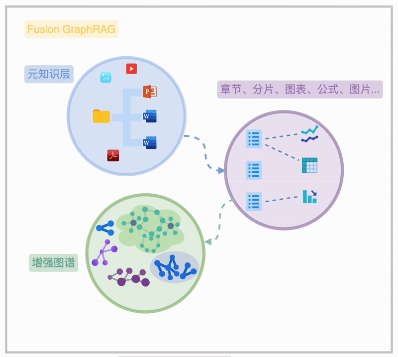

Fusion GraphRAG 的本质在于 Sota 的高级 RAG 方法融合、充分连接的元知识索引、充分打磨调优的 GraphRAG（可选索引）。

- Fusion GraphRAG 通过在一个联通图谱内的“元知识”索引，清晰地揭示海量知识文档的内在关联，呈现从文件夹、文档、章节到段落、图表、公式的完整脉络，此为知识图谱的“元知识频谱”。 

- 在此基础上，用户可选择不同粒度的知识抽取方法（非必须），构建图谱结构的图索引，形成“增强图频谱”。 

- 进一步，用户可以对图索引和元知识层进行诸如图摘要、权重分配、时序/状语信息补充等增强操作，以提升知识检索和利用的效率。

> 附图 FusionGraphRAG 结构实例

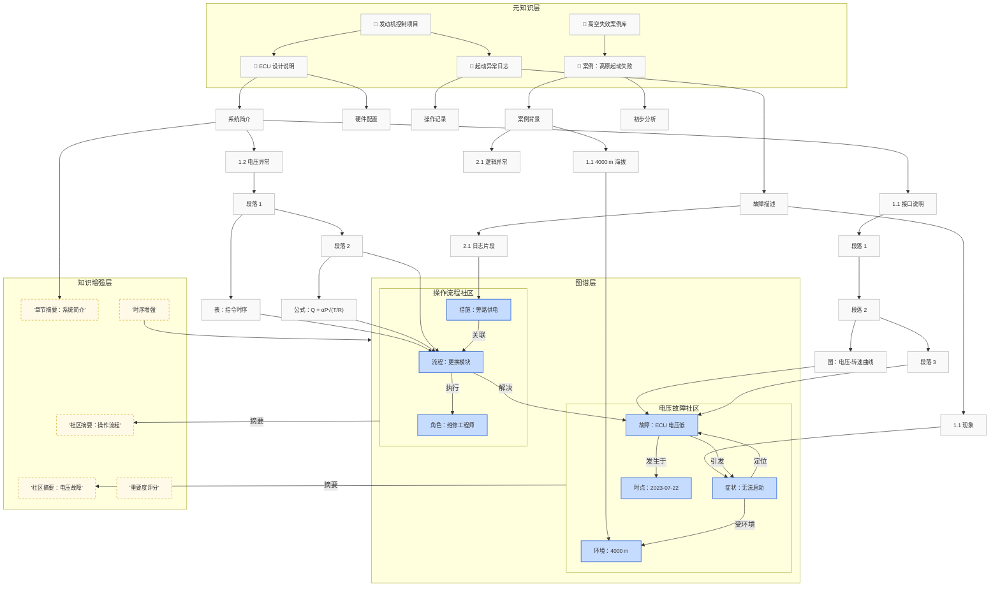

### Fusion GraphRAG 实现私域 Deep Research

Fusion GraphRAG 融合了先进的 IDP 技术与 RAG 索引方法，并将提取的多模态知识有机地关联为图状结构，从而精确映射真实世界知识的内在逻辑。依托高性能、支持图语义与向量检索的现代图数据库作为持久化底层，Fusion GraphRAG 能在这一统一图谱上实现面向元知识层次与图谱增强的高级检索。

例如：

- **多层级知识检索：**
  通过我们提出的 “Chain of Exploration” 检索器——一个能自主在图谱中探索并查找任务相关知识的智能 Agent，Fusion GraphRAG 可以在同时包含文件夹、文件层级以及章节（附摘要）结构信息的图谱上，既完成传统基于 Chunk 的检索任务，又能支持基于分层结构实现的脑图式 RAG 检索。（注：此方法不依赖昂贵的图谱抽取技术，后续将探讨如何进一步降低抽取成本。）
- **全局与局部深度分析：**
  通过引入图抽取与图社区摘要等增强手段，“Chain of Exploration” 能够在图谱上按需执行全局搜索以解决宏观问题，同时进行针对多个知识点的精准局部检索，甚至对涉及复杂关联的深度问题（如关键知识间路径查找）进行分析。
- **多 Agent 协同：**
  利用 Fusion GraphRAG 构建多 Agent 系统，可以将一整套算法与行为准则封装为一个专用的 Fusion GraphRAG Agent，此 Agent 可作为另一 RAG Agent 的召回计划生成器，在少而精的专业知识（know-how）构建的 Fusion Graph Index 指引下，自动规划出基于海量知识库的复杂查询方案。这为构建私有领域的自主学习 Deep Research/Action Agent 提供了有力支撑。
- **私有知识库内的深度研究：**
  在 Fusion GraphRAG 之上，我们可以轻松实现针对私有知识库的 Deep Researcher。依托天然的知识连接与索引，再结合针对 “Chain of Exploration” Agent 的优化提示工程，以及类似 DeepSeek R1 的推理模型，就能实现类似 Deep Researcher 的 RAG 召回效果，为深度研究提供强大动力。

### 回到 GraphRAG 时间线

在我们的视角下，GraphRAG 正在不断演进，下面简要梳理这一发展历程：

- **GraphRAG - 2023-08**
  NebulaGraph 在 LlamaIndex 社区首次提出并实现了基本的 GraphRAG 模型。
- **GraphRAG with Community Summary - 2024-04**
  微软在论文中提出了基于社区发现算法实现全局摘要的 GraphRAG 方法，为图谱检索提供了新的思路。
- **Fusion GraphRAG**
  - 融合了文档层级、章节层级、以及文中各类特殊元素（如公式、表格、图表）的多频谱混合图状索引；
  - 支持可选的知识抽取与知识增强（包括社区摘要、时序增强等），构建混合层级结构查询、全局图召回、知识频谱图谱召回以及（可选） Chain of Exploration 检索；
  - 同时支持将公共知识图谱、现有知识图谱以及图状数据中的 Chain of Exploration 召回方法进行融合。

### 图抽取

需要指出的是，在大模型时代，对原始知识进行类似知识图谱的抽取并非 Fusion GraphRAG 的必选项，因为并非所有 RAG 任务都需要细粒度的“知识预习”。图抽取的代价较高，目前多数公开方案成本也不低。

> 注：LazyGraphRAG 的相关工作同样值得关注，它提供了另一种优化思路。

> 附：Fusion GraphRAG 的索引及增强流程示意图

### 让图抽取成为默认策略

高质量的 GraphRAG 索引虽然效果显著，但成本昂贵。我们的终极目标是让图抽取的成本降低到与 Embedding 类似的水平，实现大规模普及。

实际上，AI 技术社区（包括我们自身）已经在朝这一方向不断努力：利用 NER 模型、更小型（例如 Phi 系列）的 LLM 进行 SFT、小规模 LLM 的 few shot 方案、尽可能的可编程方法，甚至融合 NER 与 LLM 的多种方案，都是当前探索的方向。最近，我们也看到了一些令人振奋的曙光！

本质上，我们探索的基于 LLM 的抽取方法都采用了不同形式的 CoT（思维链）策略。近期，DeepSeek-MATH 论文中首次提出的 GRPO 方法在 DeepSeek R0 中用于冷启动获取 Think-aloud（思考过程）的深度 CoT 能力表现非常出色。同时，我们注意到基于 Qwen2.5（小尺寸 0.5b 模型）进行 GRPO 训练，在需要强推理能力的任务（例如数学问题）上，通过大约 200 步训练就能获得令人满意的效果。

结合这些观察，我们开展了如下探索：

- **数据收集与预处理：**
  利用 DeepSeek R1，在挑选的最新原始知识数据（晚于模型 cut-off date）的基础上进行抽取任务，并开启 `<think>` 模式，收集高质量的 CoT 与图抽取的 Ground Truth，筛选掉质量不合格或思考过程过长的样本，作为训练数据。
- **奖励机制设计：**
  基于开源社区中针对数学问题推理训练的 GRPO 奖励函数，我们设计了奖励高质量推理过程和高质量抽取结果的奖励函数。这两项奖励均依托高质量、低成本的指令大模型进行评估打分。

在一块 A100 显卡上经过约 200 步训练后，我们初步评估结果显示：基于 Qwen2.5-3b 的小尺寸抽取模型在引入 GRPO 训练后，其性能已经超越了 GPT-4o-mini。以下是各模型的对比结果：

| **Criterion**    | **qwen2.5-3b** | **qwen2.5-3b-GPRO** | **gpt-4o-mini** |
| ---------------- | -------------- | ------------------- | --------------- |
| **Accuracy**     | ⭐⭐☆☆☆          | ⭐⭐⭐☆☆               | ⭐⭐☆☆☆           |
| **Completeness** | ⭐⭐☆☆☆          | ⭐⭐⭐⭐☆               | ⭐⭐⭐☆☆           |
| **Coherence**    | ⭐⭐☆☆☆          | ⭐⭐⭐☆☆               | ⭐⭐☆☆☆           |
| **Relevance**    | ⭐⭐⭐☆☆          | ⭐⭐⭐⭐☆               | ⭐⭐⭐☆☆           |

正如当初推出首个 GraphRAG 开源实现时一样，这项工作仅仅是个起点。它证明了图抽取技术成本正在不断降低，未来我们有望大胆应用于更多场景，实现大规模的知识 GraphRAG。与此同时，这个方法也为特定领域范式数据抽取质量的提升提供了经济可行的方案。

> 训练数据、合成过程以及训练流程均已开源：https://github.com/wey-gu/grpo-graph-extraction 。

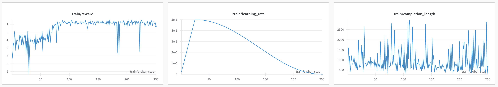

### RAG 应用落地的挑战

众所周知，RAG 更多的是一种技术和功能，而非一个完整的产品。在企业级应用中，产品形态本身所面临的挑战，往往远超技术或原理上的难题。

举个例子，Excel 电子表格软件凭借其公式计算和数据可视化功能，为会计和企业数据处理领域带来了颠覆性的变革。理论上，只需学习 Excel 中的各类公式和图表功能，就能获得大量实战经验，成为专业的数据分析师。但实际上，我们观察到，大多数企业员工仅仅熟悉 Excel 的基本操作，而许多昂贵且高级的 SaaS 产品，其功能实际上也不过是 Excel 部分能力的延伸。

如果基于 RAG 能力构建的企业产品，只是一个具备强大应用编排和知识库索引能力的“无代码”平台，那么这样的平台很可能只能在企业内部的少部分用户或团队中落地。大部分宝贵的领域知识仍停留在个人或小圈子中，无法以智能高效的方式被全面激活和利用。

为了解决这一问题，我们基于 FusionGraphRAG 与 Agentic RAG 技术，打造了一个全新的高级知识库与低门槛应用平台 —— NebulaGraph AI 应用平台（内部命名为 “Catalyst”，即催化剂）。该平台的核心设计理念包括：

- **无需构建复杂 Workflow：** 用户不需要自行搭建工作流。
- **无需编写繁琐 Prompt：** 用户无需学习复杂的指令语法。
- **简化知识定义：** 用户只需将对私有知识的理解转化为对不同“知识篮子”的定义。
- **智能对话交互：** 用户通过与我们的“元智能体”交流，传达解决问题的方法。

这种设计大幅降低了使用门槛，使得企业内部的知识能够被更高效、更智能地激活与应用，真正实现“插上翅膀”的飞跃。

### AI 应用平台

在这个平台中，企业用户可以将成百上千个文档轻松归入各自的知识“篮子”，并为每个篮子选择适合的“预学习”——即索引模式：

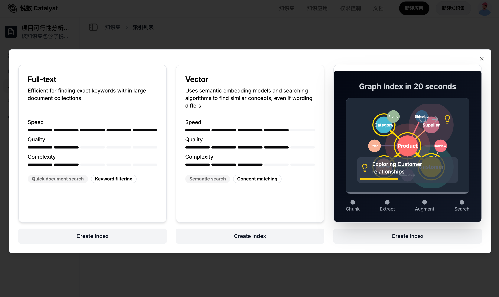

- **知识探索**
  用户可以随时在各个知识篮子中进行探索，快速定位所需信息，直观理解知识集合内的知识分布、深浅、特种。

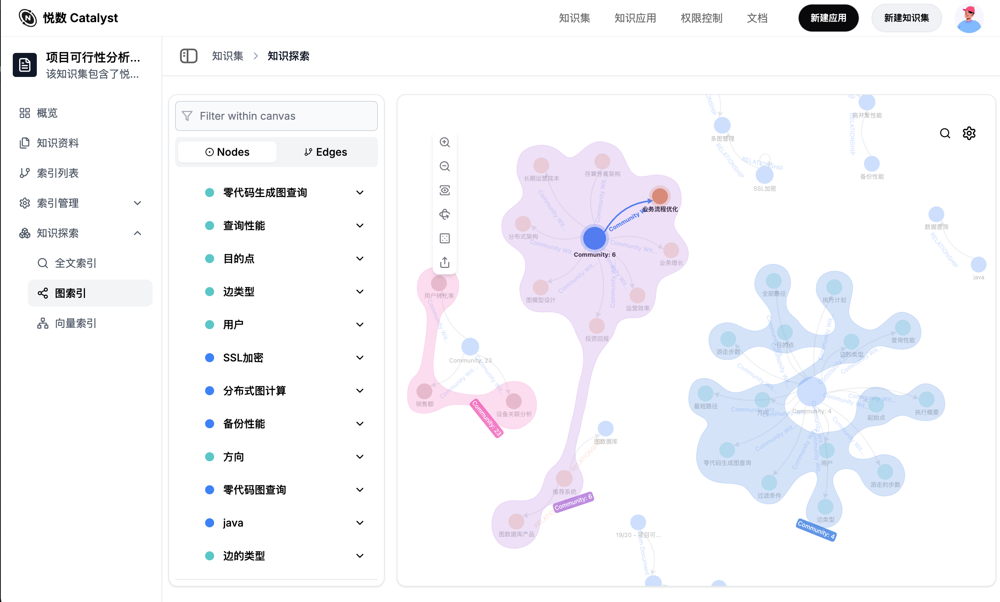

- **智能应用生成**
  用户无需亲手编写复杂的 prompt，只需通过对话的方式与平台互动，即可生成各种类型的智能应用、迭代沉淀应用的 prompt。例如：

  - “帮我构建一个投研报告生成助手”

  - “我要做一个 xx 申报助手”

  - “基于我所有的周报知识，构建一个 yy 领域回答助手，我想放到钉钉签名上，免得别人来烦我关于 yy 的问题”
    ……

  平台内置了生成智能体应用的“元智能体”，让对话即成为开发工具。

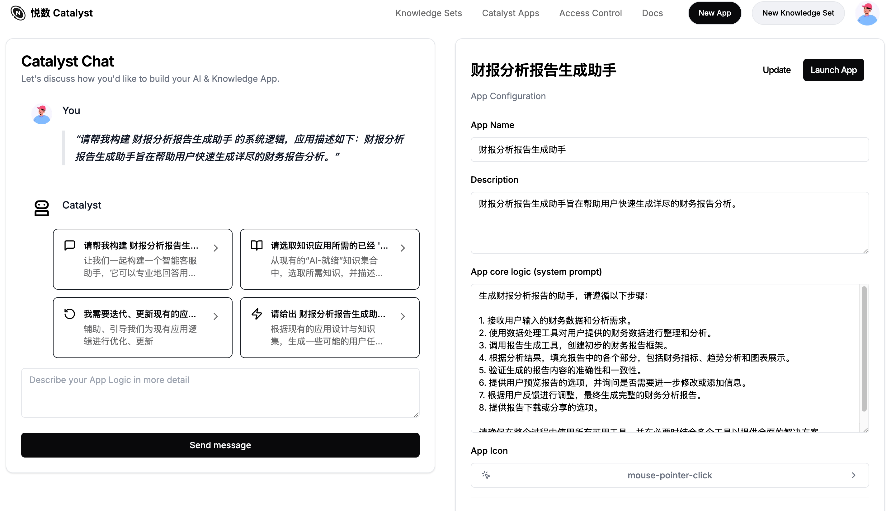

- **问答搜索应用**
  平台支持构建问答型搜索应用，帮助用户快速获得精确答案。

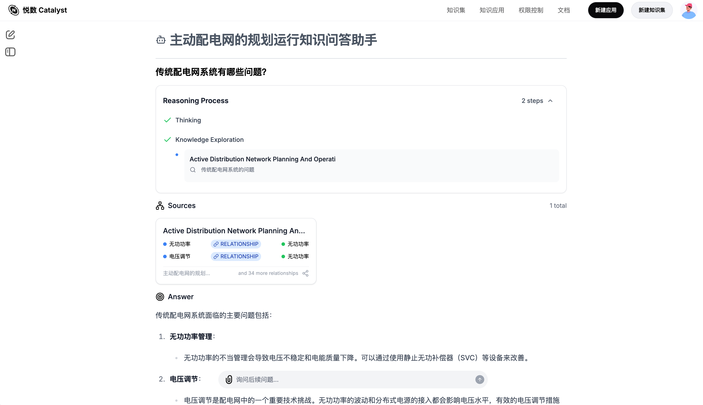

- **知识溯源**
  同时，针对问答应用，基于连接的知识溯源，追踪答案的来源，确保信息透明可靠。

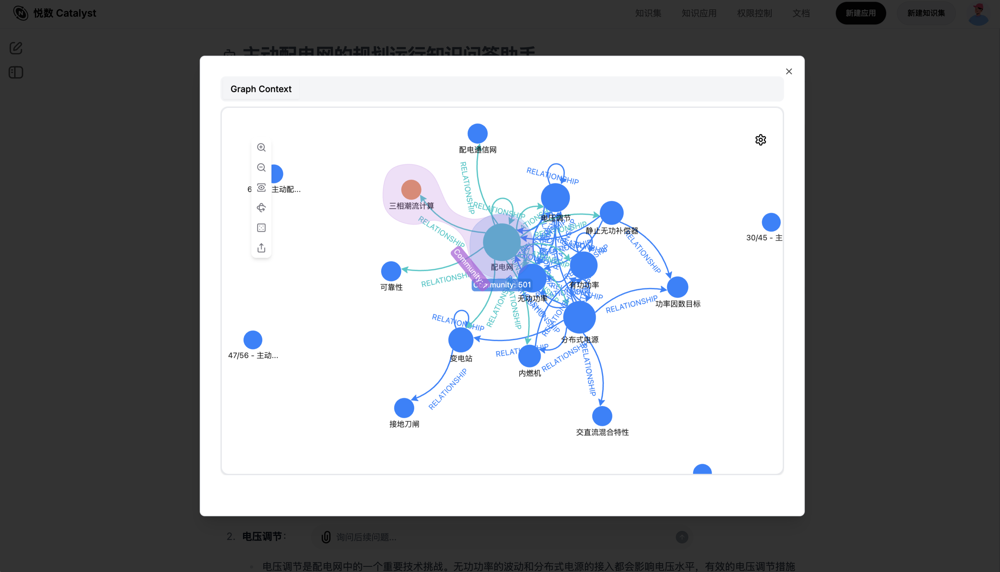

### 总结

GraphRAG 的发展代表了 RAG 技术从基础检索向高级知识管理的演进。通过解决传统 RAG 在知识稀释、关联丢失和宏观问题上的挑战，GraphRAG 为企业级应用提供了更高效、灵活的解决方案。我们团队开发的 Fusion GraphRAG 融合了智能文档处理（IDP）、多层次知识索引和图状结构，将知识的内在关联映射到检索过程中，显著提升了复杂任务的处理能力。 

在实践中，我们通过优化图抽取成本（R1 知识蒸馏、 GRPO 方法、 Qwen2.5-3B 规模上的工作，并开源出来。），让 GraphRAG 技术更具经济可行性，使其能够广泛应用于企业知识管理和智能应用平台。

未来，我们相信 GraphRAG 将成为高级 RAG 和智能体记忆（Agent Memory）的核心基础设施，推动深层研究和智能决策的进一步发展。NebulaGraph AI 应用平台的推出，正是这一愿景的初步实现。

最后，对于 GraphRAG，这是 Sherman 和我们 GenAI team 每一位同学共同相信的观点：

- 狭义的 “GraphRAG”、甚至 “SubGraph RAG”，在特定场景仍然有优势，我们可以按需应用这个技术组合
- Deep Research, Deep Search 的形态与 Graph-based RAG 方法，尤其是 Fusion GraphRAG 可以形成很好的互补

- Graph Infra 是高级 RAG/Agent Memory 中不可绕过的结构与方法（Graph is inevitable in Advanced RAG），是以向量为基础的 RAG 的重要演进与互补

