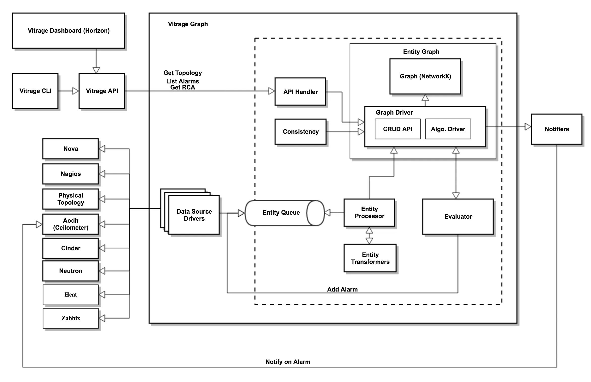

# 图数据库驱动的基础设施运维示例


> 图技术在大型、复杂基础设施之中 SRE/DevOps 的实践参考，本文以 OpenStack 系统之上的图数据库增强的运维案例为例，揭示图数据库、图算法的智能运维方法，全流程示例代码开源。

<!--more-->

因为有一些还未采用图技术的 DevOps/Infra 领域同学在 NebulaGraph 社区询问参考的案例，我最近试着实践了一下如何利用图的能力与优势去帮助在复杂基础设施上构建辅助运维系统，希望能帮助到感兴趣 Infra Ops 领域、同时感兴趣图数据库、图算法的大家，全过程都是可以复现、并且开源的。

复杂的基础设施运维环境通常包含非常多、不同层面的资源（manifest)，为了能够尽量还原真实世界的复杂环境、又保持这个实例项目的复杂度不会失控，我选择了用一个基础设施平台：OpenStack 作为例子。

本文实现了 OpenStack 系统上分别利用 Push 和 Pull 两种模式将资源之中被图谱建模的图中点、边信息加载到 NebulaGraph 里的 Graph ETL 管道的路径。

在图谱之上，本文探索如下用例：

- 告警、状态的推理与传导；
- 网络直连与互联关系；
- 镜像、云盘、快照血缘管理；
- 高相关性虚机预警；
- 秘钥泄漏的图上风控分析；
- 镜像、云盘漏洞范围分析；
- 宿主机逃离影响范围分析；
- 脆弱依赖资源检测；


## 试验环境搭建

### 背景知识

OpenStack 是一个开源的云计算平台，提供了类似于 AWS 的云服务。它提供了一组可插拔的模块，包括了计算，存储和网络等功能，可以帮助用户构建和管理云环境。OpenStack采用分布式架构，支持多种操作系统和硬件平台，可以在企业级和服务提供商级环境中使用。


最初由 *NASA* 和 *Rackspace* Inc. 发起的 nova （虚拟化计算项目）和 swift （兼容 S3 的对象存储）项目组成，OpenStack 现在由非常多不同的子项目组成：


本实验中，我们设计的 OpenStack 主要项目有：

- Nova 是 OpenStack 的计算服务，用于管理虚拟机。
- Cinder 是 OpenStack 的块存储服务，用于管理云存储。
- Neutron 是 OpenStack 的网络服务，用于管理云网络。
- Glance 是 OpenStack 的镜像服务，用于管理云镜像。
- Horizon 是 OpenStack 的可视化控制台服务。

除此之外，我还引入了 Vitrage 项目辅助我们收集部分资源数据：

- Vitrage 是 OpenStack 中的一个高级分析和可视化工具，用于分析和可视化 OpenStack 环境中的资源和事件。它可以汇集来自 OpenStack 各个服务的数据，并使用图形化方式展示出来。Vitrage 发现和诊断问题，提高 OpenStack 环境的可用性和可维护性。

得益于 OpenStack Decouple 的设计理念，Vitrage 可以很容易、无侵入式（只需要修改需要收集的服务两行配置）就可以在 OpenStack 的消息队列中订阅资源信息的 push 消息。

不过比较遗憾的是 Vitrage 这个项目已经有好多个 release cycle 没有什么大的更新了，应该是比较不活跃的状态了，比如在 zed 里，它的 Vitrage Dashboard 作为 Horizon 插件已经无法正常工作了，本实验只利用它的资源收集能力。

### 环境准备搭建

#### NebulaGraph 集群

首次快速试玩安装 NebulaGraph 的话，有这么几个选项：

- 阿里云上的 NebulaGraph 企业版（带有企业版独有的满血版可视化工具：Explorer，可以图探索、画布内跑图算法），可以获得一个月所有资源免费使用资格：
  - 访问 https://www.siwei.io/try-aliyun 获得
- Nebula-Up 一键安装 NebulaGraph 开源社区版本，需要一个带有 Docker、Docker Desktop 环境的机器
  - 访问 https://github.com/wey-gu/nebula-up
- 有经验的同学可以参考文档进行部署：
  - 访问 https://docs.nebula-graph.com.cn/

#### OpenStack 集群

> 注意：如果大家已经有现成的 OpenStack 集群，这一步可以忽略，您只需要再去安装 OpenStack Vitrage 就好了。

本文需要的 OpenStack 集群是一个多机的环境，为此，我准备了在 Linux Server 上利用 Libvirt 和 Linux Bridge 搭建多个虚拟机用来模拟 OpenStack 的物理机，得益于 CPU 的嵌套虚拟化和 qemu，后边我们完全可以在虚拟机搭建的实验环境中模拟可正常工作的 OpenStack nova instance 虚机。

整个流程我都放在 https://github.com/wey-gu/openstack-graph/#environment-setup 这里了，感兴趣的同学可以访问、获取。

虚拟机搭建之后，我们还需要模拟真实的 Infra 环境，创建很多资源：整个过程也在 https://github.com/wey-gu/openstack-graph/#create-resources-on-openstack 有详细列出，想要动手操作的同学可以参考来亲自上手一下。

参考如上步骤操作之后，我们应该可以通过 Horizon Dashboard 查看集群和资源：

我们创建了几个虚拟机：

几个网盘，其中四个挂载在不同的虚拟机上


集群租户的网络拓扑：

我们还能通过 OpenStack Vitrage 的 API/CLI 获得部分主要资源的拓扑：

```bash
source openrc admin admin
vitrage topology show --all-tenants
```

它的结果是一个 JSON，里边已经按照边（links）和点（nodes）序列化图结构的数据了。

```json
{
  "directed": true,
  "graph": {},
  "links": [
    {
      "vitrage_is_deleted": false,
      "relationship_type": "contains",
      "source": 0,
      "target": 11,
      "key": "contains"
    },
    {
      "vitrage_is_deleted": false,
      "relationship_type": "contains",
      "source": 0,
      "target": 13,
      "key": "contains"
    },
...
    {
      "vitrage_is_deleted": false,
      "relationship_type": "attached",
      "source": 27,
      "target": 28,
      "key": "attached"
    }
  ],
  "multigraph": true,
  "nodes": [
    {
      "id": "node0",
      "vitrage_type": "nova.host",
      "vitrage_category": "RESOURCE",
      "vitrage_is_deleted": false,
      "update_timestamp": "2023-01-13T08:06:48Z",
      "vitrage_sample_timestamp": "2023-01-13T08:06:49Z",
      "vitrage_is_placeholder": false,
      "vitrage_id": "630b4c2c-5347-4073-91a3-255ec18dadfc",
      "name": "node0",
      "vitrage_cached_id": "d043d278a6a712909e30e50ca8ec2364",
      "is_real_vitrage_id": true,
      "vitrage_aggregated_state": "AVAILABLE",
      "vitrage_operational_state": "OK",
      "vitrage_datasource_name": "nova.host",
      "state": "available",
      "graph_index": 0
    },
    {
      "id": "nova",
      "vitrage_type": "nova.zone",
      "vitrage_category": "RESOURCE",
      "vitrage_is_deleted": false,
      "vitrage_sample_timestamp": "2023-01-12T03:06:48Z",
      "vitrage_is_placeholder": false,
      "vitrage_id": "a1e9c808-dac8-4b59-8f80-f21a90e9869d",
      "vitrage_cached_id": "125f1d8c4451a6385cc2cfa2b0ba45be",
      "is_real_vitrage_id": true,
      "vitrage_aggregated_state": "AVAILABLE",
      "vitrage_operational_state": "OK",
      "state": "available",
      "update_timestamp": "2023-01-12T03:06:48Z",
      "name": "nova",
      "vitrage_datasource_name": "nova.zone",
      "graph_index": 1
    },
...
  "raw": true
}
```


## 图谱建模

本实验环境中，我们考虑纳入如下资源进入图谱：

- nova instance: 是Nova服务中的虚拟机实例，每个nova instance都有自己的配置信息（如CPU、内存、磁盘等），有时候我们就叫它 server 或者 VM、虚机。
- nova host是Nova服务中的物理主机，是nova instance运行的物理环境。nova host上面会运行nova-compute服务，这个服务负责管理和调度nova instance。nova host上面还可能运行其他服务，如网络服务等。
- nova keypair: 是Nova服务中的密钥对，用于访问nova instance
- cinder volume: 是Cinder服务中的云存储卷，可以 attach 到nova instance上做为硬盘
- cinder snapshot: 是Cinder服务中的云存储快照，可以在cinder volume上做快照
- glance image: 是Glance服务中的镜像，可以作为创建nova instance时候的启动硬盘
- neutron network: 是Neutron服务中的网络，可以用于配置nova instance的网络连接
- neutron port: 是Neutron服务中的端口，用来连接nova instance和neutron network之间，在 nova instance 虚拟机上，一个 port 常常对应一个网卡（如果不是 trunk port 的话）。

他们之间的关系如下：


## 基础设施图 ETL

接下来我们解决从基础设施中抽取资源元数据的问题，

### push 模式

这里的 push 指的是基础设施为主语，从资源方向我们的图谱系统主动、事件驱动地发出资源变动的信息。它的好处是资源中的实时性好，但是坏处是依赖基础设施自身，很多非常瘦的、软件定义/可编程程度不高的组件、比如某些硬件设备没有 push 机制，或者像是古老的软件系统不一定能存在 push 的接口，改造起来有侵入性。

前边提及过，OpenStack 自身是存在 Push hook 的机制的，它的子项目 vitrage 就利用这个机制很优雅地收集系统资源、告警等信息进入图中，类似的机制在其他平台中也是可以实现的。

本实验中我们就利用 vitrage 的机制去收集一部分图谱中的资源信息，如下图，可以看到 vitrage 会在 OpenStack message bus 中订阅 nova/cinder/neutron 等服务中的资源时间，把事件传入 Entity Queue，经过处理，存储到 Entity Graph 中。

在此之上，我们可以通过 vitrage API 获取图谱的拓扑，来消费它。

> 注意：实际上 Vitrage 服务还提供了推理告警、推理状态、定义决策事件的能力，这里我们并没有采用，后边我们在图上做的一些事情甚至还和它的能力有一些重叠。



这里我只是用它来展示 push 模式的工作机制，如果没有 Virtrage 这个项目存在，我们也可以比较容易通过 OpenStack 的 oslo.messaging 这个库很容易写出在 Message Bus（可能是 Kafka, RabbitMQ 等不同底层实现）上订阅资源时间的应用，然后把事件通过 Flink/ Kafka/ Pulsar 等方式接驳 NebulaGraph。

因为 Vitrage 的存在，我就偷懒不用去实现这部分逻辑，只消写一小部分代码调用 Vitrage API 取这个数据就可以了，讽刺的是，从这个角度来看，这其实是一种 pull 的模式了，不用拘泥它本质上算是哪一种方式，至少在资源发起测，我们把它当做 push 模式的例子看待吧。

这部分从 Vitrage 抓取的代码我放在 https://github.com/wey-gu/openstack-graph/blob/main/utils/vitrage_to_graph.py 了，调用方式很简单，在有 OpenStack 客户端的环境中，执行它就可以了，比如：

```bash
# 连到 node0 上
ssh stack@node0_ip

# 进入 devstack 目录
cd devstack

# 下载 vitrage 中图数据，解析为 NeublaGraph DML/DQL 的工具
wget https://raw.githubusercontent.com/wey-gu/openstack-graph/main/utils/vitrage_to_graph.py

# 执行它
python3 vitrage_to_graph.py
```

执行之后，会生成如下文件：

- `schema.ngql` 图数据的 Schema 定义
- `vertices/` 点数据的文件夹
- `edges/` 边数据的文件夹

### pull 模式

反过来，pull 模式是从资源外部定期或者事件驱动地拉取资源，存入图谱的方式。刚好本实验中 vitrage 抓取的资源是有限的，有一些额外的资源我单独写了 python 的代码来主动全量抓取，pull 模式的好处是对资源方没有任何侵入性，只需要调用它的接口获取信息就可以了，坏处则是有的系统不太容易获得增量变化，可能只能全量去取。

这部分我抓取的关系如下：

- glance_used_by: `image -[:used_by]-> instance (get from instance)`
- glance_created_from: `image -[:created_from]-> volume (get from image)`
- nova_keypair_used_by: `keypair -[:used_by]-> instance (get from instance)`
- cinder_snapshot_created_from: `volume snapshot -[:created_from]-> volume (get from snapshot)`
- cinder_volume_created_from: `volume -[:created_from]-> volume snapshot (get from volume)`
- cinder_volume_created_from: `volume -[:created_from]-> image (get from volume)`

类似的，它的代码放在 https://github.com/wey-gu/openstack-graph/blob/main/utils/pull_resources_to_graph.py 之中，在真实场景下，我们可能会用 Apache Airflow、dagster 甚至是 cron job 等方式定期执行它。

我们手动执行的方式也很简单：

```bash
# 连到 node0 上
ssh stack@node0_ip

# 进入 devstack 目录
cd devstack

# 下载抓取 OpenStack 资源，生成 NeublaGraph DML/DQL 的工具
wget https://raw.githubusercontent.com/wey-gu/openstack-graph/main/utils/pull_resources_to_graph.py.py

# 执行它
python3 pull_resources_to_graph.py
```

执行之后，会生成点、边的 ngql 语句在两个文件夹下：

- `vertices/` 点数据的文件夹
- `edges/` 边数据的文件夹

### 加载数据到 NebulaGraph

我们只需要在 NebulaGraph Studio Console, Explorer Console 或者 NebulaGraph 命令行 Console 中执行上边生成的 `.ngql` 文件就好了：

```bash
# DDL from vitrage
cat schema.ngql

# DDL and DML for both push and pull mode data
cat edges/*.ngql
cat vertices/*.ngql
```

之后，在 NebulaGraph 中我们会有一个叫做 `openstack` 的图空间，用这个查询可以查到所有数据：

```cypher
MATCH (n) WITH n LIMIT 1000
OPTIONAL MATCH p=(n)--()
RETURN p, n
```

然后渲染在 explorer 中，手动设置一下数据的图标，就可以看到我们 OpenStack 集群里的所有租户的资源图了：


接下来我们终于可以在图上看看有意思的洞察了。

## 基于图谱的基础设施运维示例

作为非 SRE、DevOps 人员，我尝试藉由自己在 OpenStack 和图技术的理解想象出下边的一些实例，希望能帮助到需要的读者们。

### 告警、状态的推理与传导

这部分我收到了 vitrage 项目的启发，参考它们给出的实例文档：[这里](https://github.com/openstack/vitrage/blob/master/doc/source/contributor/vitrage-templates.rst)。

借助资源图谱实时图查询、图计算甚至图可视化能力，我们可以在图上推理、传导一些信息，把重要的时间藉由图上组织好的知识分发到需要收到通知的人、组织、系统。

一个简单的例子是，比如我们在 nova host（虚拟机的宿主机、hypervisor 机器，以下简称宿主机），中获得了一个告警、事件的时候，可能是网卡失败、物理硬盘预警、CPU占用过高之类的告警。我们可以借助图谱查询获得所有相关联的虚机，然后把（WARN）级别的告警发出去或者设置它们为（亚健康）的状态。

这样，获得通知的对象，往往是一些用户的系统，就可以根据他们预先定义好的策略做一些自动化运维，或者通知的 hook：

- 收到“宿主机 CPU 过高”的告警的情形下，可以根据用户自己设定的不同策略把虚机迁移走，或者更高级复杂的撤离方式（开始不接受新的 traffic，创建新的替代 workload，然后 gracefully 关闭这个 workload）
- “控制面网络故障”告警情况下，这时候往往无法成功进行主机的车里、迁移，故可以考虑触发备份主机、启动新 workload、关机
- 其他“（亚健康）状态”，可以作为负载层面出问题的根因分析（RCA）依据

下边，我们给出一个在图谱上进行告警、状态传导的查询例子，我们假设 vid 为 `node0` 的宿主机出现了高 CPU 的告警，则这个查询可以得到所有其上的虚机，获得时间、告警通知列表：

```cypher
MATCH (vm:nova_instance)<-[:`contains`]-(host_CPU_high:nova_host)
    WHERE id(host_CPU_high) == "node0"
RETURN vm.nova_instance.name AS VM_to_raise_CPU_alarms
```

这其中查询的图模式是从 `host_CPU_high` 这个 `nova_host` 向外经由 `contains` 这个关系指向 `vm` 这个 `nova_instance` 的：

```cypher
(vm:nova_instance)<-[:`contains`]-(host_CPU_high:nova_host)
```

它的结果是：

| VM_to_raise_CPU_alarms |
| :--------------------- |
| server-4               |
| server-3               |
| server-1               |
| server-0               |

 如果我们把查询改动一下，选择输出全路径，则可以看到这个信息传导的方向：

```cypher
MATCH p=(vm:nova_instance)<-[:`contains`]-(host_CPU_high:nova_host)
    WHERE id(host_CPU_high) == "node0"
RETURN p
```

在 Explorer 中渲染，点击 N 跳检测：

<video width="800" controls>
  <source src="https://user-images.githubusercontent.com/1651790/212291702-1754c9ce-f23f-4a68-930c-07a587c113be.mov" type="video/mp4"> 
</video>

第一个例子比较简单，甚至不是很有必要用图的能力（这种因为一跳查询表结构中也是很轻松地，我们用一两个 nova API call 就可以搞定等价的信息获取了），这里只是一个例子，实际上我们在图上可以做很多更 Graphy（具有图属性的）、复杂、独特的工作，我们慢慢来看。

### 网络可达检测

我们来考虑这样的场景，在 OpenStack 中，不同的主机可以连接到相同的子网（VPC），主机也可以连接到多个子网之中，这样，主机之间的网络连通性信息、与网络联通相关的推理、传导都可以在图上进行。

> 注：在真实世界中，这里可能还要考虑 Security Group、Router、Switch 等因素，本利中我们用到的 OpenStack 是 L2 only 的 Setup，比较简化。

获得与虚机 `server_a` 同一 VPC 的所有其他虚机看起来很容易表达了：

```cypher
MATCH (server_a)--(:neutron_port)--(:neutron_network)--(:neutron_port)--(server_b:`nova_instance`)
    WHERE id(server_a) == "server-0"
RETURN server_b.nova_instance.name AS L2_connected_server
```

结果如下：

| L2_connected_server |
| :------------------ |
| server-1            |

看起来很初级呀，接下来我们再查询与虚机 `server_a` 同一 VPC、或者有可能通过跨网络虚机而互联的主机的所有其他虚机，这时候，我们除了共享 neutron network(VPC) 的情况，还要查询所有二层直连的虚机可能通过其他 VPC 连出去的的虚机，这里，我们用到了 `OPTIONAL MATCH` 的表达，表示可能匹配到的模式：

```cypher
MATCH (server_a)--(:neutron_port)--(net:neutron_network)--(:neutron_port)--(server_b:`nova_instance`)
    WHERE id(server_a) == "server-0"
OPTIONAL MATCH (server_b)--()--(other_net:neutron_network)--(:neutron_port)--(server_c:`nova_instance`)
    WITH server_a, server_b AS same_subnet_machines, server_c AS routeable_machines WHERE routeable_machines != server_a

RETURN same_subnet_machines.nova_instance.name AS L2_connected_server,
       routeable_machines.nova_instance.name AS cross_vpc_server
```

可以看到结果里，跨网络潜在的相连主机还有 server-3：

| L2_connected_server | cross_vpc_server |
| :------------------ | :--------------- |
| server-1            | server-3         |

我们将其可视化，同样，修改输出为路径 `p` 和 `p1`。

```cypher
MATCH p=(server_a)--(:neutron_port)--(net:neutron_network)--(:neutron_port)--(server_b:`nova_instance`)
    WHERE id(server_a) == "server-0"
OPTIONAL MATCH p1=(server_b)--()--(other_net:neutron_network)--(:neutron_port)--(server_c:`nova_instance`)
RETURN p, p1
```

它可能的连接路径一目了然


有了获得这些信息的能力，我们可以可编程地连接告警、状态、安全风控、网络等方方面面系统了，因为这不是本文的重点，这里就不加以赘述了，欢迎大家来 NebulaGraph 社区分享你们的图洞察使用方式。

接下来我们来看看存储相关的例子。

### 镜像、云盘、快照的血缘

在基础设施中，云盘（iSCSI、Ceph、NFS）、镜像、快照之间有多重复杂的关系，比如：

- 一个系统镜像可能从某一个虚拟机挂载的云盘或者一个快照创建
- 一个云盘可能是从一个系统镜像、一个快照或者另一个云盘创建
- 一个快照是从一个云盘创建的

这种血缘信息的识别和管理是很有必要的。下边的查询可以获得给定的虚机 `server-0` 的所有存储血缘：

```cypher
MATCH p=(server_a)-[:`attached`|created_from|used_by]-(step1)
    WHERE id(server_a) == "server-0"
OPTIONAL MATCH p1=(step1)-[:created_from*1..5]-(step2)
    RETURN p, p1
```

我们可以看到结果中：

- `server-0` 的启动镜像（这里它是从本地盘启动的，没有挂载云盘）是从 `volume-1` 创建的
- `volume-1` 是从 `cirros-0.5.2-x86_64-disk` 这个镜像创建的
- 此外，还有其他有分叉关系的存储资源和他们也息息相关


接下来，我们不只考虑存储资源，再看看涉及云盘（cinder_volume）挂载（attached）这层关系下的血缘关系：

```cypher
MATCH p=(server_a)-[:`attached`|created_from|used_by]-(step1)
    WHERE id(server_a) == "server-4"
OPTIONAL MATCH p1=(step1)-[:created_from|attached*1..5]-(step2)
    RETURN p, p1
```

这次，我们可以从渲染图中读出这样的洞察：

- `server-4` 的启动镜像（这里它是从本地盘启动的）是从 `volume-1` 创建的
  - 而 `volume-1` 现在挂载在 `server-6` 上
  - `volume-1` 是从 `cirros-0.5.2-x86_64-disk` 这个镜像创建的
  - 同样 `cirros-0.5.2-x86_64-disk` 镜像被很多其他虚机在采用
- `server-4` 同时挂载了数据盘 `volume-2`
  - 而 `volume-2` 是一个多挂载的盘，它同时挂载在 `server-3` 之上
  - `server-3` 的系统启动盘是从快照 `snapshot-202301111800-volume-1` 克隆创建的
  - 快照 `snapshot-202301111800-volume-1` 是曾经从 `volume-1` 创建的
  - `volume-1` 现在挂载在 `server-6` 上
    - 快照不一定是从 `server-6` 而来，因为镜像可能被重新挂载过


而这些血缘信息可以被用在资源生命周期管理、根因分析、安全告警、状态传导上，这里不加以赘述。

### 高相关性虚机预警

下面再给一个节点相似度的应用，我们可以在全图或者子图上，利用图算法找到与一个虚机在图上关系的维度上最相似的其他虚机，基于在这种相关性增加新的关系，并在关系上做风险事件预警。

这次的图算法应用中，我们按照一个典型的从[快速子图验证]到[全图生产应用的]工作流。

#### 在子图上快速验证：浏览器内算法

首先，我们试着从 `server-0` 的三度子图上做算法的验证。

```cypher
GET SUBGRAPH 3 STEPS FROM "server-0"
YIELD VERTICES AS nodes, EDGES AS relationships;
```

将结果渲染在画布上，我们可以看到子图中包含了其他几个虚机：


然后，我们利用 explorer 中的浏览器内图算法，可以非常方便地验证我们的想法，这里，我们使用 Jaccard SImilarity 相似性算法，进行 `server-0` 与 `server-1,server-3,server-4,server-6` 迭代分别得到相似性：


可以看出，在 3 步子图内，和 `server-0` 最近接的虚机是 `server-4`。进一步我们可以简单在子图上看看两者之间的路径作为相似性的解释：


在这个可解释结果中，我们知道 `server-0` 与 `server-4` 相似的原因可能是：

- 坐落在同一个宿主机：node-0
- 使用同一个镜像：cirros_mod_from_volume-1

如此，我们最终落地的预警机制可能是，当 `server-0` 出现某一问题、告警时候，给相似的 server-4 也设定预警，预警理由就是它们在同样主机、同样镜像。

#### 落地算法为应用：Workflow+Analytics

有了前边的快速实验，我们可以借助 workflow + NebulaGraph Analytics 把它落地为全图上的算法，利用 Analytics 分布式能力去执行。

在生产上，我们利用 Workflow 的 DAG 编排能力创建两个前后相连的任务：

- 取临近虚机
- 全图算相似度

第一个任务如下，它实时从给定的虚机（这里写死了 server-0，但是 workflow 可以把这里作为参数化，并封装任务为可以被 API 触发的异步服务）：

```cypher
MATCH (n)-[*1..5]-(m:`nova_instance`)
    WHERE id(n) == "server-0" AND n != m
RETURN distinct id(m)
```

这里 Query job 我们输出待比较的其他虚机的 vid。


接着，JaccardSImilarity job 中，我们选择 ids1 为 server-0（这里如上，上线时是参数化的），ids2 从上游取（前边的 Query job），选择在 openstack 全图扫描所有类型的边。

保存、运行，我们可以看到，结果如下，区别是这次它运算了更多的目标虚机，并且迭代作用范围是全图而非一个子图，可以看到结果是一致的，这是因为子图上关联度大的点和相近的边在 Jaccard 算法里起到了更主要的作用。


### 安全相关场景

基础设施资源中的关联关系和金融、内容系统、电商领域的风控场景有相似的地方，很多场景本质上利用到了图谱关系中的知识，在图库上实时获取这些复杂多跳天然带有可解释性的安全洞察非常适合。

#### 秘钥泄漏风控分析

先看一个秘钥泄漏的场景：假设 `key-0` 被安全部门确定被泄漏了，我们可以在毫秒时间内获得如下查询：

- 直接采用了密钥的虚机
- 与采用秘钥的虚机网络直连的机器
- 与采用秘钥的虚机跨网络相连的机器

```cypher
MATCH (key_leaked)-[:`used_by`]->(involved_server:nova_instance)--(:neutron_port)--(net:neutron_network)--(:neutron_port)--(server_b:nova_instance)
       WHERE id(key_leaked) == "key-0"
OPTIONAL MATCH (server_b)--()--(other_net:neutron_network)--(:neutron_port)--(server_c:nova_instance)
    WITH involved_server, server_b AS same_subnet_machines, server_c AS cross_net_machines
        WHERE cross_net_machines != involved_server
RETURN involved_server.nova_instance.name AS with_key,
        same_subnet_machines.nova_instance.name AS l2_vms,
        cross_net_machines.nova_instance.name AS cross_vpc_vms
```

贴一下部分结果，我们知道 server-4 采用了这个 keypair，并且 server-6 和它在同一个网络，同时，有一定可能，通过 server-6，server-1,2,0,5 也受到了威胁、影响，相关的机器可以被触发不同级别的告警来降低安全事故的影响。

| with_key | l2_vms   | cross_vpc_vms |
| :------- | :------- | :------------ |
| server-4 | server-6 | server-1      |
| server-4 | server-6 | server-2      |
| server-4 | server-6 | server-0      |
| server-4 | server-6 | server-5      |

这个查询改造为可视化结果：

```cypher
MATCH p=(key_leaked)-[:`used_by`]->(involved_server:nova_instance)--(:neutron_port)--(net:neutron_network)--(:neutron_port)--(server_b:nova_instance)
    WHERE id(key_leaked) == "key-0"
OPTIONAL MATCH p1=(server_b)--()--(other_net:neutron_network)--(:neutron_port)--(server_c:nova_instance)
RETURN p,p1
```

在 explorer 里 应用 Dagre-LR 的布局，一关联关系很清晰的被展示出来，也许可以考虑把它引用在安全事故的报告分发给虚机租户。


#### 镜像、云盘漏洞范围分析

类似的，一个镜像被扫出漏洞，我们可以瞬间查到涉及到的资源，并做出相应

- 镜像文件有漏洞

```cypher
MATCH p=(image_risky)-[:`created_from`]-(step1)
    WHERE id(image_risky) == "cirros-0.5.2-x86_64-disk"
OPTIONAL MATCH p1=(step1)-[:created_from*1..5]-(step2)
RETURN p, p1
```


- 一个云盘有漏洞

```cypher
MATCH p=(volume_risky)-[:`created_from`]-(step1)
    WHERE id(volume_risky) == "volume-1"
OPTIONAL MATCH p1=(step1)-[:created_from*1..5]-(step2)
RETURN p, p1
```


#### 潜在宿主机逃离影响范围分析

最后，我们讨论一个比较严重的安全问题：宿主机逃离。

在极端的情况下如果在我们得到消息，`server-0` 发生了有可能影响宿主机的安全时间的时候，仅仅关闭这个宿主机是不够的，受影响的范围可能已经扩大了，然而，我们不可能因为这样关闭整个机房，所以，利用图谱辅助找出受影响范围会有一些帮助。

下面的查询模式是：

- 找出可能被影响的子网（VPC），标记最高级别风险子网为后续定位做准备
- 找到可能被控制了的宿主机
- 从宿主机触发，找出同主机的其他虚机
- 从其他虚机触发，找到它们的子网（VPC）
- 从其他虚机触发，找到可能已经被影响的网盘（防止被挂载到其他机器，扩大影响）

```cypher
MATCH (server_escaping_hypervisor)<-[:`contains`]-(hypervisor_compromised:nova_host)
    WHERE id(server_escaping_hypervisor) == "server-0"
OPTIONAL MATCH (server_escaping_hypervisor)<-[:attached]-(:neutron_port)<-[:contains]-(impacted_subnet_high:neutron_network)
OPTIONAL MATCH (hypervisor_compromised)-[:`contains`]->(server_same_host:nova_instance)
OPTIONAL MATCH (server_same_host)<-[:attached]-(:neutron_port)<-[:contains]-(impacted_subnet:neutron_network)
OPTIONAL MATCH (server_same_host)<-[:attached]-(impacted_volume:cinder_volume)

RETURN impacted_subnet_high.neutron_network.name AS impacted_subnet_high,
       hypervisor_compromised.nova_host.name AS hypervisor_compromised,
       impacted_subnet.neutron_network.name AS impacted_subnet,
       [server_same_host.nova_instance.name, server_same_host.nova_instance.instance_name] AS server_same_host,
       impacted_volume.cinder_volume.name AS impacted_volume
```

结果中列出了 server-0 被控制之后，考虑宿主机逃离的情况下可能受影响的扩散范围。

| impacted_subnet_high | hypervisor_compromised | impacted_subnet | server_same_host                  | impacted_volume                      |
| :------------------- | :--------------------- | :-------------- | :-------------------------------- | :----------------------------------- |
| shared               | node0                  | shared          | ["server-0", "instance-00000001"] | __Empty__                            |
| shared               | node0                  | shared          | ["server-1", "instance-00000002"] | ffaeb199-47f4-4d95-89b2-97fba3c1bcfe |
| shared               | node0                  | private         | ["server-1", "instance-00000002"] | ffaeb199-47f4-4d95-89b2-97fba3c1bcfe |
| shared               | node0                  | private         | ["server-3", "instance-00000005"] | c9db7c2e-c712-49d6-8019-14b82de8542d |
| shared               | node0                  | private         | ["server-3", "instance-00000005"] | volume-2                             |
| shared               | node0                  | public          | ["server-4", "instance-00000006"] | volume-2                             |

咱们再看看它的可视化结果。

```cypher
MATCH p=(server_escaping_hypervisor)<-[:`contains`]-(hypervisor_compromised:nova_host)
    WHERE id(server_escaping_hypervisor) == "server-0"
OPTIONAL MATCH p0=(server_escaping_hypervisor)<-[:attached]-(:neutron_port)<-[:contains]-(impacted_subnet_high:neutron_network)
OPTIONAL MATCH p1=(hypervisor_compromised)-[:`contains`]->(server_same_host:nova_instance)
OPTIONAL MATCH p2=(server_same_host)<-[:attached]-(:neutron_port)<-[:contains]-(impacted_subnet:neutron_network)
OPTIONAL MATCH p3=(server_same_host)<-[:attached]-(impacted_volume:cinder_volume)
RETURN p,p0,p1,p2,p3
```

选择 Dagre 布局之后，可以比较清晰看出影响资源的范围，从这些可能受影响的虚机、网络、网盘出发，可以进一步采取需要的措施了。


### 重点关注资源检测

最后，利用 Betweenness Centrality 算法，我们可以得出基础设施中影响面大的那些，”脆弱环节“，这些资源不一定真的处在危险的状态，只是说，它们处在了比较重要的资源之间的交汇处，一旦它们出问题，出问题的代价可能会非常大。

识别出这样的资源之后我们可以考虑：

- 有针对性采用更激进、昂贵的健康检查策略；
- 设定更高的支持、关切级别；
- 主动迁移相关联的资源以降低”脆弱环节“对整体基础设施可用性的影响范围；

这次，我们就只在浏览器内部的子图上做算法流程验证，读者朋友们可以自己试着利用开源的 NebulaGraph Algorithm 或者付费的 NebulaGraph Workflow+Analytics 做全图上的等价操作。

首先，我们在前边用过的方式去扫描图上 1000 个点，并且从其出发，跳一跳，获得一个比较随机的子图，在我们当前的数据集下，这实际上捞取了全图的数据：

```cypher
MATCH (n) WITH n LIMIT 1000
OPTIONAL MATCH p=(n)--()
RETURN p, n
```

在其之上，我们运行 Betweenness Centrality 之后，得到 `node0` 是分值最大的”脆弱一环“，的确，它是我们当前实验中负载最大的宿主机，可以想象它确实是故障之后全局影响最大的一个资源。


## 总结

在海量数据、企业云、混合云的复杂基础设施运维场景下，利用图数据库图算法的能力做高效的辅助运维工作是一个十分值得的尝试与技术投资。

NebulaGraph 作为高性能、开源、分布式的新一代云原生图数据库，是一个很值得考虑的图基础设施选型目标。

欢迎大家在文末留言讨论，本文的可复现环境和示例的 ETL 管道的代码、示例数据全都在 https://github.com/wey-gu/openstack-graph/ 开源，欢迎大家来一起完善。


> 题图版权：[Ivan](https://unsplash.com/photos/Wv2U24G2F78)

