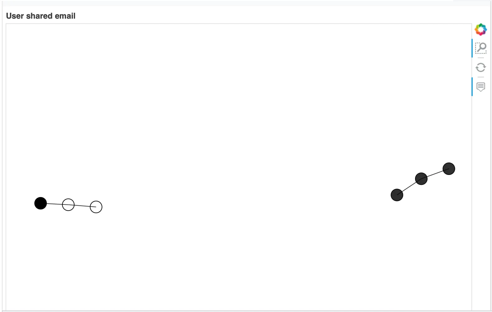

# 基于 NebulaGraph 图数据库的 ID Resolution 方法与代码示例


> 本文是一个基于 NebulaGraph 上的图算法、图数据库、图神经网络的 ID-Mapping 方法综述，除了基本方法思想的介绍之外，我还给大家弄了可以跑的 Playground。

> 本文还在撰写中，TBD 的章节还请见谅。

<!--more-->

<!--

[TOC]

-->

## 基于图数据库的用户 ID 识别方法

用户 ID 识别，是一个很常见的图技术应用场景，在不同的语境下它可能还被叫做 Entity Correlation（实体关联）、Entity Linking（实体链接）、ID Mapping（身份映射）等等。ID 识别解决的问题是找出相同的用户在同一个系统或者不同系统中的不同账号。

由于 ID 识别天然地是一个关联关系问题，也是一个典型的图、图数据库应用场景。

### 建立图谱

#### 图建模

我们从一个最简单、直接的图谱开始，如下边的图结构示意显示，我们定义了点：

- user
  - Prop: [name, email, birthday, address, phone_num]
- phone
- email
- device
- ip
- address

在他们之间有很自然的边：

- used_device
  - Prop: time
- logged_in_from
  - Prop: time
- has_phone
- has_address
- has_email


#### 数据

这份数据是开源的，地址在 https://github.com/wey-gu/identity-correlation-datagen

#### 写入 NebulaGraph

图建模的 Schema 对应的 NebulaGraph DDL 是：

```sql
# 创建一个叫做 entity_resolution 的图空间
CREATE SPACE entity_resolution (vid_type=FIXED_STRING(30));

# 创建点的类型 TAG

CREATE TAG `user` (`name` string NOT NULL, `email` string NOT NULL, `phone_num` string NOT NULL, `birthday` date NOT NULL, `address` string NOT NULL)

CREATE TAG `address` (`address` string NOT NULL)
CREATE TAG `device` (`uuid` string NOT NULL)
CREATE TAG `email` ()
CREATE TAG `ip` ()
CREATE TAG `phone` ()

# 创建边的类型 Edge Type

CREATE EDGE `used_device` (`time` timestamp NOT NULL)
CREATE EDGE `logged_in_from` (`time` timestamp NOT NULL)
CREATE EDGE `has_phone` ()
CREATE EDGE `has_address` ()
CREATE EDGE `has_email` ()

# 创建 TAG `user` `name` 索引

CREATE TAG INDEX user_name_index ON `user`(`name`);
```

对于写入数据的 DML，这里只给出 `user` ，`email` 类型点、`has_email` 类型边的例子

```sql
INSERT VERTEX `user` (`email`, `name`, `birthday`, `address`, `phone_num`) VALUES
    "user_1":("heathermoore@johnson.com","Miranda Miller",date("1957-08-27"),"Brittany Forge Apt. 718 East Eric  WV 97881","+1-652-450-5443x00562"),
    "user_2":("holly@welch.org","Holly Pollard",date("1990-10-19"),"1 Amanda Freeway Lisaland  NJ 94933","600-192-2985x041"),
    "user_3":("julia.h.24@gmail.com","Julia Hall",date("1927-08-24"),"Rodriguez Track East Connorfort  NC 63144","1248361783"),
    "user_4":("franklin.b@gibson.biz","Franklin Barnett",date("2020-03-01"),"Richard Curve Kingstad  AZ 05660","(224)497-9312"),
    "user_5":("4kelly@yahoo.com","April Kelly",date("1967-12-01"),"Schmidt Key Lake Charles  AL 36174","410.138.1816x98702"),
    "user_6":("steven.web@johnson.com","Steven Webb",date("1955-04-24"),"5 Joanna Key Suite 704 Frankshire  OK 03035","3666519376"),
    "user_7":("Jessica_Torres@morris.com","Jessica Torres",date("1958-09-03"),"1 Payne Circle Mitchellfort  LA 73053","535-357-3112x4903"),
    "user_8":("brettglenn@gmail.com","Brett Glenn",date("1992-09-03"),"Weber Unions Eddieland  MT 64619","660.391.3730"),
    "user_9":("veronica.j@yahoo.com","Veronica Jordan",date("1947-06-08"),"2 Klein Mission New Annetteton  HI 05775","810-252-6218"),
    "user_10":("steven@phelps-craig.info","Steven Brooks",date("1954-06-14"),"1 Vanessa Stravenue Suite 184 Baileyville  NY 46381","+1-665-328-8103x3448"),
    "user_11":("ReginaldTheMan@hotmail.com","Reginald Mccullough",date("1915-04-12"),"John Garden Port John  LA 54602","030.088.4523x94511"),
    "user_12":("Jennifer.f@carroll-acosta.com","Jennifer Foster",date("1988-04-30"),"11 Webb Groves Tiffanyside  MN 14566","(489)306-8558x98227"),
    "user_13":("Philip66@yahoo.com","Philip Garcia",date("1955-12-01"),"70 Robinson Locks Suite 113 East Veronica  ND 87845","490-088-7610x9437"),
    "user_14":("Ann@hernandez.com","Ann Williams",date("1947-05-28"),"24 Mcknight Port Apt. 028 Sarahborough  MD 38195","868.057.4056x4814"),
    "user_15":("Jessica@turner.com","Jessica Stewart",date("1951-11-28"),"0337 Mason Corner Apt. 900 Toddmouth  FL 61464","(335)408-3835x883"),
    "user_16":("Sandra311@hotmail.com","Sandra Dougherty",date("1908-06-03"),"7 Davis Station Apt. 691 Pittmanfort  HI 29746","+1-189-827-0744x27614"),
    "user_17":("Sharon91@gmail.com","Sharon Mccoy",date("1958-09-01"),"1 Southport Street Apt. 098 Westport  KY 85907","(814)898-9079x898"),
    "user_18":("Sharon91+001@gmail.com","Kathryn Miller",date("1958-09-01"),"1 Southport Street Apt. 098 Westport  KY 85907","(814)898-9079x898"),
    "user_19":("brettglenn@googlemail.com","Bretty Glenn",date("1991-09-03"),"Weber Unions Eddieland  MT 64619","660-391-3730"),
    "user_20":("julia.h.24@yahoo.com","Julia H.",date("1927-08-24"),"Rodriguez Track East Connorfort NC 63144","1248361783"),
    "user_21":("holly@welch.org","Holly",date("0000-10-19"),"1 Amanda Freeway Lisaland  NJ 94933","(600)-192-2985"),
    "user_22":("veronica.j@yahoo.com","Veronica Jordan",date("0000-06-08"),"2 Klein HI 05775","(810)-252-6218"),
    "user_23":("4kelly@hotmail.com","Kelly April",date("2010-01-01"),"Schmidt Key Lake Charles AL 13617","410-138-1816");

INSERT VERTEX `email` () VALUES
    "heathermoore@johnson.com":(),
    "holly@welch.org":(),
    "julia.h.24@gmail.com":(),
    "franklin.b@gibson.biz":(),
    "4kelly@yahoo.com":(),
    "steven.web@johnson.com":(),
    "Jessica_Torres@morris.com":(),
    "brettglenn@gmail.com":(),
    "veronica.j@yahoo.com":(),
    "steven@phelps-craig.info":(),
    "ReginaldTheMan@hotmail.com":(),
    "Jennifer.f@carroll-acosta.com":(),
    "Philip66@yahoo.com":(),
    "Ann@hernandez.com":(),
    "Jessica@turner.com":(),
    "Sandra311@hotmail.com":(),
    "Sharon91@gmail.com":(),
    "Sharon91+001@gmail.com":(),
    "brettglenn@googlemail.com":(),
    "julia.h.24@yahoo.com":(),
    "holly@welch.org":(),
    "veronica.j@yahoo.com":(),
    "4kelly@hotmail.com":();

INSERT VERTEX `ip` () VALUES
    "202.123.513.12":(),
    "202.41.23.11":(),
    "143.1.23.4":(),
    "143.1.23.12":(),
    "153.42.2.8":(),
    "153.42.2.8":(),
    "153.42.2.8":(),
    "9.1.4.1":()

INSERT VERTEX `device`(`uuid`) VALUES
    "device_0":("2a8e791d-0183-4df2-aa36-5ac82151be93"),
    "device_1":("f9be6a11-f74b-45f5-a9ea-bb3af5a868a2"),
    "device_2":("ae083379-91f5-4cd3-b2b3-273960979dab"),
    "device_3":("c0981d43-1e59-4cd5-a1e1-e88cd9e792a5"),
    "device_4":("e730dd8a-fcd3-47b4-be4a-0190610e6f02")


INSERT EDGE `has_email` () VALUES
    "user_1"->"heathermoore@johnson.com":(),
    "user_2"->"holly@welch.org":(),
    "user_3"->"julia.h.24@gmail.com":(),
    "user_4"->"franklin.b@gibson.biz":(),
    "user_5"->"4kelly@yahoo.com":(),
    "user_6"->"steven.web@johnson.com":(),
    "user_7"->"Jessica_Torres@morris.com":(),
    "user_8"->"brettglenn@gmail.com":(),
    "user_9"->"veronica.j@yahoo.com":(),
    "user_10"->"steven@phelps-craig.info":(),
    "user_11"->"ReginaldTheMan@hotmail.com":(),
    "user_12"->"Jennifer.f@carroll-acosta.com":(),
    "user_13"->"Philip66@yahoo.com":(),
    "user_14"->"Ann@hernandez.com":(),
    "user_15"->"Jessica@turner.com":(),
    "user_16"->"Sandra311@hotmail.com":(),
    "user_17"->"Sharon91@gmail.com":(),
    "user_18"->"Sharon91+001@gmail.com":(),
    "user_19"->"brettglenn@googlemail.com":(),
    "user_20"->"julia.h.24@yahoo.com":(),
    "user_21"->"holly@welch.org":(),
    "user_22"->"veronica.j@yahoo.com":(),
    "user_23"->"4kelly@hotmail.com":();

INSERT EDGE `used_device` (`time`) VALUES
    "user_2"->"device_0":(timestamp("2021-03-01T08:00:00")),
    "user_21"->"device_0":(timestamp("2021-03-01T08:01:00")),
    "user_18"->"device_1":(timestamp("2021-03-01T08:02:00")),
    "user_17"->"device_1":(timestamp("2021-03-01T08:03:00")),
    "user_22"->"device_2":(timestamp("2021-03-01T08:04:00")),
    "user_9"->"device_3":(timestamp("2021-03-01T08:05:00")),
    "user_9"->"device_2":(timestamp("2021-03-01T08:06:00")),
    "user_23"->"device_4":(timestamp("2021-03-01T08:07:00"))

INSERT EDGE `logged_in_from` (`time`) VALUES
    "user_2"->"202.123.513.12":(timestamp("2021-03-01T08:00:00")),
    "user_21"->"202.41.23.11":(timestamp("2021-03-01T08:01:00")),
    "user_18"->"143.1.23.4":(timestamp("2021-03-01T08:02:00")),
    "user_17"->"143.1.23.12":(timestamp("2021-03-01T08:03:00")),
    "user_22"->"153.42.2.8":(timestamp("2021-03-01T08:04:00")),
    "user_9"->"153.42.2.8":(timestamp("2021-03-01T08:05:00")),
    "user_9"->"153.42.2.8":(timestamp("2021-03-01T08:06:00")),
    "user_23"->"9.1.4.1":(timestamp("2021-03-01T08:07:00"))
```


### 根据确定规则获取 ID 映射关系

最简单、直接的方法，在特定的场景下也可能是有用的，试想像 email、IP 地址、上网设备这些有严格结构的数据，在它们成为图谱中的点的时候，简单的相等关系就足以找出这样对应关系，比如：

- 拥有相同的 email
- 使用过相同的 IP 地址
- 使用过相同的设备

在前边的图谱、图数据库中，拥有相同的 email 可以直接表达为如下的图模式（Graph Pattern）。

```
(:user)-[:has_email]->(:email)<-[:has_email]-[:user]
```

下图为顶点： user 与边：has_email 的一个图的可视化结果，可以看到这其中有两个三个点相连的串正是符合拥有相同 email 的模式的点。

> 注：
>
> - 这个结果的数据源在 https://github.com/wey-gu/identity-correlation-datagen/tree/main/sample/hand_crafted 
> - 如果通过线上访问本文，你可以鼠标悬停（获取点上的属性）和框选放大每一个点和子图哦。

<iframe src="https://datapane.com/reports/v7JN2E7/user-shared-email/embed/" width="100%" height="540px" style="border: none;">IFrame not supported</iframe>

显然，在构建 ID Mapping 系统的过程中，我们就是通过在图数据库中直接查询，可视化渲染结果来看到等效的洞察，这个查询可以写成：

```cypher
MATCH p=(:user)-[:has_email]->(:email)<-[:has_email]-(:user)
RETURN p limit 10
```

> NebulaGraph 中的查询结果


> 同样，在上边交互图中可以放大看到这两对拥有相同 email 关联起来的账号：



然而，在更多真实世界中，这样的模式匹配往往不能解决更多稍微复杂一点的情形：

比如从上边的图中我们可以看到这两个匹配了的映射中，`holly@welch.org` 关联下的两个用户的姓名是不同的，而 `veronica.j@yahoo.com` 关联下的两个用户姓名是完全相同的。

```CSV
user_2,holly@welch.org,Holly Pollard,1990-10-19,1 Amanda Freeway Lisaland  NJ 94933,600-192-2985x041
user_21,holly@welch.org,Holly,0000-10-19,1 Amanda Freeway Lisaland  NJ 94933,(600)-192-2985
```

再比如 `Sharon91@gmail.com` 和 `Sharon91+001@gmail.com` ，这两个人的姓名不同，但是手机和地址却是相同的。

```CSV
user_17,Sharon91@gmail.com,Sharon Mccoy,1958-09-01,1 Southport Street Apt. 098 Westport  KY 85907,(814)898-9079x898
user_18,Sharon91+001@gmail.com,Kathryn Miller,1958-09-01,1 Southport Street Apt. 098 Westport  KY 85907,(814)898-9079x898
```

比较庆幸的是我们只需要增加类似于"拥有相同邮箱"、"拥有相同地址"、"拥有相同电话"等其他条件就可以把这种情况考虑进来了，而随之而来的问题是：

- 不是所有的数据都至少存在某一个确定条件的相等（二元的是与否），所以不存在一条确定的边去连接它们，比如这两个账户中：

```CSV
user_5,4kelly@yahoo.com,April Kelly,1967-12-01,Schmidt Key Lake Charles AL 36174,410.138.1816x98702
user_23,4kelly@hotmail.com,Kelly April,2010-01-01,Schmidt Key Lake Charles AL 13617,410-138-1816
```

- 如何表现 `4kelly@yahoo.com` 与 `4kelly@hotmail.com` 的相似性？
- 如何将多种匹配规则的信息都纳入关联系统？

### 非确定规则基于复合条件量化方法

前边提到了几种确定规则无法处理的情况，它们可以归结为这两点：

1. 需要多因素（规则）进行综合考虑与判定
2. 需要对非确定条件（属性）进行处理，挖掘隐含相等、相似的关联关系（边）

对于 1. ，很自然可以想到对多种关联条件进行量化评分（score），按照多种条件的重要程度进行加权，给出认定为关联的总分的阈值。

有了多因素评分的机制，我们只需要考虑如何在确定的多因素基础之上，增加对不确定因素的处理，从而解决 2.的情况。这里，非确定的条件可能是：

a. 表现结构化数据的相似性：`Sharon91@gmail.com` 与 `Sharon91+001@gmail.com`

b. 表现非结构化数据的相似性：

- `Schmidt Key Lake Charles AL 36174` 与 `Schmidt Key Lake Charles AL 13617`
- `600-192-2985x041` 与`(600)-192-2985`

对于 a. 的结构化数据中的相似性，有两个思路是可以考虑的：

- 直接进行两个值的相似度
  - 直接判定子字符串
  - 运算 Jaccard index 等类似的相似度
- 拆分为更细粒的多个属性
  - 将 email `foo+num@bar.com` 拆分成三个子属性 email_handle: `foo`, email_alias: `num`, email_domain: `bar.com`
    - 然后就可以设计详细的确定性规则：email.handle 相等、甚至再在此基础上应用其他非确定规则
    - 有时候，比如对于 email_domain 字段，我们还知道 gmail.com 和 googlemail.com 是等价的，这里的处理也是可以考虑的（像是`user_19,brettglenn@googlemail.com` 与 `user_8,brettglenn@gmail.com`，但从邮箱判断背后就是同一个持有者)

而对于 b. 的非结构属性相似性距离，处理方式可以根据具体的 domain knowledge 千差万别：

- 像 `Schmidt Key Lake Charles AL 36174` 与 `Schmidt Key Lake Charles AL 13617` 的地址信息，除了可以用值的相似度之外，还可以把它转换成地理类型的属性，比如一个经纬度组成的点，从而计算两个点之间的地理距离，根据给定的距离值来打分。

> 注，你知道吗？NebulaGraph 图数据库中原生支持地理类型的属性与索引，可以直接创建 Point 类型的地理属性，并计算两个 Point 之间的距离。

- 对于 `600-192-2985x041` 与`(600)-192-2985` 这种字符串形式的电话号码，则可以统一转化为`<国家码>+<区域码>+<本地号码>+<分机号>`这样的结构化数据，进一步按照结构化数据的方式处理。
- 如果账号存在图片对象 URL，可以对比其文件相似度。

另外，对于非结构属性的相似性计算我们要尽量避免两两穷举运算的方式（笛卡尔积），因为这是一个指数增长的量级，一个可行的方法是只比较建立了确定性关系（比如相同邮件前缀：email_handle，地址在相同街区，IP 在同一个网段等）的实体。

**小结**

总结来看，为了解决真实世界数据的复杂情形，基于复合条件的量化方法有：

- 通过细化结构数据（比如邮箱字段拆分为子属性或者点）、或者转变为结构化数据（处理字符串形式的电话号码）建立相似结构化数据之间的确定关联；

- 在有限存在确定性关联的点之间（避免两两穷举），运算其他量化、非确定相似性（字符距离、地理距离等、图片文件相似度）；

- 为不同关系赋予加权，计算相似度总分；

#### 基于复合条件量化方法实操

下边，我们来给出这系列方法的实操案例。

**1. 细化结构数据**

> 通过细化结构数据（比如邮箱字段拆分为子属性或者点）、或者转变为结构化数据（处理字符串形式的电话号码）建立相似结构化数据之间的确定关联；

首先，我们把 email 的点拆成前缀 email_handle 与后缀 email_domain，自然地，会产生这样的边：

- has_email_with_handle (user -> email_handle)
- has_email_with_domain (user -> email_domain)
- with_handle (email -> email_handle)
- with_domain (email -> email_domain)

然而，可以想见 email_domain 是一个潜在的超级节点，并且，它的区分度在很多情况下是很小的，比如 `gmail.com` 这个公共邮箱后缀没有很大的关联性意义。我们可以只留下 email.handle 作为点，而对于 email_domain，把它留在边中作为属性：

- has_email_with_handle (user -> email_handle)
  - Prop:
    - email_domain
- with_handle (email -> email_handle)
  - Prop:
    - email_domain

对应的新的点类型、边类型的 NebulaGraph DDL 语句：

```sql
# 新的点类型
CREATE TAG `email_handle` ()

# 新的边类型
CREATE EDGE `has_email_with_handle` (`email_domain` string NOT NULL)
CREATE EDGE `with_handle` (`email_domain` string NOT NULL)
```

对应新的点、边的 DML 语句：

```sql
INSERT VERTEX `email_handle` () VALUES
    "4kelly":(),
    "Ann":(),
    "brettglenn":(),
    "franklin.b":(),
    "heathermoore":(),
    "holly":(),
    "Jennifer.f":(),
    "Jessica":(),
    "Jessica_Torres":(),
    "julia.h.24":(),
    "Philip66":(),
    "ReginaldTheMan":(),
    "Sandra311":(),
    "Sharon91":(),
    "steven":(),
    "steven.web":(),
    "veronica.j":();

INSERT EDGE `has_email_with_handle` (`email_domain`) VALUES
    "user_1"->"heathermoore":("johnson.com"),
    "user_2"->"holly":("welch.org"),
    "user_3"->"julia.h.24":("gmail.com"),
    "user_4"->"franklin.b":("gibson.biz"),
    "user_5"->"4kelly":("yahoo.com"),
    "user_6"->"steven.web":("johnson.com"),
    "user_7"->"Jessica_Torres":("morris.com"),
    "user_8"->"brettglenn":("gmail.com"),
    "user_9"->"veronica.j":("yahoo.com"),
    "user_10"->"steven":("phelps-craig.info"),
    "user_11"->"ReginaldTheMan":("hotmail.com"),
    "user_12"->"Jennifer.f":("carroll-acosta.com"),
    "user_13"->"Philip66":("yahoo.com"),
    "user_14"->"Ann":("hernandez.com"),
    "user_15"->"Jessica":("turner.com"),
    "user_16"->"Sandra311":("hotmail.com"),
    "user_17"->"Sharon91":("gmail.com"),
    "user_18"->"Sharon91":("gmail.com"),
    "user_19"->"brettglenn":("googlemail.com"),
    "user_20"->"julia.h.24":("yahoo.com"),
    "user_21"->"holly":("welch.org"),
    "user_22"->"veronica.j":("yahoo.com"),
    "user_23"->"4kelly":("hotmail.com");

INSERT EDGE `with_handle` (`email_domain`) VALUES
    "heathermoore@johnson.com"->"heathermoore":("johnson.com"),
    "holly@welch.org"->"holly":("welch.org"),
    "julia.h.24@gmail.com"->"julia.h.24":("gmail.com"),
    "franklin.b@gibson.biz"->"franklin.b":("gibson.biz"),
    "4kelly@yahoo.com"->"4kelly":("yahoo.com"),
    "steven.web@johnson.com"->"steven.web":("johnson.com"),
    "Jessica_Torres@morris.com"->"Jessica_Torres":("morris.com"),
    "brettglenn@gmail.com"->"brettglenn":("gmail.com"),
    "veronica.j@yahoo.com"->"veronica.j":("yahoo.com"),
    "steven@phelps-craig.info"->"steven":("phelps-craig.info"),
    "ReginaldTheMan@hotmail.com"->"ReginaldTheMan":("hotmail.com"),
    "Jennifer.f@carroll-acosta.com"->"Jennifer.f":("carroll-acosta.com"),
    "Philip66@yahoo.com"->"Philip66":("yahoo.com"),
    "Ann@hernandez.com"->"Ann":("hernandez.com"),
    "Jessica@turner.com"->"Jessica":("turner.com"),
    "Sandra311@hotmail.com"->"Sandra311":("hotmail.com"),
    "Sharon91@gmail.com"->"Sharon91":("gmail.com"),
    "Sharon91+001@gmail.com"->"Sharon91":("gmail.com"),
    "brettglenn@googlemail.com"->"brettglenn":("googlemail.com"),
    "julia.h.24@yahoo.com"->"julia.h.24":("yahoo.com"),
    "holly@welch.org"->"holly":("welch.org"),
    "veronica.j@yahoo.com"->"veronica.j":("yahoo.com"),
    "4kelly@hotmail.com"->"4kelly":("hotmail.com");
```

可以看到，经过这个处理，我们已经得到更多关联的用户了，它可以用这个图查询表达：

```sql
MATCH p=(:user)-[:has_email_with_handle]->(:email_handle)<-[:has_email_with_handle]-(:user)
RETURN p limit 10
```


**2. 非确定性相似性**

> 在有限存在确定性关联的点之间（避免两两穷举），运算其他量化、非确定相似性（字符距离、地理距离等、图片文件相似度）；

这里用地址的地理距离来做为例子，我们预先处理每一个地址，将它们的经纬度导入图谱。

这样，我们更改地址这个点的类型 `address` 的 schema：

- address
  - Prop: geo_point（`geography(point)` 经纬度类型）

对应过来，它的 DDL 变化是：

```diff
-CREATE TAG `address` ()
+CREATE TAG `address`(`geo_point` geography(point));
```

在已经建立了初始的 `address` TAG 之上，可以用 `ALTER TAG` 的 DDL 去修改 `address` 的定义：

```sql
ALTER TAG `address` ADD (`geo_point` geography(point));
```

> 可以用 `SHOW CREATE TAG` 查看修改之后的 Schema
>
> ```sql
> (root@nebula) [entity_resolution]> SHOW CREATE TAG `address`
> +-----------+------------------------------------+
> | Tag       | Create Tag                         |
> +-----------+------------------------------------+
> | "address" | "CREATE TAG `address` (            |
> |           |  `address` string NOT NULL,        |
> |           |  `geo_point` geography(point) NULL |
> |           | ) ttl_duration = 0, ttl_col = """  |
> +-----------+------------------------------------+
> ```

对应的点、边的 DML：

```sql
# 插入边
INSERT EDGE `has_address` () VALUES
    "user_1"->"addr_0":(),
    "user_2"->"addr_15":(),
    "user_3"->"addr_18":(),
    "user_4"->"addr_1":(),
    "user_5"->"addr_2":(),
    "user_6"->"addr_3":(),
    "user_7"->"addr_4":(),
    "user_8"->"addr_14":(),
    "user_9"->"addr_5":(),
    "user_10"->"addr_6":(),
    "user_11"->"addr_7":(),
    "user_12"->"addr_8":(),
    "user_13"->"addr_9":(),
    "user_14"->"addr_10":(),
    "user_15"->"addr_11":(),
    "user_16"->"addr_12":(),
    "user_17"->"addr_13":(),
    "user_18"->"addr_13":(),
    "user_19"->"addr_14":(),
    "user_20"->"addr_18":(),
    "user_21"->"addr_15":(),
    "user_22"->"addr_16":(),
    "user_23"->"addr_17":()

# 插入点，geo_point 是地址的经纬度
INSERT VERTEX `address` (`address`, `geo_point`) VALUES
    "addr_0":("Brittany Forge Apt. 718 East Eric  WV 97881", ST_Point(1,2)),
    "addr_1":("Richard Curve Kingstad  AZ 05660", ST_Point(3,4)),
    "addr_2":("Schmidt Key Lake Charles  AL 36174", ST_Point(13.13,-87.65)),
    "addr_3":("5 Joanna Key Suite 704 Frankshire  OK 03035", ST_Point(5,6)),
    "addr_4":("1 Payne Circle Mitchellfort  LA 73053", ST_Point(7,8)),
    "addr_5":("2 Klein Mission New Annetteton  HI 05775", ST_Point(9,10)),
    "addr_6":("1 Vanessa Stravenue Suite 184 Baileyville  NY 46381", ST_Point(11,12)),
    "addr_7":("John Garden Port John  LA 54602", ST_Point(13,14)),
    "addr_8":("11 Webb Groves Tiffanyside  MN 14566", ST_Point(15,16)),
    "addr_9":("70 Robinson Locks Suite 113 East Veronica  ND 87845", ST_Point(17,18)),
    "addr_10":("24 Mcknight Port Apt. 028 Sarahborough  MD 38195", ST_Point(19,20)),
    "addr_11":("0337 Mason Corner Apt. 900 Toddmouth  FL 61464", ST_Point(21,22)),
    "addr_12":("7 Davis Station Apt. 691 Pittmanfort  HI 29746", ST_Point(23,24)),
    "addr_13":("1 Southport Street Apt. 098 Westport  KY 85907", ST_Point(120.12,30.16)),
    "addr_14":("Weber Unions Eddieland  MT 64619", ST_Point(25,26)),
    "addr_15":("1 Amanda Freeway Lisaland  NJ 94933", ST_Point(27,28)),
    "addr_16":("2 Klein HI 05775", ST_Point(9,10)),
    "addr_17":("Schmidt Key Lake Charles AL 13617", ST_Point(13.12, -87.60)),
    "addr_18":("Rodriguez Track East Connorfort  NC 63144", ST_Point(29,30))

```

有了经纬度信息，结合 NebulaGraph 原生对于 Geo Spatial 空间地理属性的处理能力，我们可以轻松获得两个点之间的距离（单位：米）

如下，`ST_Distance(ST_Point(13.13, -87.65),ST_Point(13.12, -87.60))` 表示两个地球上的点 `ST_Point(13.13, -87.65)` 和 `ST_Point(13.12, -87.60))` 之间的距离是 `5559.9459840993895` 米。

```sql
RETURN ST_Distance(ST_Point(13.13, -87.65),ST_Point(13.12, -87.60)) AS distance;
+--------------------+
| distance           |
+--------------------+
| 5559.9459840993895 |
+--------------------+
```

那么，我们可以用查询语句来表达”所有拥有相同邮箱前缀用户之间的距离“：

```sql
MATCH (v_start:user)-[:has_email_with_handle]->(:email_handle)<-[:has_email_with_handle]-(v_end:user)
MATCH (v_start:user)-[:has_address]->(a_start:address)
MATCH (v_end:user)-[:has_address]->(a_end:address)
RETURN v_start, v_end, ST_Distance(a_start.address.geo_point, a_end.address.geo_point) AS distance, a_start, a_end;
```

这里，为了展现出针对 ”非确定性“ 条件之间的 ”相似性”，我们可以把地址中字符串完全相同的结果过滤掉，`WHERE a_start.address.address != a_end.address.address`，如此：

```sql
MATCH (v_start:user)-[:has_email_with_handle]->(:email_handle)<-[:has_email_with_handle]-(v_end:user)
MATCH (v_start:user)-[:has_address]->(a_start:address)
MATCH (v_end:user)-[:has_address]->(a_end:address)
WHERE a_start.address.address != a_end.address.address
RETURN v_start.`user`.name, v_end.`user`.name, ST_Distance(a_start.address.geo_point, a_end.address.geo_point) AS distance, a_start.address.address, a_end.address.address
```

它的结果是：

```sql
+-------------------+-------------------+--------------------+--------------------------------------------+--------------------------------------------+
| v_start.user.name | v_end.user.name   | distance           | a_start.address.address                    | a_end.address.address                      |
+-------------------+-------------------+--------------------+--------------------------------------------+--------------------------------------------+
| "April Kelly"     | "Kelly April"     | 5559.9459840993895 | "Schmidt Key Lake Charles  AL 36174"       | "Schmidt Key Lake Charles AL 13617"        |
| "Veronica Jordan" | "Veronica Jordan" | 0.0                | "2 Klein Mission New Annetteton  HI 05775" | "2 Klein HI 05775"                         |
| "Kelly April"     | "April Kelly"     | 5559.9459840993895 | "Schmidt Key Lake Charles AL 13617"        | "Schmidt Key Lake Charles  AL 36174"       |
| "Veronica Jordan" | "Veronica Jordan" | 0.0                | "2 Klein HI 05775"                         | "2 Klein Mission New Annetteton  HI 05775" |
+-------------------+-------------------+--------------------+--------------------------------------------+--------------------------------------------+
```

可以看出：

- `user_5` 与 `user_23` 之间的地址距离只相差 5559 米，因为他们的地址就在一个街区
- 而 `user_9` 与 `user_13` 之间距离相差 0 米，因为它们（"2 Klein Mission New Annetteton  HI 05775" 与 "2 Klein HI 05775"）实际上是完全相同的地址。

这就是利用属性的具体含义（domain knowledge）计算的实质距离的一个最好的诠释，大家可以借助于图数据库中查询语句描述能力或者利用其他系统去运算用户间非确定性特征的量化距离/相似度。


**3. 加权评分**

> 为不同关系赋予加权，计算相似度总分；

下边是一个在实际应用中，可以综合考量的多种关联关系，包括但不限于：

确定性关系

- 同名（精确匹配）
- 相同电话（格式化处理）
- 使用过相同设备（精确匹配）
- 同邮件前缀（精细化处理）

非确定性

- 地址距离（处理成经纬度，计算地球球面距离）
- 头像图片背景相似度（训练模型计算图像距离）

一个很直觉的方法就是将多种条件按照不同的权重加权，获得两点间的总“疑似相同账号”的评分。

本例中，为求简洁，我们只给出考虑“同邮件前缀”、“同名”与“地理距离小于 10KM”的综合加权，并且认为两个因素的权重都是 1。

> 注，为了防止两两全匹配，我们从相同邮件前缀条件作为初始匹配条件。

```sql
MATCH (v_start:user)-[:has_email_with_handle]->(:email_handle)<-[:has_email_with_handle]-(v_end:user)
MATCH (v_start:user)-[:has_address]->(a_start:address)
MATCH (v_end:user)-[:has_address]->(a_end:address)
WITH id(v_start) AS s, id(v_end) AS e, v_start.`user`.name AS s_name, v_end.`user`.name AS e_name, ST_Distance(a_start.address.geo_point, a_end.address.geo_point) AS distance
RETURN s, e, 1 AS shared_email_handle, s_name == e_name AS shared_name, distance < 10000 AS shared_location
```

结果是

```sql
+-----------+-----------+---------------------+-------------+-----------------+
| s         | e         | shared_email_handle | shared_name | shared_location |
+-----------+-----------+---------------------+-------------+-----------------+
| "user_5"  | "user_23" | 1                   | false       | true            |
| "user_9"  | "user_22" | 1                   | true        | true            |
| "user_21" | "user_2"  | 1                   | false       | true            |
| "user_2"  | "user_21" | 1                   | false       | true            |
| "user_22" | "user_9"  | 1                   | true        | true            |
| "user_20" | "user_3"  | 1                   | false       | true            |
| "user_3"  | "user_20" | 1                   | false       | true            |
| "user_18" | "user_17" | 1                   | false       | true            |
| "user_17" | "user_18" | 1                   | false       | true            |
| "user_19" | "user_8"  | 1                   | false       | true            |
| "user_8"  | "user_19" | 1                   | false       | true            |
| "user_23" | "user_5"  | 1                   | false       | true            |
+-----------+-----------+---------------------+-------------+-----------------+
```

然后，我们计算加权分数：

```sql
MATCH (v_start:user)-[:has_email_with_handle]->(:email_handle)<-[:has_email_with_handle]-(v_end:user)
MATCH (v_start:user)-[:has_address]->(a_start:address)
MATCH (v_end:user)-[:has_address]->(a_end:address)
WITH id(v_start) AS s, id(v_end) AS e, v_start.`user`.name AS s_name, v_end.`user`.name AS e_name, ST_Distance(a_start.address.geo_point, a_end.address.geo_point) AS distance
WITH s, e, 1 AS shared_email_handle, CASE WHEN s_name == e_name THEN 1 ELSE 0 END AS shared_name, CASE WHEN distance < 10000 THEN 1 ELSE 0 END AS shared_location
RETURN s, e, (shared_email_handle + shared_name + shared_location) AS score
ORDER BY score DESC
```

结果是

```sql
+-----------+-----------+-------+
| s         | e         | score |
+-----------+-----------+-------+
| "user_9"  | "user_22" | 3     |
| "user_22" | "user_9"  | 3     |
| "user_5"  | "user_23" | 2     |
| "user_21" | "user_2"  | 2     |
| "user_2"  | "user_21" | 2     |
| "user_20" | "user_3"  | 2     |
| "user_3"  | "user_20" | 2     |
| "user_18" | "user_17" | 2     |
| "user_17" | "user_18" | 2     |
| "user_19" | "user_8"  | 2     |
| "user_8"  | "user_19" | 2     |
| "user_23" | "user_5"  | 2     |
+-----------+-----------+-------+
```


#### 利用 Active Learning 的方法交互式学习评分权重

实际应用中，不同因素的加权关系也不是那么容易轻易给出的，我们可以利用有限的人力判断进行 Active Learning 的交互训练来习得权重。

TBD

### 利用新的边连接不同方法

进一步，对于这些确定（是否二元的）或非确定（量化的）关系，利用图库与外部系统获得了关联关系之后，常常可以直接把它们定义为图谱中直连的边，写回图库，提供给其他算法、系统作为输入，做进一步迭代、计算。

#### 1. 创建单独的直连边

假设之前对邮件、地址、姓名的处理之后，把结果作为用户实体之前的直连边插入图谱，这些种边叫做：

- shared_similar_email
- shared_similar_location
- shared_name

```sql
# DDL
CREATE EDGE `shared_similar_email` ()
CREATE EDGE `shared_similar_location` ()
CREATE EDGE `shared_name` ()
# DML

INSERT EDGE `shared_similar_email` () VALUES
    "user_5" ->"user_23":(),
    "user_9" ->"user_22":(),
    "user_21"->"user_2" :(),
    "user_2" ->"user_21":(),
    "user_22"->"user_9" :(),
    "user_20"->"user_3" :(),
    "user_3" ->"user_20":(),
    "user_18"->"user_17":(),
    "user_17"->"user_18":(),
    "user_19"->"user_8" :(),
    "user_8" ->"user_19":(),
    "user_23"->"user_5" :()

INSERT EDGE `shared_name` () VALUES
    "user_9" ->"user_22":(),
    "user_22"->"user_9" :()

INSERT EDGE `shared_similar_location` () VALUES
    "user_5" ->"user_23":(),
    "user_9" ->"user_22":(),
    "user_21"->"user_2" :(),
    "user_2" ->"user_21":(),
    "user_22"->"user_9" :(),
    "user_20"->"user_3" :(),
    "user_3" ->"user_20":(),
    "user_18"->"user_17":(),
    "user_17"->"user_18":(),
    "user_19"->"user_8" :(),
    "user_8" ->"user_19":(),
    "user_23"->"user_5" :()
```

#### 2. 创建复合评分之后的边

比如，我们查询综合分数大于 2 的点：

```sql
MATCH (v_start:user)-[:has_email_with_handle]->(:email_handle)<-[:has_email_with_handle]-(v_end:user)
MATCH (v_start:user)-[:has_address]->(a_start:address)
MATCH (v_end:user)-[:has_address]->(a_end:address)
WITH id(v_start) AS s, id(v_end) AS e, v_start.`user`.name AS s_name, v_end.`user`.name AS e_name, ST_Distance(a_start.address.geo_point, a_end.address.geo_point) AS distance
WITH s, e, 1 AS shared_email_handle, CASE WHEN s_name == e_name THEN 1 ELSE 0 END AS shared_name, CASE WHEN distance < 10000 THEN 1 ELSE 0 END AS shared_location
WITH s, e, (shared_email_handle + shared_name + shared_location) AS score
WHERE score > 2
RETURN s, e, score
ORDER BY score DESC
```

然后根据返回结果建立新的边：

```sql
CREATE EDGE `is_similar_to` (score int NOT NULL);
```

### 基于图算法的方法

前边的方法中我们直接利用了用户的各项属性、行为事件中产生的关系，并利用各种属性、值相似度的方法建立了基于概率或者带有评分的关联关系。而在通过其他方法增加了新的边之后的图上，我们也可以利用图算法的方法来映射潜在的相同用户 ID。

#### 图相似性算法

利用节点相似性图算法，比如 Jaccard、余弦相似度等，我们可以或者 a. 利用图库之上的图计算平台全量计算相似度，或者 b. 用图查询语句实现全图/给定的点之间的相似度，最后给相似度一定的阈值来帮助建立新的（考虑了涉及边的）映射关系。

> 注，这里的 Jaccard index 和我们前边提到的比较两个字符串的方法本质是一样的，不过我们现在提及的是应用在图上的点之间存在相连点作为算法中的“交集”的实现。

#### 社区发现算法

自然地，还可以用社区发现的算法全图找出给定的基于边之下的社区划分，调试算法，使得目标划分社区内部点为估计的相同用户。

#### 基于图算法方法实操


##### 基于图查询的 Jaccard 实现

[Jaccard Index](https://en.wikipedia.org/wiki/Jaccard_index) 是一个描述两个集合距离的定义公式，非常简单、符合直觉，它的定义为：
$$
J(A,B)= \frac {|A\cap B|}{|A\cup B|}
$$
这里，我们把交集理解为 A 与 B 共同连接的点（设备、IP、邮箱前缀、地址），而并集理解为这几种关系下与 A 或者 B 直连的所有点，于是，我们用这样的 NebulaGraph OpenCypher 查询就可以算出至少包含一跳关系的点和它相关的点、以及 Jaccard Index 值，越大代表关联度越大。

```sql
MATCH (v_start:user)-[:used_device|logged_in_from|has_email_with_handle|has_address]->(shared_components)<-[:used_device|logged_in_from|has_email_with_handle|has_address]-(v_end:user)
WITH v_start, v_end, count(shared_components) AS intersection_size
MATCH (v_start:user)-[:used_device|logged_in_from|has_email_with_handle|has_address]->(shared_components)
WITH id(v_start) AS v_start, v_end, intersection_size, COLLECT(id(shared_components)) AS set_a
MATCH (v_end:user)-[:used_device|logged_in_from|has_email_with_handle|has_address]->(shared_components)
WITH  v_start, id(v_end) AS v_end, intersection_size, set_a, COLLECT(id(shared_components)) AS set_b
WITH v_start, v_end, toFloat(intersection_size) AS intersection_size, toSet(set_a + set_b) AS A_U_B
RETURN v_start, v_end, intersection_size/size(A_U_B) AS jaccard_index
ORDER BY jaccard_index DESC
```

我们可以看到结果里：

```sql
+-----------+-----------+---------------------+
| v_start   | v_end     | jaccard_index       |
+-----------+-----------+---------------------+
| "user_8"  | "user_19" | 1.0                 |
| "user_19" | "user_8"  | 1.0                 |
| "user_20" | "user_3"  | 0.6666666666666666  |
| "user_3"  | "user_20" | 0.6666666666666666  |
| "user_21" | "user_2"  | 0.6                 |
| "user_18" | "user_17" | 0.6                 |
| "user_17" | "user_18" | 0.6                 |
| "user_2"  | "user_21" | 0.6                 |
| "user_22" | "user_9"  | 0.5                 |
| "user_9"  | "user_22" | 0.5                 |
| "user_23" | "user_5"  | 0.2                 |
| "user_5"  | "user_23" | 0.2                 |
| "user_21" | "user_20" | 0.16666666666666666 |
| "user_20" | "user_21" | 0.16666666666666666 |
+-----------+-----------+---------------------+
```

user_8 与 user_19 的系数是最大的的，让我们看看他们之间的连接？

```sql
FIND ALL PATH FROM "user_8" TO "user_19" OVER * BIDIRECT YIELD path AS p;
```

果然，他们之间的相似度很大：


##### 基于图计算平台的 Jaccard 实操

基于 Spark 的全图 Jaccard 运算

TBD with NebulaGraph Algorithm

##### 基于图社区发现算法的实操

基于 Spark 的全图 Louvian

TBD with NebulaGraph Algorithm

### 基于图神经网络的方法

我们注意到，在我们讲以上不同的方法相结合的时候，都是把前导方法的结果作为图上的边，进而作为后边的方法的输入，实际上相同用户 ID 的识别本质上就是在图上去预测用户之间链接、边。

而在 GNN 的方法中，除了我们在欺诈检测中利用到的节点分类（属性预测）之外，链接预测（Link Prediction）是另一个常见的算法目标和应用场景。我们自然也可以用 GNN 的方法，结合 1. 非 GNN 方法获得的和 2. 已经有的人为标注的链接，学习、预测图上的 ID 映射。

值得注意的是，GNN 的方法只能利用数字型的 feature、属性，我们没办法把非数字型的属性像在分类情况里那样枚举为数值，相反，我们在真正的 GNN 之前，可以用其他的图方法去建立基于打分、或者相似度的边建立。这时候，这些前边的方法成为了 GNN 链路预测的特征工程。

#### 基于 GNN 的实操

Nebula-DGL 链路预测例子，TBD

> Feature image credit by [Cosmin Serbin](https://unsplash.com/photos/2fn_pxLMS9g)

