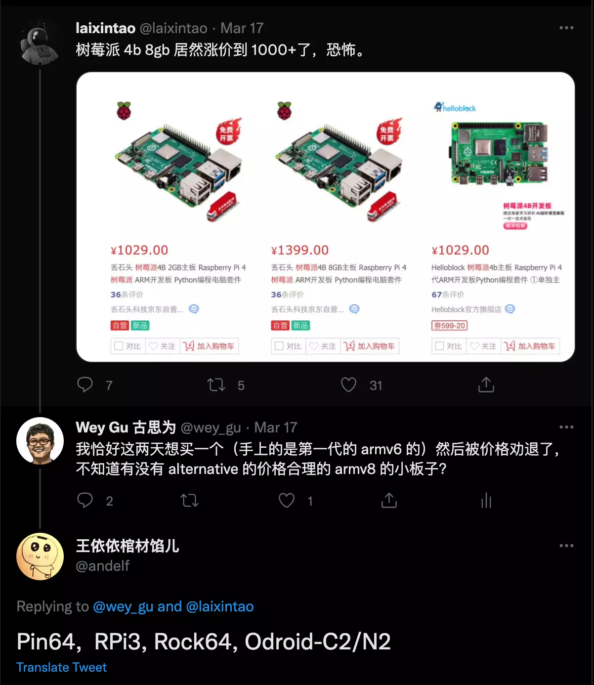
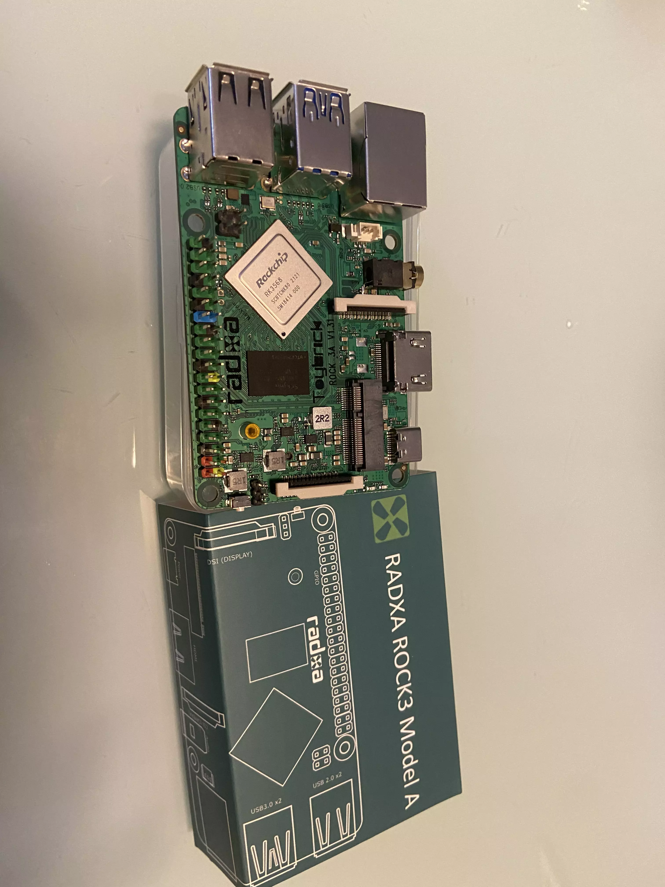
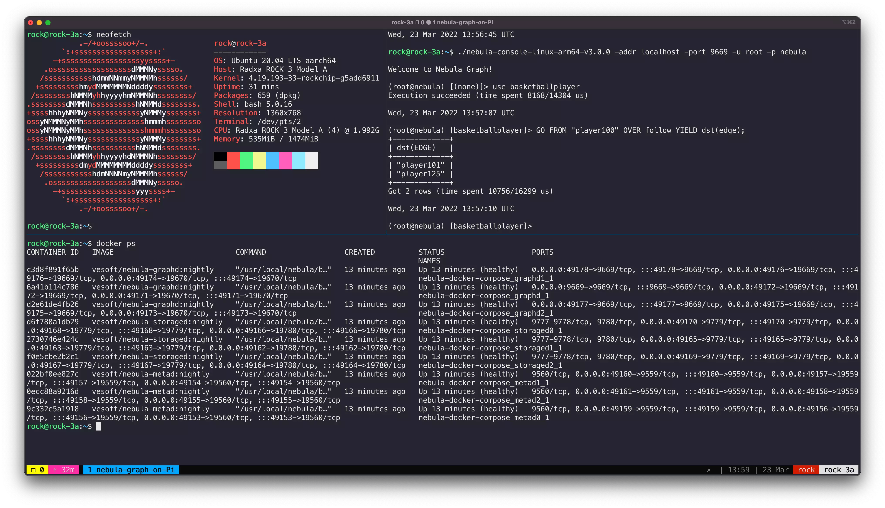

# Nebula Graph on Pi


> 得益于 Nebula 的原生 ARM64v8 的支持，在树莓派等 ARM 单板上跑 Nebula Graph 非常容易。

<!--more-->

## 背景

最近，在 Nebula Graph 社区 Yee 老师的（再）一次修复了 Nebula Graph 的构建依赖的 ARM 支持问题（[nebula-third-party#37](https://github.com/vesoft-inc/nebula-third-party/pull/37)）之后，我们又可以愉快地在 M1 Mac 上玩这个分布式开源图数据库了。

苦于树莓派的价格，一直没找机会把 Nebula 跑在小板子上玩玩。至于为什么要跑在树莓派上我的回答当然是 ~~Because I can~~ 在非常非常边缘计算的场景下（这里挖个坑，我一定要找一个这样的场景分享出来）。

终于，一周多之前在 [@laixintao](https://twitter.com/laixintao) 和 [@andelf](https://twitter.com/andelf/status/1504295476958404608) 的一个讨论下我决定找一个树莓派的 alternative，最后下单了 [Rock Pi 3A](https://wiki.radxa.com/Rock3/)，在因为深圳疫情影响下拖到了这个礼拜才终于发货了！



它看起来真的很棒！



## 在 ARM64 板子上装 Nebula Graph 图数据库

> 实际上 Nebula Graph 在 3.0 之后提供了一个[单机版](https://docs.nebula-graph.com.cn/3.0.1/4.deployment-and-installation/standalone-deployment/)，这使得 Nebula 在边缘计算情况下有了更小的 footprint，不过这次我还没有使用这个版本，下次试试再给大家分享。

我在附录列出了安装 Ubuntu Server 的步骤，这里假设大家已经在树莓派或者其他单板 ARM 电脑里拉起来了 64 位的 Linux Server。

### 第 0 步，安装 Docker 和 Docker-Compose

这里，我假设是 Debian/Ubuntu，其他分发版直接参考[这里](https://docs.docker.com/engine/install/)就好。

```bash
sudo apt-get update
sudo apt-get install \
    ca-certificates \
    curl \
    gnupg \
    lsb-release

echo \
  "deb [arch=$(dpkg --print-architecture) signed-by=/usr/share/keyrings/docker-archive-keyring.gpg] https://download.docker.com/linux/ubuntu \
  $(lsb_release -cs) stable" | sudo tee /etc/apt/sources.list.d/docker.list > /dev/null

sudo apt-get update
sudo apt-get install docker-ce docker-ce-cli containerd.io

# follow https://docs.docker.com/engine/install/linux-postinstall/
sudo groupadd docker
sudo usermod -aG docker $USER
exit
# login again
newgrp docker
```

安装好了 Docker 之后，安装 Compose，它 Docker 官方的步骤是有问题的，因为它其实是一个 Python 的包，我们通过 PIP 去装就好了。

```bash
sudo apt-get install -y python3 python3-pip
sudo pip3 install docker-compose
```

### 第 1 步，拉起 Nebula Graph

首先，我们克隆 Nebula Docker Compose 这个 Repo，在 Master Branch，用 Compose 把服务拉起来。

```bash
git clone https://github.com/vesoft-inc/nebula-docker-compose.git && cd nebula-docker-compose
docker-compose up -d
```

然后，我们下载 Console，连上 GraphD 服务。

```bash
wget https://github.com/vesoft-inc/nebula-console/releases/download/v3.0.0/nebula-console-linux-arm64-v3.0.0
chmod +x nebula-console-linux-arm64-v3.0.0

./nebula-console-linux-arm64-v3.0.0 -addr localhost -port 9669 -u root -p nebula
```

并激活 Storage 服务。

```bash
ADD HOSTS "storaged0":9779,"storaged1":9779,"storaged2":9779;
SHOW HOSTS;
```

### 第 2 步，玩转 Nebula Graph on Pi

这时候，透过 `SHOW HOSTS` 看到三个 StorageD 服务都是 ONLINE 之后，我们可以给 Nebula 里加载进去测试数据集。

```bash
$:play basketballplayer;
```

差不多一分钟之后，数据库加载成功，我们进入这个图空间，玩一下吧！

```bash
USE basketballplayer;

GO FROM "player100" OVER follow YIELD dst(edge);
```

Check this out and...

Happy Graphing!




## 附录：安装 Ubuntu Server 在 Rock Pi 3A 上

- 准备一个 micro SD card，在  https://wiki.radxa.com/Rock3/downloads 下载镜像，解压为 `.img` 文件

- 把镜像写进 SD card，比如用 [etcher]( https://www.balena.io/etcher/)
- 插入电源（5V，3A）启动！


> feature image credit: [@_louisreed](https://unsplash.com/@_louisreed)

