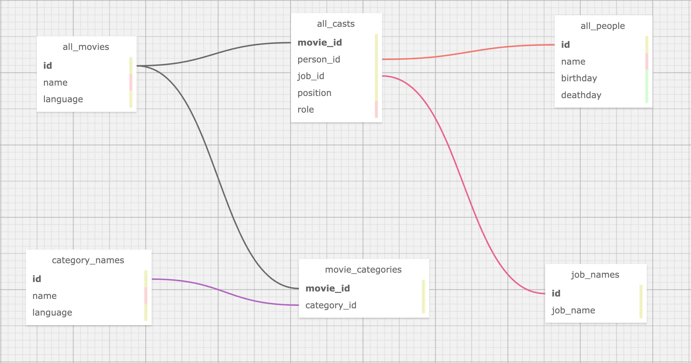
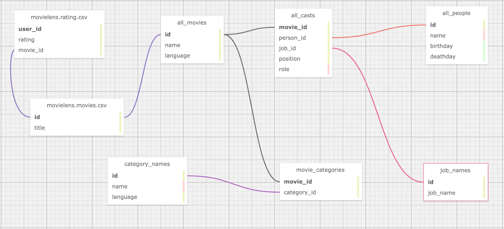
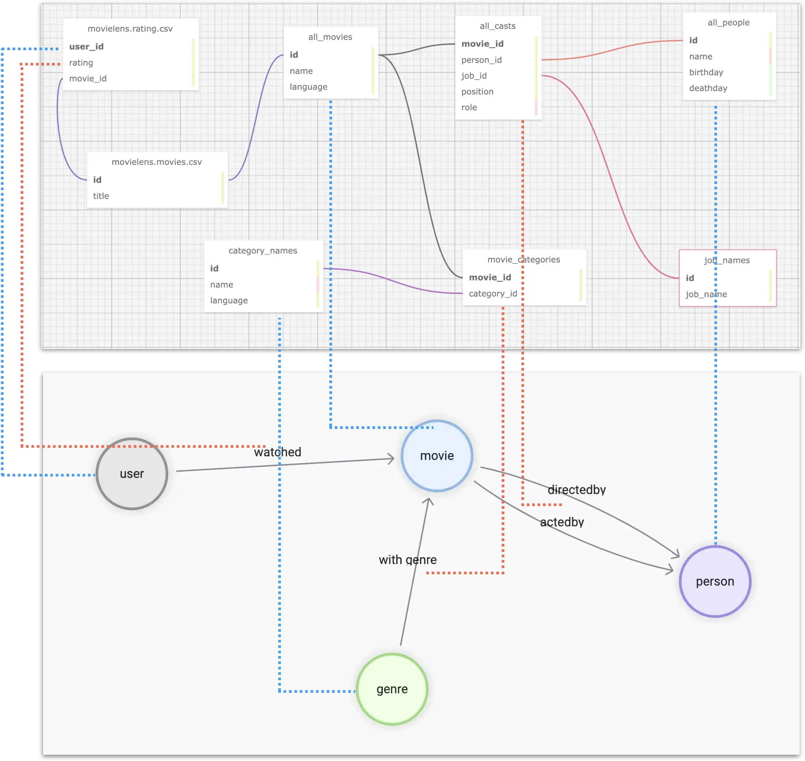
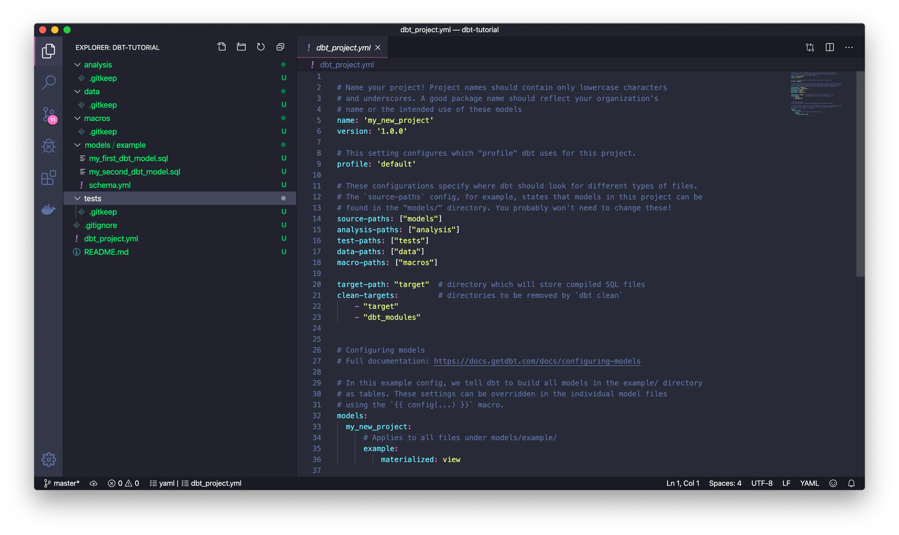
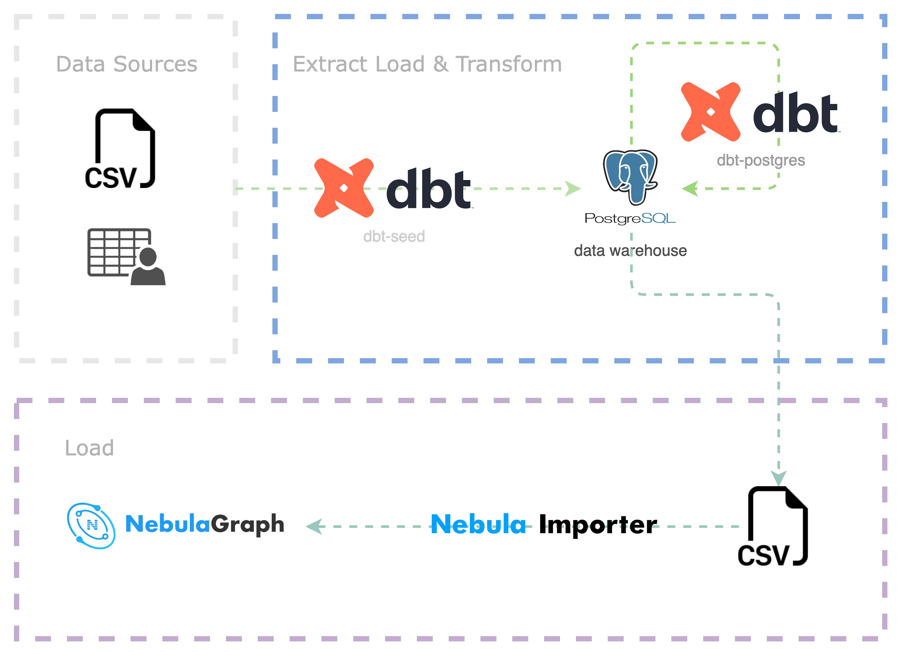
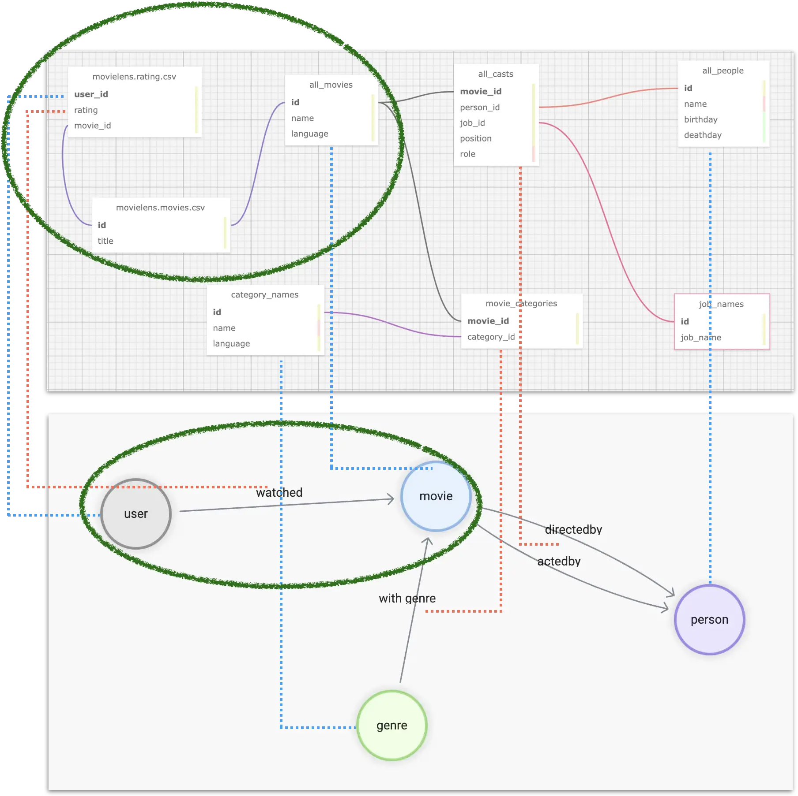
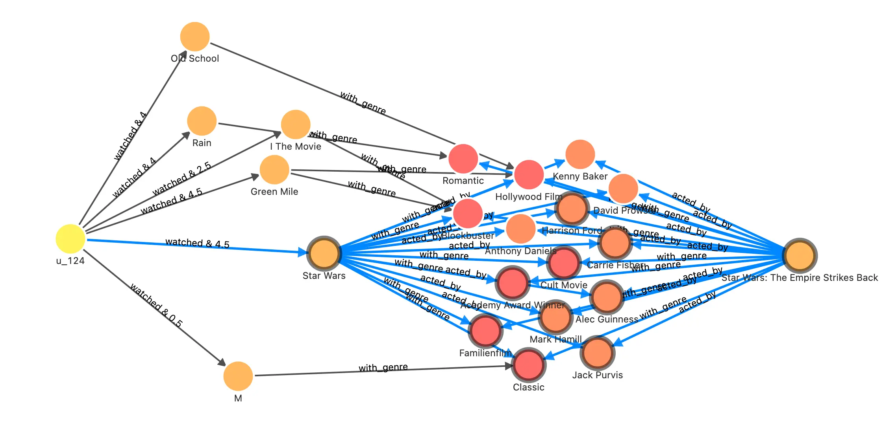

# 利用 dbt，基于表结构的 Nebulagraph 图建模与 ETL


> 如何把相对原始的数据处理、建模并导入 NebulaGraph？本文用一个端到端的示例演示，从多数据源聚合数据，清理、利用 dbt 转换成 NebulaGraph 建模的属性图点边记录，最后导入成图谱的全流程。

<!--more-->

<!--

[TOC]

-->

## 任务

假设作为一个类似于 Netflix、爱奇艺的服务提供商，我们需要利用 NebulaGraph 搭建一个用户-电影知识图谱，来辅助支撑推荐、问答和推荐理由等常见由图谱支撑的场景。

知识图谱需要的数据存在在不同的数据源，比如一些公开的 API、数仓中的不同数据库、静态的文件等。这时候，我们需要以下几个步骤来从数据构建图谱：

- 分析可能获取的数据
- 选取关心的关联关系，图建模
- 抽取关联关系，导入图数据库

## 数据来源

假设我们的数据来源是 [OMDB](https://www.omdb.org/en/us/content/Help:DataDownload) 和 [MovieLens](https://grouplens.org/datasets/movielens/)。

OMDB 是一个开放的电影数据库，本例中我们模拟公司内部的业务系统，我们可以获得的信息有：

- 电影
- 电影的分类
- 电影中的工作人员（导演、动作指导、演员、后期制作等）
- 电影封面、宣传片等

MovieLens 是一个开放的数据集，本例中我们模拟公司内部的用户数据，我们可以获得的信息有：

- 用户
- 电影
- 用户对电影的评分交互

## 图建模

在前边我们推荐系统的文章中我们介绍了推荐系统在图上的一些基本的方法（文章的链接是 www.siwei.io/recommendation-system-with-graphdb/）。其中的基于内容过滤关注了用户-->电影、电影-->分类、电影-->演员、电影-->导演的关系，协同过滤的方法则关注用户-->电影的关系，推荐理由服务则关注以上所有的关系，所以总结起来，我们需要的边有：

- watched(rate(double))

- with_genre

- directed_by

- acted_by

相应的，其中的顶点类型，我们先根据已有的信息中，顶点中可能需要被关注的信息作为属性，给出初始的规划：

- user(user_id)

- movie(name)

- person(name, birthdate)

- genre(name)


## 数据转换

有了目标的图谱结构定义，我们来看看手上的数据如何映射到它。

### OMDB 数据

首先是 OMDB 中的数据，它由很多表组成，比如 `all_movies` 这张表，存储了所有的电影、以及它们在不同语言下的名字：

| movie_id | name                           | language_iso_639_1 | official_translation |
| -------- | ------------------------------ | ------------------ | -------------------- |
| 1        | Cowboy Bebop                   | de                 | 1                    |
| 1        | Cowboy Bebop                   | en                 | 1                    |
| 2        | Ariel - Abgebrannt in Helsinki | de                 | 0                    |
| 3        | Shadows in Paradise            | en                 | 0                    |
| 3        | Im Schatten des Paradieses     | de                 | 0                    |
| 3        | Schatten im Paradies           | de                 | 1                    |

而 `all_casts` 表格中保有所有电影相关的工作人员：

| movie_id | person_id | job_id | role           | position |
| -------- | --------- | ------ | -------------- | -------- |
| 11       | 1         | 21     |                | 1        |
| 11       | 1         | 13     |                | 1        |
| 11       | 2         | 15     | Luke Skywalker | 1        |
| 11       | 3         | 15     | Han Solo       | 3        |
| 11       | 4         | 15     | Leia Organa    | 2        |

但是这里的每一个人的姓名等信息、以及他/她在电影中任职的职位，则分别在另外的表中：

- `job_names`

  比如 1 代表编剧、2 代表制作人，有意思的是，和电影 id 与姓名一样，job_id 到 name 是一对多的关系，因为 OMDB 中的数据都是多语言的。

| job_id | name                      | language_iso_639_1 |
| ------ | ------------------------- | ------------------ |
| 1      | Autoren                   | de                 |
| 1      | Writing Department        | en                 |
| 1      | Departamento de redacción | es                 |
| 1      | Département écriture      | fr                 |
| 1      | Scenariusz                | pl                 |
| 2      | Produzenten               | de                 |
| 2      | Production Department     | en                 |

- `all_people`

| id   | name            | birthday   | deathday   | gender |
| ---- | --------------- | ---------- | ---------- | ------ |
| 1    | George Lucas    | 1944-05-14 | \N         | 0      |
| 2    | Mark Hamill     | 1951-09-25 | \N         | 0      |
| 3    | Harrison Ford   | 1942-07-13 | \N         | 0      |
| 4    | Carrie Fisher   | 1956-10-21 | 2016-12-27 | 1      |
| 5    | Peter Cushing   | 1913-05-26 | 1994-08-11 | 0      |
| 6    | Anthony Daniels | 1946-02-21 | \N         | 0      |

这是在数据来源是表结构、RDBMS 中，是一个很典型的情况，所以对于 `movie <-[directed_by]-(person)` 这个关系，就涉及了 `all_movies`，`all_casts`，`all_people`，`job_names` 四个表格

- directed_by
  - 起点 person_id 在 all_casts 之中
  - 终点 movie_id 在 all_casts 之中
    - 条件是 job_id 为 job_names 之中的 “director”
- movie
  - person_id 在 all_casts 之中
  - 名字来自 all_movies 中按 id 查找，language 为 “en”
- person
  - movie_id 在 all_casts 之中
  - 名字、生日在 all_people 之中

所有 OMDB 中我们关心的表的关联如图：



### MovieLens 数据集

而上边只是一个数据源、数据表或者数仓的数据，在真实场景中，我们还需要从其他源头收取数据，并聚合起来，在本例中，我们还需要从 MovieLens 的数据集中抽取需要的知识。

这里，涉及到 MovieLens 数据集，我们利用的只有：用户-->电影，这一条关系。

- `movies.csv`

| movieId | title                    | genres    |
| ------- | ------------------------ | --------- |
| 1       | Toy Story (1995)         | Adventure |
| 2       | Jumanji (1995)           | Adventure |
| 3       | Grumpier Old Men (1995)  | Comedy    |
| 4       | Waiting to Exhale (1995) | Comedy    |

- `ratings.csv`

| userId | movieId | rating | timestamp |
| ------ | ------- | ------ | --------- |
| 1      | 1       | 4      | 964982703 |
| 1      | 3       | 4      | 964981247 |
| 1      | 6       | 4      | 964982224 |

从两个表的数据预览似乎可以得出：

- watched
  - 起点来自于 `ratings.csv` 中的 userId
  - 终点来自于 `ratings.csv` 中的 movieId
  - 评分来自于 `ratings.csv` 中的 rating
- user
  - 来自于 `ratings.csv` 中的 userId

然而，细心的你们一定发现 MovieLens 数据集中的 movieId 和来自于 OMDB 中的电影 id 完全是不同的两套体系，如果我们需要让他们关联起来，需要将 MovieLens 里的 movieId 转换成为 OMDB 中的电影 id。而他们之间的关联条件则是电影的标题。

然而，通观察，我们知道：

1. OMDB 电影中标题是多语言的
2. MovieLens 中的标题结尾带有`(1995)`这样的年份信息

所以我们最终的结论为

- watched
  - 起点来自于 `ratings.csv` 中的 userId
  - 终点来自于 `ratings.csv` 中的 movieId
    - **终点要从 `movies.csv` 中的 title ，在 OMDB 之中查找，得到 OMDB 的 movie_id**
      - 查找条件为去掉年份，从 OMDB 的英文标题中进行匹配
  - 评分来自于 `ratings.csv` 中的 rating
- user
  - 来自于 `ratings.csv` 中的 userId

现在，这个表格之间的关系如下



### 映射数据到图谱（属性图）

总结起来，我们需要对多个数据源中的不同表格（或者表格形式的 CSV 文件）进行聚合，这样的对应关系如图所示：其中蓝色虚线表示图中顶点的数据信息来源，粉色虚线表示边信息的来源。



最后，我们还要对不同表中个体的 id 进行格式化，比如 user_id，是自增的数字，我们要转换成全局唯一的 vertex_id，一个方便的方式是在现有 id 的基础上增加字符串前缀，比如 `u_`。

最终，拿对于 `user -[watched]-> movie` 这一个关系来说，我们可以处理得到这样的表结构数据：

| user_id | rating | title                              | omdb_movie_id |
| ------- | ------ | ---------------------------------- | ------------- |
| u_1     | 5      | Seven (a.k.a. Se7en)               | 807           |
| u_1     | 5      | Star Wars: Episode IV - A New Hope | 11            |
| u_1     | 5      | Star Wars: Episode IV - A New Hope | 10            |
| u_1     | 4      | Mask, The                          | 832           |
| u_1     | 3      | Mrs. Doubtfire                     | 832           |

其中每一行记录中存在三个图上的结构信息：

- user 顶点 id
- movie 顶点 id
- watched 边的 rating 值

## 工具

到此，我们已经完成了数据的分析与建模设计，在进入”抽取关联关系，导入图数据库“环节之前，先介绍一下我们要用到的工具。

”抽取关联关系“可以简单认为是 ETL 中的 Extract 和 Transform。本质上就是工程上执行数据映射与转换的工作，市面上有很多不同风格的工具、开源项目可以做。这里我们用到我个人比较喜欢的工具：dbt。

### 数据转换利器 dbt

dbt 是一个开源的数据转换工具，他有非常成熟的社区和生态，可以在大多数主流数仓之中进行高效、可控、高质量的数据转换工作，无论是临时的转换工作（ad-hoc），还是在给定的定时 pipeline 中进行复杂编排，dbt 都可以很好胜任，他的一大特色就是使用 SQL-like 语言去描述数据转换的规则，基于 GitOps，可以非常优雅地去多人协作、维护超大规模数据团队里复杂的数据处理作业。而且内置的数据测试能力可以很好的控制数据的质量，做到可复现、可控制。

dbt 不仅有很多集成的子项目，还能和很多其他优秀的开源项目有机结合（meltano、AirFlow、Amundsen 、Superset 等等），形成一整套现代的数据基础设施体系，感兴趣的同学可以参考我之前搭建的数据血缘与元数据治理参考架构文章：www.siwei.io/en/data-lineage-oss-ref-solution。


简单来说，dbt 是一个 python 写的命令行工具，当我们使用它的时候，针对每一个项目，我们可以创建特定格式的项目文件夹，其中包涵一个 YAML 格式的配置文件，在配置文件里指定数据转换的来源信息在哪里，目标在哪里（处理之后的数据存储的地方，可能是 Postgres，Big Query，Spark 等）。在数据源中，我们用 YAML 文件和 `.SQL` 文件一起描述了”从哪里取哪些数据，如何做变换，输出什么“的信息。



这个截图就是 dbt 官方文档中的示例项目中的文件和配置，可以看到 models/example 里的信息就是最核心的数据转换（transform）的规则，而所有的其他数据都是和这个数据转换相关的元数据，这些 dbt 项目文件非常适合用 git 来进行维护，进行现代、自动化的 DataOps。

> 注：
>
> 可以参考 dbt 文档上手理解它：https://docs.getdbt.com/docs/get-started/getting-started-dbt-core

### NebulaGraph 数据导入

经过 dbt 对数据进行处理之后，我们可以得到直接映射到不同类型的顶点、边、及其属性的表结构的中间数据，它们可以是 CSV 的文件形式，也可以是数仓中的表，甚至可能是 Spark 中的 dataframe。而将它们导入 NebulaGraph 有不同的选择，其中 NebulaGraph Exchange，Nebula-Importer，还有 Nebula-Spark-Connector 都可以作为导入数据。

> 注：
>
> 大家可以在 www.siwei.io/sketches/nebula-data-import-options 了解更多 NebulaGraph 数据导入不同工具的介绍，知道如何选择。

在这里，我就用最简单的 Nebula-Importer 作为例子。

Nebula-Importer 是一个用 Golang 写的开源工具，它可以编译成一个单文件的二进制，通过预配置的 YAML 格式的文件，获得给定的 CSV 文件到 NebulaGraph 中点、边的对应关系，进行读取和导入。

> 注：
>
> Nebula-Importer 代码：https://github.com/vesoft-inc/nebula-importer/
>
> Nebula-Importer 文档：https://docs.nebula-graph.com.cn/master/nebula-importer/use-importer/


## 实操

现在我们就实操一下如何利用 dbt + Nebula-Importer 进行多数据源聚合、转换、再导入 NebulaGraph 的过程，整个项目的代码已经开源，仓库在 https://github.com/wey-gu/movie-recommendation-dataset 上，欢迎大家参考、共建。

整个过程如下：

- 将源数据简单清洗、导入数仓（Postgres）（EL）
- 用 dbt 对数据进行转换（Transform）、导出为 CSV 文件
- 用 Nebula Importer 将 CSV 导入 NebulaGraph（L）



### 准备 dbt 环境

dbt 是一个 python 项目，我们在一个虚拟的 python3 环境里安装好 dbt 和 dbt-postgres。

```bash
python3 -m venv .venv
source .venv/bin/activate
pip install dbt-postgres
```

创建一个 dbt 项目，并进入到空的项目里：

```bash
dbt init dbt_project
cd dbt_project
```

看看里边的文件吧：

```bash
$ tree .
.
|-- README.md                      # 项目说明 README
|-- analyses
|-- dbt_project.yml                # 项目配置文件
|-- macros
|-- models                         # transform 来源
|   \-- example
|       |-- my_first_dbt_model.sql # 一个描述了如何从元数据中 SELECT 并处理的规则
|       |-- my_second_dbt_model.sql
|       \-- schema.yml             # 规则文件的元数据配置，描述了 sql 规则的属性
|-- seeds                          # 源数据如果是 CSV 文件，可以放到 seeds 里
|-- snapshots
\-- tests

7 directories, 5 files
```

最后，咱们拉一个容器里的 Postgres 当做我们这个项目的数仓，如果你已经有各种其他数仓，就不需要这一步了，不过要把项目中的配置文件作相应的修改，并安装相应的 dbt 插件。

```bash
docker run --rm --name postgres \
    -e POSTGRES_PASSWORD=nebula \
    -e POSTGRES_USER=nebula \
    -e POSTGRES_DB=warehouse -d \
    -p 5432:5432 postgres
```

### 数据下载与预处理

我们把数据放到项目的 raw_data 下吧

```bash
mkdir -p raw_data
cd raw_data
```

注意，假设 raw_data 在 dbt_proeject 之下：

```bash
tree ..
..
|-- README.md
|-- analyses
|-- dbt_project.yml
|-- macros
|-- models
|   \-- example
|       |-- my_first_dbt_model.sql
|       |-- my_second_dbt_model.sql
|       \-- schema.yml
|-- raw_data                       # 新建的目录
|-- seeds
|-- snapshots
\-- tests

8 directories, 5 files
```

我们把 omdb 数据下载之后，再解压：

```bash
wget www.omdb.org/data/all_people.csv.bz2
wget www.omdb.org/data/all_people_aliases.csv.bz2
wget www.omdb.org/data/people_links.csv.bz2
wget www.omdb.org/data/all_casts.csv.bz2
wget www.omdb.org/data/job_names.csv.bz2
wget www.omdb.org/data/all_characters.csv.bz2
wget www.omdb.org/data/movie_categories.csv.bz2
wget www.omdb.org/data/movie_keywords.csv.bz2
wget www.omdb.org/data/category_names.csv.bz2
wget www.omdb.org/data/all_categories.csv.bz2
wget www.omdb.org/data/all_movie_aliases_iso.csv.bz2
bunzip2 *.bz2
```

然后是 MovieLens 数据集的下载、解压：

```bash
wget https://files.grouplens.org/datasets/movielens/ml-latest-small.zip
unzip ml-latest-small.zip
rm *.zip
```

在导入数仓进行转换（Transform）之前我们做一些数据的预处理，然后把他们放到 `seeds` 之下。

```bash
# 因为是实验项目，我们简单粗暴地去掉带有转义的引号的数据，因为它们会被认为是无效字符，处理之后的结果放到 seeds 下边。
grep -v '\\"' raw_data/all_movie_aliases_iso.csv > seeds/all_movie_aliases_iso.csv
grep -v '\\"' raw_data/all_casts.csv > seeds/all_casts.csv
grep -v '\\"' raw_data/all_characters.csv > seeds/all_characters.csv
grep -v '\\"' raw_data/all_people.csv > seeds/all_people.csv
grep -v '\\"' raw_data/category_names.csv > seeds/category_names.csv
grep -v '\\"' raw_data/job_names.csv > seeds/job_names.csv
# 下边的文件无需处理，直接放到 seeds 下边。
cp raw_data/movie_categories.csv seeds/movie_categories.csv
cp raw_data/movie_keywords.csv seeds/movie_keywords.csv
cp raw_data/all_categories.csv seeds/all_categories.csv
cp raw_data/ml-latest-small/ratings.csv seeds/movielens_ratings.csv
cp raw_data/ml-latest-small/movies.csv seeds/movielens_movies.csv
```

有了 seeds 下边的文件之后，可以用一个命令把他们导入到数仓里：

> 参考文档：https://docs.getdbt.com/docs/build/seeds

```bash
dbt seed
```

执行过程因数仓而异，用本地的 postgres 可能要等一会儿才能完成，执行结果大概是这样的：

```bash
$ dbt seed
05:58:27  Running with dbt=1.3.0
05:58:27  Found 2 models, 4 tests, 0 snapshots, 0 analyses, 289 macros, 0 operations, 11 seed files, 0 sources, 0 exposures, 0 metrics
05:58:28  
05:58:28  Concurrency: 8 threads (target='dev')
05:58:28  
05:58:28  1 of 11 START seed file public.all_casts ....................................... [RUN]
...
07:10:11  1 of 11 OK loaded seed file public.all_casts ................................... [INSERT 1082228 in 4303.78s]
07:10:11  
07:10:11  Finished running 11 seeds in 1 hours 11 minutes and 43.93 seconds (4303.93s).
07:10:11  
07:10:11  Completed successfully
07:10:11  
07:10:11  Done. PASS=11 WARN=0 ERROR=0 SKIP=0 TOTAL=11
```

### 撰写 Transform model

我们创建 model 如下：

```bash
mkdir models/movie_recommedation
touch models/movie_recommedation/user_watched_movies.sql
touch models/movie_recommedation/schema.yml
```

这时候 models 中的文件结构大概是这样的：

```bash
$ tree models
models
\-- movie_recommedation
    |-- user_watched_movies.sql
    \-- schema.yml
```

这个 model 下边目前只有一个规则，就是负责处理用户观看电影这一个边上数据的 SQL 语句。

我们希望输出三列，所以 `schema.yml` 中的内容是：

```yaml
version: 2

models:
  - name: user_watched_movies
    description: "The edges between users and movies they have watched"
    columns:
      - name: user_id
        description: "user id"
        tests:
          - not_null
      - name: movie_id
        description: "movie id"
        tests:
          - not_null
      - name: rating
        description: "rating given by user to movie"
        tests:
          - not_null
```

注意，这里的 tests 的表达是对数据验证、测试的约束，有了它，我可以用 dbt 轻松对数据质量进行测试、验收，比如我们要求这里的三个字段都是 `not_null`。

然后，我们来写 SQL 吧，`user_watched_movies.sql`：

```sql
{{ config(materialized='table') }}

/*
 JOIN the movieielens_ratings table with the movieielens_movies table, and removing the movie title tailing the year of release
 */
WITH user_watched_movies AS(
    SELECT moveielens_ratings."userId",
        moveielens_ratings."movieId",
        moveielens_ratings.rating,
        REGEXP_REPLACE(moveielens_movies.title, ' \(\d{4}\)$', '') AS title,
        moveielens_movies.genres AS movielens_genres
    FROM moveielens_ratings
        JOIN moveielens_movies ON moveielens_movies."movieId" = moveielens_ratings."movieId"
)
/* 
 JOIN user_watched_movies table with all_movie_aliase_iso table where language is English
 the join condition is the movie title
 */
SELECT concat('u_',user_watched_movies."userId") AS user_id,
    user_watched_movies.rating,
    user_watched_movies.title,
    all_movie_aliases_iso."movie_id" AS OMDB_movie_id,
    user_watched_movies.movielens_genres
FROM user_watched_movies
    JOIN all_movie_aliases_iso ON user_watched_movies.title LIKE CONCAT(all_movie_aliases_iso.name, '%')
    AND all_movie_aliases_iso.language_iso_639_1 = 'en'
```

而这个 SQL 做的事情就是绿色圆圈标注的部分：

- 从 `moveielens_ratings` 中选 user id、movie id、rating、movie title（去掉年份），存成 `user_watched_movies` 的中间表格
  - movie title 从 `moveielens_movies` 中` JOIN` ，通过 `movie_id` 相同的匹配条件取得
- 从 `user_watched_movies` 中选 user id（增加前缀 `u_`）、rating、title、OMDB_movie_id
  - OMDB_movie_id 从 `all_movie_aliases_iso` 中 `JOIN`，通过相似的电影姓名匹配 OMDB 电影中英文标题取得
  - 最终的字段作为输出



> 小贴士：我们可以在 Postgres 的连接器中通过增加 LIMIT 快速调试自己的 SQL 语句。

然后我们可以通过 dbt 来执行、测试刚刚的规则：

```bash
dbt run -m user_watched_movies
```

之后，我们应该就可以在 Postgres（数仓）中看到我们转换之后的一个表了。

类似的，如法炮制所有其他部分的 Transform 规则，我们就有这么多 model 了：

```bash
$ tree models
models
\-- movie_recommedation
    |-- acted_by.sql
    |-- directed_by.sql
    |-- genres.sql
    |-- movies.sql
    |-- people.sql
    |-- schema.yml
    |-- user_watched_movies.sql
    \-- with_genre.sql
```

再对他们分别执行 transform：

```bash
dbt run -m acted_by
dbt run -m directed_by
dbt run -m with_genre
dbt run -m people
dbt run -m genres
dbt run -m movies
```

### 导出数据为 CSV

实际上，NebulaGraph Exchange 本身就支持把很多数据源（Postgres，Clickhouse，MySQL，Hive 等等）导入 NebulaGraph，只是在这个例子中，我们处理的数据量对于 NebulaGraph 来说非常非常小（只有百万级别的边而已），使用最轻量级的 Nebula-Importer 就足够了。而 Nebula-Importer 能消费的数据只有 CSV 文件，所以我们把刚才的表都输出为文件。

首先，我们进入 postgres 的 console，执行 `COPY` 命令

> 参考 Postgres 文档：https://www.postgresql.org/docs/current/sql-copy.html

```sql
COPY acted_by TO '/tmp/acted_by.csv'  WITH DELIMITER ',' CSV HEADER;
COPY directed_by TO '/tmp/directed_by.csv'  WITH DELIMITER ',' CSV HEADER;
COPY with_genre TO '/tmp/with_genre.csv'  WITH DELIMITER ',' CSV HEADER;
COPY people TO '/tmp/people.csv'  WITH DELIMITER ',' CSV HEADER;
COPY movies TO '/tmp/movies.csv'  WITH DELIMITER ',' CSV HEADER;
COPY genres TO '/tmp/genres.csv'  WITH DELIMITER ',' CSV HEADER;
-- 对于 user_watched_movies 我们不输出表头，因为这个文件中记录了两种点、一种边，没法让 importer 通过约定好的表头自动导入，只能通过无表头的情况下指定第几列对应什么字段
COPY user_watched_movies TO '/tmp/user_watched_movies.csv'  WITH DELIMITER ',' CSV;
```

然后把 postgres 容器里的文件导入到 to_nebulagraph 这个文件夹里：

```bash
mkdir -p to_nebulagraph
docker cp postgres:/tmp/. to_nebulagraph/
```

### 导入 NebulaGraph

#### 创建 NebulaGraph 集群

我们可以用 Nebula-Up 一键搭起一个测试的 NebulaGraph 单机集群，然后参考数据集的 GitHub 仓库，一键导入所需数据：

> 注：
>
> - Nebula-UP：https://github.com/wey-gu/nebula-up
>
> - 数据集仓库：https://github.com/wey-gu/movie-recommendation-dataset

```bash
curl -fsSL nebula-up.siwei.io/install.sh | bash
```


#### 创建 Schema

首先，我们创建一个叫做 `moviegraph` 的图空间，针对前边的建模，创建点边类型的结构（Schema）：

先进入 NebulaGraph 的 console：

```bash
~/.nebula-up/console.sh
```

然后执行如下 DDL（Data Definiation Language）：

```sql
CREATE SPACE moviegraph(partition_num=10,replica_factor=1,vid_type=fixed_string(32));
:sleep 20
USE moviegraph;
CREATE TAG person(name string, birthdate string);
CREATE TAG movie(name string);
CREATE TAG genre(name string);
CREATE TAG user(user_id string);
CREATE EDGE acted_by();
CREATE EDGE directed_by();
CREATE EDGE with_genre();
CREATE EDGE watched(rate float);
exit
```

#### 创建 Nebula-Importer 配置文件

这个文件是一个描述 CSV 文件和集群中点边数据对应关系的 YAML 文件。详细的格式可以参考文档：https://docs.nebula-graph.com.cn/master/nebula-importer/use-importer/，或者视频教程：https://www.bilibili.com/video/BV1ny4y1u7i4 。

最终的配置文件我已经问大家写好了，在 https://github.com/wey-gu/movie-recommendation-dataset/blob/main/nebula-importer.yaml 可以下载得到。

这里，我们就直接下载我写好了的配置文件，注意，这个文件不应该是 dbt 项目文件的一部分，所以我们退出目录，向上一层，把它放到 dbt_proeject 外边：

```bash
cd ..
wget https://raw.githubusercontent.com/wey-gu/movie-recommendation-dataset/main/nebula-importer.yaml
```

#### 开始导入

这一步，我们用容器化的 nebula-importer，避免了安装的步骤：

```bash
docker run --rm -ti \
    --network=nebula-net \
    -v ${PWD}:/root/ \
    -v ${PWD}/dbt_project/to_nebulagraph/:/data \
    vesoft/nebula-importer:v3.2.0 \
    --config /root/nebula-importer.yaml
```

很快，所有的数据就导入到 NebulaGraph 之中了，然后我们可以通过 Nebula-Console，执行一些查询看看结果：

进入 console

```bash
~/.nebula-up/console.sh
```

进入图空间、执行 `SHOW STATS`

```SQL
USE moviegraph;
SHOW STATS;
```

结果：

```SQL
(root@nebula) [moviegraph]> SHOW STATS;
+---------+---------------+---------+
| Type    | Name          | Count   |
+---------+---------------+---------+
| "Tag"   | "genre"       | 14397   |
| "Tag"   | "movie"       | 20701   |
| "Tag"   | "person"      | 263907  |
| "Tag"   | "user"        | 610     |
| "Edge"  | "acted_by"    | 673763  |
| "Edge"  | "directed_by" | 101949  |
| "Edge"  | "watched"     | 31781   |
| "Edge"  | "with_genre"  | 194009  |
| "Space" | "vertices"    | 299615  |
| "Space" | "edges"       | 1001502 |
+---------+---------------+---------+
Got 10 rows (time spent 1693/15136 us)
```

通过 Nebula-Studio，我们也可以在可视化界面探索这个图谱，比如在其中执行这个查询，看一下给用户 u_124 推荐电影 1891 的理由可能是什么？

```SQL
FIND NOLOOP PATH FROM "u_124" TO "1891" over * BIDIRECT UPTO 4 STEPS yield path as `p` | LIMIT 20
```

他的结果是：曾经喜欢的星战电影的大部分演职人员都也参与了这部和同样是“奥斯卡获奖”且“经典”的电影。



> 我在另一篇文章中给大家用同一个图谱展示了更多图数据库、图算法在推荐系统上的应用，如果大家感兴趣，欢迎阅读：https://www.siwei.io/recommendation-system-with-graphdb/ 。


## 总结

当我们打算把海量数据利用图数据库的能力进行知识转化、洞察分析的时候，往往第一步就是要做多数据源到图数据的转换、处理、建模。对于在无从下手的新手们来说，一个可行的思路是从所有的相关信息出发，去设想最关注的关联关系，把边写出来，然后再罗列可以取得的点、以及需要的点、边上的属性。确定了初始的建模之后，就可以利用 ETL 工具把原始的数据清洗、ETL 成点、边类型的表结构，最后，利用导入工具导入 NebulaGraph。

借助于 dbt，我们可以版本控制、测试、迭代我们的建模与数据转换，一点点进化、丰富构建的知识图谱。


> 题图版权：[Claudio](https://unsplash.com/photos/Bu4lHKIHr-E)

