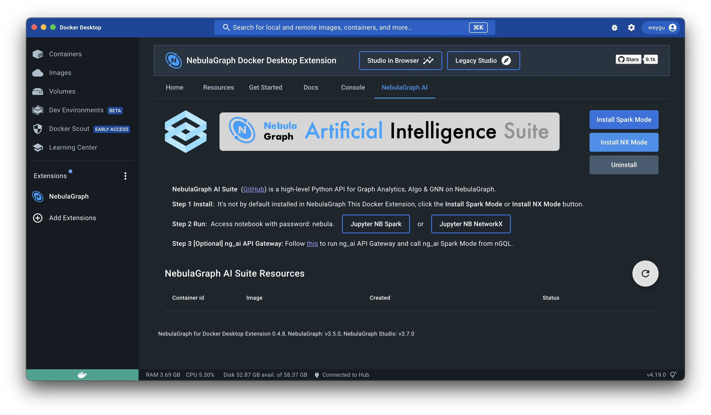
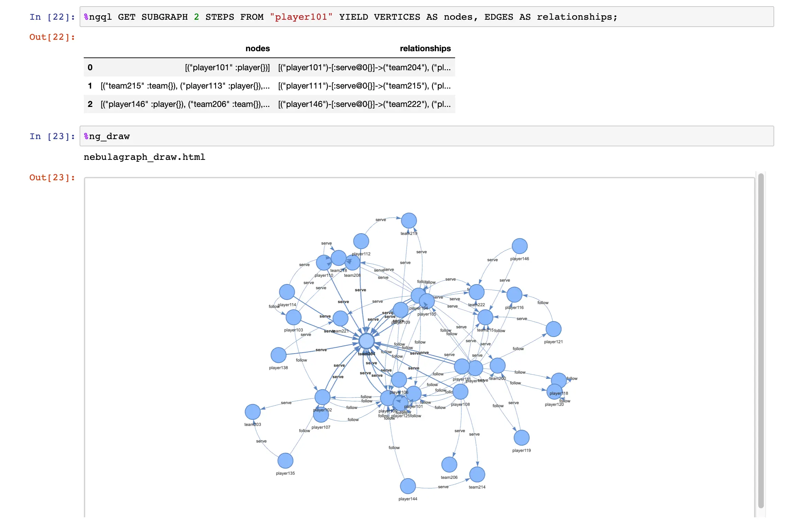
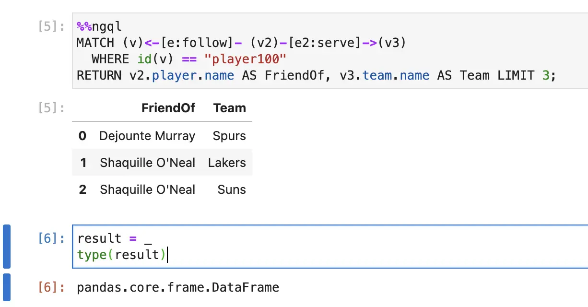
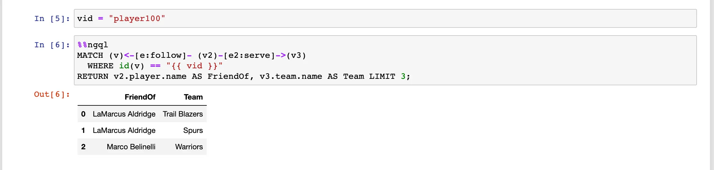

# NebulaGraph in Jupyter Notebook


> 现在，我们可以在 Jupyter Notebook 中更方便地玩 NebulaGraph 图数据库了，只需要`%ngql MATCH p=(n:player)->() RETURN p` 就可以直接查询 ，`%ng_draw` 就可以画出返回结果。

<!--more-->

[English version](https://www.siwei.io/en/nebulagraph-in-jupyter-notebook/)

最近，我把两年前一直没完成的 NebulaGraph 的 Jupyter Notebook 扩展： `ipython-ngql` 重构，正式发布了，现在它除了完全适配 NebulaGrpah 3.x 所有查询之外，还支持了 Notebook 内的返回结果可视化，本文给大家介绍一下如何使用  `ipython-ngql` ！


## 安装

安装非常简单，只需要在 Jupyter Notebook 里边执行 `%pip install ipython-ngql` 然后再加载它就好：

```python
%pip install ipython-ngql
%load_ext ngql
```

然后，我们就可以用 `%ngql` 这个 Jupyter Magic word 连接 NebulaGraph 了：

```python
%ngql --address 127.0.0.1 --port 9669 --user root --password nebula
```

当连接成功之后，`SHOW SPACES` 的结果会返回在这个 notebook cell 下。

> 💡 注：你可以从 Docker 桌面版的扩展市场里搜索 NebulaGraph 一键安装本地开发环境，进入 NebulaGraph Docker 扩展内部，点击 NebulaGraph AI ，点击 **Install NX Mode** 安装本地的 NebulaGraph + Jupyter Notebook 开发环境。
>
> 

## 查询

现在支持两种语法 `%ngql` 接单行查询和 `%%ngql` 接多行查询。

### 单行查询

例如：

```
%ngql USE basketballplayer;
%ngql MATCH (v:player{name:"Tim Duncan"})-->(v2:player) RETURN v2.player.name AS Name;
```

### 多行查询

例如：

```python
%%ngql
ADD HOSTS "storaged3":9779,"storaged4":9779;
SHOW HOSTS;
```


## 渲染结果

而在任意一个查询之后，紧跟着一个 `%ng_draw` 就可以把结果可视化渲染出来：

```python
# one query
%ngql GET SUBGRAPH 2 STEPS FROM "player101" YIELD VERTICES AS nodes, EDGES AS relationships;
%ng_draw

# another query
%ngql match p=(:player)-[]->() return p LIMIT 5
%ng_draw
```

效果：



并且，渲染的结果还会被保存为[单文件 html](https://github.com/wey-gu/ipython-ngql/blob/main/examples/nebulagraph_draw_match.html) ，这样我们可以内嵌到任意网页中，像是：

<iframe src="nebulagraph_draw_match.html" style="height:500px;width:800px" title="Graph"></iframe>

## 高级应用

下面还有一些方便的高级应用。比如 `%ngql help`  可以获得更多帮助信息。

### 操作查询结果为 pandas df

每一次 query 之后，返回的结果会被存到 `_` 变量中，我们可以对它进行读取：




### 返回原始 ResultSet

默认，返回的结果的格式是 pandas df，而如果我们想在 Jupyter Notebook 中交互调试 Python 的 NebulaGraph 应用代码的时候，我们也可以将返回结果设置为原始的 ResultSet 格式，方便直观进行 Query 与结果解析，例如：

```python
In [1] : %config IPythonNGQL.ngql_result_style="raw"

In [2] : %%ngql USE pokemon_club;
    ...: GO FROM "Tom" OVER owns_pokemon YIELD owns_pokemon._dst as pokemon_id
    ...: | GO FROM $-.pokemon_id OVER owns_pokemon REVERSELY YIELD owns_pokemon._dst AS Trainer_Name;
    ...:
    ...:
Out[3]:
ResultSet(ExecutionResponse(
    error_code=0,
    latency_in_us=3270,
    data=DataSet(
        column_names=[b'Trainer_Name'],
        rows=[Row(
            values=[Value(
                sVal=b'Tom')]),
...
        Row(
            values=[Value(
                sVal=b'Wey')])]),
    space_name=b'pokemon_club'))

In [4]: r = _

In [5]: r.column_values(key='Trainer_Name')[0].cast()
Out[5]: 'Tom'
```


### 查询模板

此外，我还给大家支持了模板功能，语法沿用了 [Jinja2](https://jinja.palletsprojects.com/) 的 `{{ variable }}` ，详见这个例子：



## 未来

之后，我打算增强可视化的自定义选项，也欢迎社区里的大伙来贡献新的 feature、idea。

项目的 repo 在 👉🏻 https://github.com/wey-gu/ipython-ngql

