# 图数据库的社交网络应用


# 图数据库的社交网络应用

> 本文是一个基于 NebulaGraph 上解决社交网络问题的常规方法综述。其中介绍的方法提供都了 Playground 供大家学习、玩耍。

<!--more-->

<!--

[TOC]

-->

社交网络大家都不陌生，无论是微信、微博、B 站还是大众点评、知乎、陌陌等服务，其本质上的用户都形成了社交网络。

在一个社交网络系统中，我们可以用图数据库来表示用户和他们的连接关系。图数据库能允许对用户之间的关系进行有效的查询，使得各种基于连接查找、统计、分析的社交网络上的业务实现变得可行、高效。

例如，图形数据库可以用来识别网络中的“有影响力用户”，或者根据用户之间的共同点对新的连接（好友关系、关心的内容）进行推荐，再或者寻找社群中相聚集的不同人群、社区，进行用户画像。图形数据库因为在能支撑复杂多跳查询的同时也能支持实时写入、更新，使其非常适合应用在用户关系不断变化的社交网络系统之上。

## 图建模

为了给出一些常见社交场景的应用示例，我会把大多数例子建立在一个典型的小型社交网络上，社交网络天然就是一张网络、图的形态。

为此，我在 NebulaGraph 官方示例数据集：篮球运动员之上，增加了三种点：

- 地址
- 地点
- 文章

五种边：

- 发文
- 评论
- 住在
- 属于（地点）

它的建模非常自然：

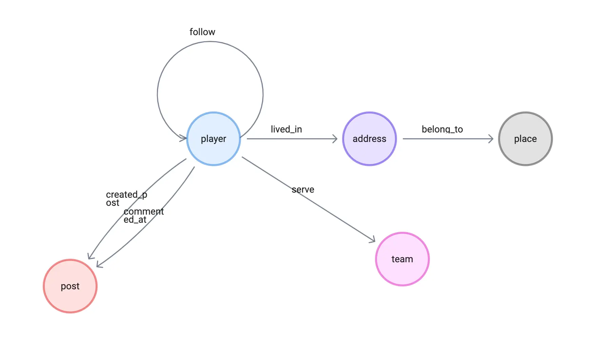

## 数据导入

### 加载默认数据集

首先，我们加载默认的 basketballplayer 数据集。

- 在命令行 console 之中，我们只需要执行 `:play basketballplayer` 就可以。

- 而在 NebulaGraph Studio/Explorer 之中，我们可以在欢迎页点击下载就部署这份基础数据集。

  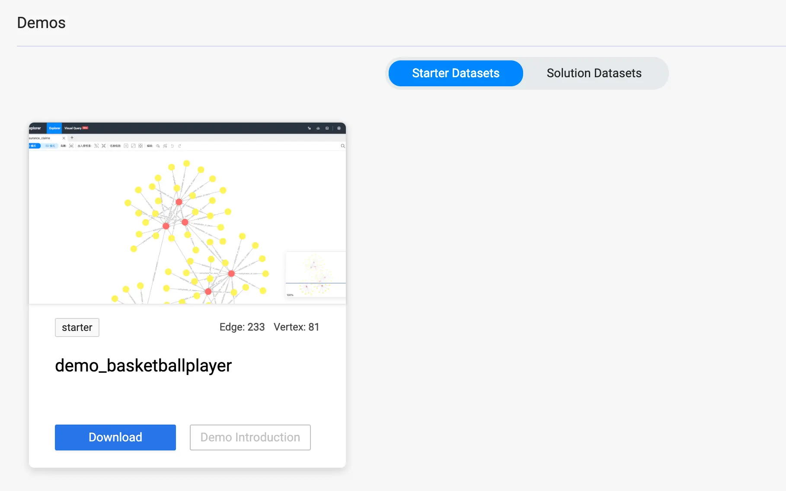

### 加载社交网络 schema

其次我们执行下边的语句，首先是 Schema 定义的语句：

```sql
CREATE TAG IF NOT EXISTS post(title string NOT NULL);
CREATE EDGE created_post(post_time timestamp);
CREATE EDGE commented_at(post_time timestamp);
CREATE TAG address(address string NOT NULL, `geo_point` geography(point));
CREATE TAG place(name string NOT NULL, `geo_point` geography(point));
CREATE EDGE belong_to();
CREATE EDGE lived_in();
```

### 加载数据

然后，在等两个心跳时间以上之后（20秒），我们可以执行数据插入：

```sql
INSERT VERTEX post(title) values \
    "post1":("a beautify flower"), "post2":("my first bike"), "post3":("I can swim"), \
    "post4":("I love you, Dad"), "post5":("I hate coriander"), "post6":("my best friend, tom"), \
    "post7":("my best friend, jerry"), "post8":("Frank, the cat"), "post9":("sushi rocks"), \
    "post10":("I love you, Mom"), "post11":("Let's have a party!");

INSERT EDGE created_post(post_time) values \
    "player100"->"post1":(timestamp("2019-01-01 00:30:06")), \
    "player111"->"post2":(timestamp("2016-11-23 10:04:50")), \
    "player101"->"post3":(timestamp("2019-11-11 10:44:06")), \
    "player103"->"post4":(timestamp("2014-12-01 20:45:11")), \
    "player102"->"post5":(timestamp("2015-03-01 00:30:06")), \
    "player104"->"post6":(timestamp("2017-09-21 23:30:06")), \
    "player125"->"post7":(timestamp("2018-01-01 00:44:23")), \
    "player106"->"post8":(timestamp("2019-01-01 00:30:06")), \
    "player117"->"post9":(timestamp("2022-01-01 22:23:30")), \
    "player108"->"post10":(timestamp("2011-01-01 10:00:30")), \
    "player100"->"post11":(timestamp("2021-11-01 11:10:30"));

INSERT EDGE commented_at(post_time) values \
    "player105"->"post1":(timestamp("2019-01-02 00:30:06")), \
    "player109"->"post1":(timestamp("2016-11-24 10:04:50")), \
    "player113"->"post3":(timestamp("2019-11-13 10:44:06")), \
    "player101"->"post4":(timestamp("2014-12-04 20:45:11")), \
    "player102"->"post1":(timestamp("2015-03-03 00:30:06")), \
    "player103"->"post1":(timestamp("2017-09-23 23:30:06")), \
    "player102"->"post7":(timestamp("2018-01-04 00:44:23")), \
    "player101"->"post8":(timestamp("2019-01-04 00:30:06")), \
    "player106"->"post9":(timestamp("2022-01-02 22:23:30")), \
    "player105"->"post10":(timestamp("2011-01-11 10:00:30")), \
    "player130"->"post1":(timestamp("2019-01-02 00:30:06")), \
    "player131"->"post2":(timestamp("2016-11-24 10:04:50")), \
    "player131"->"post3":(timestamp("2019-11-13 10:44:06")), \
    "player133"->"post4":(timestamp("2014-12-04 20:45:11")), \
    "player132"->"post5":(timestamp("2015-03-03 00:30:06")), \
    "player134"->"post6":(timestamp("2017-09-23 23:30:06")), \
    "player135"->"post7":(timestamp("2018-01-04 00:44:23")), \
    "player136"->"post8":(timestamp("2019-01-04 00:30:06")), \
    "player137"->"post9":(timestamp("2022-01-02 22:23:30")), \
    "player138"->"post10":(timestamp("2011-01-11 10:00:30")), \
    "player141"->"post1":(timestamp("2019-01-03 00:30:06")), \
    "player142"->"post2":(timestamp("2016-11-25 10:04:50")), \
    "player143"->"post3":(timestamp("2019-11-14 10:44:06")), \
    "player144"->"post4":(timestamp("2014-12-05 20:45:11")), \
    "player145"->"post5":(timestamp("2015-03-04 00:30:06")), \
    "player146"->"post6":(timestamp("2017-09-24 23:30:06")), \
    "player147"->"post7":(timestamp("2018-01-05 00:44:23")), \
    "player148"->"post8":(timestamp("2019-01-05 00:30:06")), \
    "player139"->"post9":(timestamp("2022-01-03 22:23:30")), \
    "player140"->"post10":(timestamp("2011-01-12 10:01:30")), \
    "player141"->"post1":(timestamp("2019-01-04 00:34:06")), \
    "player102"->"post2":(timestamp("2016-11-26 10:06:50")), \
    "player103"->"post3":(timestamp("2019-11-15 10:45:06")), \
    "player104"->"post4":(timestamp("2014-12-06 20:47:11")), \
    "player105"->"post5":(timestamp("2015-03-05 00:32:06")), \
    "player106"->"post6":(timestamp("2017-09-25 23:31:06")), \
    "player107"->"post7":(timestamp("2018-01-06 00:46:23")), \
    "player118"->"post8":(timestamp("2019-01-06 00:35:06")), \
    "player119"->"post9":(timestamp("2022-01-04 22:26:30")), \
    "player110"->"post10":(timestamp("2011-01-15 10:00:30")), \
    "player111"->"post1":(timestamp("2019-01-06 00:30:06")), \
    "player104"->"post11":(timestamp("2022-01-15 10:00:30")), \
    "player125"->"post11":(timestamp("2022-02-15 10:00:30")), \
    "player113"->"post11":(timestamp("2022-03-15 10:00:30")), \
    "player102"->"post11":(timestamp("2022-04-15 10:00:30")), \
    "player108"->"post11":(timestamp("2022-05-15 10:00:30"));

INSERT VERTEX `address` (`address`, `geo_point`) VALUES \
    "addr_0":("Brittany Forge Apt. 718 East Eric  WV 97881", ST_Point(1,2)),\
    "addr_1":("Richard Curve Kingstad  AZ 05660", ST_Point(3,4)),\
    "addr_2":("Schmidt Key Lake Charles  AL 36174", ST_Point(13.13,-87.65)),\
    "addr_3":("5 Joanna Key Suite 704 Frankshire  OK 03035", ST_Point(5,6)),\
    "addr_4":("1 Payne Circle Mitchellfort  LA 73053", ST_Point(7,8)),\
    "addr_5":("2 Klein Mission New Annetteton  HI 05775", ST_Point(9,10)),\
    "addr_6":("1 Vanessa Stravenue Suite 184 Baileyville  NY 46381", ST_Point(11,12)),\
    "addr_7":("John Garden Port John  LA 54602", ST_Point(13,14)),\
    "addr_8":("11 Webb Groves Tiffanyside  MN 14566", ST_Point(15,16)),\
    "addr_9":("70 Robinson Locks Suite 113 East Veronica  ND 87845", ST_Point(17,18)),\
    "addr_10":("24 Mcknight Port Apt. 028 Sarahborough  MD 38195", ST_Point(19,20)),\
    "addr_11":("0337 Mason Corner Apt. 900 Toddmouth  FL 61464", ST_Point(21,22)),\
    "addr_12":("7 Davis Station Apt. 691 Pittmanfort  HI 29746", ST_Point(23,24)),\
    "addr_13":("1 Southport Street Apt. 098 Westport  KY 85907", ST_Point(120.12,30.16)),\
    "addr_14":("Weber Unions Eddieland  MT 64619", ST_Point(25,26)),\
    "addr_15":("1 Amanda Freeway Lisaland  NJ 94933", ST_Point(27,28)),\
    "addr_16":("2 Klein HI 05775", ST_Point(9,10)),\
    "addr_17":("Schmidt Key Lake Charles AL 13617", ST_Point(13.12, -87.60)),\
    "addr_18":("Rodriguez Track East Connorfort  NC 63144", ST_Point(29,30));

INSERT VERTEX `place` (`name`, `geo_point`) VALUES \
    "WV":("West Virginia", ST_Point(1,2.5)),\
    "AZ":("Arizona", ST_Point(3,4.5)),\
    "AL":("Alabama", ST_Point(13.13,-87)),\
    "OK":("Oklahoma", ST_Point(5,6.1)),\
    "LA":("Louisiana", ST_Point(7,8.1)),\
    "HI":("Hawaii", ST_Point(9,10.1)),\
    "NY":("New York", ST_Point(11,12.1)),\
    "MN":("Minnesota", ST_Point(15,16.1)),\
    "ND":("North Dakota", ST_Point(17,18.1)),\
    "FL":("Florida", ST_Point(21,22.1)),\
    "KY":("Kentucky", ST_Point(120.12,30)),\
    "MT":("Montana", ST_Point(25,26.1)),\
    "NJ":("New Jersey", ST_Point(27,28.1)),\
    "NC":("North Carolina", ST_Point(29,30.1));

INSERT EDGE `belong_to`() VALUES \
    "addr_0"->"WV":(),\
    "addr_1"->"AZ":(),\
    "addr_2"->"AL":(),\
    "addr_3"->"OK":(),\
    "addr_4"->"LA":(),\
    "addr_5"->"HI":(),\
    "addr_6"->"NY":(),\
    "addr_7"->"LA":(),\
    "addr_8"->"MN":(),\
    "addr_9"->"ND":(),\
    "addr_10"->"MD":(),\
    "addr_11"->"FL":(),\
    "addr_12"->"HI":(),\
    "addr_13"->"KY":(),\
    "addr_14"->"MT":(),\
    "addr_15"->"NJ":(),\
    "addr_16"->"HI":(),\
    "addr_17"->"AL":(),\
    "addr_18"->"NC":();

INSERT EDGE `lived_in`() VALUES \
    "player100"->"addr_4":(),\
    "player101"->"addr_7":(),\
    "player102"->"addr_2":(),\
    "player103"->"addr_3":(),\
    "player104"->"addr_0":(),\
    "player105"->"addr_5":(),\
    "player106"->"addr_6":(),\
    "player107"->"addr_1":(),\
    "player108"->"addr_8":(),\
    "player109"->"addr_9":(),\
    "player110"->"addr_10":(),\
    "player111"->"addr_11":(),\
    "player112"->"addr_12":(),\
    "player113"->"addr_13":(),\
    "player114"->"addr_14":(),\
    "player115"->"addr_15":(),\
    "player116"->"addr_16":(),\
    "player117"->"addr_17":(),\
    "player118"->"addr_18":();
```

### 数据初探

首先，我们看看数据统计

```sql
[basketballplayer]> SUBMIT JOB STATS;

+------------+
| New Job Id |
+------------+
| 10         |
+------------+
[basketballplayer]> SHOW STATS;
+---------+----------------+-------+
| Type    | Name           | Count |
+---------+----------------+-------+
| "Tag"   | "address"      | 19    |
| "Tag"   | "place"        | 14    |
| "Tag"   | "player"       | 51    |
| "Tag"   | "post"         | 10    |
| "Tag"   | "team"         | 30    |
| "Edge"  | "belong_to"    | 19    |
| "Edge"  | "commented_at" | 40    |
| "Edge"  | "created_post" | 10    |
| "Edge"  | "follow"       | 81    |
| "Edge"  | "lived_in"     | 19    |
| "Edge"  | "serve"        | 152   |
| "Space" | "vertices"     | 124   |
| "Space" | "edges"        | 321   |
+---------+----------------+-------+
Got 13 rows (time spent 1038/51372 us)
```

查一下所有的数据

```sql
MATCH ()-[e]->() RETURN e LIMIT 10000
```

因为数据量太小了，所以可以把所有数据在 NebulaGraph Explorer 中渲染出来：

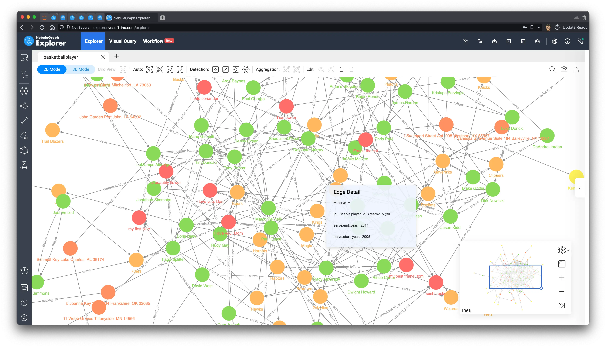

## 找出网络中的关键人物

识别社交网络中的有影响的关键人物们（influencers）涉及使用各种指标和方法来识别在特定网络中拥有大量影响力的个人。这对很多业务场景都有帮助都很有用，比如用于营销或研究网络中的信息传播。

识别他们的方法有很多，具体的方法和考量的信息、关系、角度也取决于这些关键人物的类型、和获取他们的目的。

一些常见的方法包括看一个人拥有的粉丝或内容被消费的数量，他们在其帖子、视频上读者的参与度，以及他们的内容的影响力（转发、引用）。这些方法在图上也是可以做的，但是比较平凡，我就不举例了，在这里，我们可以试着用评估、计算节点重要性的图算法，在图上得出这些关键人物。

### PageRank

PageRank 是一个非常“古老的”图算法，它通过考虑图上点之间的关系数量去迭代，得到每一个点的得分（Rank），最初由 Google 的创始人 Larry Page 和 Sergey Brin 提出并应用在早期的 Google 搜索引擎中，用来排序搜索结果，这里的 Page 可以是 Larry Page 的姓和 Web Page 的双关了。

在现代、复杂的搜索引擎中，PageRank 早就因为其过于简单而被弃用，但是在其他图结构网络场景中，PageRank 仍然在发光发热，社交网络中我们可以粗略地认为所有链接的重要程度类似，去运行这个算法找出那些关键的用户。

在 NebulaGraph 中，我们可以利用 NebulaGraph Algorithm、NebulaGraph Analytics 去在大的全图上运行 PageRank，而在日常的分析、验证、设计截断，我们不需要在全量数据上跑结果，而在很小的子图上（最多上万），我们可以轻松地在浏览器里边运行各种图算法去得出线上业务可以用的方法。

今天，我们就用 NebulaGraph Explorer 内置的浏览器内图算法功能执行一下 PageRank 看看（具体方法这里略去，可以参考[文档](https://docs.nebula-graph.com.cn/3.3.0/nebula-explorer/graph-explorer/graph-algorithm/)，不过其实就是点一下鼠标的事儿）：

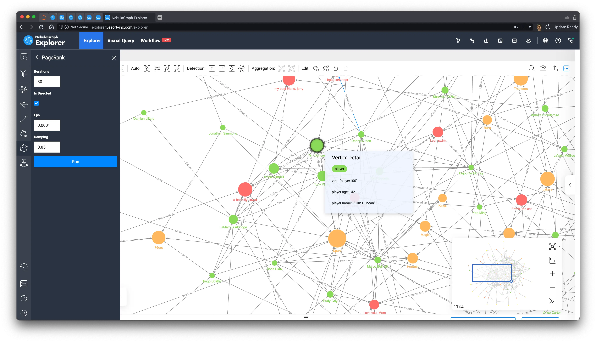

我们可以从上边看到，PageRank 计算之后所有绿色的 player（人）中，"player.name: Tim Duncan" 是最大的一个点，与之相关联的关系看起来的确不少，我们在图上选择他，再右键反选，选择除了 Tim Duncan 之外的所有点，用退格键删除所有其他的点，然后在他作为起点双向探索出1到5步，可以得到 Tim Duncan 的子图：

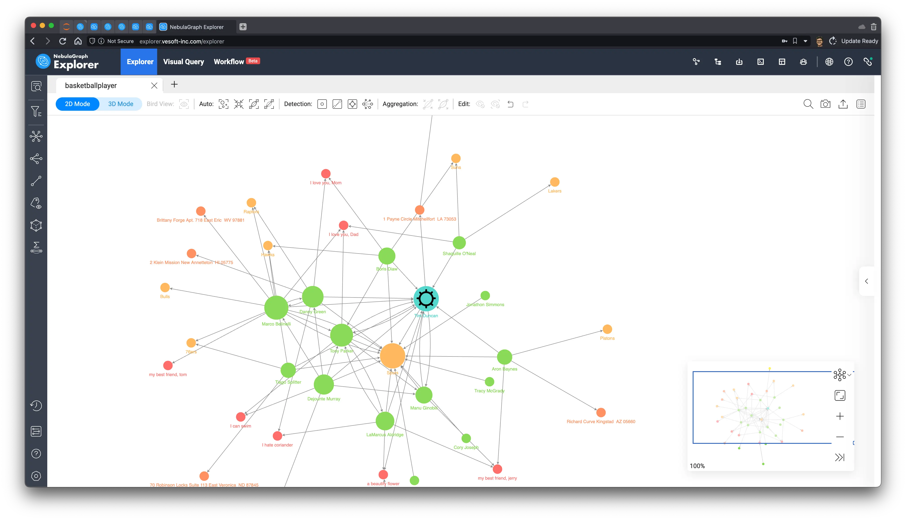

从自图中可以看到 Tim Duncan 和非常多其他球员有关注的关系的同时，一些其他很受欢迎的队员和他一起一样服役过非常热门的热刺（Spurs）队，这些都印证了 PageRank 的评估方式。

现在我们再看看其他判定维度下的算法会不会得出一样的结论呢？

### Betweenness Centrality

作为另一个流行的节点重要性算法，通过计算一个节点对于图中的中介、桥梁作用来衡量节点的重要性，这里的桥梁作用是有数学定义的量化算法，这里就不展开说了，不过从感官上可以看出它是另一个角度很符合直觉地去评估重要性的方法。

我们重新在画布上查询所有的点边之后，在浏览器里运行 Betweenness Centrality 算法，这次的结果是：


从它的五跳内子图可以看出，与之前 PageRank 所得的关键人物 Tim Duncan 呈现的星星状态不同，Dejounte Murray 的子图呈现簇状，在感官、直觉上可以想象 Dejounte Murray 真的在很多节点之间的最小路径的必经之路上，而 Tim Duncan 则似乎和更多的重要连接者产生了关联。

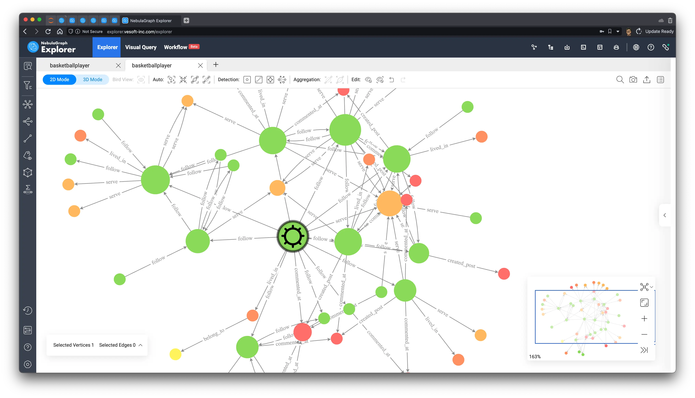

在实际的应用场景中，我们通常要通过不同方式的定义的理解、不同执行结果的试验、分析去找到我们关注的关键人物产生影响的结构特征，用来针对不同需求选择不同的算法。

## 找出社区、聚集群体

社交网络中的社区检测是一种通过分析社交关系来发现社区结构的技术。社区结构是指在社交网络、图谱中相互联系密切的一组节点，这些节点通常具有相似的特征或兴趣。例如，社区结构可能表现为用户根据共同的话题或兴趣聚集在一起的一组用户。

社区检测的目的是通过对社交网络进行分析，找出不同社区的边界，并确定每个社区中的节点。这一过程可以通过使用各种算法来完成，例如标签传播算法、弱联通分量算法和 Louvain 算法等。通过发现社区结构，可以更好地了解社交网络的结构和特征，并有助于社交网络服务提供方更好地推断和预测社交网络中的行为，帮助做好社交网络的治理、广告投放、市场营销等。

由于我们的数据集是非真实的，我在不同的算法之下得出的结果并不能展现出真实的意涵，所以本章只是展示一下利用几个图算法进行社区识别之后的结果，在真实世界的案例中，我们还应该在此基础之上利用领域知识或者其他技术手段协同给出不同群体、社区的画像、标签。

标签传播算法效果：

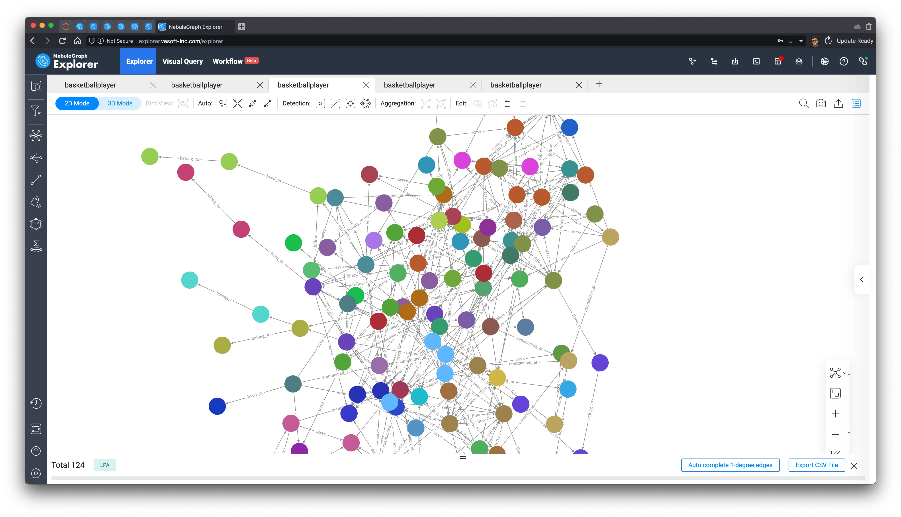


Louvain 算法效果：

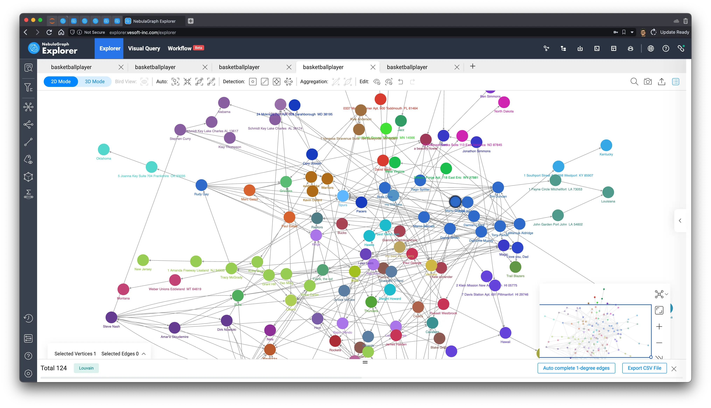

弱联通分量算法效果：

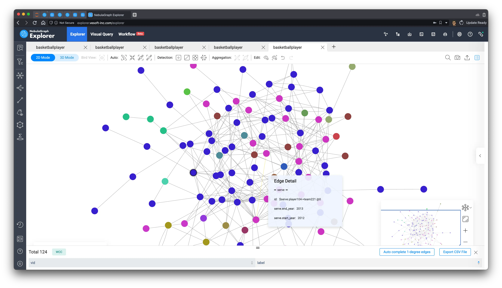

在后边的章节，我们有机会可以在更小、更简单的子图上再次验证这几个算法，结果会更有可解释性一些。

## 好友亲密度

通过社区识别算法，其实是能够在一定程度上，在全局计算获得兴趣相近、关联紧密的好友的。那么如何获得一个给定用户的其他亲密好友呢？我们可以通过计算这个用户的好友中，和他共同好友的个数来排序获得这一信息！

我们拿 "Tim Duncan" 举例，我们知道，他的两度好友（好友的好友：`(:player{name: "Tim Duncan"})-[:follow]-(f:player)-[:follow]-(fof:player)`）如果同时也是他的好友的话，那么他们这个中间的好友就是他和这个朋友的共同好友（Mutual Friend），那么有理由相信那些和 Tim Duncan 有更多共同好友的人可能跟他有更高亲密度：

```cypher
MATCH (start:`player`{name: "Tim Duncan"})-[:`follow`]-(f:`player`)-[:`follow`]-(fof:`player`),
(start:`player`)-[:`follow`]-(fof:`player`)
RETURN fof.`player`.name, count(DISTINCT f) AS NrOfMutualF ORDER BY NrOfMutualF DESC;
```

这个计算结果是，"Tony Parker" 和 Tim 有 5 个共同好友，最为亲密。

| fof.player.name   | NrOfMutualF |
| :---------------- | :---------- |
| Tony Parker       | 5           |
| Dejounte Murray   | 4           |
| Manu Ginobili     | 3           |
| Marco Belinelli   | 3           |
| Danny Green       | 2           |
| Boris Diaw        | 1           |
| LaMarcus Aldridge | 1           |
| Tiago Splitter    | 1           |

下面，咱们通过可视化来验证一下这个结果吧！

先看看每一个好友的共同好友(f:)都是谁？

```cypher
MATCH (start:player{name: "Tim Duncan"})-[:`follow`]-(f:player)-[:`follow`]-(fof:player),
(start:player)-[:`follow`]-(fof:player)
RETURN fof.player.name, collect(DISTINCT f.player.name);
```

结果如下：

| fof.player.name   | collect(distinct f.player.name)                              |
| :---------------- | :----------------------------------------------------------- |
| Boris Diaw        | ["Tony Parker"]                                              |
| Manu Ginobili     | ["Dejounte Murray", "Tiago Splitter", "Tony Parker"]         |
| LaMarcus Aldridge | ["Tony Parker"]                                              |
| Tiago Splitter    | ["Manu Ginobili"]                                            |
| Tony Parker       | ["Dejounte Murray", "Boris Diaw", "Manu Ginobili", "Marco Belinelli", "LaMarcus Aldridge"] |
| Dejounte Murray   | ["Danny Green", "Tony Parker", "Manu Ginobili", "Marco Belinelli"] |
| Danny Green       | ["Dejounte Murray", "Marco Belinelli"]                       |
| Marco Belinelli   | ["Dejounte Murray", "Danny Green", "Tony Parker"]            |

 然后我们在 Explorer 上可视化一下这个结果：

- 首先，我们把 Tim 的量度好友路径全查出来

```cypher
MATCH p=(start:player{name: "Tim Duncan"})-[:`follow`]-(f:player)-[:follow]-(fof:player)
RETURN p
```

- 然后我们在其中按照度去渲染节点大小，并选中 Tim 和 Tony，并在两者之间查询 follow 类型边、双向、最多 2 跳的全部路径：

可以看出他们之间是最亲密的朋友没跑了，而且他们的共同好友也在路径之中：

`["Dejounte Murray", "Boris Diaw", "Manu Ginobili", "Marco Belinelli", "LaMarcus Aldridge"]`

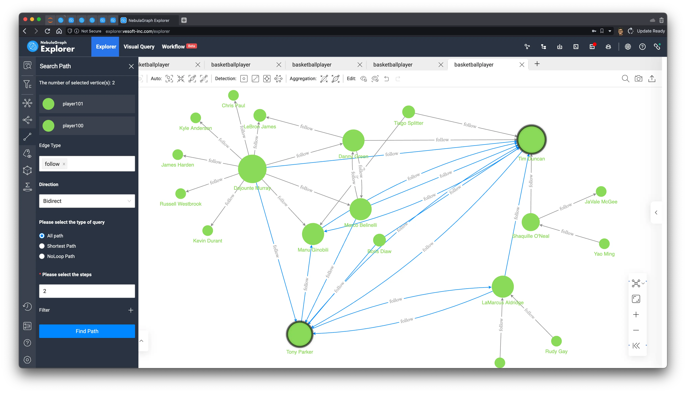

### 朋友圈子里的小群体

这时候，如前边提到，这份数据集本身的非真实性，使得社区发现算法的结果不能得到其中洞察的内涵，现在我们可以接着这个小的子图，看看 Tim 的好友中可以如何区分群组、社区呢，咱们跑一个 Louvain 、弱联通分量、标签传播看看：

- 弱联通分量，可以把 Tim 等朋友们大体分割出两三个相互不连通的部分，非常符合连通分量的直观理解和定义。

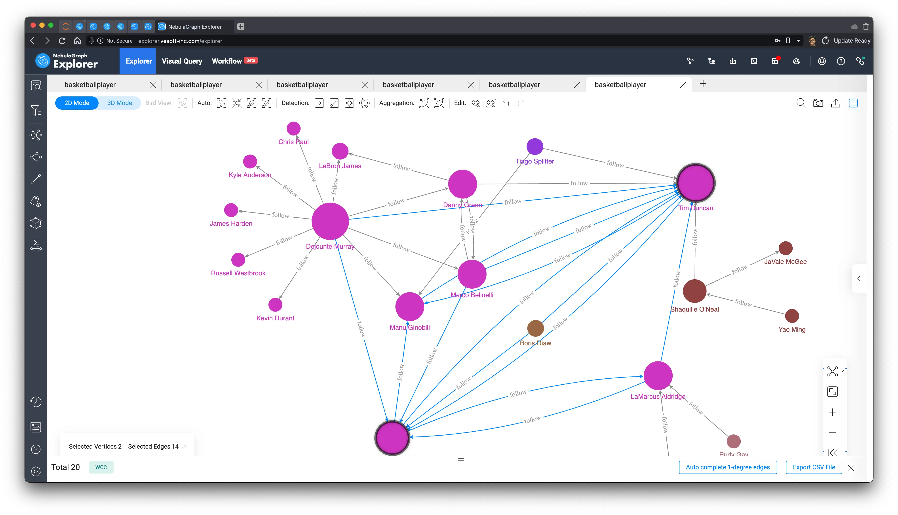


- 标签传播，我们可以通过控制迭代次数按需去通过随机的传播划定出不同的划分度，结果可以有一定的区分度：

  20 次迭代

  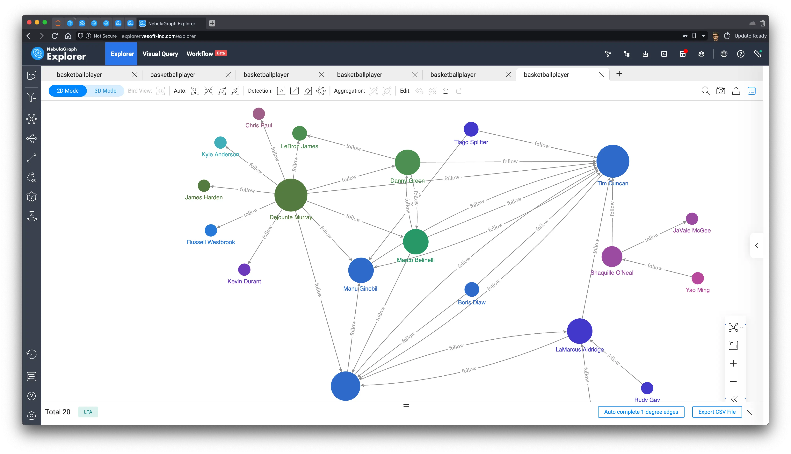

  1000 次迭代

  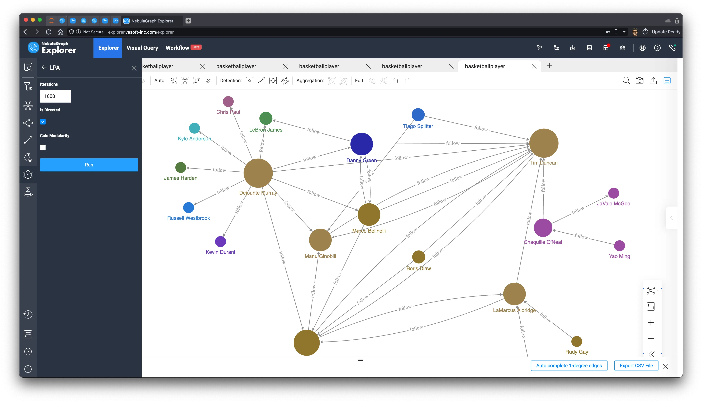

- Louvain，是一个比较高效、稳定的算法，基本上在这个子图下我们可以在很小的迭代次数下得到很符合直觉的划分：

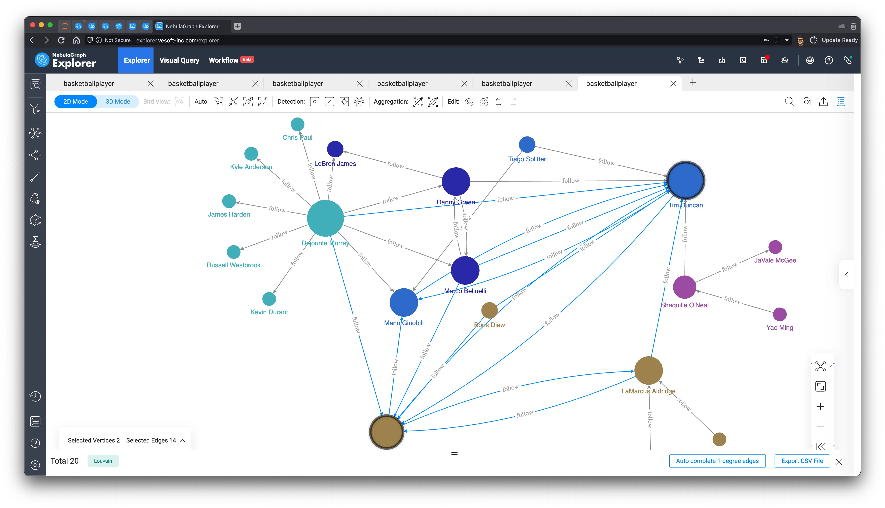

## 新朋友推荐

接着前边二度朋友（朋友的朋友）的思路，我们可以很容易把那些还不是朋友的二度朋友作为推荐添加的好友，而排序规则则是他们之间的共同好友数量：

```cypher
MATCH (start:player{name: "Tim Duncan"})-[:`follow`]-(f:player)-[:`follow`]-(fof:player)
WHERE NOT (start:player)-[:`follow`]-(fof:player) AND fof != start
RETURN fof.player.name, count(DISTINCT f) AS NrOfMutualF ORDER BY NrOfMutualF DESC;
```

| fof.player.name   | NrOfMutualF |
| :---------------- | :---------- |
| LeBron James      | 2           |
| James Harden      | 1           |
| Chris Paul        | 1           |
| Yao Ming          | 1           |
| Damian Lillard    | 1           |
| JaVale McGee      | 1           |
| Kevin Durant      | 1           |
| Kyle Anderson     | 1           |
| Rudy Gay          | 1           |
| Russell Westbrook | 1           |

显然，LeBron 最值得推荐！再看看这些共同好友都是谁？

| fof.player.name   | collect(distinct f.player.name)    |
| :---------------- | :--------------------------------- |
| James Harden      | ["Dejounte Murray"]                |
| LeBron James      | ["Danny Green", "Dejounte Murray"] |
| Chris Paul        | ["Dejounte Murray"]                |
| Yao Ming          | ["Shaquille O'Neal"]               |
| Damian Lillard    | ["LaMarcus Aldridge"]              |
| JaVale McGee      | ["Shaquille O'Neal"]               |
| Kevin Durant      | ["Dejounte Murray"]                |
| Kyle Anderson     | ["Dejounte Murray"]                |
| Rudy Gay          | ["LaMarcus Aldridge"]              |
| Russell Westbrook | ["Dejounte Murray"]                |

同样，我们在刚才的子图里找找 LeBron James 吧！我们把它俩之间的两步、双向路径找出来，果然只会经过 `["Danny Green", "Dejounte Murray"]` 并且，没有直接的连接：

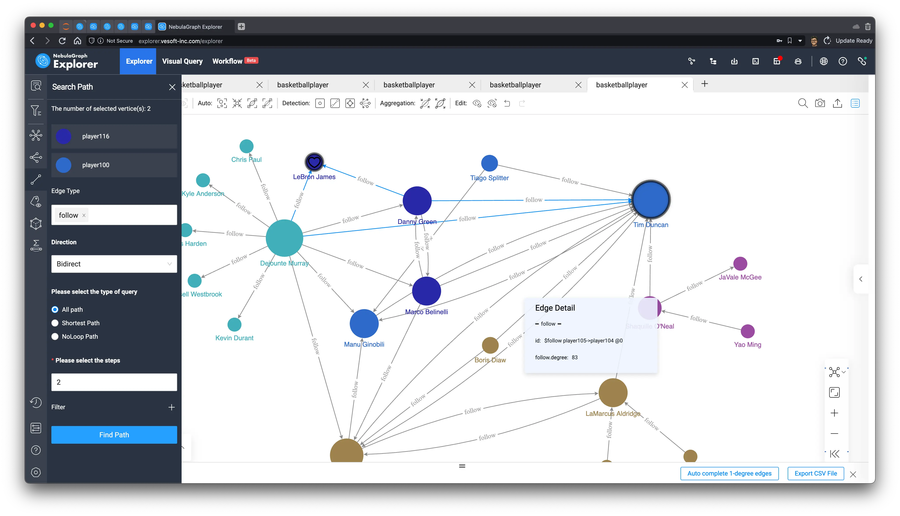

现在，系统会给两边发提醒：“hey，也许你们应该交个朋友！”

## 共同邻居

查找共同邻居是一个很常见的图库查询，它的场景可能根据不同的邻居关系，节点类型，同构、异构，带来不同的场景，前边两个场景下的共同好友本质上是两点之间的共同邻居，直接查询这样的关系用 OpenCypher 的表达非常简单。

### 两点之间的共同邻居

比如这个表达可以查询两个用户之间的共性、交集，结果可能是共同团队、去过的地方、兴趣爱好、共同参与的帖子回复等等：

```cypher
MATCH p = (`v0`)--()--(`v1`)
WHERE id(`v0`) == "player100" AND id(`v1`) == "player104"
RETURN p
```

而限定了边的类型之后，这个查询就限定在共同好友的查询了。

```cypher
MATCH p = (v0)--(:`follow`)--(v1)
WHERE id(v0) == "player100" AND id(v1) == "player104"
RETURN p
```

### 多点之间的共同邻居：内容推送

下面，我们给出一个多点共同邻居的场景，我们从一个文章触发，查出所有在这个文章上有互动的用户，找到这一群体中的共同邻居。

这个共同邻居有什么用处呢？很自然，如果这个共同邻居还没有和这个文章有任何交互，我们可以把这个文章推荐给他。

这个查询的实现很有意思：

- 第一个 MATCH 是查到所有 post11 文章下留言和作者这些人的总人数
- 在第二个 MATCH 之后，我们查到所有这群人的一度好友路径中，这些文章过的交互用户的一度好友的参与过文章的朋友数量刚好等于这个参与文章的用户的数量的这些人，他们其实就是这些所有参与用户的共同好友。

```cypher
MATCH (blog:post)<-[e]-(:player) WHERE id(blog) == "post11"
WITH blog, count(e) AS invoved_user_count
MATCH (blog:post)<-[]-(users:player)-[:`follow`]-(common_neighbor:player)
WITH toSet(collect(users)) AS users, common_neighbor, invoved_user_count
WHERE size(users) == invoved_user_count
RETURN common_neighbor
```

而这个人就是...Tony！

```cypher
+-----------------------------------------------------+
| common_neighbor                                     |
+-----------------------------------------------------+
| ("player101" :player{age: 36, name: "Tony Parker"}) |
+-----------------------------------------------------+
```

而我们可以很容易在可视化中国验证它：

```cypher
MATCH p=(blog:post)<-[]-(users:player)-[:`follow`]-(common_neighbor:player)
WHERE id(blog) == "post11"
RETURN p
```

渲染这个查询结果，然后再这篇叫做 "Let's have a party!" 的文章与 Tony 之间查找评论、po文、关注三类边的双向、两跳查询，就可以看到这些参与文章的人们无一例外，都是 Tony 的好友，而只有 Tony 自己还没去文章里留言！

而 Party 怎么可以少了 Tony 呢？难道是他的惊喜生日 Party，Opps，我们是不是不应该告诉他？

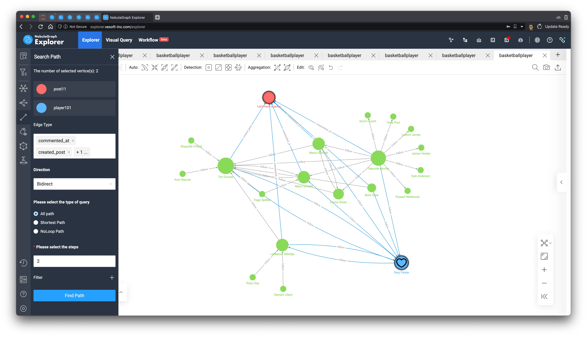


## 信息流

我在之前写过基于图技术的推荐系统实现方法，其中描述了现代推荐系统中内容过滤、排序方法可以在图谱上进行，社交网络中有一点相似但又不同的场景是信息流（Feed），它的产生类似于推荐系统中的个性化，同时有具有很高的时效性，借助于包含了内容行为知识的社交图谱可以很直观、高效去实现个性化的信息流生成。

### 好友参与的内容

最简单、直接的信息流定义可能就是在朋友圈、微博 feed 上刷一下关注的人创建、参与的内容列表了，先不考虑排序的问题，这些内容一定是：

- 一定时间段内好友创建的内容
- 一定时间端内好友评论的内容

我们可以用 cypher 表达这个查询用户 id 为 player100 的信息流：

```cypher
MATCH (feed_owner:player)-[:`follow`]-(friend:player) WHERE id(feed_owner) == "player100"
OPTIONAL MATCH (friend:player)-[newly_commented:commented_at]->(:post)<-[:created_post]-(feed_owner:player)
    WHERE newly_commented.post_time > timestamp("2010-01-01 00:00:00")
OPTIONAL MATCH (friend:player)-[newly_created:created_post]->(po:post)
    WHERE newly_created.post_time > timestamp("2010-01-01 00:00:00")
WITH DISTINCT friend,
    collect(DISTINCT po.post.title) + collect("comment of " + dst(newly_commented))
        AS feeds WHERE size(feeds) > 0
RETURN friend.player.name, feeds
```

| friend.player.name | feeds                                                        |
| :----------------- | :----------------------------------------------------------- |
| Boris Diaw         | ["I love you, Mom", "comment of post11"]                     |
| Marco Belinelli    | ["my best friend, tom", "comment of post11"]                 |
| Danny Green        | ["comment of post1"]                                         |
| Tiago Splitter     | ["comment of post1"]                                         |
| Dejounte Murray    | ["comment of post11"]                                        |
| Tony Parker        | ["I can swim"]                                               |
| LaMarcus Aldridge  | ["I hate coriander", "comment of post11", "comment of post1"] |
| Manu Ginobili      | ["my best friend, jerry", "comment of post11", "comment of post11"] |

于是，我们可以把这些评论、文章发送到用户的 feed 之上了。

我们也来看看他们在图上的样子吧，我们输出所有查到的路径：

```cypher
MATCH p=(feed_owner:player)-[:`follow`]-(friend:player) WHERE id(feed_owner) == "player100"
OPTIONAL MATCH p_comment=(friend:player)-[newly_commented:commented_at]->(:post)<-[:created_post]-(feed_owner:player)
    WHERE newly_commented.post_time > timestamp("2010-01-01 00:00:00")
OPTIONAL MATCH p_post=(friend:player)-[newly_created:created_post]->(po:post)
    WHERE newly_created.post_time > timestamp("2010-01-01 00:00:00")
RETURN p, p_comment, p_post
```

渲染在 Explorer 上，选择“神经网络”这个布局，可以很清晰看出这些粉色的文章节点，还有代表评论的边。

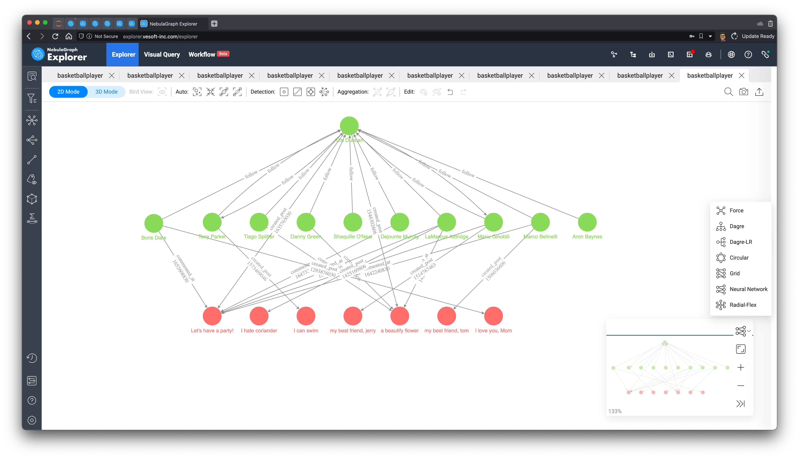

### 附近好友的内容

我们再进一步，把地理信息考虑进来，获取那些住址的经纬度小于一定距离朋友相关的内容。

这里，我们用到了 NebulaGraph 的 GeoSpatial 地理功能，`ST_Distance(home.address.geo_point, friend_addr.address.geo_point) AS distance WHERE distance < 1000000` 的约束条件帮我们表达了距离的限制。

```cypher
MATCH (home:address)-[:lived_in]-(feed_owner:player)-[:`follow`]-(friend:player)-[:lived_in]-(friend_addr:address)
    WHERE id(feed_owner) == "player100"
WITH feed_owner, friend, ST_Distance(home.address.geo_point, friend_addr.address.geo_point) AS distance WHERE distance < 1000000

OPTIONAL MATCH (friend:player)-[newly_commented:commented_at]->(:post)<-[:created_post]-(feed_owner:player)
    WHERE newly_commented.post_time > timestamp("2010-01-01 00:00:00")
OPTIONAL MATCH (friend:player)-[newly_created:created_post]->(po:post)
    WHERE newly_created.post_time > timestamp("2010-01-01 00:00:00")
WITH DISTINCT friend,
    collect(DISTINCT po.post.title) + collect("comment of " + dst(newly_commented))
        AS feeds WHERE size(feeds) > 0
RETURN friend.player.name, feeds
```

| friend.player.name | feeds                                        |
| :----------------- | :------------------------------------------- |
| Marco Belinelli    | ["my best friend, tom", "comment of post11"] |
| Tony Parker        | ["I can swim"]                               |
| Danny Green        | ["comment of post1"]                         |

这时候，从可视化这个结果也可以看到住址这一关系，以及它们的经纬度信息，我手动根据它们的经纬度，把地址的节点在图上排布了一下可以看到这个 feed 的主人 Tim(player100) 的住址（7，8）刚好在其他好友住址的中间位置，这些临近好友的相关的文章和参与评论的内容将被作为信息流推送给 Tim：

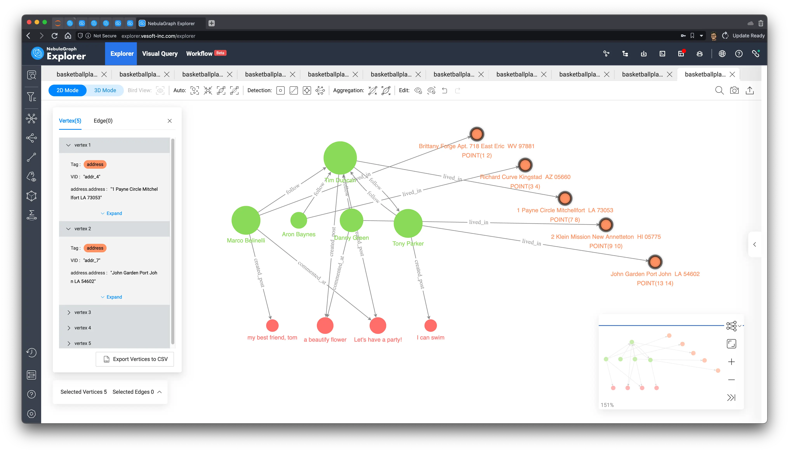

## 时空关系追踪

时空关系追踪这个图谱应用是在公共安全、物流、疫情防控等场景下，利用图遍历将繁杂、凌乱的信息充分利用起来的典型应用。当我们建立起这样的图谱之后往往只需要简单的图查询就可以获得非常有用的洞察。本章节我给大家距离一下这个应用场景。

### 数据集

为此，我创建了一个虚拟的数据集由来构建一个时空关系图谱。数据集的生成程序和一份可以直接用的文件都放在了 GitHub 上，仓库地址是： https://github.com/wey-gu/covid-track-graph-datagen 。

它的数据建模如下：


在一个全新的环境里，我们可以用下边的 3 行命令就准备好这个图谱：

```bash
# 安装 NebulaGraph + NebulaGraph Studio
curl -fsSL nebula-up.siwei.io/install.sh | bash -s -- v3
# 下载数据集
git clone https://github.com/wey-gu/covid-track-graph-datagen && cd covid-track-graph-datagen
# 导入数据集
docker run --rm -ti \
    --network=nebula-net \
    -v ${PWD}/:/root \
    vesoft/nebula-importer:v3.2.0 \
    --config /root/nebula-importer-config.yaml
```

然后我们在 console 里查看一下数据

```bash
~/.nebula-up/console.sh
# 进入 console 了，进到 covid_trace 图空间（刚才创建的）
USE covid_trace;
# 执行数据统计的任务
SHOW JOB STATS
```

结果：

```bash
(root@nebula) [covid_trace]> SHOW STATS
+---------+------------+--------+
| Type    | Name       | Count  |
+---------+------------+--------+
| "Tag"   | "人"       | 10000  |
| "Tag"   | "地址"     | 1000   |
| "Tag"   | "城市"     | 341    |
| "Tag"   | "村镇"     | 42950  |
| "Tag"   | "省份"     | 32     |
| "Tag"   | "联系方式" | 0      |
| "Tag"   | "行政区"   | 3134   |
| "Tag"   | "街道"     | 667911 |
| "Edge"  | "住址"     | 0      |
| "Edge"  | "到访"     | 19986  |
| "Edge"  | "同住"     | 19998  |
| "Edge"  | "属于"     | 715336 |
| "Space" | "vertices" | 725368 |
| "Space" | "edges"    | 755320 |
+---------+------------+--------+
Got 14 rows (time spent 1087/46271 us)
```

### 两人之间的关联

很自然，利用路径查询就可以了：

```cypher
# 最短
FIND SHORTEST PATH FROM "p_100" TO "p_101" OVER * BIDIRECT YIELD PATH AS paths

# 所有路径
FIND ALL PATH FROM "p_100" TO "p_101" OVER * BIDIRECT YIELD PATH AS paths | LIMIT 10
```

最短路径结果：

| paths                                                        |
| :----------------------------------------------------------- |
| <("p_100")<-[:同住@0 {}]-("p_2136")<-[:同住@0 {}]-("p_3708")-[:到访@0 {}]->("a_125")<-[:到访@0 {}]-("p_101")> |

所有路径结果：

| paths                                                        |
| :----------------------------------------------------------- |
| <("p_100")<-[:同住@0 {}]-("p_2136")<-[:同住@0 {}]-("p_3708")-[:到访@0 {}]->("a_125")<-[:到访@0 {}]-("p_101")> |
| <("p_100")-[:到访@0 {}]->("a_328")<-[:到访@0 {}]-("p_6976")<-[:同住@0 {}]-("p_261")-[:到访@0 {}]->("a_352")<-[:到访@0 {}]-("p_101")> |
| <("p_100")-[:同住@0 {}]->("p_8709")-[:同住@0 {}]->("p_9315")-[:同住@0 {}]->("p_261")-[:到访@0 {}]->("a_352")<-[:到访@0 {}]-("p_101")> |
| <("p_100")-[:到访@0 {}]->("a_328")<-[:到访@0 {}]-("p_6311")-[:同住@0 {}]->("p_3941")-[:到访@0 {}]->("a_345")<-[:到访@0 {}]-("p_101")> |
| <("p_100")-[:到访@0 {}]->("a_328")<-[:到访@0 {}]-("p_5046")-[:同住@0 {}]->("p_3993")-[:到访@0 {}]->("a_144")<-[:到访@0 {}]-("p_101")> |
| <("p_100")-[:同住@0 {}]->("p_3457")-[:到访@0 {}]->("a_199")<-[:到访@0 {}]-("p_6771")-[:到访@0 {}]->("a_458")<-[:到访@0 {}]-("p_101")> |
| <("p_100")<-[:同住@0 {}]-("p_1462")-[:到访@0 {}]->("a_922")<-[:到访@0 {}]-("p_5869")-[:到访@0 {}]->("a_345")<-[:到访@0 {}]-("p_101")> |
| <("p_100")<-[:同住@0 {}]-("p_9489")-[:到访@0 {}]->("a_985")<-[:到访@0 {}]-("p_2733")-[:到访@0 {}]->("a_458")<-[:到访@0 {}]-("p_101")> |
| <("p_100")<-[:同住@0 {}]-("p_9489")-[:到访@0 {}]->("a_905")<-[:到访@0 {}]-("p_2733")-[:到访@0 {}]->("a_458")<-[:到访@0 {}]-("p_101")> |
| <("p_100")-[:到访@0 {}]->("a_89")<-[:到访@0 {}]-("p_1333")<-[:同住@0 {}]-("p_1683")-[:到访@0 {}]->("a_345")<-[:到访@0 {}]-("p_101")> |

我们把所有路径进行可视化渲染，标记出起点终点的两人，并在其中查到他们的最短路径，他们之间的千丝万缕关系就一目了然了，无论是商业洞察、公共安全还是疫情防控的目的，有了这个信息，相应的工作都可以如虎添翼地向下进展。

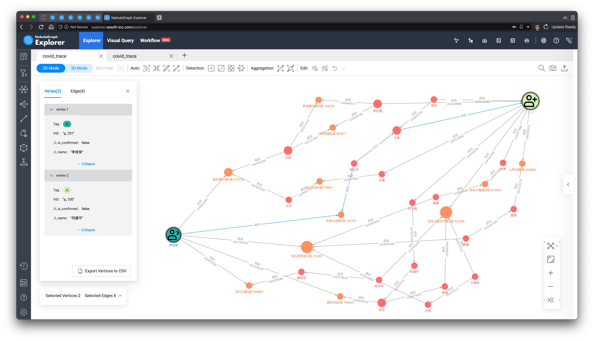

当然，在真实的系统上，可能我们只需要关心两个用户之间的关联远近，得出量化的评估：

```cypher
FIND SHORTEST PATH FROM "p_100" TO "p_101" OVER * BIDIRECT YIELD PATH AS paths |
    YIELD collect(length($-.paths)) AS len | YIELD coalesce($-.len[0], -1) AS len
```

结果中我们只关心他们之间最短路径的长度为：4。

| len  |
| :--- |
| 4    |

### 时空相交的人

进一步我们可以用图语义勾勒出我们想确定的任何带有时间与空间信息的模式，在图谱中实时查询出来，比如对给定的人，他的 id 是 p_101，我们相差在特定时间里所有和他有时空相交的人，这意味着那些人在 p_101 访问某一地方的时间段之内也逗留、访问了这些地方：

```cypher
MATCH (p:人)-[`visit0`:到访]->(`addr`:地址)<-[`visit1`:到访]-(p1:人)
    WHERE id(p) == "p_101" AND `visit0`.`start_time` < `visit1`.`end_time`
    RETURN `addr`.地址.`name`, collect(p1.人.`name`)
```

我们得到了再每一个到访地点的时空相交人列表如下：

| addr.地址.name       | collect(p1.人.name)                                          |
| :------------------- | :----------------------------------------------------------- |
| 闵行仇路q座 255960   | ["徐畅", "王佳", "曾亮", "姜桂香", "邵秀英", "韦婷婷", "陶玉", "马坤", "黄想", "张秀芳", "颜桂芳", "张洋"] |
| 丰都北京路J座 725701 | ["陈春梅", "施婷婷", "井成", "范文", "王楠", "尚明", "薛秀珍", "宋金凤", "杨雪", "邓丽华", "李杨", "温佳", "叶玉", "周明", "王桂珍", "段玉华", "金成", "黄鑫", "邬兵", "魏柳", "王兰英", "杨柳"] |
| 普陀潜江路P座 210730 | ["储平", "洪红霞", "沈玉英", "王洁", "董玉英", "邓凤英", "谢海燕", "梁雷", "张畅", "任玉兰", "贾宇", "汪成", "孙琴", "纪红梅", "王欣", "陈兵", "张成", "王东", "谷霞", "林成"] |
| 普陀武街f座 706352   | ["邢成", "张建军", "张鑫", "戴涛", "蔡洋", "汪燕", "尹亮", "何利", "何玉", "周波", "金秀珍", "杨波", "张帅", "周柳", "马云", "张建华", "王丽丽", "陈丽", "万萍"] |
| 城东贵阳街O座 110567 | ["李洁", "陈静", "王建国", "方淑华", "古想", "漆萍", "詹桂花", "王成", "李慧", "孙娜", "马伟", "谢杰", "王鹏", "鞠桂英", "莫桂英", "汪雷", "黄彬", "李玉梅", "祝红梅"] |

现在，我们在图上可视化这个结果看看：

```cypher
MATCH (p:人)-[`visit0`:到访]->(`addr`:地址)<-[`visit1`:到访]-(p1:人)
    WHERE id(p) == "p_101" AND `visit0`.`start_time` < `visit1`.`end_time`
    RETURN paths;
```

结果中我们标记了 p_101 为不同的图标，在用标签传播算法识别一下聚集社区，是不是一图胜千言呢？

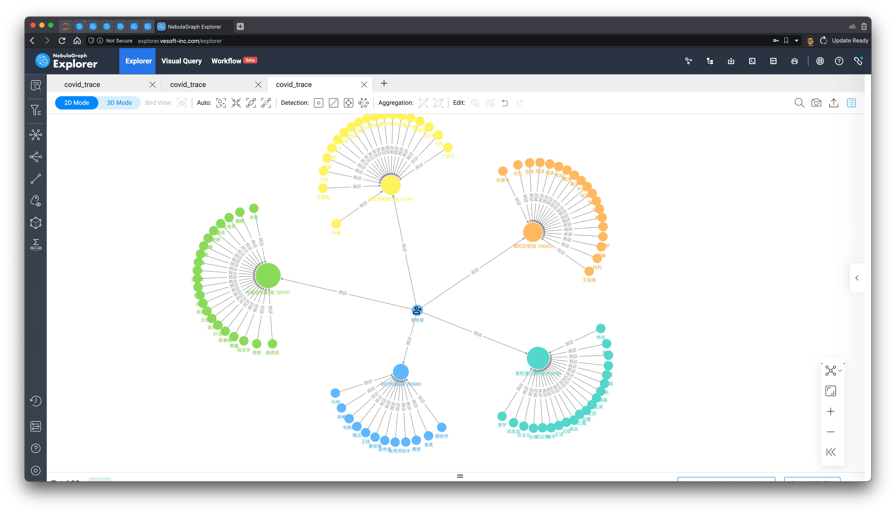

### 最近去过的省份

最后，我们再用简单的查询模式表达出一个人在给定时间内，比如从一个时间点开始，到访过的所有省份

```cypher
MATCH (p:人)-[visit:到访]->(`addr`:地址)-[:属于*5]-(province:省份)
    WHERE id(p) == "p_101" AND visit.start_time > 1625469000
    RETURN province.省份.name, collect(addr.地址.name);
```

看起来他/她去过不少地方呢：

| province.省份.name | collect(addr.地址.name)  |
| :----------------- | :----------------------- |
| 四川省             | ["闵行仇路q座 255960"]   |
| 山东省             | ["城东贵阳街O座 110567"] |
| 云南省             | ["丰都北京路J座 725701"] |
| 福建省             | ["普陀潜江路P座 210730"] |
| 内蒙古自治区       | ["普陀武街f座 706352"]   |

老轨迹，我们在图上看看这个结果吧，这次，我们选择 Dagre-LR 这个布局渲染，结果是不是非常清晰呢？

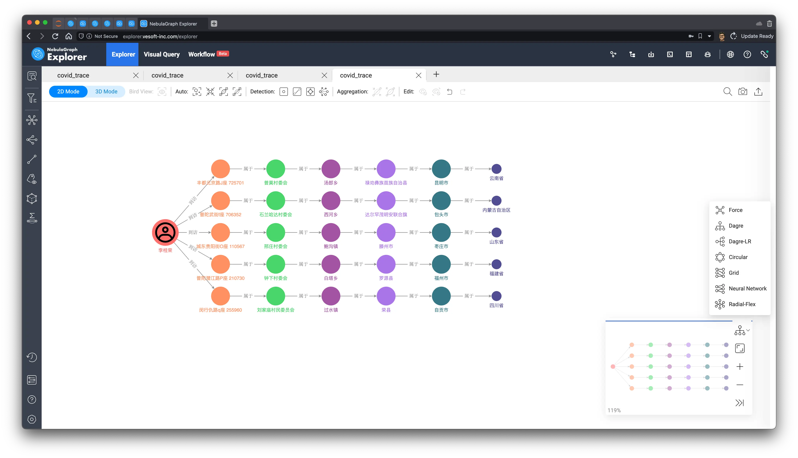

## 总结

我们给出了不少社交网络里的应用案例，包括：

- 查找关键的人
- 识别聚集的人群、社群
- 判定两个用户之间的亲密度
- 推荐新朋友
- 利用共同邻居精准推送重要内容
- 根据好友关系、地理位置推送信息流
- 利用时空关系图谱查询人与人之间关系、获取时空相交的人、访问过的省份

社交网络作为天然的图结构，非常适合用图的技术来存储、查询、计算、分析与可视化去解决其上的各式各样的问题，NebulaGraph 的强大处理能力和可视化能力使得我们已知很多公司在使用它作为社交领域的图存储、计算层，这其中包括：网易游戏、微信、Line、Soul、快手和知乎等等很多行业领先的团队，希望大家通过本章能对社交领域的图技术应有有一个初步的认识。


> 题图版权：by [Ryoji](https://unsplash.com/photos/IBaVuZsJJTo)

