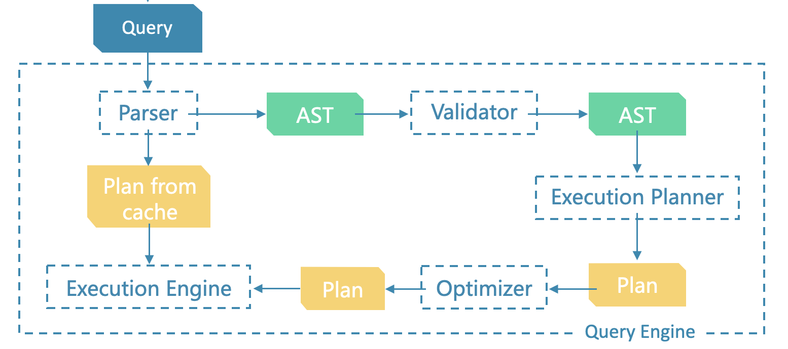
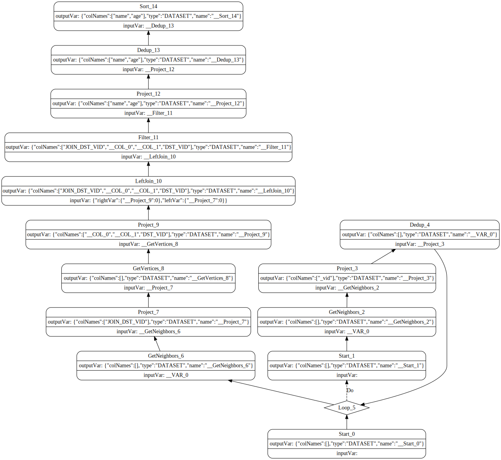

# nGQL 简明教程，第二期 nGQL 执行计划详解与调优


> 本文旨在帮助 NebulaGraph 新手快速了解查询语句调优，读懂查询计划。

<!--more-->

很长时间以来，NebulaGraph 社区里最热门之一的话题都是“我如何表达这样的查询最好？“，”我这个查询还有优化空间吗？“这一类的。今天，我就试着介绍一下如何理解查询语句的执行与优化过程，帮助大家脚踩在地上去写自己的查询语句。

同时，这篇文章也是 [nGQL 简明教程系列](https://www.siwei.io/ngql-tutorial/)的第二期，通过本文了解面向性能去写查询语句之后，我们在进行图建模的过程（第三期的内容）中也能有更多支撑。

## 一个查询的一生

先从一个查询语句从进入 NebulaGraph 一直到返回查询结果的全过程。

在开始之前，推荐阅读如下源码解读、架构设计的文章：

> 参考文章
>
> - https://nebula-graph.com.cn/posts/nebula-graph-architecture-overview
> - https://nebula-graph.com.cn/posts/nebula-graph-source-code-reading-01
> - https://nebula-graph.com.cn/posts/nebula-graph-source-code-reading-02
> - https://nebula-graph.com.cn/posts/nebula-graph-source-code-reading-03
> - https://nebula-graph.com.cn/posts/nebula-graph-source-code-reading-04
> - https://nebula-graph.com.cn/posts/nebula-graph-source-code-reading-05
> - https://nebula-graph.com.cn/posts/how-indexing-works-in-nebula-graph

简单来说，一个查询语句被从 GraphClient 发送给 GraphD 之后，经历了：

- 在 Parser 中被解析成抽象语法树(AST)
- 在 Validator, Planner 中被写成执行计划图，图中的每一个顶点 PlanNode 对应着一种算子
- 通过 Optimizer 中的优化规则（RBO）改写执行计划图
- 优化过的计划图被执行引擎从图的根部开始执行

的过程：



举一个例子，在查年龄大于 34 岁的三跳好友的语句被查询之后

```sql
GO 3 STEPS FROM "player100" OVER follow WHERE $$.player.age > 34 YIELD DISTINCT $$.player.name AS name, $$.player.age AS age | ORDER BY $-.age ASC, $-.name DESC;
```

语句经过了解析、验证、优化之后，最终的执行计划是， `Start -> Loop -> Start -> GetNeighbors -> Project -> Dedup -> Loop -> GetNeighbors -> Project -> GetVertices -> Project -> LeftJoin -> Filter -> Project -> Dedup -> Sort`，或者如下图所示。



了解这个优化过程和最终执行计划意味着什么是调优查询、面向性能设计图建模的关键。

> 这个计划图由添加了 `PROFILE FORMAT="DOT"` 的执行结果中的 `digraph` 部分，借助 graphviz 渲染而得，的https://dreampuf.github.io/GraphvizOnline 是一个方便的线上渲染的工具。
>
> 另外，值得注意的是，`FORMAT="DOT"` 省略之后的输出结果是表格形式的，并且，有更多信息会展示出来，后边我们会解读。
>
> ```sql
> (root@nebula) [basketballplayer]> PROFILE FORMAT="DOT" GO 3 STEPS FROM "player100" OVER follow WHERE $$.player.age > 34 YIELD DISTINCT $$.player.name AS name, $$.player.age AS age | ORDER BY $-.age ASC, $-.name DESC;
> +-----------------+-----+
> | name            | age |
> +-----------------+-----+
> | "Tony Parker"   | 36  |
> | "Manu Ginobili" | 41  |
> | "Tim Duncan"    | 42  |
> +-----------------+-----+
> Got 3 rows (time spent 8885/19871 us)
> 
> Execution Plan (optimize time 1391 us)
> 
> ------------------------------------------------------------------------------------------------------------------------------------------------------------------------------------------------------------------------------------------------------------------------------------
>   plan
> ------------------------------------------------------------------------------------------------------------------------------------------------------------------------------------------------------------------------------------------------------------------------------------
>   digraph exec_plan {
>       rankdir=BT;
>       "Sort_14"[label="{Sort_14|outputVar: \{\"colNames\":\[\"name\",\"age\"\],\"type\":\"DATASET\",\"name\":\"__Sort_14\"\}|inputVar: __Dedup_13}", shape=Mrecord];
>       "Dedup_13"->"Sort_14";
>       "Dedup_13"[label="{Dedup_13|outputVar: \{\"colNames\":\[\"name\",\"age\"\],\"type\":\"DATASET\",\"name\":\"__Dedup_13\"\}|inputVar: __Project_12}", shape=Mrecord];
>       "Project_12"->"Dedup_13";
>       "Project_12"[label="{Project_12|outputVar: \{\"colNames\":\[\"name\",\"age\"\],\"type\":\"DATASET\",\"name\":\"__Project_12\"\}|inputVar: __Filter_11}", shape=Mrecord];
>       "Filter_11"->"Project_12";
>       "Filter_11"[label="{Filter_11|outputVar: \{\"colNames\":\[\"JOIN_DST_VID\",\"__COL_0\",\"__COL_1\",\"DST_VID\"\],\"type\":\"DATASET\",\"name\":\"__Filter_11\"\}|inputVar: __LeftJoin_10}", shape=Mrecord];
>       "LeftJoin_10"->"Filter_11";
>       "LeftJoin_10"[label="{LeftJoin_10|outputVar: \{\"colNames\":\[\"JOIN_DST_VID\",\"__COL_0\",\"__COL_1\",\"DST_VID\"\],\"type\":\"DATASET\",\"name\":\"__LeftJoin_10\"\}|inputVar: \{\"rightVar\":\{\"__Project_9\":0\},\"leftVar\":\{\"__Project_7\":0\}\}}", shape=Mrecord];
>       "Project_9"->"LeftJoin_10";
>       "Project_9"[label="{Project_9|outputVar: \{\"colNames\":\[\"__COL_0\",\"__COL_1\",\"DST_VID\"\],\"type\":\"DATASET\",\"name\":\"__Project_9\"\}|inputVar: __GetVertices_8}", shape=Mrecord];
>       "GetVertices_8"->"Project_9";
>       "GetVertices_8"[label="{GetVertices_8|outputVar: \{\"colNames\":\[\],\"type\":\"DATASET\",\"name\":\"__GetVertices_8\"\}|inputVar: __Project_7}", shape=Mrecord];
>       "Project_7"->"GetVertices_8";
>       "Project_7"[label="{Project_7|outputVar: \{\"colNames\":\[\"JOIN_DST_VID\"\],\"type\":\"DATASET\",\"name\":\"__Project_7\"\}|inputVar: __GetNeighbors_6}", shape=Mrecord];
>       "GetNeighbors_6"->"Project_7";
>       "GetNeighbors_6"[label="{GetNeighbors_6|outputVar: \{\"colNames\":\[\],\"type\":\"DATASET\",\"name\":\"__GetNeighbors_6\"\}|inputVar: __VAR_0}", shape=Mrecord];
>       "Loop_5"->"GetNeighbors_6";
>       "Loop_5"[shape=diamond];
>       "Dedup_4"->"Loop_5";
>       "Loop_5"->"Start_1"[label="Do", style=dashed];
>       "Start_0"->"Loop_5";
>       "Dedup_4"[label="{Dedup_4|outputVar: \{\"colNames\":\[\],\"type\":\"DATASET\",\"name\":\"__VAR_0\"\}|inputVar: __Project_3}", shape=Mrecord];
>       "Project_3"->"Dedup_4";
>       "Project_3"[label="{Project_3|outputVar: \{\"colNames\":\[\"_vid\"\],\"type\":\"DATASET\",\"name\":\"__Project_3\"\}|inputVar: __GetNeighbors_2}", shape=Mrecord];
>       "GetNeighbors_2"->"Project_3";
>       "GetNeighbors_2"[label="{GetNeighbors_2|outputVar: \{\"colNames\":\[\],\"type\":\"DATASET\",\"name\":\"__GetNeighbors_2\"\}|inputVar: __VAR_0}", shape=Mrecord];
>       "Start_1"->"GetNeighbors_2";
>       "Start_1"[label="{Start_1|outputVar: \{\"colNames\":\[\],\"type\":\"DATASET\",\"name\":\"__Start_1\"\}|inputVar: }", shape=Mrecord];
>       "Start_0"[label="{Start_0|outputVar: \{\"colNames\":\[\],\"type\":\"DATASET\",\"name\":\"__Start_0\"\}|inputVar: }", shape=Mrecord];
>   }
> ------------------------------------------------------------------------------------------------------------------------------------------------------------------------------------------------------------------------------------------------------------------------------------
> ```

### 查询计划

为了理解一个查询在整个生命周期中，如何反应到执行层面，以及它们的性能代价是多少，我们从认识它的执行计划开始入手。

以前边的图的拓展的 GO 语句为例，它的整个过程经历了如下节点

- GetNeighbors 是执行计划中最重要的节点，GetNeighbors 算子会在运行期访问存储服务，拿到通过起点和指定边类型一步拓展后终点的 id
- 多步拓展通过 Loop 节点实现，Start 到 Loop 之间是 Loop 子计划，当满足条件时 Loop 子计划会被循环执行，最后一步拓展节点在 Loop 外实现
- Project 节点用来获取当前拓展的终点 id
- Dedup 节点对终点 id 进行去重后作为下一步拓展的起点
- GetVertices 节点负责取终点 tag 的属性
- Filter 做条件过滤
- LeftJoin 的作用是合并 GetNeightbors 和 GetVertices 的结果
- Sort 做排序

而这些节点就是不同的算子。

## 认识算子

在 NebulaGraph 博客的代码解读文章中已经有很多算子被提及、解释过，这里列举其中部分常见的算子：

> 注：这里没有提及 GET SUBGRAPH/ FIND PATH 中的算子。

| 算子               | 介绍                                                         |
| ------------------ | ------------------------------------------------------------ |
| GetNeighbor        | 根据指定的 vid ，从存储层获取起始点和边的属性                |
| Traverse           | 仅用于MATCH 匹配 `()-[e:0..n]-()` 模式，获取拓展过程中的起始点和边的属性 |
| AppendVertices     | 仅用于MATCH ，和 Traverse 配合获取点的属性                   |
| GetEdge            | 获取边的属性                                                 |
| GetVertices        | 获取点的属性，FETCH PROP 或者 GO 语句中。                    |
| ScanEdge           | 全表扫描边，例如 `MATCH ()-[e]->() RETURN e LIMIT 3 `        |
| ScanVertices       | 全表扫描点，例如 `MATCH (v) return v LIMIT 3`                |
| IndexScan          | MATCH 语句中找到起始点的索引查询                             |
| TagIndexPrefixScan | LOOKUP 语句中前缀扫描 `LOOKUP ON player where player.name == "Steve Nash" YIELD player.name` |
| TagIndexRangeScan  | LOOKUP 语句中范围扫描 `LOOKUP ON player where player.name > "S" YIELD player.name` |
| TagIndexFullScan   | LOOKUP 语句中全扫描 `LOOKUP ON player YIELD player.name`     |
| Filter             | 按条件过滤，例如 WHERE 语句                                  |
| Project            | 获取上一步算子的列                                           |
| Dedup              | 去重                                                         |
| LeftJoin           | 合并结果                                                     |
| LIMIT              | 限制输出行数                                                 |

从这些算子的含义中已经可以更加具体的知道图数据库查询落到查询引擎（GraphD）内部的最小所需操作了，而性能调优的关键就在于如何规划、优化一个查询如何被拆解为算子的执行计划。

## 认识优化规则

对于任何给定的查询，执行计划并不是唯一确定的，相反，在最简单、直接的计划基础之上，优化器（Optimizer）会进行很多性能上的优化。

NebulaGraph 目前的优化器是完全的基于规则的优化（RBO），这些预设的规则的代码都在 [src/graph/optimizer](https://github.com/vesoft-inc/nebula/tree/master/src/graph/optimizer) 的 `rules` 里边，它们都是针对执行计划模式的修改规则，之前 Shylock 在[这篇文章](https://nebula-graph.com.cn/posts/nebula-graph-source-code-reading-04)里给过源码层面的介绍，大家可以去读一下。

值得庆幸的是，今年，大部分优化规则的代码里增加了很多好理解的 asciiart 图形注释，结合优化规则的命名本身的自解释性，我们可以很快速去大概理解优化规则的匹配规则和转换逻辑。

首先，这些规则的转换(transform)代码都在 `.cpp` 文件里，asciiart 图形注释在同名对应的 `.h` 里！

```bash
ls src/graph/optimizer/rule/*.h
src/graph/optimizer/rule/CollapseProjectRule.h                      src/graph/optimizer/rule/PushFilterDownLeftJoinRule.h
src/graph/optimizer/rule/CombineFilterRule.h                        src/graph/optimizer/rule/PushFilterDownNodeRule.h
src/graph/optimizer/rule/EdgeIndexFullScanRule.h                    src/graph/optimizer/rule/PushFilterDownProjectRule.h
src/graph/optimizer/rule/EliminateAppendVerticesRule.h              src/graph/optimizer/rule/PushFilterDownScanVerticesRule.h
src/graph/optimizer/rule/EliminateRowCollectRule.h                  src/graph/optimizer/rule/PushLimitDownGetNeighborsRule.h
src/graph/optimizer/rule/GeoPredicateEdgeIndexScanRule.h            src/graph/optimizer/rule/PushLimitDownIndexScanRule.h
src/graph/optimizer/rule/GeoPredicateIndexScanBaseRule.h            src/graph/optimizer/rule/PushLimitDownProjectRule.h
src/graph/optimizer/rule/GeoPredicateTagIndexScanRule.h             src/graph/optimizer/rule/PushLimitDownScanAppendVerticesRule.h
src/graph/optimizer/rule/GetEdgesTransformAppendVerticesLimitRule.h src/graph/optimizer/rule/PushLimitDownScanEdgesAppendVerticesRule.h
src/graph/optimizer/rule/GetEdgesTransformRule.h                    src/graph/optimizer/rule/PushLimitDownScanEdgesRule.h
src/graph/optimizer/rule/GetEdgesTransformUtils.h                   src/graph/optimizer/rule/PushStepLimitDownGetNeighborsRule.h
src/graph/optimizer/rule/IndexFullScanBaseRule.h                    src/graph/optimizer/rule/PushStepSampleDownGetNeighborsRule.h
src/graph/optimizer/rule/IndexScanRule.h                            src/graph/optimizer/rule/PushTopNDownIndexScanRule.h
src/graph/optimizer/rule/MergeGetNbrsAndDedupRule.h                 src/graph/optimizer/rule/PushVFilterDownScanVerticesRule.h
src/graph/optimizer/rule/MergeGetNbrsAndProjectRule.h               src/graph/optimizer/rule/RemoveNoopProjectRule.h
src/graph/optimizer/rule/MergeGetVerticesAndDedupRule.h             src/graph/optimizer/rule/RemoveProjectDedupBeforeGetDstBySrcRule.h
src/graph/optimizer/rule/MergeGetVerticesAndProjectRule.h           src/graph/optimizer/rule/TagIndexFullScanRule.h
src/graph/optimizer/rule/OptimizeEdgeIndexScanByFilterRule.h        src/graph/optimizer/rule/TopNRule.h
src/graph/optimizer/rule/OptimizeTagIndexScanByFilterRule.h         src/graph/optimizer/rule/UnionAllEdgeIndexScanRule.h
src/graph/optimizer/rule/PushEFilterDownRule.h                      src/graph/optimizer/rule/UnionAllIndexScanBaseRule.h
src/graph/optimizer/rule/PushFilterDownAggregateRule.h              src/graph/optimizer/rule/UnionAllTagIndexScanRule.h
src/graph/optimizer/rule/PushFilterDownGetNbrsRule.h
```

### GetEdgesTransformRule

我们看下这个规则名字的意思是转换 `GetEdges` 的规则，看起来不够明确，再看看 `GetEdgesTransformRule.h`

```cpp

//  Convert [[ScanVertices]] to [[ScanEdges]] in certain cases
//  Required conditions:
//   1. Match the pattern
//  Benefits:
//   1. Avoid doing Traverse to optimize performance
//  Quey example:
//   1. match ()-[e]->() return e limit 3
//
//  Tranformation:
//  Before:
// +---------+---------+
// |      Project      |
// +---------+---------+
//           |
// +---------+---------+
// |       Limit       |
// +---------+---------+
//           |
// +---------+---------+
// |      Traverse     |
// +---------+---------+
//           |
// +---------+---------+
// |    ScanVertices   |
// +---------+---------+
//
//  After:
// +---------+---------+
// |      Project      |
// +---------+---------+
//           |
// +---------+---------+
// |       Limit       |
// +---------+---------+
//           |
// +---------+---------+
// |      Project      |
// +---------+---------+
//           |
// +---------+---------+
// |      ScanEdges    |
// +---------+---------+
```

结合 `.cpp` 中 `GetEdgesTransformRule::match` 和 `GetEdgesTransformRule::transform` 的代码，我们可以确定这个优化规则是将 `MATCH ()-[e]->() RETURN e LIMIT 3` 原本按照 `ScanVertices` 去扫描顶点的起点转变为 `ScanEdges`。

这个规则的背景是没有点、边索引的 LIMIT 情况下，无起点 VID/属性条件的查询是可以通过扫点边数据下推 LIMIT 的，这个扫描边的查询因为只需要返回边，所以直接扫描边是更高效的。

### PushLimitDownScanEdgesRule

我们看看这个规则，在 `PushLimitDownScanEdgesRule.h` 里有注释

```cpp
//  Embedding limit to [[ScanEdges]]
//  Required conditions:
//   1. Match the pattern
//  Benefits:
//   1. Limit data early to optimize performance
//
//  Transformation:
//  Before:
//
//  +--------+--------+
//  |      Limit      |
//  |    (limit=3)    |
//  +--------+--------+
//           |
// +---------+---------+
// |    ScanEdges      |
// +---------+---------+
//
//  After:
//
//  +--------+--------+
//  |      Limit      |
//  |    (limit=3)    |
//  +--------+--------+
//           |
// +---------+---------+
// |    ScanEdges      |
// |     (limit=3)     |
// +---------+---------+
```

这个规则很简单，当 ScanEdges 算子的下游是 Limit 算子的时候，把 Limit 的过滤条件嵌入到 ScanEdges 之中。这一步的意义是什么呢？这里涉及到一个优化规则里常见的概念，**计算下推**。

#### 计算下推

在计算存储分离的数据库系统中，涉及到读取数据的算子需要从存储层远程捞取数据再做进一步处理。而这个 RPC 的数据传输常常成为性能的瓶颈。然而，如果下一步计算要做的事情是对数据的按条件剪枝，例如 Filter、 Limit、TopN 等等，这时候，让这些剪枝条件在存储层捞数据的时候就考虑到，则可以大大减少数据传输的量。

PushLimitDownScanEdgesRule.h 的优化规则就是一个典型的 Limit 下推（Push Down）的规则。

### PushLimitDownProjectRule

类似的，我们看看这个规则，`PushLimitDownProjectRule.h` 里有这样一段注释，这个规则只是把 Project 算子 之后的 Limit 算子的顺序调换了一下，我们可以想象在这个变换之后，Limit 就和 ScanEdges 等其他可以下推 Limit 的算子相邻了，然后例如 `PushLimitDownScanEdgesRule` 的规则变换也可以做了。

```cpp
//  Push [[Limit]] down [[Project]]
//  Required conditions:
//   1. Match the pattern
//  Benefits:
//   1. Limit data early to optimize performance
//
//  Tranformation:
//  Before:
//
//  +--------+--------+
//  |      Limit      |
//  |    (limit=3)    |
//  +--------+--------+
//           |
// +---------+---------+
// |      Project      |
// +---------+---------+
//
//  After:
// +---------+---------+
// |      Project      |
// +---------+---------+
//           |
//  +--------+--------+
//  |      Limit      |
//  |    (limit=3)    |
//  +--------+--------+
```

### PushFilterDownGetNbrsRule

再介绍一个 Filter 下推的例子，从规则注释里的转换图示可以读出，当 GetNeighbors 之后再双条件交集 Filter 的时候，取一个条件下推到 GetNeighbors，再进行另一个条件的 Filter。这个规则既减少了 GetNeighbors 数据传输的量和 Filter 输入的运算量、又少了一次集合运算。

```cpp
//  Embed the [[Filter]] into [[GetNeighbors]]
//  Required conditions:
//   1. Match the pattern
//   2. Filter contains subexpressions that meet pushdown conditions
//  Benefits:
//   1. Filter data early to optimize performance
//
//  Tranformation:
//  Before:
//
//  +------------------+------------------+
//  |                Filter               |
//  |($^.player.age>3 and $$.player.age<4)|
//  +------------------+------------------+
//                     |
//              +------+------+
//              | GetNeighbors|
//              +------+------+
//
//  After:
//
//  +--------+--------+
//  |    Filter       |
//  |($$.player.age<4)|
//  +--------+--------+
//           |
//  +--------+--------+
//  |  GetNeighbors   |
//  |($^.player.age>3)|
//  +--------+--------+
```

#### 下一步

- 感兴趣的同学可以试着进一步看看所有的规则。
- 可以试着在多个 GraphD 的集群上，更改其中一个 GraphD 的配置，关闭 `enable_optimizer`，把同一个 Query 分别在开启了优化和关闭优化的 GraphD 中执行，比较执行计划的区别。
- 如果你发现可以更优化的规则给到大家，欢迎来论坛、github 提交优化建议、或者 PR！


简单的介绍就到这里，接下来我们从一些实例出发来进一步实操执行计划调优吧。

## nGQL 执行计划调优解读实例

希望这些具体问题能够给大家带来启发。

### 观察基于索引与数据的扫描

我在[索引详解](https://www.siwei.io/nebula-index-explained/)中解释过 NebulaGraph 的索引和传统数据库中索引的区别，简单来说，因为以类似于邻接表的方式存储数据，NebulaGraph 里需要明确指定额外创建索引来解决全扫描或者根据属性条件扫描点、边的类似于表结构数据库中的场景。

另外，在无过滤条件 Limit 采样扫描的场景下，NebulaGraph 从 v3.0 以后允许了无索引的查询情形（因为点边数据扫描支持了 Limit 下推，不再像之前那么昂贵），在没有索引可以被选择的情况下，planner 也会选择直接扫点或者边的数据，这个差别可以从 `explain`, `profile` 中看出来。

这里用 [Basketballplayer](https://docs.nebula-graph.com.cn/3.2.0/3.ngql-guide/1.nGQL-overview/1.overview/#basketballplayer) 数据集中自带的索引来距离，注意到其中只在 player 这个 TAG 上有两个索引：

```sql
(root@nebula) [basketballplayer]> SHOW TAG INDEXES
+------------------+----------+----------+
| Index Name       | By Tag   | Columns  |
+------------------+----------+----------+
| "player_index_0" | "player" | []       |
| "player_index_1" | "player" | ["name"] |
+------------------+----------+----------+
Got 2 rows (time spent 2440/19653 us)
```

#### 无索引查询

先看一个没有索引的场景的查询：

```sql
(root@nebula) [basketballplayer]> PROFILE MATCH (n:team) RETURN id(n) LIMIT 1
+-----------+
| id(n)     |
+-----------+
| "team206" |
+-----------+
Got 1 rows (time spent 3637/17551 us)

Execution Plan (optimize time 265 us)

-----+----------------+--------------+-----------------------------------------------------+--------------------------------------------------------------
| id | name           | dependencies | profiling data                                      | operator info                                               |
-----+----------------+--------------+-----------------------------------------------------+--------------------------------------------------------------
| 15 | Project        | 16           | ver: 0, rows: 1, execTime: 28us, totalTime: 29us    | outputVar: {                                                |
|    |                |              |                                                     |   "colNames": [                                             |
|    |                |              |                                                     |     "id(n)"                                                 |
|    |                |              |                                                     |   ],                                                        |
|    |                |              |                                                     |   "type": "DATASET",                                        |
|    |                |              |                                                     |   "name": "__DataCollect_8"                                 |
|    |                |              |                                                     | }                                                           |
|    |                |              |                                                     | inputVar: __Limit_13                                        |
|    |                |              |                                                     | columns: [                                                  |
|    |                |              |                                                     |   "id($-.n)"                                                |
|    |                |              |                                                     | ]                                                           |
-----+----------------+--------------+-----------------------------------------------------+--------------------------------------------------------------
| 16 | Limit          | 17           | ver: 0, rows: 1, execTime: 3us, totalTime: 8us      | outputVar: {                                                |
|    |                |              |                                                     |   "colNames": [                                             |
|    |                |              |                                                     |     "n"                                                     |
|    |                |              |                                                     |   ],                                                        |
|    |                |              |                                                     |   "type": "DATASET",                                        |
|    |                |              |                                                     |   "name": "__Limit_13"                                      |
|    |                |              |                                                     | }                                                           |
|    |                |              |                                                     | inputVar: __AppendVertices_17                               |
|    |                |              |                                                     | offset: 0                                                   |
|    |                |              |                                                     | count: 1                                                    |
-----+----------------+--------------+-----------------------------------------------------+--------------------------------------------------------------
| 17 | AppendVertices | 18           | {                                                   | outputVar: {                                                |
|    |                |              | ver: 0, rows: 3, execTime: 244us, totalTime: 1124us |   "colNames": [                                             |
|    |                |              | "storaged0":9779 exec/total: 257(us)/779(us)        |     "n"                                                     |
|    |                |              | "storaged2":9779 exec/total: 190(us)/870(us)        |   ],                                                        |
|    |                |              | total_rpc: 1024(us)                                 |   "type": "DATASET",                                        |
|    |                |              | "storaged1":9779 exec/total: 195(us)/879(us)        |   "name": "__AppendVertices_17"                             |
|    |                |              | }                                                   | }                                                           |
|    |                |              |                                                     | inputVar: __ScanVertices_18                                 |
|    |                |              |                                                     | space: 2                                                    |
|    |                |              |                                                     | dedup: true                                                 |
|    |                |              |                                                     | limit: -1                                                   |
|    |                |              |                                                     | filter:                                                     |
|    |                |              |                                                     | orderBy: []                                                 |
|    |                |              |                                                     | src: $-._vid                                                |
|    |                |              |                                                     | props: [                                                    |
|    |                |              |                                                     |   {                                                         |
|    |                |              |                                                     |     "props": [                                              |
|    |                |              |                                                     |       "name",                                               |
|    |                |              |                                                     |       "age",                                                |
|    |                |              |                                                     |       "_tag"                                                |
|    |                |              |                                                     |     ],                                                      |
|    |                |              |                                                     |     "tagId": 3                                              |
|    |                |              |                                                     |   },                                                        |
|    |                |              |                                                     |   {                                                         |
|    |                |              |                                                     |     "props": [                                              |
|    |                |              |                                                     |       "name",                                               |
|    |                |              |                                                     |       "_tag"                                                |
|    |                |              |                                                     |     ],                                                      |
|    |                |              |                                                     |     "tagId": 4                                              |
|    |                |              |                                                     |   }                                                         |
|    |                |              |                                                     | ]                                                           |
|    |                |              |                                                     | exprs:                                                      |
|    |                |              |                                                     | vertex_filter:                                              |
|    |                |              |                                                     | if_track_previous_path: false                               |
-----+----------------+--------------+-----------------------------------------------------+--------------------------------------------------------------
| 18 | ScanVertices   | 3            | {                                                   | outputVar: {                                                |
|    |                |              | ver: 0, rows: 3, execTime: 225us, totalTime: 1586us |   "colNames": [                                             |
|    |                |              | "storaged2":9779 exec/total: 532(us)/1303(us)       |     "_vid",                                                 |
|    |                |              | "storaged1":9779 exec/total: 480(us)/1318(us)       |     "team._tag"                                             |
|    |                |              | total_rpc: 1502(us)                                 |   ],                                                        |
|    |                |              | "storaged0":9779 exec/total: 506(us)/1382(us)       |   "type": "DATASET",                                        |
|    |                |              | }                                                   |   "name": "__ScanVertices_18"                               |
|    |                |              |                                                     | }                                                           |
|    |                |              |                                                     | inputVar:                                                   |
|    |                |              |                                                     | space: 2                                                    |
|    |                |              |                                                     | dedup: false                                                |
|    |                |              |                                                     | limit: 1                                                    |
|    |                |              |                                                     | filter: (team._tag IS NOT EMPTY AND team._tag IS NOT EMPTY) |
|    |                |              |                                                     | orderBy: []                                                 |
|    |                |              |                                                     | props: [                                                    |
|    |                |              |                                                     |   {                                                         |
|    |                |              |                                                     |     "props": [                                              |
|    |                |              |                                                     |       "_tag"                                                |
|    |                |              |                                                     |     ],                                                      |
|    |                |              |                                                     |     "tagId": 4                                              |
|    |                |              |                                                     |   }                                                         |
|    |                |              |                                                     | ]                                                           |
|    |                |              |                                                     | exprs:                                                      |
-----+----------------+--------------+-----------------------------------------------------+--------------------------------------------------------------
|  3 | Start          |              | ver: 0, rows: 0, execTime: 0us, totalTime: 27us     | outputVar: {                                                |
|    |                |              |                                                     |   "colNames": [],                                           |
|    |                |              |                                                     |   "type": "DATASET",                                        |
|    |                |              |                                                     |   "name": "__Start_3"                                       |
|    |                |              |                                                     | }                                                           |
-----+----------------+--------------+-----------------------------------------------------+--------------------------------------------------------------
```

这个例子里我们关注从 Storage 里取数据的算子，以及算子取得数据的行数：

- ScanVertices，扫描点（其中 `limit: 1 `）
- rows: 3，扫描得到 3 行数据

首先，ScanVertices 比较好理解，在没有索引的情况下，只能去扫描点数据（非索引）了，limit : 1 表示它也被下推了，不会取全量数据。

其次，rows: 3 ，为什么不是 1 呢？这是因为数据分别在 3 个 storage 之中，同时被扫描，所以只能在每一个里边都 limit 1 才能保证最终数据能满足需求，而这里刚好三个 storage 中都有数据分布，最终得到的数据量就是 3 了。

#### 有索引查询，LIMIT 无下推

下边我们来查 player 上的数据，前边的 `SHOW TAG INDEXES` 里看到，player 上是存在索引的，

```sql
(root@nebula) [basketballplayer]> PROFILE MATCH (n:player) RETURN id(n) LIMIT 1
+-------------+
| id(n)       |
+-------------+
| "player127" |
+-------------+
Got 1 rows (time spent 4053/19496 us)

Execution Plan (optimize time 181 us)

-----+----------------+--------------+-----------------------------------------------------------------------------------------------------------------------------------------------------------------------+------------------------------------------
| id | name           | dependencies | profiling data                                                                                                                                                        | operator info                           |
-----+----------------+--------------+-----------------------------------------------------------------------------------------------------------------------------------------------------------------------+------------------------------------------
| 11 | Project        | 9            | ver: 0, rows: 1, execTime: 21us, totalTime: 25us                                                                                                                      | outputVar: {                            |
|    |                |              |                                                                                                                                                                       |   "colNames": [                         |
|    |                |              |                                                                                                                                                                       |     "id(n)"                             |
|    |                |              |                                                                                                                                                                       |   ],                                    |
|    |                |              |                                                                                                                                                                       |   "type": "DATASET",                    |
|    |                |              |                                                                                                                                                                       |   "name": "__DataCollect_7"             |
|    |                |              |                                                                                                                                                                       | }                                       |
|    |                |              |                                                                                                                                                                       | inputVar: __Limit_9                     |
|    |                |              |                                                                                                                                                                       | columns: [                              |
|    |                |              |                                                                                                                                                                       |   "id($-.n)"                            |
|    |                |              |                                                                                                                                                                       | ]                                       |
-----+----------------+--------------+-----------------------------------------------------------------------------------------------------------------------------------------------------------------------+------------------------------------------
|  9 | Limit          | 3            | ver: 0, rows: 1, execTime: 12us, totalTime: 16us                                                                                                                      | outputVar: {                            |
|    |                |              |                                                                                                                                                                       |   "colNames": [                         |
|    |                |              |                                                                                                                                                                       |     "n"                                 |
|    |                |              |                                                                                                                                                                       |   ],                                    |
|    |                |              |                                                                                                                                                                       |   "type": "DATASET",                    |
|    |                |              |                                                                                                                                                                       |   "name": "__Limit_9"                   |
|    |                |              |                                                                                                                                                                       | }                                       |
|    |                |              |                                                                                                                                                                       | inputVar: __AppendVertices_3            |
|    |                |              |                                                                                                                                                                       | offset: 0                               |
|    |                |              |                                                                                                                                                                       | count: 1                                |
-----+----------------+--------------+-----------------------------------------------------------------------------------------------------------------------------------------------------------------------+------------------------------------------
|  3 | AppendVertices | 1            | {                                                                                                                                                                     | outputVar: {                            |
|    |                |              | ver: 0, rows: 52, execTime: 390us, totalTime: 1140us                                                                                                                  |   "colNames": [                         |
|    |                |              | total_rpc: 933(us)                                                                                                                                                    |     "n"                                 |
|    |                |              | "storaged1":9779 exec/total: 208(us)/718(us)                                                                                                                          |   ],                                    |
|    |                |              | "storaged0":9779 exec/total: 118(us)/693(us)                                                                                                                          |   "type": "DATASET",                    |
|    |                |              | "storaged2":9779 exec/total: 241(us)/664(us)                                                                                                                          |   "name": "__AppendVertices_3"          |
|    |                |              | }                                                                                                                                                                     | }                                       |
|    |                |              |                                                                                                                                                                       | inputVar: __IndexScan_1                 |
|    |                |              |                                                                                                                                                                       | space: 2                                |
|    |                |              |                                                                                                                                                                       | dedup: true                             |
|    |                |              |                                                                                                                                                                       | limit: -1                               |
|    |                |              |                                                                                                                                                                       | filter:                                 |
|    |                |              |                                                                                                                                                                       | orderBy: []                             |
|    |                |              |                                                                                                                                                                       | src: $_vid                              |
|    |                |              |                                                                                                                                                                       | props: [                                |
|    |                |              |                                                                                                                                                                       |   {                                     |
|    |                |              |                                                                                                                                                                       |     "props": [                          |
|    |                |              |                                                                                                                                                                       |       "_tag"                            |
|    |                |              |                                                                                                                                                                       |     ],                                  |
|    |                |              |                                                                                                                                                                       |     "tagId": 3                          |
|    |                |              |                                                                                                                                                                       |   }                                     |
|    |                |              |                                                                                                                                                                       | ]                                       |
|    |                |              |                                                                                                                                                                       | exprs:                                  |
|    |                |              |                                                                                                                                                                       | vertex_filter: player._tag IS NOT EMPTY |
|    |                |              |                                                                                                                                                                       | if_track_previous_path: false           |
-----+----------------+--------------+-----------------------------------------------------------------------------------------------------------------------------------------------------------------------+------------------------------------------
|  1 | IndexScan      | 2            | {                                                                                                                                                                     | outputVar: {                            |
|    |                |              | ver: 0, rows: 52, execTime: 0us, totalTime: 1567us                                                                                                                    |   "colNames": [                         |
|    |                |              | "storaged1":9779 exec/total: 499(us)/1266(us)                                                                                                                         |     "_vid"                              |
|    |                |              | "storaged0":9779 exec/total: 441(us)/1321(us)                                                                                                                         |   ],                                    |
|    |                |              | storage_detail: {IndexLimitNode(limit=9223372036854775807):263(us),IndexProjectionNode(projectColumn=[_vid]):267(us),IndexVertexScanNode(IndexID=7, Path=()):271(us)} |   "type": "DATASET",                    |
|    |                |              | "storaged2":9779 exec/total: 487(us)/1256(us)                                                                                                                         |   "name": "__IndexScan_1"               |
|    |                |              | }                                                                                                                                                                     | }                                       |
|    |                |              |                                                                                                                                                                       | inputVar:                               |
|    |                |              |                                                                                                                                                                       | space: 2                                |
|    |                |              |                                                                                                                                                                       | dedup: false                            |
|    |                |              |                                                                                                                                                                       | limit: 9223372036854775807              |
|    |                |              |                                                                                                                                                                       | filter:                                 |
|    |                |              |                                                                                                                                                                       | orderBy: []                             |
|    |                |              |                                                                                                                                                                       | schemaId: 3                             |
|    |                |              |                                                                                                                                                                       | isEdge: false                           |
|    |                |              |                                                                                                                                                                       | returnCols: [                           |
|    |                |              |                                                                                                                                                                       |   "_vid"                                |
|    |                |              |                                                                                                                                                                       | ]                                       |
|    |                |              |                                                                                                                                                                       | indexCtx: [                             |
|    |                |              |                                                                                                                                                                       |   {                                     |
|    |                |              |                                                                                                                                                                       |     "columnHints": [],                  |
|    |                |              |                                                                                                                                                                       |     "filter": "",                       |
|    |                |              |                                                                                                                                                                       |     "index_id": 7                       |
|    |                |              |                                                                                                                                                                       |   }                                     |
|    |                |              |                                                                                                                                                                       | ]                                       |
-----+----------------+--------------+-----------------------------------------------------------------------------------------------------------------------------------------------------------------------+------------------------------------------
|  2 | Start          |              | ver: 0, rows: 0, execTime: 0us, totalTime: 42us                                                                                                                       | outputVar: {                            |
|    |                |              |                                                                                                                                                                       |   "colNames": [],                       |
|    |                |              |                                                                                                                                                                       |   "type": "DATASET",                    |
|    |                |              |                                                                                                                                                                       |   "name": "__Start_2"                   |
|    |                |              |                                                                                                                                                                       | }                                       |
-----+----------------+--------------+-----------------------------------------------------------------------------------------------------------------------------------------------------------------------+------------------------------------------
```

可以看出：

- 捞数据的算子是 `IndexScan`，Limit 并没有下推 `limit: 9223372036854775807`
- 取得的数据行数是 `rows: 52`

所以，由于当前 NebulaGraph 社区版并没有进行 MATCH 带索引查询的 Limit 下推，反而这种无条件查询比有索引的情况下更加昂贵。

> 注：MATCH 起点查询策略的代码在 `src/graph/planner/PlannersRegister.cpp` ，感兴趣的话可以去读读看。

```cpp
void PlannersRegister::registerMatch() {
  auto& planners = Planner::plannersMap()[Sentence::Kind::kMatch];

  planners.emplace_back(&MatchPlanner::match, &MatchPlanner::make);

  auto& startVidFinders = StartVidFinder::finders();

  // MATCH(n) WHERE id(n) = value RETURN n
  startVidFinders.emplace_back(&VertexIdSeek::make);

  // MATCH (n)-[]-(l), (l)-[]-(m) return n,l,m
  // MATCH (n)-[]-(l) MATCH (l)-[]-(m) return n,l,m
  startVidFinders.emplace_back(&ArgumentFinder::make);

  // MATCH(n:Tag{prop:value}) RETURN n
  // MATCH(n:Tag) WHERE n.prop = value RETURN n
  startVidFinders.emplace_back(&PropIndexSeek::make);

  // seek by tag or edge(index)
  // MATCH(n: tag) RETURN n
  // MATCH(s)-[:edge]->(e) RETURN e
  startVidFinders.emplace_back(&LabelIndexSeek::make);

  // Scan the start vertex directly
  // Now we hard code the order of match rules before CBO,
  // put scan rule at the last for we assume it's most inefficient
  startVidFinders.emplace_back(&ScanSeek::make);
}
```


#### 有索引查询，LIMIT 下推

值得庆幸的是，现在 LOOKUP 里里等价的查询中的索引查询算子是支持 Limit 下推的优化规则的：

```sql
(root@nebula) [basketballplayer]> PROFILE LOOKUP ON player YIELD id(vertex) AS n | LIMIT 1
+-------------+
| n           |
+-------------+
| "player114" |
+-------------+
Got 1 rows (time spent 9643/37744 us)

Execution Plan (optimize time 217 us)

-----+------------------+--------------+-------------------------------------------------------------------------------------------------------------------------------------------------------------------+------------------------------------
| id | name             | dependencies | profiling data                                                                                                                                                    | operator info                     |
-----+------------------+--------------+-------------------------------------------------------------------------------------------------------------------------------------------------------------------+------------------------------------
|  8 | Project          | 9            | ver: 0, rows: 1, execTime: 31us, totalTime: 33us                                                                                                                  | outputVar: {                      |
|    |                  |              |                                                                                                                                                                   |   "colNames": [                   |
|    |                  |              |                                                                                                                                                                   |     "n"                           |
|    |                  |              |                                                                                                                                                                   |   ],                              |
|    |                  |              |                                                                                                                                                                   |   "type": "DATASET",              |
|    |                  |              |                                                                                                                                                                   |   "name": "__DataCollect_4"       |
|    |                  |              |                                                                                                                                                                   | }                                 |
|    |                  |              |                                                                                                                                                                   | inputVar: __Limit_6               |
|    |                  |              |                                                                                                                                                                   | columns: [                        |
|    |                  |              |                                                                                                                                                                   |   "id(VERTEX) AS n"               |
|    |                  |              |                                                                                                                                                                   | ]                                 |
-----+------------------+--------------+-------------------------------------------------------------------------------------------------------------------------------------------------------------------+------------------------------------
|  9 | Limit            | 10           | ver: 0, rows: 1, execTime: 42us, totalTime: 43us                                                                                                                  | outputVar: {                      |
|    |                  |              |                                                                                                                                                                   |   "colNames": [                   |
|    |                  |              |                                                                                                                                                                   |     "_vid",                       |
|    |                  |              |                                                                                                                                                                   |     "player._tag",                |
|    |                  |              |                                                                                                                                                                   |     "player.age",                 |
|    |                  |              |                                                                                                                                                                   |     "player.name"                 |
|    |                  |              |                                                                                                                                                                   |   ],                              |
|    |                  |              |                                                                                                                                                                   |   "type": "DATASET",              |
|    |                  |              |                                                                                                                                                                   |   "name": "__Limit_6"             |
|    |                  |              |                                                                                                                                                                   | }                                 |
|    |                  |              |                                                                                                                                                                   | inputVar: __TagIndexFullScan_10   |
|    |                  |              |                                                                                                                                                                   | offset: 0                         |
|    |                  |              |                                                                                                                                                                   | count: 1                          |
-----+------------------+--------------+-------------------------------------------------------------------------------------------------------------------------------------------------------------------+------------------------------------
| 10 | TagIndexFullScan | 0            | {                                                                                                                                                                 | outputVar: {                      |
|    |                  |              | ver: 0, rows: 10, execTime: 0us, totalTime: 8540us                                                                                                                |   "colNames": [                   |
|    |                  |              | "storaged2":9779 exec/total: 369(us)/951(us)                                                                                                                      |     "_vid",                       |
|    |                  |              | "storaged1":9779 exec/total: 383(us)/8198(us)                                                                                                                     |     "player._tag",                |
|    |                  |              | "storaged0":9779 exec/total: 483(us)/1181(us)                                                                                                                     |     "player.age",                 |
|    |                  |              | storage_detail: {IndexLimitNode(limit=1):319(us),IndexProjectionNode(projectColumn=[_vid,_tag,age,name]):321(us),IndexVertexScanNode(IndexID=7, Path=()):346(us)} |     "player.name"                 |
|    |                  |              | }                                                                                                                                                                 |   ],                              |
|    |                  |              |                                                                                                                                                                   |   "type": "DATASET",              |
|    |                  |              |                                                                                                                                                                   |   "name": "__TagIndexFullScan_10" |
|    |                  |              |                                                                                                                                                                   | }                                 |
|    |                  |              |                                                                                                                                                                   | inputVar:                         |
|    |                  |              |                                                                                                                                                                   | space: 2                          |
|    |                  |              |                                                                                                                                                                   | dedup: false                      |
|    |                  |              |                                                                                                                                                                   | limit: 1                          |
|    |                  |              |                                                                                                                                                                   | filter:                           |
|    |                  |              |                                                                                                                                                                   | orderBy: []                       |
|    |                  |              |                                                                                                                                                                   | schemaId: 3                       |
|    |                  |              |                                                                                                                                                                   | isEdge: false                     |
|    |                  |              |                                                                                                                                                                   | returnCols: [                     |
|    |                  |              |                                                                                                                                                                   |   "_vid",                         |
|    |                  |              |                                                                                                                                                                   |   "_tag",                         |
|    |                  |              |                                                                                                                                                                   |   "age",                          |
|    |                  |              |                                                                                                                                                                   |   "name"                          |
|    |                  |              |                                                                                                                                                                   | ]                                 |
|    |                  |              |                                                                                                                                                                   | indexCtx: [                       |
|    |                  |              |                                                                                                                                                                   |   {                               |
|    |                  |              |                                                                                                                                                                   |     "columnHints": [],            |
|    |                  |              |                                                                                                                                                                   |     "filter": "",                 |
|    |                  |              |                                                                                                                                                                   |     "index_id": 7                 |
|    |                  |              |                                                                                                                                                                   |   }                               |
|    |                  |              |                                                                                                                                                                   | ]                                 |
-----+------------------+--------------+-------------------------------------------------------------------------------------------------------------------------------------------------------------------+------------------------------------
|  0 | Start            |              | ver: 0, rows: 0, execTime: 0us, totalTime: 22us                                                                                                                   | outputVar: {                      |
|    |                  |              |                                                                                                                                                                   |   "colNames": [],                 |
|    |                  |              |                                                                                                                                                                   |   "type": "DATASET",              |
|    |                  |              |                                                                                                                                                                   |   "name": "__Start_0"             |
|    |                  |              |                                                                                                                                                                   | }                                 |
-----+------------------+--------------+-------------------------------------------------------------------------------------------------------------------------------------------------------------------+------------------------------------

```

我们可以看到：

- 数据捞取算子是 TagIndexFullScan，有 Limit:1 下推
- 因为索引扫描是所有分区 fanout 扫描（区别于ScanVertices 只是所有 storage 扫描，LOOKUP 的算子扫的更细），这里 Limit:1 下推扫得的数据量是 rows: 10

综上，我们对无 VID 的起点查询的不同情况有了具体的认识。


### 观察 filter 下推

我们先看看这个查询，它沿着给定起点向外图扩展的查询，根据边的属性条件过滤，返回目的点 ID：

```sql
GO FROM "player100" OVER follow WHERE properties(edge).degree > 1 YIELD follow._dst
```

它的执行计划是：

```sql
(root@nebula) [basketballplayer]> explain GO FROM "player100" OVER follow WHERE properties(edge).degree > 1 YIELD follow._dst
Execution succeeded (time spent 959/7917 us)

Execution Plan (optimize time 369 us)

-----+--------------+--------------+----------------+-----------------------------------------
| id | name         | dependencies | profiling data | operator info                          |
-----+--------------+--------------+----------------+-----------------------------------------
|  3 | Project      | 2            |                | outputVar: {                           |
|    |              |              |                |   "colNames": [                        |
|    |              |              |                |     "follow._dst"                      |
|    |              |              |                |   ],                                   |
|    |              |              |                |   "type": "DATASET",                   |
|    |              |              |                |   "name": "__Project_3"                |
|    |              |              |                | }                                      |
|    |              |              |                | inputVar: __Filter_2                   |
|    |              |              |                | columns: [                             |
|    |              |              |                |   "follow._dst"                        |
|    |              |              |                | ]                                      |
-----+--------------+--------------+----------------+-----------------------------------------
|  2 | Filter       | 1            |                | outputVar: {                           |
|    |              |              |                |   "colNames": [],                      |
|    |              |              |                |   "type": "DATASET",                   |
|    |              |              |                |   "name": "__Filter_2"                 |
|    |              |              |                | }                                      |
|    |              |              |                | inputVar: __GetNeighbors_1             |
|    |              |              |                | condition: (properties(EDGE).degree>1) |
|    |              |              |                | isStable: false                        |
-----+--------------+--------------+----------------+-----------------------------------------
|  1 | GetNeighbors | 0            |                | outputVar: {                           |
|    |              |              |                |   "colNames": [],                      |
|    |              |              |                |   "type": "DATASET",                   |
|    |              |              |                |   "name": "__GetNeighbors_1"           |
|    |              |              |                | }                                      |
|    |              |              |                | inputVar: __VAR_0                      |
|    |              |              |                | space: 49                              |
|    |              |              |                | dedup: false                           |
|    |              |              |                | limit: -1                              |
|    |              |              |                | filter:                                |
|    |              |              |                | orderBy: []                            |
|    |              |              |                | src: COLUMN[0]                         |
|    |              |              |                | edgeTypes: []                          |
|    |              |              |                | edgeDirection: OUT_EDGE                |
|    |              |              |                | vertexProps:                           |
|    |              |              |                | edgeProps: [                           |
|    |              |              |                |   {                                    |
|    |              |              |                |     "props": [                         |
|    |              |              |                |       "_dst",                          |
|    |              |              |                |       "_rank",                         |
|    |              |              |                |       "_src",                          |
|    |              |              |                |       "_type",                         |
|    |              |              |                |       "degree"                         |
|    |              |              |                |     ],                                 |
|    |              |              |                |     "type": 53                         |
|    |              |              |                |   }                                    |
|    |              |              |                | ]                                      |
|    |              |              |                | statProps:                             |
|    |              |              |                | exprs:                                 |
|    |              |              |                | random: false                          |
-----+--------------+--------------+----------------+-----------------------------------------
|  0 | Start        |              |                | outputVar: {                           |
|    |              |              |                |   "colNames": [],                      |
|    |              |              |                |   "type": "DATASET",                   |
|    |              |              |                |   "name": "__Start_0"                  |
|    |              |              |                | }                                      |
-----+--------------+--------------+----------------+-----------------------------------------
```

可以看到，这个计划里，GetNeighboors 算子取得了所有的 player100 的出边（以及边属性），然后再通过单独 Filter 算子。

我们关注：

- `filter: `是空的
- `properties(EDGE).degree>1` 作为 Filter 算子的条件。

这里，我们有没有可能把 Filter 下推呢？答案是可以的，只要在 WHERE 条件中提供边类型的信息，优化条件就可以把它下推到 GetNeighbors 算子：

```sql
(root@nebula) [basketballplayer]> explain GO FROM "player100" OVER follow WHERE follow.degree > 1 YIELD follow._dst
Execution succeeded (time spent 664/6650 us)

Execution Plan (optimize time 161 us)

-----+--------------+--------------+----------------+----------------------------
| id | name         | dependencies | profiling data | operator info             |
-----+--------------+--------------+----------------+----------------------------
|  3 | Project      | 4            |                | outputVar: {              |
|    |              |              |                |   "colNames": [           |
|    |              |              |                |     "follow._dst"         |
|    |              |              |                |   ],                      |
|    |              |              |                |   "type": "DATASET",      |
|    |              |              |                |   "name": "__Project_3"   |
|    |              |              |                | }                         |
|    |              |              |                | inputVar: __Filter_2      |
|    |              |              |                | columns: [                |
|    |              |              |                |   "follow._dst"           |
|    |              |              |                | ]                         |
-----+--------------+--------------+----------------+----------------------------
|  4 | GetNeighbors | 0            |                | outputVar: {              |
|    |              |              |                |   "colNames": [],         |
|    |              |              |                |   "type": "DATASET",      |
|    |              |              |                |   "name": "__Filter_2"    |
|    |              |              |                | }                         |
|    |              |              |                | inputVar: __VAR_0         |
|    |              |              |                | space: 49                 |
|    |              |              |                | dedup: false              |
|    |              |              |                | limit: -1                 |
|    |              |              |                | filter: (follow.degree>1) |
|    |              |              |                | orderBy: []               |
|    |              |              |                | src: COLUMN[0]            |
|    |              |              |                | edgeTypes: []             |
|    |              |              |                | edgeDirection: OUT_EDGE   |
|    |              |              |                | vertexProps:              |
|    |              |              |                | edgeProps: [              |
|    |              |              |                |   {                       |
|    |              |              |                |     "props": [            |
|    |              |              |                |       "_dst",             |
|    |              |              |                |       "degree"            |
|    |              |              |                |     ],                    |
|    |              |              |                |     "type": 53            |
|    |              |              |                |   }                       |
|    |              |              |                | ]                         |
|    |              |              |                | statProps:                |
|    |              |              |                | exprs:                    |
|    |              |              |                | random: false             |
-----+--------------+--------------+----------------+----------------------------
|  0 | Start        |              |                | outputVar: {              |
|    |              |              |                |   "colNames": [],         |
|    |              |              |                |   "type": "DATASET",      |
|    |              |              |                |   "name": "__Start_0"     |
|    |              |              |                | }                         |
-----+--------------+--------------+----------------+----------------------------
```

这时候 `WHERE follow.degree > 1` 把 follow 这个信息传递给了优化规则，让它可以：

- 在 GetNeighbors 算子里提供 `filter: (follow.degree>1)` 的信息
- 去掉 Filter 算子

这样，优化之后的查询不仅少了一个 GraphD 里的算子执行过程，GetNeighbors 捞取的数据也因为传递了 filter 参数可能比全量的数据少了。

在这个例子中，我们应该可以感性推得这样的一个规律：显示表达尽可能多的已知信息往往是有帮助的。事实上，这个结论是有客观的道理的，在规则优化、数据查询的时候，模糊的查询常常是更昂贵的，而确定的信息总会带来更多的剪枝、过滤、短路可能，并且这些信息在查询中越明确、越早提供也会越好。下边是另一个例子：

### 优化原则：减少模糊，增加确定，越早越好

这里我给出三对查询的比较：

1. `GO FROM "player100" OVER follow YIELD dst(edge)` 对比 `GO FROM "player100" OVER follow YIELD follow._dst`
2. `MATCH (:player)-[e]-(:player) RETURN e` 与 `MATCH (:player)-[e:follow]-(:player) RETURN e`


在 1. 中，两者的差异不像前文中给出的算子有不同，这次的区别在于算子传递的数据量有不同，`dst(edge)` 的表达里，我们一方面没有给出 edge 的类型，另一方面是针对整个 edge 做了函数 `dst()` 的运算，这使得 `GetNeighbors` 算子的 `edgeProps` 输出是所有的属性，反观 `follow._dst` 的表达使得 `edgeProps` 输出只有边的 _dst，这印证了在我们已知返回 follow 边的属性的情况下，提早（而不是等到语句解析到 dst(edge) 之后）而且直接用 `follow._dst` 表达带来了数据传输上的优化。

```sql
(root@nebula) [basketballplayer]> explain GO FROM "player100" OVER follow YIELD dst(edge)
Execution succeeded (time spent 600/7625 us)

Execution Plan (optimize time 101 us)

-----+--------------+--------------+----------------+-------------------------------
| id | name         | dependencies | profiling data | operator info                |
-----+--------------+--------------+----------------+-------------------------------
|  2 | Project      | 1            |                | outputVar: {                 |
|    |              |              |                |   "colNames": [              |
|    |              |              |                |     "dst(EDGE)"              |
|    |              |              |                |   ],                         |
|    |              |              |                |   "type": "DATASET",         |
|    |              |              |                |   "name": "__Project_2"      |
|    |              |              |                | }                            |
|    |              |              |                | inputVar: __GetNeighbors_1   |
|    |              |              |                | columns: [                   |
|    |              |              |                |   "dst(EDGE)"                |
|    |              |              |                | ]                            |
-----+--------------+--------------+----------------+-------------------------------
|  1 | GetNeighbors | 0            |                | outputVar: {                 |
|    |              |              |                |   "colNames": [],            |
|    |              |              |                |   "type": "DATASET",         |
|    |              |              |                |   "name": "__GetNeighbors_1" |
|    |              |              |                | }                            |
|    |              |              |                | inputVar: __VAR_0            |
|    |              |              |                | space: 49                    |
|    |              |              |                | dedup: false                 |
|    |              |              |                | limit: -1                    |
|    |              |              |                | filter:                      |
|    |              |              |                | orderBy: []                  |
|    |              |              |                | src: COLUMN[0]               |
|    |              |              |                | edgeTypes: []                |
|    |              |              |                | edgeDirection: OUT_EDGE      |
|    |              |              |                | vertexProps:                 |
|    |              |              |                | edgeProps: [                 |
|    |              |              |                |   {                          |
|    |              |              |                |     "props": [               |
|    |              |              |                |       "_dst",                |
|    |              |              |                |       "_rank",               |
|    |              |              |                |       "_src",                |
|    |              |              |                |       "_type",               |
|    |              |              |                |       "degree"               |
|    |              |              |                |     ],                       |
|    |              |              |                |     "type": 53               |
|    |              |              |                |   }                          |
|    |              |              |                | ]                            |
|    |              |              |                | statProps:                   |
|    |              |              |                | exprs:                       |
|    |              |              |                | random: false                |
-----+--------------+--------------+----------------+-------------------------------
|  0 | Start        |              |                | outputVar: {                 |
|    |              |              |                |   "colNames": [],            |
|    |              |              |                |   "type": "DATASET",         |
|    |              |              |                |   "name": "__Start_0"        |
|    |              |              |                | }                            |
-----+--------------+--------------+----------------+-------------------------------

Tue, 13 Sep 2022 14:27:27 CST

(root@nebula) [basketballplayer]> explain GO FROM "player100" OVER follow YIELD follow._dst
Execution succeeded (time spent 549/5971 us)

Execution Plan (optimize time 91 us)

-----+--------------+--------------+----------------+-------------------------------
| id | name         | dependencies | profiling data | operator info                |
-----+--------------+--------------+----------------+-------------------------------
|  2 | Project      | 1            |                | outputVar: {                 |
|    |              |              |                |   "colNames": [              |
|    |              |              |                |     "follow._dst"            |
|    |              |              |                |   ],                         |
|    |              |              |                |   "type": "DATASET",         |
|    |              |              |                |   "name": "__Project_2"      |
|    |              |              |                | }                            |
|    |              |              |                | inputVar: __GetNeighbors_1   |
|    |              |              |                | columns: [                   |
|    |              |              |                |   "follow._dst"              |
|    |              |              |                | ]                            |
-----+--------------+--------------+----------------+-------------------------------
|  1 | GetNeighbors | 0            |                | outputVar: {                 |
|    |              |              |                |   "colNames": [],            |
|    |              |              |                |   "type": "DATASET",         |
|    |              |              |                |   "name": "__GetNeighbors_1" |
|    |              |              |                | }                            |
|    |              |              |                | inputVar: __VAR_0            |
|    |              |              |                | space: 49                    |
|    |              |              |                | dedup: false                 |
|    |              |              |                | limit: -1                    |
|    |              |              |                | filter:                      |
|    |              |              |                | orderBy: []                  |
|    |              |              |                | src: COLUMN[0]               |
|    |              |              |                | edgeTypes: []                |
|    |              |              |                | edgeDirection: OUT_EDGE      |
|    |              |              |                | vertexProps:                 |
|    |              |              |                | edgeProps: [                 |
|    |              |              |                |   {                          |
|    |              |              |                |     "props": [               |
|    |              |              |                |       "_dst"                 |
|    |              |              |                |     ],                       |
|    |              |              |                |     "type": 53               |
|    |              |              |                |   }                          |
|    |              |              |                | ]                            |
|    |              |              |                | statProps:                   |
|    |              |              |                | exprs:                       |
|    |              |              |                | random: false                |
-----+--------------+--------------+----------------+-------------------------------
|  0 | Start        |              |                | outputVar: {                 |
|    |              |              |                |   "colNames": [],            |
|    |              |              |                |   "type": "DATASET",         |
|    |              |              |                |   "name": "__Start_0"        |
|    |              |              |                | }                            |
-----+--------------+--------------+----------------+-------------------------------

Tue, 13 Sep 2022 14:27:42 CST
```


类似的，在 2. 中，两个查询的 Traverse 算子的返回属性也是不同的，两者在存储层做数据扫描的时候代价是不同的（同样注意 edgeProps 的区别），而写查询的我们，在当前的 basketballplayer 的图中，清楚地知道 player 与 player 之间，只有一种边，那就是 follow，在这个信息被写入查询中的时候，我们就获得了更高效地查询计划。

```sql
(root@nebula) [basketballplayer]> explain MATCH (:player)-[e]-(:player) RETURN e
Execution succeeded (time spent 1122/10251 us)

Execution Plan (optimize time 287 us)

-----+----------------+--------------+----------------+----------------------------------------------
| id | name           | dependencies | profiling data | operator info                               |
-----+----------------+--------------+----------------+----------------------------------------------
|  7 | Project        | 9            |                | outputVar: {                                |
|    |                |              |                |   "colNames": [                             |
|    |                |              |                |     "e"                                     |
|    |                |              |                |   ],                                        |
|    |                |              |                |   "type": "DATASET",                        |
|    |                |              |                |   "name": "__Project_6"                     |
|    |                |              |                | }                                           |
|    |                |              |                | inputVar: __AppendVertices_4                |
|    |                |              |                | columns: [                                  |
|    |                |              |                |   "$-.e[0] AS e"                            |
|    |                |              |                | ]                                           |
-----+----------------+--------------+----------------+----------------------------------------------
|  9 | AppendVertices | 8            |                | outputVar: {                                |
|    |                |              |                |   "colNames": [                             |
|    |                |              |                |     "__VAR_0",                              |
|    |                |              |                |     "e",                                    |
|    |                |              |                |     "__VAR_1"                               |
|    |                |              |                |   ],                                        |
|    |                |              |                |   "type": "DATASET",                        |
|    |                |              |                |   "name": "__AppendVertices_4"              |
|    |                |              |                | }                                           |
|    |                |              |                | inputVar: __Traverse_3                      |
|    |                |              |                | space: 49                                   |
|    |                |              |                | dedup: true                                 |
|    |                |              |                | limit: -1                                   |
|    |                |              |                | filter: player._tag IS NOT EMPTY            |
|    |                |              |                | orderBy: []                                 |
|    |                |              |                | src: none_direct_dst($-.e)                  |
|    |                |              |                | props: [                                    |
|    |                |              |                |   {                                         |
|    |                |              |                |     "props": [                              |
|    |                |              |                |       "name",                               |
|    |                |              |                |       "age",                                |
|    |                |              |                |       "_tag"                                |
|    |                |              |                |     ],                                      |
|    |                |              |                |     "tagId": 59                             |
|    |                |              |                |   },                                        |
|    |                |              |                |   {                                         |
|    |                |              |                |     "props": [                              |
|    |                |              |                |       "geo",                                |
|    |                |              |                |       "_tag"                                |
|    |                |              |                |     ],                                      |
|    |                |              |                |     "tagId": 60                             |
|    |                |              |                |   },                                        |
|    |                |              |                |   {                                         |
|    |                |              |                |     "props": [                              |
|    |                |              |                |       "name",                               |
|    |                |              |                |       "age",                                |
|    |                |              |                |       "_tag"                                |
|    |                |              |                |     ],                                      |
|    |                |              |                |     "tagId": 50                             |
|    |                |              |                |   },                                        |
|    |                |              |                |   {                                         |
|    |                |              |                |     "props": [                              |
|    |                |              |                |       "name",                               |
|    |                |              |                |       "email",                              |
|    |                |              |                |       "phone_num",                          |
|    |                |              |                |       "birthday",                           |
|    |                |              |                |       "address",                            |
|    |                |              |                |       "_tag"                                |
|    |                |              |                |     ],                                      |
|    |                |              |                |     "tagId": 61                             |
|    |                |              |                |   },                                        |
|    |                |              |                |   {                                         |
|    |                |              |                |     "props": [                              |
|    |                |              |                |       "name",                               |
|    |                |              |                |       "_tag"                                |
|    |                |              |                |     ],                                      |
|    |                |              |                |     "tagId": 51                             |
|    |                |              |                |   },                                        |
|    |                |              |                |   {                                         |
|    |                |              |                |     "props": [                              |
|    |                |              |                |       "address",                            |
|    |                |              |                |       "_tag"                                |
|    |                |              |                |     ],                                      |
|    |                |              |                |     "tagId": 62                             |
|    |                |              |                |   },                                        |
|    |                |              |                |   {                                         |
|    |                |              |                |     "props": [                              |
|    |                |              |                |       "uuid",                               |
|    |                |              |                |       "_tag"                                |
|    |                |              |                |     ],                                      |
|    |                |              |                |     "tagId": 63                             |
|    |                |              |                |   },                                        |
|    |                |              |                |   {                                         |
|    |                |              |                |     "props": [                              |
|    |                |              |                |       "_tag"                                |
|    |                |              |                |     ],                                      |
|    |                |              |                |     "tagId": 64                             |
|    |                |              |                |   },                                        |
|    |                |              |                |   {                                         |
|    |                |              |                |     "props": [                              |
|    |                |              |                |       "_tag"                                |
|    |                |              |                |     ],                                      |
|    |                |              |                |     "tagId": 65                             |
|    |                |              |                |   },                                        |
|    |                |              |                |   {                                         |
|    |                |              |                |     "props": [                              |
|    |                |              |                |       "_tag"                                |
|    |                |              |                |     ],                                      |
|    |                |              |                |     "tagId": 66                             |
|    |                |              |                |   }                                         |
|    |                |              |                | ]                                           |
|    |                |              |                | exprs:                                      |
|    |                |              |                | vertex_filter:                              |
|    |                |              |                | if_track_previous_path: true                |
-----+----------------+--------------+----------------+----------------------------------------------
|  8 | Traverse       | 1            |                | outputVar: {                                |
|    |                |              |                |   "colNames": [                             |
|    |                |              |                |     "__VAR_0",                              |
|    |                |              |                |     "e"                                     |
|    |                |              |                |   ],                                        |
|    |                |              |                |   "type": "DATASET",                        |
|    |                |              |                |   "name": "__Traverse_3"                    |
|    |                |              |                | }                                           |
|    |                |              |                | inputVar: __IndexScan_1                     |
|    |                |              |                | space: 49                                   |
|    |                |              |                | dedup: true                                 |
|    |                |              |                | limit: -1                                   |
|    |                |              |                | filter:                                     |
|    |                |              |                | orderBy: []                                 |
|    |                |              |                | src: $_vid                                  |
|    |                |              |                | edgeTypes: []                               |
|    |                |              |                | edgeDirection: BOTH                         |
|    |                |              |                | vertexProps:                                |
|    |                |              |                | edgeProps: [                                |
|    |                |              |                |   {                                         |
|    |                |              |                |     "props": [                              |
|    |                |              |                |       "_src",                               |
|    |                |              |                |       "_type",                              |
|    |                |              |                |       "_rank",                              |
|    |                |              |                |       "_dst"                                |
|    |                |              |                |     ],                                      |
|    |                |              |                |     "type": -71                             |
|    |                |              |                |   },                                        |
|    |                |              |                |   {                                         |
|    |                |              |                |     "props": [                              |
|    |                |              |                |       "_src",                               |
|    |                |              |                |       "_type",                              |
|    |                |              |                |       "_rank",                              |
|    |                |              |                |       "_dst"                                |
|    |                |              |                |     ],                                      |
|    |                |              |                |     "type": 71                              |
|    |                |              |                |   },                                        |
|    |                |              |                |   {                                         |
|    |                |              |                |     "props": [                              |
|    |                |              |                |       "_src",                               |
|    |                |              |                |       "_type",                              |
|    |                |              |                |       "_rank",                              |
|    |                |              |                |       "_dst"                                |
|    |                |              |                |     ],                                      |
|    |                |              |                |     "type": -70                             |
|    |                |              |                |   },                                        |
|    |                |              |                |   {                                         |
|    |                |              |                |     "props": [                              |
|    |                |              |                |       "_src",                               |
|    |                |              |                |       "_type",                              |
|    |                |              |                |       "_rank",                              |
|    |                |              |                |       "_dst"                                |
|    |                |              |                |     ],                                      |
|    |                |              |                |     "type": 70                              |
|    |                |              |                |   },                                        |
|    |                |              |                |   {                                         |
|    |                |              |                |     "props": [                              |
|    |                |              |                |       "_src",                               |
|    |                |              |                |       "_type",                              |
|    |                |              |                |       "_rank",                              |
|    |                |              |                |       "_dst",                               |
|    |                |              |                |       "degree"                              |
|    |                |              |                |     ],                                      |
|    |                |              |                |     "type": -53                             |
|    |                |              |                |   },                                        |
|    |                |              |                |   {                                         |
|    |                |              |                |     "props": [                              |
|    |                |              |                |       "_src",                               |
|    |                |              |                |       "_type",                              |
|    |                |              |                |       "_rank",                              |
|    |                |              |                |       "_dst",                               |
|    |                |              |                |       "degree"                              |
|    |                |              |                |     ],                                      |
|    |                |              |                |     "type": 53                              |
|    |                |              |                |   },                                        |
|    |                |              |                |   {                                         |
|    |                |              |                |     "props": [                              |
|    |                |              |                |       "_src",                               |
|    |                |              |                |       "_type",                              |
|    |                |              |                |       "_rank",                              |
|    |                |              |                |       "_dst",                               |
|    |                |              |                |       "time"                                |
|    |                |              |                |     ],                                      |
|    |                |              |                |     "type": -68                             |
|    |                |              |                |   },                                        |
|    |                |              |                |   {                                         |
|    |                |              |                |     "props": [                              |
|    |                |              |                |       "_src",                               |
|    |                |              |                |       "_type",                              |
|    |                |              |                |       "_rank",                              |
|    |                |              |                |       "_dst",                               |
|    |                |              |                |       "time"                                |
|    |                |              |                |     ],                                      |
|    |                |              |                |     "type": 68                              |
|    |                |              |                |   },                                        |
|    |                |              |                |   {                                         |
|    |                |              |                |     "props": [                              |
|    |                |              |                |       "_src",                               |
|    |                |              |                |       "_type",                              |
|    |                |              |                |       "_rank",                              |
|    |                |              |                |       "_dst",                               |
|    |                |              |                |       "start_year",                         |
|    |                |              |                |       "end_year"                            |
|    |                |              |                |     ],                                      |
|    |                |              |                |     "type": -52                             |
|    |                |              |                |   },                                        |
|    |                |              |                |   {                                         |
|    |                |              |                |     "props": [                              |
|    |                |              |                |       "_src",                               |
|    |                |              |                |       "_type",                              |
|    |                |              |                |       "_rank",                              |
|    |                |              |                |       "_dst",                               |
|    |                |              |                |       "start_year",                         |
|    |                |              |                |       "end_year"                            |
|    |                |              |                |     ],                                      |
|    |                |              |                |     "type": 52                              |
|    |                |              |                |   },                                        |
|    |                |              |                |   {                                         |
|    |                |              |                |     "props": [                              |
|    |                |              |                |       "_src",                               |
|    |                |              |                |       "_type",                              |
|    |                |              |                |       "_rank",                              |
|    |                |              |                |       "_dst",                               |
|    |                |              |                |       "time"                                |
|    |                |              |                |     ],                                      |
|    |                |              |                |     "type": -67                             |
|    |                |              |                |   },                                        |
|    |                |              |                |   {                                         |
|    |                |              |                |     "props": [                              |
|    |                |              |                |       "_src",                               |
|    |                |              |                |       "_type",                              |
|    |                |              |                |       "_rank",                              |
|    |                |              |                |       "_dst",                               |
|    |                |              |                |       "time"                                |
|    |                |              |                |     ],                                      |
|    |                |              |                |     "type": 67                              |
|    |                |              |                |   },                                        |
|    |                |              |                |   {                                         |
|    |                |              |                |     "props": [                              |
|    |                |              |                |       "_src",                               |
|    |                |              |                |       "_type",                              |
|    |                |              |                |       "_rank",                              |
|    |                |              |                |       "_dst"                                |
|    |                |              |                |     ],                                      |
|    |                |              |                |     "type": -69                             |
|    |                |              |                |   },                                        |
|    |                |              |                |   {                                         |
|    |                |              |                |     "props": [                              |
|    |                |              |                |       "_src",                               |
|    |                |              |                |       "_type",                              |
|    |                |              |                |       "_rank",                              |
|    |                |              |                |       "_dst"                                |
|    |                |              |                |     ],                                      |
|    |                |              |                |     "type": 69                              |
|    |                |              |                |   }                                         |
|    |                |              |                | ]                                           |
|    |                |              |                | statProps:                                  |
|    |                |              |                | exprs:                                      |
|    |                |              |                | random: false                               |
|    |                |              |                | steps:                                      |
|    |                |              |                | vertex filter:                              |
|    |                |              |                | edge filter:                                |
|    |                |              |                | if_track_previous_path: false               |
|    |                |              |                | first step filter: player._tag IS NOT EMPTY |
-----+----------------+--------------+----------------+----------------------------------------------
|  1 | IndexScan      | 2            |                | outputVar: {                                |
|    |                |              |                |   "colNames": [                             |
|    |                |              |                |     "_vid"                                  |
|    |                |              |                |   ],                                        |
|    |                |              |                |   "type": "DATASET",                        |
|    |                |              |                |   "name": "__IndexScan_1"                   |
|    |                |              |                | }                                           |
|    |                |              |                | inputVar:                                   |
|    |                |              |                | space: 49                                   |
|    |                |              |                | dedup: false                                |
|    |                |              |                | limit: 9223372036854775807                  |
|    |                |              |                | filter:                                     |
|    |                |              |                | orderBy: []                                 |
|    |                |              |                | schemaId: 50                                |
|    |                |              |                | isEdge: false                               |
|    |                |              |                | returnCols: [                               |
|    |                |              |                |   "_vid"                                    |
|    |                |              |                | ]                                           |
|    |                |              |                | indexCtx: [                                 |
|    |                |              |                |   {                                         |
|    |                |              |                |     "columnHints": [],                      |
|    |                |              |                |     "filter": "",                           |
|    |                |              |                |     "index_id": 54                          |
|    |                |              |                |   }                                         |
|    |                |              |                | ]                                           |
-----+----------------+--------------+----------------+----------------------------------------------
|  2 | Start          |              |                | outputVar: {                                |
|    |                |              |                |   "colNames": [],                           |
|    |                |              |                |   "type": "DATASET",                        |
|    |                |              |                |   "name": "__Start_2"                       |
|    |                |              |                | }                                           |
-----+----------------+--------------+----------------+----------------------------------------------

Tue, 13 Sep 2022 14:38:31 CST

(root@nebula) [basketballplayer]> explain MATCH (:player)-[e:follow]-(:player) RETURN e
Execution succeeded (time spent 936/7830 us)

Execution Plan (optimize time 284 us)

-----+----------------+--------------+----------------+----------------------------------------------
| id | name           | dependencies | profiling data | operator info                               |
-----+----------------+--------------+----------------+----------------------------------------------
|  7 | Project        | 9            |                | outputVar: {                                |
|    |                |              |                |   "colNames": [                             |
|    |                |              |                |     "e"                                     |
|    |                |              |                |   ],                                        |
|    |                |              |                |   "type": "DATASET",                        |
|    |                |              |                |   "name": "__Project_6"                     |
|    |                |              |                | }                                           |
|    |                |              |                | inputVar: __AppendVertices_4                |
|    |                |              |                | columns: [                                  |
|    |                |              |                |   "$-.e[0] AS e"                            |
|    |                |              |                | ]                                           |
-----+----------------+--------------+----------------+----------------------------------------------
|  9 | AppendVertices | 8            |                | outputVar: {                                |
|    |                |              |                |   "colNames": [                             |
|    |                |              |                |     "__VAR_0",                              |
|    |                |              |                |     "e",                                    |
|    |                |              |                |     "__VAR_1"                               |
|    |                |              |                |   ],                                        |
|    |                |              |                |   "type": "DATASET",                        |
|    |                |              |                |   "name": "__AppendVertices_4"              |
|    |                |              |                | }                                           |
|    |                |              |                | inputVar: __Traverse_3                      |
|    |                |              |                | space: 49                                   |
|    |                |              |                | dedup: true                                 |
|    |                |              |                | limit: -1                                   |
|    |                |              |                | filter: player._tag IS NOT EMPTY            |
|    |                |              |                | orderBy: []                                 |
|    |                |              |                | src: none_direct_dst($-.e)                  |
|    |                |              |                | props: [                                    |
|    |                |              |                |   {                                         |
|    |                |              |                |     "props": [                              |
|    |                |              |                |       "name",                               |
|    |                |              |                |       "age",                                |
|    |                |              |                |       "_tag"                                |
|    |                |              |                |     ],                                      |
|    |                |              |                |     "tagId": 59                             |
|    |                |              |                |   },                                        |
|    |                |              |                |   {                                         |
|    |                |              |                |     "props": [                              |
|    |                |              |                |       "geo",                                |
|    |                |              |                |       "_tag"                                |
|    |                |              |                |     ],                                      |
|    |                |              |                |     "tagId": 60                             |
|    |                |              |                |   },                                        |
|    |                |              |                |   {                                         |
|    |                |              |                |     "props": [                              |
|    |                |              |                |       "name",                               |
|    |                |              |                |       "age",                                |
|    |                |              |                |       "_tag"                                |
|    |                |              |                |     ],                                      |
|    |                |              |                |     "tagId": 50                             |
|    |                |              |                |   },                                        |
|    |                |              |                |   {                                         |
|    |                |              |                |     "props": [                              |
|    |                |              |                |       "name",                               |
|    |                |              |                |       "email",                              |
|    |                |              |                |       "phone_num",                          |
|    |                |              |                |       "birthday",                           |
|    |                |              |                |       "address",                            |
|    |                |              |                |       "_tag"                                |
|    |                |              |                |     ],                                      |
|    |                |              |                |     "tagId": 61                             |
|    |                |              |                |   },                                        |
|    |                |              |                |   {                                         |
|    |                |              |                |     "props": [                              |
|    |                |              |                |       "name",                               |
|    |                |              |                |       "_tag"                                |
|    |                |              |                |     ],                                      |
|    |                |              |                |     "tagId": 51                             |
|    |                |              |                |   },                                        |
|    |                |              |                |   {                                         |
|    |                |              |                |     "props": [                              |
|    |                |              |                |       "address",                            |
|    |                |              |                |       "_tag"                                |
|    |                |              |                |     ],                                      |
|    |                |              |                |     "tagId": 62                             |
|    |                |              |                |   },                                        |
|    |                |              |                |   {                                         |
|    |                |              |                |     "props": [                              |
|    |                |              |                |       "uuid",                               |
|    |                |              |                |       "_tag"                                |
|    |                |              |                |     ],                                      |
|    |                |              |                |     "tagId": 63                             |
|    |                |              |                |   },                                        |
|    |                |              |                |   {                                         |
|    |                |              |                |     "props": [                              |
|    |                |              |                |       "_tag"                                |
|    |                |              |                |     ],                                      |
|    |                |              |                |     "tagId": 64                             |
|    |                |              |                |   },                                        |
|    |                |              |                |   {                                         |
|    |                |              |                |     "props": [                              |
|    |                |              |                |       "_tag"                                |
|    |                |              |                |     ],                                      |
|    |                |              |                |     "tagId": 65                             |
|    |                |              |                |   },                                        |
|    |                |              |                |   {                                         |
|    |                |              |                |     "props": [                              |
|    |                |              |                |       "_tag"                                |
|    |                |              |                |     ],                                      |
|    |                |              |                |     "tagId": 66                             |
|    |                |              |                |   }                                         |
|    |                |              |                | ]                                           |
|    |                |              |                | exprs:                                      |
|    |                |              |                | vertex_filter:                              |
|    |                |              |                | if_track_previous_path: true                |
-----+----------------+--------------+----------------+----------------------------------------------
|  8 | Traverse       | 1            |                | outputVar: {                                |
|    |                |              |                |   "colNames": [                             |
|    |                |              |                |     "__VAR_0",                              |
|    |                |              |                |     "e"                                     |
|    |                |              |                |   ],                                        |
|    |                |              |                |   "type": "DATASET",                        |
|    |                |              |                |   "name": "__Traverse_3"                    |
|    |                |              |                | }                                           |
|    |                |              |                | inputVar: __IndexScan_1                     |
|    |                |              |                | space: 49                                   |
|    |                |              |                | dedup: true                                 |
|    |                |              |                | limit: -1                                   |
|    |                |              |                | filter:                                     |
|    |                |              |                | orderBy: []                                 |
|    |                |              |                | src: $_vid                                  |
|    |                |              |                | edgeTypes: []                               |
|    |                |              |                | edgeDirection: BOTH                         |
|    |                |              |                | vertexProps:                                |
|    |                |              |                | edgeProps: [                                |
|    |                |              |                |   {                                         |
|    |                |              |                |     "props": [                              |
|    |                |              |                |       "_src",                               |
|    |                |              |                |       "_type",                              |
|    |                |              |                |       "_rank",                              |
|    |                |              |                |       "_dst",                               |
|    |                |              |                |       "degree"                              |
|    |                |              |                |     ],                                      |
|    |                |              |                |     "type": -53                             |
|    |                |              |                |   },                                        |
|    |                |              |                |   {                                         |
|    |                |              |                |     "props": [                              |
|    |                |              |                |       "_src",                               |
|    |                |              |                |       "_type",                              |
|    |                |              |                |       "_rank",                              |
|    |                |              |                |       "_dst",                               |
|    |                |              |                |       "degree"                              |
|    |                |              |                |     ],                                      |
|    |                |              |                |     "type": 53                              |
|    |                |              |                |   }                                         |
|    |                |              |                | ]                                           |
|    |                |              |                | statProps:                                  |
|    |                |              |                | exprs:                                      |
|    |                |              |                | random: false                               |
|    |                |              |                | steps:                                      |
|    |                |              |                | vertex filter:                              |
|    |                |              |                | edge filter:                                |
|    |                |              |                | if_track_previous_path: false               |
|    |                |              |                | first step filter: player._tag IS NOT EMPTY |
-----+----------------+--------------+----------------+----------------------------------------------
|  1 | IndexScan      | 2            |                | outputVar: {                                |
|    |                |              |                |   "colNames": [                             |
|    |                |              |                |     "_vid"                                  |
|    |                |              |                |   ],                                        |
|    |                |              |                |   "type": "DATASET",                        |
|    |                |              |                |   "name": "__IndexScan_1"                   |
|    |                |              |                | }                                           |
|    |                |              |                | inputVar:                                   |
|    |                |              |                | space: 49                                   |
|    |                |              |                | dedup: false                                |
|    |                |              |                | limit: 9223372036854775807                  |
|    |                |              |                | filter:                                     |
|    |                |              |                | orderBy: []                                 |
|    |                |              |                | schemaId: 50                                |
|    |                |              |                | isEdge: false                               |
|    |                |              |                | returnCols: [                               |
|    |                |              |                |   "_vid"                                    |
|    |                |              |                | ]                                           |
|    |                |              |                | indexCtx: [                                 |
|    |                |              |                |   {                                         |
|    |                |              |                |     "columnHints": [],                      |
|    |                |              |                |     "filter": "",                           |
|    |                |              |                |     "index_id": 54                          |
|    |                |              |                |   }                                         |
|    |                |              |                | ]                                           |
-----+----------------+--------------+----------------+----------------------------------------------
|  2 | Start          |              |                | outputVar: {                                |
|    |                |              |                |   "colNames": [],                           |
|    |                |              |                |   "type": "DATASET",                        |
|    |                |              |                |   "name": "__Start_2"                       |
|    |                |              |                | }                                           |
-----+----------------+--------------+----------------+----------------------------------------------

Tue, 13 Sep 2022 14:38:54 CST

```


### 小练习：等价的多种表达的代价

这是一个用户提的一个问题：如何表达两点之间是否存在直连边？

对于这么简单的表达，大家应该直接能想到应该有好多方法表达：

- GO
- FIND PATH
- MATCH
- FETCH PROP

这里，利用 FETCH PROP 表达双向边，似乎是两个查询，我们先省略掉，对于剩下的三个表达，哪一种更适合呢？我们先写出来看看

- `GO FROM "player100" over * BIDIRECT WHERE id($$) == "player101" YIELD edge AS e`
- `FIND ALL PATH FROM "player100" TO "player101" OVER * BIDIRECT UPTO 1 STEPS YIELD path AS p`
- `MATCH (n)--(m) WHERE id(n) == "player100" AND id(m) == "player101" RETURN count(*)`

#### GO/MATCH 与 FIND PATH

他们都能获得我们想要的信息，感觉上，MATCH 和 GO 会比 FIND PATH 的查询更快一些，因为它们都是从单一起点拓展，而 FIND PATH 是从两端同时查询，在一跳的情况下，这其实是冗余的动作。验证一下的话，我们可以看到

```sql
explain FIND ALL PATH FROM "player100" TO "player101" OVER * BIDIRECT UPTO 1 STEPS YIELD path AS p
```

中果然有两个 GetNeighbors 算子。

```sql
(root@nebula) [basketballplayer]> explain FIND ALL PATH FROM "player100" TO "player101" OVER * BIDIRECT UPTO 1 STEPS YIELD path AS p
Execution succeeded (time spent 818/16537 us)

Execution Plan (optimize time 229 us)

-----+-----------------+--------------+----------------+------------------------------------
| id | name            | dependencies | profiling data | operator info                     |
-----+-----------------+--------------+----------------+------------------------------------
|  9 | DataCollect     | 8            |                | outputVar: {                      |
|    |                 |              |                |   "colNames": [                   |
|    |                 |              |                |     "p"                           |
|    |                 |              |                |   ],                              |
|    |                 |              |                |   "type": "DATASET",              |
|    |                 |              |                |   "name": "__DataCollect_9"       |
|    |                 |              |                | }                                 |
|    |                 |              |                | inputVar: [                       |
|    |                 |              |                |   {                               |
|    |                 |              |                |     "colNames": [                 |
|    |                 |              |                |       "_path"                     |
|    |                 |              |                |     ],                            |
|    |                 |              |                |     "type": "DATASET",            |
|    |                 |              |                |     "name": "__ProduceAllPaths_5" |
|    |                 |              |                |   }                               |
|    |                 |              |                | ]                                 |
|    |                 |              |                | distinct: false                   |
|    |                 |              |                | kind: ALL PATHS                   |
-----+-----------------+--------------+----------------+------------------------------------
|  8 | Loop            | 7            |                | outputVar: {                      |
|    |                 |              |                |   "colNames": [],                 |
|    |                 |              |                |   "type": "DATASET",              |
|    |                 |              |                |   "name": "__Loop_8"              |
|    |                 |              |                | }                                 |
|    |                 |              |                | inputVar: __VAR_1                 |
|    |                 |              |                | condition: (++($__VAR_2)<=1)      |
|    |                 |              |                | loopBody: 5                       |
-----+-----------------+--------------+----------------+------------------------------------
|  5 | ProduceAllPaths | 3,4          |                | branch: true, nodeId: 8           |
|    |                 |              |                |                                   |
|    |                 |              |                | outputVar: {                      |
|    |                 |              |                |   "colNames": [                   |
|    |                 |              |                |     "_path"                       |
|    |                 |              |                |   ],                              |
|    |                 |              |                |   "type": "DATASET",              |
|    |                 |              |                |   "name": "__ProduceAllPaths_5"   |
|    |                 |              |                | }                                 |
|    |                 |              |                | inputVar: {                       |
|    |                 |              |                |   "rightVar": "__GetNeighbors_4", |
|    |                 |              |                |   "leftVar": "__GetNeighbors_3"   |
|    |                 |              |                | }                                 |
|    |                 |              |                | LeftNextVidVar: "__VAR_0"         |
|    |                 |              |                | RightNextVidVar: "__VAR_1"        |
|    |                 |              |                | noloop : false                    |
|    |                 |              |                | steps: 1                          |
-----+-----------------+--------------+----------------+------------------------------------
|  3 | GetNeighbors    | 2            |                | outputVar: {                      |
|    |                 |              |                |   "colNames": [],                 |
|    |                 |              |                |   "type": "DATASET",              |
|    |                 |              |                |   "name": "__GetNeighbors_3"      |
|    |                 |              |                | }                                 |
|    |                 |              |                | inputVar: __VAR_0                 |
|    |                 |              |                | space: 49                         |
|    |                 |              |                | dedup: true                       |
|    |                 |              |                | limit: -1                         |
|    |                 |              |                | filter:                           |
|    |                 |              |                | orderBy: []                       |
|    |                 |              |                | src: COLUMN[0]                    |
|    |                 |              |                | edgeTypes: []                     |
|    |                 |              |                | edgeDirection: OUT_EDGE           |
|    |                 |              |                | vertexProps:                      |
|    |                 |              |                | edgeProps: [                      |
|    |                 |              |                |   {                               |
|    |                 |              |                |     "props": [                    |
|    |                 |              |                |       "_dst",                     |
|    |                 |              |                |       "_type",                    |
|    |                 |              |                |       "_rank"                     |
|    |                 |              |                |     ],                            |
|    |                 |              |                |     "type": -52                   |
|    |                 |              |                |   },                              |
|    |                 |              |                |   {                               |
|    |                 |              |                |     "props": [                    |
|    |                 |              |                |       "_dst",                     |
|    |                 |              |                |       "_type",                    |
|    |                 |              |                |       "_rank"                     |
|    |                 |              |                |     ],                            |
|    |                 |              |                |     "type": -53                   |
|    |                 |              |                |   },                              |
|    |                 |              |                |   {                               |
|    |                 |              |                |     "props": [                    |
|    |                 |              |                |       "_dst",                     |
|    |                 |              |                |       "_type",                    |
|    |                 |              |                |       "_rank"                     |
|    |                 |              |                |     ],                            |
|    |                 |              |                |     "type": -67                   |
|    |                 |              |                |   },                              |
|    |                 |              |                |   {                               |
|    |                 |              |                |     "props": [                    |
|    |                 |              |                |       "_dst",                     |
|    |                 |              |                |       "_type",                    |
|    |                 |              |                |       "_rank"                     |
|    |                 |              |                |     ],                            |
|    |                 |              |                |     "type": -68                   |
|    |                 |              |                |   },                              |
|    |                 |              |                |   {                               |
|    |                 |              |                |     "props": [                    |
|    |                 |              |                |       "_dst",                     |
|    |                 |              |                |       "_type",                    |
|    |                 |              |                |       "_rank"                     |
|    |                 |              |                |     ],                            |
|    |                 |              |                |     "type": -69                   |
|    |                 |              |                |   },                              |
|    |                 |              |                |   {                               |
|    |                 |              |                |     "props": [                    |
|    |                 |              |                |       "_dst",                     |
|    |                 |              |                |       "_type",                    |
|    |                 |              |                |       "_rank"                     |
|    |                 |              |                |     ],                            |
|    |                 |              |                |     "type": -70                   |
|    |                 |              |                |   },                              |
|    |                 |              |                |   {                               |
|    |                 |              |                |     "props": [                    |
|    |                 |              |                |       "_dst",                     |
|    |                 |              |                |       "_type",                    |
|    |                 |              |                |       "_rank"                     |
|    |                 |              |                |     ],                            |
|    |                 |              |                |     "type": -71                   |
|    |                 |              |                |   },                              |
|    |                 |              |                |   {                               |
|    |                 |              |                |     "props": [                    |
|    |                 |              |                |       "_dst",                     |
|    |                 |              |                |       "_type",                    |
|    |                 |              |                |       "_rank"                     |
|    |                 |              |                |     ],                            |
|    |                 |              |                |     "type": 52                    |
|    |                 |              |                |   },                              |
|    |                 |              |                |   {                               |
|    |                 |              |                |     "props": [                    |
|    |                 |              |                |       "_dst",                     |
|    |                 |              |                |       "_type",                    |
|    |                 |              |                |       "_rank"                     |
|    |                 |              |                |     ],                            |
|    |                 |              |                |     "type": 53                    |
|    |                 |              |                |   },                              |
|    |                 |              |                |   {                               |
|    |                 |              |                |     "props": [                    |
|    |                 |              |                |       "_dst",                     |
|    |                 |              |                |       "_type",                    |
|    |                 |              |                |       "_rank"                     |
|    |                 |              |                |     ],                            |
|    |                 |              |                |     "type": 67                    |
|    |                 |              |                |   },                              |
|    |                 |              |                |   {                               |
|    |                 |              |                |     "props": [                    |
|    |                 |              |                |       "_dst",                     |
|    |                 |              |                |       "_type",                    |
|    |                 |              |                |       "_rank"                     |
|    |                 |              |                |     ],                            |
|    |                 |              |                |     "type": 68                    |
|    |                 |              |                |   },                              |
|    |                 |              |                |   {                               |
|    |                 |              |                |     "props": [                    |
|    |                 |              |                |       "_dst",                     |
|    |                 |              |                |       "_type",                    |
|    |                 |              |                |       "_rank"                     |
|    |                 |              |                |     ],                            |
|    |                 |              |                |     "type": 69                    |
|    |                 |              |                |   },                              |
|    |                 |              |                |   {                               |
|    |                 |              |                |     "props": [                    |
|    |                 |              |                |       "_dst",                     |
|    |                 |              |                |       "_type",                    |
|    |                 |              |                |       "_rank"                     |
|    |                 |              |                |     ],                            |
|    |                 |              |                |     "type": 70                    |
|    |                 |              |                |   },                              |
|    |                 |              |                |   {                               |
|    |                 |              |                |     "props": [                    |
|    |                 |              |                |       "_dst",                     |
|    |                 |              |                |       "_type",                    |
|    |                 |              |                |       "_rank"                     |
|    |                 |              |                |     ],                            |
|    |                 |              |                |     "type": 71                    |
|    |                 |              |                |   }                               |
|    |                 |              |                | ]                                 |
|    |                 |              |                | statProps:                        |
|    |                 |              |                | exprs:                            |
|    |                 |              |                | random: false                     |
-----+-----------------+--------------+----------------+------------------------------------
|  2 | PassThrough     | 1            |                | outputVar: {                      |
|    |                 |              |                |   "colNames": [],                 |
|    |                 |              |                |   "type": "DATASET",              |
|    |                 |              |                |   "name": "__PassThrough_2"       |
|    |                 |              |                | }                                 |
|    |                 |              |                | inputVar: __Start_1               |
-----+-----------------+--------------+----------------+------------------------------------
|  1 | Start           |              |                | outputVar: {                      |
|    |                 |              |                |   "colNames": [],                 |
|    |                 |              |                |   "type": "DATASET",              |
|    |                 |              |                |   "name": "__Start_1"             |
|    |                 |              |                | }                                 |
-----+-----------------+--------------+----------------+------------------------------------
|  4 | GetNeighbors    | 2            |                | outputVar: {                      |
|    |                 |              |                |   "colNames": [],                 |
|    |                 |              |                |   "type": "DATASET",              |
|    |                 |              |                |   "name": "__GetNeighbors_4"      |
|    |                 |              |                | }                                 |
|    |                 |              |                | inputVar: __VAR_1                 |
|    |                 |              |                | space: 49                         |
|    |                 |              |                | dedup: true                       |
|    |                 |              |                | limit: -1                         |
|    |                 |              |                | filter:                           |
|    |                 |              |                | orderBy: []                       |
|    |                 |              |                | src: COLUMN[0]                    |
|    |                 |              |                | edgeTypes: []                     |
|    |                 |              |                | edgeDirection: OUT_EDGE           |
|    |                 |              |                | vertexProps:                      |
|    |                 |              |                | edgeProps: [                      |
|    |                 |              |                |   {                               |
|    |                 |              |                |     "props": [                    |
|    |                 |              |                |       "_dst",                     |
|    |                 |              |                |       "_type",                    |
|    |                 |              |                |       "_rank"                     |
|    |                 |              |                |     ],                            |
|    |                 |              |                |     "type": 52                    |
|    |                 |              |                |   },                              |
|    |                 |              |                |   {                               |
|    |                 |              |                |     "props": [                    |
|    |                 |              |                |       "_dst",                     |
|    |                 |              |                |       "_type",                    |
|    |                 |              |                |       "_rank"                     |
|    |                 |              |                |     ],                            |
|    |                 |              |                |     "type": 53                    |
|    |                 |              |                |   },                              |
|    |                 |              |                |   {                               |
|    |                 |              |                |     "props": [                    |
|    |                 |              |                |       "_dst",                     |
|    |                 |              |                |       "_type",                    |
|    |                 |              |                |       "_rank"                     |
|    |                 |              |                |     ],                            |
|    |                 |              |                |     "type": 67                    |
|    |                 |              |                |   },                              |
|    |                 |              |                |   {                               |
|    |                 |              |                |     "props": [                    |
|    |                 |              |                |       "_dst",                     |
|    |                 |              |                |       "_type",                    |
|    |                 |              |                |       "_rank"                     |
|    |                 |              |                |     ],                            |
|    |                 |              |                |     "type": 68                    |
|    |                 |              |                |   },                              |
|    |                 |              |                |   {                               |
|    |                 |              |                |     "props": [                    |
|    |                 |              |                |       "_dst",                     |
|    |                 |              |                |       "_type",                    |
|    |                 |              |                |       "_rank"                     |
|    |                 |              |                |     ],                            |
|    |                 |              |                |     "type": 69                    |
|    |                 |              |                |   },                              |
|    |                 |              |                |   {                               |
|    |                 |              |                |     "props": [                    |
|    |                 |              |                |       "_dst",                     |
|    |                 |              |                |       "_type",                    |
|    |                 |              |                |       "_rank"                     |
|    |                 |              |                |     ],                            |
|    |                 |              |                |     "type": 70                    |
|    |                 |              |                |   },                              |
|    |                 |              |                |   {                               |
|    |                 |              |                |     "props": [                    |
|    |                 |              |                |       "_dst",                     |
|    |                 |              |                |       "_type",                    |
|    |                 |              |                |       "_rank"                     |
|    |                 |              |                |     ],                            |
|    |                 |              |                |     "type": 71                    |
|    |                 |              |                |   },                              |
|    |                 |              |                |   {                               |
|    |                 |              |                |     "props": [                    |
|    |                 |              |                |       "_dst",                     |
|    |                 |              |                |       "_type",                    |
|    |                 |              |                |       "_rank"                     |
|    |                 |              |                |     ],                            |
|    |                 |              |                |     "type": -52                   |
|    |                 |              |                |   },                              |
|    |                 |              |                |   {                               |
|    |                 |              |                |     "props": [                    |
|    |                 |              |                |       "_dst",                     |
|    |                 |              |                |       "_type",                    |
|    |                 |              |                |       "_rank"                     |
|    |                 |              |                |     ],                            |
|    |                 |              |                |     "type": -53                   |
|    |                 |              |                |   },                              |
|    |                 |              |                |   {                               |
|    |                 |              |                |     "props": [                    |
|    |                 |              |                |       "_dst",                     |
|    |                 |              |                |       "_type",                    |
|    |                 |              |                |       "_rank"                     |
|    |                 |              |                |     ],                            |
|    |                 |              |                |     "type": -67                   |
|    |                 |              |                |   },                              |
|    |                 |              |                |   {                               |
|    |                 |              |                |     "props": [                    |
|    |                 |              |                |       "_dst",                     |
|    |                 |              |                |       "_type",                    |
|    |                 |              |                |       "_rank"                     |
|    |                 |              |                |     ],                            |
|    |                 |              |                |     "type": -68                   |
|    |                 |              |                |   },                              |
|    |                 |              |                |   {                               |
|    |                 |              |                |     "props": [                    |
|    |                 |              |                |       "_dst",                     |
|    |                 |              |                |       "_type",                    |
|    |                 |              |                |       "_rank"                     |
|    |                 |              |                |     ],                            |
|    |                 |              |                |     "type": -69                   |
|    |                 |              |                |   },                              |
|    |                 |              |                |   {                               |
|    |                 |              |                |     "props": [                    |
|    |                 |              |                |       "_dst",                     |
|    |                 |              |                |       "_type",                    |
|    |                 |              |                |       "_rank"                     |
|    |                 |              |                |     ],                            |
|    |                 |              |                |     "type": -70                   |
|    |                 |              |                |   },                              |
|    |                 |              |                |   {                               |
|    |                 |              |                |     "props": [                    |
|    |                 |              |                |       "_dst",                     |
|    |                 |              |                |       "_type",                    |
|    |                 |              |                |       "_rank"                     |
|    |                 |              |                |     ],                            |
|    |                 |              |                |     "type": -71                   |
|    |                 |              |                |   }                               |
|    |                 |              |                | ]                                 |
|    |                 |              |                | statProps:                        |
|    |                 |              |                | exprs:                            |
|    |                 |              |                | random: false                     |
-----+-----------------+--------------+----------------+------------------------------------
|  7 | Project         | 6            |                | outputVar: {                      |
|    |                 |              |                |   "colNames": [                   |
|    |                 |              |                |     "_vid"                        |
|    |                 |              |                |   ],                              |
|    |                 |              |                |   "type": "DATASET",              |
|    |                 |              |                |   "name": "__VAR_1"               |
|    |                 |              |                | }                                 |
|    |                 |              |                | inputVar: __VAR_1                 |
|    |                 |              |                | columns: [                        |
|    |                 |              |                |   "COLUMN[0] AS _vid"             |
|    |                 |              |                | ]                                 |
-----+-----------------+--------------+----------------+------------------------------------
|  6 | Project         | 0            |                | outputVar: {                      |
|    |                 |              |                |   "colNames": [                   |
|    |                 |              |                |     "_vid"                        |
|    |                 |              |                |   ],                              |
|    |                 |              |                |   "type": "DATASET",              |
|    |                 |              |                |   "name": "__VAR_0"               |
|    |                 |              |                | }                                 |
|    |                 |              |                | inputVar: __VAR_0                 |
|    |                 |              |                | columns: [                        |
|    |                 |              |                |   "COLUMN[0] AS _vid"             |
|    |                 |              |                | ]                                 |
-----+-----------------+--------------+----------------+------------------------------------
|  0 | Start           |              |                | outputVar: {                      |
|    |                 |              |                |   "colNames": [],                 |
|    |                 |              |                |   "type": "DATASET",              |
|    |                 |              |                |   "name": "__Start_0"             |
|    |                 |              |                | }                                 |
-----+-----------------+--------------+----------------+------------------------------------

Tue, 13 Sep 2022 15:05:36 CST
```

#### GO 与 MATCH

一般来说，如果表达能力等价，GO 都是更推荐的查询，这是因为在 MATCH 查询中，做边拓展的算子 Traverse 默认不只取边上的信息，还会同时取两端的信息。我们可以通过 explain 和 profile 来对比两个查询：

- `GO FROM "player100" over * BIDIRECT WHERE id($$) == "player101" YIELD edge AS e`
- `MATCH (n)--(m) WHERE id(n) == "player100" AND id(m) == "player101" RETURN count(*)`

可以看到，尽管我们只想返回 `count(*)`，在查询计划中，Traverse 算子仍然包涵了所有的点属性获取（vertexProps）。

```sql
(root@nebula) [basketballplayer]> explain  MATCH (n)--(m) WHERE id(n) == "player100" AND id(m) == "player101" RETURN count(*)
Execution succeeded (time spent 1340/8307 us)

Execution Plan (optimize time 424 us)

-----+----------------+--------------+----------------+-------------------------------------------------------------------
| id | name           | dependencies | profiling data | operator info                                                    |
-----+----------------+--------------+----------------+-------------------------------------------------------------------
|  8 | Aggregate      | 10           |                | outputVar: {                                                     |
|    |                |              |                |   "colNames": [                                                  |
|    |                |              |                |     "count(*)"                                                   |
|    |                |              |                |   ],                                                             |
|    |                |              |                |   "type": "DATASET",                                             |
|    |                |              |                |   "name": "__Aggregate_8"                                        |
|    |                |              |                | }                                                                |
|    |                |              |                | inputVar: __Filter_7                                             |
|    |                |              |                | groupKeys: []                                                    |
|    |                |              |                | groupItems: [                                                    |
|    |                |              |                |   {                                                              |
|    |                |              |                |     "expr": "count(*)"                                           |
|    |                |              |                |   }                                                              |
|    |                |              |                | ]                                                                |
-----+----------------+--------------+----------------+-------------------------------------------------------------------
| 10 | Project        | 9            |                | outputVar: {                                                     |
|    |                |              |                |   "colNames": [                                                  |
|    |                |              |                |     "n",                                                         |
|    |                |              |                |     "m"                                                          |
|    |                |              |                |   ],                                                             |
|    |                |              |                |   "type": "DATASET",                                             |
|    |                |              |                |   "name": "__Filter_7"                                           |
|    |                |              |                | }                                                                |
|    |                |              |                | inputVar: __Filter_9                                             |
|    |                |              |                | columns: [                                                       |
|    |                |              |                |   "$-.n AS n",                                                   |
|    |                |              |                |   "$-.m AS m"                                                    |
|    |                |              |                | ]                                                                |
-----+----------------+--------------+----------------+-------------------------------------------------------------------
|  9 | Filter         | 5            |                | outputVar: {                                                     |
|    |                |              |                |   "colNames": [                                                  |
|    |                |              |                |     "n",                                                         |
|    |                |              |                |     "__VAR_0",                                                   |
|    |                |              |                |     "m"                                                          |
|    |                |              |                |   ],                                                             |
|    |                |              |                |   "type": "DATASET",                                             |
|    |                |              |                |   "name": "__Filter_9"                                           |
|    |                |              |                | }                                                                |
|    |                |              |                | inputVar: __AppendVertices_5                                     |
|    |                |              |                | condition: ((id($-.n)=="player100") AND (id($-.m)=="player101")) |
|    |                |              |                | isStable: false                                                  |
-----+----------------+--------------+----------------+-------------------------------------------------------------------
|  5 | AppendVertices | 4            |                | outputVar: {                                                     |
|    |                |              |                |   "colNames": [                                                  |
|    |                |              |                |     "n",                                                         |
|    |                |              |                |     "__VAR_0",                                                   |
|    |                |              |                |     "m"                                                          |
|    |                |              |                |   ],                                                             |
|    |                |              |                |   "type": "DATASET",                                             |
|    |                |              |                |   "name": "__AppendVertices_5"                                   |
|    |                |              |                | }                                                                |
|    |                |              |                | inputVar: __Traverse_4                                           |
|    |                |              |                | space: 49                                                        |
|    |                |              |                | dedup: true                                                      |
|    |                |              |                | limit: -1                                                        |
|    |                |              |                | filter:                                                          |
|    |                |              |                | orderBy: []                                                      |
|    |                |              |                | src: none_direct_dst($-.__VAR_0)                                 |
|    |                |              |                | props: [                                                         |
|    |                |              |                |   {                                                              |
|    |                |              |                |     "props": [                                                   |
|    |                |              |                |       "name",                                                    |
|    |                |              |                |       "age",                                                     |
|    |                |              |                |       "_tag"                                                     |
|    |                |              |                |     ],                                                           |
|    |                |              |                |     "tagId": 59                                                  |
|    |                |              |                |   },                                                             |
|    |                |              |                |   {                                                              |
|    |                |              |                |     "props": [                                                   |
|    |                |              |                |       "geo",                                                     |
|    |                |              |                |       "_tag"                                                     |
|    |                |              |                |     ],                                                           |
|    |                |              |                |     "tagId": 60                                                  |
|    |                |              |                |   },                                                             |
|    |                |              |                |   {                                                              |
|    |                |              |                |     "props": [                                                   |
|    |                |              |                |       "name",                                                    |
|    |                |              |                |       "age",                                                     |
|    |                |              |                |       "_tag"                                                     |
|    |                |              |                |     ],                                                           |
|    |                |              |                |     "tagId": 50                                                  |
|    |                |              |                |   },                                                             |
|    |                |              |                |   {                                                              |
|    |                |              |                |     "props": [                                                   |
|    |                |              |                |       "name",                                                    |
|    |                |              |                |       "email",                                                   |
|    |                |              |                |       "phone_num",                                               |
|    |                |              |                |       "birthday",                                                |
|    |                |              |                |       "address",                                                 |
|    |                |              |                |       "_tag"                                                     |
|    |                |              |                |     ],                                                           |
|    |                |              |                |     "tagId": 61                                                  |
|    |                |              |                |   },                                                             |
|    |                |              |                |   {                                                              |
|    |                |              |                |     "props": [                                                   |
|    |                |              |                |       "name",                                                    |
|    |                |              |                |       "_tag"                                                     |
|    |                |              |                |     ],                                                           |
|    |                |              |                |     "tagId": 51                                                  |
|    |                |              |                |   },                                                             |
|    |                |              |                |   {                                                              |
|    |                |              |                |     "props": [                                                   |
|    |                |              |                |       "address",                                                 |
|    |                |              |                |       "_tag"                                                     |
|    |                |              |                |     ],                                                           |
|    |                |              |                |     "tagId": 62                                                  |
|    |                |              |                |   },                                                             |
|    |                |              |                |   {                                                              |
|    |                |              |                |     "props": [                                                   |
|    |                |              |                |       "uuid",                                                    |
|    |                |              |                |       "_tag"                                                     |
|    |                |              |                |     ],                                                           |
|    |                |              |                |     "tagId": 63                                                  |
|    |                |              |                |   },                                                             |
|    |                |              |                |   {                                                              |
|    |                |              |                |     "props": [                                                   |
|    |                |              |                |       "_tag"                                                     |
|    |                |              |                |     ],                                                           |
|    |                |              |                |     "tagId": 64                                                  |
|    |                |              |                |   },                                                             |
|    |                |              |                |   {                                                              |
|    |                |              |                |     "props": [                                                   |
|    |                |              |                |       "_tag"                                                     |
|    |                |              |                |     ],                                                           |
|    |                |              |                |     "tagId": 65                                                  |
|    |                |              |                |   },                                                             |
|    |                |              |                |   {                                                              |
|    |                |              |                |     "props": [                                                   |
|    |                |              |                |       "_tag"                                                     |
|    |                |              |                |     ],                                                           |
|    |                |              |                |     "tagId": 66                                                  |
|    |                |              |                |   }                                                              |
|    |                |              |                | ]                                                                |
|    |                |              |                | exprs:                                                           |
|    |                |              |                | vertex_filter:                                                   |
|    |                |              |                | if_track_previous_path: true                                     |
-----+----------------+--------------+----------------+-------------------------------------------------------------------
|  4 | Traverse       | 2            |                | outputVar: {                                                     |
|    |                |              |                |   "colNames": [                                                  |
|    |                |              |                |     "n",                                                         |
|    |                |              |                |     "__VAR_0"                                                    |
|    |                |              |                |   ],                                                             |
|    |                |              |                |   "type": "DATASET",                                             |
|    |                |              |                |   "name": "__Traverse_4"                                         |
|    |                |              |                | }                                                                |
|    |                |              |                | inputVar: __Dedup_2                                              |
|    |                |              |                | space: 49                                                        |
|    |                |              |                | dedup: true                                                      |
|    |                |              |                | limit: -1                                                        |
|    |                |              |                | filter:                                                          |
|    |                |              |                | orderBy: []                                                      |
|    |                |              |                | src: $-._vid                                                     |
|    |                |              |                | edgeTypes: []                                                    |
|    |                |              |                | edgeDirection: BOTH                                              |
|    |                |              |                | vertexProps: [                                                   |
|    |                |              |                |   {                                                              |
|    |                |              |                |     "props": [                                                   |
|    |                |              |                |       "name",                                                    |
|    |                |              |                |       "age",                                                     |
|    |                |              |                |       "_tag"                                                     |
|    |                |              |                |     ],                                                           |
|    |                |              |                |     "tagId": 59                                                  |
|    |                |              |                |   },                                                             |
|    |                |              |                |   {                                                              |
|    |                |              |                |     "props": [                                                   |
|    |                |              |                |       "geo",                                                     |
|    |                |              |                |       "_tag"                                                     |
|    |                |              |                |     ],                                                           |
|    |                |              |                |     "tagId": 60                                                  |
|    |                |              |                |   },                                                             |
|    |                |              |                |   {                                                              |
|    |                |              |                |     "props": [                                                   |
|    |                |              |                |       "name",                                                    |
|    |                |              |                |       "age",                                                     |
|    |                |              |                |       "_tag"                                                     |
|    |                |              |                |     ],                                                           |
|    |                |              |                |     "tagId": 50                                                  |
|    |                |              |                |   },                                                             |
|    |                |              |                |   {                                                              |
|    |                |              |                |     "props": [                                                   |
|    |                |              |                |       "name",                                                    |
|    |                |              |                |       "email",                                                   |
|    |                |              |                |       "phone_num",                                               |
|    |                |              |                |       "birthday",                                                |
|    |                |              |                |       "address",                                                 |
|    |                |              |                |       "_tag"                                                     |
|    |                |              |                |     ],                                                           |
|    |                |              |                |     "tagId": 61                                                  |
|    |                |              |                |   },                                                             |
|    |                |              |                |   {                                                              |
|    |                |              |                |     "props": [                                                   |
|    |                |              |                |       "name",                                                    |
|    |                |              |                |       "_tag"                                                     |
|    |                |              |                |     ],                                                           |
|    |                |              |                |     "tagId": 51                                                  |
|    |                |              |                |   },                                                             |
|    |                |              |                |   {                                                              |
|    |                |              |                |     "props": [                                                   |
|    |                |              |                |       "address",                                                 |
|    |                |              |                |       "_tag"                                                     |
|    |                |              |                |     ],                                                           |
|    |                |              |                |     "tagId": 62                                                  |
|    |                |              |                |   },                                                             |
|    |                |              |                |   {                                                              |
|    |                |              |                |     "props": [                                                   |
|    |                |              |                |       "uuid",                                                    |
|    |                |              |                |       "_tag"                                                     |
|    |                |              |                |     ],                                                           |
|    |                |              |                |     "tagId": 63                                                  |
|    |                |              |                |   },                                                             |
|    |                |              |                |   {                                                              |
|    |                |              |                |     "props": [                                                   |
|    |                |              |                |       "_tag"                                                     |
|    |                |              |                |     ],                                                           |
|    |                |              |                |     "tagId": 64                                                  |
|    |                |              |                |   },                                                             |
|    |                |              |                |   {                                                              |
|    |                |              |                |     "props": [                                                   |
|    |                |              |                |       "_tag"                                                     |
|    |                |              |                |     ],                                                           |
|    |                |              |                |     "tagId": 65                                                  |
|    |                |              |                |   },                                                             |
|    |                |              |                |   {                                                              |
|    |                |              |                |     "props": [                                                   |
|    |                |              |                |       "_tag"                                                     |
|    |                |              |                |     ],                                                           |
|    |                |              |                |     "tagId": 66                                                  |
|    |                |              |                |   }                                                              |
|    |                |              |                | ]                                                                |
|    |                |              |                | edgeProps: [                                                     |
|    |                |              |                |   {                                                              |
|    |                |              |                |     "props": [                                                   |
|    |                |              |                |       "_dst",                                                    |
|    |                |              |                |       "_rank",                                                   |
|    |                |              |                |       "_type",                                                   |
|    |                |              |                |       "_src"                                                     |
|    |                |              |                |     ],                                                           |
|    |                |              |                |     "type": -71                                                  |
|    |                |              |                |   },                                                             |
|    |                |              |                |   {                                                              |
|    |                |              |                |     "props": [                                                   |
|    |                |              |                |       "_dst",                                                    |
|    |                |              |                |       "_rank",                                                   |
|    |                |              |                |       "_type",                                                   |
|    |                |              |                |       "_src"                                                     |
|    |                |              |                |     ],                                                           |
|    |                |              |                |     "type": 71                                                   |
|    |                |              |                |   },                                                             |
|    |                |              |                |   {                                                              |
|    |                |              |                |     "props": [                                                   |
|    |                |              |                |       "_dst",                                                    |
|    |                |              |                |       "_rank",                                                   |
|    |                |              |                |       "_type",                                                   |
|    |                |              |                |       "_src"                                                     |
|    |                |              |                |     ],                                                           |
|    |                |              |                |     "type": -70                                                  |
|    |                |              |                |   },                                                             |
|    |                |              |                |   {                                                              |
|    |                |              |                |     "props": [                                                   |
|    |                |              |                |       "_dst",                                                    |
|    |                |              |                |       "_rank",                                                   |
|    |                |              |                |       "_type",                                                   |
|    |                |              |                |       "_src"                                                     |
|    |                |              |                |     ],                                                           |
|    |                |              |                |     "type": 70                                                   |
|    |                |              |                |   },                                                             |
|    |                |              |                |   {                                                              |
|    |                |              |                |     "props": [                                                   |
|    |                |              |                |       "_dst",                                                    |
|    |                |              |                |       "_rank",                                                   |
|    |                |              |                |       "_type",                                                   |
|    |                |              |                |       "_src"                                                     |
|    |                |              |                |     ],                                                           |
|    |                |              |                |     "type": -53                                                  |
|    |                |              |                |   },                                                             |
|    |                |              |                |   {                                                              |
|    |                |              |                |     "props": [                                                   |
|    |                |              |                |       "_dst",                                                    |
|    |                |              |                |       "_rank",                                                   |
|    |                |              |                |       "_type",                                                   |
|    |                |              |                |       "_src"                                                     |
|    |                |              |                |     ],                                                           |
|    |                |              |                |     "type": 53                                                   |
|    |                |              |                |   },                                                             |
|    |                |              |                |   {                                                              |
|    |                |              |                |     "props": [                                                   |
|    |                |              |                |       "_dst",                                                    |
|    |                |              |                |       "_rank",                                                   |
|    |                |              |                |       "_type",                                                   |
|    |                |              |                |       "_src"                                                     |
|    |                |              |                |     ],                                                           |
|    |                |              |                |     "type": -68                                                  |
|    |                |              |                |   },                                                             |
|    |                |              |                |   {                                                              |
|    |                |              |                |     "props": [                                                   |
|    |                |              |                |       "_dst",                                                    |
|    |                |              |                |       "_rank",                                                   |
|    |                |              |                |       "_type",                                                   |
|    |                |              |                |       "_src"                                                     |
|    |                |              |                |     ],                                                           |
|    |                |              |                |     "type": 68                                                   |
|    |                |              |                |   },                                                             |
|    |                |              |                |   {                                                              |
|    |                |              |                |     "props": [                                                   |
|    |                |              |                |       "_dst",                                                    |
|    |                |              |                |       "_rank",                                                   |
|    |                |              |                |       "_type",                                                   |
|    |                |              |                |       "_src"                                                     |
|    |                |              |                |     ],                                                           |
|    |                |              |                |     "type": -52                                                  |
|    |                |              |                |   },                                                             |
|    |                |              |                |   {                                                              |
|    |                |              |                |     "props": [                                                   |
|    |                |              |                |       "_dst",                                                    |
|    |                |              |                |       "_rank",                                                   |
|    |                |              |                |       "_type",                                                   |
|    |                |              |                |       "_src"                                                     |
|    |                |              |                |     ],                                                           |
|    |                |              |                |     "type": 52                                                   |
|    |                |              |                |   },                                                             |
|    |                |              |                |   {                                                              |
|    |                |              |                |     "props": [                                                   |
|    |                |              |                |       "_dst",                                                    |
|    |                |              |                |       "_rank",                                                   |
|    |                |              |                |       "_type",                                                   |
|    |                |              |                |       "_src"                                                     |
|    |                |              |                |     ],                                                           |
|    |                |              |                |     "type": -67                                                  |
|    |                |              |                |   },                                                             |
|    |                |              |                |   {                                                              |
|    |                |              |                |     "props": [                                                   |
|    |                |              |                |       "_dst",                                                    |
|    |                |              |                |       "_rank",                                                   |
|    |                |              |                |       "_type",                                                   |
|    |                |              |                |       "_src"                                                     |
|    |                |              |                |     ],                                                           |
|    |                |              |                |     "type": 67                                                   |
|    |                |              |                |   },                                                             |
|    |                |              |                |   {                                                              |
|    |                |              |                |     "props": [                                                   |
|    |                |              |                |       "_dst",                                                    |
|    |                |              |                |       "_rank",                                                   |
|    |                |              |                |       "_type",                                                   |
|    |                |              |                |       "_src"                                                     |
|    |                |              |                |     ],                                                           |
|    |                |              |                |     "type": -69                                                  |
|    |                |              |                |   },                                                             |
|    |                |              |                |   {                                                              |
|    |                |              |                |     "props": [                                                   |
|    |                |              |                |       "_dst",                                                    |
|    |                |              |                |       "_rank",                                                   |
|    |                |              |                |       "_type",                                                   |
|    |                |              |                |       "_src"                                                     |
|    |                |              |                |     ],                                                           |
|    |                |              |                |     "type": 69                                                   |
|    |                |              |                |   }                                                              |
|    |                |              |                | ]                                                                |
|    |                |              |                | statProps:                                                       |
|    |                |              |                | exprs:                                                           |
|    |                |              |                | random: false                                                    |
|    |                |              |                | steps:                                                           |
|    |                |              |                | vertex filter:                                                   |
|    |                |              |                | edge filter:                                                     |
|    |                |              |                | if_track_previous_path: false                                    |
|    |                |              |                | first step filter:                                               |
-----+----------------+--------------+----------------+-------------------------------------------------------------------
|  2 | Dedup          | 1            |                | outputVar: {                                                     |
|    |                |              |                |   "colNames": [                                                  |
|    |                |              |                |     "_vid"                                                       |
|    |                |              |                |   ],                                                             |
|    |                |              |                |   "type": "DATASET",                                             |
|    |                |              |                |   "name": "__Dedup_2"                                            |
|    |                |              |                | }                                                                |
|    |                |              |                | inputVar: __VAR_1                                                |
-----+----------------+--------------+----------------+-------------------------------------------------------------------
|  1 | PassThrough    | 3            |                | outputVar: {                                                     |
|    |                |              |                |   "colNames": [                                                  |
|    |                |              |                |     "_vid"                                                       |
|    |                |              |                |   ],                                                             |
|    |                |              |                |   "type": "DATASET",                                             |
|    |                |              |                |   "name": "__VAR_1"                                              |
|    |                |              |                | }                                                                |
|    |                |              |                | inputVar:                                                        |
-----+----------------+--------------+----------------+-------------------------------------------------------------------
|  3 | Start          |              |                | outputVar: {                                                     |
|    |                |              |                |   "colNames": [],                                                |
|    |                |              |                |   "type": "DATASET",                                             |
|    |                |              |                |   "name": "__Start_3"                                            |
|    |                |              |                | }                                                                |
-----+----------------+--------------+----------------+-------------------------------------------------------------------
```

反观 GO 的查询，GetNeighbors 算子只需要沿着起点进行边边扫描就可以了，然而，这个查询的计划里居然还有 GetVertices 算子取获取点的属性，这看起来完全是不必要的。

```sql
(root@nebula) [basketballplayer]> explain GO FROM "player100" over * BIDIRECT WHERE id($$) == "player101" YIELD edge AS e
Execution succeeded (time spent 1549/16916 us)

Execution Plan (optimize time 751 us)

-----+--------------+--------------+----------------+-----------------------------------
| id | name         | dependencies | profiling data | operator info                    |
-----+--------------+--------------+----------------+-----------------------------------
|  7 | Project      | 6            |                | outputVar: {                     |
|    |              |              |                |   "colNames": [                  |
|    |              |              |                |     "e"                          |
|    |              |              |                |   ],                             |
|    |              |              |                |   "type": "DATASET",             |
|    |              |              |                |   "name": "__Project_7"          |
|    |              |              |                | }                                |
|    |              |              |                | inputVar: __Filter_6             |
|    |              |              |                | columns: [                       |
|    |              |              |                |   "EDGE AS e"                    |
|    |              |              |                | ]                                |
-----+--------------+--------------+----------------+-----------------------------------
|  6 | Filter       | 5            |                | outputVar: {                     |
|    |              |              |                |   "colNames": [                  |
|    |              |              |                |     "EDGE",                      |
|    |              |              |                |     "JOIN_DST_VID",              |
|    |              |              |                |     "$$",                        |
|    |              |              |                |     "DST_VID"                    |
|    |              |              |                |   ],                             |
|    |              |              |                |   "type": "DATASET",             |
|    |              |              |                |   "name": "__Filter_6"           |
|    |              |              |                | }                                |
|    |              |              |                | inputVar: __LeftJoin_5           |
|    |              |              |                | condition: (id($$)=="player101") |
|    |              |              |                | isStable: false                  |
-----+--------------+--------------+----------------+-----------------------------------
|  5 | LeftJoin     | 4            |                | outputVar: {                     |
|    |              |              |                |   "colNames": [                  |
|    |              |              |                |     "EDGE",                      |
|    |              |              |                |     "JOIN_DST_VID",              |
|    |              |              |                |     "$$",                        |
|    |              |              |                |     "DST_VID"                    |
|    |              |              |                |   ],                             |
|    |              |              |                |   "type": "DATASET",             |
|    |              |              |                |   "name": "__LeftJoin_5"         |
|    |              |              |                | }                                |
|    |              |              |                | inputVar: {                      |
|    |              |              |                |   "rightVar": {                  |
|    |              |              |                |     "__Project_4": 0             |
|    |              |              |                |   },                             |
|    |              |              |                |   "leftVar": {                   |
|    |              |              |                |     "__Project_2": 0             |
|    |              |              |                |   }                              |
|    |              |              |                | }                                |
|    |              |              |                | hashKeys: [                      |
|    |              |              |                |   "COLUMN[-1]"                   |
|    |              |              |                | ]                                |
|    |              |              |                | probeKeys: [                     |
|    |              |              |                |   "COLUMN[-1]"                   |
|    |              |              |                | ]                                |
|    |              |              |                | kind: LeftJoin                   |
-----+--------------+--------------+----------------+-----------------------------------
|  4 | Project      | 3            |                | outputVar: {                     |
|    |              |              |                |   "colNames": [                  |
|    |              |              |                |     "$$",                        |
|    |              |              |                |     "DST_VID"                    |
|    |              |              |                |   ],                             |
|    |              |              |                |   "type": "DATASET",             |
|    |              |              |                |   "name": "__Project_4"          |
|    |              |              |                | }                                |
|    |              |              |                | inputVar: __GetVertices_3        |
|    |              |              |                | columns: [                       |
|    |              |              |                |   "$$ AS $$",                    |
|    |              |              |                |   "COLUMN[0] AS DST_VID"         |
|    |              |              |                | ]                                |
-----+--------------+--------------+----------------+-----------------------------------
|  3 | GetVertices  | 2            |                | outputVar: {                     |
|    |              |              |                |   "colNames": [],                |
|    |              |              |                |   "type": "DATASET",             |
|    |              |              |                |   "name": "__GetVertices_3"      |
|    |              |              |                | }                                |
|    |              |              |                | inputVar: __Project_2            |
|    |              |              |                | space: 49                        |
|    |              |              |                | dedup: true                      |
|    |              |              |                | limit: 9223372036854775807       |
|    |              |              |                | filter:                          |
|    |              |              |                | orderBy: []                      |
|    |              |              |                | src: COLUMN[-1]                  |
|    |              |              |                | props: [                         |
|    |              |              |                |   {                              |
|    |              |              |                |     "props": [                   |
|    |              |              |                |       "_tag"                     |
|    |              |              |                |     ],                           |
|    |              |              |                |     "tagId": 66                  |
|    |              |              |                |   },                             |
|    |              |              |                |   {                              |
|    |              |              |                |     "props": [                   |
|    |              |              |                |       "_tag"                     |
|    |              |              |                |     ],                           |
|    |              |              |                |     "tagId": 65                  |
|    |              |              |                |   },                             |
|    |              |              |                |   {                              |
|    |              |              |                |     "props": [                   |
|    |              |              |                |       "_tag"                     |
|    |              |              |                |     ],                           |
|    |              |              |                |     "tagId": 64                  |
|    |              |              |                |   },                             |
|    |              |              |                |   {                              |
|    |              |              |                |     "props": [                   |
|    |              |              |                |       "_tag",                    |
|    |              |              |                |       "uuid"                     |
|    |              |              |                |     ],                           |
|    |              |              |                |     "tagId": 63                  |
|    |              |              |                |   },                             |
|    |              |              |                |   {                              |
|    |              |              |                |     "props": [                   |
|    |              |              |                |       "_tag",                    |
|    |              |              |                |       "geo"                      |
|    |              |              |                |     ],                           |
|    |              |              |                |     "tagId": 60                  |
|    |              |              |                |   },                             |
|    |              |              |                |   {                              |
|    |              |              |                |     "props": [                   |
|    |              |              |                |       "_tag",                    |
|    |              |              |                |       "age",                     |
|    |              |              |                |       "name"                     |
|    |              |              |                |     ],                           |
|    |              |              |                |     "tagId": 59                  |
|    |              |              |                |   },                             |
|    |              |              |                |   {                              |
|    |              |              |                |     "props": [                   |
|    |              |              |                |       "_tag",                    |
|    |              |              |                |       "age",                     |
|    |              |              |                |       "name"                     |
|    |              |              |                |     ],                           |
|    |              |              |                |     "tagId": 50                  |
|    |              |              |                |   },                             |
|    |              |              |                |   {                              |
|    |              |              |                |     "props": [                   |
|    |              |              |                |       "_tag",                    |
|    |              |              |                |       "address",                 |
|    |              |              |                |       "birthday",                |
|    |              |              |                |       "email",                   |
|    |              |              |                |       "name",                    |
|    |              |              |                |       "phone_num"                |
|    |              |              |                |     ],                           |
|    |              |              |                |     "tagId": 61                  |
|    |              |              |                |   },                             |
|    |              |              |                |   {                              |
|    |              |              |                |     "props": [                   |
|    |              |              |                |       "_tag",                    |
|    |              |              |                |       "address"                  |
|    |              |              |                |     ],                           |
|    |              |              |                |     "tagId": 62                  |
|    |              |              |                |   },                             |
|    |              |              |                |   {                              |
|    |              |              |                |     "props": [                   |
|    |              |              |                |       "_tag",                    |
|    |              |              |                |       "name"                     |
|    |              |              |                |     ],                           |
|    |              |              |                |     "tagId": 51                  |
|    |              |              |                |   }                              |
|    |              |              |                | ]                                |
|    |              |              |                | exprs:                           |
-----+--------------+--------------+----------------+-----------------------------------
|  2 | Project      | 1            |                | outputVar: {                     |
|    |              |              |                |   "colNames": [                  |
|    |              |              |                |     "EDGE",                      |
|    |              |              |                |     "JOIN_DST_VID"               |
|    |              |              |                |   ],                             |
|    |              |              |                |   "type": "DATASET",             |
|    |              |              |                |   "name": "__Project_2"          |
|    |              |              |                | }                                |
|    |              |              |                | inputVar: __GetNeighbors_1       |
|    |              |              |                | columns: [                       |
|    |              |              |                |   "EDGE AS EDGE",                |
|    |              |              |                |   "*._dst AS JOIN_DST_VID"       |
|    |              |              |                | ]                                |
-----+--------------+--------------+----------------+-----------------------------------
|  1 | GetNeighbors | 0            |                | outputVar: {                     |
|    |              |              |                |   "colNames": [],                |
|    |              |              |                |   "type": "DATASET",             |
|    |              |              |                |   "name": "__GetNeighbors_1"     |
|    |              |              |                | }                                |
|    |              |              |                | inputVar: __VAR_0                |
|    |              |              |                | space: 49                        |
|    |              |              |                | dedup: false                     |
|    |              |              |                | limit: -1                        |
|    |              |              |                | filter:                          |
|    |              |              |                | orderBy: []                      |
|    |              |              |                | src: COLUMN[0]                   |
|    |              |              |                | edgeTypes: []                    |
|    |              |              |                | edgeDirection: OUT_EDGE          |
|    |              |              |                | vertexProps:                     |
|    |              |              |                | edgeProps: [                     |
|    |              |              |                |   {                              |
|    |              |              |                |     "props": [                   |
|    |              |              |                |       "_dst",                    |
|    |              |              |                |       "_rank",                   |
|    |              |              |                |       "_src",                    |
|    |              |              |                |       "_type",                   |
|    |              |              |                |       "end_year",                |
|    |              |              |                |       "start_year"               |
|    |              |              |                |     ],                           |
|    |              |              |                |     "type": -52                  |
|    |              |              |                |   },                             |
|    |              |              |                |   {                              |
|    |              |              |                |     "props": [                   |
|    |              |              |                |       "_dst",                    |
|    |              |              |                |       "_rank",                   |
|    |              |              |                |       "_src",                    |
|    |              |              |                |       "_type",                   |
|    |              |              |                |       "degree"                   |
|    |              |              |                |     ],                           |
|    |              |              |                |     "type": -53                  |
|    |              |              |                |   },                             |
|    |              |              |                |   {                              |
|    |              |              |                |     "props": [                   |
|    |              |              |                |       "_dst",                    |
|    |              |              |                |       "_rank",                   |
|    |              |              |                |       "_src",                    |
|    |              |              |                |       "_type",                   |
|    |              |              |                |       "time"                     |
|    |              |              |                |     ],                           |
|    |              |              |                |     "type": -67                  |
|    |              |              |                |   },                             |
|    |              |              |                |   {                              |
|    |              |              |                |     "props": [                   |
|    |              |              |                |       "_dst",                    |
|    |              |              |                |       "_rank",                   |
|    |              |              |                |       "_src",                    |
|    |              |              |                |       "_type",                   |
|    |              |              |                |       "time"                     |
|    |              |              |                |     ],                           |
|    |              |              |                |     "type": -68                  |
|    |              |              |                |   },                             |
|    |              |              |                |   {                              |
|    |              |              |                |     "props": [                   |
|    |              |              |                |       "_dst",                    |
|    |              |              |                |       "_rank",                   |
|    |              |              |                |       "_src",                    |
|    |              |              |                |       "_type"                    |
|    |              |              |                |     ],                           |
|    |              |              |                |     "type": -69                  |
|    |              |              |                |   },                             |
|    |              |              |                |   {                              |
|    |              |              |                |     "props": [                   |
|    |              |              |                |       "_dst",                    |
|    |              |              |                |       "_rank",                   |
|    |              |              |                |       "_src",                    |
|    |              |              |                |       "_type"                    |
|    |              |              |                |     ],                           |
|    |              |              |                |     "type": -70                  |
|    |              |              |                |   },                             |
|    |              |              |                |   {                              |
|    |              |              |                |     "props": [                   |
|    |              |              |                |       "_dst",                    |
|    |              |              |                |       "_rank",                   |
|    |              |              |                |       "_src",                    |
|    |              |              |                |       "_type"                    |
|    |              |              |                |     ],                           |
|    |              |              |                |     "type": -71                  |
|    |              |              |                |   },                             |
|    |              |              |                |   {                              |
|    |              |              |                |     "props": [                   |
|    |              |              |                |       "_dst",                    |
|    |              |              |                |       "_rank",                   |
|    |              |              |                |       "_src",                    |
|    |              |              |                |       "_type",                   |
|    |              |              |                |       "end_year",                |
|    |              |              |                |       "start_year"               |
|    |              |              |                |     ],                           |
|    |              |              |                |     "type": 52                   |
|    |              |              |                |   },                             |
|    |              |              |                |   {                              |
|    |              |              |                |     "props": [                   |
|    |              |              |                |       "_dst",                    |
|    |              |              |                |       "_rank",                   |
|    |              |              |                |       "_src",                    |
|    |              |              |                |       "_type",                   |
|    |              |              |                |       "degree"                   |
|    |              |              |                |     ],                           |
|    |              |              |                |     "type": 53                   |
|    |              |              |                |   },                             |
|    |              |              |                |   {                              |
|    |              |              |                |     "props": [                   |
|    |              |              |                |       "_dst",                    |
|    |              |              |                |       "_rank",                   |
|    |              |              |                |       "_src",                    |
|    |              |              |                |       "_type",                   |
|    |              |              |                |       "time"                     |
|    |              |              |                |     ],                           |
|    |              |              |                |     "type": 67                   |
|    |              |              |                |   },                             |
|    |              |              |                |   {                              |
|    |              |              |                |     "props": [                   |
|    |              |              |                |       "_dst",                    |
|    |              |              |                |       "_rank",                   |
|    |              |              |                |       "_src",                    |
|    |              |              |                |       "_type",                   |
|    |              |              |                |       "time"                     |
|    |              |              |                |     ],                           |
|    |              |              |                |     "type": 68                   |
|    |              |              |                |   },                             |
|    |              |              |                |   {                              |
|    |              |              |                |     "props": [                   |
|    |              |              |                |       "_dst",                    |
|    |              |              |                |       "_rank",                   |
|    |              |              |                |       "_src",                    |
|    |              |              |                |       "_type"                    |
|    |              |              |                |     ],                           |
|    |              |              |                |     "type": 69                   |
|    |              |              |                |   },                             |
|    |              |              |                |   {                              |
|    |              |              |                |     "props": [                   |
|    |              |              |                |       "_dst",                    |
|    |              |              |                |       "_rank",                   |
|    |              |              |                |       "_src",                    |
|    |              |              |                |       "_type"                    |
|    |              |              |                |     ],                           |
|    |              |              |                |     "type": 70                   |
|    |              |              |                |   },                             |
|    |              |              |                |   {                              |
|    |              |              |                |     "props": [                   |
|    |              |              |                |       "_dst",                    |
|    |              |              |                |       "_rank",                   |
|    |              |              |                |       "_src",                    |
|    |              |              |                |       "_type"                    |
|    |              |              |                |     ],                           |
|    |              |              |                |     "type": 71                   |
|    |              |              |                |   }                              |
|    |              |              |                | ]                                |
|    |              |              |                | statProps:                       |
|    |              |              |                | exprs:                           |
|    |              |              |                | random: false                    |
-----+--------------+--------------+----------------+-----------------------------------
|  0 | Start        |              |                | outputVar: {                     |
|    |              |              |                |   "colNames": [],                |
|    |              |              |                |   "type": "DATASET",             |
|    |              |              |                |   "name": "__Start_0"            |
|    |              |              |                | }                                |
-----+--------------+--------------+----------------+-----------------------------------

Tue, 13 Sep 2022 15:13:28 CST
```

#### 更优的 GO 表达

下面，我们看看还有没有优化的余地，这里，我们用到了 `$$` 的引用属性，它是一个很好的语义表达，方便我们取得探索的对端（无论哪种方向）的点的信息，注意，正是因为 `$$` 可以潜在用来取得点的属性（比如 `$$.player.age`），所以优化规则里，我们对 `$$` 的函数 `id()` 中引入了 GetVertices 的算子，所以，在没有优化计划让这个表达做更优化的执行计划之前，我们可以按照”减少模糊，增加确定“的思路，把这里的潜在涉及取点属性的表达绕过。

> 了解更多 nGQL 中的引用属性，见文档：https://docs.nebula-graph.com.cn/3.2.0/3.ngql-guide/4.variable-and-composite-queries/3.property-reference/

从前边提到的架构设计文章里我们知道，一个边中已经存储了起点终点的 ID 的信息，当我们只关心边是否存在，不关心对端顶点属性的时候，这个查询可以只扫边就可以了。

> 参考边在 RocksDB 中的数据结构，https://nebula-graph.com.cn/posts/nebula-graph-storage-engine-overview


所以，绕开 `id($$)` 这个表达的另一个方法就是用 `edge`，这里双向探索的情况下，等价的表达是 `dst(edge) == "player101" OR src(edge) == "player101"`，所以，这句查询可以改写成：

```diff
- GO FROM "player100" over * BIDIRECT WHERE id($$) == "player101" YIELD edge as e
+ GO FROM "player100" over * BIDIRECT WHERE dst(edge) == "player101" OR src(edge) == "player101" YIELD edge AS e
```

我们看看优化之后的查询计划：`GetNeighbors->Filter->Project`，显然，它是最优的了！

```sql
(root@nebula) [basketballplayer]> explain GO FROM "player100" over * BIDIRECT WHERE dst(edge) == "player101" OR src(edge) == "player101" YIELD edge AS e
Execution succeeded (time spent 1060/6717 us)

Execution Plan (optimize time 402 us)

-----+--------------+--------------+----------------+--------------------------------------------------------------------
| id | name         | dependencies | profiling data | operator info                                                     |
-----+--------------+--------------+----------------+--------------------------------------------------------------------
|  3 | Project      | 2            |                | outputVar: {                                                      |
|    |              |              |                |   "colNames": [                                                   |
|    |              |              |                |     "e"                                                           |
|    |              |              |                |   ],                                                              |
|    |              |              |                |   "type": "DATASET",                                              |
|    |              |              |                |   "name": "__Project_3"                                           |
|    |              |              |                | }                                                                 |
|    |              |              |                | inputVar: __Filter_2                                              |
|    |              |              |                | columns: [                                                        |
|    |              |              |                |   "EDGE AS e"                                                     |
|    |              |              |                | ]                                                                 |
-----+--------------+--------------+----------------+--------------------------------------------------------------------
|  2 | Filter       | 1            |                | outputVar: {                                                      |
|    |              |              |                |   "colNames": [],                                                 |
|    |              |              |                |   "type": "DATASET",                                              |
|    |              |              |                |   "name": "__Filter_2"                                            |
|    |              |              |                | }                                                                 |
|    |              |              |                | inputVar: __GetNeighbors_1                                        |
|    |              |              |                | condition: ((dst(EDGE)=="player101") OR (src(EDGE)=="player101")) |
|    |              |              |                | isStable: false                                                   |
-----+--------------+--------------+----------------+--------------------------------------------------------------------
|  1 | GetNeighbors | 0            |                | outputVar: {                                                      |
|    |              |              |                |   "colNames": [],                                                 |
|    |              |              |                |   "type": "DATASET",                                              |
|    |              |              |                |   "name": "__GetNeighbors_1"                                      |
|    |              |              |                | }                                                                 |
|    |              |              |                | inputVar: __VAR_0                                                 |
|    |              |              |                | space: 49                                                         |
|    |              |              |                | dedup: false                                                      |
|    |              |              |                | limit: -1                                                         |
|    |              |              |                | filter:                                                           |
|    |              |              |                | orderBy: []                                                       |
|    |              |              |                | src: COLUMN[0]                                                    |
|    |              |              |                | edgeTypes: []                                                     |
|    |              |              |                | edgeDirection: OUT_EDGE                                           |
|    |              |              |                | vertexProps:                                                      |
|    |              |              |                | edgeProps: [                                                      |
|    |              |              |                |   {                                                               |
|    |              |              |                |     "props": [                                                    |
|    |              |              |                |       "_dst",                                                     |
|    |              |              |                |       "_rank",                                                    |
|    |              |              |                |       "_src",                                                     |
|    |              |              |                |       "_type",                                                    |
|    |              |              |                |       "end_year",                                                 |
|    |              |              |                |       "start_year"                                                |
|    |              |              |                |     ],                                                            |
|    |              |              |                |     "type": -52                                                   |
|    |              |              |                |   },                                                              |
|    |              |              |                |   {                                                               |
|    |              |              |                |     "props": [                                                    |
|    |              |              |                |       "_dst",                                                     |
|    |              |              |                |       "_rank",                                                    |
|    |              |              |                |       "_src",                                                     |
|    |              |              |                |       "_type",                                                    |
|    |              |              |                |       "degree"                                                    |
|    |              |              |                |     ],                                                            |
|    |              |              |                |     "type": -53                                                   |
|    |              |              |                |   },                                                              |
|    |              |              |                |   {                                                               |
|    |              |              |                |     "props": [                                                    |
|    |              |              |                |       "_dst",                                                     |
|    |              |              |                |       "_rank",                                                    |
|    |              |              |                |       "_src",                                                     |
|    |              |              |                |       "_type",                                                    |
|    |              |              |                |       "time"                                                      |
|    |              |              |                |     ],                                                            |
|    |              |              |                |     "type": -67                                                   |
|    |              |              |                |   },                                                              |
|    |              |              |                |   {                                                               |
|    |              |              |                |     "props": [                                                    |
|    |              |              |                |       "_dst",                                                     |
|    |              |              |                |       "_rank",                                                    |
|    |              |              |                |       "_src",                                                     |
|    |              |              |                |       "_type",                                                    |
|    |              |              |                |       "time"                                                      |
|    |              |              |                |     ],                                                            |
|    |              |              |                |     "type": -68                                                   |
|    |              |              |                |   },                                                              |
|    |              |              |                |   {                                                               |
|    |              |              |                |     "props": [                                                    |
|    |              |              |                |       "_dst",                                                     |
|    |              |              |                |       "_rank",                                                    |
|    |              |              |                |       "_src",                                                     |
|    |              |              |                |       "_type"                                                     |
|    |              |              |                |     ],                                                            |
|    |              |              |                |     "type": -69                                                   |
|    |              |              |                |   },                                                              |
|    |              |              |                |   {                                                               |
|    |              |              |                |     "props": [                                                    |
|    |              |              |                |       "_dst",                                                     |
|    |              |              |                |       "_rank",                                                    |
|    |              |              |                |       "_src",                                                     |
|    |              |              |                |       "_type"                                                     |
|    |              |              |                |     ],                                                            |
|    |              |              |                |     "type": -70                                                   |
|    |              |              |                |   },                                                              |
|    |              |              |                |   {                                                               |
|    |              |              |                |     "props": [                                                    |
|    |              |              |                |       "_dst",                                                     |
|    |              |              |                |       "_rank",                                                    |
|    |              |              |                |       "_src",                                                     |
|    |              |              |                |       "_type"                                                     |
|    |              |              |                |     ],                                                            |
|    |              |              |                |     "type": -71                                                   |
|    |              |              |                |   },                                                              |
|    |              |              |                |   {                                                               |
|    |              |              |                |     "props": [                                                    |
|    |              |              |                |       "_dst",                                                     |
|    |              |              |                |       "_rank",                                                    |
|    |              |              |                |       "_src",                                                     |
|    |              |              |                |       "_type",                                                    |
|    |              |              |                |       "end_year",                                                 |
|    |              |              |                |       "start_year"                                                |
|    |              |              |                |     ],                                                            |
|    |              |              |                |     "type": 52                                                    |
|    |              |              |                |   },                                                              |
|    |              |              |                |   {                                                               |
|    |              |              |                |     "props": [                                                    |
|    |              |              |                |       "_dst",                                                     |
|    |              |              |                |       "_rank",                                                    |
|    |              |              |                |       "_src",                                                     |
|    |              |              |                |       "_type",                                                    |
|    |              |              |                |       "degree"                                                    |
|    |              |              |                |     ],                                                            |
|    |              |              |                |     "type": 53                                                    |
|    |              |              |                |   },                                                              |
|    |              |              |                |   {                                                               |
|    |              |              |                |     "props": [                                                    |
|    |              |              |                |       "_dst",                                                     |
|    |              |              |                |       "_rank",                                                    |
|    |              |              |                |       "_src",                                                     |
|    |              |              |                |       "_type",                                                    |
|    |              |              |                |       "time"                                                      |
|    |              |              |                |     ],                                                            |
|    |              |              |                |     "type": 67                                                    |
|    |              |              |                |   },                                                              |
|    |              |              |                |   {                                                               |
|    |              |              |                |     "props": [                                                    |
|    |              |              |                |       "_dst",                                                     |
|    |              |              |                |       "_rank",                                                    |
|    |              |              |                |       "_src",                                                     |
|    |              |              |                |       "_type",                                                    |
|    |              |              |                |       "time"                                                      |
|    |              |              |                |     ],                                                            |
|    |              |              |                |     "type": 68                                                    |
|    |              |              |                |   },                                                              |
|    |              |              |                |   {                                                               |
|    |              |              |                |     "props": [                                                    |
|    |              |              |                |       "_dst",                                                     |
|    |              |              |                |       "_rank",                                                    |
|    |              |              |                |       "_src",                                                     |
|    |              |              |                |       "_type"                                                     |
|    |              |              |                |     ],                                                            |
|    |              |              |                |     "type": 69                                                    |
|    |              |              |                |   },                                                              |
|    |              |              |                |   {                                                               |
|    |              |              |                |     "props": [                                                    |
|    |              |              |                |       "_dst",                                                     |
|    |              |              |                |       "_rank",                                                    |
|    |              |              |                |       "_src",                                                     |
|    |              |              |                |       "_type"                                                     |
|    |              |              |                |     ],                                                            |
|    |              |              |                |     "type": 70                                                    |
|    |              |              |                |   },                                                              |
|    |              |              |                |   {                                                               |
|    |              |              |                |     "props": [                                                    |
|    |              |              |                |       "_dst",                                                     |
|    |              |              |                |       "_rank",                                                    |
|    |              |              |                |       "_src",                                                     |
|    |              |              |                |       "_type"                                                     |
|    |              |              |                |     ],                                                            |
|    |              |              |                |     "type": 71                                                    |
|    |              |              |                |   }                                                               |
|    |              |              |                | ]                                                                 |
|    |              |              |                | statProps:                                                        |
|    |              |              |                | exprs:                                                            |
|    |              |              |                | random: false                                                     |
-----+--------------+--------------+----------------+--------------------------------------------------------------------
|  0 | Start        |              |                | outputVar: {                                                      |
|    |              |              |                |   "colNames": [],                                                 |
|    |              |              |                |   "type": "DATASET",                                              |
|    |              |              |                |   "name": "__Start_0"                                             |
|    |              |              |                | }                                                                 |
-----+--------------+--------------+----------------+--------------------------------------------------------------------
```

### 索引的命中

在本篇结束之前，我还想再给一个索引查询的例子，首先，假设环境里只存在 player() 和 player.name 上的索引，没有 player.age 上的索引。

```sql
(root@nebula) [basketballplayer]> SHOW TAG INDEXES
+------------------+----------+----------+
| Index Name       | By Tag   | Columns  |
+------------------+----------+----------+
| "player_index_0" | "player" | []       |
| "player_index_1" | "player" | ["name"] |
+------------------+----------+----------+
Got 2 rows (time spent 2440/19653 us)
```

再次强调一下，在 NebulaGraph 中，只有无 ID 条件的起点才涉及索引，而这类起点查询其实是一个典型的非图库查询。相反，点的拓展是无关 NebulaGraph 索引的。

这里的例子也是只涉及起点查询，类似于 `SELECT * FROM player WHERE ...` 的表达，这三个查询

1. ` MATCH (n:player) WHERE n.player.age > 50 RETURN n`

2. `MATCH (n:player) WHERE n.player.name > "T" RETURN n`

3. `MATCH (n:team) WHERE n.team.name > "T" RETURN n`

之中只有 1.，2. 是允许的查询，3. 因为查询涉及数据全扫描而被 NebulaGraph 禁止，因为不存在 team 之中的索引，这样的全扫描是很昂贵的：

```sql
(root@nebula) [basketballplayer]> match (n:team) WHERE n.team.name > "T" RETURN n
[ERROR (-1005)]: IndexNotFound: No valid index found
```

而 1. 与 2. 的情况又有不同，1. 中的过滤条件 `n.player.age > 50` 涉及未被索引的字段，这个过滤是无法被下推到 IndexScan 算子的，这意味着所有的 player 都会被扫描到 GraphD 中，然后再进一步进行 Filter 算子的过滤计算。

> 索引设计的文章参考：https://nebula-graph.com.cn/posts/how-indexing-works-in-nebula-graph，如下是文中介绍的点索引在 RocksDB 中的数据结构。
>
> 

通过两个查询的 profile 分析，我们可以很清楚地看到：

- IndexScan 在 1. 查询中没有 columnHints 信息，扫描的行数为 rows: 52（这是所有的 player 顶点数量）
- IndexScan 在 2. 查询中有 columnHints 信息，扫描的行数只有 rows: 6

所以，我们在真的需要这种从属性反查图探索起点的时候，要根据实际查询需求去斟酌索引的创建。

```sql
(root@nebula) [basketballplayer]> profile MATCH (n:player) WHERE n.player.age > 50 RETURN n
+---+
| n |
+---+
+---+
Empty set (time spent 8468/25278 us)

Execution Plan (optimize time 442 us)

-----+----------------+--------------+------------------------------------------------------------------------------------------------------------------------------------------------------------------------+-----------------------------------
| id | name           | dependencies | profiling data                                                                                                                                                         | operator info                    |
-----+----------------+--------------+------------------------------------------------------------------------------------------------------------------------------------------------------------------------+-----------------------------------
|  6 | Project        | 5            | ver: 0, rows: 0, execTime: 19us, totalTime: 22us                                                                                                                       | outputVar: {                     |
|    |                |              |                                                                                                                                                                        |   "colNames": [                  |
|    |                |              |                                                                                                                                                                        |     "n"                          |
|    |                |              |                                                                                                                                                                        |   ],                             |
|    |                |              |                                                                                                                                                                        |   "type": "DATASET",             |
|    |                |              |                                                                                                                                                                        |   "name": "__Project_6"          |
|    |                |              |                                                                                                                                                                        | }                                |
|    |                |              |                                                                                                                                                                        | inputVar: __Filter_5             |
|    |                |              |                                                                                                                                                                        | columns: [                       |
|    |                |              |                                                                                                                                                                        |   "$n"                           |
|    |                |              |                                                                                                                                                                        | ]                                |
-----+----------------+--------------+------------------------------------------------------------------------------------------------------------------------------------------------------------------------+-----------------------------------
|  5 | Filter         | 9            | ver: 0, rows: 0, execTime: 74us, totalTime: 75us                                                                                                                       | outputVar: {                     |
|    |                |              |                                                                                                                                                                        |   "colNames": [                  |
|    |                |              |                                                                                                                                                                        |     "n"                          |
|    |                |              |                                                                                                                                                                        |   ],                             |
|    |                |              |                                                                                                                                                                        |   "type": "DATASET",             |
|    |                |              |                                                                                                                                                                        |   "name": "__Filter_5"           |
|    |                |              |                                                                                                                                                                        | }                                |
|    |                |              |                                                                                                                                                                        | inputVar: __Project_4            |
|    |                |              |                                                                                                                                                                        | condition: (n.player.age>50)     |
|    |                |              |                                                                                                                                                                        | isStable: false                  |
-----+----------------+--------------+------------------------------------------------------------------------------------------------------------------------------------------------------------------------+-----------------------------------
|  9 | AppendVertices | 7            | {                                                                                                                                                                      | outputVar: {                     |
|    |                |              | ver: 0, rows: 51, execTime: 841us, totalTime: 4481us                                                                                                                   |   "colNames": [                  |
|    |                |              | total_rpc: 4018(us)                                                                                                                                                    |     "n"                          |
|    |                |              | "storaged1":9779 exec/total: 1591(us)/2868(us)                                                                                                                         |   ],                             |
|    |                |              | "storaged0":9779 exec/total: 1532(us)/2672(us)                                                                                                                         |   "type": "DATASET",             |
|    |                |              | "storaged2":9779 exec/total: 2510(us)/3733(us)                                                                                                                         |   "name": "__Project_4"          |
|    |                |              | }                                                                                                                                                                      | }                                |
|    |                |              |                                                                                                                                                                        | inputVar: __IndexScan_1          |
|    |                |              |                                                                                                                                                                        | space: 49                        |
|    |                |              |                                                                                                                                                                        | dedup: true                      |
|    |                |              |                                                                                                                                                                        | limit: -1                        |
|    |                |              |                                                                                                                                                                        | filter: player._tag IS NOT EMPTY |
|    |                |              |                                                                                                                                                                        | orderBy: []                      |
|    |                |              |                                                                                                                                                                        | src: $_vid                       |
|    |                |              |                                                                                                                                                                        | props: [                         |
|    |                |              |                                                                                                                                                                        |   {                              |
|    |                |              |                                                                                                                                                                        |     "props": [                   |
|    |                |              |                                                                                                                                                                        |       "name",                    |
|    |                |              |                                                                                                                                                                        |       "age",                     |
|    |                |              |                                                                                                                                                                        |       "_tag"                     |
|    |                |              |                                                                                                                                                                        |     ],                           |
|    |                |              |                                                                                                                                                                        |     "tagId": 59                  |
|    |                |              |                                                                                                                                                                        |   },                             |
|    |                |              |                                                                                                                                                                        |   {                              |
|    |                |              |                                                                                                                                                                        |     "props": [                   |
|    |                |              |                                                                                                                                                                        |       "geo",                     |
|    |                |              |                                                                                                                                                                        |       "_tag"                     |
|    |                |              |                                                                                                                                                                        |     ],                           |
|    |                |              |                                                                                                                                                                        |     "tagId": 60                  |
|    |                |              |                                                                                                                                                                        |   },                             |
|    |                |              |                                                                                                                                                                        |   {                              |
|    |                |              |                                                                                                                                                                        |     "props": [                   |
|    |                |              |                                                                                                                                                                        |       "name",                    |
|    |                |              |                                                                                                                                                                        |       "age",                     |
|    |                |              |                                                                                                                                                                        |       "_tag"                     |
|    |                |              |                                                                                                                                                                        |     ],                           |
|    |                |              |                                                                                                                                                                        |     "tagId": 50                  |
|    |                |              |                                                                                                                                                                        |   },                             |
|    |                |              |                                                                                                                                                                        |   {                              |
|    |                |              |                                                                                                                                                                        |     "props": [                   |
|    |                |              |                                                                                                                                                                        |       "name",                    |
|    |                |              |                                                                                                                                                                        |       "email",                   |
|    |                |              |                                                                                                                                                                        |       "phone_num",               |
|    |                |              |                                                                                                                                                                        |       "birthday",                |
|    |                |              |                                                                                                                                                                        |       "address",                 |
|    |                |              |                                                                                                                                                                        |       "_tag"                     |
|    |                |              |                                                                                                                                                                        |     ],                           |
|    |                |              |                                                                                                                                                                        |     "tagId": 61                  |
|    |                |              |                                                                                                                                                                        |   },                             |
|    |                |              |                                                                                                                                                                        |   {                              |
|    |                |              |                                                                                                                                                                        |     "props": [                   |
|    |                |              |                                                                                                                                                                        |       "name",                    |
|    |                |              |                                                                                                                                                                        |       "_tag"                     |
|    |                |              |                                                                                                                                                                        |     ],                           |
|    |                |              |                                                                                                                                                                        |     "tagId": 51                  |
|    |                |              |                                                                                                                                                                        |   },                             |
|    |                |              |                                                                                                                                                                        |   {                              |
|    |                |              |                                                                                                                                                                        |     "props": [                   |
|    |                |              |                                                                                                                                                                        |       "address",                 |
|    |                |              |                                                                                                                                                                        |       "_tag"                     |
|    |                |              |                                                                                                                                                                        |     ],                           |
|    |                |              |                                                                                                                                                                        |     "tagId": 62                  |
|    |                |              |                                                                                                                                                                        |   },                             |
|    |                |              |                                                                                                                                                                        |   {                              |
|    |                |              |                                                                                                                                                                        |     "props": [                   |
|    |                |              |                                                                                                                                                                        |       "uuid",                    |
|    |                |              |                                                                                                                                                                        |       "_tag"                     |
|    |                |              |                                                                                                                                                                        |     ],                           |
|    |                |              |                                                                                                                                                                        |     "tagId": 63                  |
|    |                |              |                                                                                                                                                                        |   },                             |
|    |                |              |                                                                                                                                                                        |   {                              |
|    |                |              |                                                                                                                                                                        |     "props": [                   |
|    |                |              |                                                                                                                                                                        |       "_tag"                     |
|    |                |              |                                                                                                                                                                        |     ],                           |
|    |                |              |                                                                                                                                                                        |     "tagId": 64                  |
|    |                |              |                                                                                                                                                                        |   },                             |
|    |                |              |                                                                                                                                                                        |   {                              |
|    |                |              |                                                                                                                                                                        |     "props": [                   |
|    |                |              |                                                                                                                                                                        |       "_tag"                     |
|    |                |              |                                                                                                                                                                        |     ],                           |
|    |                |              |                                                                                                                                                                        |     "tagId": 65                  |
|    |                |              |                                                                                                                                                                        |   },                             |
|    |                |              |                                                                                                                                                                        |   {                              |
|    |                |              |                                                                                                                                                                        |     "props": [                   |
|    |                |              |                                                                                                                                                                        |       "_tag"                     |
|    |                |              |                                                                                                                                                                        |     ],                           |
|    |                |              |                                                                                                                                                                        |     "tagId": 66                  |
|    |                |              |                                                                                                                                                                        |   }                              |
|    |                |              |                                                                                                                                                                        | ]                                |
|    |                |              |                                                                                                                                                                        | exprs:                           |
|    |                |              |                                                                                                                                                                        | vertex_filter:                   |
|    |                |              |                                                                                                                                                                        | if_track_previous_path: false    |
-----+----------------+--------------+------------------------------------------------------------------------------------------------------------------------------------------------------------------------+-----------------------------------
|  7 | IndexScan      | 2            | {                                                                                                                                                                      | outputVar: {                     |
|    |                |              | ver: 0, rows: 51, execTime: 0us, totalTime: 2475us                                                                                                                     |   "colNames": [                  |
|    |                |              | "storaged2":9779 exec/total: 640(us)/1968(us)                                                                                                                          |     "_vid"                       |
|    |                |              | "storaged1":9779 exec/total: 709(us)/2040(us)                                                                                                                          |   ],                             |
|    |                |              | "storaged0":9779 exec/total: 599(us)/2075(us)                                                                                                                          |   "type": "DATASET",             |
|    |                |              | storage_detail: {IndexLimitNode(limit=9223372036854775807):318(us),IndexProjectionNode(projectColumn=[_vid]):317(us),IndexVertexScanNode(IndexID=54, Path=()):320(us)} |   "name": "__IndexScan_1"        |
|    |                |              | }                                                                                                                                                                      | }                                |
|    |                |              |                                                                                                                                                                        | inputVar:                        |
|    |                |              |                                                                                                                                                                        | space: 49                        |
|    |                |              |                                                                                                                                                                        | dedup: false                     |
|    |                |              |                                                                                                                                                                        | limit: 9223372036854775807       |
|    |                |              |                                                                                                                                                                        | filter:                          |
|    |                |              |                                                                                                                                                                        | orderBy: []                      |
|    |                |              |                                                                                                                                                                        | schemaId: 50                     |
|    |                |              |                                                                                                                                                                        | isEdge: false                    |
|    |                |              |                                                                                                                                                                        | returnCols: [                    |
|    |                |              |                                                                                                                                                                        |   "_vid"                         |
|    |                |              |                                                                                                                                                                        | ]                                |
|    |                |              |                                                                                                                                                                        | indexCtx: [                      |
|    |                |              |                                                                                                                                                                        |   {                              |
|    |                |              |                                                                                                                                                                        |     "columnHints": [],           |
|    |                |              |                                                                                                                                                                        |     "filter": "",                |
|    |                |              |                                                                                                                                                                        |     "index_id": 54               |
|    |                |              |                                                                                                                                                                        |   }                              |
|    |                |              |                                                                                                                                                                        | ]                                |
-----+----------------+--------------+------------------------------------------------------------------------------------------------------------------------------------------------------------------------+-----------------------------------
|  2 | Start          |              | ver: 0, rows: 0, execTime: 0us, totalTime: 36us                                                                                                                        | outputVar: {                     |
|    |                |              |                                                                                                                                                                        |   "colNames": [],                |
|    |                |              |                                                                                                                                                                        |   "type": "DATASET",             |
|    |                |              |                                                                                                                                                                        |   "name": "__Start_2"            |
|    |                |              |                                                                                                                                                                        | }                                |
-----+----------------+--------------+------------------------------------------------------------------------------------------------------------------------------------------------------------------------+-----------------------------------

Tue, 13 Sep 2022 15:28:31 CST

(root@nebula) [basketballplayer]>
(root@nebula) [basketballplayer]> profile MATCH (n:player) WHERE n.player.name > "T" RETURN n
+------------------------------------------------------------------------------------------+
| n                                                                                        |
+------------------------------------------------------------------------------------------+
| ("player127" :player{age: 42, name: "Vince Carter"})                                     |
| ("player109" :player{age: 34, name: "Tiago Splitter"})                                   |
| ("player100" :actor{age: 42, name: "Tim Duncan X"} :player{age: 42, name: "Tim Duncan"}) |
| ("player101" :player{age: 36, name: "Tony Parker"})                                      |
| ("player133" :player{age: 38, name: "Yao Ming"})                                         |
| ("player114" :player{age: 39, name: "Tracy McGrady"})                                    |
+------------------------------------------------------------------------------------------+
Got 6 rows (time spent 5438/13004 us)

Execution Plan (optimize time 333 us)

-----+----------------+--------------+--------------------------------------------------------------------------------------------------------------------------------------------------------------------------------------+-----------------------------------
| id | name           | dependencies | profiling data                                                                                                                                                                       | operator info                    |
-----+----------------+--------------+--------------------------------------------------------------------------------------------------------------------------------------------------------------------------------------+-----------------------------------
|  6 | Project        | 5            | ver: 0, rows: 6, execTime: 24us, totalTime: 26us                                                                                                                                     | outputVar: {                     |
|    |                |              |                                                                                                                                                                                      |   "colNames": [                  |
|    |                |              |                                                                                                                                                                                      |     "n"                          |
|    |                |              |                                                                                                                                                                                      |   ],                             |
|    |                |              |                                                                                                                                                                                      |   "type": "DATASET",             |
|    |                |              |                                                                                                                                                                                      |   "name": "__Project_6"          |
|    |                |              |                                                                                                                                                                                      | }                                |
|    |                |              |                                                                                                                                                                                      | inputVar: __Filter_5             |
|    |                |              |                                                                                                                                                                                      | columns: [                       |
|    |                |              |                                                                                                                                                                                      |   "$n"                           |
|    |                |              |                                                                                                                                                                                      | ]                                |
-----+----------------+--------------+--------------------------------------------------------------------------------------------------------------------------------------------------------------------------------------+-----------------------------------
|  5 | Filter         | 9            | ver: 0, rows: 6, execTime: 28us, totalTime: 30us                                                                                                                                     | outputVar: {                     |
|    |                |              |                                                                                                                                                                                      |   "colNames": [                  |
|    |                |              |                                                                                                                                                                                      |     "n"                          |
|    |                |              |                                                                                                                                                                                      |   ],                             |
|    |                |              |                                                                                                                                                                                      |   "type": "DATASET",             |
|    |                |              |                                                                                                                                                                                      |   "name": "__Filter_5"           |
|    |                |              |                                                                                                                                                                                      | }                                |
|    |                |              |                                                                                                                                                                                      | inputVar: __Project_4            |
|    |                |              |                                                                                                                                                                                      | condition: (n.player.name>"T")   |
|    |                |              |                                                                                                                                                                                      | isStable: false                  |
-----+----------------+--------------+--------------------------------------------------------------------------------------------------------------------------------------------------------------------------------------+-----------------------------------
|  9 | AppendVertices | 7            | {                                                                                                                                                                                    | outputVar: {                     |
|    |                |              | ver: 0, rows: 6, execTime: 488us, totalTime: 2146us                                                                                                                                  |   "colNames": [                  |
|    |                |              | "storaged1":9779 exec/total: 395(us)/1461(us)                                                                                                                                        |     "n"                          |
|    |                |              | "storaged0":9779 exec/total: 375(us)/1291(us)                                                                                                                                        |   ],                             |
|    |                |              | "storaged2":9779 exec/total: 607(us)/1615(us)                                                                                                                                        |   "type": "DATASET",             |
|    |                |              | total_rpc: 1860(us)                                                                                                                                                                  |   "name": "__Project_4"          |
|    |                |              | }                                                                                                                                                                                    | }                                |
|    |                |              |                                                                                                                                                                                      | inputVar: __IndexScan_1          |
|    |                |              |                                                                                                                                                                                      | space: 49                        |
|    |                |              |                                                                                                                                                                                      | dedup: true                      |
|    |                |              |                                                                                                                                                                                      | limit: -1                        |
|    |                |              |                                                                                                                                                                                      | filter: player._tag IS NOT EMPTY |
|    |                |              |                                                                                                                                                                                      | orderBy: []                      |
|    |                |              |                                                                                                                                                                                      | src: $_vid                       |
|    |                |              |                                                                                                                                                                                      | props: [                         |
|    |                |              |                                                                                                                                                                                      |   {                              |
|    |                |              |                                                                                                                                                                                      |     "props": [                   |
|    |                |              |                                                                                                                                                                                      |       "name",                    |
|    |                |              |                                                                                                                                                                                      |       "age",                     |
|    |                |              |                                                                                                                                                                                      |       "_tag"                     |
|    |                |              |                                                                                                                                                                                      |     ],                           |
|    |                |              |                                                                                                                                                                                      |     "tagId": 59                  |
|    |                |              |                                                                                                                                                                                      |   },                             |
|    |                |              |                                                                                                                                                                                      |   {                              |
|    |                |              |                                                                                                                                                                                      |     "props": [                   |
|    |                |              |                                                                                                                                                                                      |       "geo",                     |
|    |                |              |                                                                                                                                                                                      |       "_tag"                     |
|    |                |              |                                                                                                                                                                                      |     ],                           |
|    |                |              |                                                                                                                                                                                      |     "tagId": 60                  |
|    |                |              |                                                                                                                                                                                      |   },                             |
|    |                |              |                                                                                                                                                                                      |   {                              |
|    |                |              |                                                                                                                                                                                      |     "props": [                   |
|    |                |              |                                                                                                                                                                                      |       "name",                    |
|    |                |              |                                                                                                                                                                                      |       "age",                     |
|    |                |              |                                                                                                                                                                                      |       "_tag"                     |
|    |                |              |                                                                                                                                                                                      |     ],                           |
|    |                |              |                                                                                                                                                                                      |     "tagId": 50                  |
|    |                |              |                                                                                                                                                                                      |   },                             |
|    |                |              |                                                                                                                                                                                      |   {                              |
|    |                |              |                                                                                                                                                                                      |     "props": [                   |
|    |                |              |                                                                                                                                                                                      |       "name",                    |
|    |                |              |                                                                                                                                                                                      |       "email",                   |
|    |                |              |                                                                                                                                                                                      |       "phone_num",               |
|    |                |              |                                                                                                                                                                                      |       "birthday",                |
|    |                |              |                                                                                                                                                                                      |       "address",                 |
|    |                |              |                                                                                                                                                                                      |       "_tag"                     |
|    |                |              |                                                                                                                                                                                      |     ],                           |
|    |                |              |                                                                                                                                                                                      |     "tagId": 61                  |
|    |                |              |                                                                                                                                                                                      |   },                             |
|    |                |              |                                                                                                                                                                                      |   {                              |
|    |                |              |                                                                                                                                                                                      |     "props": [                   |
|    |                |              |                                                                                                                                                                                      |       "name",                    |
|    |                |              |                                                                                                                                                                                      |       "_tag"                     |
|    |                |              |                                                                                                                                                                                      |     ],                           |
|    |                |              |                                                                                                                                                                                      |     "tagId": 51                  |
|    |                |              |                                                                                                                                                                                      |   },                             |
|    |                |              |                                                                                                                                                                                      |   {                              |
|    |                |              |                                                                                                                                                                                      |     "props": [                   |
|    |                |              |                                                                                                                                                                                      |       "address",                 |
|    |                |              |                                                                                                                                                                                      |       "_tag"                     |
|    |                |              |                                                                                                                                                                                      |     ],                           |
|    |                |              |                                                                                                                                                                                      |     "tagId": 62                  |
|    |                |              |                                                                                                                                                                                      |   },                             |
|    |                |              |                                                                                                                                                                                      |   {                              |
|    |                |              |                                                                                                                                                                                      |     "props": [                   |
|    |                |              |                                                                                                                                                                                      |       "uuid",                    |
|    |                |              |                                                                                                                                                                                      |       "_tag"                     |
|    |                |              |                                                                                                                                                                                      |     ],                           |
|    |                |              |                                                                                                                                                                                      |     "tagId": 63                  |
|    |                |              |                                                                                                                                                                                      |   },                             |
|    |                |              |                                                                                                                                                                                      |   {                              |
|    |                |              |                                                                                                                                                                                      |     "props": [                   |
|    |                |              |                                                                                                                                                                                      |       "_tag"                     |
|    |                |              |                                                                                                                                                                                      |     ],                           |
|    |                |              |                                                                                                                                                                                      |     "tagId": 64                  |
|    |                |              |                                                                                                                                                                                      |   },                             |
|    |                |              |                                                                                                                                                                                      |   {                              |
|    |                |              |                                                                                                                                                                                      |     "props": [                   |
|    |                |              |                                                                                                                                                                                      |       "_tag"                     |
|    |                |              |                                                                                                                                                                                      |     ],                           |
|    |                |              |                                                                                                                                                                                      |     "tagId": 65                  |
|    |                |              |                                                                                                                                                                                      |   },                             |
|    |                |              |                                                                                                                                                                                      |   {                              |
|    |                |              |                                                                                                                                                                                      |     "props": [                   |
|    |                |              |                                                                                                                                                                                      |       "_tag"                     |
|    |                |              |                                                                                                                                                                                      |     ],                           |
|    |                |              |                                                                                                                                                                                      |     "tagId": 66                  |
|    |                |              |                                                                                                                                                                                      |   }                              |
|    |                |              |                                                                                                                                                                                      | ]                                |
|    |                |              |                                                                                                                                                                                      | exprs:                           |
|    |                |              |                                                                                                                                                                                      | vertex_filter:                   |
|    |                |              |                                                                                                                                                                                      | if_track_previous_path: false    |
-----+----------------+--------------+--------------------------------------------------------------------------------------------------------------------------------------------------------------------------------------+-----------------------------------
|  7 | IndexScan      | 2            | {                                                                                                                                                                                    | outputVar: {                     |
|    |                |              | ver: 0, rows: 6, execTime: 0us, totalTime: 1966us                                                                                                                                    |   "colNames": [                  |
|    |                |              | "storaged2":9779 exec/total: 431(us)/1564(us)                                                                                                                                        |     "_vid"                       |
|    |                |              | "storaged1":9779 exec/total: 443(us)/1561(us)                                                                                                                                        |   ],                             |
|    |                |              | "storaged0":9779 exec/total: 413(us)/1696(us)                                                                                                                                        |   "type": "DATASET",             |
|    |                |              | storage_detail: {IndexLimitNode(limit=9223372036854775807):269(us),IndexProjectionNode(projectColumn=[_vid]):269(us),IndexVertexScanNode(IndexID=55, Path=(name=("T",INF])):272(us)} |   "name": "__IndexScan_1"        |
|    |                |              | }                                                                                                                                                                                    | }                                |
|    |                |              |                                                                                                                                                                                      | inputVar:                        |
|    |                |              |                                                                                                                                                                                      | space: 49                        |
|    |                |              |                                                                                                                                                                                      | dedup: false                     |
|    |                |              |                                                                                                                                                                                      | limit: 9223372036854775807       |
|    |                |              |                                                                                                                                                                                      | filter:                          |
|    |                |              |                                                                                                                                                                                      | orderBy: []                      |
|    |                |              |                                                                                                                                                                                      | schemaId: 50                     |
|    |                |              |                                                                                                                                                                                      | isEdge: false                    |
|    |                |              |                                                                                                                                                                                      | returnCols: [                    |
|    |                |              |                                                                                                                                                                                      |   "_vid"                         |
|    |                |              |                                                                                                                                                                                      | ]                                |
|    |                |              |                                                                                                                                                                                      | indexCtx: [                      |
|    |                |              |                                                                                                                                                                                      |   {                              |
|    |                |              |                                                                                                                                                                                      |     "columnHints": [             |
|    |                |              |                                                                                                                                                                                      |       {                          |
|    |                |              |                                                                                                                                                                                      |         "includeEnd": false,     |
|    |                |              |                                                                                                                                                                                      |         "includeBegin": false,   |
|    |                |              |                                                                                                                                                                                      |         "endValue": "__EMPTY__", |
|    |                |              |                                                                                                                                                                                      |         "beginValue": "T",       |
|    |                |              |                                                                                                                                                                                      |         "scanType": "RANGE",     |
|    |                |              |                                                                                                                                                                                      |         "column": "name"         |
|    |                |              |                                                                                                                                                                                      |       }                          |
|    |                |              |                                                                                                                                                                                      |     ],                           |
|    |                |              |                                                                                                                                                                                      |     "filter": "",                |
|    |                |              |                                                                                                                                                                                      |     "index_id": 55               |
|    |                |              |                                                                                                                                                                                      |   }                              |
|    |                |              |                                                                                                                                                                                      | ]                                |
-----+----------------+--------------+--------------------------------------------------------------------------------------------------------------------------------------------------------------------------------------+-----------------------------------
|  2 | Start          |              | ver: 0, rows: 0, execTime: 0us, totalTime: 36us                                                                                                                                      | outputVar: {                     |
|    |                |              |                                                                                                                                                                                      |   "colNames": [],                |
|    |                |              |                                                                                                                                                                                      |   "type": "DATASET",             |
|    |                |              |                                                                                                                                                                                      |   "name": "__Start_2"            |
|    |                |              |                                                                                                                                                                                      | }                                |
-----+----------------+--------------+--------------------------------------------------------------------------------------------------------------------------------------------------------------------------------------+-----------------------------------

```


## 小结

在理解了 NebulaGraph 的基本架构设计、存储格式、查询的简单调用流程和常见的优化规则之后，结合 PROFILE/EXPLAIN，我们可以一点点去设计更适合不同场景的图建模与图查询。

优化原则：减少模糊，增加确定，越早越好。

欢迎大家在本文的评论区讨论、提供更多优化查询的例子。

> Feature image generated with OpenAI Dall-E, with the keyword "make potions for the nebula magic" and Outpainting.
>
> Raw [image](./DALL·E-make-potions-for-the-nebula-magic.png)

