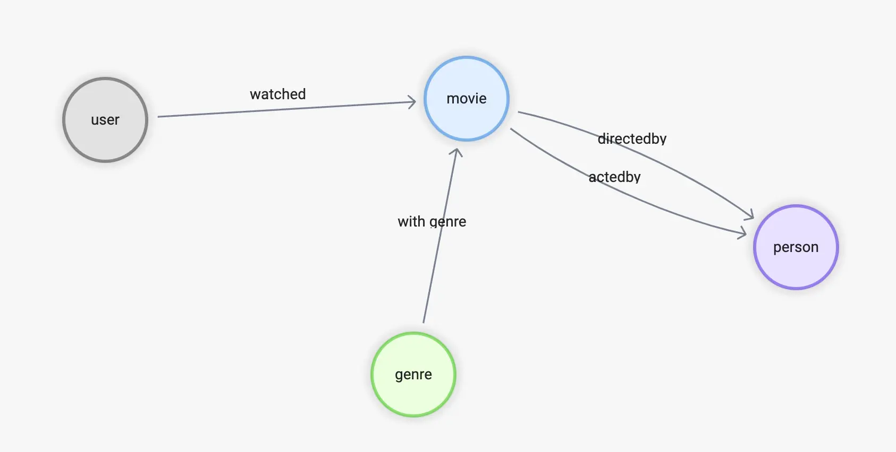
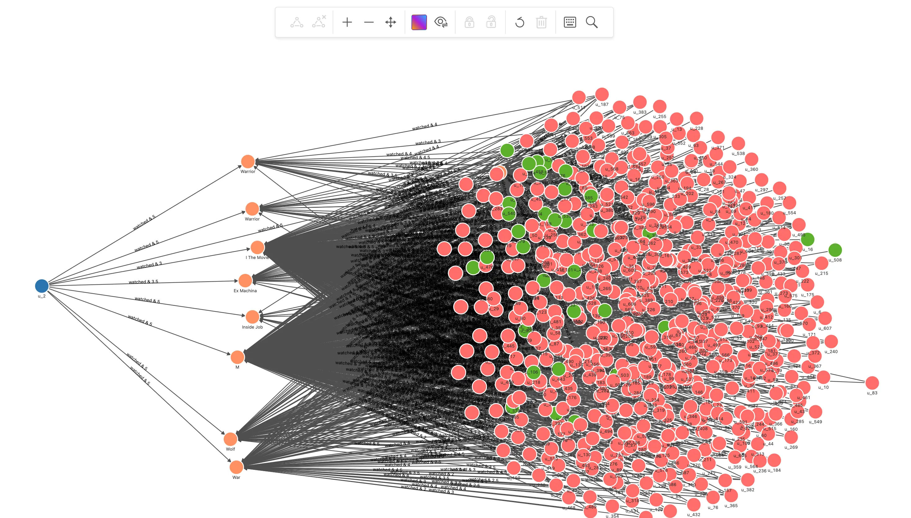

# 基于图数据库的推荐系统


## 基于图数据库的推荐系统

> 本文是一个基于 NebulaGraph 上图算法、图数据库、机器学习、GNN 的推荐系统方法综述，大部分介绍的方法提供了 Playground 供大家学习。

<!--more-->

<!--

[TOC]

-->

### 基本概念

推荐系统诞生的初衷是解决互联网时代才面临的信息量过载问题，从最初的 Amazon 图书推荐、商品推荐，到电影、音乐、视频、新闻推荐，如今大多数网站、App 中都有至少一个基于推荐系统生成的供用户选择的物品列表界面。而这些物品的推荐基本都是基于用户喜好、物品的特征、用户与物品交互历史和其他相关上下文去做的。

一个推荐系统会包含以下几个部分：

- 数据、特征的处理
- 从特征出发，生成推荐列表
- 过滤、排序推荐列表

这其中，过滤的核心方法主要有两种：基于内容的过滤（Content-Based Filtering）、与协同过滤（Collaborative Filtering）。

#### 基于内容的过滤

内容过滤方法的本质是给用户的偏好做画像，同时对所有待推荐的物品计算特征，做用户的画像与待推荐物品特征之间的距离运算，过滤得到相近的物品。

> ref: https://www.ise.bgu.ac.il/faculty/liorr/recsyshb/chContent.pdf

内容过滤的方法的好处有：

- 清晰的可解释性，无论是对用户的画像分析，还是对物品的运算本身天然带来了排序、过滤的可解释性
- 用户数据输入的独立性，对给定的待推荐用户来说，只需要单独分析他们的画像和历史评分就足够了
- 规避新物品冷启动问题，对于新的添加的物品，即使没有任何历史的用户评价，也可以做出推荐

同时，基于内容过滤的挑战与劣势也有：

- 特征提取，提取待推荐物品的特征并非总是很容易地，比如照片、视频等非纯文本的物品，而且往往这些物品的特征提取依赖领域专家知识，比如电影推荐系统中需要抽离出导演、电影分类等领域知识作为特征
- 不擅长突破舒适圈，发掘用户的潜在新兴趣点
- 存在新用户冷启动问题，对少有信息作为用户画像的用户来说，缺少做进一步物品画像、特种距离运算的输入

#### 基于协同过滤

协同过滤方法本质是协同用户与系统之间的交互行为去给出推荐物品。

协同过滤的方法又分为**基于记忆**（memory-based）的与**基于模型**（model-based）的。

前者主要有物品与物品之间的协同过滤（ItemCF）和用户与用户之间的协同过滤（UserCF），ItemCF 简单来说是推荐和用户之前选择过的物品类似的物品：根据行为找物品之间的相似性，UserCF 则推荐与之有共同爱好的用户喜欢的物品：根据行为找用户之间的相似性；

而后者基于展现用户喜好的历史实践信息、利用统计与机器学习方法训练模型，对新的用户偏好进行推理。

协同过滤的方法的好处有：

- 无需对非结构化物品进行特征分析，因为协同过滤关注的是用户和物品之间的协同交互，这绕过了对物品领域知识处理的需求
- 对用户的个性化更强，更细，基于行为的分析使得对用户偏好的划分本质上是连续的（相比来说，对用户做画像的方法则是离散的），这样的推荐结果会更加“千人千面”，同时，也会蕴含内容过滤、有限的画像角度之下的“惊喜”推荐

而它的缺点有：

- 有新用户和新物件上的冷启动问题，因为它们身上都缺少历史喜好行为的信息

> ref: https://coek.info/pdf-a-dynamic-collaborative-filtering-system-via-a-weighted-clustering-approach-.html

从以上两种主要的过滤方式的优劣中我们可以看到，它们之中存在互补的地方，比如新物件的冷启动上，基于内容的过滤有优势，对于个性化、惊喜推荐角度，协同过滤有优势。所以，在真实世界中，推荐系统在大多演化地比上边的归类复杂得多，而且常常是多种方法的融合。


### 基于图的个性推荐

图技术、图数据库技术在推荐系统中的应用是多方面的，本章我们就从图数据库的出发点上给出多种应用的例子。

#### 建立图谱

在开始之前，我简单介绍一下本文使用的图数据集。

为了给出更接近实际情况的例子，我从两个公开的数据集 [OMDB](https://www.omdb.org/en/us/content/Help:DataDownload) 和 [MovieLens](https://grouplens.org/datasets/movielens/) 中分别抽取了需要的信息，组成了一个既包含电影的卡司（导演、演员）和类型、又包含用户对电影评分记录的知识图谱。

它的 Scehma 如下：

- 顶点：

  - user(user_id)

  - movie(name)

  - person(name, birthdate)

  - genre(name)

- 边：

  - watched(rate(double))

  - with_genre

  - directed_by

  - acted_by



这个数据的准备、ETL 过程会在另外的文章里详细介绍，在进入下一章节之前，我们可以用 Nebula-Up 一键搭起一个测试的 NebulaGraph 单机集群，然后参考数据集的 GitHub 仓库，一键导入所需数据：

> 注：
>
> - Nebula-UP：https://github.com/wey-gu/nebula-up
>
> - 数据集仓库：https://github.com/wey-gu/movie-recommendation-dataset

过程最简单的操作过程为：

- 用 Nebula-Up 安装 NebulaGraph
- 克隆 movie-recommendation-dataset
- 导入数据集 NebulaGraph

```bash
curl -fsSL nebula-up.siwei.io/install.sh | bash

git clone https://github.com/wey-gu/movie-recommendation-dataset.git && cd movie-recommendation-dataset

docker run --rm -ti \
    --network=nebula-net \
    -v ${PWD}:/root/ \
    -v ${PWD}/dbt_project/to_nebulagraph/:/data \
    vesoft/nebula-importer:v3.2.0 \
    --config /root/nebula-importer.yaml
```

#### 基于内容的过滤

CBF 的思想是利用领域知识、历史记录、元数据分别对用户和物件做画像、打标签，最终根据用户的标签与待推荐物件之间的距离评分排序给出推荐。

对用户的画像不涉及其他用户的信息，但是输入的特征可能来源于元数据（生日、国籍、性别、年龄），历史记录（评论、打分、购买、浏览）等等，在这些基础之上对用户进行标签标注、分类、聚类。

对物件的画像输入的特征可能是基于语言处理（NLP、TF-IDF、LFM）、专家标注、多媒体处理（视觉到文字再NLP、音频风格处理、音频到文字再NLP）等。

有了用户画像与物件的画像特征、对用户涉及的画像进行相关画像物件中新对象的近似度计算，再评分加权，就可以获得最终的推荐排序了。这其中的近似度计算可以是常见的 KNN，余弦相似，Jaccard 相似等各种方法。

CBF 的方法中没有限定具体实现方式，如前边介绍，可能是基于机器学习、elasticsearch、图谱等不同的方法。这里为切合本章的主题，我给出一个基于图数据库、图谱上的 CBF 的例子，做一个电影推荐系统，能让读者理解这个方法的思想的同时熟悉图数据库、知识图谱的方法。

这其中用户的特征我们直接利用历史电影评价记录，而推荐物件：电影，的画像则来自于领域中的知识。这些知识有：电影风格、电影的卡斯、导演。近似度这里我们就采用图谱中基于关系的 Jaccard 相似度算法。

##### Jaccard Index

[Jaccard Index](https://en.wikipedia.org/wiki/Jaccard_index) 是一个描述两个集合距离的定义公式，非常简单、符合直觉地取两者的交集与并集测度的比例，它的定义记为：
$$
J(A,B)= \frac {|A\cap B|}{|A\cup B|}
$$
这里，我们把交集理解为 A 与 B 共同连接的点（有共同的导演、电影类型、演员），并集理解为这几种关系下与 A 或者 B 直连的所有点，而测度就直接用数量表示。

##### CBF 方法在 NebulaGraph 中的实现

CBF 方法分如下几步：

- 找出推荐用户评分过的电影
- 从用户评分过的电影，经由导演卡司、电影类型找到新的待推荐电影
- 对看过的电影与新的电影，藉由导演、卡司、电影类型的关系，在图上做 Jaccard 相似性运算，得出每一对看过的电影和待推荐新电影之间的 Jaccard 系数
- 把用户对看过电影的评分作为加权系数，针对其到每一个新电影之间的 Jaccard 系数加权评分，获得排序后的推荐电影列表

```cypher
// 用户 u_124 看过的电影
MATCH (u:`user`)-[:watched]->(m:`movie`) WHERE id(u) == "u_124"
WITH collect(id(m)) AS watched_movies_id

// 根据电影的标注关系找到备选推荐电影，刨除看过的，把评分、交集关联链路的数量传下去
MATCH (u:`user`)-[e:watched]->(m:`movie`)-[:directed_by|acted_by|with_genre]->(intersection)<-[:directed_by|acted_by|with_genre]-(recomm:`movie`)
WHERE id(u) == "u_124" AND NOT id(recomm) IN watched_movies_id
WITH (e.rate - 2.5)/2.5 AS rate, m, recomm, size(COLLECT(intersection)) AS intersection_size ORDER BY intersection_size DESC LIMIT 50

// 计算 Jaccard index-------------------------------------------------

// 针对每一对 m 和 recomm：
// 开始计算看过的电影，集合 a 的部分
MATCH (m:`movie`)-[:directed_by|acted_by|with_genre]->(intersection)
WITH rate, id(m) AS m_id, recomm, intersection_size, COLLECT(id(intersection)) AS set_a

// 计算推荐电影，集合 b 的部分
MATCH (recomm:`movie`)-[:directed_by|acted_by|with_genre]->(intersection)
WITH rate, m_id, id(recomm) AS recomm_id, set_a, intersection_size, COLLECT(id(intersection)) AS set_b

// 得到并集数量
WITH rate, m_id, recomm_id, toFloat(intersection_size) AS intersection_size, toSet(set_a + set_b) AS A_U_B

// 得到每一对 m 和 recomm 的 Jaccard index = A_N_B/A_U_B
WITH rate, m_id, recomm_id, intersection_size/size(A_U_B) AS jaccard_index

// 计算 Jaccard index-------------------------------------------------


// 得到每一个被推荐的电影 recomm_id，经由不同看过电影推荐链路的相似度 = 评分 * jaccard_index
WITH recomm_id, m_id, (rate * jaccard_index) AS score

// 对每一个 recomm_id 按照 m_id 加权求得相似度的和，为总的推荐程度评分，降序排列
WITH recomm_id, sum(score) AS sim_score ORDER BY sim_score DESC WHERE sim_score > 0
RETURN recomm_id, sim_score LIMIT 50
```

上边查询的执行结果截取出来是：

| recomm_id | sim_score           |
| :-------- | :------------------ |
| 1891      | 0.2705882352941177  |
| 1892      | 0.22278481012658227 |
| 1894      | 0.15555555555555556 |
| 808       | 0.144               |
| 1895      | 0.13999999999999999 |
| 85        | 0.12631578947368421 |
| 348       | 0.12413793103448277 |
| 18746     | 0.11666666666666668 |
| 628       | 0.11636363636363636 |
| 3005      | 0.10566037735849057 |

##### 可视化分析

我们把整个过程中的一些步骤的查询修改一下为 `p=xxx` 的方式，并渲染出来，会更加方便理解

- 用户 u_124 看过的、评分过的电影

  ```cypher
  // 用户 u_124 看过的电影
  MATCH p=(u:`user`)-[:watched]->(m:`movie`) WHERE id(u) == "u_124"
  RETURN p
  ```

  

  

- 下一步找到这些看过的电影在相同的演员、导演、电影类型的关系上，图谱关联的所有其他电影

  ```cypher
  // 用户 u_124 看过的电影
  MATCH (u:`user`)-[:watched]->(m:`movie`) WHERE id(u) == "u_124"
  WITH collect(id(m)) AS watched_movies_id
  
  // 根据电影的标注关系找到备选推荐电影，刨除看过的，把评分、交集关联链路的数量传下去
  MATCH p=(u:`user`)-[e:watched]->(m:`movie`)-[:directed_by|acted_by|with_genre]->(intersection)<-[:directed_by|acted_by|with_genre]-(recomm:`movie`)
  WHERE id(u) == "u_124" AND NOT id(recomm) IN watched_movies_id
  RETURN p, size(COLLECT(intersection)) AS intersection_size ORDER BY intersection_size DESC LIMIT 500
  ```

  可以看到用户看过电影经由演员、类型扩散出好多新的电影

  

- 在得到这些待推荐电影以及推荐路径之后，通过 Jaccard 系数与用户在路径第一条边上的评分综合评定之后，得到了最终的结果，这里我们把结果再可视化一下：取得它们和用户之间的路径并渲染出来

  ```cypher
  // 用户 u_124 看过的电影
  MATCH (u:`user`)-[:watched]->(m:`movie`) WHERE id(u) == "u_124"
  WITH collect(id(m)) AS watched_movies_id
  
  // 根据电影的标注关系找到备选推荐电影，刨除看过的，把评分、交集关联链路的数量传下去
  MATCH (u:`user`)-[e:watched]->(m:`movie`)-[:directed_by|acted_by|with_genre]->(intersection)<-[:directed_by|acted_by|with_genre]-(recomm:`movie`)
  WHERE id(u) == "u_124" AND NOT id(recomm) IN watched_movies_id
  WITH (e.rate - 2.5)/2.5 AS rate, m, recomm, size(COLLECT(intersection)) AS intersection_size ORDER BY intersection_size DESC LIMIT 50
  
  // 计算 Jaccard index-------------------------------------------------
  
  // 针对每一对 m 和 recomm：
  // 开始计算看过的电影，集合 a 的部分
  MATCH (m:`movie`)-[:directed_by|acted_by|with_genre]->(intersection)
  WITH rate, id(m) AS m_id, recomm, intersection_size, COLLECT(id(intersection)) AS set_a
  
  // 计算推荐电影，集合 b 的部分
  MATCH (recomm:`movie`)-[:directed_by|acted_by|with_genre]->(intersection)
  WITH rate, m_id, id(recomm) AS recomm_id, set_a, intersection_size, COLLECT(id(intersection)) AS set_b
  
  // 得到并集数量
  WITH rate, m_id, recomm_id, toFloat(intersection_size) AS intersection_size, toSet(set_a + set_b) AS A_U_B
  
  // 得到每一对 m 和 recomm 的 Jaccard index = A_N_B/A_U_B
  WITH rate, m_id, recomm_id, intersection_size/size(A_U_B) AS jaccard_index
  
  // 计算 Jaccard index-------------------------------------------------
  
  
  // 得到每一个被推荐的电影 recomm_id，经由不同看过电影推荐链路的相似度 = 评分 * jaccard_index
  WITH recomm_id, m_id, (rate * jaccard_index) AS score
  
  // 对每一个 recomm_id 按照 m_id 加权求得相似度的和，为总的推荐程度评分，降序排列
  WITH recomm_id, sum(score) AS sim_score ORDER BY sim_score DESC WHERE sim_score > 0
  WITH recomm_id, sim_score LIMIT 10
  WITH COLLECT(recomm_id) AS recomm_ids
  MATCH p = (u:`user`)-[e:watched]->(m:`movie`)-[:directed_by|acted_by|with_genre]->(intersection)<-[:directed_by|acted_by|with_genre]-(recomm:`movie`)
  WHERE id(u) == "u_124" AND id(recomm) in recomm_ids
  RETURN p
  ```

  哇，我们可以很清晰地看到推荐的理由路径（喜欢星战，进而由多条共同的类型、演员、导演引导出未观看的几部星战电影），这其实就是 CBF 的优势之一：天然具有较好的可解释性。

  

#### 基于记忆的协同过滤

前边我们提过了，协同过滤主要可以分为两种：

- User-User CF 是基于多个用户对物件的历史行为，判定用户之间的相似性，然后根据相似用户的选择推荐新的物件。
- Item-Item CF 则是判断物件之间的相似性，给用户推荐他喜欢的物品相似的物品。

这里，ItemCF 看起来和前边的 CBF 有些类似，他们的核心区别在于 CBF 找到相似物件的方式是基于物件的“内容”本身，是一些领域知识的画像，而 ItemCF 的协同则是考虑用户对物件的历史行为。

##### ItemCF

这个方法分如下几步：

- 找出推荐用户评分过的电影
- 经由用户的高评分电影，找到其他给出高评分用户所看过的新的高评分电影
- 对看过的电影与新的电影，藉由用户的评分，在图上做 Jaccard 相似性运算，得出每一对看过的电影和待推荐新电影之间的 Jaccard 系数
- 把用户对看过电影的评分作为加权系数，针对其到每一个新电影之间的 Jaccard 系数加权评分，获得排序后的推荐电影列表

```cypher
// 用户 u_124 看过的并给出高评分的电影
MATCH (u:`user`)-[e:watched]->(m:`movie`) WHERE id(u) == "u_124" AND e.rate > 3
WITH collect(id(m)) AS watched_movies_id

// 根据同样也看过这些电影，并给出高评分的用户，得出待推荐的电影
MATCH (u:`user`)-[e:watched]->(m:`movie`)<-[e0:watched]-(intersection:`user`)-[e1:watched]->(recomm:`movie`)
WHERE id(u) == "u_124" AND NOT id(recomm) IN watched_movies_id AND e0.rate >3 AND e1.rate > 3
WITH (e.rate - 2.5)/2.5 AS rate, m, recomm, size(COLLECT(intersection)) AS intersection_size ORDER BY intersection_size DESC LIMIT 50

// 计算 Jaccard index-------------------------------------------------

// 针对每一对 m 和 recomm：
// 开始计算看过的电影，集合 a 的部分
MATCH (m:`movie`)<-[e0:watched]-(intersection:`user`)
WHERE e0.rate >3
WITH rate, id(m) AS m_id, recomm, intersection_size, COLLECT(id(intersection)) AS set_a

// 计算推荐电影，集合 b 的部分
MATCH (recomm:`movie`)<-[e1:watched]-(intersection:`user`)
WHERE e1.rate >3
WITH rate, m_id, id(recomm) AS recomm_id, set_a, intersection_size, COLLECT(id(intersection)) AS set_b

// 得到并集数量
WITH rate, m_id, recomm_id, toFloat(intersection_size) AS intersection_size, toSet(set_a + set_b) AS A_U_B

// 得到每一对 m 和 recomm 的 Jaccard index = A_N_B/A_U_B
WITH rate, m_id, recomm_id, intersection_size/size(A_U_B) AS jaccard_index

// 计算 Jaccard index-------------------------------------------------


// 得到每一个被推荐的电影 recomm_id，经由不同看过电影推荐链路的相似度 = 评分 * jaccard_index
WITH recomm_id, m_id, (rate * jaccard_index) AS score

// 对每一个 recomm_id 按照 m_id 加权求得相似度的和，为总的推荐程度评分，降序排列，只取正值
WITH recomm_id, sum(score) AS sim_score ORDER BY sim_score DESC WHERE sim_score > 0
RETURN recomm_id, sim_score LIMIT 50
```

结果：

| recomm_id | sim_score           |
| :-------- | :------------------ |
| 832       | 0.8428369424692955  |
| 114707    | 0.7913842214590154  |
| 64957     | 0.6924673321504288  |
| 120880    | 0.5775219768736295  |
| 807       | 0.497532028328161   |
| 473       | 0.4748322300870322  |
| 52797     | 0.2311965559170528  |
| 12768     | 0.19642857142857142 |
| 167058    | 0.19642857142857142 |

##### 可视化分析 ItemCF

同样，我们把整个过程中的一些步骤的查询修改一下为 `p=xxx` 的方式，并渲染出来，看看可以看出什么有意思的的洞察。

- 找出推荐用户评分过的电影

  ```cypher
  // 用户 u_124 看过的并给出高评分的电影
  MATCH p=(u:`user`)-[e:watched]->(m:`movie`) WHERE id(u) == "u_124" AND e.rate > 3
  RETURN p
  ```

  它们是：

  

- 经由用户的高评分电影，找到其他给出高评分用户所看过的新的高评分电影，修改结果为路径

  ```cypher
  // 用户 u_124 看过的并给出高评分的电影
  MATCH (u:`user`)-[e:watched]->(m:`movie`) WHERE id(u) == "u_124" AND e.rate > 3
  WITH collect(id(m)) AS watched_movies_id
  
  // 根据同样也看过这些电影，并给出高评分的用户，得出待推荐的电影
  MATCH p=(u:`user`)-[e:watched]->(m:`movie`)<-[e0:watched]-(intersection:`user`)-[e1:watched]->(recomm:`movie`)
  WHERE id(u) == "u_124" AND NOT id(recomm) IN watched_movies_id AND e0.rate >3 AND e1.rate > 3
  WITH p, size(COLLECT(intersection)) AS intersection_size ORDER BY intersection_size DESC LIMIT 200
  ```

  可以看到待推荐的电影在路径的右边末端，中间连接着的都是其他用户的推荐记录，它的模式和 CBF 真的很像，只不过关联的关系不是具体的内容，而是行为。

  

- 在对看过的电影与新的电影，藉由用户的评分，在图上做 Jaccard 相似性运算，得出每一对看过的电影和待推荐新电影之间的 Jaccard 系数之后。把用户对看过电影的评分作为加权系数，针对其到每一个新电影之间的 Jaccard 系数加权评分，获得排序后的推荐电影列表，我们同样改造一下最终的查询为路径，并渲染前 500 条路径：

  ```cypher
  // 用户 u_124 看过的并给出高评分的电影
  MATCH (u:`user`)-[e:watched]->(m:`movie`) WHERE id(u) == "u_124" AND e.rate > 3
  WITH collect(id(m)) AS watched_movies_id
  
  // 根据同样也看过这些电影，并给出高评分的用户，得出待推荐的电影
  MATCH (u:`user`)-[e:watched]->(m:`movie`)<-[e0:watched]-(intersection:`user`)-[e1:watched]->(recomm:`movie`)
  WHERE id(u) == "u_124" AND NOT id(recomm) IN watched_movies_id AND e0.rate >3 AND e1.rate > 3
  WITH (e.rate - 2.5)/2.5 AS rate, m, recomm, size(COLLECT(intersection)) AS intersection_size ORDER BY intersection_size DESC LIMIT 50
  
  // 计算 Jaccard index-------------------------------------------------
  
  // 针对每一对 m 和 recomm：
  // 开始计算看过的电影，集合 a 的部分
  MATCH (m:`movie`)<-[e0:watched]-(intersection:`user`)
  WHERE e0.rate >3
  WITH rate, id(m) AS m_id, recomm, intersection_size, COLLECT(id(intersection)) AS set_a
  
  // 计算推荐电影，集合 b 的部分
  MATCH (recomm:`movie`)<-[e1:watched]-(intersection:`user`)
  WHERE e1.rate >3
  WITH rate, m_id, id(recomm) AS recomm_id, set_a, intersection_size, COLLECT(id(intersection)) AS set_b
  
  // 得到并集数量
  WITH rate, m_id, recomm_id, toFloat(intersection_size) AS intersection_size, toSet(set_a + set_b) AS A_U_B
  
  // 得到每一对 m 和 recomm 的 Jaccard index = A_N_B/A_U_B
  WITH rate, m_id, recomm_id, intersection_size/size(A_U_B) AS jaccard_index
  
  // 计算 Jaccard index-------------------------------------------------
  
  
  // 得到每一个被推荐的电影 recomm_id，经由不同看过电影推荐链路的相似度 = 评分 * jaccard_index
  WITH recomm_id, m_id, (rate * jaccard_index) AS score
  
  // 对每一个 recomm_id 按照 m_id 加权求得相似度的和，为总的推荐程度评分，降序排列，只取正值
  WITH recomm_id, sum(score) AS sim_score ORDER BY sim_score DESC WHERE sim_score > 0
  WITH recomm_id LIMIT 10
  WITH COLLECT(recomm_id) AS recomm_ids
  MATCH p = (u:`user`)-[e:watched]->(m:`movie`)<-[e0:watched]-(intersection:`user`)-[e1:watched]->(recomm:`movie`)
  WHERE id(u) == "u_124" AND id(recomm) in recomm_ids
  RETURN p limit 500
  ```

  可以看出最北推荐的两个电影是被几乎所有看过并给出中高评分的用户共同看过的中高评分电影

  

##### 关于”高评分“

这其中还有很多可以进一步优化的点，比如其中写死了“高评分”是高于 3 的评分，这样有时候不免有失客观，一个可能更合理可行的方式是针对每一个用户，取得这个用户所有评分的平均值，然后取得与平均值相差的比例或者绝对值判定高低。此外，我们在通过 Jaccard 相似性判断每一个看过的电影和对应推荐电影的相似性的时候，并没有考虑这条关联关系：

```cypher
(m:`movie`)<-[e0:watched]-(intersection:`user`)-[e1:watched]->(recomm:`movie`)
```

之中 e0 与 e1 的评分数值的因素，只是过滤了低评分的关系，这里也有做的更加细致的提升空间。

实际上， Pearson Correlation Coefficient 就是这样一种考虑了关系中的数值进行相似性运算的方法。

##### Pearson Correlation Coefficient

[Pearson Correlation Coefficient](https://en.wikipedia.org/wiki/Pearson_correlation_coefficient) （PCC）的定义为：
$$
r_{xy} =\frac{\sum ^n _{i=1}(x_i - \bar{x})(y_i - \bar{y})}{\sqrt{\sum ^n _{i=1}(x_i - \bar{x})^2} \sqrt{\sum ^n _{i=1}(y_i - \bar{y})^2}}
$$
相比 Jaccard Index，它把对象之间关系中的数值与自身和所有对象的数值的平均值的差进行累加运算，在考虑了数值比重的同事考虑了数值基于对象自身的相对差异。

##### UserCF

接下来我们就利用 Pearson Correlation Coefficient 来举例 UserCF 方法。

基于用户的协同过滤方法分如下几步：

- 找出和推荐用户同样给出评分过的电影的用户
- 运算 Pearson Correlation Coefficient 得到和推荐用户兴趣接近的用户
- 通过兴趣接近用户得到高评分未观看电影
- 根据观看用户的 Pearson Correlation Coefficient 加权，排序得推荐电影列表

```cypher
// 找出和用户 u_2 看过相同电影的用户, 得电影评分
MATCH (u:`user`)-[e0:watched]->(m:`movie`)<-[e1:watched]-(u_sim:`user`)
WHERE id(u) == "u_2" AND id(u_sim) != "u_2"
WITH u, u_sim, collect(id(m)) AS watched_movies_id, COLLECT({e0: e0, e1: e1}) AS e

// 计算 u_2 和这些用户的 pearson_cc
MATCH (u:`user`)-[e0:watched]->(m:`movie`)
WITH u_sim, watched_movies_id, avg(e0.rate) AS u_mean, e

MATCH (u_sim:`user`)-[e1:watched]->(recomm:`movie`)
WITH u_sim, watched_movies_id, u_mean, avg(e1.rate) AS u_sim_mean, e AS e_

UNWIND e_ AS e
WITH sum((e.e0.rate - u_mean) * (e.e1.rate - u_sim_mean) ) AS numerator,
     sqrt(sum(pow((e.e0.rate - u_mean),2))) * sqrt(sum(pow((e.e1.rate - u_sim_mean),2))) AS denominator,
     u_sim, watched_movies_id WHERE denominator != 0

// 取 pearson_cc 最大的 50 个相似用户
WITH u_sim, watched_movies_id, numerator/denominator AS pearson_cc ORDER BY pearson_cc DESC LIMIT 50

// 取相似用户给出高评分的新电影，根据相似用户个数对用户相似程度 pearson_cc 加权，获得推荐列表
MATCH (u_sim:`user`)-[e1:watched]->(recomm:`movie`)
WHERE NOT id(recomm) IN watched_movies_id AND e1.rate > 3
RETURN recomm, sum(pearson_cc) AS sim_score ORDER BY sim_score DESC LIMIT 50
```

结果：

| recomm                                       | sim_score |
| :------------------------------------------- | :-------- |
| ("64957" :movie{name: "Mother"})             | 14        |
| ("10" :movie{name: "Star Wars"})             | 13        |
| ("11" :movie{name: "Star Wars: A New Hope"}) | 13        |
| ("55207" :movie{name: "Silence"})            | 12        |
| ("170339" :movie{name: "Silence"})           | 12        |
| ("9807" :movie{name: "Aladdin"})             | 8         |
| ("45375" :movie{name: "X"})                  | 7         |
| ("87944" :movie{name: "Robin Hood"})         | 6         |
| ("473" :movie{name: "Pi"})                   | 6         |
| ("807" :movie{name: "Seven"})                | 6         |

##### 可视化分析 UserCF

再看看 UserCF 的可视化结果吧：

- 找出和推荐用户同样给出评分过的电影的用户

  ```cypher
  // 找出和用户 u_2 看过相同电影的用户
  MATCH p=(u:`user`)-[e0:watched]->(m:`movie`)<-[e1:watched]-(u_sim:`user`)
  WHERE id(u) == "u_2" AND id(u_sim) != "u_2"
  RETURN p
  ```

  

- 运算 Pearson Correlation Coefficient 得到和推荐用户兴趣接近的用户，输出这些接近的用户

  ```cypher
  // 找出和用户 u_2 看过相同电影的用户, 得电影评分
  MATCH (u:`user`)-[e0:watched]->(m:`movie`)<-[e1:watched]-(u_sim:`user`)
  WHERE id(u) == "u_2" AND id(u_sim) != "u_2"
  WITH u, u_sim, collect(id(m)) AS watched_movies_id, COLLECT({e0: e0, e1: e1}) AS e
  
  // 计算 u_2 和这些用户的 pearson_cc
  MATCH (u:`user`)-[e0:watched]->(m:`movie`)
  WITH u_sim, watched_movies_id, avg(e0.rate) AS u_mean, e
  
  MATCH (u_sim:`user`)-[e1:watched]->(recomm:`movie`)
  WITH u_sim, watched_movies_id, u_mean, avg(e1.rate) AS u_sim_mean, e AS e_
  
  UNWIND e_ AS e
  WITH sum((e.e0.rate - u_mean) * (e.e1.rate - u_sim_mean) ) AS numerator,
       sqrt(sum(pow((e.e0.rate - u_mean),2))) * sqrt(sum(pow((e.e1.rate - u_sim_mean),2))) AS denominator,
       u_sim, watched_movies_id WHERE denominator != 0
  
  // 取 pearson_cc 最大的 50 个相似用户
  WITH u_sim, watched_movies_id, numerator/denominator AS pearson_cc ORDER BY pearson_cc DESC LIMIT 50
  
  RETURN u_sim
  ```

  我们增量渲染，并给他们标记一下颜色：

  

- 通过兴趣接近用户得到高评分未观看电影，根据观看用户的 Pearson Correlation Coefficient 加权，排序得推荐电影列表。我们把结果输出为这些相似用户的高评分电影路径：

  ```cypher
  // 找出和用户 u_2 看过相同电影的用户, 得电影评分
  MATCH (u:`user`)-[e0:watched]->(m:`movie`)<-[e1:watched]-(u_sim:`user`)
  WHERE id(u) == "u_2" AND id(u_sim) != "u_2"
  WITH u, u_sim, collect(id(m)) AS watched_movies_id, COLLECT({e0: e0, e1: e1}) AS e
  
  // 计算 u_2 和这些用户的 pearson_cc
  MATCH (u:`user`)-[e0:watched]->(m:`movie`)
  WITH u_sim, watched_movies_id, avg(e0.rate) AS u_mean, e
  
  MATCH (u_sim:`user`)-[e1:watched]->(recomm:`movie`)
  WITH u_sim, watched_movies_id, u_mean, avg(e1.rate) AS u_sim_mean, e AS e_
  
  UNWIND e_ AS e
  WITH sum((e.e0.rate - u_mean) * (e.e1.rate - u_sim_mean) ) AS numerator,
       sqrt(sum(pow((e.e0.rate - u_mean),2))) * sqrt(sum(pow((e.e1.rate - u_sim_mean),2))) AS denominator,
       u_sim, watched_movies_id WHERE denominator != 0
  
  // 取 pearson_cc 最大的 50 个相似用户
  WITH u_sim, watched_movies_id, numerator/denominator AS pearson_cc ORDER BY pearson_cc DESC LIMIT 50
  
  // 取相似用户给出高评分的新电影，根据相似用户个数对用户相似程度 pearson_cc 加权，获得推荐列表
  MATCH p=(u_sim:`user`)-[e1:watched]->(recomm:`movie`)
  WHERE NOT id(recomm) IN watched_movies_id AND e1.rate > 3
  WITH p, recomm, sum(pearson_cc) AS sim_score ORDER BY sim_score DESC LIMIT 50
  RETURN p
  ```

  得到的结果，我们增量渲染到画布上可以得到：这些 UserCF 推荐而得的电影在路径末端：

  

  在可视化中，相似用户的高评分未观看电影被推荐的思想是不是一目了然了呢？

#### 混合的方法

在真实世界中，真正达到最好效果的方法通常是结合所有信息的不同方法，共同工作的，这样既可以使得不同角度的有用信息得到充分利用，又能弥补单一方法在不同数据量、不同阶段的弱点。

结合的方法在工程上可以千差万别，这里就不展开了，不过在下边介绍另一类方法的时候，我们会举例一种混合的方式：基于模型。

#### 基于模型的方法

直觉上，我们知道除了正向的明确通过基于内容的（电影的领域知识、关系）、协同的（用户与用户、用户与电影之间的交互关系）的算法，也可以把这些信息作为机器学习中的输入特征，用统计学的方法得到一个模型，用来预测用户可能喜欢的物件（电影），这就是基于模型的方法。

基于模型的方法可以很自然地把把以上几种方法的信息同时纳入为特征，这样，它本质上也是混合过滤方法的一种实现了。

基于模型、机器学习的推荐系统方法有很多，这里，因为我们着重以图、图数据库的出发点介绍，我就举例其中的一种方法：基于图神经网络（GNN）。

GNN 的方法可以将图谱中的内容信息（导演、演员、类型）和协同信息（用户-用户、电影-电影、用户-电影之间的相互关系）以知识的方式嵌入，并且方法中的消息传递方式保有了图中的局部性（locality），这使得它可能成为一个非常新颖、有效的推荐系统模型方法。

##### GNN + 图数据库的推荐系统

**为什么需要图数据库**？

GNN 的方法中，图数据库只是一个可选项，而我给的 GNN 方法的示例中，图数据库的关键作用是它带来了实时性的可能。

一个实时性推荐系统要求在秒级响应下利用 GNN 训练模型从近实时的输入数据中进行推理，这给我们提出的要求是：

- 输入数据可以实时、近实时获取
- 推理运算可以实时完成

而利用归纳型（Inductive model）的模型从图数据库中实时获取新的数据子图作为推理输入是一个满足这样要求可行的设计方式。

下边是简单的流程图：

- 左边是模型训练，在图谱的二分图（user 和 item）之上建模
  - 用户和物件（movie）之间的关系除了交互关系之外，还有预先处理的关系，这些关系被查询获得后再写回图数据库中供后续消费使用，关系有：
    - 用户间“相似”关系
    - 物件间不同（共同演员、类型、导演）关系
  - 利用 Nebula-DGL 将图中需要的点、边序列化为 DGL 可以消费的对象
  - 在 DGL 中分割训练、测试、验证集，利用 PinSAGE 模型训练。
  - 导出模型给推荐系统使用

> 注：
>
> - DGL 是非常流行的图深度学习矿建，项目官网：https://www.dgl.ai
> - Nebula-DGL 是一个 NebulaGraph 到 DGL 的连接器，项目地址：https://github.com/wey-gu/nebula-dgl
>
> - PinSAGE 参考 https://arxiv.org/abs/1806.01973 论文，DGL 中的 PinSAGE 实现其实并不是归纳型，需要做一些修改才可以。

- 右边是导出的模型作为推理接口的推荐系统
  - 基于图库的实时图谱上一直会有实时的数据更新，节点增减
  - 当给定的用户推荐请求过来的时候，图库中以该用户为起点的子图会被获取（1.）、作为输入发送给推理接口（2.）
  - 推理接口把子图输入给之前训练的模型，获得该用户在子图中关联的新物件中的评分排序（3.）作为推荐结果


篇幅关系，本章我就不给出端到端的实例代码了，后续有机会我会尽量做一个 demo 出来的。

### 推荐系统可解释性

在结束本章之前，再举一个图数据库在推荐系统中的典型应用：推荐理由。

下图是美团、大众点评中的一个常见的搜索、推荐结果，现代推荐系统的复杂度是非常大的，一方面由很多方法自身的特性决定，另一方面最终的推荐可能是多个系统协同获得最终结果排名，这使得我们很难对推荐结果进行解释。

得益于被推荐用户和物件、以及他们的各种各样画像最终形成的知识图谱，我们只需要在图谱中对推荐结果进行“路径查找”就可以获得很有意义的解释，像是如下截图的“在北京喜欢北京菜的山东老乡都说这家店很赞”就是这样获得的解释。


> 图片来源：https://tech.meituan.com/2021/04/01/nebula-graph-practice-in-meituan.html

#### 可解释性的例子

咱们回到电影推荐的图谱上，我们在前边的算法中曾经获得过用户 `u_124` 的推荐电影 `1891`（星球大战：），那么我们可以通过这一个查询获得它的推荐解释：

```cypher
FIND NOLOOP PATH FROM "u_124" TO "1891" over * BIDIRECT UPTO 4 STEPS yield path as `p` | LIMIT 20
```

我们可以很快获得 20 条路径：

```cypher
(root@nebula) [moviegraph]> FIND NOLOOP PATH FROM "u_124" TO "1891" over * BIDIRECT UPTO 4 STEPS yield path as `p` | LIMIT 20
+-----------------------------------------------------------------------------------------------------+
| p                                                                                                   |
+-----------------------------------------------------------------------------------------------------+
| <("u_124")-[:watched@0 {}]->("11")-[:with_genre@0 {}]->("g_49")<-[:with_genre@0 {}]-("1891")>       |
| <("u_124")-[:watched@0 {}]->("11")-[:with_genre@0 {}]->("g_17")<-[:with_genre@0 {}]-("1891")>       |
| <("u_124")-[:watched@0 {}]->("11")-[:with_genre@0 {}]->("g_10281")<-[:with_genre@0 {}]-("1891")>    |
| <("u_124")-[:watched@0 {}]->("11")-[:acted_by@0 {}]->("p_4")<-[:acted_by@0 {}]-("1891")>            |
| <("u_124")-[:watched@0 {}]->("11")-[:acted_by@0 {}]->("p_3")<-[:acted_by@0 {}]-("1891")>            |
| <("u_124")-[:watched@0 {}]->("11")-[:acted_by@0 {}]->("p_24342")<-[:acted_by@0 {}]-("1891")>        |
| <("u_124")-[:watched@0 {}]->("11")-[:acted_by@0 {}]->("p_2")<-[:acted_by@0 {}]-("1891")>            |
| <("u_124")-[:watched@0 {}]->("832")-[:with_genre@0 {}]->("g_1110")<-[:with_genre@0 {}]-("1891")>    |
| <("u_124")-[:watched@0 {}]->("11")-[:with_genre@0 {}]->("g_1110")<-[:with_genre@0 {}]-("1891")>     |
| <("u_124")-[:watched@0 {}]->("11")-[:acted_by@0 {}]->("p_13463")<-[:acted_by@0 {}]-("1891")>        |
| <("u_124")-[:watched@0 {}]->("11")-[:acted_by@0 {}]->("p_12248")<-[:acted_by@0 {}]-("1891")>        |
| <("u_124")-[:watched@0 {}]->("47981")-[:with_genre@0 {}]->("g_10219")<-[:with_genre@0 {}]-("1891")> |
| <("u_124")-[:watched@0 {}]->("11")-[:acted_by@0 {}]->("p_6")<-[:acted_by@0 {}]-("1891")>            |
| <("u_124")-[:watched@0 {}]->("497")-[:with_genre@0 {}]->("g_104")<-[:with_genre@0 {}]-("1891")>     |
| <("u_124")-[:watched@0 {}]->("120880")-[:with_genre@0 {}]->("g_104")<-[:with_genre@0 {}]-("1891")>  |
| <("u_124")-[:watched@0 {}]->("11")-[:with_genre@0 {}]->("g_104")<-[:with_genre@0 {}]-("1891")>      |
| <("u_124")-[:watched@0 {}]->("11")-[:acted_by@0 {}]->("p_130")<-[:acted_by@0 {}]-("1891")>          |
| <("u_124")-[:watched@0 {}]->("497")-[:with_genre@0 {}]->("g_50")<-[:with_genre@0 {}]-("1891")>      |
| <("u_124")-[:watched@0 {}]->("11635")-[:with_genre@0 {}]->("g_50")<-[:with_genre@0 {}]-("1891")>    |
| <("u_124")-[:watched@0 {}]->("11")-[:with_genre@0 {}]->("g_50")<-[:with_genre@0 {}]-("1891")>       |
+-----------------------------------------------------------------------------------------------------+
Got 20 rows (time spent 267151/278139 us)

Wed, 09 Nov 2022 19:05:56 CST
```

我们在结果可视化中可以很容易看出这个推荐的结果可以是：

- 曾经喜欢的星战电影的大部分演职人员都也参与了这部和同样是“奥斯卡获奖”且“经典”的电影。


### 总结

现在，我们知道图数据库作为推荐系统中信息的最终形式：知识存在，可以适用在不同类型方法上，尽管很多方法中，图库不一定是最终落地系统方案的最流行选择，图数据库所带来的可视化洞察的潜力还是非常大的。

同时，构建的综合知识图谱上的解释、推理能力与一些实时要求高的图方法中（比如 GNN的基于模型方法），能起到带来独一无二的作用。


题图版权：[charlesdeluvio](https://unsplash.com/@charlesdeluvio)

