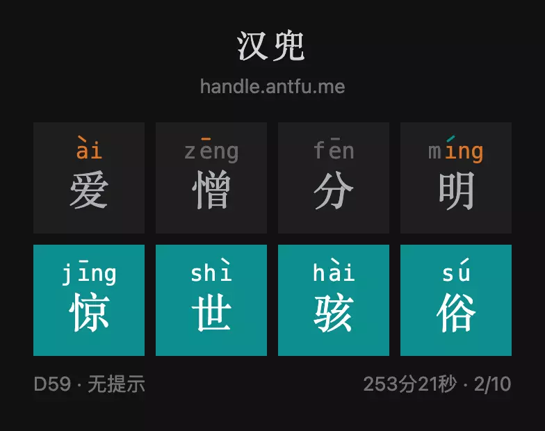

# 图数据库体操：用 Nebula Graph 搭成语图谱解汉兜


> 我发现用 Nebula Graph 的图查询解 Antfu 的汉兜（最好的中文成语版 wordle 👉🏻 handle.antfu.me）特别有意思，很适合每天写图库语句的体操练习，本文揭示如何用知识图谱~~作弊~~解汉兜😁

<!--more-->

## 什么是汉兜？

汉兜（https://handle.antfu.me）是由 Vue/Vite 核心团队的 Antfu 的又一个非常酷的作品，一个非常精致的汉字版的 Wordle，他是是一个每日挑战的填字游戏的中文成语版。

每天，汉兜会发起一个猜成语挑战，人们要在十次内才对它才能获胜，每一步之后都会收到相应的文字、声母、韵母、声调的匹配情况的提示，其中：绿色表示这个因素存在并且位置匹配、橘色表示这个元素存在但是位置不对，详细的规则可见如下的网页截图：


汉兜的乐趣就我们在于在有限的尝试过程中，在大脑中搜寻可能的答案，不断去逼近真理，任何试图作弊、讨巧去泄漏结果的行为都是很无趣、倒胃口的（比如从开源的汉兜代码里窃取信息），这个过程就像在做大脑的体操。

说到大脑的成语词汇量体操，我突然想到，为什么我们不能在大脑之外造一个汉语成语知识图谱，然后基于这个图谱去做图数据库查询语法体操呢？

## 构造解决汉兜的成语知识图谱

### 什么是知识图谱？

简单来说，知识图谱是一个连接实体之间关联关系的网络，它最初由 Google 提出并用来满足搜索引擎中基于知识推理才可获得（而不是网页倒排索引）的搜索问题，比如：”姚明妻子的年龄？“、”火箭队得过几次总冠军？“

这里边，我们关注的条件。到 2022 年的现在，知识图谱已经被广泛应用在推荐系统、问答系统、安全风控等等更多搜索之外的领域。

### 为什么需要用知识图谱解决汉兜？

~~原因就是：because I can~~

实际上，我们在大脑中解决字谜游戏的过程像极了图谱网络中的信息搜寻的过程，汉兜的解谜反馈提示条件天然适合被用图谱的语义来进行表达。在本文后边，你们会发现解谜条件翻译成图语义是非常非常自然的，这个问题就像是一个天然的为图谱而存在的练习一样，我相信这和知识图谱的结构和人脑中的知识结构非常接近有很大的关系。

### 如何构建面向汉兜解谜的知识图谱？

知识图谱是由实体（顶点）和关系（边）组成的，用图数据库管理系统（Graph Database MS）可以很方便进行知识的入库、更改、查询、甚至可视化探索。

在本文里，我将利用开源的分布式图数据库 Nebula Graph 开实践这个过程，具体图谱系统的搭建我都会放在文末。

在本章，我们只讨论图谱的建模：如何面向汉兜的解谜去设计“实体”与“关系”。

#### 图建模

##### 最初的想法

首先，一定存在的实体是：

- 成语
- 汉字

成语-[包含]->汉字，每个汉字-[读作]->读音。


其次，因为解谜过程中涉及到了声母、韵母以及声调的条件，考虑到图谱本身的量级非常小（千级别），而且字的读音是一对多的关系，我把读音和声母（包涵声母-initial和韵母-final）也作为实体，他们之间的关系则是顺理成章了：


##### 最终的版本

然而，我在后边基于图谱进行查询的时候发现最初的建模会使得(成语)-->(字)-->(读音)查询过程中丢失了这个字特定的读法的条件，所以我最终的建模是：


这样，纯文字的条件只涉及了`(成语)-->(字)` 这一跳，而读音、声母、声调的条件则是另一条关系路径，既没有最初版本条件的冗余，又可以在一个路径模式匹配里带上两种条件（后边的例子里会涉及这样的表达）。

#### 构建成语知识图谱

有了建模、这么简单的图谱的构建就剩下了数据的收集、清洗和入库。

对于所有成语数据和他们的读音，我一方面直接抽取了汉兜代码内部的[数据](https://github.com/antfu/handle/)、另一方面利用 [PyPinyin](https://pypinyin.readthedocs.io/) 这个开源的 Python 库将汉兜数据中没有读音的数据获得读音，同时，我也用到了 PyPinyin 里的很多方便的函数比如获取一个拼音的声母、韵母。

构建工具的代码在这里：https://github.com/wey-gu/chinese-graph

更多信息我也放在文末的附录之中。

## 开始知识图谱查询体操

至此，我假设咱们都已经有了我帮大家搭建的成语~~作弊~~知识图谱了，开始我们的图谱查询体操吧！

首先，打开汉兜 👉🏻 https://handle.antfu.me/

假设我们想从一个成语开始，如果你没有想法的话可以试试这个：

```cypher
# 匹配成语中的一个结果
MATCH (x:idiom) "爱憎分明" RETURN x LIMIT 1

# 返回结果
("爱憎分明" :idiom{pinyin: "['ai4', 'zeng1', 'fen1', 'ming2']"})
```

然后我们把它填到汉兜之中，获得第一次尝试的提示条件：


我们运气不错，得到了三个位置上的条件！

- 有一个非第一个位置的字，拼音是 4 声，韵母是 ai，但不是爱（爱）
- 有一个一声的字，不在第二个位置（憎）
- 有一个字韵母是 ing，不在第四个位置（明）
- 第四个字是二声（明）

下面，我们开始图数据库语句体操！

```cypher
# 有一个非第一个位置的字，拼音是 4 声，韵母是 ai，但不是爱
MATCH (char0:character)<-[with_char_0:with_character]-(x:idiom)-[with_pinyin_0:with_pinyin]->(pinyin_0:character_pinyin)-[:with_pinyin_part]->(final_part_0:pinyin_part{part_type: "final"})
WHERE id(final_part_0) == "ai" AND pinyin_0.character_pinyin.tone == 4 AND with_pinyin_0.position != 0 AND with_char_0.position != 0 AND id(char0) != "爱"
# 有一个一声的字，不在第二个位置
MATCH (x:idiom) -[with_pinyin_1:with_pinyin]->(pinyin_1:character_pinyin)
WHERE pinyin_1.character_pinyin.tone == 1 AND with_pinyin_1.position != 1
# 有一个字韵母是 ing，不在第四个位置
MATCH (x:idiom) -[with_pinyin_2:with_pinyin]->(:character_pinyin)-[:with_pinyin_part]->(final_part_2:pinyin_part{part_type: "final"})
WHERE id(final_part_2) == "ing" AND with_pinyin_2.position != 3
# 第四个字是二声
MATCH (x:idiom) -[with_pinyin_3:with_pinyin]->(pinyin_3:character_pinyin)
WHERE pinyin_3.character_pinyin.tone == 2 AND with_pinyin_3.position == 3

RETURN x, count(x) as c ORDER BY c DESC
```

在图数据库之中运行，得到了 7 个答案：

```json
("惊愚骇俗" :idiom{pinyin: "['jing1', 'yu2', 'hai4', 'su2']"})
("惊世骇俗" :idiom{pinyin: "['jing1', 'shi4', 'hai4', 'su2']"})
("惊见骇闻" :idiom{pinyin: "['jing1', 'jian4', 'hai4', 'wen2']"})
("沽名卖直" :idiom{pinyin: "['gu1', 'ming2', 'mai4', 'zhi2']"})
("惊心骇神" :idiom{pinyin: "['jing1', 'xin1', 'hai4', 'shen2']"})
("荆棘载途" :idiom{pinyin: "['jing1', 'ji2', 'zai4', 'tu2']"})
("出卖灵魂" :idiom{pinyin: "['chu1', 'mai4', 'ling2', 'hun2']"})
```

看起来 `惊世骇俗` 比较主流，试试！



我们很幸运，借助于成语~~作弊~~知识图谱，居然一次就找到了答案，当然这实际上得益于第一次随机选取的词带来的限制条件的个数，不过在大部分情况下，两次尝试获得最终答案的可能性还是非常大的！

> 注，这中间很长的253分钟是因为我在查询中发现之前代码里构造的图谱有点 bug，是“披枷带锁”这个词引起的读音图谱的错误数据，还好后来被修复了。
>
> 大家知道“披枷带锁”的正确读音么？😭
>
> 

接下来，我给大家详细解释一下这个语句的意思。

### 语句的含义

我们从第一个字的条件开始，这是一个既有声音、又有字形信息的条件。

- 声音信息：存在一个韵母为 `ai4` 的发音，位置不在第一个字
- 文字信息：这个韵母为 `ai4` 的字，不是`爱`字

对于声音信息条件，转换为图模式匹配为：(成语)-一个字发音-(拼音) -包含声母-(韵母) WHERE 拼音韵母为 `ai4` AND 位置不是第一个。

因为建模的时候，属性名称我用的是英文（其实中文也是支持的），实际上的语句为：

```cypher
# 有一个非第一个位置的字，拼音是 4 声，韵母是 ai
MATCH (x:idiom)-[with_pinyin_0:with_pinyin]->(pinyin_0:character_pinyin)-[:with_pinyin_part]->(final_part_0:pinyin_part{part_type: "final"})
WHERE id(final_part_0) == "ai" AND pinyin_0.character_pinyin.tone == 4 AND with_pinyin_0.position != 0
# ...
RETURN x
```

类似的，表示非第一个位置的字，不是`爱` 的表达是：

```cypher
# 有一个非第一个位置的字，拼音是 4 声，韵母是 ai，但不是爱
MATCH (char0:character)<-[with_char_0:with_character]-(x:idiom)
WHERE with_char_0.position != 0 AND id(char0) != "爱"
# ...
RETURN x, count(x) as c ORDER BY c DESC
```

而因为这两个条件最终描述的是同一个字，所以它们是可以被写在一个路径下的：

```cypher
# 有一个非第一个位置的字，拼音是 4 声，韵母是 ai，但不是爱
MATCH (char0:character)<-[with_char_0:with_character]-(x:idiom)-[with_pinyin_0:with_pinyin]->(pinyin_0:character_pinyin)-[:with_pinyin_part]->(final_part_0:pinyin_part{part_type: "final"})
WHERE id(final_part_0) == "ai" AND pinyin_0.character_pinyin.tone == 4 AND with_pinyin_0.position != 0 AND with_char_0.position != 0 AND id(char0) != "爱"
# ...
RETURN x
```

更多的 `MATCH` 语法和例子细节，请大家参考文档：

- MATCH https://docs.nebula-graph.com.cn/3.0.0/3.ngql-guide/7.general-query-statements/2.match/
- 图模式 https://docs.nebula-graph.com.cn/3.0.0/3.ngql-guide/1.nGQL-overview/3.graph-patterns/
- nGQL 命令 cheatsheet https://docs.nebula-graph.com.cn/3.0.0/2.quick-start/6.cheatsheet-for-ngql-command/


## 可视化展示线索

我们把每一个条件的匹配路径作为输出，利用 Nebula Graph 的可视化能力，可以得到：

```cypher
# 有一个非第一个位置的字，拼音是 4 声，韵母是 ai，但不是爱
MATCH p0=(char0:character)<-[with_char_0:with_character]-(x:idiom)-[with_pinyin_0:with_pinyin]->(pinyin_0:character_pinyin)-[:with_pinyin_part]->(final_part_0:pinyin_part{part_type: "final"})
WHERE id(final_part_0) == "ai" AND pinyin_0.character_pinyin.tone == 4 AND with_pinyin_0.position != 0 AND with_char_0.position != 0 AND id(char0) != "爱"
# 有一个一声的字，不在第二个位置
MATCH p1=(x:idiom) -[with_pinyin_1:with_pinyin]->(pinyin_1:character_pinyin)
WHERE pinyin_1.character_pinyin.tone == 1 AND with_pinyin_1.position != 1
# 有一个字韵母是 ing，不在第四个位置
MATCH p2=(x:idiom) -[with_pinyin_2:with_pinyin]->(:character_pinyin)-[:with_pinyin_part]->(final_part_2:pinyin_part{part_type: "final"})
WHERE id(final_part_2) == "ing" AND with_pinyin_2.position != 3
# 第四个字是二声
MATCH p3=(x:idiom) -[with_pinyin_3:with_pinyin]->(pinyin_3:character_pinyin)
WHERE pinyin_3.character_pinyin.tone == 2 AND with_pinyin_3.position == 3

RETURN p0,p1,p2,p3
```

在可视化工具的 Console 控制台里执行上边的语句之后，选择导入图探索，就可以看到


