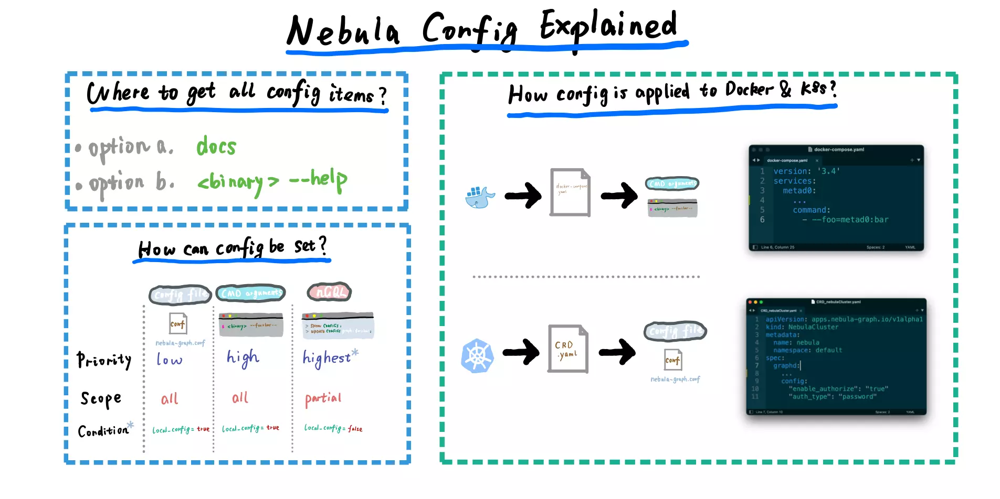

# Nebula Config Explained

<!--more-->

> Nebula Graph config explained

这个手记帮助我们理解 Nebula Graph 的配置相关的知识：

- 介绍 Nebula Graph 三种配置方式，它们的优先级、范围、生效条件 [0:16](https://www.youtube.com/watch?v=jW-Ij3S7Efo&list=PLt6F0VdE9EzFjNb9RSqmtqVWfj9hG_Q4G&index=8&t=16s)
- 介绍 Nebula Graph 在 Docker-Compose/Swarm 部署情况下配置的方式 [03:01](https://www.youtube.com/watch?v=jW-Ij3S7Efo&list=PLt6F0VdE9EzFjNb9RSqmtqVWfj9hG_Q4G&index=8&t=181s)
- 介绍 Nebula Graph 在 K8s Operator 部署情况下配置的方式 [03:55](https://www.youtube.com/watch?v=jW-Ij3S7Efo&list=PLt6F0VdE9EzFjNb9RSqmtqVWfj9hG_Q4G&index=8&t=235s)
- 我们是否应该用 Local-Config？（剧透：应该） [05:03](https://www.youtube.com/watch?v=jW-Ij3S7Efo&list=PLt6F0VdE9EzFjNb9RSqmtqVWfj9hG_Q4G&index=8&t=303s)

## Bilibili

> 上传中...

## Youtube



