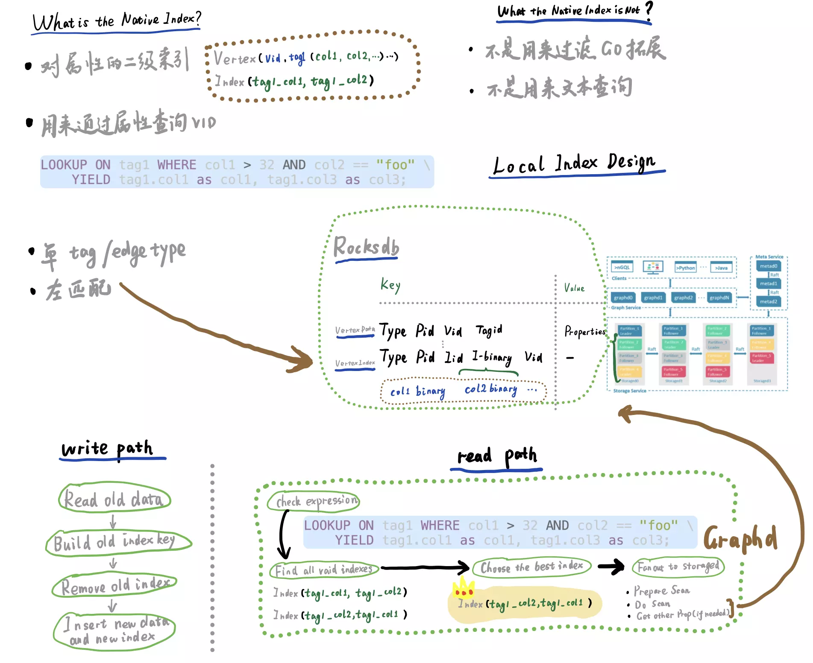

# Nebula Graph Index Demystified

<!--more-->

> Nebula Graph 原生索引解谜，帮助大家深入了解 Nebula Graph Index 原生索引，到底 Nebula Graph 的原生索引是做什么用的？为什么 Nebula Graph 索引对性能有一些影响？带有索引的写入过程是什么样的？

- Index Demystified [0:33](https://www.youtube.com/watch?v=fII4hAM6S60&t=33s)
- When should we use index? [06:37](https://www.youtube.com/watch?v=fII4hAM6S60&t=397s)
- Index v.s. Fulltext Index [07:12](https://www.youtube.com/watch?v=fII4hAM6S60&t=432s)
- Index Performance Impact [08:03](https://www.youtube.com/watch?v=fII4hAM6S60&t=483s)

## Bilibili



## Youtube



