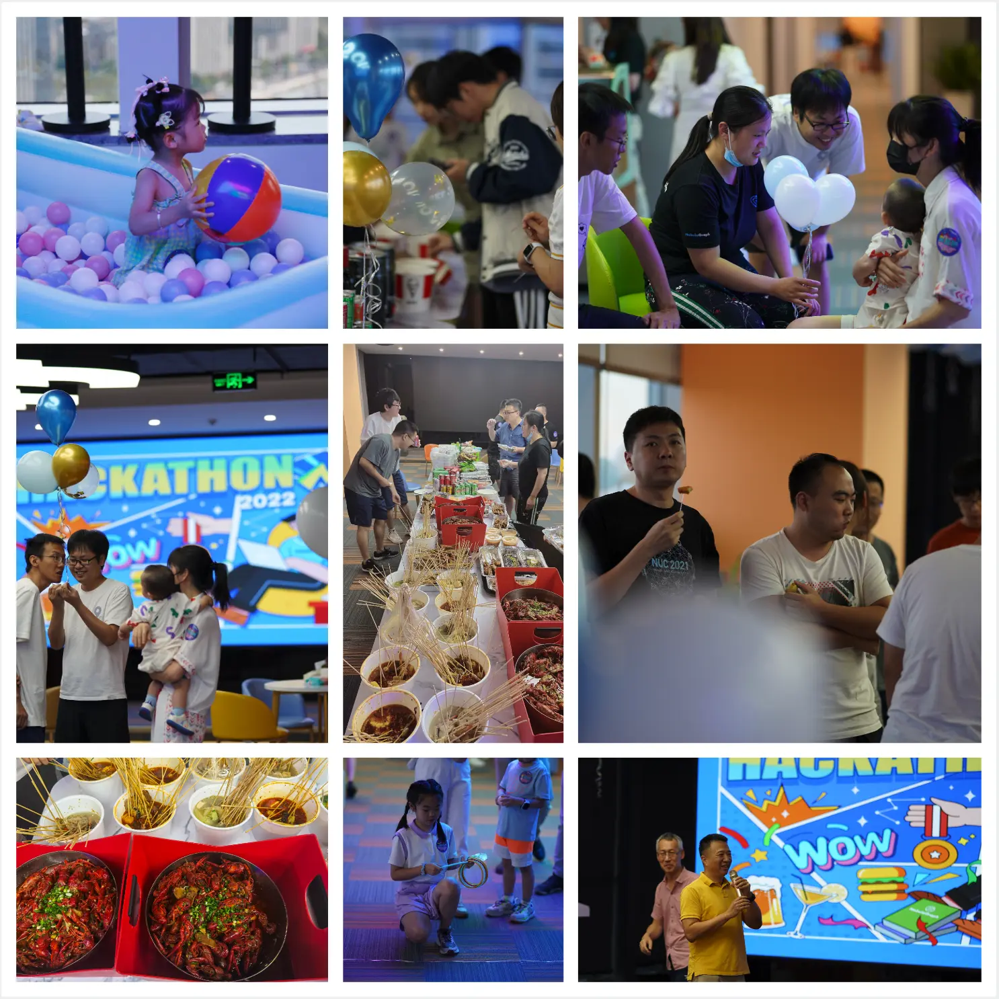

# Vesoft Hackathon 2022 流水账

NebulaGraph 终于有 Fuzz 测试工具了，NebulaGraph 上跑向量搜索，基于 Kubesphere 的多集群 PaaS...

<!--more-->

上周五周六跑到 office 参加了第一次公司内部的黑客马拉松，非常开心，这里记录一下流水账。

## 组队报名

组队，差不都一个月之前，大家开始自由组队，做出来不限任何形式的 NebulaGraph 和 Vesoft 上的项目、改进都可以。

吴老师（NebulaGraph 团队第一位博士，CR PD Arch）找到我问要不要一起搞 GNN/DGL + NebulaGraph 的 PoC 参赛，我当然超级开心参加，而且刚好我在写 Fraud Detection 的文章，在自己的 todo list 上一直想要研究一下 NebulaGraph + DGL 要怎么做！

吴老师还拉了：小狼（NebulaGraph Logo 和可视化工具的设计师），Pandasheep（NebulaGraph Storage Contributor、集群同步作者），HarrisChu（NebulaGraph Bench 作者、测试平台架构师）。

至此，NebulaGraph-Deep 成团出道。

## 时间

- 周五晚上 6 点开始，到周六 12 点截止。
- 周六下午 1 点开始做 Presentation。

时间的安排上，只有一个晚上，不过我们团队基本上在开始前就写完了大部分实现，最后的晚上就是看最后怎么 demo 呈现，以及吃烧烤，聊天 :-D

同一时间，还是公司开放日、嘉年华，很多以前的同事和现在的同事家人（小朋友）也来一起玩耍热闹，非常开心看到了我的入职 Metor，现在全职在家带娃的 Laura ！大家还记得她吧（尤其是开源之夏的同学们）？

## 项目介绍

这次有 6 个项目，我按照顺序会议一下：

- 🎖NebulaGraph 成就系统，由学院的同学们做的一整套带有成就徽章系统的 NebulaGraph 课程、教程服务，在这个基础之上延伸出好多可能性，很期待之后可以上线去考几个下来加到我的 LinkedIn Profile 里！

- 🧠 NebulaGraph-Deep ，就是我们团队，这个 PoC 由三部分组成：

  - Nebula-DGL，从 NebulaGraph 中读取数据为 DGL 的图对象，进行 GNN训练的连接器，适合批量训练。在此之上，做了一个 GNN 的 Fraud Detection 的端到端实时系统。
    - https://github.com/wey-gu/nebula-dgl
    - https://github.com/wey-gu/NebulaGraph-Fraud-Detection-GNN
  - Nebula-DGL Listener，一个 NebulaGraph 存储节点的 listener 进程，实时把数据写成 DGL 支持的 CSV 格式，适合批量以及追加（流式）训练。
  - NebulaGraph Notebook Adapter，有了它，我们可以在 Jupyter Notebook 里实时 Query NebulaGraph，并且渲染为可交互的图，它是基于在 AWS 开源的 Graph Notebook 之上的工作，而且这个实现很聪明无需 Fork 上游，只需要在中间加了一个 proxy 去格式化返回的结果就好了。
    - https://github.com/HarrisChu/nebula-opencypher-adapter

- 📊 New Vesoft Portal ，云团队前端同学们搞的，把内部各种平台全都无缝接到一起，统一健全授权，接驳了包括内部的测试平台（NebulaGraph 内部好几个不同维度的自动测试平台，敬请期待后续社区会议这个专题的分享）、内部 NebulaGraph 集群的 Dashboard、CMS、WIKI、CMS 、license 管理等。

  - 其中最最有意思的是这个 PoC 项目里他们做了一个 WYSIWYG（所见即所得）的 No Code 接口，让市场、运营、人力资源的同学可以自服务按需创建活动页面，超级方便。

- ☁️ NebulaGraph Cloud Platform，云团队同学们搞的，用 Kubesphere 做的自服务 NebulaGraph 内核加各种周边工具平台，更方便开发、测试同学 ad-hoc 创建 ephemeral（转瞬即逝） 的 NebulaGraph 集群，在这之前，大家都是以 Pet 的方式去申请 VM 或者 BM，资源的利用上比较浪费，有了这个平台，大家可以灵活践行 cattle 模式的 DevOps。 

  - 哈哈公司的前 Kubesphere 同学看到这个项目超级兴奋，我懂

  > 注：pet vs cattle，就是宠物 vs 牲口是一个 DevOps 的概念：前者指的是分配长期运行的 VM，大家像是宠物一样给集群命名，一直挂在那里，而后者指的是不会被命名的牲口 VM、资源，用的时候牵过来，用完了残忍杀掉，不会给他起名字的理念。

- 🤖 NebulaGraph Buzz Test，终于，文林同学给 NebulaGraph 带来了 Buzz Test 工具，这是我知道已经被很多人期待、询问的 missing tool 了，它可以按照一定配置和比例生成随机形式的 Query 然后实时发给给定的 NebulaGraph 集群，实践 Buzz Testing！👍🏻，欢迎大家都去它的 repo 收藏、尝鲜、贡献起来！

  - https://github.com/kikimo/gqlfuzzer

- 🌌 星璇 Merak，存储团队的同学们带来了 NebulaGraph 上进行向量检索，在 PoC 实现里，他们给出了 HNSW 的实现，他们把点的向量表示以 string 的方式存储、HNSW 中的 Layer 以边之中的 rank存储，最终可以在 NebulaGraph 里搜索向量表示所在空间相邻近的点，是不是超级超级酷？！

  - 好像介绍更多呀，不过 KNN 这方面一直是我的知识盲区，之前想学习下 milvus 也一直没能开始，惭愧，在有越来越多业务以实时图查询作为核心逻辑，把图库作为 Single Source of Truth 需求的背景下，图库上的向量搜索真的会超级方便图为主、KNN 需求为辅的用户，这个项目真的超酷，超有想象力。

## 感想和之后的工作

- 作为远程/分布式团队，加上一直有新的同学加入，我其实一直有好多 vesoft 同学没见面过、没对上号，借着这次机会认识了大家特别特别开心；

- 答辩的时候知道了一个和我们项目相关的惊喜，先保密一下，过一阵子揭晓，超级兴奋，另外答辩过程中了解到公司有一些同学对 GNN 有很多经验，以后可以多多请教啦；

- 常常接着 Hackathon 这样一起快速 build things 真的很让人满足；

- 之后打算慢慢打磨 https://github.com/wey-gu/nebula-dgl ，增加 exporter 的支持，这次为它设计的 yaml 格式的 API 自我感觉挺不错的，之后准备推广一下这个项目，看看大家用起来到底如何；

- 我会写一篇单独文章介绍 https://github.com/wey-gu/NebulaGraph-Fraud-Detection-GNN 这个端到端的 GNN + NebulaGraph 项目，不会前端的我每次再一次零知识写 vue3 + socketIO 经历了反正也是【再】从头学，不如用 vue3 吧，然后用过所有的 websocket/socketio vue3 封装出现了各种问题最后还是乖乖从头看 socketio 文档，用最基础的库从头看 composition api guide 去撸 🤦🏻‍♀️，不过有了这个基础应该可以很快给大家写出其他场景下的示例项目啦；

- 感觉是时候弄一个 awesome-nebulagraph 的 markdown 项目区罗列各种好东西了，把大家这些散落在各地的宝藏集中整理一下；

## 感谢

感谢 HR 小姐姐们的辛苦付出（这次大家好像都鸡贼提前弄好代码早就跑去睡觉，反而是小姐姐们忙到 3 点多）。

期待下一次 Vesoft 或者 NebulaGraph 公开 Hackathon！

Happy Graphing!

